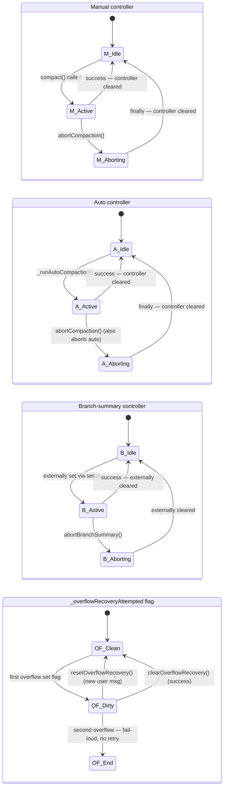

# Context Window Management (CORE-02)

> Phase 2 reference doc. Documents how GSD-2 tracks token usage, decides when to compact, generates and persists context summaries, computes prompt-budget allocations, and survives context-window resets via a lossy snapshot. Companion to:
> - kb/core/agent-lifecycle.md (Phase 1 — agent lifecycle and the trigger SURFACE for compaction)
> - [kb/core/provider-abstraction.md](provider-abstraction.md) (Phase 3 — provider-specific context-window enumeration / streaming internals)
> - kb/core/tool-system.md (Phase 4 — tool definitions/security)
> - kb/extensions/plugin-system.md (Phase 8 — extension internals incl. full register-hooks survey)
> - kb/state/persistence.md (Phase 11 — state persistence; atomic-write protocol if it generalizes)
> - kb/prompts/template-system.md (Phase 16 — how budgets feed prompt assembly)
> - kb/app/session-manager.md (Phase 18 — full session-manager walkthrough; this doc covers compaction slices only)

---

## 1. File Catalogue

Five primary files own the context-window subsystem, plus three supporting files cited in passing. Each entry below follows the format: path, line count, package scope, role, key exports/landmarks, walkthrough status, and phase ownership. The format mirrors `kb/core/agent-lifecycle.md` §1 exactly.

---

### `compaction-orchestrator.ts` (440 lines)

- **Path:** `gsd-2/packages/pi-coding-agent/src/core/compaction-orchestrator.ts`
- **Lines:** 440
- **Package:** `@gsd/pi-coding-agent`
- **Role:** `CompactionOrchestrator` class — coordinates manual `/compact`, threshold-triggered auto-compaction, overflow-recovery reactive compaction, and branch-summary aborts. Holds three independent `AbortController`s plus a one-shot `_overflowRecoveryAttempted` flag. Emits `auto_compaction_start` / `auto_compaction_end` on Bus A via injected `emit`.
- **Key exports / landmarks:**
  - `class CompactionOrchestrator` (compaction-orchestrator.ts:47)
  - `CompactionOrchestratorDeps` interface (compaction-orchestrator.ts:33) — DI surface
  - `_overflowRecoveryAttempted` flag (compaction-orchestrator.ts:50) — one-shot per user message
  - `isCompacting` getter (compaction-orchestrator.ts:56-62) — derived OR over the 3 controllers
  - `resetOverflowRecovery()` (compaction-orchestrator.ts:65) / `clearOverflowRecovery()` (compaction-orchestrator.ts:70)
  - `branchSummaryAbortController` getter/setter (compaction-orchestrator.ts:74-80)
  - `compact()` (manual path) — opens at `compaction-orchestrator.ts:90`
  - `abortCompaction()` (compaction-orchestrator.ts:191-195) / `abortBranchSummary()` (compaction-orchestrator.ts:197-200)
  - `checkCompaction()` (compaction-orchestrator.ts:213-275) — the entry point used per-assistant-message
  - `_runAutoCompaction()` (compaction-orchestrator.ts:291) — the auto/overflow path that emits `auto_compaction_start`
  - `_scheduleAutoCompactionFollowup()` (compaction-orchestrator.ts:420-432) — `setTimeout(continue, 100)` after success
- **Walkthrough status:** full — [`../walkthroughs/compaction-orchestrator.ts.md`](../walkthroughs/compaction-orchestrator.ts.md)
- **Phase ownership:** Phase 2 (CORE-02). Backlink: Phase 1's [`kb/core/agent-lifecycle.md`](./agent-lifecycle.md) §5 documents the *trigger surface* (3 controllers, the `_overflowRecoveryAttempted` flag, `shouldCompact` signature); this doc + walkthrough cover the *algorithm internals*.

---

### `compaction/compaction.ts` (981 lines)

- **Path:** `gsd-2/packages/pi-coding-agent/src/core/compaction/compaction.ts`
- **Lines:** 981
- **Package:** `@gsd/pi-coding-agent`
- **Role:** Pure-function compaction primitives — token estimation, cut-point detection, summary-generation prompts, single-pass-vs-chunked decision, split-turn parallel summarization, file-operation extraction. No I/O outside LLM calls; no global state.
- **Key exports / landmarks:**
  - `shouldCompact()` (compaction.ts:200-210) — the dual-mode decision (`thresholdPercent` overrides `reserveTokens`)
  - `calculateContextTokens()` (compaction.ts:112-114) — read tokens from `usage`
  - `estimateContextTokens()` (compaction.ts:163-191) — heuristic fallback when usage missing
  - `getAssistantUsage()` / `getLastAssistantUsage()` / `getLastAssistantUsageInfo()` (compaction.ts:120-157)
  - `ContextUsageEstimate` interface (compaction.ts:144-149)
  - `estimateTokens()` (compaction.ts:220-278) — `chars/4` heuristic
  - `findValidCutPoints()` (compaction.ts:287-322) — never cut at toolResult
  - `findTurnStartIndex()` (compaction.ts:329-344) — walk back to user turn
  - `findCutPoint()` (compaction.ts:371-433) — the walk-back algorithm
  - `SUMMARIZATION_PROMPT` (compaction.ts:439-470) — initial-summary prompt
  - `UPDATE_SUMMARIZATION_PROMPT` (compaction.ts:472-509) — iterative-merge prompt
  - `TURN_PREFIX_SUMMARIZATION_PROMPT` (compaction.ts:865-878) — split-turn prefix variant
  - `isDegenerateSummary()` (compaction.ts:567-579) — issue #4665 guard
  - `generateSummary()` (compaction.ts:594-703) — single-pass-vs-chunked dispatch
  - `prepareCompaction()` (compaction.ts:791-859) — boundary math + windowing
  - `compact()` (compaction.ts ≈ 880-955) — top-level entry; includes the split-turn `Promise.all` branch (compaction.ts:908-925)
  - `extractFileOperations()` (compaction.ts:29-78) / `formatFileOperations` tail-append (compaction.ts:940-941)
  - `CompactionProducedNoSummaryError` (compaction.ts:711-716)
- **Walkthrough status:** full — [`../walkthroughs/compaction.ts.md`](../walkthroughs/compaction.ts.md)
- **Phase ownership:** Phase 2 (CORE-02).

---

### `compaction-snapshot.ts` (165 lines)

- **Path:** `gsd-2/src/resources/extensions/gsd/compaction-snapshot.ts`
- **Lines:** 165
- **Package:** GSD orchestrator extension (not part of `pi-coding-agent` core)
- **Role:** Lossy markdown digest at `<projectRoot>/.gsd/last-snapshot.md` (≤2KB). Survives context-window resets so the orchestrator can reorient after a fresh agent process boots. Three-tier markdown shape: active context / top memories / recent exec runs.
- **Key exports / landmarks:**
  - `DEFAULT_SNAPSHOT_BYTES = 2048` (compaction-snapshot.ts:14)
  - `SNAPSHOT_FILENAME = "last-snapshot.md"` (compaction-snapshot.ts:15)
  - `buildSnapshot()` (compaction-snapshot.ts:42-86) — the 3-tier composer
  - `enforceByteCap()` (compaction-snapshot.ts:88-99) — UTF-8-safe truncation via `Buffer.subarray`
  - `writeCompactionSnapshot()` (compaction-snapshot.ts:113-139) — write-side (NOT atomic; see §7.3)
  - `readCompactionSnapshot()` (compaction-snapshot.ts:141-149) — read-side; `null` on missing/error
- **Walkthrough status:** full — [`../walkthroughs/compaction-snapshot.ts.md`](../walkthroughs/compaction-snapshot.ts.md)
- **Phase ownership:** Phase 2 (CORE-02).

---

### `context-budget.ts` (268 lines)

- **Path:** `gsd-2/src/resources/extensions/gsd/context-budget.ts`
- **Lines:** 268
- **Package:** GSD orchestrator extension
- **Role:** Pure-function budget engine. Resolves the active context-window in tokens (preferences → session → default), applies the Claude-Code 200K clamp, and derives the summary / inline-context / verification budgets plus a tiered task-count range. **NOTE:** the original Phase 2 CONTEXT.md framed budget computation as "auto-prompts.ts slices" — but the *engine* lives here in `context-budget.ts`. `auto-prompts.ts` is a *consumer* (`capPreamble`, `formatExecutorConstraints`, snapshot preamble injection at L218).
- **Key exports / landmarks:**
  - Ratio constants (context-budget.ts:18-42): `SUMMARY_RATIO=0.15`, `INLINE_CONTEXT_RATIO=0.40`, `VERIFICATION_RATIO=0.10`, `CHARS_PER_TOKEN=4`, `DEFAULT_CONTEXT_WINDOW=200_000`, `CLAUDE_CODE_EFFECTIVE_CONTEXT_WINDOW=200_000`, `CONTINUE_THRESHOLD_PERCENT=70`, `TASK_COUNT_MIN=2`
  - `TASK_COUNT_TIERS` (context-budget.ts:45) — descending `[threshold, max]` table
  - `BudgetAllocation` interface (context-budget.ts:61)
  - `computeBudgets()` (context-budget.ts:101-116) — the pure function
  - `resolveExecutorContextWindow()` (context-budget.ts:177-205) — 3-step fallback chain
  - `resolveTaskCountMax()` (context-budget.ts:223-228) — linear scan over `TASK_COUNT_TIERS`
  - `resolveEffectiveContextWindow()` (context-budget.ts:230-235) — Claude-Code 200K clamp (issue #4676)
  - `truncateAtSectionBoundary()` (context-budget.ts:118-166; regex at L243) — section-aware budget truncation
- **Walkthrough status:** none separate — this doc's §6 is its annotated reference. The file is small enough and pure enough that a chapter-by-chapter walkthrough would mostly duplicate the source.
- **Phase ownership:** Phase 2 (CORE-02).

---

### `session-manager.ts` (compaction slices only)

- **Path:** `gsd-2/packages/pi-coding-agent/src/core/session-manager.ts`
- **Lines:** 1646 total — **~270 in scope here** (the compaction-related slices only)
- **Package:** `@gsd/pi-coding-agent`
- **Role for Phase 2:** Persistence of `CompactionEntry` to the append-only session log + the consumer-side `buildSessionContext()` that re-emits compaction summaries on session restore. The *full* session-log schema (versioning, blob externalization, secret redaction, branching) is Phase 18 territory.
- **Key exports relevant to Phase 2:**
  - `CompactionEntry<T>` interface (session-manager.ts:92-101) — schema for the persisted entry
  - `getLatestCompactionEntry()` — lookup helper used by the orchestrator's "from-before-compaction" guard (compaction-orchestrator.ts:226)
  - `appendCompaction()` (session-manager.ts:1091-1112) — producer-side write
  - `buildSessionContext()` (session-manager.ts:351-462) — consumer-side reconstruction
  - Schema migration from `firstKeptEntryIndex → firstKeptEntryId` (session-manager.ts:268-274)
- **Walkthrough status:** SLICED — [`../walkthroughs/session-manager.ts.md`](../walkthroughs/session-manager.ts.md) (compaction slices only). Full walkthrough = Phase 18.
- **Phase ownership:** Phase 2 (compaction slices only); Phase 18 (everything else).

---

**Supporting files referenced but not deep-dived in this doc:**

- `bootstrap/register-hooks.ts` — snapshot-write trigger slice at `register-hooks.ts:98-128, 293-349`. Only the `session_before_compact` half of L293-349 is Phase 2's; the `*-CONTINUE.md` checkpoint half is Phase 8/11/18 territory. Full file = Phase 8.
- `tools/resume-tool.ts` (40 lines) — the `gsd_resume` snapshot-read consumer at `resume-tool.ts:14-40`. Full extension-tools survey = Phase 8.
- `auto-prompts.ts` slices — budget consumers and snapshot-preamble injection. In-scope line ranges: `auto-prompts.ts:53` (`MAX_PREAMBLE_CHARS = 30_000`), `auto-prompts.ts:65-75` (`resolvePromptBudgets`), `auto-prompts.ts:187-195` (`capPreamble`), `auto-prompts.ts:209-222` (`renderContextModeBlockForPrompt` — snapshot preamble injection at L218), `auto-prompts.ts:243-270` (`formatExecutorConstraints`), `auto-prompts.ts:2249-2257` (verification-budget consumer). Full file = Phase 16.

---

## 2. Token Accounting & Tracking

The orchestrator needs a token count for *every* assistant message to decide whether to compact before the next turn. Two paths exist: (a) read the count out of the provider's `usage` field when present, (b) heuristically estimate when the message is an error turn (no usage present). The choice is made at `compaction-orchestrator.ts:255-271`.

### 2.1 The chars/4 heuristic — `estimateTokens`

Defined at `compaction.ts:220-278`. Walks an `AgentMessage`'s `content` array and sums character counts across text parts, tool-use parts, and tool-result parts, then divides by `4` (the canonical OpenAI/Anthropic rule-of-thumb). Image content contributes a fixed token approximation; thinking blocks are counted only when present.

The heuristic is known-imprecise. Real tokenizers vary by 20-40% from `chars/4` depending on language and code density. The codebase accepts this imprecision because the heuristic is only used (i) when the LLM gave us nothing better (an error turn with no `usage`), and (ii) for the trailing-message correction inside `estimateContextTokens` (§2.3).

### 2.2 The success path — `calculateContextTokens`

Defined at `compaction.ts:112-114`. A single line: read the LLM's reported `usage.input_tokens + usage.cache_read_input_tokens` (or whatever the provider's `Usage` shape is) and return it. This is the *authoritative* token count when available — the LLM literally tells us how many tokens its prior context held.

`getAssistantUsage` (`compaction.ts:120-157`) extracts a `Usage | undefined` from an `AgentMessage`. `getLastAssistantUsage` and `getLastAssistantUsageInfo` walk a message array backwards looking for the most recent assistant message that has a usage attached; the latter returns both the usage and the index, which `estimateContextTokens` uses as a starting point for trailing-message correction.

### 2.3 The error-turn path — `estimateContextTokens`

Defined at `compaction.ts:163-191`. Used when the *most recent* assistant message has `stopReason === "error"` (no usage). The algorithm:

1. Find the last assistant message that *does* have usage (`getLastAssistantUsageInfo`).
2. Take its `usage` as the baseline `usageTokens` (the LLM's authoritative count up through that point).
3. Walk forward over messages that came *after* the last good usage and add their `estimateTokens(message)` to `trailingTokens`.
4. Return `usageTokens + trailingTokens`.

The intent: even when the latest turn errored out, we still have a recent ground-truth from a prior successful turn, plus a heuristic correction for everything that has accumulated since.

### 2.4 The orchestrator's choice — `compaction-orchestrator.ts:255-271`

Inside `checkCompaction()`, after the overflow guard has been cleared (§3 below), the orchestrator picks a token source for the threshold check:

```typescript
const contextTokens =
  assistantMessage.stopReason === "error"
    ? estimateContextTokens(branchEntries.map(e => e.message))
    : calculateContextTokens(assistantMessage.usage);
```

Translation: *if the latest turn was an error, fall back to the heuristic+correction estimate; otherwise trust the provider's count.* The `else` branch is the common case in successful operation; the `if` branch covers the brittle case where a malformed model response would otherwise pin us to a stale token count and miss a real overflow.

### 2.5 The `ContextUsageEstimate` interface

Defined at `compaction.ts:144-149`. Returned by `getLastAssistantUsageInfo` (and by the test-only seam helpers). Shape:

```typescript
interface ContextUsageEstimate {
  index: number;     // index of the assistant msg whose usage was used
  usage: Usage;      // the usage block itself
}
```

`estimateContextTokens` uses `index` as the walk-forward starting point.

**Cross-references for §2:** the success-vs-error decision is walked in [`../walkthroughs/compaction-orchestrator.ts.md`](../walkthroughs/compaction-orchestrator.ts.md) §6. The estimation primitives themselves — `estimateTokens`, `calculateContextTokens`, `estimateContextTokens` — are walked in [`../walkthroughs/compaction.ts.md`](../walkthroughs/compaction.ts.md) §3.

---

## 3. Compaction Decision Algorithm

When fires: per-assistant-message, immediately after `message_end`, before the next user message goes out. The entry point is `CompactionOrchestrator.checkCompaction()` at `compaction-orchestrator.ts:213-275`.

### 3.1 The four-stage branch

`checkCompaction` walks four guard stages in sequence. Any stage that decides "do nothing" returns early; only the threshold check at the end actually triggers compaction.

```
checkCompaction(assistantMessage, skipAbortedCheck=true)
  │
  ├─ Stage A: if (skipAbortedCheck=false && stopReason==="aborted") return
  │           [compaction-orchestrator.ts:217 — aborted-message guard]
  │
  ├─ Stage B: if (assistantMessage is from before the latest CompactionEntry) return
  │           [compaction-orchestrator.ts:226-229 — "from-before-compaction" guard]
  │           Fetched via getLatestCompactionEntry(branchEntries) and timestamp comparison
  │
  ├─ Stage C: if (sameModel && isContextOverflow(assistantMessage, contextWindow))
  │             [compaction-orchestrator.ts:232 — overflow detection]
  │             ├─ if (_overflowRecoveryAttempted) emit auto_compaction_end {willRetry:false} and return
  │             │   [compaction-orchestrator.ts:233-243 — second-overflow within same user message]
  │             │
  │             ├─ _overflowRecoveryAttempted = true
  │             │   [compaction-orchestrator.ts:245]
  │             │
  │             ├─ messages = messages.slice(0, -1)
  │             │   [compaction-orchestrator.ts:246-249 — strip the failed assistant turn]
  │             │
  │             └─ await _runAutoCompaction("overflow", willRetry=true)
  │                 [compaction-orchestrator.ts:250]
  │             return
  │
  └─ Stage D: contextTokens = stopReason==="error"
                ? estimateContextTokens(...)
                : calculateContextTokens(usage)
              [compaction-orchestrator.ts:255-271]
            if (shouldCompact(contextTokens, contextWindow, settings))
              await _runAutoCompaction("threshold", willRetry=false)
              [compaction-orchestrator.ts:272-274]
```

### 3.2 The from-before-compaction guard

Stage B is the subtlest: when a manual `/compact` runs mid-conversation, the orchestrator writes a new `CompactionEntry` but does NOT delete the original assistant messages from the session log (the log is append-only — see §5). On the next assistant turn, `checkCompaction` runs again and would otherwise see a "huge" context (because it counts entries from the message array, which still includes the pre-compaction history).

The guard at `compaction-orchestrator.ts:226-229` does:

```typescript
const compactionEntry = getLatestCompactionEntry(branchEntries);
if (compactionEntry && assistantMessage.timestamp <= compactionEntry.timestamp) return;
```

If the assistant message we're checking *predates* the latest compaction, it's already-summarized history — skip it. The next *new* assistant message (post-compaction) will pass this guard and be eligible for re-evaluation.

### 3.3 `shouldCompact` — the dual-mode decision

Defined at `compaction.ts:200-210`. Signature:

```typescript
shouldCompact(contextTokens: number, contextWindow: number, settings: CompactionSettings): boolean
```

Two mutually exclusive modes depending on which field of `settings` is set:

- **`thresholdPercent`** (a fraction in `(0, 1)`): if present, overrides `reserveTokens` and triggers when `contextTokens / contextWindow >= thresholdPercent`. The GSD orchestrator extension expresses its compaction policy this way.
- **`reserveTokens`** (absolute count): used when `thresholdPercent` is absent. Triggers when `contextWindow - contextTokens <= reserveTokens` — i.e., we're within `reserveTokens` of the ceiling.

The dual-mode behavior is the substrate for the [`../patterns/compaction-threshold-management.md`](../patterns/compaction-threshold-management.md) Phase-1 sibling pattern (which covers the trigger surface — 3 controllers, the `_overflowRecoveryAttempted` flag, this signature). Phase 2's [`../patterns/auto-compaction-trigger.md`](../patterns/auto-compaction-trigger.md) covers the *full decision algorithm* including the four-stage branch above, while [`../patterns/overflow-recovery-one-shot.md`](../patterns/overflow-recovery-one-shot.md) covers the `_overflowRecoveryAttempted` flag in isolation.

### 3.4 The asymmetric `auto_compaction_start` reasons

Three reason values fire on the Bus A `auto_compaction_start` event, and their emission asymmetry is worth documenting precisely:

| Reason     | Source path | Emitted? |
|------------|-------------|----------|
| `"manual"` | User typed `/compact` (or extension command) → `CompactionOrchestrator.compact()` at `compaction-orchestrator.ts:90`+ | **NOT emitted on the Bus A** `auto_compaction_*` events. The manual path runs through a different code path (not `_runAutoCompaction`). Phase 1 §5.1 left this as an open question; Plan 01's walkthrough [`../walkthroughs/compaction-orchestrator.ts.md`](../walkthroughs/compaction-orchestrator.ts.md) §6 corroborated: only `_runAutoCompaction` emits `auto_compaction_start`, and the manual path does not call it. Manual operations are observable via session-state-changed and the resulting `CompactionEntry` write, not via `auto_compaction_*`. |
| `"threshold"` | Stage D (`shouldCompact` returned true) → `_runAutoCompaction("threshold", false)` at `compaction-orchestrator.ts:273` | Yes — `emit({type:"auto_compaction_start", reason:"threshold"})` at `compaction-orchestrator.ts:294` |
| `"overflow"` | Stage C (provider rejected with overflow error) → `_runAutoCompaction("overflow", true)` at `compaction-orchestrator.ts:250` | Yes — same emit site |

The `willRetry` parameter to `_runAutoCompaction` flows into the `auto_compaction_end` payload; `"threshold"` paths set `willRetry:false` (we triggered before failing), `"overflow"` paths set `willRetry:true` (we already failed once and are retrying after compaction).

### 3.5 The follow-up scheduler

After a successful auto-compaction, the orchestrator schedules a continuation via `_scheduleAutoCompactionFollowup` at `compaction-orchestrator.ts:420-432`:

```typescript
setTimeout(() => this._deps.continue(), 100);
```

The 100ms delay is intentional — it lets the Bus A `auto_compaction_end` event propagate to UI listeners before the next agent turn begins, so the UI can render the compaction-summary message before the streaming assistant response over-writes it visually.

**Cross-references for §3:** [`../walkthroughs/compaction-orchestrator.ts.md`](../walkthroughs/compaction-orchestrator.ts.md) §6 (line-by-line of `checkCompaction`); [`../patterns/auto-compaction-trigger.md`](../patterns/auto-compaction-trigger.md); [`../patterns/overflow-recovery-one-shot.md`](../patterns/overflow-recovery-one-shot.md); [`../patterns/branch-summary-abort.md`](../patterns/branch-summary-abort.md) (the multi-controller cooperative cancellation that the auto path joins onto); Phase-1 sibling [`../patterns/compaction-threshold-management.md`](../patterns/compaction-threshold-management.md).

---

## 4. Summary Generation

Once Stage C or Stage D of §3 has decided *yes, compact*, the orchestrator dispatches into `compact()` (`compaction.ts` ≈ L880-955). `compact` is the public entry point that orchestrates cut-point detection, preparation, single-pass-vs-chunked dispatch, prompt selection, degenerate-output recovery, optional split-turn parallelization, and file-operation tail append. The seven subsections below dissect each concern.

### 4.1 Cut-Point Detection

A *cut point* is the index in the message array where the boundary between "history that gets summarized" and "history that survives verbatim" lands. Cutting at the wrong point leaves dangling tool calls (a `tool_use` summarized but the matching `tool_result` kept, or vice versa) — which crashes the LLM on the next turn.

Three functions in concert:

- **`findValidCutPoints(entries, startIndex, endIndex)`** at `compaction.ts:287-322`. Returns the indices in `[startIndex, endIndex)` where a cut would not orphan a tool-use/tool-result pair. The rule (paraphrased): never cut inside a turn that contains tool calls; never cut at a `toolResult`-only message. Cut points are user-message boundaries or assistant-only boundaries.
- **`findTurnStartIndex(entries, entryIndex, startIndex)`** at `compaction.ts:329-344`. Given an arbitrary `entryIndex`, walk backwards to the start of the user-turn that contains it. Used to round arbitrary token-target indices to a clean turn boundary.
- **`findCutPoint(entries, startIndex, endIndex, targetTokens)`** at `compaction.ts:371-433`. The walk-back algorithm: starting from `endIndex`, walk backwards summing `estimateTokens(entry.message)` until the running total exceeds `targetTokens`. Then snap the result to the nearest valid cut point via `findValidCutPoints`, then snap to the turn-start via `findTurnStartIndex`. The output is a single index that satisfies all three constraints (token-target hit, valid cut, turn-aligned).

The walk-back direction is intentional: the orchestrator wants to *keep* the most recent context (highest signal density) and summarize *older* context. Walking backwards from `endIndex` accumulates "we want to keep this" until the running total exceeds the keep-budget; the cut lands wherever we hit the budget.

Walked line-by-line in [`../walkthroughs/compaction.ts.md`](../walkthroughs/compaction.ts.md) §4.

### 4.2 Preparation — `prepareCompaction`

Defined at `compaction.ts:791-859`. Pre-flight: takes a `CompactionRequest` (messages, model config, settings) and returns a `PreparedCompaction` containing:

- The cut-point index (from `findCutPoint`)
- The slice to summarize (`messages[startIndex..cutIndex]`)
- The slice to keep verbatim (`messages[cutIndex..endIndex]`)
- The token-budget for the summary call (derived from `contextWindow - reserveTokens - 4000`; see §4.3)
- The `previousSummary` (if a `CompactionEntry` already exists for an earlier compaction in this branch — used to drive the iterative-merge prompt selection)

`prepareCompaction` does no LLM I/O. It is pure-functional. The orchestrator can call it speculatively (e.g., to display a "this would be summarized" preview) without committing to actually compacting.

Walked in [`../walkthroughs/compaction.ts.md`](../walkthroughs/compaction.ts.md) §9.

### 4.3 Single-Pass vs Chunked — `generateSummary`

Defined at `compaction.ts:594-703`. Decides between two modes depending on input size:

```
maxInputTokens = contextWindow - reserveTokens - 4000
                                                  ↑
                                       output buffer (the LLM's response itself
                                       must fit somewhere; 4K is a conservative
                                       reserve for the summary output + headroom)

if (estimateTokens(slice) <= maxInputTokens):
  → single-pass: one LLM call, full slice in the prompt
else:
  → chunked: split slice into N sub-slices each within maxInputTokens,
             generate one summary per chunk via Promise.all, then iteratively
             merge them with UPDATE_SUMMARIZATION_PROMPT (each merge step
             also subject to maxInputTokens).
```

The chunked path is what makes 1M-token windows tractable — without it, a single summary call would itself overflow. The merge step uses the same `maxInputTokens` ceiling, so a tree of merges is built rather than a single unbounded merge.

Walked in [`../walkthroughs/compaction.ts.md`](../walkthroughs/compaction.ts.md) §7.

### 4.4 Iterative-Merge Prompts

Two prompts handle the initial-vs-update distinction, plus a third for the split-turn variant (§4.6):

- **`SUMMARIZATION_PROMPT`** (`compaction.ts:439-470`) — the initial-summary prompt. Used when no `previousSummary` exists. Asks the LLM to produce a markdown digest with six sections: **Goal**, **Constraints & Preferences**, **Progress** (with sub-sections Done / InProgress / Blocked), **Key Decisions**, **Next Steps**, **Critical Context**. The prompt explicitly enumerates these section headings and demands them in this order.

- **`UPDATE_SUMMARIZATION_PROMPT`** (`compaction.ts:472-509`) — the iterative-merge prompt. Used when a `previousSummary` exists (any subsequent compaction within the same branch). Same six sections, but with explicit **PRESERVE / ADD / UPDATE** rules: PRESERVE existing items unless they're explicitly invalidated, ADD new items from the new conversation, UPDATE items where new evidence supersedes old. The prompt teaches the LLM how to merge without losing history.

- Selection logic at **`compaction.ts:735`**:
  ```typescript
  let basePrompt = previousSummary ? UPDATE_SUMMARIZATION_PROMPT : SUMMARIZATION_PROMPT;
  ```

The full prompt bodies are not reproduced here — they live verbatim in the source plus in [`../walkthroughs/compaction.ts.md`](../walkthroughs/compaction.ts.md) §5 and the [`../patterns/summary-generation-format.md`](../patterns/summary-generation-format.md) pattern. What matters at this reference-doc level is the **shape**: six markdown sections, fixed ordering, PRESERVE/ADD/UPDATE rules in the iterative case. A Python port can lift the prompts byte-for-byte; only the surrounding orchestration is language-specific.

Optional `customInstructions` (e.g., from extension hooks) are appended at `compaction.ts:736-738`:

```typescript
if (customInstructions) basePrompt += "\n\nAdditional focus: " + customInstructions;
```

The conversation is wrapped in `<conversation>...</conversation>` tags and the previous summary in `<previous-summary>...</previous-summary>` tags before being passed to the LLM (`compaction.ts:746-750`) — XML-style framing both keeps the LLM oriented and makes failure modes (model emits its own `<conversation>` tag in the summary) easy to detect.

### 4.5 Degenerate-Summary Recovery

Issue **#4665**: under certain prompt conditions the LLM will emit either an empty string, a single-word filler ("Done."), or its own copy of the wrapping tags — none of which is a usable summary. The codebase guards against this with:

- **`isDegenerateSummary(summary)`** at `compaction.ts:567-579`. Returns `true` if the summary is empty, contains only whitespace, contains the wrapping `<conversation>` or `<previous-summary>` tags echoed back, or fails a minimum-length sanity check.

- **Double-degenerate retry** at `compaction.ts:628-700`. After the initial summarization call:
  1. If `isDegenerateSummary(chunkSummary)` → retry once with a slightly varied prompt (`compaction.ts:655`).
  2. If `!isDegenerateSummary(retry)` → use the retry result.
  3. If the retry is *also* degenerate, fall through to the **R6 fallback**: use the `previousSummary` unchanged (if one exists), or throw `CompactionProducedNoSummaryError`.

- **`CompactionProducedNoSummaryError`** at `compaction.ts:711-716`. Thrown when generation has truly failed and there's no `previousSummary` to fall back to. The orchestrator catches this and emits `auto_compaction_end {result: undefined, aborted: false, willRetry: false, errorMessage: "..."}`, surfacing the failure to the UI rather than corrupting session state.

The R6 fallback is named after issue #4665's recovery rule "R6: when in doubt, prefer stale-but-correct over fresh-but-broken." Walked in [`../walkthroughs/compaction.ts.md`](../walkthroughs/compaction.ts.md) §6.

### 4.6 Split-Turn Compaction

When a single user turn has produced an unusually large amount of content (e.g., a long-running shell command that emitted megabytes of output), the orchestrator needs to summarize that turn *internally* — splitting the prefix and suffix and summarizing each half — rather than treating the whole turn atomically.

The split-turn `Promise.all` branch at `compaction.ts:908-925` handles this:

```typescript
// Pseudocode
if (turnIsTooLarge) {
  const [prefixSummary, suffixSummary] = await Promise.all([
    generateSummary(prefix, TURN_PREFIX_SUMMARIZATION_PROMPT),
    generateSummary(suffix, SUMMARIZATION_PROMPT),
  ]);
  // merge them
}
```

The `TURN_PREFIX_SUMMARIZATION_PROMPT` at `compaction.ts:865-878` is the third prompt variant: it asks the LLM to extract three things — **Original Request**, **Early Progress**, **Context for Suffix** — in a way that the suffix summary can chain onto. The suffix uses the regular `SUMMARIZATION_PROMPT` because by the time we're summarizing the suffix, we have the prefix summary as `previousSummary` for context.

Walked in [`../walkthroughs/compaction.ts.md`](../walkthroughs/compaction.ts.md) §8.

### 4.7 File-Operation Tracking

Every summary has a structured tail listing which files were read and which were modified during the summarized period. This is a deterministic post-processing step — not LLM-generated — so the file list is always accurate even when the prose summary is degraded.

- **`extractFileOperations(messages)`** at `compaction.ts:29-78`. Walks the message slice that got summarized, picks out tool-use entries for `read`, `write`, `edit`, etc., and extracts their `filePath` arguments. Returns `{readFiles: string[], modifiedFiles: string[]}`.

- **Tail append** at `compaction.ts:940-941`:
  ```typescript
  summary += formatFileOperations(readFiles, modifiedFiles);
  ```

The output is appended to *every* summary regardless of whether degenerate-recovery fired. Even an R6-fallback summary (re-using `previousSummary`) gets the new file-operation tail re-computed from the new slice.

This subsystem's deterministic accuracy is what makes the LLM's prose summary safe to be lossy: no matter what the model says about progress, the file-list tail is ground truth for "what files were touched."

**Cross-references for §4:** chapter-by-chapter in [`../walkthroughs/compaction.ts.md`](../walkthroughs/compaction.ts.md); the prompt structure as a portable pattern in [`../patterns/summary-generation-format.md`](../patterns/summary-generation-format.md).

---

## 5. Compaction Persistence (in-session)

The orchestrator emits Bus A events when compaction starts and ends, but those are *transient* — purely for in-process listeners (UI, telemetry). The *durable* record of compaction lives in the session log as a `CompactionEntry`, written by `appendCompaction` and consumed by `buildSessionContext` on session restore. This is what makes a compaction survive a process restart.

### 5.1 `CompactionEntry` Schema

Defined at `session-manager.ts:92-101`. The shape (paraphrased):

```typescript
interface CompactionEntry<T = unknown> extends SessionEntryBase {
  type: "compaction";
  summary: string;                // The LLM-generated markdown summary (§4)
  firstKeptEntryId: string;       // ID of first non-summarized entry that follows
  tokensBefore: number;           // Token count just before compaction triggered
  details?: T;                    // Optional payload for instrumentation
  fromHook?: boolean;             // True if triggered via beforeCompact extension hook
}
```

Field-by-field annotation:

- **`summary`** — the markdown digest returned by `generateSummary()` (§4.4). Always non-empty (degenerate-recovery (§4.5) guarantees this — `CompactionProducedNoSummaryError` is thrown rather than persisting a degenerate summary).
- **`firstKeptEntryId`** — the *next* entry ID after the cut point. On session restore, `buildSessionContext` (§5.3) walks forward from this ID re-emitting kept messages verbatim. **Note the schema-migration footnote:** earlier session log versions used `firstKeptEntryIndex` (an integer index into the entries array). The migration logic at `session-manager.ts:268-274` rewrites old entries on load: it looks up the entry at `firstKeptEntryIndex` and writes back `firstKeptEntryId = targetEntry.id`, then deletes the legacy field. Index→ID was chosen because IDs are stable across branch operations (Phase 18 territory) whereas indices shift.
- **`tokensBefore`** — the trigger-time token count, recorded for telemetry/debugging. Not used by `buildSessionContext`.
- **`details?: T`** — generic instrumentation payload (e.g., the orchestrator records `{trigger: "threshold", contextTokens, contextWindow}` here). Type-erased at the schema level; readers cast.
- **`fromHook?: boolean`** — `true` when an extension's `beforeCompact` hook initiated the compaction (Phase 8 territory). Used by UI to label the compaction differently in the timeline.

Cross-link: [`../walkthroughs/session-manager.ts.md`](../walkthroughs/session-manager.ts.md) §2.

### 5.2 `appendCompaction` — Producer Side

Defined at `session-manager.ts:1091-1112`. Method on `SessionManager`. Two call sites in the orchestrator:

- **Manual path** at `compaction-orchestrator.ts:167`. Called from inside `compact()` after `generateSummary()` returns successfully.
- **Auto path** at `compaction-orchestrator.ts:377`. Called from inside `_runAutoCompaction()` after the threshold or overflow path produces a summary.

The method writes a `CompactionEntry` to the append-only entries array, persists the session-file diff, and returns the new entry's ID. It does *not* delete the pre-compaction history — the log is append-only. The history remains on disk; what changes is that on next restore, `buildSessionContext` (§5.3) will SKIP re-emitting the pre-compaction messages and emit the compaction's `summary` instead.

Cross-link: [`../walkthroughs/session-manager.ts.md`](../walkthroughs/session-manager.ts.md) §8.

### 5.3 `buildSessionContext` — Consumer Side

Defined at `session-manager.ts:351-462`. The reverse of `appendCompaction`: given the persisted entries array, reconstruct the LLM-visible message stream. The algorithm finds the latest `CompactionEntry` and emits messages in this order:

1. **Skip everything before the compaction.** Pre-compaction `message`/`tool_use`/`tool_result` entries are not emitted to the LLM. They remain on disk for audit but are off the wire.
2. **Emit the compaction's `summary`** as a synthetic user message. (Walkthrough notes: "Emit kept messages (from firstKeptEntryId up to compaction)" at `session-manager.ts:412` is the comment marking this stage.)
3. **Emit kept messages** verbatim — walk forward from the entry whose `id === compaction.firstKeptEntryId` (`session-manager.ts:435-439`) and emit each subsequent non-compaction entry.
4. **Emit post-compaction messages** — anything appended *after* the compaction entry is also emitted verbatim (this is the new turn-by-turn history that has accumulated since the compaction).

The result: the LLM sees a `[summary] [kept verbatim] [new turns]` triple, where `[kept verbatim]` is the small slice we kept past the cut point and `[new turns]` is everything since. The `[summary]` part replaces what would otherwise have been the deleted pre-compaction history.

Cross-link: [`../walkthroughs/session-manager.ts.md`](../walkthroughs/session-manager.ts.md) §7.

---

## 6. Budget Computation

`context-budget.ts` (268 lines) is the most directly Python-portable subsystem in the entire codebase: a small set of pure functions over numeric inputs, returning a `BudgetAllocation` record. There are no globals, no I/O, no async. The only non-pure surface is the `getCharsPerToken(provider)` lookup, which itself is a small lookup table.

This section walks the engine end-to-end, then enumerates the consumers in `auto-prompts.ts`. The original Phase 2 CONTEXT.md framed this as "auto-prompts.ts slices" — this is the [research-driven correction](../../.planning/phases/02-context-window-management/02-RESEARCH.md): the *engine* lives in `context-budget.ts`. `auto-prompts.ts` is downstream.

### 6.1 Constants & Ratios

All declared at `context-budget.ts:13-50`:

| Constant | Value | Purpose |
|----------|-------|---------|
| `SUMMARY_RATIO` | `0.15` | Fraction of total chars budgeted for summary content |
| `INLINE_CONTEXT_RATIO` | `0.40` | Fraction for the inlined-context preamble |
| `VERIFICATION_RATIO` | `0.10` | Fraction for verification-step carry-forward |
| `CHARS_PER_TOKEN` | `4` | Default chars-per-token (canonical heuristic; provider override available) |
| `DEFAULT_CONTEXT_WINDOW` | `200_000` | Fallback window when no preference and no session value |
| `CLAUDE_CODE_EFFECTIVE_CONTEXT_WINDOW` | `200_000` | Hard cap for Claude-Code provider (issue **#4676**) |
| `CONTINUE_THRESHOLD_PERCENT` | `70` | Returned in `BudgetAllocation`; downstream uses for "continue threshold" UX |
| `TASK_COUNT_MIN` | `2` | Floor for the task-count range |

Plus the `TASK_COUNT_TIERS` table at `context-budget.ts:45`:

```typescript
const TASK_COUNT_TIERS: [number, number][] = [
  [500_000, 8],   // 500K+ tokens → up to 8 tasks
  [200_000, 6],   // 200K+ tokens → up to 6 tasks
  [128_000, 5],   // 128K+ tokens → up to 5 tasks
  [0, 3],         // anything smaller → up to 3 tasks
];
```

The descending order is significant — `resolveTaskCountMax` (§6.3) does a linear scan and returns the first tier whose threshold is `<= effectiveWindow`. Tier `[0, 3]` is the unconditional fallback for any window.

### 6.2 `resolveExecutorContextWindow` — The Resolution Chain

Defined at `context-budget.ts:177-205`. Three-step fallback to determine the active context window in tokens:

```
resolveExecutorContextWindow(modelRegistry, prefs, sessionContextWindow, sessionProvider)
        │
        │ Step 1: prefs.models.execution → findModelById(registry, modelId)
        │         if found → return resolveEffectiveContextWindow(model.contextWindow, model.provider)
        │         [context-budget.ts:193]
        │
        │ Step 2: if sessionContextWindow > 0
        │         → return resolveEffectiveContextWindow(sessionContextWindow, sessionProvider)
        │         [context-budget.ts:200]
        │
        │ Step 3: → return DEFAULT_CONTEXT_WINDOW
        │         [context-budget.ts:204]
        ▼
        windowTokens (number, integer)
```

Each step routes through `resolveEffectiveContextWindow(contextWindow, provider)` at `context-budget.ts:230-235`, which implements the Claude-Code 200K clamp (issue **#4676**):

```typescript
if (provider?.toLowerCase() === "claude-code" && contextWindow > CLAUDE_CODE_EFFECTIVE_CONTEXT_WINDOW)
  return CLAUDE_CODE_EFFECTIVE_CONTEXT_WINDOW;
```

This clamp exists because Claude-Code's reported `contextWindow` (e.g., 1M for Claude 4.7 1M-context) is *not* effective on the underlying call surface — the provider rejects beyond 200K input tokens. Per-provider window enumeration is Phase 3 territory; here we document only the resolution chain and the one known clamp.

### 6.3 `computeBudgets` — The Pure Function

Defined at `context-budget.ts:101-116`. Eleven lines of code; a worked example below makes the math reproducible without reading source.

**ASCII call chain** (reproduced from RESEARCH.md §2.1):

```
[caller: planning-prompt builder in auto-prompts.ts]
        │
        │ formatExecutorConstraints(sessionContextWindow, modelRegistry, sessionProvider)
        │   auto-prompts.ts:243-270
        ▼
loadEffectiveGSDPreferences()  ───► returns { preferences: GSDPreferences }
        │
        ▼
resolveExecutorContextWindow(modelRegistry, prefs.preferences, sessionContextWindow, sessionProvider)
        │   context-budget.ts:177-205
        │   (3-step fallback chain — see §6.2)
        │
        │   Returns: windowTokens (number, integer)
        ▼
computeBudgets(windowTokens [, provider])
        │   context-budget.ts:101-116
        │
        │   const effectiveWindow = windowTokens > 0 ? windowTokens : DEFAULT_CONTEXT_WINDOW
        │   const charsPerToken = provider ? getCharsPerToken(provider) : 4
        │   const totalChars = effectiveWindow * charsPerToken
        │
        │   Returns BudgetAllocation:
        │     summaryBudgetChars      = floor(totalChars * 0.15)
        │     inlineContextBudgetChars = floor(totalChars * 0.40)
        │     verificationBudgetChars = floor(totalChars * 0.10)
        │     continueThresholdPercent = 70
        │     taskCountRange = { min: 2, max: resolveTaskCountMax(effectiveWindow) }
        ▼
[consumers: auto-prompts.ts]  (see §6.5)
```

**Worked-example table** (4 representative window sizes; `charsPerToken=4` default):

| `windowTokens` | `totalChars` | `summaryBudgetChars` (×0.15) | `inlineContextBudgetChars` (×0.40) | `verificationBudgetChars` (×0.10) | `taskCountRange.max` |
|---|---|---|---|---|---|
| `32_000` | 128_000 | 19_200 | 51_200 | 12_800 | 3 (no tier ≥ 32K matches; falls to `[0, 3]`) |
| `128_000` | 512_000 | 76_800 | 204_800 | 51_200 | 5 (`[128_000, 5]` matches) |
| `200_000` | 800_000 | 120_000 | 320_000 | 80_000 | 6 (`[200_000, 6]` matches) |
| `1_000_000` | 4_000_000 | 600_000 | 1_600_000 | 400_000 | 8 (`[500_000, 8]` matches) |

The 200K row is the canonical "Claude default" allocation — and is also the post-clamp window for Claude-Code provider regardless of the registry's reported size.

**The `capPreamble` crossover** (RESEARCH.md §2.3): `MAX_PREAMBLE_CHARS = 30_000` (consumer constant; see §6.5). Since `inlineContextBudgetChars = windowTokens * 4 * 0.40 = windowTokens * 1.6`, the two cross at `windowTokens = 30_000 / 1.6 = 18_750 tokens`. **Below 18.75K windows**, the scaled budget tightens the preamble cap (helping local 32K llama.cpp servers — issue **#4435**). **Above 18.75K windows**, the historical 30K ceiling holds. In practice this means: the 32K row above keeps `MAX_PREAMBLE_CHARS=30_000` (since `min(30_000, 51_200) = 30_000`), but a 16K window would tighten to `min(30_000, 25_600) = 25_600`.

### 6.4 `truncateAtSectionBoundary`

Defined at `context-budget.ts:118-166`, with the splitter regex at `context-budget.ts:243`:

```typescript
const pattern = /^(?=### |\-{3,}\s*$)/m;
```

The split criterion: a line that begins with `### ` (any markdown subsection header at H3 level) or a line that is *only* `---` dividers. Both are common section boundaries in GSD's prompt content.

Algorithm (paraphrased):

1. If `content.length <= budgetChars`, return content unchanged with `droppedSections: 0`.
2. Split content on the regex. Each section retains its leading marker.
3. If only one section exists (no markers in the content), keep the first `budgetChars` characters and append `\n\n[...truncated 1 sections]`.
4. Otherwise, walk sections in order, accumulating until adding the next section would exceed `budgetChars` AND at least one section is already kept.
5. **Special-case fallback (`context-budget.ts:148-152`):** always keep at least the first section, even if it alone exceeds `budgetChars`. This guarantees the first section (typically the most important) is never dropped.
6. Return the joined kept sections plus the truncation marker `[...truncated N sections]`.

The fallback in step 5 trades budget overshoot for usefulness: a too-long first section is preferable to an empty result. This decision is documented as design principle D003 in the source ("section-boundary truncation is mandatory; mid-section cuts are unacceptable").

### 6.5 Consumers

Three consumer sites in `auto-prompts.ts`:

- **`MAX_PREAMBLE_CHARS = 30_000`** at `auto-prompts.ts:53`. The historical hard ceiling on the inline-context preamble.

- **`capPreamble()`** at `auto-prompts.ts:187-195`. Implements the formula:
  ```typescript
  const budget = Math.min(MAX_PREAMBLE_CHARS, resolvePromptBudgets().inlineContextBudgetChars);
  ```
  — i.e., `min(30000, computeBudgets(window).inlineContextBudgetChars)`. The crossover math (§6.3) explains when each side wins.

- **`formatExecutorConstraints()`** at `auto-prompts.ts:243-270`. Emits the user-visible markdown block:
  ```
  ## Constraints
  - Plan must contain {min}–{max} tasks
  - ...
  ```
  where `{min}`, `{max}` come from `BudgetAllocation.taskCountRange`. The `taskCountRange.max` value flows from the `TASK_COUNT_TIERS` table and is what makes a 1M-window plan get up to 8 tasks while a 32K-window plan caps at 3.

- **Verification-budget consumer** at `auto-prompts.ts:2249-2257`. Uses `BudgetAllocation.verificationBudgetChars` as the carry-forward truncation budget for verification artifacts. The carry-forward subjects the artifact to a secondary cap of `inlineContextBudgetChars * 0.4` to keep verification context from monopolizing the inline budget.

See: [`./provider-abstraction.md`](./provider-abstraction.md) §4.5 for per-provider context-window enumeration (Phase 3 / CORE-03). Forward-link: [`../prompts/template-system.md`](../prompts/template-system.md) (Phase 16 — full prompt-assembly flow). Cross-link: [`../patterns/budget-computation.md`](../patterns/budget-computation.md) — the pattern walks the same engine but emphasizes Python portability.

---

## 7. Snapshot Persistence (cross-session)

The session log (Phase 18) is the canonical durable record of a session. So why does Phase 2 ALSO write a separate `<projectRoot>/.gsd/last-snapshot.md` file? Because the two persistence layers solve different survival problems.

### 7.1 Why a Separate Persistence Layer

| Survival mode | Session log handles? | Snapshot handles? |
|---------------|----------------------|-------------------|
| Process restart (same project, next invocation) | ✅ Yes — `buildSessionContext` rehydrates everything | ✅ Yes (redundantly) |
| Context-window reset (LLM forgets, fresh agent boot mid-task) | ❌ No — the log is per-session, indexed by sessionId | ✅ Yes — the snapshot lives at a *project-relative* path the new agent can find before it knows any sessionId |
| Cross-tooling reorientation (`gsd_resume` invoked from a fresh assistant that has no session context) | ❌ No | ✅ Yes |

The session log is *per-session*, lossless, and indexed by `sessionId`. The snapshot is *per-project*, lossy (≤2KB), and lives at a fixed path. The fixed path is the load-bearing property: a freshly-booted agent process knows the project root (it's `process.cwd()`) but does not know any sessionId yet. The snapshot is the agent's first orientation source before the session log can be located.

### 7.2 Schema & Byte Cap

Constants at `compaction-snapshot.ts:14-15`:

- `DEFAULT_SNAPSHOT_BYTES = 2048`
- `SNAPSHOT_FILENAME = "last-snapshot.md"`

Schema (3 priority tiers, each emitted only if non-empty), as composed by `buildSnapshot()` at `compaction-snapshot.ts:42-86`:

```markdown
# GSD context snapshot (<ISO-8601 timestamp>)

## Active context
<single string, e.g. "Active: M001 / S02 / T03 - Implement OAuth flow">

## Top project memories
- [<id>] (<category>) <content trimmed>
- ... (up to 6)

## Recent gsd_exec runs
- [<id>] <runtime> exit:<code>|timeout|exit:null — <purpose>
- ... (up to 5)
```

If all three tiers are empty: `_No durable memories, active context, or exec history to surface._`

The byte cap is enforced by `enforceByteCap()` at `compaction-snapshot.ts:88-99`. UTF-8 safety is preserved via `Buffer.subarray` (Node won't slice mid-codepoint), and a truncation marker `\n…[truncated]` (15 bytes including trailing newline) is appended when content overflows.

### 7.3 Write Path

Reproduced from RESEARCH.md §3.1:

```
Trigger: pi.on("session_before_compact", async () => {...})
         register-hooks.ts:293-297
         │
         │ basePath = process.cwd()
         ▼
writeContextModeCompactionSnapshot(basePath)
         register-hooks.ts:98-128
         │
         │ 1. loadEffectiveGSDPreferences(basePath)
         │ 2. if !isContextModeEnabled(prefs.preferences) return  [opt-out gate]
         │ 3. ensureDbOpen(basePath)  [DB access for state derivation]
         │ 4. state = await deriveGsdState(basePath)
         │ 5. if (state.activeMilestone && state.activeSlice && state.activeTask):
         │      activeContext = "Active: <mid> / <sid> / <tid> - <title>"
         │ 6. writeCompactionSnapshot(basePath, { activeContext })
         ▼
writeCompactionSnapshot(baseDir, opts)
         compaction-snapshot.ts:113-139
         │
         │ memories = safeGetMemories()       [getActiveMemoriesRanked(12)]
         │ execHistory = safeListExec(baseDir) [listExecHistory(baseDir)]
         │ content = buildSnapshot({ memories, execHistory, generatedAt: now(), activeContext })
         │   → 3-tier markdown digest, ≤2048 bytes (enforceByteCap with utf8-aware Buffer.subarray)
         │ mkdirSync(<baseDir>/.gsd, { recursive: true })
         │ writeFileSync(<baseDir>/.gsd/last-snapshot.md, content + "\n", "utf-8")
         ▼
returns { path, bytes, memories: number, execRuns: number }
```

**Honest correction — atomicity:** the original CONTEXT.md framed this as "atomic write." Source inspection (`compaction-snapshot.ts:131-132`) shows:

```typescript
const finalContent = `${content}\n`;
writeFileSync(path, finalContent, "utf-8");
```

This is **not atomic** — there is no temp file, no `rename(2)`, no fsync barrier. Power loss mid-write can leave a truncated file. The byte cap is enforced *in memory* before the write, so the file is always either empty (write hadn't started) or `≤2049` bytes (post-trailing-newline) — but the contents in between are not guaranteed to be a complete digest. Write protocol generalization to a true atomic-rename pattern is **deferred to Phase 11** (`kb/state/persistence.md`).

**One additional honest scoping note:** `register-hooks.ts:293-349` is referenced as the trigger slice, but only the **L293-297** half (snapshot-write) is Phase 2's. The remainder of L293-349 also wires `*-CONTINUE.md` checkpoint handling, which belongs to Phase 8/11/18. Phase 2 catalogues the line range for context but does not deep-walk the checkpoint half.

### 7.4 Read Path

Two consumers read the snapshot:

**(A) Direct tool — `gsd_resume`:**

```
[user types /gsd_resume or LLM calls the tool]
         │
         ▼
executeResume(_params, { baseDir, preferences })
         resume-tool.ts:14-40
         │
         │ if !isContextModeEnabled(preferences) → contextModeDisabledResult
         │
         ▼
readCompactionSnapshot(baseDir)
         compaction-snapshot.ts:141-149
         │
         │ path = resolve(baseDir, ".gsd", SNAPSHOT_FILENAME)
         │ if !existsSync(path) → null
         │ try readFileSync(path, "utf-8") → string
         │ catch → null
         ▼
returns ToolExecutionResult
  { content: [{type:"text", text: snapshot}], details:{operation:"gsd_resume", found, bytes} }
```

**(B) Auto-injection into prompt preamble — `renderContextModeBlockForPrompt`:**

Defined at `auto-prompts.ts:209-222`. The `readCompactionSnapshot` call lands at `auto-prompts.ts:218`. When `renderMode !== "nested"` and a snapshot exists, the snapshot is injected into the rendered prompt block:

```
${contextMode}

## Context Snapshot
Source: `.gsd/last-snapshot.md`

${snapshot.trimEnd()}
```

This is THE auto-injection point CONTEXT.md refers to. Every executor prompt assembled in standalone mode (i.e., not nested inside another rendered block) automatically picks up the snapshot if one exists — no explicit consumer action is needed.

### 7.5 Side-by-Side: Session Log vs Snapshot

| Property | Session log | Compaction snapshot |
|----------|-------------|---------------------|
| Path | `~/.gsd/agent/sessions/<sessionId>.json{,l}` | `<projectRoot>/.gsd/last-snapshot.md` |
| Owner phase | Phase 18 (APP-01) | **Phase 2 (CORE-02) — this doc** |
| Format | Append-only versioned JSONL (`CURRENT_SESSION_VERSION = 3`) | Single overwriting markdown file, ≤2048 bytes |
| Lossless? | Yes — full message + tool-result history | No — lossy summary digest (top 6 memories, top 5 exec runs, active-context string) |
| Write protocol | Append per entry, blob externalization for large content, secret redaction | Single `writeFileSync` of full content; **NOT atomic** (no temp+rename — see §7.3) |
| Trigger | Every session-state change (`appendCompaction`, `appendMessage`, etc.) | `session_before_compact` hook only |
| Survives | Process restarts, full reboots | Same; intended specifically for context-window resets |
| Consumed by | `buildSessionContext()` to reconstitute LLM messages on restart | `gsd_resume` tool + `renderContextModeBlockForPrompt` preamble injection |
| Scope | Per-session | Per-project |
| Schema versioning | Yes (version 3) | No — single-version markdown digest |

Cross-link: [`../patterns/snapshot-persistence.md`](../patterns/snapshot-persistence.md); [`../walkthroughs/compaction-snapshot.ts.md`](../walkthroughs/compaction-snapshot.ts.md). Forward-links: [`../extensions/plugin-system.md`](../extensions/plugin-system.md) (Phase 8 — full register-hooks survey including the L293-349 checkpoint half this doc only references); [`../state/persistence.md`](../state/persistence.md) (Phase 11 — atomic-write protocol generalization); [`../app/session-manager.md`](../app/session-manager.md) (Phase 18 — full session-log + multi-workstream consistency).

---

## 8. State Diagram

The compaction subsystem's state landscape is genuinely concurrent: three independent abort controllers (manual, auto, branch-summary) plus one orthogonal one-shot flag (`_overflowRecoveryAttempted`). Reasoning about it benefits from explicit visualization. The Mermaid `stateDiagram-v2` below shows the three controllers as parallel state machines plus the orthogonal flag, with the key transitions labeled.

The diagram does not capture every internal transition (the per-summary loop inside `_runAutoCompaction`, the cut-point selection inside `compact`); those live in the walkthroughs. The goal here is to make the **multiplicity** visible — that "compaction" is not one state machine but four concurrent state surfaces.



### 8.1 Reading the Diagram

- **Three independent controllers, one flag.** The four state surfaces evolve independently. `isCompacting` (`compaction-orchestrator.ts:56-62`) returns `true` if ANY of the three controllers is `Active` or `Aborting`. The flag is orthogonal — it is not a "compaction state" but a per-user-message guard.
- **`abortCompaction()` aborts MC and AC, but NOT BC.** The asymmetry is intentional (`compaction-orchestrator.ts:191-195`): user-driven cancellation should kill manual and auto compaction, but a branch-summary in flight serves a different concern (tree navigation) and is not affected.
- **`abortBranchSummary()` only aborts BC.** Symmetrically, branch-summary cancellation does not interfere with the user-driven controllers.
- **The flag's three reset paths.** `OF_Dirty → OF_Clean` happens on (i) a new user message arriving (`resetOverflowRecovery()`), (ii) a successful turn completion (`clearOverflowRecovery()`). The third transition `OF_Dirty → OF_End` (terminal) fires when a *second* overflow happens within the same user message — the orchestrator emits `auto_compaction_end {willRetry:false, errorMessage:"..."}` and surfaces the error to the user.
- **`B_Active` entry is "externally set via setter".** Unlike MC and AC (which start their own controllers internally on `compact()` and `_runAutoCompaction()`), BC's controller is a getter/setter property (`compaction-orchestrator.ts:74-80`) — `session-manager.ts`'s tree-navigation code creates the AbortController and assigns it externally. The orchestrator owns abort-coordination but not lifecycle for this controller.
- **The "finally — controller cleared" labels** map to the cleanup at `compaction-orchestrator.ts:185-188` (manual finally) and `compaction-orchestrator.ts:415-417` (auto finally). The controllers are set to `undefined` in a `finally` block so even an exception during compaction restores the `Idle` state.
- **No cross-edges shown intentionally.** The diagram could draw edges between, e.g., "MC Active" and "OF Clean → OF Dirty" — but doing so would conflate independent state machines. The cross-coupling is encoded in the orchestrator's logic (e.g., manual compaction *does not* set `_overflowRecoveryAttempted`; only auto-overflow does), not in the state-machine topology.

---

## 9. Cross-References

### 9.1 Patterns Extracted from Phase 2

Six portable patterns extracted from this reference doc — each lives in `kb/patterns/` with the unified template (Layer / Source / Discovered in / Related reference + What it does / Why it works that way / Abstract algorithm / Python equivalents / Variations / pitfalls / Cross-references):

- [`../patterns/auto-compaction-trigger.md`](../patterns/auto-compaction-trigger.md) — the full decision algorithm (the four-stage branch in `checkCompaction`); corresponds to **§3**.
- [`../patterns/summary-generation-format.md`](../patterns/summary-generation-format.md) — the LLM-driven summary structure (six markdown sections, PRESERVE/ADD/UPDATE rules, `<conversation>`/`<previous-summary>` framing); corresponds to **§4.4**.
- [`../patterns/overflow-recovery-one-shot.md`](../patterns/overflow-recovery-one-shot.md) — the bounded-retry idiom, one retry per user message; corresponds to **§3** (specifically Stage C and the `_overflowRecoveryAttempted` flag).
- [`../patterns/branch-summary-abort.md`](../patterns/branch-summary-abort.md) — three-controller cooperative cancellation with isolation; corresponds to **§3** + **§8** (the diagram is essentially this pattern visualized).
- [`../patterns/budget-computation.md`](../patterns/budget-computation.md) — pure-function budget allocation; corresponds to **§6**.
- [`../patterns/snapshot-persistence.md`](../patterns/snapshot-persistence.md) — lossy persistence with hard byte cap, paired write-on-compact and read-on-resume; corresponds to **§7**.

### 9.2 Walkthroughs

Plan 01 produced four annotated walkthroughs of the source files this reference doc cites. Three are full; one is sliced (compaction-only):

- [`../walkthroughs/compaction-orchestrator.ts.md`](../walkthroughs/compaction-orchestrator.ts.md) — full annotated walkthrough (440 source lines)
- [`../walkthroughs/compaction.ts.md`](../walkthroughs/compaction.ts.md) — full annotated walkthrough (981 source lines, line-by-line on tricky algorithmic chunks: cut-point detection, generateSummary chunked path, degenerate recovery)
- [`../walkthroughs/compaction-snapshot.ts.md`](../walkthroughs/compaction-snapshot.ts.md) — full annotated walkthrough (165 source lines + `register-hooks.ts:98-128, 293-297` and `resume-tool.ts:14-40` slices)
- [`../walkthroughs/session-manager.ts.md`](../walkthroughs/session-manager.ts.md) — **SLICED** walkthrough (compaction-only: `CompactionEntry`, `appendCompaction`, `buildSessionContext`, the `firstKeptEntryIndex → firstKeptEntryId` migration); full walkthrough = Phase 18.

`context-budget.ts` has no separate walkthrough — §6 of this doc is its annotated reference.

### 9.3 Backlinks to Phase 1 (`agent-lifecycle.md`)

Phase 1's [`./agent-lifecycle.md`](./agent-lifecycle.md) contains forward-references to this doc. The reciprocal backlinks from this doc are:

- [`./agent-lifecycle.md`](./agent-lifecycle.md) **§5** — Phase 1 documents the *trigger surface* (3 controllers, the one-shot flag, the `shouldCompact` signature). This doc's **§3** (decision algorithm) and **§8** (state diagram) cover the algorithm internals Phase 1 explicitly forwards.
- [`./agent-lifecycle.md`](./agent-lifecycle.md) **§1** — the catalogue entries for `compaction-orchestrator.ts` and `session-manager.ts` in Phase 1 forward-reference Phase 2; this doc's **§1** entries for those same files now reciprocate.
- [`./agent-lifecycle.md`](./agent-lifecycle.md) **§5.6** ("What This Section Does NOT Cover") — Phase 1 enumerated four deferred items (summary generation algorithm, summary preservation rules, cross-session continuity, summary format). This doc resolves all four: §4 (generation), §3.2 + §4.1 (preservation), §5 + §7 (cross-session), §4.4 + §5.1 (format).
- Phase 1 sibling pattern: [`../patterns/compaction-threshold-management.md`](../patterns/compaction-threshold-management.md) — covers the trigger SURFACE (three-controller field layout, `shouldCompact` signature, the one-shot flag's existence). The three Phase-2 compaction-mechanics patterns ([`../patterns/auto-compaction-trigger.md`](../patterns/auto-compaction-trigger.md), [`../patterns/branch-summary-abort.md`](../patterns/branch-summary-abort.md), [`../patterns/overflow-recovery-one-shot.md`](../patterns/overflow-recovery-one-shot.md)) cite this Phase-1 sibling as the surface they extend into algorithmic depth.

Note: the bidirectional backlinks INTO `kb/core/agent-lifecycle.md` itself (adding "→ Phase 2 doc now exists" markers to that file) are **Plan 04's** responsibility. This subsection lists the Phase 1 anchors that THIS doc references; the reverse-direction edits remain.

### 9.4 Sibling Reference Docs (Forward References)

This doc deliberately stops at the context-window-management boundary. Subsystems touched but not deep-dived have dedicated reference docs in later phases:

| Concern | Phase | Reference doc |
|---------|-------|---------------|
| Per-provider context-window enumeration (the values that flow into `resolveExecutorContextWindow`) | Phase 3 / CORE-03 | [`./provider-abstraction.md`](./provider-abstraction.md) |
| **M1 inter-subsystem event chains, data flow diagrams, dependency graph** | **Phase 5 / M1** | [`./communication-map.md`](./communication-map.md) — maps the Lifecycle ↔ Context surface (predictive trigger at `agent-session.ts:1166`; orchestrator emit-callback DI at `agent-session.ts:340-352`) |
| Tool internals (incl. snapshot-write hook context — full register-hooks.ts survey) | Phase 8 / SKILL-03 | [`../extensions/plugin-system.md`](../extensions/plugin-system.md) |
| Atomic-write protocol generalization (the §7.3 honest-correction's resolution) | Phase 11 / WORK-02 | [`../state/persistence.md`](../state/persistence.md) |
| How budgets feed prompt assembly (downstream of §6) | Phase 16 / WORK-07 | [`../prompts/template-system.md`](../prompts/template-system.md) |
| Full session-manager.ts walkthrough + multi-session/branching consistency (the rest of session-manager.ts beyond the §5 compaction slices) | Phase 18 / APP-01 | [`../app/session-manager.md`](../app/session-manager.md) |
| Interactive-mode rendering of compaction summaries (how the UI shows `CompactionEntry.summary` in the timeline) | Phase 21 / UI-01 | [`../ui/interaction-model.md`](../ui/interaction-model.md) |

Phase 8 / Phase 11 / Phase 16 / Phase 18 / Phase 21 entries above remain placeholder paths (sibling docs not yet written). Phase 5 (M1 integration) executed the cross-reference sweep over `kb/core/` and `kb/patterns/`: all M1 cross-references resolve and the new `communication-map.md` row above closes the M1 forward-ref.

Per RESEARCH.md Open Question 2, no `kb/patterns/INDEX.md` is written by Phase 2. Pattern files use consistent frontmatter (Layer / Source / Discovered in / Related reference) so Phase 23 can mechanically aggregate.
