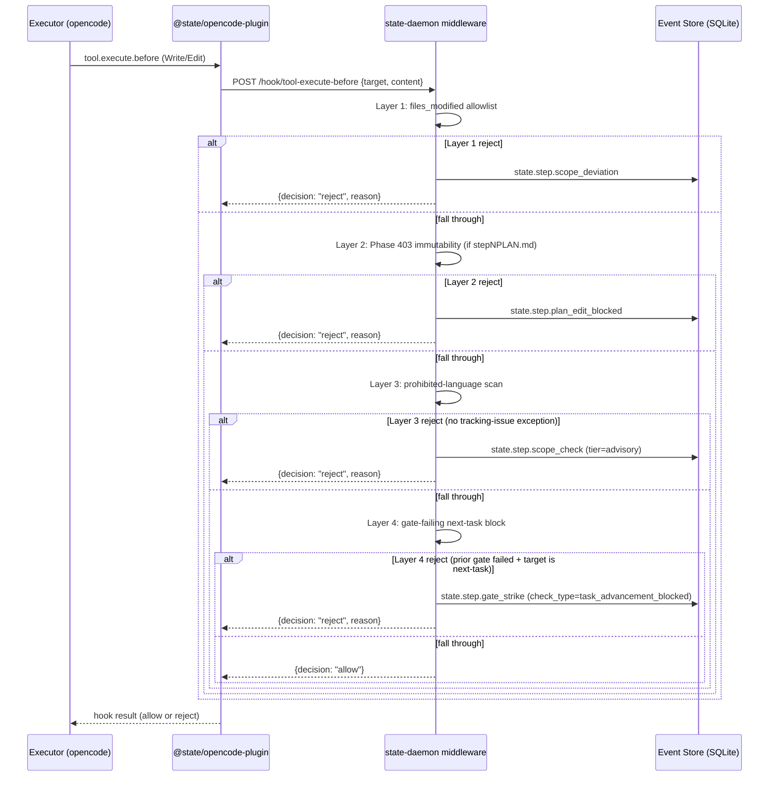

# Boolean Proof Gate (Canonical, v41)

> **Phase:** 404
> **Status:** Canonical (v41)
> **Requirements covered:** PRF-01..PRF-07
> **Build-mode only.** `state.build.*` MUST NOT import the teach-mode subtree (cardinal rule, PROJECT.md — mode isolation is physical).
> **Sibling specs:** ANALYSIS-PARALYSIS-GUARD.md (APG counter — independent from PRF), SCOPE-PROHIBITION.md (files_modified allowlist + prohibited-language scan — layers 1 and 3 of the tool.execute.before stack).
> **Authoritative ordering:** Pydantic class definitions are authoritative; prose is supplementary.

The harness gates task / Step / Slice advancement on a pure-machine boolean proof gate. PRF-01 defines the `must_haves` frontmatter block (consumed verbatim from Phase 403's STEP-PLAN-FORMAT.md). PRF-02 carries the gate to the per-task level via `<verify><automated>` + `<acceptance_criteria>` bullets index-bound to `must_haves`. PRF-03 rolls up to the Slice level via the pre-commit `<verification>` bash blocks + the deterministic `N-VERIFICATION.md` projector. PRF-04 forbids LLM-as-judge anywhere. PRF-05 fixes the evaluation order. PRF-06 specifies the 6-strike escalation ladder with `GateStrike` / `GateResolved` event audit. PRF-07 enforces "fail blocks advancement" via `tool.execute.before` write-block on next-task files.

## must_haves Evaluator Dispatch (PRF-01, PRF-04)

### Inherited frontmatter schema

From `.planning/milestones/v41/phases/403/specs/STEP-PLAN-FORMAT.md` §Frontmatter Schema (STP-02). PRF-01 consumes the same schema; this spec specifies the EVALUATORS that compute verdicts against each list entry.

```python
from pydantic import BaseModel, ConfigDict

class ArtifactCheck(BaseModel):
    model_config = ConfigDict(extra="forbid")
    path: str
    provides: str
    min_lines: int

class KeyLink(BaseModel):
    model_config = ConfigDict(extra="forbid")
    from_: str    # alias "from" — Python keyword collision
    to: str
    via: str
    pattern: str

class MustHaves(BaseModel):
    model_config = ConfigDict(extra="forbid")
    truths: list[str]                            # bash/python assertions (verifiable per PRF-04)
    artifacts: list[ArtifactCheck]
    key_links: list[KeyLink]
```

### Evaluator dispatch table

| must_haves field | Entry type | Pure-machine evaluator | Verdict source |
|------------------|------------|------------------------|----------------|
| `truths[i]: str` | bash/python assertion string | Run as `bash -c "<string>"` (or `python3 -c "<string>"` if `#!python3 ` prefix); exit code 0 = pass, non-zero = fail | bash exit code |
| `artifacts[i]: ArtifactCheck` | `{path, provides, min_lines}` | (1) `test -f "$path"`; (2) `wc -l "$path"` >= `min_lines`; (3) `provides` string is informational only (NOT machine-evaluated — used in N-VERIFICATION.md prose column) | file existence + line count |
| `key_links[i]: KeyLink` | `{from, to, via, pattern}` | `grep -E -- "$pattern" "$from"` AND the grep MUST return >= 1 line containing a reference to `to` (full-text substring check, OR regex if `pattern` constrains it); exit code 0 = pass | grep exit code |
| (task-level) `<verify><automated>` | bash one-liner | Run as `bash -c "<command>" timeout=120s`; exit code 0 = pass | bash exit code |
| (task-level) `<acceptance_criteria>` bullets | bullet text with `[check: ...]` annotation | Dispatch via ANNOTATION_RE; bullet's evaluator = the indexed must_haves entry OR the task's `<verify><automated>` | dispatched evaluator's verdict |

**No LLM-as-judge anywhere (PRF-04).** Every evaluator above is bash exit code, file existence, wc -l, or regex grep — pure machine. The `provides` field on `ArtifactCheck` is human-readable annotation; it does NOT participate in verdict computation. A truth string that requires natural-language interpretation (e.g., "the implementation is correct") MUST be rejected by the planner-validation stage; the spec stipulates the planner emits `state.slice.validation_failed` with `reason='non-machine-evaluable truth'` and the bullet is replaced with one or more machine-evaluable assertions.

### Inline interpreter prefix convention (truths)

A `truths[i]` string MAY use the `#!python3 ` (with trailing space) prefix to indicate Python evaluation: e.g., `#!python3 from state_build.snapshot import CompactionSnapshot; assert CompactionSnapshot.model_config['extra'] == 'forbid'`. Without the prefix, the string is bash. The harness strips the prefix before passing to `python3 -c`. This mirrors the EXEMPLAR-stepNPLAN.md truth: `python3 -c 'from state_build.snapshot.compaction import CompactionSnapshot; ...'` — which the EXEMPLAR currently writes as a bash invocation of python3; both forms produce the same machine verdict. v14 picks one canonical form; the spec accepts both.

### Worked evaluator examples (illustrative)

The following examples illustrate how a single Step's frontmatter `must_haves` block surfaces as three concrete machine evaluators at Step-end. Drawn from the shape of `.planning/milestones/v41/phases/403/specs/EXEMPLAR-stepNPLAN.md`:

```yaml
must_haves:
  truths:
    - "python3 -c 'from state_build.snapshot.compaction import CompactionSnapshot; assert CompactionSnapshot.model_config[\"extra\"] == \"forbid\"'"
  artifacts:
    - path: src/state_build/snapshot/compaction.py
      provides: CompactionSnapshot Pydantic class with extra='forbid'
      min_lines: 80
  key_links:
    - from: tests/test_compaction_snapshot.py
      to: src/state_build/snapshot/compaction.py
      via: "test imports CompactionSnapshot from the module-under-test"
      pattern: "from state_build\\.snapshot\\.compaction import CompactionSnapshot"
```

Evaluator dispatch produces, at Step-end, three independent `CheckResult` entries:

1. `truths[0]` -> `bash -c "python3 -c 'from state_build.snapshot.compaction import CompactionSnapshot; assert ...'"` -> exit 0 -> `verdict=pass`.
2. `artifacts[0]` -> `test -f src/state_build/snapshot/compaction.py` (must succeed) AND `wc -l src/state_build/snapshot/compaction.py | awk '{print $1}'` >= 80 -> `verdict=pass`.
3. `key_links[0]` -> `grep -E "from state_build\.snapshot\.compaction import CompactionSnapshot" tests/test_compaction_snapshot.py` -> exit 0 -> `verdict=pass`.

The `provides` string ("CompactionSnapshot Pydantic class with extra='forbid'") never enters the verdict computation — it is rendered into the `source_expr` column of N-VERIFICATION.md (Section 8) for human auditability only.

### Planner-validation enforcement of pure-machine constraint

If a planner emits a truth string that the validation stage cannot resolve to a deterministic shell or Python invocation, the bullet is rejected before the Step is ever scheduled. Examples of REJECTED truth strings:

- `"the implementation is correct"` -> REJECT: no shell/python invocation; would require LLM-as-judge.
- `"verify the snapshot module behaves sensibly"` -> REJECT: ambiguous predicate; no exit-code semantics.
- `"see DECISIONS.md for the criteria"` -> REJECT: indirect reference; the criterion itself is not pure-machine.

Accepted truth strings always reduce to a `bash -c` or `python3 -c` invocation with a deterministic exit code. The planner-validation stage emits `state.slice.validation_failed` with `reason='non-machine-evaluable truth'`; the planner re-iterates the offending bullet.

### Empty-list semantics (omitted-if-empty)

A `must_haves.truths`, `must_haves.artifacts`, or `must_haves.key_links` list MAY be empty for a given Step. An empty list does NOT short-circuit the gate; instead, the harness emits a single `CheckResult` with `verdict='omitted'` and `evidence_excerpt='no entries declared'` for that sub-array. This preserves audit clarity: a reader of `stepN-VERIFY.json` sees explicitly that the sub-array was checked-and-found-empty rather than skipped. Mirrors gsd-2's omitted-if-empty pattern (`tools/complete-slice.ts:65, 387-424`) and is rendered into N-VERIFICATION.md per Section 8.

Conversely, a Step that declares zero entries across all three sub-arrays AND has no `<verify><automated>` block AND has no `<acceptance_criteria>` bullets is a planner error: at least one machine-evaluable claim is required per Step (otherwise PRF-01 is trivially satisfied by absence — useless audit value). The planner-validation stage emits `state.slice.validation_failed` with `reason='step_has_no_machine_evaluable_claims'` and the Step is rejected before scheduling.

## Acceptance-Criteria Index-Binding (PRF-02)

### Bullet annotation grammar

```python
# ANNOTATION_RE — Pydantic-validated at plan parse time
ANNOTATION_RE = r"\[check:\s*(must_haves\.(truths|artifacts|key_links)\[\d+\]|verify_automated)\]"
```

```xml
<acceptance_criteria>
  - [check: must_haves.truths[0]] ofxparse2 module is importable
  - [check: must_haves.artifacts[1]] src/state_build/snapshot.py >= 80 lines, provides CompactionSnapshot
  - [check: must_haves.key_links[0]] tests/test_snapshot.py imports from state_build.snapshot
  - [check: verify_automated] pytest tests/test_snapshot.py exits 0
</acceptance_criteria>
```

### Binding semantics

- Each `<acceptance_criteria>` bullet carries an inline annotation pointing to one entry in the frontmatter `must_haves.{truths, artifacts, key_links}` lists OR to the task's `<verify><automated>` block.
- The bullet text is **human-readable**; the machine evaluator is the indexed entry. The harness builds an evaluator per bullet at gate time from the index.
- Mirrors gsd-2's `complete_task` field-binding shape — `taskParams.completion_criteria` <-> Q5, `behavior_contract` <-> Q6, `test_plan` <-> Q7 (`tools/complete-task.ts:73-77, 339-355`). Each bullet has a deterministic verdict.
- **Bullets without a valid annotation fail plan validation at the planner stage (research-slice / validation stage).** No annotation -> no machine evaluator -> PRF-04 violated.

### Rejection cases (planner-validation enforcement)

The following bullet forms are REJECTED at parse time by the planner-validation stage:

- `- The implementation is correct.` -> REJECT (no `[check:]` annotation; free-form NL evaluator would require LLM-as-judge — PRF-04 violation).
- `- [check: looks_good] verify the output` -> REJECT (annotation does not match ANNOTATION_RE — invalid scope name; only `must_haves.{truths,artifacts,key_links}[N]` or `verify_automated` permitted).
- `- [check: must_haves.truths[]] anything` -> REJECT (missing index integer; ANNOTATION_RE requires `\[\d+\]`).
- `- [check: must_haves.truths[99]] ...` where `truths` has 3 entries -> REJECT at evaluator-construction time (out-of-bounds index; the dispatcher cannot find a backing evaluator).
- `- [check: must_haves.unknown_field[0]] ...` -> REJECT (scope not in {truths, artifacts, key_links}; the inner group of ANNOTATION_RE limits the scope set).
- `- [check: verify_manual]` -> REJECT (only `verify_automated` is permitted; `verify_manual` would imply LLM-as-judge or human-as-judge mid-task — both PRF-04 violations).

The planner-validation stage emits `state.slice.validation_failed` with `reason='acceptance_criteria_annotation_missing'` or `'acceptance_criteria_annotation_out_of_bounds'`; replan-iteration triggered. v15 Build Core Commands implements the parser.

### Why index-binding wins (rationale)

Free-form acceptance bullets violate "pure-machine": the harness cannot reduce arbitrary natural language to a deterministic exit code without an LLM-as-judge step (PRF-04 violation). Bullet-as-regex extraction was offered and rejected — extracting a runnable predicate from the bullet's prose is fragile (whitespace shifts, paraphrase drift) and produces brittle evaluators that disagree with the human-readable text. Index binding `[check: must_haves.truths[0]]` is the minimum-spec rule that keeps bullets human-readable AND each bullet machine-evaluable. Mirrors gsd-2's `complete_task` field-binding (taskParams fields ↔ Q5/Q6/Q7 gates) — agent intent and machine evaluator are coupled by index, not by NL pattern matching.

### Auditability via verbatim dispatch

The harness's dispatcher logs, for each bullet evaluation, the bullet text, the resolved annotation, the bound evaluator's actual command, and the exit code or comparison result. This produces a 4-tuple `(bullet_text, annotation, bound_evaluator, verdict)` in the per-Step `stepN-VERIFY.json` `acceptance_criteria[i]` entry (Section 7's `AcceptanceResult` Pydantic class). Replay-determinism: rerunning the dispatcher against the same `must_haves` frontmatter + the same evaluator inputs produces an identical `AcceptanceResult` set. Any drift surfaces immediately on event replay.

### Cross-task bullet binding (forbidden)

A bullet's annotation MUST reference `must_haves` of the SAME Step in whose `<acceptance_criteria>` the bullet appears, OR the SAME task's `<verify><automated>` block. Cross-task references (e.g., `[check: must_haves.truths[0]]` inside Task 2's `<acceptance_criteria>` block when Task 1 in the same Step authored the truth) are conceptually permitted because `must_haves` is a Step-level frontmatter field — but the resulting evaluator MUST still be machine-evaluable from the worktree state at the bullet's owning task-end boundary. The planner-validation stage does NOT scope-check the annotation by task; it only scope-checks by Step.

A bullet that references `must_haves` from a DIFFERENT Step is REJECTED at parse time: ANNOTATION_RE matches only the local Step's frontmatter; cross-Step references would require a sliced lookup mechanism not specified here. If a Step needs to cite another Step's evaluator output, it does so via `slice-verification.sh` integration checks (Section 4 §3, Slice-end boundary), not via `<acceptance_criteria>` bullets.

### ANNOTATION_RE compilation discipline

The regex is compiled once at parser-start via `re.compile(ANNOTATION_RE)`; the compiled pattern is module-level and shared. Multiple matches per bullet are rejected (a bullet with two `[check:]` annotations is ambiguous — which evaluator binds?). Zero matches when the bullet starts with `- ` is also rejected (the planner-validation stage's `acceptance_criteria_annotation_missing` rejection). The regex is anchored with `\[` and `\]` (literal brackets) so adjacent prose cannot accidentally satisfy the pattern; only the `[check: …]` form matches.

## Gate Evaluation Order (PRF-05)

Gates fire at three boundaries — task end, Step end, Slice end — in deterministic order. Each boundary has its own evaluator set and its own event emission. The harness MUST evaluate IN this order; cross-boundary skips are forbidden.

### Numbered protocol

1. **task-end** (the moment the agent signals task complete — see "Strike trigger" in Section 6 for the exact signals):
   1. Run the task's `<verify><automated>` bash block with timeout 120s. Capture exit code, stdout (≤2KB), stderr (≤2KB).
   2. For each bullet in `<acceptance_criteria>`: parse the `[check: …]` annotation; dispatch to the indexed evaluator; record per-bullet verdict.
   3. Compute `task_overall_verdict` server-side from per-bullet verdicts + `<verify>` exit code: any `fail` -> task fails; else if all `pass` -> task passes; else `flag` or `omitted` per gsd-2 vocabulary.
   4. On `fail`: increment strike counter for the failing `(task_id, check_id)` tuple (see Section 6) and BLOCK advancement to next task (PRF-07 — Section 5).
   5. On `pass | flag | omitted`: emit `state.step.task_verify_completed` with the task verdict; advance to next task in the Step.

2. **Step-end** (after the Step's final task in DAG order passes):
   1. Evaluate every entry in frontmatter `must_haves.truths` via the bash/python evaluator (Section 2 dispatch table).
   2. Evaluate every entry in frontmatter `must_haves.artifacts` via file existence + `wc -l` >= `min_lines`.
   3. Evaluate every entry in frontmatter `must_haves.key_links` via `grep -E "$pattern" "$from"` confirming a reference to `to`.
   4. Compute `step_overall_verdict` server-side from the three sub-arrays' per-entry verdicts: any `fail` -> Step fails; else server-side compute pass / flag / omitted.
   5. Write `stepN-VERIFY.json` (per-Step machine-readable artifact — Pydantic StepVerifyResult, Section 7) into the slice's worktree at `slices/N-name/stepN-VERIFY.json` (where N is the Step's numeric ordinal from step_id).
   6. On `fail`: increment strike counter for each failing `(task_id, check_id)` (Step-scope check_ids use `task_id=null` for Step-level evaluators); BLOCK advancement to next Step.
   7. On `pass | flag | omitted`: emit `state.step.step_verify_completed` (rides StepVerifyCompleted payload, Section 7); advance to next Step.

3. **Slice-end** (after the Slice's final Step in DAG order passes):
   1. Execute `slices/N-name/slice-verification.sh` with timeout 600s. Capture exit code, stdout/stderr.
   2. The script aggregates Step-level evidence (reads each `stepN-VERIFY.json`) + runs cross-Step integration checks (free-form bash).
   3. On non-zero exit: Slice fails; BLOCK Slice close.
   4. On exit 0: invoke the deterministic projector to render `N-VERIFICATION.md` (rolled-up 10-column truth table, Section 8) from all `stepN-VERIFY.json` files + `gate_strike` events in the Slice.
   5. Emit `state.slice.slice_verify_completed` (rides SliceVerifyCompleted payload, Section 7); advance to Slice close (commit + worktree merge).

Cross-boundary skips are forbidden. The harness MUST NOT evaluate Step-end before all tasks have evaluated; MUST NOT evaluate Slice-end before all Steps. v14 enforces via FSM state transitions in `src/state_daemon/middleware.py`.

### Timeouts and overrides

- **Per-Step `<verification>` bash-block timeout default: 120s.** Slice frontmatter MAY override via `verify: {step_timeout_s: int}`.
- **Slice-level `slice-verification.sh` timeout default: 600s.** Slice frontmatter MAY override via `verify: {slice_timeout_s: int}`.
- Timeout -> `fail` verdict; the timeout event is `state.step.gate_strike` with `eval_evidence: 'timeout after Ns'` and the check_id of the timing-out evaluator.

### Cross-boundary skip prohibition

The harness MUST NOT short-circuit any of the three boundaries. Specifically:

- A Step MUST NOT enter Step-end evaluation while any of its tasks is in `pending` or `executing` state. The FSM transition `step.executing -> step.verifying` requires `all(tasks_state == "complete")`.
- A Slice MUST NOT enter Slice-end evaluation while any of its Steps is in `pending`, `executing`, or `verifying`. The FSM transition `slice.executing -> slice.verifying` requires `all(steps_state == "complete")`.
- Skipping any individual evaluator within a boundary is also forbidden: every entry in `must_haves.truths`, `must_haves.artifacts`, and `must_haves.key_links` is evaluated; entries with no evaluator (empty `truths` list) produce `omitted` verdicts (Section 7 §omitted-if-empty), not skipped rows.

v14's FSM implementation lives in `src/state_daemon/middleware.py`. The Pydantic state-transition guard rejects any attempt to advance with incomplete sub-state, raising `InvalidStateTransition` and emitting a `state.daemon.fsm_violation` event.

### Idempotence on retry

If a Step-end or Slice-end evaluation has already executed and produced a `stepN-VERIFY.json` or `N-VERIFICATION.md`, a re-trigger of the boundary (e.g., after a strike-chain reinject) MUST overwrite the prior file atomically (write-then-rename pattern). The event store records both runs as separate `state.step.step_verify_completed` events; the on-disk file holds only the latest. Replay reconstructs every intermediate state from the event log; the on-disk file is a convenience projection.

## tool.execute.before Write-Block Stack (PRF-07)

The canonical "fail blocks advancement" enforcer is the `tool.execute.before` plugin hook. Every proposed Write/Edit passes through a deterministic four-layer stack inside the daemon's HTTP middleware. Each layer either rejects (with a structured reason + event emission) or falls through to the next.

### Layer order (deterministic, top-to-bottom)

1. **Layer 1 — `files_modified` allowlist (SRP-04)**: target path must match an exact-path or glob entry in the Step's frontmatter `files_modified`. Reject -> emit `state.step.scope_deviation` (see SCOPE-PROHIBITION.md). Fall through on match.
2. **Layer 2 — Phase 403 immutability check (PAP-05)**: if target is `*/stepNPLAN.md`, apply Phase 403's diff-the-proposed-write enforcer (immutable subset = `must_haves`, `<verify>`, `<acceptance_criteria>`, `<done>`, `<options>`, `<files>`, `<objective>`, `<success_criteria>`, `<interfaces>`, frontmatter, parent `<threat_model>` minus `<discovered_threats>` append-only carve-out). Reject -> emit `state.step.plan_edit_blocked` (see PLAN-AS-PROMPT.md §6). Fall through on no immutable diff.
3. **Layer 3 — prohibited-language scan (SRP-02)**: scan proposed content for `\b(v1|simplified|placeholder|todo|fixme|future)\b` (case-insensitive); tracking-issue exception via EXCEPTION_RE; spec-doc allowlist via `.planning/**/*.md` path glob. Reject -> emit `state.step.scope_check` (see SCOPE-PROHIBITION.md). Fall through on clean.
4. **Layer 4 — gate-failing next-task block (PRF-07)**: if the current Step's most recent gate verdict was `fail` AND target is in the NEXT task's `<files>` (determined by DAG ordering + `<files>` membership), reject -> emit `state.step.gate_strike` with `check_type='task_advancement_blocked'` and the check_id of the failing evaluator from the prior task-end gate. Fall through on no gate-failure or non-next-task target.

**Fall-through to allow:** if all four layers fall through, the Write/Edit is allowed; the daemon's middleware reports `allow` to the plugin's `tool.execute.before` hook; the plugin returns control to opencode and the tool executes.

### Sequence diagram (Mermaid)



**Authoritative ordering:** prose protocol (Section 5 numbered list) is authoritative; diagram is supplementary. If the diagram contradicts the prose, the prose wins. v14 implementers MUST cross-check both before shipping the middleware stack.

### Why four layers in this order

The layer order is not arbitrary; it reflects a coarse-to-fine, cheap-to-expensive enforcement gradient that minimizes wasted work:

1. **Layer 1 first (allowlist match)** — a single string-or-glob membership check against a small list. Cheapest layer. Rejects the largest class of obvious scope violations (write to an unrelated file) before any content scanning. The rejected event (`scope_deviation`) carries the proposed path only — no content payload — keeping audit-log size bounded.
2. **Layer 2 second (immutability diff)** — runs ONLY when target matches `*/stepNPLAN.md`; for all other targets this layer is a no-op. The diff computation is non-trivial (parse YAML frontmatter, walk XML body), but conditioning the layer on the path pattern keeps the cost out of the hot path. Rejection produces `plan_edit_blocked` with the diff excerpt as evidence.
3. **Layer 3 third (prohibited-language scan)** — full content scan with a compiled regex. More expensive than Layers 1 and 2 (it reads the whole proposed payload), so it runs after the cheaper rejections have filtered out non-target writes. The `.planning/**/*.md` path-allowlist further narrows the scan's hot path (most planning-doc writes never trigger the regex engine for prose tokens).
4. **Layer 4 last (gate-failing next-task block)** — requires the harness to know the most-recent gate verdict + the DAG ordering of tasks; cross-references task `<files>` membership. The most context-dependent layer, hence the most expensive. Running it last means the cheap rejections have already pruned the candidate set.

The order also reflects a security-property gradient: Layer 1 protects against most scope violations (broadest blast radius); Layer 4 protects against the narrowest case (next-task file writes after a gate failure). Failure modes accumulate in audit clarity rather than colliding — each rejection's event type is distinct, so log readers can route quickly to the correct sibling spec.

### Allow-decision audit trail

Even when all four layers fall through and the write is allowed, the daemon emits an `state.step.write_allowed` audit event (lightweight: target path + content hash + which layers were evaluated). This event is for replay diagnostics — distinguishing "write happened" from "write was implicitly skipped" — and is excluded from the user-facing event timeline by the v9 sidebar filter. v14 implements the audit event behind a `daemon.audit_writes` config flag (default: true in dev, false in prod release).

### Stack failure surface and retry

A failure inside any single layer is fatal for the write under evaluation: the daemon emits the layer-specific rejection event AND returns `decision: "reject"` to the plugin; the proposed Write/Edit never reaches opencode's tool execution. The agent receives the rejection reason as a structured response (not as a bash exit code) and MAY retry with a corrected Write/Edit. A retry re-enters the stack from Layer 1; no layer is skipped on retry. This guarantees the stack is order-stable even under repeated rejection-correction loops.

A daemon-side internal failure (e.g., the immutability-diff parser raises an exception) is NOT a layer rejection — it is a daemon error. The daemon emits `state.daemon.middleware_error` with the exception traceback and returns `decision: "reject", reason: "daemon_internal_error"` to be safe. The Step transitions to `paused` pending operator inspection. v14 implements the safe-default-deny posture in `src/state_daemon/middleware.py`.

## Strike Counter Semantics (PRF-06)

### Counter scope

- **Counter scope: per `(task_id, check_id)` tuple.** Finest analog to gsd-2's per-`runAgentLoop`-invocation `consecutiveAllToolErrorTurns` (`gsd-2/packages/pi-agent-core/src/agent-loop.ts:191`).
- Each failing `must_haves` check — one truth assertion, one artifact entry, one key_link entry — has its own 6-strike chain.
- Chains for different checks do not poison each other. Max audit clarity; agent sees per-check escalation.
- Step-level evaluators (where the failing check is not bound to a specific task) use `task_id=null` in the tuple; the chain key becomes `(null, check_id)`.

### Reset rule

- **Continue counting across the clear+reinject tier.** Literal D-8 reading: "human gate at strike 6 **total**."
- Strike 3 fires clear+reinject (single shot); strike 4 is the next failed eval after the reinjected agent re-attempts the same `(task_id, check_id)` pair.
- Diverges from gsd-2's `consecutiveAllToolErrorTurns = 0`-on-success pattern (`agent-loop.ts:191`), but D-8 already diverges from gsd-2 by introducing the reinject tier at all — the divergence is principled, not accidental.
- **On `(task_id, check_id)` close (pass/flag/omitted verdict):** emit `state.step.gate_resolved` and remove the chain from the in-memory counter; subsequent failures on the SAME tuple start fresh from strike 1 in a new chain.

### Strike trigger (completion-claim boundary)

A strike accrues if-and-only-if:

1. The agent signals "task complete" via either (a) attempting any Write/Edit targeting a file owned by the **next** task (PRF-07 boundary detection, Section 5 Layer 4), OR (b) explicitly calling the `complete_task` MCP tool (analog of gsd-2's `complete_task` at `gsd-2/src/resources/extensions/gsd/tools/complete-task.ts`); AND
2. The harness runs the task's `<verify><automated>` + `<acceptance_criteria>` + frontmatter `must_haves.*` pure-machine evaluators; AND
3. At least one evaluator returns `fail`.

**Mid-task incidental gate evaluations** (e.g., harness running checks against WIP artifacts mid-Write) do **not** strike. Mirrors gsd-2's preparation-vs-execution narrowing (`agent-loop.ts:324-329`, issue #3618): execution failures are not strikes; only declared-completion-then-still-failing pattern strikes.

### Escalation ladder (the 6-strike chain)

| Strike # | Tier | Harness action | Event emitted |
|---------|------|----------------|---------------|
| 1 | advisory | Inject system advisory naming the failing check_id + remediation hint | `state.step.gate_strike` (tier=advisory, strike_number=1) |
| 2 | advisory | Same advisory; updated count in the message | `state.step.gate_strike` (tier=advisory, strike_number=2) |
| 3 | advisory + reinject trigger | Inject advisory; then on agent retry that still fails the same `(task_id, check_id)`, fire compaction snapshot + clear context + reinject the PLAN with the focused failing-check prompt; record `snapshot_event_id` cross-link to the `compaction.snapshot_taken` event | `state.step.gate_strike` (tier=reinject, strike_number=3, snapshot_event_id=<id>) |
| 4 | advisory (post-reinject) | Inject advisory; counter is at 4 of 6 | `state.step.gate_strike` (tier=advisory, strike_number=4) |
| 5 | advisory | Inject advisory; warning that next failure fires human gate | `state.step.gate_strike` (tier=advisory, strike_number=5) |
| 6 | human_gate (force-stop) | Force-stop the session; surface a human gate via opencode `question` tool with the failing check_id, the agent_response_summary, the eval_evidence excerpts, and the 6-strike chain audit | `state.step.gate_strike` (tier=human_gate, strike_number=6) |

**On strike 6 human resolution:** human picks "override" or "reject". Override -> emit `state.step.gate_resolved` with `resolution='human_override'` and force the check to `pass`; reject -> emit `state.step.gate_resolved` with `resolution='human_reject'` and the Slice transitions to `pending_replan` (handled in SCOPE-PROHIBITION.md SRP-05).

### APG-vs-PRF counter independence

- gsd-2's `loop-control.md` §0 Correction 1 explicitly forbids conflating distinct counters — gsd-2 has FOUR separate counters at four scopes.
- State follows the same principle:
  - `paralysis_event` chain (APG): 3 advisory -> clear+reinject -> 3 more -> human gate. Per task.
  - `gate_strike` chain (PRF): 3 advisory -> clear+reinject -> 3 more -> human gate. Per `(task_id, check_id)`.
  - Each can independently reach force-stop.
  - The `harness_intervention` event (HRN-05, owned by Phase 406) is the umbrella; both `paralysis_event` and `gate_strike` cite it as `trigger_reason`.

Conflating the two counters would directly violate the gsd-2 framing principle this spec cites. v14 implements the two counters as distinct in-memory state structures backed by distinct event types; replay reconstructs each chain independently.

### Strike-counter durability

The strike counter is in-memory in v14, backed by the event store. On daemon restart, the daemon rehydrates each open chain from the event log: for each `(task_id, check_id)` whose most recent event is a `gate_strike` with no subsequent `gate_resolved`, the chain is reconstructed at its last-known strike number. The rehydrate path is `src/state_daemon/middleware.py` (v14 territory); the spec stipulates the behavior but defers implementation details to v14.

## Pydantic Event Payloads + StepVerifyResult Schema

This section renders the four new Pydantic event payloads + the `StepVerifyResult` schema that the harness writes to `stepN-VERIFY.json`. All ride the v40 EventEnvelope outer shape (the `data: dict[str, Any]` field carries the payload below); all use `model_config = ConfigDict(extra="forbid")`. Event-type strings follow the v40 EVENT-TAXONOMY.md convention `state.{tier}.{action}` — Plan 04 of this phase appends an amendment block to EVENT-TAXONOMY.md registering the four new types.

### state.step.gate_strike (GateStrike — PRF-06)

**Trigger:** Emitted on every strike accrual (per the trigger rules above in §Strike trigger).

```python
from datetime import datetime
from pydantic import BaseModel, ConfigDict
from typing import Literal

class GateStrike(BaseModel):
    model_config = ConfigDict(extra="forbid")
    task_id: str | None                            # null for Step-level evaluators
    step_id: str
    slice_id: str
    check_id: str                                  # truth_idx | artifact_idx | key_link_idx | verify_automated | acceptance_idx
    check_type: Literal["truth", "artifact", "key_link", "verify_automated", "acceptance"]
    strike_number: int                             # 1..6
    tier: Literal["advisory", "reinject", "human_gate"]
    agent_response_summary: str                    # <= 2KB excerpt (gsd-2 truncation convention)
    eval_evidence: str                             # <= 2KB excerpt of the failed pure-machine output
    triggered_at: datetime                         # UTC, ISO-8601
    session_id: str
    snapshot_event_id: str | None                  # set when tier == "reinject" (cross-link to compaction.snapshot_taken)
```

### state.step.gate_resolved (GateResolved)

**Trigger:** Emitted on `(task_id, check_id)` chain close — verdict transitions to pass/flag/omitted, OR human resolution at strike 6.

```python
class GateResolved(BaseModel):
    model_config = ConfigDict(extra="forbid")
    task_id: str | None
    step_id: str
    slice_id: str
    check_id: str
    check_type: Literal["truth", "artifact", "key_link", "verify_automated", "acceptance"]
    final_strike_count: int                        # 0 if passed on first eval; up to 6 if human-resolved
    resolution: Literal["pass", "flag", "omitted", "human_override", "human_reject"]
    eval_evidence_final: str                       # <= 2KB excerpt of the resolving eval output
    resolved_at: datetime
    session_id: str
    gate_strike_event_ids: list[str]               # full audit chain (event ids of every GateStrike in the closed chain)
```

### state.step.step_verify_completed (StepVerifyCompleted)

**Trigger:** Emitted at Step-end after the `stepN-VERIFY.json` file is written. Carries the path + the server-side recomputed overall_verdict.

```python
class StepVerifyCompleted(BaseModel):
    model_config = ConfigDict(extra="forbid")
    step_id: str
    slice_id: str
    verify_json_path: str                          # absolute path to slices/N-name/stepN-VERIFY.json
    overall_verdict: Literal["pass", "flag", "omitted", "fail"]
    outcome: Literal["continue", "retry", "pause"]
    completed_at: datetime
    session_id: str
```

### state.slice.slice_verify_completed (SliceVerifyCompleted)

**Trigger:** Emitted at Slice-end after `slice-verification.sh` exits 0 AND `N-VERIFICATION.md` is written by the projector.

```python
class SliceVerifyCompleted(BaseModel):
    model_config = ConfigDict(extra="forbid")
    slice_id: str
    verification_md_path: str                      # absolute path to slices/N-name/N-VERIFICATION.md
    slice_verification_sh_exit_code: int           # always 0 (non-zero blocks emission)
    completed_at: datetime
    session_id: str
```

### StepVerifyResult JSON schema (stepN-VERIFY.json)

The on-disk per-Step machine-readable artifact. Pydantic-validated; schema-versioned for migration. The schema mirrors gsd-2's `<task>-VERIFY.json` (`verification-evidence.ts:81-98`) lifted to Step granularity and extended with the four-state verdict vocabulary.

```python
from datetime import datetime
from pydantic import BaseModel, ConfigDict
from typing import Literal

class StepVerifyResult(BaseModel):
    model_config = ConfigDict(extra="forbid")
    schema_version: Literal[1]                     # bump literal to migrate; old files surface as parse errors
    step_id: str
    slice_id: str
    timestamp: datetime
    must_haves: "MustHavesResult"                  # nested
    acceptance_criteria: list["AcceptanceResult"]  # one entry per bullet, bound by ANNOTATION_RE index
    verify_automated: "VerifyAutomatedResult"      # bash exit code + stdout/stderr <= 2KB
    overall_passed: bool                           # server-side recomputed; NEVER trust an LLM-emitted aggregate
    overall_verdict: Literal["pass", "flag", "omitted", "fail"]   # extends gsd-2's pass|flag|omitted with "fail"
    outcome: Literal["continue", "retry", "pause"] # mirrors gsd-2 EvidenceJSON outcome discriminator

class MustHavesResult(BaseModel):
    model_config = ConfigDict(extra="forbid")
    truths: list["CheckResult"]
    artifacts: list["CheckResult"]
    key_links: list["CheckResult"]

class CheckResult(BaseModel):
    model_config = ConfigDict(extra="forbid")
    index: int
    verdict: Literal["pass", "flag", "omitted", "fail"]
    evidence_excerpt: str                          # <= 2KB (gsd-2 truncation convention)
    strike_count_at_close: int                     # final strike count when this check was closed
    gate_strike_event_ids: list[str]               # full audit chain

class AcceptanceResult(BaseModel):
    model_config = ConfigDict(extra="forbid")
    bullet_index: int                              # 0-indexed position in <acceptance_criteria>
    annotation: str                                # the literal [check: ...] annotation string
    bound_evaluator: str                           # e.g., "must_haves.truths[0]" or "verify_automated"
    verdict: Literal["pass", "flag", "omitted", "fail"]
    evidence_excerpt: str

class VerifyAutomatedResult(BaseModel):
    model_config = ConfigDict(extra="forbid")
    command: str                                   # the bash one-liner from <verify><automated>
    exit_code: int
    stdout_excerpt: str                            # <= 2KB
    stderr_excerpt: str                            # <= 2KB
    duration_ms: int
    timed_out: bool
```

### Server-side recomputation of overall_passed

- **Server-side recomputation is NON-NEGOTIABLE.** Mirrors gsd-2's defensive pattern (`verification-evidence.ts` + `eval-review-schema.ts:210-227`): the harness recomputes `overall_passed` from sub-fields after writing the file.
- **Negative example (REJECTED at parse time):**
  - An agent-emitted `overall_passed: true` with `must_haves.truths[0].verdict: fail` is rejected by the StepVerifyResult parser. v14 raises `ValidationError` and emits `state.daemon.aggregate_mismatch`.
- **Positive example (ACCEPTED):**
  - All `must_haves.*.verdict in {pass, flag, omitted}` AND all `acceptance_criteria.*.verdict in {pass, flag, omitted}` AND `verify_automated.exit_code == 0` -> recomputed `overall_passed = True`.

The recomputation rule prevents an LLM that emits a self-contradictory verdict from corrupting the audit log. v14's parser validates the aggregate-versus-children invariant at deserialization time; any contradiction surfaces as a parse error, not as a runtime gate-fire surprise.

### Bounded truncation

- **2KB per check, 10KB total** per `stepN-VERIFY.json`. Mirrors gsd-2's `formatFailureContext` (`verification-gate.ts:115-142`).
- Truncation marker: `[... truncated <N> bytes ...]` where N is the byte count omitted.
- Same truncation discipline applies to `formatEvidenceTable` markdown rendering in N-VERIFICATION.md.
- The truncation utility is harness-owned (not agent-controllable); the marker is added by the utility.

### omitted-if-empty four-state vocabulary

- **pass | flag | omitted | fail** — the four-state vocabulary.
- Mirrors gsd-2 (`tools/complete-slice.ts:65, 387-424`): a check with no specified evaluator (e.g., a Step whose `must_haves.key_links` is empty) closes with `omitted`, NOT `pass`.
- The omitted state preserves audit clarity ("we checked and the criterion doesn't apply") and is distinct from `pass` ("we checked and confirmed").
- **`fail` is added** for the agent-loop's machine verdict; `pass | flag | omitted` are the closure verdicts (gsd-2's three) carried into `N-VERIFICATION.md`.

## N-VERIFICATION.md Rolled-Up Truth-Table Column Schema (PRF-03)

At Slice-end, after every Step's `stepN-VERIFY.json` is written, the harness invokes a deterministic projector that renders the rolled-up `N-VERIFICATION.md` markdown table. The projector subscribes to `state.step.step_verify_completed` and `state.step.gate_strike` events; aggregates all Step results in the Slice; renders the table. The table is the WIDE audit-traceable view; the per-Step JSON files are the authoritative machine-readable evidence.

### Column schema (10 columns)

| Column | Source field | Notes |
|--------|--------------|-------|
| `step_id` | `StepVerifyResult.step_id` | One row per check, grouped by step |
| `task_id` | gate_strike chain (or `null` for Step-level) | When the strike chain references a specific task |
| `check_id` | `CheckResult.index` formatted as `truths[0]` etc. | Stable across runs |
| `scope` | `truth \| artifact \| key_link \| verify_automated \| acceptance` | The PRF-01 / PRF-02 check type |
| `source_expr` | Pydantic dump of the must_haves entry | The actual expression being evaluated |
| `verdict` | `CheckResult.verdict` (`pass \| flag \| omitted \| fail`) | Extends gsd-2's three-state with `fail` |
| `strike_count_at_close` | `CheckResult.strike_count_at_close` | 0 if the check passed on first eval |
| `gate_strike_event_ids` | `CheckResult.gate_strike_event_ids` | Full audit chain (newline-joined event ids) |
| `evidence_excerpt` | `CheckResult.evidence_excerpt` (<= 2KB) | gsd-2-style bounded |
| `timestamp` | `StepVerifyResult.timestamp` | ISO-8601 UTC |

### Projector behavior

- Generated by a deterministic projector at Slice-verify-stage entry.
- Handler subscribes to `state.step.step_verify_completed` events; aggregates all step results in the Slice; renders the markdown.
- Ordering: rows sorted by Step DAG topology (depends_on traversal), then by check_id index ascending within each Step.
- Truncation: per-row `evidence_excerpt` <= 2KB; whole-file size unbounded (the per-Step JSON files cap evidence; the markdown rolls up).
- Idempotence: the projector is a pure function of the event log + worktree state. Re-running it after any new `state.step.step_verify_completed` or `state.step.gate_strike` event produces the same `N-VERIFICATION.md` byte-for-byte.

### omitted rows

Checks with `verdict='omitted'` ARE included in the table (audit clarity); they show `strike_count_at_close=0` and `gate_strike_event_ids=[]`. The projector MUST NOT skip them. Conversely, checks that were never evaluated (e.g., the Step closed via human override before evaluation completed) produce a row with `verdict='omitted'` and `evidence_excerpt='not evaluated — Step closed via human override on strike 6'`.

### Slice-level `<verification>` artifact paths

- **Per-Step `<verification>` bash block** lives inside `stepNPLAN.md` (Phase 403 STEP-PLAN-FORMAT.md §XML Body Section Catalog -> `<verification>`). Runs at Step end (before commit). Block content is bash only (no Python; if a Python check is needed, the Step author writes a `.py` file in `files_modified` and the bash block invokes `python3 path.py`). Block is **immutable** under PAP-03 / Phase 403's mutability matrix.
- **Slice-level `slice-verification.sh`** is co-located with `N-VERIFICATION.md` at `slices/N-name/slice-verification.sh`. Runs at Slice end (the verify-slice stage). Aggregates Step-level evidence + runs cross-Step integration checks. Single bash script; pure-machine.

## Artifact Catalog Additions

This section enumerates the new on-disk artifacts Phase 404 adds to the canonical Slice folder layout (per v40 ARTIFACT-CATALOG.md). Phase 406's harness rollup cross-references this list.

- **`slices/N-name/stepN-VERIFY.json`** (one per Step, machine-readable). Pydantic-validated against StepVerifyResult schema v1. Authoritative per-Step evidence.
- **`slices/N-name/slice-verification.sh`** (one per Slice, executable bash). Pure-machine cross-Step integration checks. Authored at plan-slice end; immutable post-execute-slice start.
- **`slices/N-name/N-VERIFICATION.md`** (one per Slice, deterministic projector output). Wide audit-traceable rolled-up truth table. Re-renderable from event store at any time (projector is idempotent).

Forward-pointer: v40 ARTIFACT-CATALOG.md will receive a `## v41 Amendment` block in Plan 04 (this phase) registering these three artifact types.

## Cross-references

- **Sibling spec — analysis paralysis:** `ANALYSIS-PARALYSIS-GUARD.md` (Plan 02) defines the APG counter — independent from PRF per Section 6 §APG-vs-PRF; both feed `harness_intervention` (Phase 406 HRN-05).
- **Sibling spec — scope:** `SCOPE-PROHIBITION.md` (Plan 03) defines layers 1 + 3 of the tool.execute.before stack (files_modified allowlist + prohibited-language scan); Layer 4 (gate-failing next-task block) is owned by this spec.
- **Phase 403 carry-forward — format:** `STEP-PLAN-FORMAT.md` §Frontmatter Schema (STP-02) provides the `MustHaves` / `ArtifactCheck` / `KeyLink` Pydantic classes this spec evaluates against.
- **Phase 403 carry-forward — mutability:** `PLAN-AS-PROMPT.md` §Mutability Matrix (PAP-03) locks every `<verify>` block; §6 (PAP-05) is Layer 2 of the tool.execute.before stack.
- **Phase 402 carry-forward — compaction:** `CONTEXT-PROTOCOL.md` §Compaction (CTX-05/06) is the source of the `compaction.snapshot_taken` event that GateStrike.snapshot_event_id cross-links when tier='reinject'.
- **v40 baseline:** `EVENT-TAXONOMY.md` naming convention `state.{tier}.{action}`; this spec adds `state.step.gate_strike`, `state.step.gate_resolved`, `state.step.step_verify_completed`, `state.slice.slice_verify_completed`. Plan 04 (this phase) appends a `## v41 Amendment` block to v40 EVENT-TAXONOMY.md registering these.
- **v40 baseline — artifacts:** `ARTIFACT-CATALOG.md` will receive Plan 04 amendment registering `stepN-VERIFY.json`, `slice-verification.sh`, and confirming `N-VERIFICATION.md` column schema is owned by this spec.
- **Phase 406 forward:** `harness_intervention` (HRN-05) umbrella event aggregates `gate_strike` + `paralysis_event` + `scope_check` + `scope_deviation_request` + `split_recommendation`; the 4-tier intervention ladder (HRN-04) cites this spec for tier-3 (force clear+reinject) and tier-4 (force-stop+human gate).
- **gsd-2 lineage:** quality-enforcement.md §7.1 (EvidenceJSON schema), §3.2 (truncation), §0 Correction 2 Vocabulary 2 (pass|flag|omitted); loop-control.md §0 Correction 1 (counter independence), §4 (preparation-vs-execution narrowing); complete-task.ts:73-77, 339-355 (field binding); complete-slice.ts:65, 387-424 (omitted-if-empty); verification-evidence.ts (server-side recomputation).

v14 Build Kernel implements the strike counter (per-(task_id, check_id) tuple, in-memory cache backed by event store), the bash classifier dispatcher, the prohibited-language scanner, the files_modified allowlist checker, the deterministic N-VERIFICATION.md projector, the bounded-truncation utility, and the four event handlers. v15 Build Core Commands implements the research-slice planner-validation stage that checks `<acceptance_criteria>` bullet annotations against ANNOTATION_RE; the verify-slice stage that runs `slice-verification.sh` and writes `N-VERIFICATION.md`. Phase 405's deviation framework consumes strike-counter `tier=human_gate` events. Phase 406's harness rollup cites this spec for the layered diagram's tier-3 and tier-4 intervention behaviors.
