# Harness Architecture (Canonical, v41 Rollup)

> **Phase:** 406
> **Status:** Canonical (v41)
> **Requirements covered:** HRN-01, HRN-02, HRN-03, HRN-04, HRN-05, HRN-06, HRN-07, HRN-08
> **Build-mode only.** `state.build.*` MUST NOT import `state.teach.*` (cardinal rule, PROJECT.md).
> **Naming discipline:** All identifiers are `STATE-*` / `state-*`. The design-heritage prior-generation prefix (referenced in gsd-2 KB pattern docs only) is never used as an identifier prefix in this project.
> **Authoritative ordering:** Upstream specs (402–405) are the source of truth for their own subsystems; this rollup is the consolidation lens. Drift between this file and an upstream source spec is a documented defect.

## Overview

**The rollup is the index, not the source of truth.** Each prior 402–405 spec stays canonical for its own subsystem; `HARNESS-ARCHITECTURE.md` is the consolidation lens that lets a reader see the whole harness at once without reading 480k of prior specs first. Per-section content depth follows the hybrid cross-ref rule: inline operative contracts (Pydantic schemas, MCP tool signatures, event payloads) verbatim; pointer-only for explanatory prose. When this rollup quotes a contract from an upstream spec, drift between the inlined copy and the canonical source is a documented defect, detectable by grep on the literal string.

The harness lives across three physical layers: plugin hooks fired inside opencode's agent runtime; a state-build MCP server exposing agent-callable tools; and a state-daemon owning the canonical event store, projector, scheduler, SSE bus, and crash recovery. Hooks read state and block writes; MCP tools record agent-driven actions; the daemon owns all decision logic. The umbrella `state.harness.intervention` event (Plan 03 of this phase) is the sole rollup point over the four independent counter chains (APG paralysis, PRF gate strikes, DEV deviations, SUB subagent crashes). Event-replay reconstruction (HRN-07) lets the daemon recover full harness state from a CompactionSnapshot row plus forward event replay.

## Section ordering

1. §1 Layered diagram (HRN-01) — this plan (Plan 01).
2. §2 Plugin hook inventory (HRN-02) — this plan (Plan 01).
3. §3 state-build MCP tool catalog (HRN-03) — Plan 02 of this phase.
4. §4 4-tier intervention ladder + `harness_intervention` event + human-gate-only-via-`question` (HRN-04, HRN-05, HRN-06) — Plan 03 of this phase.
5. §5 Event-replay reconstruction proof (HRN-07) — Plan 04 of this phase.
6. §6 Full-Slice lifecycle sequence diagram (HRN-08) — Plan 04 of this phase.

## Cross-references

Every section back-cross-references the canonical 402–405 spec that owns the underlying mechanism. The 12 canonical prior specs (`SLICE-CYCLE.md`, `CONTEXT-PROTOCOL.md`, `STEP-PLAN-FORMAT.md`, `PLAN-AS-PROMPT.md`, `STEP-EVENTS.md`, `EXEMPLAR-stepNPLAN.md`, `PROOF-GATE.md`, `ANALYSIS-PARALYSIS-GUARD.md`, `SCOPE-PROHIBITION.md`, `DEVIATION-RULES.md`, `SUBAGENT-MANAGEMENT.md`, `SUBAGENT-MONITORING.md`) stay as-shipped; this rollup adds no amendments to them. Forward-references in 402–405 specs that mention "HRN-04/05 (Phase 406)" are already in place and need no edit.

---

## §1 Layered Diagram (HRN-01)

The harness is decomposed into three physical layers — **plugin hooks** (control surface inside opencode), **state-build MCP server** (agent-callable tool surface), and **state-daemon** (background decision logic). The three layers communicate over three primary channels: plugin → daemon via HTTP POST + SSE for hook events; agent → MCP server via stdio (the opencode plugin protocol) for typed tool calls; daemon → all consumers via the SSE bus for cross-component event distribution. The topology mirrors the gsd-2 reference pattern in `~/projects/gsd2deconstruction/kb/cross-layer-communication-map.md` §1, adapted from gsd-2's 5-layer decomposition to state's 3-layer arrangement.

### Layered topology

```mermaid
flowchart TB
  subgraph Hooks ["Plugin hooks (control surface)"]
    H_CP[chat.params]
    H_CM[chat.message]
    H_TEB[tool.execute.before]
    H_TEA[tool.execute.after]
    H_SC[session.compacting]
    H_SE[shell.env]
  end

  subgraph MCP ["state-build MCP server"]
    T_CT[complete_task]
    T_CS[complete_slice]
    T_RSS[request_step_split]
    T_SDR[scope_deviation_request]
    T_LD[log_deviation]
    T_DS[dispatch_subagent]
    T_CPG[check_proof_gate]
    T_EA[emit_advisory]
    T_FCR[force_clear_and_reinject]
    T_SHG[surface_human_gate]
    T_QCM[query_context_meter]
    T_RCS[request_compaction_snapshot]
    T_QES[query_event_store]
    T_RPE[record_plan_edit]
  end

  subgraph Daemon ["state-daemon (background)"]
    D_ES[(event store sqlite)]
    D_PR[projector]
    D_SC[scheduler]
    D_SSE[SSE bus]
    D_CR[crash recovery / orphan reconciliation]
  end

  %% Hook -> MCP routing (tool.execute.before dispatches agent-initiated tool calls)
  H_TEB -- "log_deviation routing + 5-step cross-validation" --> T_LD
  H_TEB -- "dispatch_subagent routing + whitelist + parallel-cap" --> T_DS
  H_TEB -- "files_modified + immutability + prohibited-language stack" --> D_PR
  H_CP -- "PLAN injection + reinject payload" --> D_PR
  H_CP -- "context-meter read" --> T_QCM
  H_SC -- "snapshot + reinject" --> T_RCS
  H_TEA -- "counter tick + context-meter mirror" --> D_PR
  H_CM -- "turn mirror" --> D_ES
  H_SE -- "STATE-* trailer env vars" --> D_ES

  %% MCP tool -> daemon (every tool call lands in the event store / projector)
  T_LD -- "Deviation event" --> D_ES
  T_DS -- "subagent_started event" --> D_ES
  T_CT -- "task_complete event" --> D_PR
  T_CS -- "slice_complete event" --> D_PR
  T_CPG -- "must_haves evaluator dispatch" --> D_PR
  T_EA -- "advisory injection" --> D_PR
  T_FCR -- "force compaction + reinject" --> H_SC
  T_SHG -- "opencode question tool surface" --> D_PR
  T_RCS -- "CompactionSnapshot row" --> D_ES
  T_QES -- "event-store read" --> D_ES
  T_RPE -- "plan_edit event" --> D_ES
  T_RSS -- "step_split request event" --> D_ES
  T_SDR -- "scope_deviation_request event" --> D_ES
  T_QCM -- "context_meter projection read" --> D_PR

  %% Daemon-internal hub: event store -> projector -> SSE bus -> all consumers
  D_ES -- "append-only stream" --> D_PR
  D_PR -- "derived state + advisories" --> D_SSE
  D_SC -- "dispatch queue + parallel cap accounting" --> T_DS
  D_CR -- "orphan probe + counter rehydrate" --> D_ES
  D_SSE -- "TUI + plugin re-inject + MCP handler advisories" --> Hooks
  D_SSE -- "advisory delivery to agent" --> MCP
```

The diagram body above is the canonical structure for §1; v14's harness implementation is expected to reproduce every named node and at minimum every labelled edge listed in the must-haves block of Plan 01 of this phase. Arrow ordering and additional labelled edges MAY be added for v14 readability without altering the contract.

### Layered decomposition (HRN-01)

- **Plugin hooks (control surface).** Six TypeScript hooks fired by opencode inside the agent session. State's `@state/opencode-plugin` bundle subscribes to all six. Hooks are sensors + enforcers — they READ harness state from the daemon and BLOCK writes via the `tool.execute.before` return value. Hooks themselves contain NO decision logic; they are thin reporters posting hook events to the daemon over HTTP+SSE. The `state.build.harness` package owns the daemon-side decision logic. Carries the "plugin-as-thin-reporter, daemon-decides" discipline forward from Phase 402.

- **state-build MCP server.** A separate process (registered with opencode as an MCP server) exposing 14 agent-callable tools. MCP tools are agent-driven actions — the agent CALLS them to signal intent (`log_deviation`, `dispatch_subagent`, `check_proof_gate`, etc.). The MCP server's tool handlers communicate with the daemon to record events and consult policy state. Mirrors Phase 405's "typed-spawn only via MCP tool" discipline (SUBAGENT-MANAGEMENT.md §1) extended to the full harness surface.

- **state-daemon.** A long-lived user-service process owning the canonical state. Five subsystems:
  1. **event store** — append-only SQLite `events.sqlite` with single-writer facade (carries forward the gsd-2 `single-writer-sqlite-facade.md` pattern as a project discipline).
  2. **projector** — CQRS handler chain that builds derived state (paralysis counter, gate strike counter, deviation counter, restart counter, intervention chain) from the event stream.
  3. **scheduler** — dispatch queue with parallel-cap accounting (SUB-04).
  4. **SSE bus** — distributes events to plugin hooks, MCP tool handlers, and TUI subscribers.
  5. **crash recovery / orphan reconciliation** — daemon-restart-safe state rehydration from the latest CompactionSnapshot row plus event replay forward; orphan subagent reconciliation via the 6-step protocol from Phase 405 SUBAGENT-MONITORING.md §"Daemon-down orphan reconciliation".

**Partition rule.** Plugin hooks are sensors + enforcers; MCP tools are agent-driven actions; the daemon owns the decision logic. Hooks READ harness state from the daemon and BLOCK writes; MCP tools are what the agent CALLS to signal intent; the daemon RECORDS events, REDUCES them into counters and derived projections, DISPATCHES advisories and intervention escalations, and SCHEDULES dispatched work. No decision lives in a hook handler; no event mutates state outside the daemon's single-writer event store; no MCP tool returns a verdict computed by anything other than the daemon's projector.

### Cross-layer communication channels

| Direction              | Channel                                  | Payload                                                                                                                |
| ---                    | ---                                      | ---                                                                                                                    |
| plugin hook → daemon   | HTTP POST + SSE                          | hook events (`tool.execute.before` context, `chat.params` runtime augmentation request, `session.compacting` snapshot, etc.) |
| agent → MCP server     | MCP stdio (per opencode plugin protocol) | typed tool calls (`log_deviation`, `dispatch_subagent`, `check_proof_gate`, …)                                         |
| daemon → all consumers | SSE bus                                  | event-store rows (`state.*.*` events) for TUI subscribers, plugin re-injection on next turn, and MCP handler advisories |

### Mode-isolation note

All harness modules live under `src/state_build/harness/` and MUST NOT import from `src/state_teach/`. Build-mode discipline is physical, not policy — CI import-graph lint (PROJECT.md cardinal rule) enforces. Events live in `BUILD_ONLY_EVENT_PREFIXES = frozenset({'state.slice.', 'state.step.', 'state.harness.'})`. Carry-forward from Phase 405 (SUBAGENT-MANAGEMENT.md §"Mode-isolation note", DEVIATION-RULES.md §"Mode isolation", SUBAGENT-MONITORING.md §"Mode isolation"). Teach-mode harness equivalent is explicitly deferred to v47 (`406-CONTEXT.md` `<deferred>` block).

### Carry-forward disciplines

- **Pure-machine everywhere** (PRF-04 spirit). No LLM-as-judge in the umbrella event, the intervention ladder, or the replay proof. Tier classification is a deterministic dispatch from the source chain's tier.
- **Plugin-as-thin-reporter, daemon-decides** (402 carry-forward). Hooks emit/block; daemon middleware owns decision dispatch.
- **`extra="forbid"` on every Pydantic class.** Unknown field at parse time = `ValidationError`; never silently ignored.
- **Single-source-of-truth modules.** Every registry, regex corpus, and pattern table lives in exactly one Python file imported by every consumer.
- **Server-side recomputation of aggregates** (carry-forward from the gsd-2 `server-recomputation-of-llm-emitted-fields.md` pattern; live across 404/405). The umbrella `tier` is server-derived, never agent-emitted.
- **4-counter independence** (PROOF-GATE.md §6 + DEVIATION-RULES.md §6 + SUBAGENT-MONITORING.md §4). APG / PRF / DEV / SUB chains never share state; `state.harness.intervention` (Plan 03 owns) is the SOLE rollup point.
- **Append-only event store** (PROJECT.md cardinal rule). Every event is append-only; corrections are NEW events.
