# Harness Architecture (Canonical, v41 Rollup)

> **Phase:** 406
> **Status:** Canonical (v41)
> **Requirements covered:** HRN-01, HRN-02, HRN-03, HRN-04, HRN-05, HRN-06, HRN-07, HRN-08
> **Build-mode only.** `state.build.*` MUST NOT import `state.teach.*` (cardinal rule, PROJECT.md).
> **Naming discipline:** All identifiers are `STATE-*` / `state-*`. The design-heritage prior-generation prefix (referenced in gsd-2 KB pattern docs only) is never used as an identifier prefix in this project.
> **Authoritative ordering:** Upstream specs (402–405) are the source of truth for their own subsystems; this rollup is the consolidation lens. Drift between this file and an upstream source spec is a documented defect.

## Overview

**The rollup is the index, not the source of truth.** Each prior 402–405 spec stays canonical for its own subsystem; `HARNESS-ARCHITECTURE.md` is the consolidation lens that lets a reader see the whole harness at once without reading 480k of prior specs first. Per-section content depth follows the hybrid cross-ref rule: inline operative contracts (Pydantic schemas, MCP tool signatures, event payloads) verbatim; pointer-only for explanatory prose. When this rollup quotes a contract from an upstream spec, drift between the inlined copy and the canonical source is a documented defect, detectable by grep on the literal string.

The harness lives across three physical layers: plugin hooks fired inside opencode's agent runtime; a state-build MCP server exposing agent-callable tools; and a state-daemon owning the canonical event store, projector, scheduler, SSE bus, and crash recovery. Hooks read state and block writes; MCP tools record agent-driven actions; the daemon owns all decision logic. The umbrella `state.harness.intervention` event (Plan 03 of this phase) is the sole rollup point over the four independent counter chains (APG paralysis, PRF gate strikes, DEV deviations, SUB subagent crashes). Event-replay reconstruction (HRN-07) lets the daemon recover full harness state from a CompactionSnapshot row plus forward event replay.

## Section ordering

1. §1 Layered diagram (HRN-01) — this plan (Plan 01).
2. §2 Plugin hook inventory (HRN-02) — this plan (Plan 01).
3. §3 state-build MCP tool catalog (HRN-03) — Plan 02 of this phase.
4. §4 4-tier intervention ladder + `harness_intervention` event + human-gate-only-via-`question` (HRN-04, HRN-05, HRN-06) — Plan 03 of this phase.
5. §5 Event-replay reconstruction proof (HRN-07) — Plan 04 of this phase.
6. §6 Full-Slice lifecycle sequence diagram (HRN-08) — Plan 04 of this phase.

## Cross-references

Every section back-cross-references the canonical 402–405 spec that owns the underlying mechanism. The 12 canonical prior specs (`SLICE-CYCLE.md`, `CONTEXT-PROTOCOL.md`, `STEP-PLAN-FORMAT.md`, `PLAN-AS-PROMPT.md`, `STEP-EVENTS.md`, `EXEMPLAR-stepNPLAN.md`, `PROOF-GATE.md`, `ANALYSIS-PARALYSIS-GUARD.md`, `SCOPE-PROHIBITION.md`, `DEVIATION-RULES.md`, `SUBAGENT-MANAGEMENT.md`, `SUBAGENT-MONITORING.md`) stay as-shipped; this rollup adds no amendments to them. Forward-references in 402–405 specs that mention "HRN-04/05 (Phase 406)" are already in place and need no edit.

---

## §1 Layered Diagram (HRN-01)

The harness is decomposed into three physical layers — **plugin hooks** (control surface inside opencode), **state-build MCP server** (agent-callable tool surface), and **state-daemon** (background decision logic). The three layers communicate over three primary channels: plugin → daemon via HTTP POST + SSE for hook events; agent → MCP server via stdio (the opencode plugin protocol) for typed tool calls; daemon → all consumers via the SSE bus for cross-component event distribution. The topology mirrors the gsd-2 reference pattern in `~/projects/gsd2deconstruction/kb/cross-layer-communication-map.md` §1, adapted from gsd-2's 5-layer decomposition to state's 3-layer arrangement.

### Layered topology

```mermaid
flowchart TB
  subgraph Hooks ["Plugin hooks (control surface)"]
    H_CP[chat.params]
    H_CM[chat.message]
    H_TEB[tool.execute.before]
    H_TEA[tool.execute.after]
    H_SC[session.compacting]
    H_SE[shell.env]
  end

  subgraph MCP ["state-build MCP server"]
    T_CT[complete_task]
    T_CS[complete_slice]
    T_RSS[request_step_split]
    T_SDR[scope_deviation_request]
    T_LD[log_deviation]
    T_DS[dispatch_subagent]
    T_CPG[check_proof_gate]
    T_EA[emit_advisory]
    T_FCR[force_clear_and_reinject]
    T_SHG[surface_human_gate]
    T_QCM[query_context_meter]
    T_RCS[request_compaction_snapshot]
    T_QES[query_event_store]
    T_RPE[record_plan_edit]
  end

  subgraph Daemon ["state-daemon (background)"]
    D_ES[(event store sqlite)]
    D_PR[projector]
    D_SC[scheduler]
    D_SSE[SSE bus]
    D_CR[crash recovery / orphan reconciliation]
  end

  %% Hook -> MCP routing (tool.execute.before dispatches agent-initiated tool calls)
  H_TEB -- "log_deviation routing + 5-step cross-validation" --> T_LD
  H_TEB -- "dispatch_subagent routing + whitelist + parallel-cap" --> T_DS
  H_TEB -- "files_modified + immutability + prohibited-language stack" --> D_PR
  H_CP -- "PLAN injection + reinject payload" --> D_PR
  H_CP -- "context-meter read" --> T_QCM
  H_SC -- "snapshot + reinject" --> T_RCS
  H_TEA -- "counter tick + context-meter mirror" --> D_PR
  H_CM -- "turn mirror" --> D_ES
  H_SE -- "STATE-* trailer env vars" --> D_ES

  %% MCP tool -> daemon (every tool call lands in the event store / projector)
  T_LD -- "Deviation event" --> D_ES
  T_DS -- "subagent_started event" --> D_ES
  T_CT -- "task_complete event" --> D_PR
  T_CS -- "slice_complete event" --> D_PR
  T_CPG -- "must_haves evaluator dispatch" --> D_PR
  T_EA -- "advisory injection" --> D_PR
  T_FCR -- "force compaction + reinject" --> H_SC
  T_SHG -- "opencode question tool surface" --> D_PR
  T_RCS -- "CompactionSnapshot row" --> D_ES
  T_QES -- "event-store read" --> D_ES
  T_RPE -- "plan_edit event" --> D_ES
  T_RSS -- "step_split request event" --> D_ES
  T_SDR -- "scope_deviation_request event" --> D_ES
  T_QCM -- "context_meter projection read" --> D_PR

  %% Daemon-internal hub: event store -> projector -> SSE bus -> all consumers
  D_ES -- "append-only stream" --> D_PR
  D_PR -- "derived state + advisories" --> D_SSE
  D_SC -- "dispatch queue + parallel cap accounting" --> T_DS
  D_CR -- "orphan probe + counter rehydrate" --> D_ES
  D_SSE -- "TUI + plugin re-inject + MCP handler advisories" --> Hooks
  D_SSE -- "advisory delivery to agent" --> MCP
```



The diagram body above is the canonical structure for §1; v14's harness implementation is expected to reproduce every named node and at minimum every labelled edge listed in the must-haves block of Plan 01 of this phase. Arrow ordering and additional labelled edges MAY be added for v14 readability without altering the contract.

### Layered decomposition (HRN-01)

- **Plugin hooks (control surface).** Six TypeScript hooks fired by opencode inside the agent session. State's `@state/opencode-plugin` bundle subscribes to all six. Hooks are sensors + enforcers — they READ harness state from the daemon and BLOCK writes via the `tool.execute.before` return value. Hooks themselves contain NO decision logic; they are thin reporters posting hook events to the daemon over HTTP+SSE. The `state.build.harness` package owns the daemon-side decision logic. Carries the "plugin-as-thin-reporter, daemon-decides" discipline forward from Phase 402.

- **state-build MCP server.** A separate process (registered with opencode as an MCP server) exposing 14 agent-callable tools. MCP tools are agent-driven actions — the agent CALLS them to signal intent (`log_deviation`, `dispatch_subagent`, `check_proof_gate`, etc.). The MCP server's tool handlers communicate with the daemon to record events and consult policy state. Mirrors Phase 405's "typed-spawn only via MCP tool" discipline (SUBAGENT-MANAGEMENT.md §1) extended to the full harness surface.

- **state-daemon.** A long-lived user-service process owning the canonical state. Five subsystems:
  1. **event store** — append-only SQLite `events.sqlite` with single-writer facade (carries forward the gsd-2 `single-writer-sqlite-facade.md` pattern as a project discipline).
  2. **projector** — CQRS handler chain that builds derived state (paralysis counter, gate strike counter, deviation counter, restart counter, intervention chain) from the event stream.
  3. **scheduler** — dispatch queue with parallel-cap accounting (SUB-04).
  4. **SSE bus** — distributes events to plugin hooks, MCP tool handlers, and TUI subscribers.
  5. **crash recovery / orphan reconciliation** — daemon-restart-safe state rehydration from the latest CompactionSnapshot row plus event replay forward; orphan subagent reconciliation via the 6-step protocol from Phase 405 SUBAGENT-MONITORING.md §"Daemon-down orphan reconciliation".

**Partition rule.** Plugin hooks are sensors + enforcers; MCP tools are agent-driven actions; the daemon owns the decision logic. Hooks READ harness state from the daemon and BLOCK writes; MCP tools are what the agent CALLS to signal intent; the daemon RECORDS events, REDUCES them into counters and derived projections, DISPATCHES advisories and intervention escalations, and SCHEDULES dispatched work. No decision lives in a hook handler; no event mutates state outside the daemon's single-writer event store; no MCP tool returns a verdict computed by anything other than the daemon's projector.

### Cross-layer communication channels

| Direction              | Channel                                  | Payload                                                                                                                |
| ---                    | ---                                      | ---                                                                                                                    |
| plugin hook → daemon   | HTTP POST + SSE                          | hook events (`tool.execute.before` context, `chat.params` runtime augmentation request, `session.compacting` snapshot, etc.) |
| agent → MCP server     | MCP stdio (per opencode plugin protocol) | typed tool calls (`log_deviation`, `dispatch_subagent`, `check_proof_gate`, …)                                         |
| daemon → all consumers | SSE bus                                  | event-store rows (`state.*.*` events) for TUI subscribers, plugin re-injection on next turn, and MCP handler advisories |

### Mode-isolation note

All harness modules live under `src/state_build/harness/` and MUST NOT import from `src/state_teach/`. Build-mode discipline is physical, not policy — CI import-graph lint (PROJECT.md cardinal rule) enforces. Events live in `BUILD_ONLY_EVENT_PREFIXES = frozenset({'state.slice.', 'state.step.', 'state.harness.'})`. Carry-forward from Phase 405 (SUBAGENT-MANAGEMENT.md §"Mode-isolation note", DEVIATION-RULES.md §"Mode isolation", SUBAGENT-MONITORING.md §"Mode isolation"). Teach-mode harness equivalent is explicitly deferred to v47 (`406-CONTEXT.md` `<deferred>` block).

### Carry-forward disciplines

- **Pure-machine everywhere** (PRF-04 spirit). No LLM-as-judge in the umbrella event, the intervention ladder, or the replay proof. Tier classification is a deterministic dispatch from the source chain's tier.
- **Plugin-as-thin-reporter, daemon-decides** (402 carry-forward). Hooks emit/block; daemon middleware owns decision dispatch.
- **`extra="forbid"` on every Pydantic class.** Unknown field at parse time = `ValidationError`; never silently ignored.
- **Single-source-of-truth modules.** Every registry, regex corpus, and pattern table lives in exactly one Python file imported by every consumer.
- **Server-side recomputation of aggregates** (carry-forward from the gsd-2 `server-recomputation-of-llm-emitted-fields.md` pattern; live across 404/405). The umbrella `tier` is server-derived, never agent-emitted.
- **4-counter independence** (PROOF-GATE.md §6 + DEVIATION-RULES.md §6 + SUBAGENT-MONITORING.md §4). APG / PRF / DEV / SUB chains never share state; `state.harness.intervention` (Plan 03 owns) is the SOLE rollup point.
- **Append-only event store** (PROJECT.md cardinal rule). Every event is append-only; corrections are NEW events.

---

## §2 Plugin Hook Inventory (HRN-02)

HRN-02 specifies each plugin hook's role: signature, when it fires, what it injects / blocks / records, and which v41 requirement it implements. State's `@state/opencode-plugin` bundle subscribes to all six hooks. The hooks live inside opencode's plugin runtime; they communicate with the daemon over HTTP+SSE; they own NO decision logic (plugin-as-thin-reporter discipline, 402 carry-forward). Every block verdict and every advisory dispatch is computed by the daemon and returned to the hook; the hook's responsibility is to convert the verdict into an opencode-visible action (block, allow, runtime parameter injection, environment variable injection).

### Hooks-vs-MCP-tools partition

**Plugin hooks are sensors + enforcers; MCP tools are agent-driven actions.** Hooks (`chat.params` / `chat.message`, `tool.execute.before` / `tool.execute.after`, `session.compacting`, `shell.env`) READ harness state and BLOCK writes; MCP tools (`log_deviation`, `dispatch_subagent`, etc.) are what the agent CALLS to signal intent. Preserves 402's "plugin is thin reporter, daemon decides" and 405's "typed-spawn only via MCP tool" disciplines. The partition is verified at v14 implementation time by an import-graph lint: the `state_build/harness/hooks/` package never imports `state_build/mcp/handlers/`, and vice versa — the only bridge is the daemon's projector + scheduler.

---

### `chat.params`

**Signature** (from `@opencode-ai/plugin`):

```typescript
type ChatParamsHook = (ctx: ChatParamsContext) => ChatParams | Promise<ChatParams>;
// ctx provides: sessionId, sliceId, stepId, taskId, lastVerifyResult, providesBlocks, worktreePath
```

**Firing trigger:** Invoked by opencode immediately before each agent turn (LLM call). Fires at session bootstrap (the first turn after a user `chat.message`) AND on every subsequent turn within the session. After a `session.compacting` event the same `sessionId` continues — `chat.params` fires again on the next turn to inject the reinject payload returned by the compaction hook.

**Role (inject + record):**

- **Inject (CTX-06 reinject payload):** PLAN content (active `stepNN-PLAN.md`), current task pointer, last verify result, all upstream Step `SUMMARY.md` `provides:` blocks for resolved deps, current worktree path. Performed via the daemon-driven `record_plan_edit` audit-logged source-of-truth load.
- **Inject (PAP-01 + PAP-02):** verbatim `stepNN-PLAN.md` injection at execute-slice start; resolves all `@.planning/...` and `@-` references at injection time so the executor sees inlined content, not literal `@` syntax.
- **Inject (PAP-06 content stripping):** harness removes upstream-only sections (e.g., plan-slice reasoning meta) at injection time to save tokens, preserving the audit-logged original on disk.
- **Inject (CTX-02 Slice-boundary spawn):** at Slice-boundary fresh-session spawn, `chat.params` injects the new Slice's CONTEXT.md / STEP plan / inherited provides-blocks. CTX-02 spawn is distinct from CTX-03 intra-Slice compaction: CTX-02 mints a new `session_id`; CTX-03 keeps it.
- **Record (CTX-08 context-meter read):** harness reads opencode's context meter via this hook and mirrors the reading to the SSE bus for TUI consumers.
- **Record:** emit `state.session.chat_params_invoked` event to event store.

**Records / does NOT block.** `chat.params` injects; it cannot abort the turn. Blocking writes happen in `tool.execute.before`.

**v41 REQ cross-reference:** CTX-02 (Slice-boundary spawn), CTX-06 (reinject payload), CTX-08 (context-meter read), PAP-01 (verbatim PLAN injection), PAP-02 (@-reference resolution), PAP-06 (content stripping).

**Source spec:** CONTEXT-PROTOCOL.md §"Reinject payload" + §"Identifier survival across compaction" + PLAN-AS-PROMPT.md §"Injection flow".

---

### `chat.message`

**Signature:**

```typescript
type ChatMessageHook = (ctx: ChatMessageContext) => void | Promise<void>;
// ctx provides: sessionId, role ("user" | "assistant"), content, turnIndex
```

**Firing trigger:** Invoked by opencode on each user / assistant message added to the session conversation. Fires after the message has been appended to the session transcript.

**Role (record only):**

- **Record:** mirror the message turn to the daemon event store as `state.session.message_turn` for replay, TUI rendering, and SSE distribution.
- **Record (SUB-05 monitoring):** harness uses `chat.message` to mirror subagent assistant turns up to the parent task via `parent_task_id` correlation. The harness does NOT inspect message content for decision making — thin-reporter discipline.

**Records / does NOT block.** No write-block decisions live in `chat.message`.

**v41 REQ cross-reference:** SUB-05 (subagent session SSE mirror by parent `task_id`).

**Source spec:** SUBAGENT-MONITORING.md §"SSE event family".

---

### `tool.execute.before`

**Signature:**

```typescript
type ToolExecuteBeforeHook = (ctx: ToolExecuteBeforeContext) => ToolBlockResult | Promise<ToolBlockResult>;
// ctx provides: sessionId, sliceId, stepId, taskId, toolName, toolArgs
// ToolBlockResult: { allow: boolean, blockReason?: string, blockEventType?: string }
```

**Firing trigger:** Invoked by opencode before any tool call. Harness applies a 7-layer pure-machine write-block stack and returns the verdict. Every layer is server-side; the agent cannot bypass any layer by re-emitting tool arguments.

**Role (block):** the 7-layer write-block stack (rendered verbatim from Phase 405 SUBAGENT-MANAGEMENT.md §5):

1. **PAP-05 immutability check.** Reject edits targeting `must_haves.*` or any `<verify>` block. Emit `state.step.plan_edit_blocked`.
2. **SRP-04 `files_modified` allowlist.** Reject Write / Edit to files outside the active Step's allowlist unless a `scope_deviation_request` is open. Emit `state.step.scope_check`.
3. **SRP-02 prohibited-language scan.** Reject content containing `v1`, `simplified`, `placeholder`, `TODO`, `FIXME`, `future` unless paired with a tracking-issue reference (SRP-03). Emit `state.step.scope_check`.
4. **SRP-04 ancillary — `<discovered_threats>` append-only carve-out.** Allow append-only edits to `<discovered_threats>` blocks inside `<threat_model>`; block all other in-place edits to the same XML scope.
5. **DEV `log_deviation` routing + 5-step cross-validation.** When the agent invokes `log_deviation`, the daemon middleware runs `issue_signature` recomputation, Rule-4 alternatives check, Rule-4 auto-promotion against `ARCH_PATTERN_ALLOWLIST`, `scope_deviation_request` correlation, cap check. Mismatches emit `state.step.deviation_classification_rejected` or `state.step.deviation_cap_exceeded`.
6. **SUB `dispatch_subagent` routing + whitelist enforcement + parallel-cap accounting.** Verify `subagent_type ∈ STAGE_ROSTER[current_stage] ∩ effective_whitelist`; verify in-flight count `< MAX_PARALLEL_CAP_DEFAULT` (20); reject + emit `state.step.subagent_whitelist_violation` or queue FIFO.
7. **DEV arch-pattern allowlist match.** Pre-check Write targets against `ARCH_PATTERN_ALLOWLIST`; force `rule_id=4` auto-promotion on match.

**Plus PRF-07 next-task block:** when the active Step's `must_haves.*` evaluator returns failure, this hook ALSO rejects writes to files belonging to the next Step (gate-failing advancement block). The next-task block is layered on top of the 7-layer stack; it composes with rather than replacing the stack — a write rejected by Layer 2 stays rejected by Layer 2 even if PRF-07 would also reject it.

**Plus CTX-04 warning-threshold next-task block:** when the context-meter reading crosses the warning threshold (≤35% remaining) AND the agent attempts a write belonging to the next `<task>` in the active Step, this hook rejects with a `compact-and-rotate` advisory. Reuses HRN-04 tier-2 intervention (Plan 03 owns).

**Records:** every block emits a typed event (`plan_edit_blocked`, `scope_check`, `deviation_classification_rejected`, `subagent_whitelist_violation`, etc.) to the event store. No block is silent.

**v41 REQ cross-reference:** PAP-05, PRF-07, SRP-02, SRP-04, DEV-04 (architectural classification), SUB-03 (whitelist), SUB-04 (parallel cap), CTX-04 (warning threshold).

**Source spec:** PROOF-GATE.md §5 (layers 1-4 baseline) + DEVIATION-RULES.md §4–5 (layer 5 + 7) + SUBAGENT-MANAGEMENT.md §5 (layer 6) + CONTEXT-PROTOCOL.md §"Threshold action table" (warning-threshold extension).

---

### `tool.execute.after`

**Signature:**

```typescript
type ToolExecuteAfterHook = (ctx: ToolExecuteAfterContext) => void | Promise<void>;
// ctx provides: sessionId, taskId, toolName, toolResult, durationMs
```

**Firing trigger:** Invoked by opencode after a tool call resolves (success or error). Fires once per tool call, after the tool's effect is observable.

**Role (record + counter tick):**

- **APG-01 counter tick.** Classify the tool call as read-only or write / mutating using `bash_classifier.py` (`READ_ONLY_PATTERNS` / `WRITE_SYSCALL_PATTERNS` / `COMPOUND_SEP`). Increment per-task consecutive read-only count; reset on write / mutating call.
- **APG-02 threshold check.** If consecutive read-only count crosses 5 (execute-slice) or 15 (research-heavy stages), invoke `emit_advisory` MCP tool with the canonical advisory message. Emit `state.step.paralysis_event`.
- **CTX-08 context-meter mirror.** Read opencode's context meter from the tool result; emit `state.session.context_meter` to SSE bus.
- **SUB-05 subagent SSE correlation.** When the tool call is `task` (opencode subagent spawn), correlate the child `session_id` to parent `task_id` and emit `state.step.subagent_started`.

**Records / does NOT block.** All blocking happens in `tool.execute.before`. `tool.execute.after` may invoke `emit_advisory` (a tier-1 advisory inject for the NEXT turn's `chat.params` payload), but the current tool call has already completed by the time this hook fires.

**v41 REQ cross-reference:** APG-01 (read-only counter), APG-02 (threshold), CTX-08 (context-meter mirror), SUB-05 (subagent SSE correlation).

**Source spec:** ANALYSIS-PARALYSIS-GUARD.md §"Counter mechanism" + CONTEXT-PROTOCOL.md §CTX-08 + SUBAGENT-MONITORING.md §"SSE event family".

---

### `session.compacting`

**Signature:**

```typescript
type SessionCompactingHook = (ctx: SessionCompactingContext) => CompactionResult | Promise<CompactionResult>;
// ctx provides: sessionId, sliceId, currentTaskPointer, lastVerifyResult, providesBlocks, worktreePath
// CompactionResult: { reinjectPayload: bytes /* orjson-serialized CompactionSnapshot */ }
```

**Firing trigger:** Invoked by opencode when intra-session compaction is triggered. Two paths:

1. **opencode-initiated** — on context-window pressure (opencode's built-in `/compact` slash command, or opencode's own threshold heuristic).
2. **daemon-initiated** — via the `request_compaction_snapshot` MCP tool, used by HRN-04 tier-3 (`force_clear_and_reinject`) intervention.

**Role (record + inject):**

- **CTX-03 intra-Slice compaction.** Same `session_id` continues. Distinguishes from CTX-02 (Slice-boundary fresh-session spawn — CTX-02 mints a NEW `session_id`; CTX-03 keeps the existing one).
- **CTX-05 structured snapshot.** Harness builds the `CompactionSnapshot` Pydantic model from current task state and serializes via orjson. Stored as an event-store row (NOT a markdown file).
- **CTX-06 reinject payload.** Returns the rehydrate payload to opencode: active PLAN, current task pointer, last verify result, upstream provides blocks, worktree path, `subagent_restart_counters`, `in_flight_subagents`.
- **CTX-09 reactive overflow recovery (one-shot).** When invoked via `force_clear_and_reinject` MCP tool with `overflow_recovery=True` flag, sets `_overflow_recovery_attempted` session flag; flag resets on next user / agent message OR successful turn.
- **Record:** emit `state.session.compaction_snapshot_taken` + `state.session.compaction_reinject_completed`.

**Records / inject; does NOT block.** Compaction itself is not a block — it is a state transition. Any blocks that follow (e.g., the next-task block from PRF-07 or CTX-04) are evaluated at the next `tool.execute.before` fire after `chat.params` re-runs.

**v41 REQ cross-reference:** CTX-03 (intra-Slice compaction), CTX-05 (structured snapshot), CTX-06 (reinject payload), CTX-09 (reactive overflow recovery).

**Source spec:** CONTEXT-PROTOCOL.md §"Compaction snapshot" + §"Reinject payload" + §"Reactive overflow recovery".

---

### `shell.env`

**Signature:**

```typescript
type ShellEnvHook = (ctx: ShellEnvContext) => Env | Promise<Env>;
// ctx provides: sessionId, taskId, command, baseEnv
```

**Firing trigger:** Invoked by opencode before shell commands (Bash tool calls). Fires once per shell invocation, before the shell process starts.

**Role (inject):**

- **STATE-* trailer env injection.** Inject the four trailers as environment variables so `git commit` invocations inside subagent sessions carry the canonical trailers automatically:
  - `STATE_TASK={task_id}`
  - `STATE_DEVIATION_RULE={rule_id_if_active}` (omitted when no active deviation chain)
  - `STATE_DEVIATION_ATTEMPT={attempt_number_if_active}` (omitted when no active deviation chain)
  - `STATE_SUBAGENT_INVOCATION={invocation_id_if_subagent_session}` (set only inside subagent sessions)
- The trailer constants come from `state_build/commit/trailers.py` (single-source-of-truth module per DEVIATION-RULES.md §"Naming Discipline").
- **STATE-Task** is the canonical task-id trailer; **STATE-DeviationRule** + **STATE-DeviationAttempt** are the deviation-chain trailers; **STATE-Subagent-Invocation** is the subagent-session correlation trailer.

**Records / does NOT block.** Shell env injection augments the environment; it does not abort or veto shell commands. Shell-command blocking lives in `tool.execute.before` (which sees Bash as a tool call before `shell.env` fires).

**v41 REQ cross-reference:** DEVIATION-RULES.md commit-trailer convention (cross-references DEV-07: `STATE-Task` / `STATE-DeviationRule` / `STATE-DeviationAttempt` / `STATE-Subagent-Invocation` trailers).

**Source spec:** DEVIATION-RULES.md §"Naming Discipline" + §"Commit Trailer Convention".

---

### Hook surface summary

The six hooks collectively form the harness's **control surface** inside opencode. They are pure sensors + enforcers: `chat.params` injects context, `tool.execute.before` applies the 7-layer write-block stack, `tool.execute.after` ticks counters + mirrors the context-meter, `session.compacting` performs structured snapshot + reinject, `shell.env` injects STATE-* trailer env vars, `chat.message` mirrors message turns. None of them contain decision logic — every decision (Rule-4 always-stop, advisory escalation, gate-strike chain, intervention-tier dispatch) lives in the daemon. The agent-callable decision surface lives in §3 (MCP tool catalog, Plan 02 of this phase). The 4-tier intervention ladder that consumes these hooks (advisory inject ↔ `chat.params`; tool-block ↔ `tool.execute.before`; force clear+reinject ↔ `session.compacting`; force-stop + human gate ↔ opencode `question` tool surfaced via daemon-coordinated hand-off) is documented in §4 (Plan 03).

The hook-vs-MCP partition is the load-bearing structural invariant: any future extension of the harness MUST decide whether its new mechanism is a hook augmentation (sensor / enforcer) or an MCP tool addition (agent-driven action). The two roles never merge. v14's import-graph lint enforces the partition at build time by rejecting any `state_build/harness/hooks/*.py` import of `state_build/mcp/handlers/*.py` and vice versa.

### Hook firing-order summary

A single agent turn that ends in a successful tool call fires the hooks in this order (assuming no intervening intra-Slice compaction):

1. `chat.params` — pre-turn inject (PLAN body + reinject payload + context-meter read).
2. `chat.message` — record the user / assistant turn header.
3. `tool.execute.before` — 7-layer write-block stack runs once per tool call; verdict returned to opencode.
4. `shell.env` — fires only if the tool call is Bash; runs after `tool.execute.before` allows the call.
5. (opencode executes the tool; if Bash, the shell process inherits the injected STATE-* env vars.)
6. `tool.execute.after` — record + counter tick + context-meter mirror.

Intra-Slice compaction inserts a `session.compacting` fire between turns; the same `sessionId` continues, and the next turn's `chat.params` re-injects via the reinject payload returned by `session.compacting`. Slice-boundary spawn (CTX-02) is NOT a `session.compacting` event — it is a fresh-session HTTP call to opencode that mints a new `sessionId`; the new session's first `chat.params` fire injects the new Slice's CONTEXT.md and stepNN-PLAN.md.

### Cross-reference: prior canonical specs

For each hook the canonical owner spec is listed under its "Source spec" line. The aggregate cross-reference table:

| Hook                     | Canonical owner specs                                                                  |
| ---                      | ---                                                                                    |
| `chat.params`            | CONTEXT-PROTOCOL.md (CTX-02 / CTX-06 / CTX-08); PLAN-AS-PROMPT.md (PAP-01 / PAP-02 / PAP-06) |
| `chat.message`           | SUBAGENT-MONITORING.md (SUB-05 SSE event family)                                       |
| `tool.execute.before`    | PROOF-GATE.md (layers 1-4); DEVIATION-RULES.md (layers 5 + 7); SUBAGENT-MANAGEMENT.md (layer 6); CONTEXT-PROTOCOL.md (CTX-04 warning-threshold extension) |
| `tool.execute.after`     | ANALYSIS-PARALYSIS-GUARD.md (APG-01 / APG-02); CONTEXT-PROTOCOL.md (CTX-08); SUBAGENT-MONITORING.md (SUB-05) |
| `session.compacting`     | CONTEXT-PROTOCOL.md (CTX-03 / CTX-05 / CTX-06 / CTX-09)                                |
| `shell.env`              | DEVIATION-RULES.md (Naming Discipline + Commit Trailer Convention)                     |

Drift between any "Source spec" cite above and the canonical spec body is a documented defect, detectable by grep on the literal cross-reference identifier (e.g., `grep "CTX-06" $upstream_spec` MUST locate the same operative description quoted here).

