# Harness Architecture (Canonical, v41 Rollup)

> **Phase:** 406
> **Status:** Canonical (v41)
> **Requirements covered:** HRN-01, HRN-02, HRN-03, HRN-04, HRN-05, HRN-06, HRN-07, HRN-08
> **Build-mode only.** `state.build.*` MUST NOT import `state.teach.*` (cardinal rule, PROJECT.md).
> **Naming discipline:** All identifiers are `STATE-*` / `state-*`. The design-heritage prior-generation prefix (referenced in gsd-2 KB pattern docs only) is never used as an identifier prefix in this project.
> **Authoritative ordering:** Upstream specs (402–405) are the source of truth for their own subsystems; this rollup is the consolidation lens. Drift between this file and an upstream source spec is a documented defect.

## Overview

**The rollup is the index, not the source of truth.** Each prior 402–405 spec stays canonical for its own subsystem; `HARNESS-ARCHITECTURE.md` is the consolidation lens that lets a reader see the whole harness at once without reading 480k of prior specs first. Per-section content depth follows the hybrid cross-ref rule: inline operative contracts (Pydantic schemas, MCP tool signatures, event payloads) verbatim; pointer-only for explanatory prose. When this rollup quotes a contract from an upstream spec, drift between the inlined copy and the canonical source is a documented defect, detectable by grep on the literal string.

The harness lives across three physical layers: plugin hooks fired inside opencode's agent runtime; a state-build MCP server exposing agent-callable tools; and a state-daemon owning the canonical event store, projector, scheduler, SSE bus, and crash recovery. Hooks read state and block writes; MCP tools record agent-driven actions; the daemon owns all decision logic. The umbrella `state.harness.intervention` event (Plan 03 of this phase) is the sole rollup point over the four independent counter chains (APG paralysis, PRF gate strikes, DEV deviations, SUB subagent crashes). Event-replay reconstruction (HRN-07) lets the daemon recover full harness state from a CompactionSnapshot row plus forward event replay.

## Section ordering

1. §1 Layered diagram (HRN-01) — this plan (Plan 01).
2. §2 Plugin hook inventory (HRN-02) — this plan (Plan 01).
3. §3 state-build MCP tool catalog (HRN-03) — Plan 02 of this phase.
4. §4 4-tier intervention ladder + `harness_intervention` event + human-gate-only-via-`question` (HRN-04, HRN-05, HRN-06) — Plan 03 of this phase.
5. §5 Event-replay reconstruction proof (HRN-07) — Plan 04 of this phase.
6. §6 Full-Slice lifecycle sequence diagram (HRN-08) — Plan 04 of this phase.

## Cross-references

Every section back-cross-references the canonical 402–405 spec that owns the underlying mechanism. The 12 canonical prior specs (`SLICE-CYCLE.md`, `CONTEXT-PROTOCOL.md`, `STEP-PLAN-FORMAT.md`, `PLAN-AS-PROMPT.md`, `STEP-EVENTS.md`, `EXEMPLAR-stepNPLAN.md`, `PROOF-GATE.md`, `ANALYSIS-PARALYSIS-GUARD.md`, `SCOPE-PROHIBITION.md`, `DEVIATION-RULES.md`, `SUBAGENT-MANAGEMENT.md`, `SUBAGENT-MONITORING.md`) stay as-shipped; this rollup adds no amendments to them. Forward-references in 402–405 specs that mention "HRN-04/05 (Phase 406)" are already in place and need no edit.

---

## §1 Layered Diagram (HRN-01)

The harness is decomposed into three physical layers — **plugin hooks** (control surface inside opencode), **state-build MCP server** (agent-callable tool surface), and **state-daemon** (background decision logic). The three layers communicate over three primary channels: plugin → daemon via HTTP POST + SSE for hook events; agent → MCP server via stdio (the opencode plugin protocol) for typed tool calls; daemon → all consumers via the SSE bus for cross-component event distribution. The topology mirrors the gsd-2 reference pattern in `~/projects/gsd2deconstruction/kb/cross-layer-communication-map.md` §1, adapted from gsd-2's 5-layer decomposition to state's 3-layer arrangement.

### Layered topology

```mermaid
flowchart TB
  subgraph Hooks ["Plugin hooks (control surface)"]
    H_CP[chat.params]
    H_CM[chat.message]
    H_TEB[tool.execute.before]
    H_TEA[tool.execute.after]
    H_SC[session.compacting]
    H_SE[shell.env]
  end

  subgraph MCP ["state-build MCP server"]
    T_CT[complete_task]
    T_CS[complete_slice]
    T_RSS[request_step_split]
    T_SDR[scope_deviation_request]
    T_LD[log_deviation]
    T_DS[dispatch_subagent]
    T_CPG[check_proof_gate]
    T_EA[emit_advisory]
    T_FCR[force_clear_and_reinject]
    T_SHG[surface_human_gate]
    T_QCM[query_context_meter]
    T_RCS[request_compaction_snapshot]
    T_QES[query_event_store]
    T_RPE[record_plan_edit]
  end

  subgraph Daemon ["state-daemon (background)"]
    D_ES[(event store sqlite)]
    D_PR[projector]
    D_SC[scheduler]
    D_SSE[SSE bus]
    D_CR[crash recovery / orphan reconciliation]
  end

  %% Hook -> MCP routing (tool.execute.before dispatches agent-initiated tool calls)
  H_TEB -- "log_deviation routing + 5-step cross-validation" --> T_LD
  H_TEB -- "dispatch_subagent routing + whitelist + parallel-cap" --> T_DS
  H_TEB -- "files_modified + immutability + prohibited-language stack" --> D_PR
  H_CP -- "PLAN injection + reinject payload" --> D_PR
  H_CP -- "context-meter read" --> T_QCM
  H_SC -- "snapshot + reinject" --> T_RCS
  H_TEA -- "counter tick + context-meter mirror" --> D_PR
  H_CM -- "turn mirror" --> D_ES
  H_SE -- "STATE-* trailer env vars" --> D_ES

  %% MCP tool -> daemon (every tool call lands in the event store / projector)
  T_LD -- "Deviation event" --> D_ES
  T_DS -- "subagent_started event" --> D_ES
  T_CT -- "task_complete event" --> D_PR
  T_CS -- "slice_complete event" --> D_PR
  T_CPG -- "must_haves evaluator dispatch" --> D_PR
  T_EA -- "advisory injection" --> D_PR
  T_FCR -- "force compaction + reinject" --> H_SC
  T_SHG -- "opencode question tool surface" --> D_PR
  T_RCS -- "CompactionSnapshot row" --> D_ES
  T_QES -- "event-store read" --> D_ES
  T_RPE -- "plan_edit event" --> D_ES
  T_RSS -- "step_split request event" --> D_ES
  T_SDR -- "scope_deviation_request event" --> D_ES
  T_QCM -- "context_meter projection read" --> D_PR

  %% Daemon-internal hub: event store -> projector -> SSE bus -> all consumers
  D_ES -- "append-only stream" --> D_PR
  D_PR -- "derived state + advisories" --> D_SSE
  D_SC -- "dispatch queue + parallel cap accounting" --> T_DS
  D_CR -- "orphan probe + counter rehydrate" --> D_ES
  D_SSE -- "TUI + plugin re-inject + MCP handler advisories" --> Hooks
  D_SSE -- "advisory delivery to agent" --> MCP
```



The diagram body above is the canonical structure for §1; v14's harness implementation is expected to reproduce every named node and at minimum every labelled edge listed in the must-haves block of Plan 01 of this phase. Arrow ordering and additional labelled edges MAY be added for v14 readability without altering the contract.

### Layered decomposition (HRN-01)

- **Plugin hooks (control surface).** Six TypeScript hooks fired by opencode inside the agent session. State's `@state/opencode-plugin` bundle subscribes to all six. Hooks are sensors + enforcers — they READ harness state from the daemon and BLOCK writes via the `tool.execute.before` return value. Hooks themselves contain NO decision logic; they are thin reporters posting hook events to the daemon over HTTP+SSE. The `state.build.harness` package owns the daemon-side decision logic. Carries the "plugin-as-thin-reporter, daemon-decides" discipline forward from Phase 402.

- **state-build MCP server.** A separate process (registered with opencode as an MCP server) exposing 14 agent-callable tools. MCP tools are agent-driven actions — the agent CALLS them to signal intent (`log_deviation`, `dispatch_subagent`, `check_proof_gate`, etc.). The MCP server's tool handlers communicate with the daemon to record events and consult policy state. Mirrors Phase 405's "typed-spawn only via MCP tool" discipline (SUBAGENT-MANAGEMENT.md §1) extended to the full harness surface.

- **state-daemon.** A long-lived user-service process owning the canonical state. Five subsystems:
  1. **event store** — append-only SQLite `events.sqlite` with single-writer facade (carries forward the gsd-2 `single-writer-sqlite-facade.md` pattern as a project discipline).
  2. **projector** — CQRS handler chain that builds derived state (paralysis counter, gate strike counter, deviation counter, restart counter, intervention chain) from the event stream.
  3. **scheduler** — dispatch queue with parallel-cap accounting (SUB-04).
  4. **SSE bus** — distributes events to plugin hooks, MCP tool handlers, and TUI subscribers.
  5. **crash recovery / orphan reconciliation** — daemon-restart-safe state rehydration from the latest CompactionSnapshot row plus event replay forward; orphan subagent reconciliation via the 6-step protocol from Phase 405 SUBAGENT-MONITORING.md §"Daemon-down orphan reconciliation".

**Partition rule.** Plugin hooks are sensors + enforcers; MCP tools are agent-driven actions; the daemon owns the decision logic. Hooks READ harness state from the daemon and BLOCK writes; MCP tools are what the agent CALLS to signal intent; the daemon RECORDS events, REDUCES them into counters and derived projections, DISPATCHES advisories and intervention escalations, and SCHEDULES dispatched work. No decision lives in a hook handler; no event mutates state outside the daemon's single-writer event store; no MCP tool returns a verdict computed by anything other than the daemon's projector.

### Cross-layer communication channels

| Direction              | Channel                                  | Payload                                                                                                                |
| ---                    | ---                                      | ---                                                                                                                    |
| plugin hook → daemon   | HTTP POST + SSE                          | hook events (`tool.execute.before` context, `chat.params` runtime augmentation request, `session.compacting` snapshot, etc.) |
| agent → MCP server     | MCP stdio (per opencode plugin protocol) | typed tool calls (`log_deviation`, `dispatch_subagent`, `check_proof_gate`, …)                                         |
| daemon → all consumers | SSE bus                                  | event-store rows (`state.*.*` events) for TUI subscribers, plugin re-injection on next turn, and MCP handler advisories |

### Mode-isolation note

All harness modules live under `src/state_build/harness/` and MUST NOT import from `src/state_teach/`. Build-mode discipline is physical, not policy — CI import-graph lint (PROJECT.md cardinal rule) enforces. Events live in `BUILD_ONLY_EVENT_PREFIXES = frozenset({'state.slice.', 'state.step.', 'state.harness.'})`. Carry-forward from Phase 405 (SUBAGENT-MANAGEMENT.md §"Mode-isolation note", DEVIATION-RULES.md §"Mode isolation", SUBAGENT-MONITORING.md §"Mode isolation"). Teach-mode harness equivalent is explicitly deferred to v47 (`406-CONTEXT.md` `<deferred>` block).

### Carry-forward disciplines

- **Pure-machine everywhere** (PRF-04 spirit). No LLM-as-judge in the umbrella event, the intervention ladder, or the replay proof. Tier classification is a deterministic dispatch from the source chain's tier.
- **Plugin-as-thin-reporter, daemon-decides** (402 carry-forward). Hooks emit/block; daemon middleware owns decision dispatch.
- **`extra="forbid"` on every Pydantic class.** Unknown field at parse time = `ValidationError`; never silently ignored.
- **Single-source-of-truth modules.** Every registry, regex corpus, and pattern table lives in exactly one Python file imported by every consumer.
- **Server-side recomputation of aggregates** (carry-forward from the gsd-2 `server-recomputation-of-llm-emitted-fields.md` pattern; live across 404/405). The umbrella `tier` is server-derived, never agent-emitted.
- **4-counter independence** (PROOF-GATE.md §6 + DEVIATION-RULES.md §6 + SUBAGENT-MONITORING.md §4). APG / PRF / DEV / SUB chains never share state; `state.harness.intervention` (Plan 03 owns) is the SOLE rollup point.
- **Append-only event store** (PROJECT.md cardinal rule). Every event is append-only; corrections are NEW events.

---

## §2 Plugin Hook Inventory (HRN-02)

HRN-02 specifies each plugin hook's role: signature, when it fires, what it injects / blocks / records, and which v41 requirement it implements. State's `@state/opencode-plugin` bundle subscribes to all six hooks. The hooks live inside opencode's plugin runtime; they communicate with the daemon over HTTP+SSE; they own NO decision logic (plugin-as-thin-reporter discipline, 402 carry-forward). Every block verdict and every advisory dispatch is computed by the daemon and returned to the hook; the hook's responsibility is to convert the verdict into an opencode-visible action (block, allow, runtime parameter injection, environment variable injection).

### Hooks-vs-MCP-tools partition

**Plugin hooks are sensors + enforcers; MCP tools are agent-driven actions.** Hooks (`chat.params` / `chat.message`, `tool.execute.before` / `tool.execute.after`, `session.compacting`, `shell.env`) READ harness state and BLOCK writes; MCP tools (`log_deviation`, `dispatch_subagent`, etc.) are what the agent CALLS to signal intent. Preserves 402's "plugin is thin reporter, daemon decides" and 405's "typed-spawn only via MCP tool" disciplines. The partition is verified at v14 implementation time by an import-graph lint: the `state_build/harness/hooks/` package never imports `state_build/mcp/handlers/`, and vice versa — the only bridge is the daemon's projector + scheduler.

---

### `chat.params`

**Signature** (from `@opencode-ai/plugin`):

```typescript
type ChatParamsHook = (ctx: ChatParamsContext) => ChatParams | Promise<ChatParams>;
// ctx provides: sessionId, sliceId, stepId, taskId, lastVerifyResult, providesBlocks, worktreePath
```

**Firing trigger:** Invoked by opencode immediately before each agent turn (LLM call). Fires at session bootstrap (the first turn after a user `chat.message`) AND on every subsequent turn within the session. After a `session.compacting` event the same `sessionId` continues — `chat.params` fires again on the next turn to inject the reinject payload returned by the compaction hook.

**Role (inject + record):**

- **Inject (CTX-06 reinject payload):** PLAN content (active `stepNN-PLAN.md`), current task pointer, last verify result, all upstream Step `SUMMARY.md` `provides:` blocks for resolved deps, current worktree path. Performed via the daemon-driven `record_plan_edit` audit-logged source-of-truth load.
- **Inject (PAP-01 + PAP-02):** verbatim `stepNN-PLAN.md` injection at execute-slice start; resolves all `@.planning/...` and `@-` references at injection time so the executor sees inlined content, not literal `@` syntax.
- **Inject (PAP-06 content stripping):** harness removes upstream-only sections (e.g., plan-slice reasoning meta) at injection time to save tokens, preserving the audit-logged original on disk.
- **Inject (CTX-02 Slice-boundary spawn):** at Slice-boundary fresh-session spawn, `chat.params` injects the new Slice's CONTEXT.md / STEP plan / inherited provides-blocks. CTX-02 spawn is distinct from CTX-03 intra-Slice compaction: CTX-02 mints a new `session_id`; CTX-03 keeps it.
- **Record (CTX-08 context-meter read):** harness reads opencode's context meter via this hook and mirrors the reading to the SSE bus for TUI consumers.
- **Record:** emit `state.session.chat_params_invoked` event to event store.

**Records / does NOT block.** `chat.params` injects; it cannot abort the turn. Blocking writes happen in `tool.execute.before`.

**v41 REQ cross-reference:** CTX-02 (Slice-boundary spawn), CTX-06 (reinject payload), CTX-08 (context-meter read), PAP-01 (verbatim PLAN injection), PAP-02 (@-reference resolution), PAP-06 (content stripping).

**Source spec:** CONTEXT-PROTOCOL.md §"Reinject payload" + §"Identifier survival across compaction" + PLAN-AS-PROMPT.md §"Injection flow".

---

### `chat.message`

**Signature:**

```typescript
type ChatMessageHook = (ctx: ChatMessageContext) => void | Promise<void>;
// ctx provides: sessionId, role ("user" | "assistant"), content, turnIndex
```

**Firing trigger:** Invoked by opencode on each user / assistant message added to the session conversation. Fires after the message has been appended to the session transcript.

**Role (record only):**

- **Record:** mirror the message turn to the daemon event store as `state.session.message_turn` for replay, TUI rendering, and SSE distribution.
- **Record (SUB-05 monitoring):** harness uses `chat.message` to mirror subagent assistant turns up to the parent task via `parent_task_id` correlation. The harness does NOT inspect message content for decision making — thin-reporter discipline.

**Records / does NOT block.** No write-block decisions live in `chat.message`.

**v41 REQ cross-reference:** SUB-05 (subagent session SSE mirror by parent `task_id`).

**Source spec:** SUBAGENT-MONITORING.md §"SSE event family".

---

### `tool.execute.before`

**Signature:**

```typescript
type ToolExecuteBeforeHook = (ctx: ToolExecuteBeforeContext) => ToolBlockResult | Promise<ToolBlockResult>;
// ctx provides: sessionId, sliceId, stepId, taskId, toolName, toolArgs
// ToolBlockResult: { allow: boolean, blockReason?: string, blockEventType?: string }
```

**Firing trigger:** Invoked by opencode before any tool call. Harness applies a 7-layer pure-machine write-block stack and returns the verdict. Every layer is server-side; the agent cannot bypass any layer by re-emitting tool arguments.

**Role (block):** the 7-layer write-block stack (rendered verbatim from Phase 405 SUBAGENT-MANAGEMENT.md §5):

1. **PAP-05 immutability check.** Reject edits targeting `must_haves.*` or any `<verify>` block. Emit `state.step.plan_edit_blocked`.
2. **SRP-04 `files_modified` allowlist.** Reject Write / Edit to files outside the active Step's allowlist unless a `scope_deviation_request` is open. Emit `state.step.scope_check`.
3. **SRP-02 prohibited-language scan.** Reject content containing `v1`, `simplified`, `placeholder`, `TODO`, `FIXME`, `future` unless paired with a tracking-issue reference (SRP-03). Emit `state.step.scope_check`.
4. **SRP-04 ancillary — `<discovered_threats>` append-only carve-out.** Allow append-only edits to `<discovered_threats>` blocks inside `<threat_model>`; block all other in-place edits to the same XML scope.
5. **DEV `log_deviation` routing + 5-step cross-validation.** When the agent invokes `log_deviation`, the daemon middleware runs `issue_signature` recomputation, Rule-4 alternatives check, Rule-4 auto-promotion against `ARCH_PATTERN_ALLOWLIST`, `scope_deviation_request` correlation, cap check. Mismatches emit `state.step.deviation_classification_rejected` or `state.step.deviation_cap_exceeded`.
6. **SUB `dispatch_subagent` routing + whitelist enforcement + parallel-cap accounting.** Verify `subagent_type ∈ STAGE_ROSTER[current_stage] ∩ effective_whitelist`; verify in-flight count `< MAX_PARALLEL_CAP_DEFAULT` (20); reject + emit `state.step.subagent_whitelist_violation` or queue FIFO.
7. **DEV arch-pattern allowlist match.** Pre-check Write targets against `ARCH_PATTERN_ALLOWLIST`; force `rule_id=4` auto-promotion on match.

**Plus PRF-07 next-task block:** when the active Step's `must_haves.*` evaluator returns failure, this hook ALSO rejects writes to files belonging to the next Step (gate-failing advancement block). The next-task block is layered on top of the 7-layer stack; it composes with rather than replacing the stack — a write rejected by Layer 2 stays rejected by Layer 2 even if PRF-07 would also reject it.

**Plus CTX-04 warning-threshold next-task block:** when the context-meter reading crosses the warning threshold (≤35% remaining) AND the agent attempts a write belonging to the next `<task>` in the active Step, this hook rejects with a `compact-and-rotate` advisory. Reuses HRN-04 tier-2 intervention (Plan 03 owns).

**Records:** every block emits a typed event (`plan_edit_blocked`, `scope_check`, `deviation_classification_rejected`, `subagent_whitelist_violation`, etc.) to the event store. No block is silent.

**v41 REQ cross-reference:** PAP-05, PRF-07, SRP-02, SRP-04, DEV-04 (architectural classification), SUB-03 (whitelist), SUB-04 (parallel cap), CTX-04 (warning threshold).

**Source spec:** PROOF-GATE.md §5 (layers 1-4 baseline) + DEVIATION-RULES.md §4–5 (layer 5 + 7) + SUBAGENT-MANAGEMENT.md §5 (layer 6) + CONTEXT-PROTOCOL.md §"Threshold action table" (warning-threshold extension).

---

### `tool.execute.after`

**Signature:**

```typescript
type ToolExecuteAfterHook = (ctx: ToolExecuteAfterContext) => void | Promise<void>;
// ctx provides: sessionId, taskId, toolName, toolResult, durationMs
```

**Firing trigger:** Invoked by opencode after a tool call resolves (success or error). Fires once per tool call, after the tool's effect is observable.

**Role (record + counter tick):**

- **APG-01 counter tick.** Classify the tool call as read-only or write / mutating using `bash_classifier.py` (`READ_ONLY_PATTERNS` / `WRITE_SYSCALL_PATTERNS` / `COMPOUND_SEP`). Increment per-task consecutive read-only count; reset on write / mutating call.
- **APG-02 threshold check.** If consecutive read-only count crosses 5 (execute-slice) or 15 (research-heavy stages), invoke `emit_advisory` MCP tool with the canonical advisory message. Emit `state.step.paralysis_event`.
- **CTX-08 context-meter mirror.** Read opencode's context meter from the tool result; emit `state.session.context_meter` to SSE bus.
- **SUB-05 subagent SSE correlation.** When the tool call is `task` (opencode subagent spawn), correlate the child `session_id` to parent `task_id` and emit `state.step.subagent_started`.

**Records / does NOT block.** All blocking happens in `tool.execute.before`. `tool.execute.after` may invoke `emit_advisory` (a tier-1 advisory inject for the NEXT turn's `chat.params` payload), but the current tool call has already completed by the time this hook fires.

**v41 REQ cross-reference:** APG-01 (read-only counter), APG-02 (threshold), CTX-08 (context-meter mirror), SUB-05 (subagent SSE correlation).

**Source spec:** ANALYSIS-PARALYSIS-GUARD.md §"Counter mechanism" + CONTEXT-PROTOCOL.md §CTX-08 + SUBAGENT-MONITORING.md §"SSE event family".

---

### `session.compacting`

**Signature:**

```typescript
type SessionCompactingHook = (ctx: SessionCompactingContext) => CompactionResult | Promise<CompactionResult>;
// ctx provides: sessionId, sliceId, currentTaskPointer, lastVerifyResult, providesBlocks, worktreePath
// CompactionResult: { reinjectPayload: bytes /* orjson-serialized CompactionSnapshot */ }
```

**Firing trigger:** Invoked by opencode when intra-session compaction is triggered. Two paths:

1. **opencode-initiated** — on context-window pressure (opencode's built-in `/compact` slash command, or opencode's own threshold heuristic).
2. **daemon-initiated** — via the `request_compaction_snapshot` MCP tool, used by HRN-04 tier-3 (`force_clear_and_reinject`) intervention.

**Role (record + inject):**

- **CTX-03 intra-Slice compaction.** Same `session_id` continues. Distinguishes from CTX-02 (Slice-boundary fresh-session spawn — CTX-02 mints a NEW `session_id`; CTX-03 keeps the existing one).
- **CTX-05 structured snapshot.** Harness builds the `CompactionSnapshot` Pydantic model from current task state and serializes via orjson. Stored as an event-store row (NOT a markdown file).
- **CTX-06 reinject payload.** Returns the rehydrate payload to opencode: active PLAN, current task pointer, last verify result, upstream provides blocks, worktree path, `subagent_restart_counters`, `in_flight_subagents`.
- **CTX-09 reactive overflow recovery (one-shot).** When invoked via `force_clear_and_reinject` MCP tool with `overflow_recovery=True` flag, sets `_overflow_recovery_attempted` session flag; flag resets on next user / agent message OR successful turn.
- **Record:** emit `state.session.compaction_snapshot_taken` + `state.session.compaction_reinject_completed`.

**Records / inject; does NOT block.** Compaction itself is not a block — it is a state transition. Any blocks that follow (e.g., the next-task block from PRF-07 or CTX-04) are evaluated at the next `tool.execute.before` fire after `chat.params` re-runs.

**v41 REQ cross-reference:** CTX-03 (intra-Slice compaction), CTX-05 (structured snapshot), CTX-06 (reinject payload), CTX-09 (reactive overflow recovery).

**Source spec:** CONTEXT-PROTOCOL.md §"Compaction snapshot" + §"Reinject payload" + §"Reactive overflow recovery".

---

### `shell.env`

**Signature:**

```typescript
type ShellEnvHook = (ctx: ShellEnvContext) => Env | Promise<Env>;
// ctx provides: sessionId, taskId, command, baseEnv
```

**Firing trigger:** Invoked by opencode before shell commands (Bash tool calls). Fires once per shell invocation, before the shell process starts.

**Role (inject):**

- **STATE-* trailer env injection.** Inject the four trailers as environment variables so `git commit` invocations inside subagent sessions carry the canonical trailers automatically:
  - `STATE_TASK={task_id}`
  - `STATE_DEVIATION_RULE={rule_id_if_active}` (omitted when no active deviation chain)
  - `STATE_DEVIATION_ATTEMPT={attempt_number_if_active}` (omitted when no active deviation chain)
  - `STATE_SUBAGENT_INVOCATION={invocation_id_if_subagent_session}` (set only inside subagent sessions)
- The trailer constants come from `state_build/commit/trailers.py` (single-source-of-truth module per DEVIATION-RULES.md §"Naming Discipline").
- **STATE-Task** is the canonical task-id trailer; **STATE-DeviationRule** + **STATE-DeviationAttempt** are the deviation-chain trailers; **STATE-Subagent-Invocation** is the subagent-session correlation trailer.

**Records / does NOT block.** Shell env injection augments the environment; it does not abort or veto shell commands. Shell-command blocking lives in `tool.execute.before` (which sees Bash as a tool call before `shell.env` fires).

**v41 REQ cross-reference:** DEVIATION-RULES.md commit-trailer convention (cross-references DEV-07: `STATE-Task` / `STATE-DeviationRule` / `STATE-DeviationAttempt` / `STATE-Subagent-Invocation` trailers).

**Source spec:** DEVIATION-RULES.md §"Naming Discipline" + §"Commit Trailer Convention".

---

### Hook surface summary

The six hooks collectively form the harness's **control surface** inside opencode. They are pure sensors + enforcers: `chat.params` injects context, `tool.execute.before` applies the 7-layer write-block stack, `tool.execute.after` ticks counters + mirrors the context-meter, `session.compacting` performs structured snapshot + reinject, `shell.env` injects STATE-* trailer env vars, `chat.message` mirrors message turns. None of them contain decision logic — every decision (Rule-4 always-stop, advisory escalation, gate-strike chain, intervention-tier dispatch) lives in the daemon. The agent-callable decision surface lives in §3 (MCP tool catalog, Plan 02 of this phase). The 4-tier intervention ladder that consumes these hooks (advisory inject ↔ `chat.params`; tool-block ↔ `tool.execute.before`; force clear+reinject ↔ `session.compacting`; force-stop + human gate ↔ opencode `question` tool surfaced via daemon-coordinated hand-off) is documented in §4 (Plan 03).

The hook-vs-MCP partition is the load-bearing structural invariant: any future extension of the harness MUST decide whether its new mechanism is a hook augmentation (sensor / enforcer) or an MCP tool addition (agent-driven action). The two roles never merge. v14's import-graph lint enforces the partition at build time by rejecting any `state_build/harness/hooks/*.py` import of `state_build/mcp/handlers/*.py` and vice versa.

### Hook firing-order summary

A single agent turn that ends in a successful tool call fires the hooks in this order (assuming no intervening intra-Slice compaction):

1. `chat.params` — pre-turn inject (PLAN body + reinject payload + context-meter read).
2. `chat.message` — record the user / assistant turn header.
3. `tool.execute.before` — 7-layer write-block stack runs once per tool call; verdict returned to opencode.
4. `shell.env` — fires only if the tool call is Bash; runs after `tool.execute.before` allows the call.
5. (opencode executes the tool; if Bash, the shell process inherits the injected STATE-* env vars.)
6. `tool.execute.after` — record + counter tick + context-meter mirror.

Intra-Slice compaction inserts a `session.compacting` fire between turns; the same `sessionId` continues, and the next turn's `chat.params` re-injects via the reinject payload returned by `session.compacting`. Slice-boundary spawn (CTX-02) is NOT a `session.compacting` event — it is a fresh-session HTTP call to opencode that mints a new `sessionId`; the new session's first `chat.params` fire injects the new Slice's CONTEXT.md and stepNN-PLAN.md.

### Cross-reference: prior canonical specs

For each hook the canonical owner spec is listed under its "Source spec" line. The aggregate cross-reference table:

| Hook                     | Canonical owner specs                                                                  |
| ---                      | ---                                                                                    |
| `chat.params`            | CONTEXT-PROTOCOL.md (CTX-02 / CTX-06 / CTX-08); PLAN-AS-PROMPT.md (PAP-01 / PAP-02 / PAP-06) |
| `chat.message`           | SUBAGENT-MONITORING.md (SUB-05 SSE event family)                                       |
| `tool.execute.before`    | PROOF-GATE.md (layers 1-4); DEVIATION-RULES.md (layers 5 + 7); SUBAGENT-MANAGEMENT.md (layer 6); CONTEXT-PROTOCOL.md (CTX-04 warning-threshold extension) |
| `tool.execute.after`     | ANALYSIS-PARALYSIS-GUARD.md (APG-01 / APG-02); CONTEXT-PROTOCOL.md (CTX-08); SUBAGENT-MONITORING.md (SUB-05) |
| `session.compacting`     | CONTEXT-PROTOCOL.md (CTX-03 / CTX-05 / CTX-06 / CTX-09)                                |
| `shell.env`              | DEVIATION-RULES.md (Naming Discipline + Commit Trailer Convention)                     |

Drift between any "Source spec" cite above and the canonical spec body is a documented defect, detectable by grep on the literal cross-reference identifier (e.g., `grep "CTX-06" $upstream_spec` MUST locate the same operative description quoted here).

---

## §3 state-build MCP Tool Catalog (HRN-03)

HRN-03 specifies the state-build MCP server tool catalog. **HRN-03 invariant: every harness operation specified in Phases 402–405 maps to at least one MCP tool** (HRN-03 literal). This section enumerates 14 tools. Each tool entry includes the literal MCP registration string (the name the agent invokes), the module path `state_build/<subsystem>/<tool_filename>.py` (single-source-of-truth), the Pydantic input model and output model (both with `model_config = ConfigDict(extra="forbid")`), 1–2 sentences of semantics plus a pointer to the canonical 402–405 spec section, and the plugin-hook integration site (which `tool.execute.before` / `after` layer consumes this tool's invocation, when applicable). Of the 14 tools, 10 are owned by Phases 402–405 source specs and 4 are NEW in this phase: `emit_advisory` (HRN-04 tier 1), `force_clear_and_reinject` (HRN-04 tier 3), `surface_human_gate` (HRN-04 tier 4 + HRN-06), `query_event_store` (HRN-07 replay-only read API).

### Hooks-vs-MCP partition (cross-reference)

Plugin hooks (§2) are sensors + enforcers (READ state, BLOCK writes). MCP tools (this section) are agent-driven actions (the agent CALLS them to signal intent). The two surfaces communicate through the daemon middleware — the daemon decides; hooks and MCP tools execute. Cross-reference from 406-CONTEXT.md `<decisions>` 'MCP tool catalog' subsection.

### Tool roster

| #  | Tool name                       | Owning phase | Source spec section                                  |
|----|---------------------------------|--------------|------------------------------------------------------|
| 1  | complete_task                   | 403 + 404    | STEP-PLAN-FORMAT.md §5; PROOF-GATE.md §6             |
| 2  | complete_slice                  | 402 + 404    | SLICE-CYCLE.md run-slice→verify-slice; PROOF-GATE.md §4 |
| 3  | request_step_split              | 404          | SCOPE-PROHIBITION.md SRP-05                          |
| 4  | scope_deviation_request         | 404          | SCOPE-PROHIBITION.md "scope_deviation_request MCP Tool Flow" |
| 5  | log_deviation                   | 405          | DEVIATION-RULES.md §3                                |
| 6  | dispatch_subagent               | 405          | SUBAGENT-MANAGEMENT.md §2                            |
| 7  | check_proof_gate                | 404          | PROOF-GATE.md §4                                     |
| 8  | emit_advisory                   | 406 (new)    | THIS spec §4 (Plan 03) — HRN-04 tier 1               |
| 9  | force_clear_and_reinject        | 406 (new)    | THIS spec §4 (Plan 03) — HRN-04 tier 3 + CTX-09      |
| 10 | surface_human_gate              | 406 (new)    | THIS spec §4 (Plan 03) — HRN-04 tier 4 + HRN-06      |
| 11 | query_context_meter             | 402          | CONTEXT-PROTOCOL.md CTX-08                           |
| 12 | request_compaction_snapshot     | 402          | CONTEXT-PROTOCOL.md CTX-03                           |
| 13 | query_event_store               | 406 (new)    | THIS spec §5 (Plan 04) — HRN-07 reconstruction       |
| 14 | record_plan_edit                | 403          | PLAN-AS-PROMPT.md PAP-04 / §6                        |

Note: The 14-tool roster is the v1 canonical surface. v14 implements; v15 wires; v17+ may extend (extension requires a new harness spec phase, not a v1 amendment to this rollup).

### MCP_TOOL_REGISTRY

The 14 tools are registered in a single-source-of-truth dictionary `MCP_TOOL_REGISTRY: dict[ToolName, type[McpToolBase]]` at module path `state_build/mcp/registry.py`. Mirrors Phase 405 `SUBAGENT_RETURN_REGISTRY` from SUB-06. Every tool registers a Pydantic input + output class; `mypy --strict src/state_build/mcp/` catches missing registrations at type-check time.

#### ToolName Literal

```python
# state_build/mcp/registry.py
from typing import Literal

ToolName = Literal[
    # Phase 402–405 owned tools
    "complete_task",
    "complete_slice",
    "request_step_split",
    "scope_deviation_request",
    "log_deviation",
    "dispatch_subagent",
    "check_proof_gate",
    "query_context_meter",
    "request_compaction_snapshot",
    "record_plan_edit",
    # Phase 406 NEW tools
    "emit_advisory",
    "force_clear_and_reinject",
    "surface_human_gate",
    "query_event_store",
]
```

#### McpToolBase + registry

```python
from pydantic import BaseModel, ConfigDict

class McpToolBase(BaseModel):
    model_config = ConfigDict(extra="forbid")

class McpToolSpec(BaseModel):
    model_config = ConfigDict(extra="forbid")
    name: ToolName
    module_path: str          # e.g., "state_build/deviation/log_deviation.py"
    input_model: type[McpToolBase]
    output_model: type[McpToolBase]

MCP_TOOL_REGISTRY: dict[ToolName, McpToolSpec] = {
    # Populated by per-tool module __init__ side effect or explicit register() call.
    # v14 implements; CI verifies len(MCP_TOOL_REGISTRY) == len(typing.get_args(ToolName)).
    ...
}
```

Note: v14 unit test asserts `set(MCP_TOOL_REGISTRY.keys()) == set(typing.get_args(ToolName))` — registry exhaustiveness check that fails CI when a new ToolName is added without registry entry. Mirrors the design-heritage `exhaustive-registry-with-satisfies-constraint` pattern (TypeScript `satisfies` clause); state's Python analog uses `set(...) == set(get_args(...))` + `assert_never` together.

### Exhaustiveness via assert_never

```python
from typing import assert_never

def dispatch_mcp_tool(tool_name: ToolName, payload: dict) -> McpToolBase:
    match tool_name:
        case "complete_task":              return handle_complete_task(payload)
        case "complete_slice":             return handle_complete_slice(payload)
        case "request_step_split":         return handle_request_step_split(payload)
        case "scope_deviation_request":    return handle_scope_deviation_request(payload)
        case "log_deviation":              return handle_log_deviation(payload)
        case "dispatch_subagent":          return handle_dispatch_subagent(payload)
        case "check_proof_gate":           return handle_check_proof_gate(payload)
        case "emit_advisory":              return handle_emit_advisory(payload)
        case "force_clear_and_reinject":   return handle_force_clear_and_reinject(payload)
        case "surface_human_gate":         return handle_surface_human_gate(payload)
        case "query_context_meter":        return handle_query_context_meter(payload)
        case "request_compaction_snapshot": return handle_request_compaction_snapshot(payload)
        case "query_event_store":          return handle_query_event_store(payload)
        case "record_plan_edit":           return handle_record_plan_edit(payload)
        case _:
            assert_never(tool_name)
```

Note: A future patch adding a `ToolName` Literal value without adding the dispatcher case raises a mypy/pyright error at type-check time. CI MUST run `mypy --strict src/state_build/mcp/`. Mirrors Phase 405 SUBAGENT-MANAGEMENT.md Section 4 `assert_never` pattern with identical 14-case shape.

#### Mode-isolation note

`state_build/mcp/` and every per-tool module under `state_build/<subsystem>/` MUST NOT import from `state_teach/`. CI import-graph lint enforces. All 14 tools register under the `state-build` MCP server (not `state-teach`). Build-mode-only discipline (PROJECT.md cardinal rule, 405 carry-forward).

### Per-tool catalog entries

Each of the 14 tools below is rendered in the locked roster order. Field types use concrete Pydantic-compatible types; `Literal` discriminators are used where the source spec defines a closed value set. The shared base class is `McpToolBase` from §3.2; per-tool input/output classes inherit. The cross-spec referenced classes (`Rule4Option`, `DispatchSubagent`, `SingleDispatch`, `ParallelDispatch`, `ChainDispatch`, `SubagentRejection`, `MustHavesBlock`, `FailedCheck`, `EventEnvelope`, `QuestionAlternative`) keep their canonical definitions in their owning specs; this section re-inlines the operative shape where the tool's input/output directly depends on it.

#### 1. complete_task

**MCP registration:** `state-build:complete_task`
**Module path:** `state_build/tasks/complete_task.py`
**Owning phase:** 403 + 404
**Source spec:** STEP-PLAN-FORMAT.md §5 (task-type behaviors); PROOF-GATE.md §6 (strike trigger on `verify_passed=False`)
**Semantics:** Agent signals task completion. Daemon runs the task's `<verify><automated>` block plus `<acceptance_criteria>` per PRF-05; on failure, increments the `gate_strike` counter per PRF-06 and may escalate via the HRN-04 ladder.
**Plugin-hook integration site:** `tool.execute.before` layer 4 (gate-failing next-task block — writes to the next Step are rejected until the strike chain resolves).

**Input model:**

```python
class CompleteTaskInput(McpToolBase):
    model_config = ConfigDict(extra="forbid")
    task_id: str
    step_id: str
    slice_id: str
    verify_passed: bool
    evidence: dict[str, Any]
```

**Output model:**

```python
class CompleteTaskOutput(McpToolBase):
    model_config = ConfigDict(extra="forbid")
    accepted: bool
    gate_strike_id: str | None
    next_task_id: str | None
```

#### 2. complete_slice

**MCP registration:** `state-build:complete_slice`
**Module path:** `state_build/slices/complete_slice.py`
**Owning phase:** 402 + 404
**Source spec:** SLICE-CYCLE.md run-slice → verify-slice transition; PROOF-GATE.md §4 Slice-end gate
**Semantics:** Agent signals run-slice or verify-slice completion. Daemon runs the slice-level `<verification>` block, writes `N-VERIFICATION.md` per PRF-03, and emits `state.slice.{run,verify}_completed`.
**Plugin-hook integration site:** no hook — agent-only (daemon-side `complete_slice` handler invokes `check_proof_gate` internally for the Slice-end gate).

**Input model:**

```python
class CompleteSliceInput(McpToolBase):
    model_config = ConfigDict(extra="forbid")
    slice_id: str
    stage: Literal["run-slice", "verify-slice"]
    verification_passed: bool
    n_verification_md_path: str
```

**Output model:**

```python
class CompleteSliceOutput(McpToolBase):
    model_config = ConfigDict(extra="forbid")
    accepted: bool
    slice_event_id: str
    next_stage: Literal["verify-slice", "close"] | None
```

#### 3. request_step_split

**MCP registration:** `state-build:request_step_split`
**Module path:** `state_build/scope/request_step_split.py`
**Owning phase:** 404
**Source spec:** SCOPE-PROHIBITION.md SRP-05
**Semantics:** Agent reports "this Step is too large." Daemon emits `state.step.split_recommendation` and routes to plan-slice for re-planning rather than allowing in-place scope reduction (SRP-05 forbids mid-execute scope shrink).
**Plugin-hook integration site:** no hook — agent-only.

**Input model:**

```python
class RequestStepSplitInput(McpToolBase):
    model_config = ConfigDict(extra="forbid")
    step_id: str
    reason: str
    proposed_split: list[str]
```

**Output model:**

```python
class RequestStepSplitOutput(McpToolBase):
    model_config = ConfigDict(extra="forbid")
    split_recommendation_event_id: str
    replan_required: bool
```

#### 4. scope_deviation_request

**MCP registration:** `state-build:scope_deviation_request`
**Module path:** `state_build/scope/scope_deviation_request.py`
**Owning phase:** 404
**Source spec:** SCOPE-PROHIBITION.md "scope_deviation_request MCP Tool Flow" (SRP-04)
**Semantics:** Agent requests permission to Write/Edit outside the active Step's `files_modified` allowlist. Daemon evaluates (often pairing with `log_deviation` for Rule-2/Rule-4 classification); granted requests update the active allowlist set for the open task.
**Plugin-hook integration site:** `tool.execute.before` layer 2 — `files_modified` allowlist consults open requests; layer 7 cross-validates against `ARCH_PATTERN_ALLOWLIST` for Rule-4 auto-promotion.

**Input model:**

```python
class ScopeDeviationRequestInput(McpToolBase):
    model_config = ConfigDict(extra="forbid")
    task_id: str
    requested_path: str
    justification: str
```

**Output model:**

```python
class ScopeDeviationRequestOutput(McpToolBase):
    model_config = ConfigDict(extra="forbid")
    request_event_id: str
    granted: bool
    granted_paths: list[str] | None
    rejection_reason: str | None
```

#### 5. log_deviation

**MCP registration:** `state-build:log_deviation`
**Module path:** `state_build/deviation/log_deviation.py`
**Owning phase:** 405
**Source spec:** DEVIATION-RULES.md §3
**Semantics:** Agent logs a deviation under one of 4 rules. Daemon runs 5-step cross-validation (`issue_signature` recomputation → Rule-4 alternatives check → Rule-4 auto-promotion against `ARCH_PATTERN_ALLOWLIST` → `scope_deviation_request` correlation → cap check). Rule 4 always surfaces opencode's `question` tool — no autonomy bypass, no `--full-yolo` carve-out (DEV-04 absence-of-bypass).
**Plugin-hook integration site:** `tool.execute.before` layer 5 — `log_deviation` routing + 5-step cross-validation.

**Input model (re-inlines `Rule4Option` from DEVIATION-RULES.md §3 for self-containment):**

```python
class Rule4Option(BaseModel):
    model_config = ConfigDict(extra="forbid")
    name: str
    description: str
    pros: list[str]
    cons: list[str]
    recommended: bool  # Exactly one option must have recommended=True

class LogDeviationInput(McpToolBase):
    model_config = ConfigDict(extra="forbid")
    task_id: str
    rule_id: Literal[1,2,3,4]
    issue_signature: str
    classification_source: Literal["agent_declared", "harness_promoted", "arch_pattern_match"]
    alternatives: list[Rule4Option] | None  # required when rule_id=4
    error_excerpt: str
    agent_response_summary: str
```

**Output model:**

```python
class LogDeviationOutput(McpToolBase):
    model_config = ConfigDict(extra="forbid")
    deviation_event_id: str
    attempt_number: int
    cap_exceeded: bool
    classification_accepted: bool
    rejection_reason: str | None
```

#### 6. dispatch_subagent

**MCP registration:** `state-build:dispatch_subagent`
**Module path:** `state_build/subagents/dispatch.py`
**Owning phase:** 405
**Source spec:** SUBAGENT-MANAGEMENT.md §2 (SUB-01..SUB-04)
**Semantics:** Agent dispatches one or more subagents under typed-spawn discipline (no string-prompt-only). Three modes: single / parallel / chain (exactly-one-mode root validator). Daemon enforces whitelist (`STAGE_ROSTER[current_stage]` ∩ `effective_whitelist`) and 20-default parallel cap with FIFO queuing.
**Plugin-hook integration site:** `tool.execute.before` layer 6 — whitelist + parallel-cap.

**Input model (re-inlines `DispatchSubagent` + the three mode classes verbatim from SUBAGENT-MANAGEMENT.md §2; the root validator enforces exactly-one-mode):**

```python
class SingleDispatch(BaseModel):
    model_config = ConfigDict(extra="forbid")
    subagent_type: str            # Literal SubagentType union from SUBAGENT-MANAGEMENT.md §2
    prompt: str
    parent_task_id: str

class ParallelDispatch(BaseModel):
    model_config = ConfigDict(extra="forbid")
    dispatches: list[SingleDispatch]   # all sibling, all dispatched simultaneously

class ChainDispatch(BaseModel):
    model_config = ConfigDict(extra="forbid")
    sequence: list[SingleDispatch]     # each runs only after prior completes successfully

class DispatchSubagent(McpToolBase):
    model_config = ConfigDict(extra="forbid")
    single: SingleDispatch | None = None
    parallel: ParallelDispatch | None = None
    chain: ChainDispatch | None = None
    # Root validator: sum(1 for x in (single, parallel, chain) if x is not None) == 1
```

**Output model (re-inlines `SubagentRejection` shape from SUBAGENT-MANAGEMENT.md §5):**

```python
class SubagentRejection(BaseModel):
    model_config = ConfigDict(extra="forbid")
    requested: str
    reason: Literal["whitelist_violation", "cap_exceeded", "stage_mismatch"]
    expected: list[str] | None = None

class DispatchSubagentOutput(McpToolBase):
    model_config = ConfigDict(extra="forbid")
    dispatched_task_ids: list[str]
    queued_count: int
    rejected: list[SubagentRejection]
```

#### 7. check_proof_gate

**MCP registration:** `state-build:check_proof_gate`
**Module path:** `state_build/proof/check_proof_gate.py`
**Owning phase:** 404
**Source spec:** PROOF-GATE.md §4 (gate evaluation order PRF-05)
**Semantics:** Driver tool that runs the proof gate at task-end / Step-end / Slice-end scopes. Pure-machine evaluation (no LLM-as-judge); checks bash exit codes, file existence, line counts, regex matches per PRF-04. Used both internally by `complete_task` / `complete_slice` and as an agent-side pre-check.
**Plugin-hook integration site:** no hook — invoked by `complete_task` and `complete_slice` handlers internally; agent MAY also call directly for pre-check.

**Input model (re-inlines `MustHavesBlock` + `ArtifactCheck` + `KeyLinkCheck` + `FailedCheck` from PROOF-GATE.md §4):**

```python
class ArtifactCheck(BaseModel):
    model_config = ConfigDict(extra="forbid")
    path: str
    provides: str
    min_lines: int | None = None

class KeyLinkCheck(BaseModel):
    model_config = ConfigDict(extra="forbid")
    from_: str
    to: str
    via: str
    pattern: str

class MustHavesBlock(BaseModel):
    model_config = ConfigDict(extra="forbid")
    truths: list[str]
    artifacts: list[ArtifactCheck]
    key_links: list[KeyLinkCheck]

class FailedCheck(BaseModel):
    model_config = ConfigDict(extra="forbid")
    check_id: str
    check_type: Literal["truth", "artifact", "key_link", "automated"]
    reason: str

class CheckProofGateInput(McpToolBase):
    model_config = ConfigDict(extra="forbid")
    scope: Literal["task", "step", "slice"]
    scope_id: str
    must_haves: MustHavesBlock | None
    automated_command: str | None
    acceptance_criteria: list[str] | None
```

**Output model:**

```python
class CheckProofGateOutput(McpToolBase):
    model_config = ConfigDict(extra="forbid")
    gate_passed: bool
    failed_checks: list[FailedCheck]
    strike_count: int
    escalation_action: Literal["none", "advisory", "reinject", "human_gate"]
```

#### 8. emit_advisory *(NEW in Phase 406 — HRN-04 tier 1)*

**MCP registration:** `state-build:emit_advisory`
**Module path:** `state_build/harness/intervention/emit_advisory.py`
**Owning phase:** 406 (new)
**Source spec:** THIS spec §4 (Plan 03) — HRN-04 tier 1
**Semantics:** Inject an advisory message into the agent's context (tier-1 intervention). Source triggers: APG advisory 1-2 + 4-5; PRF strike 1-2 + 4-5; DEV `log_deviation` accepted (pending resolution); SCOPE `scope_check` unresolved; SUB `subagent_spot_check_failed` first occurrence on a tuple. Daemon emits paired `state.harness.intervention` event (`tier="advisory"`) alongside the per-chain source event; both replay independently.
**Plugin-hook integration site:** pushes advisory string into the next `chat.params` reinject payload (advisory is consumed by the executor on its next turn).

**Input model:**

```python
class EmitAdvisoryInput(McpToolBase):
    model_config = ConfigDict(extra="forbid")
    task_id: str
    advisory_text: str
    source_trigger: Literal[
        "paralysis",
        "gate_strike",
        "deviation_pending",
        "scope_unresolved",
        "subagent_spot_check",
    ]
    correlation_event_id: str
```

**Output model:**

```python
class EmitAdvisoryOutput(McpToolBase):
    model_config = ConfigDict(extra="forbid")
    advisory_event_id: str
    intervention_event_id: str
```

#### 9. force_clear_and_reinject *(NEW in Phase 406 — HRN-04 tier 3)*

**MCP registration:** `state-build:force_clear_and_reinject`
**Module path:** `state_build/harness/intervention/force_clear_and_reinject.py`
**Owning phase:** 406 (new)
**Source spec:** THIS spec §4 (Plan 03) — HRN-04 tier 3 + CTX-09 reactive overflow
**Semantics:** Force context clear + reinject (tier-3 intervention). Source triggers: APG advisory 3 (paralysis chain reinject); PRF strike 3 (gate chain reinject); CTX-04 emergency threshold (≤25%); CTX-09 reactive overflow recovery one-shot. Invokes `request_compaction_snapshot` internally then re-injects via the `session.compacting` hook; daemon emits paired `state.harness.intervention` event (`tier="clear_reinject"`).
**Plugin-hook integration site:** drives `session.compacting` hook (daemon-initiated path).

**Input model:**

```python
class ForceClearAndReinjectInput(McpToolBase):
    model_config = ConfigDict(extra="forbid")
    session_id: str
    slice_id: str
    trigger_reason: Literal[
        "paralysis_chain_3_reinject",
        "gate_strike_3_reinject",
        "context_threshold_emergency",
        "context_overflow_reactive",
    ]
    correlation_event_id: str
```

**Output model:**

```python
class ForceClearAndReinjectOutput(McpToolBase):
    model_config = ConfigDict(extra="forbid")
    compaction_event_id: str
    reinject_event_id: str
    intervention_event_id: str
```

#### 10. surface_human_gate *(NEW in Phase 406 — HRN-04 tier 4 + HRN-06)*

**MCP registration:** `state-build:surface_human_gate`
**Module path:** `state_build/harness/intervention/surface_human_gate.py`
**Owning phase:** 406 (new)
**Source spec:** THIS spec §4 (Plan 03) — HRN-04 tier 4 + HRN-06
**Semantics:** Surface a human gate via opencode's `question` tool (tier-4 intervention). Source triggers: APG advisory 6; PRF strike 6; DEV Rule 4 architectural (always-stop, even under `--full-yolo`); DEV `cap_exceeded` → Rule 3 `checkpoint:decision` OR Rule 4 promotion; SUB `subagent_restart_exhausted`; SUB persistent orphan reconciliation step 6; SCOPE `scope_deviation_rejected`. **HRN-06 structural invariant: human gates use opencode's `question` tool exclusively — no custom harness UI lives in `state_build/harness/intervention/`.** Daemon emits paired `state.harness.intervention` event (`tier="human_gate"`).
**Plugin-hook integration site:** no hook — synchronous call to opencode's `question` tool via the daemon-coordinated hand-off.

**Input model (re-inlines `QuestionAlternative`):**

```python
class QuestionAlternative(BaseModel):
    model_config = ConfigDict(extra="forbid")
    id: str
    label: str
    detail: str | None = None

class SurfaceHumanGateInput(McpToolBase):
    model_config = ConfigDict(extra="forbid")
    task_id: str | None
    slice_id: str
    question_text: str
    alternatives: list[QuestionAlternative]
    trigger_reason: Literal[
        "paralysis_chain_6_human_gate",
        "gate_strike_6_human_gate",
        "deviation_rule_4_architectural",
        "deviation_cap_exceeded",
        "subagent_restart_exhausted",
        "subagent_orphan_persistent",
        "scope_deviation_rejected",
    ]
    correlation_event_id: str
```

**Output model:**

```python
class SurfaceHumanGateOutput(McpToolBase):
    model_config = ConfigDict(extra="forbid")
    question_event_id: str
    intervention_event_id: str
    awaiting_human: bool
```

#### 11. query_context_meter

**MCP registration:** `state-build:query_context_meter`
**Module path:** `state_build/context/query_context_meter.py`
**Owning phase:** 402
**Source spec:** CONTEXT-PROTOCOL.md CTX-08
**Semantics:** Read opencode's current session context meter. Used by `tool.execute.after` to mirror meter state to the SSE bus for TUI consumption; also consumed by `chat.params` to compute threshold-action decisions per CONTEXT-PROTOCOL.md "Threshold action table".
**Plugin-hook integration site:** invoked from `tool.execute.after` (post-tool meter read) and from `chat.params` (pre-turn meter read).

**Input model:**

```python
class QueryContextMeterInput(McpToolBase):
    model_config = ConfigDict(extra="forbid")
    session_id: str
```

**Output model:**

```python
class QueryContextMeterOutput(McpToolBase):
    model_config = ConfigDict(extra="forbid")
    tokens_used: int
    tokens_remaining: int
    percent_remaining: float
    model_window: int
```

#### 12. request_compaction_snapshot

**MCP registration:** `state-build:request_compaction_snapshot`
**Module path:** `state_build/context/request_compaction_snapshot.py`
**Owning phase:** 402
**Source spec:** CONTEXT-PROTOCOL.md CTX-03 (daemon-initiated compaction path)
**Semantics:** Daemon-initiated compaction. Builds the `CompactionSnapshot` Pydantic model from current task state, serializes via orjson, writes an event-store row, and returns the rehydrate payload consumed by the `session.compacting` hook. Snapshot row is the CTX-05 structured snapshot (NOT a markdown file).
**Plugin-hook integration site:** triggers `session.compacting` on opencode side (the returned payload flows back through opencode's plugin protocol to the hook handler).

**Input model:**

```python
class RequestCompactionSnapshotInput(McpToolBase):
    model_config = ConfigDict(extra="forbid")
    session_id: str
    slice_id: str
    current_task_id: str
    daemon_initiated: bool
```

**Output model:**

```python
class RequestCompactionSnapshotOutput(McpToolBase):
    model_config = ConfigDict(extra="forbid")
    snapshot_event_id: str
    reinject_payload_bytes: bytes
```

#### 13. query_event_store *(NEW in Phase 406 — HRN-07 reconstruction)*

**MCP registration:** `state-build:query_event_store`
**Module path:** `state_build/event_store/query.py`
**Owning phase:** 406 (new)
**Source spec:** THIS spec §5 (Plan 04) — HRN-07 reconstruction protocol
**Semantics:** Read-only API to the `.state/events.sqlite` event store. Used by the reconstruction protocol (Plan 04 §5) and by TUI projection. **Append-only invariant preserved — this tool MUST NOT mutate.** Mirrors the design-heritage `single-writer-sqlite-facade` pattern: writes are gated through the daemon's single-writer facade; reads (this tool) bypass the writer lock via SQLite's WAL-mode read connection.
**Plugin-hook integration site:** no hook — internal daemon API + replay tooling.

**Input model (re-inlines `EventEnvelope` from `state_core/schema.py:239-265`):**

```python
class EventEnvelope(BaseModel):
    model_config = ConfigDict(extra="forbid")
    id: str
    seq: int
    aggregate_type: str
    aggregate_id: str
    type: str
    data: dict[str, Any]

class QueryEventStoreInput(McpToolBase):
    model_config = ConfigDict(extra="forbid")
    event_types: list[str]            # e.g., ["state.harness.intervention", "state.session.compaction_snapshot_taken"]
    aggregate_id: str | None
    from_seq: int | None
    to_seq: int | None
    limit: int
```

**Output model:**

```python
class QueryEventStoreOutput(McpToolBase):
    model_config = ConfigDict(extra="forbid")
    events: list[EventEnvelope]
    total_matched: int
    next_cursor: int | None
```

#### 14. record_plan_edit

**MCP registration:** `state-build:record_plan_edit`
**Module path:** `state_build/plan/record_plan_edit.py`
**Owning phase:** 403
**Source spec:** PLAN-AS-PROMPT.md PAP-04 / §6
**Semantics:** Records every plan edit (mutable sections only; immutable sections rejected by `tool.execute.before` layer 1 per PAP-05). Emits `state.step.plan_edit` event with the unified diff plus the editor identity (executor / harness / human). The immutability matrix from PAP-05 lives in PLAN-AS-PROMPT.md §"Mutability matrix" and is enforced server-side.
**Plugin-hook integration site:** `tool.execute.before` layer 1 — PAP-05 immutability check rejects edits to `must_haves.*` and `<verify>` blocks; layer 1 verdict precedes the `record_plan_edit` invocation.

**Input model:**

```python
class RecordPlanEditInput(McpToolBase):
    model_config = ConfigDict(extra="forbid")
    step_id: str
    diff: str
    editor: Literal["executor", "harness", "human"]
```

**Output model:**

```python
class RecordPlanEditOutput(McpToolBase):
    model_config = ConfigDict(extra="forbid")
    plan_edit_event_id: str
    accepted: bool
    immutability_violation: str | None
```

### Hook integration matrix

Cross-reference between §2 plugin hooks and §3 MCP tools. The matrix shows which MCP tools are invoked from which plugin hook layer. Tools without a plugin-hook integration site are agent-only (driven entirely by the agent's tool call, with daemon-side decision logic but no hook-mediated enforcement).

| #  | Tool                          | Plugin-hook integration site                                                       |
|----|-------------------------------|------------------------------------------------------------------------------------|
| 1  | complete_task                 | `tool.execute.before` layer 4 (gate-failing next-task block)                       |
| 2  | complete_slice                | (agent-only)                                                                       |
| 3  | request_step_split            | (agent-only)                                                                       |
| 4  | scope_deviation_request       | `tool.execute.before` layer 2 (`files_modified` allowlist consults) + layer 7 (arch-pattern correlation) |
| 5  | log_deviation                 | `tool.execute.before` layer 5 (5-step cross-validation)                            |
| 6  | dispatch_subagent             | `tool.execute.before` layer 6 (whitelist + parallel-cap)                           |
| 7  | check_proof_gate              | invoked by `complete_task` / `complete_slice` handlers internally; agent may pre-check |
| 8  | emit_advisory                 | pushes advisory string into next `chat.params` reinject payload                    |
| 9  | force_clear_and_reinject      | drives `session.compacting` (daemon-initiated compaction path)                     |
| 10 | surface_human_gate            | (agent-only; calls opencode `question` tool synchronously via daemon hand-off)     |
| 11 | query_context_meter           | invoked from `tool.execute.after` (and `chat.params` for pre-turn read)            |
| 12 | request_compaction_snapshot   | triggers `session.compacting` on opencode side                                     |
| 13 | query_event_store             | (agent-only; read-only daemon API used by replay tooling and TUI projection)       |
| 14 | record_plan_edit              | `tool.execute.before` layer 1 (PAP-05 immutability check)                          |

The matrix is exhaustive: every one of the 14 tools is accounted for. v14's import-graph lint additionally verifies that `state_build/mcp/handlers/*.py` only imports from `state_build/harness/hooks/*.py` through the daemon's projector + scheduler — never directly.

### Coverage cross-reference (HRN-03 closure)

HRN-03 requires that **every harness operation specified in Phases 402–405 is mapped to at least one MCP tool**. The following matrix discharges that obligation.

| REQ category | Tools covering category                                                                              |
|--------------|------------------------------------------------------------------------------------------------------|
| CTX (402)    | `query_context_meter`, `request_compaction_snapshot`, `force_clear_and_reinject` (CTX-09 reactive overflow) |
| STP (403)    | `complete_task`, `record_plan_edit`                                                                  |
| PAP (403)    | `record_plan_edit` (PAP-04 emit-site; PAP-01/02/05 enforced via `tool.execute.before` layer 1)        |
| PRF (404)    | `check_proof_gate`, `complete_task` (drives strike counter on `verify_passed=False`)                  |
| APG (404)    | `emit_advisory` (advisory injection), `force_clear_and_reinject` (chain-3 reinject), `surface_human_gate` (chain-6 human gate) |
| SRP (404)    | `request_step_split`, `scope_deviation_request`                                                       |
| DEV (405)    | `log_deviation`, `surface_human_gate` (Rule 4 always-stop)                                            |
| SUB (405)    | `dispatch_subagent`, `complete_task` (subagent return spot-check consumes), `surface_human_gate` (restart exhausted, persistent orphan) |
| HRN (406)    | `emit_advisory`, `force_clear_and_reinject`, `surface_human_gate`, `query_event_store` (new in this phase) |

100% Phase-402–405 operation coverage. Every REQ category (CTX, STP, PAP, PRF, APG, SRP, DEV, SUB, HRN) has at least one mapped tool. Where a tool covers multiple categories, the matrix lists each. Cross-reference: 406-CONTEXT.md `<decisions>` 'Tool roster — exhaustive map of every Phase 402–405 harness operation.'

§3 closes. §4 (Plan 03 of this phase) consumes `emit_advisory`, `force_clear_and_reinject`, and `surface_human_gate` to populate the HRN-04 4-tier intervention ladder + the `state.harness.intervention` umbrella event (HRN-05) + the HRN-06 human-gate-only-via-`question`-tool invariant. §5 (Plan 04 of this phase) consumes `query_event_store` for the HRN-07 reconstruction protocol; §6 (Plan 04) walks `complete_task` and `complete_slice` through the full-Slice lifecycle sequence diagram (HRN-08).

## §4 4-Tier Intervention Ladder + harness_intervention Event + Human-Gate-Only-via-question (HRN-04, HRN-05, HRN-06)

The harness intervenes in agent execution at four ordered tiers — advisory inject → tool-block → force clear+reinject → force-stop + human gate. Each tier escalates the harness's enforcement strength. HRN-04 specifies the four tier behaviors; HRN-05 specifies the `state.harness.intervention` umbrella event that records every intervention regardless of source chain; HRN-06 asserts that all human gates (tier 4) surface exclusively through opencode's `question` tool — the harness invents no custom UI. The 4-tier ladder enumeration in §4.2 is HRN-04's load-bearing claim: every escalation site across APG, PRF, DEV, SUB, SCOPE, and CTX chains is mapped to exactly one tier, so a reader can ground-truth-check "what fires when APG advisory 3 lands?" Answer: `state.step.paralysis_event(tier="reinject")` + `state.harness.intervention(tier="clear_reinject", trigger_reason="paralysis_chain_3_reinject")` simultaneously.

### 4-Tier Ladder Overview (HRN-04)

The four tiers (rendered verbatim from REQUIREMENTS.md HRN-04 as an ordered list):

1. **Advisory inject** — system message into context. The harness pushes an advisory string into the next agent turn via `chat.params` reinject payload. The agent reads it as a system-style message; turn continues normally. Operational tool: `emit_advisory` (§3 entry 8).
2. **Tool-block** — refuse a tool call via `tool.execute.before`. The hook returns `{allow: false, blockReason: <reason>}`; opencode reports the rejection to the agent; the agent must produce a different tool call. Operational mechanism: the 7-layer write-block stack documented in §2 `tool.execute.before` and §3 cross-references. No dedicated MCP tool — enforcement lives inside the hook middleware.
3. **Force context clear+reinject** — trigger `session.compacting` with reduced state. The harness invokes `request_compaction_snapshot` then immediately returns the reinject payload to opencode via `session.compacting`; the same session_id continues but with stripped context. Operational tool: `force_clear_and_reinject` (§3 entry 9).
4. **Force-stop + human gate** — end session, surface via `question` tool. The harness invokes opencode's `question` tool with the named alternatives payload; the agent session pauses pending human selection. Operational tool: `surface_human_gate` (§3 entry 10). HRN-06 asserts this is the ONLY human-gate UI — no custom harness surface.

#### Per-tier MCP-tool surface map

| Tier | MCP tool                  | Module path                                              | §3 entry |
|------|---------------------------|-----------------------------------------------------------|----------|
| 1    | emit_advisory             | state_build/harness/intervention/emit_advisory.py        | 8        |
| 2    | (none — middleware-only)  | (enforced inside tool.execute.before 7-layer stack)      | n/a      |
| 3    | force_clear_and_reinject  | state_build/harness/intervention/force_clear_and_reinject.py | 9    |
| 4    | surface_human_gate        | state_build/harness/intervention/surface_human_gate.py   | 10       |

Note: Tier 2 has NO dedicated MCP tool because the agent does not signal intent to block its own tool call — the block happens reactively in the middleware. Tier-2 events are recorded as `plan_edit_blocked`, `scope_check`, `prohibited_language_detected`, `gate_failing_next_task_blocked`, `subagent_whitelist_violation`, `subagent_cap_expansion_rejected`, `context_threshold_warning_block` (per the 7-layer stack).

### Per-tier Trigger-Source Enumeration

Render the canonical 4-row trigger-source table verbatim. Every escalation site documented in Phases 402–405 maps to exactly one tier. The table is the load-bearing HRN-04 claim per 406-CONTEXT.md `<specifics>` 4th bullet.

| Tier | Trigger sources |
|---|---|
| Tier 1: advisory inject | APG advisory 1-2 + 4-5; PRF strike 1-2 + 4-5; DEV `log_deviation` accepted (pending resolution); SCOPE `scope_check` unresolved without exception; SUB `subagent_spot_check_failed` first occurrence on a tuple |
| Tier 2: tool-block (via `tool.execute.before`) | SRP-04 `files_modified` allowlist (Layer 1); PAP-05 immutability (Layer 2); SRP-02 prohibited-language (Layer 3); PRF-07 gate-failing next-task block (Layer 4); SUB-03 `subagent_whitelist_violation` (Layer 6 stage 2); SUB-04 `subagent_cap_expansion_rejected` (Layer 6 stage 3); CTX-04 warning threshold (≤35%) next-task block |
| Tier 3: force clear+reinject | APG advisory 3 (paralysis chain reinject); PRF strike 3 (gate chain reinject); CTX-04 emergency threshold (≤25%); CTX-09 reactive overflow recovery one-shot |
| Tier 4: force-stop + human gate (opencode `question` tool only) | APG advisory 6; PRF strike 6; DEV Rule 4 architectural (always-stop, even under `--full-yolo`); DEV cap_exceeded → Rule 3 `checkpoint:decision` OR Rule 4 promotion; SUB `subagent_restart_exhausted`; SUB persistent orphan reconciliation step 6 |

#### Tier-1 trigger-source detail

- **APG (Analysis Paralysis Guard, 404)** — advisories 1-2 + 4-5 on the per-task consecutive-read-only chain. Source event: `state.step.paralysis_event` (`tier="advisory"`). Owner spec: ANALYSIS-PARALYSIS-GUARD.md §"Counter mechanism" + §"6-advisory ladder".
- **PRF (Boolean Proof Gate, 404)** — gate strikes 1-2 + 4-5 on the per-`(task_id, check_id)` chain. Source event: `state.step.gate_strike` (`strike_number ∈ {1,2,4,5}`). Owner spec: PROOF-GATE.md §6.
- **DEV (Deviation Rules, 405)** — `log_deviation` accepted (resolution pending). Source event: `state.step.deviation_logged` with `resolution="pending"`. Owner spec: DEVIATION-RULES.md §3 + §6.
- **SCOPE (Scope Reduction Prohibition, 404)** — `scope_check` unresolved without tracking-issue exception (SRP-02 / SRP-03). Source event: `state.step.scope_check` with `resolved=False, has_exception=False`. Owner spec: SCOPE-PROHIBITION.md SRP-02 + SRP-03.
- **SUB (Subagent Management, 405)** — `subagent_spot_check_failed` first occurrence on a `(parent_task_id, subagent_type, return_field)` tuple. Source event: `state.step.subagent_spot_check_failed`. Owner spec: SUBAGENT-MONITORING.md §4.

#### Tier-2 trigger-source detail

- **Layer 1: PAP-05 immutability check** (403). Source event: `state.step.plan_edit_blocked`. Owner: PLAN-AS-PROMPT.md PAP-05.
- **Layer 2: SRP-04 `files_modified` allowlist** (404). Source event: `state.step.scope_check` with `out_of_scope_write=True`. Owner: SCOPE-PROHIBITION.md SRP-04.
- **Layer 3: SRP-02 prohibited-language scan** (404). Source event: `state.step.scope_check` with `prohibited_token=<token>`. Owner: SCOPE-PROHIBITION.md SRP-02.
- **Layer 4: PRF-07 gate-failing next-task block** (404). Source event: `state.step.gate_failing_next_task_blocked`. Owner: PROOF-GATE.md PRF-07.
- **Layer 6 stage 2: SUB-03 `subagent_whitelist_violation`** (405). Source event: `state.step.subagent_whitelist_violation`. Owner: SUBAGENT-MANAGEMENT.md §5.
- **Layer 6 stage 3: SUB-04 `subagent_cap_expansion_rejected`** (405). Source event: `state.slice.subagent_cap_expansion_rejected`. Owner: SUBAGENT-MANAGEMENT.md §6.
- **CTX-04 warning threshold ≤35% next-task block** (402). Source event: `state.session.context_threshold_warning_block`. Owner: CONTEXT-PROTOCOL.md CTX-04.

#### Tier-3 trigger-source detail

- **APG advisory 3 — paralysis chain reinject.** Source event: `state.step.paralysis_event(tier="reinject")`. Owner: ANALYSIS-PARALYSIS-GUARD.md APG-04.
- **PRF strike 3 — gate chain reinject.** Source event: `state.step.gate_strike(strike_number=3)`. Owner: PROOF-GATE.md §6 6-strike ladder.
- **CTX-04 emergency threshold (≤25%).** Source event: `state.session.context_threshold_emergency`. Owner: CONTEXT-PROTOCOL.md CTX-04 emergency row.
- **CTX-09 reactive overflow recovery one-shot.** Source event: `state.session.overflow_recovery_attempted`. One-shot per user turn — the `_overflow_recovery_attempted` flag short-circuits on a second overflow within the same turn. Owner: CONTEXT-PROTOCOL.md CTX-09.

#### Tier-4 trigger-source detail

- **APG advisory 6 — paralysis chain human gate.** Source event: `state.step.paralysis_event(tier="human_gate")`. Owner: ANALYSIS-PARALYSIS-GUARD.md APG-05.
- **PRF strike 6 — gate chain human gate.** Source event: `state.step.gate_strike(strike_number=6)`. Owner: PROOF-GATE.md §6 6-strike ladder.
- **DEV Rule 4 architectural.** Always human gate, even under `--full-yolo`. Source event: `state.step.deviation_logged(rule_id=4)`. Owner: DEVIATION-RULES.md DEV-04 + §"Rule 4 always-human-gate semantics are STRUCTURAL not policy".
- **DEV cap_exceeded → Rule 3 `checkpoint:decision` OR Rule 4 promotion.** Source event: `state.step.deviation_cap_exceeded`. Owner: DEVIATION-RULES.md §3 cross-validation step 5.
- **SUB `subagent_restart_exhausted`.** 3-restart counter exceeded; further restart attempts surface human gate. Source event: `state.step.subagent_restart_exhausted`. Owner: SUBAGENT-MONITORING.md §"5-source crash taxonomy + 3-restart counter".
- **SUB persistent orphan reconciliation step 6.** When orphan probe persists across 6 reconciliation steps (daemon-down recovery 6-step protocol), surface as DEV Rule 4 human gate. Source event: `state.step.subagent_orphan_persistent`. Owner: SUBAGENT-MONITORING.md §"daemon-down orphan reconciliation 6-step protocol".
- **SCOPE `scope_deviation_rejected`.** When a `scope_deviation_request` is rejected without matching `ARCH_PATTERN_ALLOWLIST`, the agent must surface to human. Source event: `state.step.scope_deviation_rejected`. Owner: SCOPE-PROHIBITION.md SRP-04 + cross-reference to DEVIATION-RULES.md §"cross-validation step 4 — scope_deviation_request correlation".

### HarnessIntervention Pydantic class (HRN-05)

The `state.harness.intervention` event carries the umbrella view of every harness intervention. Its payload is the `HarnessIntervention` Pydantic class. The class is rendered verbatim from 406-CONTEXT.md `<decisions>` "harness_intervention event + 4-tier ladder (Area 4)" subsection. Fields: `tier` (4-value Literal), `trigger_reason` (18-value Literal exhaustively enumerated across APG / PRF / DEV / SUB / SCOPE / CTX chains), `target_step_or_task`, `correlation_event_id` (back-pointer to originating per-chain event), `slice_id`, `session_id`, `triggered_at` (UTC ISO-8601).

#### Class definition (verbatim)

```python
from datetime import datetime
from typing import Literal
from pydantic import BaseModel, ConfigDict

class HarnessIntervention(BaseModel):
    model_config = ConfigDict(extra="forbid")
    tier: Literal["advisory", "tool_block", "clear_reinject", "human_gate"]
    trigger_reason: Literal[
        # APG (404)
        "paralysis_threshold_crossed",
        "paralysis_chain_3_reinject",
        "paralysis_chain_6_human_gate",
        # PRF (404)
        "gate_strike_advisory",
        "gate_strike_3_reinject",
        "gate_strike_6_human_gate",
        # DEV (405)
        "deviation_logged_pending",
        "deviation_cap_exceeded",
        "deviation_rule_4_architectural",
        # SUB (405)
        "subagent_spot_check_failed",
        "subagent_crash_detected",
        "subagent_restart_exhausted",
        "subagent_orphan_persistent",
        # SCOPE (404 SRP)
        "scope_check_unresolved",
        "scope_deviation_rejected",
        # CTX (402)
        "context_threshold_warning",
        "context_threshold_emergency",
        "context_overflow_reactive",
    ]
    target_step_or_task: str                      # task_id or step_id depending on chain
    correlation_event_id: str                     # the originating gate_strike / paralysis_event / deviation_logged / subagent_crash_detected / scope_check / harness.context_meter event id
    slice_id: str
    session_id: str
    triggered_at: datetime                        # UTC, ISO-8601
```

#### Field semantics

| Field                  | Type                                | Semantics                                                              |
|------------------------|-------------------------------------|------------------------------------------------------------------------|
| tier                   | Literal[4 values]                   | Server-derived from source-chain event type → dispatch (§4.4)         |
| trigger_reason         | Literal[18 values]                  | Exhaustive across APG/PRF/DEV/SUB/SCOPE/CTX; pure-machine assignment    |
| target_step_or_task    | str                                 | task_id or step_id depending on which chain triggered                  |
| correlation_event_id   | str                                 | Back-pointer to originating per-chain event (paralysis_event, gate_strike, deviation_logged, etc.) |
| slice_id               | str                                 | Slice owning the intervention                                          |
| session_id             | str                                 | Active session at trigger time                                         |
| triggered_at           | datetime (UTC, ISO-8601)            | Pure-machine timestamp; replay-deterministic                           |

#### Module ownership

- **Single-source-of-truth module:** `state_build/harness/intervention/`
- **Submodules:**
  - `emit_advisory.py` — tier-1 MCP tool handler (§3 entry 8)
  - `force_clear_and_reinject.py` — tier-3 MCP tool handler (§3 entry 9)
  - `surface_human_gate.py` — tier-4 MCP tool handler (§3 entry 10)
  - `projector.py` — umbrella event reducer (CQRS handler chain entry)
  - `dispatcher.py` — tier classification dispatch from source chain → umbrella event
  - `types.py` — `HarnessIntervention` Pydantic class + tier/trigger_reason Literals
- **Event name:** `state.harness.intervention` (registered under `BUILD_ONLY_EVENT_PREFIXES`)
- **Event aggregate_type:** `slice` (umbrella event aggregates at Slice level; replay rehydrates per-Slice intervention chain)

#### Cross-reference: HRN-05 satisfied

HRN-05 requires that "each intervention emits a `harness_intervention` event with tier, trigger reason, target step/task." The HarnessIntervention class above satisfies HRN-05 exactly: `tier` field (4-value Literal), `trigger_reason` field (18-value Literal), `target_step_or_task` field. The class also adds `correlation_event_id`, `slice_id`, `session_id`, `triggered_at` for replay completeness (HRN-07).

### Emission Model — Alongside Source Events

The originating chain emits its own event (e.g., `state.step.paralysis_event` with `tier="reinject"`); the daemon middleware additionally emits `state.harness.intervention` with `tier="clear_reinject"` and `correlation_event_id` pointing at the paralysis_event row. **Two events per intervention**; replay can reconstruct the umbrella view from `state.harness.intervention` rows OR from the per-chain rows independently. Mirrors the gsd-2 cross-layer comm-map pattern where one runtime action surfaces in multiple bus views.

#### Four-counter independence (cross-reference)

The four per-chain counters (APG paralysis, PRF gate strike, DEV deviation attempt, SUB restart) remain independent — they never share state. The `state.harness.intervention` event is the SOLE rollup point that unifies these four chains into one umbrella view. Cross-reference: PROOF-GATE.md §6 + DEVIATION-RULES.md §6 + SUBAGENT-MONITORING.md §4. Carry-forward of the 4-counter independence discipline established in 404/405.

#### Worked example — tier-3 paralysis reinject

```
Scenario: agent has hit APG advisory 3 (third paralysis advisory on the same task).

1. APG counter projector observes consecutive_read_only_count = 5 for task=task-3
   (3rd consecutive threshold cross on the SAME task without intervening write).

2. APG projector emits:
     state.step.paralysis_event{
         tier="reinject",
         task_id="task-3",
         count=3,                              # 3rd advisory on this task
         threshold=5,                          # execute-slice default
         agent_response_summary="…last turn…",
         triggered_at=...
     }

3. The daemon's intervention dispatcher (state_build/harness/intervention/dispatcher.py)
   maps source-event paralysis_event(tier="reinject") → umbrella tier "clear_reinject".

4. Dispatcher emits:
     state.harness.intervention{
         tier="clear_reinject",
         trigger_reason="paralysis_chain_3_reinject",
         target_step_or_task="task-3",
         correlation_event_id="<paralysis_event row id from step 2>",
         slice_id="slice-N",
         session_id="sess-X",
         triggered_at=...
     }

5. Replay rebuilds the umbrella view from EITHER source (step 2 row) OR umbrella row
   (step 4) — drift between the two views is detectable by replay comparison and
   indicates a dispatcher bug.

6. force_clear_and_reinject MCP tool fires:
     - request_compaction_snapshot → CompactionSnapshot row emitted
     - session.compacting hook returns reinject payload to opencode
     - Same session_id continues with stripped context + reinject payload

7. APG counter for task-3 resets on the next intervening write-mutating tool call.
```

#### Tier dispatcher (assert_never exhaustiveness)

```python
# state_build/harness/intervention/dispatcher.py
from typing import assert_never

SourceEventType = Literal[
    "state.step.paralysis_event",
    "state.step.gate_strike",
    "state.step.deviation_logged",
    "state.step.deviation_cap_exceeded",
    "state.step.subagent_spot_check_failed",
    "state.step.subagent_crash_detected",
    "state.step.subagent_restart_exhausted",
    "state.step.subagent_orphan_persistent",
    "state.step.scope_check",
    "state.step.scope_deviation_rejected",
    "state.session.context_threshold_warning_block",
    "state.session.context_threshold_emergency",
    "state.session.overflow_recovery_attempted",
    # tool.execute.before tier-2 events
    "state.step.plan_edit_blocked",
    "state.step.gate_failing_next_task_blocked",
    "state.step.subagent_whitelist_violation",
    "state.slice.subagent_cap_expansion_rejected",
]

def dispatch_to_umbrella(
    source_type: SourceEventType,
    source_payload: dict,
) -> HarnessIntervention | None:
    match source_type:
        # APG chain
        case "state.step.paralysis_event":
            tier_value = source_payload["tier"]  # "advisory" | "reinject" | "human_gate"
            match tier_value:
                case "advisory":   return _build(tier="advisory", reason="paralysis_threshold_crossed", source_payload=source_payload)
                case "reinject":   return _build(tier="clear_reinject", reason="paralysis_chain_3_reinject", source_payload=source_payload)
                case "human_gate": return _build(tier="human_gate", reason="paralysis_chain_6_human_gate", source_payload=source_payload)
                case _:            raise ValueError(...)

        # PRF chain
        case "state.step.gate_strike":
            strike = source_payload["strike_number"]
            if strike in (1, 2, 4, 5): return _build(tier="advisory", reason="gate_strike_advisory", source_payload=source_payload)
            elif strike == 3:          return _build(tier="clear_reinject", reason="gate_strike_3_reinject", source_payload=source_payload)
            elif strike == 6:          return _build(tier="human_gate", reason="gate_strike_6_human_gate", source_payload=source_payload)
            else: raise ValueError(...)

        # DEV chain
        case "state.step.deviation_logged":
            if source_payload["rule_id"] == 4:
                return _build(tier="human_gate", reason="deviation_rule_4_architectural", source_payload=source_payload)
            else:
                return _build(tier="advisory", reason="deviation_logged_pending", source_payload=source_payload)
        case "state.step.deviation_cap_exceeded":
            return _build(tier="human_gate", reason="deviation_cap_exceeded", source_payload=source_payload)

        # SUB chain
        case "state.step.subagent_spot_check_failed":
            return _build(tier="advisory", reason="subagent_spot_check_failed", source_payload=source_payload)
        case "state.step.subagent_crash_detected":
            return _build(tier="advisory", reason="subagent_crash_detected", source_payload=source_payload)
        case "state.step.subagent_restart_exhausted":
            return _build(tier="human_gate", reason="subagent_restart_exhausted", source_payload=source_payload)
        case "state.step.subagent_orphan_persistent":
            return _build(tier="human_gate", reason="subagent_orphan_persistent", source_payload=source_payload)

        # SCOPE chain
        case "state.step.scope_check":
            if source_payload.get("resolved") is False and not source_payload.get("has_exception"):
                return _build(tier="advisory", reason="scope_check_unresolved", source_payload=source_payload)
            return None  # resolved or exception present — no umbrella emission
        case "state.step.scope_deviation_rejected":
            return _build(tier="human_gate", reason="scope_deviation_rejected", source_payload=source_payload)

        # CTX chain
        case "state.session.context_threshold_warning_block":
            return _build(tier="tool_block", reason="context_threshold_warning", source_payload=source_payload)
        case "state.session.context_threshold_emergency":
            return _build(tier="clear_reinject", reason="context_threshold_emergency", source_payload=source_payload)
        case "state.session.overflow_recovery_attempted":
            return _build(tier="clear_reinject", reason="context_overflow_reactive", source_payload=source_payload)

        # tool.execute.before tier-2 events
        case "state.step.plan_edit_blocked":
            return _build(tier="tool_block", reason="scope_check_unresolved", source_payload=source_payload)  # closest umbrella; v14 may add tier-2-specific reasons in v17
        case "state.step.gate_failing_next_task_blocked":
            return _build(tier="tool_block", reason="scope_check_unresolved", source_payload=source_payload)
        case "state.step.subagent_whitelist_violation":
            return _build(tier="tool_block", reason="scope_check_unresolved", source_payload=source_payload)
        case "state.slice.subagent_cap_expansion_rejected":
            return _build(tier="tool_block", reason="scope_check_unresolved", source_payload=source_payload)

        case _:
            assert_never(source_type)
```

Note: Future tier-2 trigger_reason values (e.g., `plan_edit_blocked`, `files_modified_violation`, `subagent_whitelist_violation`) may be added in v17 to disambiguate tier-2 umbrella views; v1 uses `scope_check_unresolved` as the closest umbrella reason for all tier-2 tool-blocks. The 18-value Literal in §4.3 covers the cross-chain spectrum; tier-2 fan-out is the documented v17 follow-up. Tracking-issue logged at `# TODO(HRN-04.tier2)` in `state_build/harness/intervention/types.py`.

#### Pure-machine discipline

The umbrella `tier` value is **server-derived**, never agent-emitted. The dispatcher above is a deterministic match on source-chain event type + payload field → umbrella tier; no LLM-as-judge anywhere. Mirrors PRF-04 spirit (gsd-2 `server-recomputation-of-llm-emitted-fields.md`) and the carry-forward rule from §1.

### HRN-06 Human-Gate-Only-via-opencode-question (structural invariant)

**The harness NEVER invents its own UI for human gates.** Every tier-4 path renders via opencode's `question` tool with the named alternatives payload. The absence of any other UI surface in `state_build/harness/intervention/` is the structural enforcement; CI grep targets the directory and rejects PRs introducing alternate UI primitives. Mirrors the absence-of-bypass pattern from Phase 405 DEV-04 (no `full_yolo bypass` branch in `state_build/deviation/log_deviation.py`).

#### CI grep enforcement

```bash
# CI grep target: state_build/harness/intervention/ MUST NOT contain ANY of these:
grep -rnE '(\bprompt\(|\binput\(|\bConfirm\(|Inquirer|click\.prompt|TUI human_gate|Textual.*question|prompt_toolkit)' \
  src/state_build/harness/intervention/

# Expected: zero matches.
# The ONLY acceptable human-gate surface in this directory is a call into surface_human_gate
# MCP tool, which in turn invokes opencode's `question` tool (a primitive provided by opencode
# core, not state code).
```

#### Acceptable surface (the only one)

```python
# state_build/harness/intervention/surface_human_gate.py
# The ONLY function in state_build/harness/intervention/ that produces a human-facing prompt.
# It calls into the opencode plugin's question-tool wrapper.

def surface_human_gate(payload: SurfaceHumanGateInput) -> SurfaceHumanGateOutput:
    # 1. Validate payload (Pydantic extra="forbid").
    # 2. Emit state.harness.intervention(tier="human_gate", ...).
    # 3. Call opencode plugin to surface its `question` tool.
    # 4. Wait for the question response from opencode (SSE-driven).
    # 5. Emit state.step.deviation_resolution_recorded or analogous resolution event.
    ...
```

#### Carry-forward: absence-of-bypass discipline

Phase 405 DEV-04 establishes the absence-of-bypass pattern: `state_build/deviation/log_deviation.py` MUST NOT contain any `if mode == 'full-yolo': bypass()` branch; the absence is the structural enforcement. Phase 406 §4.5 extends this to the whole `state_build/harness/intervention/` directory: no custom UI primitives, no autonomy short-circuit branches, no LLM-as-judge calls. CI greps both directories.

### Mode-isolation note

All modules under `state_build/harness/intervention/` MUST NOT import from `state_teach/`. CI import-graph lint enforces. The `state.harness.intervention` event lives in `BUILD_ONLY_EVENT_PREFIXES = frozenset({'state.slice.', 'state.step.', 'state.harness.'})`. Teach-mode equivalent intervention surface is owned by v47; mode silos remain physical. Carry-forward from 405.

### Pure-machine discipline carry-forward

The umbrella `tier` value is server-derived, never agent-emitted. The dispatcher (§4.4) is a deterministic match on source-chain event type → umbrella tier; no LLM-as-judge anywhere. Mirrors PRF-04 spirit and the carry-forward rule from §1.

### Forward reference: §5 + §6 (Plan 04)

§5 (Plan 04 of this phase) will enumerate the `state.harness.intervention` event among the ~30 event types the HRN-07 replay protocol must consume — Category 5 (umbrella + context) of the 5-table breakdown. §6 (Plan 04) will surface specific intervention emission points in the full-Slice lifecycle Mermaid sequence diagram (HRN-08); the exemplar Slice is the `compaction-snapshot-schema` Slice from 403 EXEMPLAR-stepNPLAN.md, with at least one tier-1 advisory site (paralysis-counter cross), one tier-2 site (PAP-05 immutability block), one tier-3 site (force_clear_and_reinject demo), and one tier-4 site (the `checkpoint:decision` task on orjson flag selection, surfaced via surface_human_gate).

---

## §5 Event-Replay Reconstruction Proof (HRN-07)

HRN-07 is the harness's restart-safety contract: **full harness state — every per-task counter, every in-flight subagent, every pending intervention, every plan-edit chain, every Slice-stage progression — MUST be reconstructable from `.state/events.sqlite` alone**, given a daemon restart at any moment. The event store is the single source of truth (PROJECT.md cardinal rule). The projector's in-memory state is a derived projection; the on-disk markdown artifacts (`stepNSUMMARY.md`, `N-VERIFICATION.md`, `last-snapshot.md`) are convenience side-effects. After a daemon crash the daemon must boot, open the SQLite event store via the single-writer facade, load the latest `CompactionSnapshot` row per active Slice, replay events forward applying per-chain reducers, reconcile orphan subagents through opencode's session API, and resume the plugin hooks — all without referring to any prior in-memory state.

This section is the proof: it enumerates the canonical set of replay-input events (§5.1), specifies the 5-step reconstruction protocol the daemon runs at boot (§5.2), and walks the hard-case worked example — a daemon restart mid-`run-slice` with two in-flight subagents and a paralysis counter at 4 of 6 — to show every counter rehydrates and every orphan reconciles (§5.3). Every event in the replay enumeration was specified by one of the prior v41 specs (402–405) plus this phase's umbrella event; this section adds no new event types — it consolidates the replay-input set into one operative table.

### §5.1 Replay-input event enumeration (5-category breakdown)

The replay-input set is organized into five categories. Total: ~30 event types. For each event, the table names the event type string (the `type` field on the `EventEnvelope` outer shape from `src/state_core/schema.py` lines 239-265), the Pydantic payload class that rides `data`, and the owning v41 spec. The table is HRN-07's load-bearing enumeration: any v14 implementation that omits a replay-input event from its projector chain fails the HRN-07 contract.

#### Category 1 — Slice-stage chain (4 events)

Stage-boundary events fired by the four-stage Slice cycle (402 SLICE-CYCLE.md §"Stage-Boundary Events"). One per stage; each `aggregate_id` is the `slice_id`. Replay rebuilds the current Slice stage by walking the most recent stage-boundary event per Slice.

| Event type | Pydantic class | Owning spec |
| --- | --- | --- |
| `state.slice.design_completed` | `SliceStageCompleted` (stage=`"design"`) | 402 SLICE-CYCLE.md §"Stage-Boundary Events" |
| `state.slice.research_completed` | `SliceStageCompleted` (stage=`"research"`) | 402 SLICE-CYCLE.md §"Stage-Boundary Events" |
| `state.slice.run_completed` | `SliceStageCompleted` (stage=`"run"`) | 402 SLICE-CYCLE.md §"Stage-Boundary Events" |
| `state.slice.verify_completed` | `SliceStageCompleted` (stage=`"verify"`) | 402 SLICE-CYCLE.md §"Stage-Boundary Events" |

#### Category 2 — Plan-lifecycle chain (9 events)

Step-tier plan-authoring + checkpoint + replan-continuity events (403 STEP-EVENTS.md). All carry `aggregate_type="step"` except the three replan-continuity events (`renamed` / `added` / `removed`) which carry `aggregate_type="slice"` because they are emitted by the parent Slice's replan transition.

| Event type | Pydantic class | Owning spec |
| --- | --- | --- |
| `state.step.plan_authored` | `StepPlanAuthored` (PAP-06) | 403 STEP-EVENTS.md §"Plan-Lifecycle Events" |
| `state.step.plan_edit` | `PlanEdit` (PAP-04) | 403 STEP-EVENTS.md §"Plan-Lifecycle Events" |
| `state.step.plan_edit_blocked` | `PlanEditBlocked` (PAP-05) | 403 STEP-EVENTS.md §"Plan-Lifecycle Events" |
| `state.step.checkpoint_auto_resolved` | `CheckpointAutoResolved` (STP-05) | 403 STEP-EVENTS.md §"Checkpoint Events" |
| `state.step.checkpoint_human_action_pending` | `CheckpointHumanActionPending` (STP-05) | 403 STEP-EVENTS.md §"Checkpoint Events" |
| `state.step.checkpoint_human_action_resolved` | `CheckpointHumanActionResolved` (STP-05) | 403 STEP-EVENTS.md §"Checkpoint Events" |
| `state.step.renamed` | `StepRenamed` (STP-06) | 403 STEP-EVENTS.md §"Replan-Continuity Events" |
| `state.step.added` | `StepAdded` (STP-06) | 403 STEP-EVENTS.md §"Replan-Continuity Events" |
| `state.step.removed` | `StepRemoved` (STP-06) | 403 STEP-EVENTS.md §"Replan-Continuity Events" |

The PAP-04 `plan_edit` event chain is replay-deterministic: each row carries a unified diff plus `before_sha256` + `after_sha256`. The projector replays the diff chain from the original `plan_authored` event, verifying the hash continuity at each step (403 STEP-EVENTS.md §"Replay-time integrity check"). A hash break halts replay and emits a `state.harness.intervention(tier="human_gate", trigger_reason="deviation_rule_4_architectural")` for the affected `step_id` — replay corruption is treated as architectural debt, not a recoverable bug.

#### Category 3 — Counter chains (17 events)

The four independent per-chain counters (APG paralysis, PRF gate strikes, DEV deviations, SUB subagent crashes). Each chain emits its own counter-affecting events; the projector reduces them independently per the 4-counter independence discipline (PROOF-GATE.md §6 + DEVIATION-RULES.md §6 + SUBAGENT-MONITORING.md §4 carry-forward).

**APG (1 event):**

| Event type | Pydantic class | Owning spec |
| --- | --- | --- |
| `state.step.paralysis_event` | `ParalysisEvent` (APG) | 404 ANALYSIS-PARALYSIS-GUARD.md §"Pydantic payload" |

**PRF (4 events):**

| Event type | Pydantic class | Owning spec |
| --- | --- | --- |
| `state.step.gate_strike` | `GateStrike` (PRF-06) | 404 PROOF-GATE.md §"state.step.gate_strike" |
| `state.step.gate_resolved` | `GateResolved` | 404 PROOF-GATE.md §"state.step.gate_resolved" |
| `state.step.step_verify_completed` | `StepVerifyCompleted` | 404 PROOF-GATE.md §"state.step.step_verify_completed" |
| `state.slice.slice_verify_completed` | `SliceVerifyCompleted` | 404 PROOF-GATE.md §"state.slice.slice_verify_completed" |

**DEV (4 events):**

| Event type | Pydantic class | Owning spec |
| --- | --- | --- |
| `state.step.deviation_logged` | `Deviation` | 405 DEVIATION-RULES.md §"deviation_* event registry" |
| `state.step.deviation_classification_rejected` | `DeviationClassificationRejected` | 405 DEVIATION-RULES.md §"deviation_* event registry" |
| `state.step.deviation_resolution_recorded` | `DeviationResolutionRecorded` | 405 DEVIATION-RULES.md §"deviation_* event registry" |
| `state.step.deviation_cap_exceeded` | `DeviationCapExceeded` | 405 DEVIATION-RULES.md §"deviation_* event registry" |

**SUB (8 events):**

| Event type | Pydantic class | Owning spec |
| --- | --- | --- |
| `state.step.subagent_started` | `SubagentStarted` | 405 SUBAGENT-MONITORING.md §"8 new SSE event types" |
| `state.step.subagent_progress` | `SubagentProgress` | 405 SUBAGENT-MONITORING.md §"8 new SSE event types" |
| `state.step.subagent_complete` | `SubagentComplete` | 405 SUBAGENT-MONITORING.md §"8 new SSE event types" |
| `state.step.subagent_spot_check_failed` | `SubagentSpotCheckFailed` | 405 SUBAGENT-MONITORING.md §"Spot-check failure event" |
| `state.step.subagent_crash_detected` | `SubagentCrashDetected` | 405 SUBAGENT-MONITORING.md §"Crash taxonomy" |
| `state.step.subagent_restart` | `SubagentRestart` | 405 SUBAGENT-MONITORING.md §"Restart counter" |
| `state.step.subagent_restart_exhausted` | `SubagentRestartExhausted` | 405 SUBAGENT-MONITORING.md §"Restart counter" |
| `state.step.subagent_orphan_detected` | `SubagentOrphanDetected` | 405 SUBAGENT-MONITORING.md §"Orphan reconciliation flow" |

#### Category 4 — Scope chain (4 events)

Scope-prohibition events fired by the SRP machinery (404 SCOPE-PROHIBITION.md) plus the two subagent-scope events from 405 SUBAGENT-MANAGEMENT.md that share Layer-6 enforcement with the SRP `files_modified` allowlist.

| Event type | Pydantic class | Owning spec |
| --- | --- | --- |
| `state.step.scope_check` | `ScopeCheck` (SRP-02) | 404 SCOPE-PROHIBITION.md §"scope_check event" |
| `state.step.scope_deviation` | `ScopeDeviation` (SRP-04) | 404 SCOPE-PROHIBITION.md §"Layer 1 — files_modified allowlist" |
| `state.step.scope_deviation_request` | `ScopeDeviationRequest` (SRP-05) | 404 SCOPE-PROHIBITION.md §"scope_deviation_request MCP Tool Flow" |
| `state.step.scope_deviation_resolved` | `ScopeDeviationResolved` (SRP-05) | 404 SCOPE-PROHIBITION.md §"scope_deviation_request MCP Tool Flow" |

(Note: `state.step.subagent_whitelist_violation` and `state.slice.subagent_cap_expansion_rejected` from 405 SUBAGENT-MANAGEMENT.md SUB-03/SUB-04 surface in §4 as tier-2 tool-block triggers but are not separately enumerated here because they project into the umbrella event's `trigger_reason` field, not into an independent counter chain. v14 MUST persist them to the event store; the projector consumes them via the §4.4 dispatcher.)

#### Category 5 — Umbrella + context (4 events)

The umbrella intervention event introduced by this phase (HRN-05) plus the three context-meter / compaction events from 402 CONTEXT-PROTOCOL.md that drive both the umbrella event's CTX trigger reasons and the daemon's snapshot rehydration.

| Event type | Pydantic class | Owning spec |
| --- | --- | --- |
| `state.harness.intervention` | `HarnessIntervention` (HRN-05) | 406 HARNESS-ARCHITECTURE.md §4 (this rollup) |
| `compaction.snapshot_taken` | `CompactionSnapshotTaken` | 402 CONTEXT-PROTOCOL.md §"Trigger sources" |
| `compaction.reinject_completed` | `CompactionReinjectCompleted` | 402 CONTEXT-PROTOCOL.md §"Reinjection event" |
| `harness.context_meter` | `HarnessContextMeter` (CTX-08) | 402 CONTEXT-PROTOCOL.md §"Daemon SSE event" |

#### Total event surface

| Category | Count | Owning phase(s) |
| --- | --- | --- |
| 1. Slice-stage chain | 4 | 402 |
| 2. Plan-lifecycle chain | 9 | 403 |
| 3. Counter chains (APG + PRF + DEV + SUB) | 17 | 404 + 405 |
| 4. Scope chain | 4 | 404 |
| 5. Umbrella + context | 4 | 406 + 402 |
| **Total** | **38 event types** | 402–406 |

The 38-event count is the operative replay-input enumeration. A v14 projector that handles only 37 categories is by construction non-conformant. Beyond this set, v40 EVENT-TAXONOMY.md's 11 baseline Step events (`created` / `designed` / `planned` / `ran` / `verify_started` / `verify_passed` / `verify_failed` / `advanced` / `blocked` / `unblocked` / `abandoned`) plus the v40 baseline Slice events also replay — but they are the v40 FSM-transition tier handled by the existing v40 projector, not the harness-specific reducer chains added by 402–405 + this phase. HRN-07 covers the v41-additive harness surface; v40's FSM tier is inherited as-is.

The double-count discipline (406-CONTEXT.md `<decisions>` "Per-tier event count enumeration accuracy"): every counter-chain event in Categories 3–4 that triggers an umbrella intervention ALSO produces a paired Category-5 `state.harness.intervention` row. The two rows replay independently; the projector can compute counter state from Category 3 alone OR umbrella state from Category 5 alone. The two-event emission rule (§4.4 carry-forward) is the structural guarantee.

