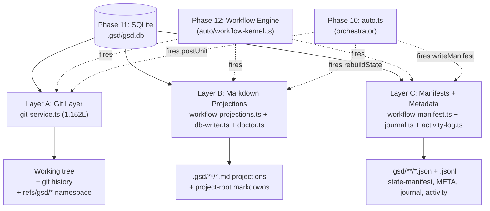
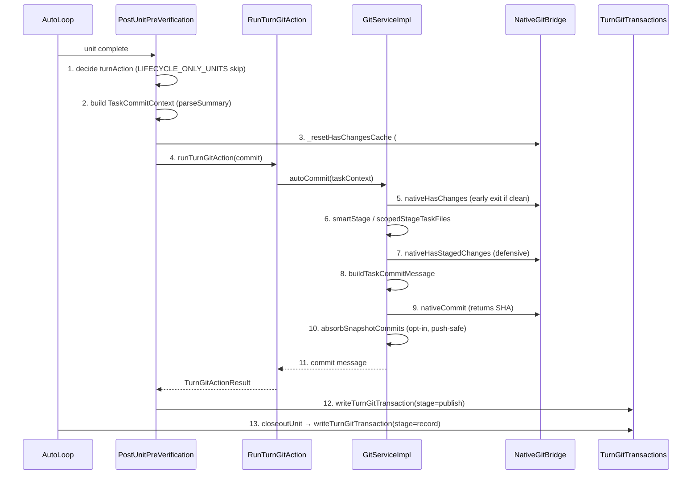
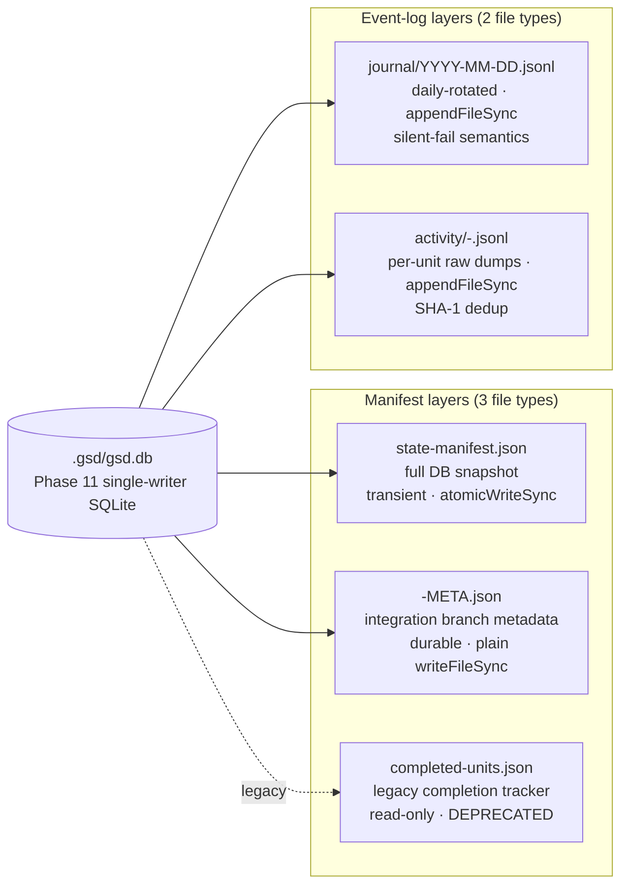

# File Tracking & Commits — GSD-2 Artifact Belt

> Phase 13 — WORK-04 — Milestone M3 (Workflow Engine).
> Sibling spine docs: [auto-mode.md](./auto-mode.md) (Phase 10 orchestrator), [state-persistence.md](./state-persistence.md) (Phase 11 SQLite layer), [workflow-engine.md](./workflow-engine.md) (Phase 12 decision kernel).
> Forward-refs: Phase 14 (quality enforcement), future merge-strategy phase, future GitHub-sync phase.

**Layer:** Workflow Engine (M3) — file tracking + commits subsystem.
**Audience:** Python reimplementer at `~/projects/state/` mapping GSD-2's artifact-tracking belt — git layer, markdown projection layer, manifest+metadata layer — to a Python equivalent. Read in conjunction with `kb/workflow/state-persistence.md` (the DB this layer renders from) and `kb/workflow/workflow-engine.md` (the kernel that fires this layer's actions).

**Source files (artifact-tracking belt, ~6,200 LOC across the in-scope files documented here + Plan 03):**

The git layer (in `gsd-2/src/resources/extensions/gsd/`):
`git-service.ts` (1,152 — facade · GitPreferences · RUNTIME_EXCLUSION_PATHS · COMMIT_TYPE_RULES · GitServiceImpl class · turn-action API) ·
`native-git-bridge.ts` (1,364 — libgit2 bridge with `execFileSync` fallback; gated by `GSD_ENABLE_NATIVE_GSD_GIT=1`) ·
`git-constants.ts` (41 — `GIT_NO_PROMPT_ENV` env overlay + 7 leak-prone parent vars stripped) ·
`git-self-heal.ts` (158 — best-effort recovery for interrupted merges/rebases) ·
`branch-patterns.ts` (~30 — `SLICE_BRANCH_RE` / `QUICK_BRANCH_RE` / `WORKFLOW_BRANCH_RE` regexes) ·
`worktree.ts` (~250 — thin facade wrapping `GitServiceImpl` per basePath) ·
`safety/git-checkpoint.ts` (131 — pre-unit checkpoint ref creation + opt-in destructive rollback) ·
`gitignore.ts` (323 — `GSD_RUNTIME_PATTERNS` canonical source of truth + `BASELINE_PATTERNS`).

The atomic-write substrate (shared with Phase 11):
`atomic-write.ts` (186 — `atomicWriteSync` / `atomicWriteAsync` · temp-file + rename + 5-attempt retry on EBUSY/EPERM/EACCES · `Atomics.wait`-based sync sleep). Already documented in [state-persistence.md](./state-persistence.md); §3 below cross-links and re-uses.

The markdown projection layer (Plan 03 §10-§12 detail; named here for inventory):
`workflow-projections.ts` (496 — 5 projection renderers, `atomicWriteSync`-backed) · `markdown-renderer.ts` (~870 — authoritative ROADMAP/PLAN renderer) · `db-writer.ts` (883 — DB→md for project-root files) · `doctor.ts` (~1,500 — `buildStateMarkdown` + `rebuildState`) · `files.ts` (~1,300 — generic file IO, plain `writeFileSync`) · `parsers-legacy.ts` (~400).

The manifest + metadata layer (Plan 03 §13 detail; named here for inventory):
`workflow-manifest.ts` (258 — `.gsd/state-manifest.json`) · `git-service.ts:308-381` (per-milestone `<MID>-META.json`) · `forensics.ts:631-639` (legacy `.gsd/completed-units.json`) · `journal.ts` (208 — daily-rotated `.gsd/journal/YYYY-MM-DD.jsonl`) · `activity-log.ts` (184 — per-unit `.gsd/activity/<seq>-<unit-key>.jsonl`) · `auto-artifact-paths.ts` (185 — unit-type → expected-artifact-path map).

The per-turn integration sites (Plan 03 §14 detail):
`auto-post-unit.ts` (1,575 — fires `runTurnGitAction` post-unit) · `auto-unit-closeout.ts` (87 — post-commit forensics row) · `uok/gitops.ts` (UOK feature-flag) · `auto.ts` (2,373 — `STATE_REBUILD_MIN_INTERVAL_MS = 30_000` constant + four explicit rebuild call sites) · `commands-maintenance.ts` (~580 — doctor commands).

The diff layer:
`diff-context.ts` (214 — wraps native diff primitives for prompt injection) · `native-git-bridge.ts:gitDiffStat/NameStatus/Numstat/Content` (within 1,364 — read primitives).

**Walkthroughs:** None at the time of writing. The 1,152-line `git-service.ts` god-file is the canonical read-target; this document and Plan 03's §8-§16 substitute for a slice walkthrough. `auto-post-unit.ts` (1,575 lines) is tracked separately for X-02 cross-cutting walkthrough phase.

**Sibling docs / back-refs:**
- [`./auto-mode.md`](./auto-mode.md) (Phase 10) — the orchestrator that fires the per-turn commit at unit-end. The `runTurnGitAction` entry point is invoked from `auto-post-unit.ts:postUnitPreVerification`.
- [`./state-persistence.md`](./state-persistence.md) (Phase 11) — the SQLite DB this layer reads to render markdown projections; documents the atomic-write substrate cross-linked here in §3.
- [`./workflow-engine.md`](./workflow-engine.md) (Phase 12) — the decision kernel. Phase transitions decided there cause this layer's projection rebuilds and forensics writes.

**ADR sources:** None specific to this layer. Architectural decisions are encoded in source — issue references cited inline (#5046 subjectless commits, #4980 NEW-1 env stripping, #4980 HIGH-2 pre-merge tokenizer, #4980 HIGH-4 pre-rollback stash, #1605 pathspec-vs-add-then-unstage, #1991 parallel-worker scope, #1853 native-changes cache reset, #453 native bridge gating, #3651 ROADMAP renderer split, #1293/#2498/#300 integration-branch refusal patterns).

---

## §0 Honest Corrections (read first)

> The CONTEXT.md and ROADMAP framings of this layer use language ("atomic commit protocol", "phase manifest", "STATE.md auto-update") that disagrees with the source after several refactors landed. Reverse-engineering the code surfaces six naming/architectural gaps that the rest of this document addresses head-on (the Phase 10/11/12 spine docs set the precedent — corrections-first, source-of-truth-first). Four briefer mentions follow at the bottom.

> **Correction (1) — There is no transactional commit-with-rollback.**
> The per-turn `git commit` (`autoCommit` at `git-service.ts:766`) is **best-effort**. Atomicity is **layered**: file writes are atomic via `atomic-write.ts` (temp + rename + retry-on-EBUSY/EPERM/EACCES, up to 5 attempts), SQLite writes are atomic via WAL + transactions (Phase 11), but `git commit` is a regular commit with no rollback semantics. If `nativeAddAllWithExclusions` half-stages, the index reflects that. If `nativeCommit` succeeds and a downstream step fails, the commit stays. The "rollback" mechanism is a **separate, opt-in pre-unit checkpoint ref** at `refs/gsd/checkpoints/<safe-unitId>` written by `safety/git-checkpoint.ts:createCheckpoint` BEFORE unit dispatch — consumed by the safety-harness, **not by the commit pipeline**. Plan 03 §8 details the safety harness; here we just establish the boundary: rollback is not the commit's responsibility.
> **Source:** `git-service.ts:autoCommit` (line 766) + `safety/git-checkpoint.ts` (full 131 lines).

> **Correction (2) — STATE.md is NOT committed to git.**
> It is gitignored. Canonical sources: `gitignore.ts:GSD_RUNTIME_PATTERNS` (line 27, includes `.gsd/STATE.md`) and `git-service.ts:RUNTIME_EXCLUSION_PATHS` (line 294, the runtime mirror used by `smartStage`). The two arrays are both gitignored and pathspec-excluded. STATE.md "auto-update" writes the projection at `.gsd/STATE.md` — which is in BOTH `RUNTIME_EXCLUSION_PATHS` (line 294) AND `GSD_RUNTIME_PATTERNS` (gitignore.ts:27). The on-disk STATE.md is a **render-cache** of `deriveStateFromDb()` output (Phase 12), NOT a state store. The DB is the only authoritative state. Phase 11 already established this for the SQLite layer; Phase 13 establishes the same boundary for the markdown projection layer.
> **Source:** `gitignore.ts:27` + `git-service.ts:294` + `workflow-projections.ts:renderStateProjection` (line 352, atomic-write to `.gsd/STATE.md`).

> **Correction (3) — Conventional commit subject is `{type}: {description}` — NO scope.**
> Older docs claiming `chore(M001/S01): ...` are outdated (#5046 redesign). The current format is **subjectless** in the conventional-commit sense — no `(scope)` parens. GSD metadata lives in git **trailers** at the end of the body: `GSD-Task: <sliceId>/<taskId>` (mandatory when `taskContext` is present), optional `Resolves #N` for GitHub issues. The trailer convention mirrors `Signed-off-by:` / `Co-Authored-By:`. Type is **keyword-inferred** from the task title + one-liner via `inferCommitType` (`git-service.ts:1135`), driven by the 7-rule `COMMIT_TYPE_RULES` table at line 616 (first-match-wins; default `feat`).
> **Source:** `git-service.ts:buildTaskCommitMessage` (line 149) + `inferCommitType` (line 1135) + `COMMIT_TYPE_RULES` (line 616).

> **Correction (4) — "Phase manifest" is overloaded.**
> The CONTEXT.md term maps to at least three distinct files plus two log streams. None of them is a "phase manifest" in the singular sense ROADMAP suggests:
> - `.gsd/state-manifest.json` — **transient full-DB JSON snapshot** via `workflow-manifest.ts:writeManifest` (line 206), atomic-write, gitignored. Crash-recovery seed only.
> - `.gsd/milestones/<MID>/<MID>-META.json` — **per-milestone integration metadata** via `git-service.ts:writeIntegrationBranch` (line 344), durable across worktree teardowns, **plain `writeFileSync`** (not atomic — line 379).
> - `.gsd/completed-units.json` — **legacy unit-key tracker** via `forensics.ts:loadCompletedKeys` (line 631). DEPRECATED in favor of DB completion counts.
> - `.gsd/journal/YYYY-MM-DD.jsonl` — daily-rotated event journal (`journal.ts`, file-locked append).
> - `.gsd/activity/<seq>-<unit-key>.jsonl` — per-unit raw session dumps (`activity-log.ts`, append-only debug).
>
> Plan 03 §13 separates them cleanly. This document mentions all five for completeness; deep coverage is in Plan 03.
> **Source:** `workflow-manifest.ts` (full) + `git-service.ts:308-381` + `forensics.ts:631-639` + `journal.ts` + `activity-log.ts`.

> **Correction (5) — Two STATE.md renderers exist, parity is manually coordinated.**
> - `doctor.ts:buildStateMarkdown` (line 91) — synchronous pure renderer used by `rebuildState` (line 148) and `updateStateFile` (line 141). Writes via `saveFile` (NOT atomic-write).
> - `workflow-projections.ts:renderStateContent` (line 295) + `renderStateProjection` (line 352) — async renderer, uses **`atomicWriteSync`** (line 370), with a DB-handle probe (line 358-364) that skips writing when the SQLite handle is open-but-broken.
>
> The two produce **identical output** by design (renderStateContent comment line 292: "Matches the buildStateMarkdown output format from doctor.ts exactly"). **No test enforces parity.** Refactor candidate. Plan 03 §12 details.
> **Source:** `doctor.ts:91-148` + `workflow-projections.ts:295-370`.

> **Correction (6) — The 30s STATE.md throttle constant exists but is NOT enforced inside `rebuildState`.**
> `STATE_REBUILD_MIN_INTERVAL_MS = 30_000` is declared at `auto.ts:291`. The post-unit trigger sites at `auto-post-unit.ts:622-624`, `auto.ts:1119-1125`, `auto.ts:1358-1363`, and `auto.ts:2030` all call `rebuildState(s.basePath)` directly with **no throttle gate**. `.planning/codebase/CONCERNS.md:188` ("C1 STATE.md rebuild after every unit") explicitly identifies this as a CPU-amplification source in long sessions. The throttle is best understood as a **declared intent that the actual call sites have not yet adopted** — Plan 03 §12 returns to this gap.
> **Source:** `auto.ts:291` (constant) vs `auto-post-unit.ts:622-624` (unguarded call) + `.planning/codebase/CONCERNS.md:188`.

**Briefer corrections (Plan 03 expands):**

> **(7)** The smart-stage one-time runtime cleanup (`chore: untrack .gsd/ runtime files from git index`) is a **deliberate two-commit pattern**, not a bug. It must commit before the main commit because the soft reset that would undo `rm --cached` runs against tracked-and-modified files. Cite `git-service.ts:smartStage` lines 656-675.

> **(8)** **`saveFile` (in `files.ts`) is NOT atomic-write.** It is a plain `writeFileSync`. Atomic-write is reserved for STATE.md projection (`renderStateProjection`), `state-manifest.json` (`writeManifest`), `auto.lock` legacy (Phase 11), `last-snapshot.md` compaction digest (Phase 11), and journal entries (`appendFileSync` under `withFileLockSync`). Project-root markdowns (DECISIONS.md, REQUIREMENTS.md, etc.) regenerate from DB on next dispatch — partial writes are tolerable.

> **(9)** **The native git2 bridge is OFF by default** (`GSD_ENABLE_NATIVE_GSD_GIT=1` env opt-in, issue #453 in `native-git-bridge.ts:18`). Bookkeeping currently runs via the stable git CLI fallback (`execFileSync('git', …)`). Push operations remain CLI-only **even when native is enabled** — git2 credential handling is too complex (file header).

> **(10)** **`completed-units.json` has no centralized writer in the source.** Only readers (`forensics.ts:loadCompletedKeys` line 631) were found. Writes appear scattered or coming from older code paths. The file is treated as legacy and superseded by DB completion counts (`forensics.ts:643`).

---

## §1 Overview — three-layer artifact belt

The artifact tracking belt sits between the SQLite state (Phase 11) and the workflow phase transitions (Phase 12), translating DB writes into on-disk artifacts. It has three layers, all coexisting in `gsd-2/src/resources/extensions/gsd/`.

**Layer A — Git layer.** `git-service.ts` (1,152) + `native-git-bridge.ts` (1,364) + `worktree.ts` + `safety/git-checkpoint.ts` + `gitignore.ts` + `branch-patterns.ts` + `git-self-heal.ts` + `git-constants.ts`. Owns: commit, smart-staging with pathspec exclusions, conventional commit message generation, snapshot refs (`refs/gsd/snapshots/<label>/<timestamp>`), checkpoint refs (`refs/gsd/checkpoints/<safe-unitId>` — opt-in rollback), absorb-snapshot history rewriting (squashes consecutive `gsd snapshot:` commits), integration-branch metadata (per-milestone `<MID>-META.json`), and the pre-merge command tokenizer that prevents shell-metachar injection (#4980 HIGH-2). The Layer A surface is documented in §4-§7 below.

**Layer B — Markdown projection layer.** `workflow-projections.ts` (496) + `doctor.ts:91-154` (`buildStateMarkdown` + `rebuildState`) + `db-writer.ts` (883) + `markdown-renderer.ts` (~870). Owns the **DB→markdown direction**. STATE.md, ROADMAP.md, PLAN.md, SUMMARY.md, DECISIONS.md, REQUIREMENTS.md are all rendered from DB rows — none of them is a state store. STATE.md uses atomic-write; project-root markdowns use plain `saveFile`. (Plan 03 §10-§12 details.)

**Layer C — Manifest + metadata layer.** `workflow-manifest.ts` (258) for `.gsd/state-manifest.json`; `git-service.ts:308-381` for per-milestone `<MID>-META.json`; `forensics.ts:631-639` for legacy `.gsd/completed-units.json`; `journal.ts` (208) for `.gsd/journal/YYYY-MM-DD.jsonl`; `activity-log.ts` (184) for `.gsd/activity/<seq>-<unit-key>.jsonl`; `auto-artifact-paths.ts` (185) as the unit-type→expected-artifact-path map. Owns the JSON-shaped state survival layer plus the event/session log streams. (Plan 03 §13 details.)

Cross-reference to the rest of M3: Phase 10 covered `auto/orchestrator.ts` (the orchestrator facade that fires the per-turn commit). Phase 11 covered the SQLite tables this layer reads to render projections (and writes for `turn_git_transactions` forensics). Phase 12 covered the kernel that decides when transitions happen — those transitions trigger this layer's commit, projection-rebuild, and manifest-write actions. Phase 13 (this doc) covers the artifact belt that records those transitions on disk.



---

## §2 Source File Inventory

All paths relative to `gsd-2/src/resources/extensions/gsd/` unless noted otherwise. Scope: file tracking + git commit + STATE.md projection + manifest + `.gsd/` layout.

### Tier 1 — Atomic file write substrate (cross-link to `state-persistence.md`)

| File | Lines | Purpose |
|------|-------|---------|
| `atomic-write.ts` | 186 | **Temp-file + atomic rename** with retry-on-EBUSY/EPERM/EACCES (up to 5 attempts, jittered backoff `8*attempt + (jitter % 5)` ms). Sync (`atomicWriteSync`) and async (`atomicWriteAsync`) variants. The sync sleep uses `Atomics.wait(SharedArrayBuffer)`. Already documented in Phase 11 [`state-persistence.md`](./state-persistence.md); §3 below cross-links and re-uses. |

### Tier 2 — Git service layer (the heart of WORK-04 commit territory)

| File | Lines | Purpose |
|------|-------|---------|
| `git-service.ts` | **1,152** | The high-level git facade. Owns: `GitPreferences` interface (`auto_push`, `push_branches`, `snapshots`, `isolation`, `manage_gitignore`, `collapse_cadence`, `milestone_resquash`, `absorb_snapshot_commits`, `auto_pr`, `safety_harness.auto_rollback`, `main_branch`); `RUNTIME_EXCLUSION_PATHS` (line 283 — runtime mirror of `gitignore.ts:GSD_RUNTIME_PATTERNS`); commit message generation (`buildTaskCommitMessage` line 149, `inferCommitType` line 1135, `COMMIT_TYPE_RULES` line 616, `sanitizeCommitSubjectDescription` line 182); milestone metadata (`milestoneMetaPath` line 308, `readIntegrationBranch` line 316, `writeIntegrationBranch` line 344, `resolveMilestoneIntegrationBranch` line 400); pre-merge command tokenizer (`tokenizePreMergeCommand` line 483 — issue #4980 HIGH-2); the `GitServiceImpl` class (line 627) with `commit`, `autoCommit` (line 766), `smartStage` (line 653 — pathspec exclusions + parallel-worker milestone scoping #1991), `scopedStageTaskFiles` (line 717 — task-key-files-only staging fallback), `absorbSnapshotCommits` (line 811 — opt-in history rewrite, push-safety-guarded), `getMainBranch` (line 896 — 4-step integration branch resolution), `createSnapshot` (line 944 — `refs/gsd/snapshots/<label>/<timestamp>` namespace), `runPreMergeCheck` (line 965), turn-action API (`TurnGitActionMode`, `TurnGitActionResult`, `runTurnGitAction` line 1084, `handleTurnGitActionError`), `createDraftPR` (line 1033, opt-in `auto_pr` pref). |
| `native-git-bridge.ts` | **1,364** | Optional libgit2 bridge gated by `GSD_ENABLE_NATIVE_GSD_GIT=1` env (issue #453, default OFF — bookkeeping stays on stable git CLI). Wraps `@gsd/native` for read primitives (`gitCurrentBranch`, `gitMainBranch`, `gitBranchExists`, `gitHasMergeConflicts`, `gitWorkingTreeStatus`, `gitHasChanges`, `gitCommitCountBetween`, `gitIsRepo`, `gitHasStagedChanges`, `gitDiffStat`, `gitDiffNameStatus`, `gitDiffNumstat`, `gitDiffContent`, `gitLogOneline`, `gitWorktreeList`, `gitBranchList`, `gitBranchListMerged`, `gitLsFiles`, `gitForEachRef`, `gitConflictFiles`, `gitBatchInfo`) and write primitives (`gitInit`, `gitAddAll`, `gitAddPaths`, `gitResetPaths`, `gitCommit`, `gitCheckoutBranch`, `gitCheckoutTheirs`, `gitMergeSquash`, `gitMergeAbort`, `gitRebaseAbort`, `gitResetHard`, `gitBranchDelete`, `gitBranchForceReset`, `gitRmCached`, `gitRmForce`, `gitWorktreeAdd`, `gitWorktreeRemove`, `gitWorktreePrune`, `gitRevertCommit`, `gitRevertAbort`, `gitUpdateRef`). Falls back to `execFileSync('git', …)` via `gitExec`/`gitFileExec`. **Push operations remain CLI-only.** |
| `git-constants.ts` | 41 | `GIT_NO_PROMPT_ENV`: env overlay that suppresses interactive prompts (`GIT_TERMINAL_PROMPT=0`, `GIT_ASKPASS=""`, `GIT_SVN_ID=""`, `LC_ALL=C`) AND strips 7 leak-prone parent vars (`GIT_DIR`, `GIT_WORK_TREE`, `GIT_INDEX_FILE`, `GIT_OBJECT_DIRECTORY`, `GIT_ALTERNATE_OBJECT_DIRECTORIES`, `GIT_COMMON_DIR`, `GIT_NAMESPACE`) — issue #4980 NEW-1. |
| `git-self-heal.ts` | 158 | Best-effort recovery routines for common git error states (interrupted merge, partial rebase). |
| `branch-patterns.ts` | ~30 | `SLICE_BRANCH_RE`, `QUICK_BRANCH_RE`, `WORKFLOW_BRANCH_RE` — regex patterns identifying ephemeral GSD branches that should NOT be recorded as integration branches. Single source of truth. |
| `worktree.ts` | ~250 | Thin wrapper exposing `autoCommitCurrentBranch` (line 189 — calls `getService(basePath).autoCommit`), `captureIntegrationBranch` (line 74), `setActiveMilestoneId` (line 63), `detectWorktreeName` (line 89), `getSliceBranchName` (line 130), `resolveGitHeadPath` (line 203 — handles `.git`-as-file worktree case), `nudgeGitBranchCache` (line 225). Lazy `GitServiceImpl` cache scoped per basePath. |
| `safety/git-checkpoint.ts` | 131 | **Pre-unit checkpoint ref creation + opt-in destructive rollback.** `createCheckpoint(basePath, unitId)` writes `refs/gsd/checkpoints/<safe-unitId>` at HEAD. `rollbackToCheckpoint(basePath, unitId, sha)` does `git stash push --include-untracked -m "gsd: pre-rollback-stash"` (#4980 HIGH-4 — preserves user's WIP) then `git reset --hard <sha>`. `cleanupCheckpoint` deletes the ref. **Destructive — opt-in via `safety_harness.auto_rollback`.** This is GSD-2's only "rollback" mechanism; it is NOT a transactional commit. |
| `gitignore.ts` | 323 | Bootstrappers for `.gitignore` and `PREFERENCES.md`. **`GSD_RUNTIME_PATTERNS`** (line 27) is the **canonical source of truth** for transient `.gsd/` paths. `BASELINE_PATTERNS` (line 48) — universally-correct ignore patterns (`.gsd`, `.bg-shell/`, `.env`, `node_modules/`, `dist/`, etc.). Self-heal: untrack runtime files via `nativeRmCached` if accidentally added to git index. |

### Tier 3 — Markdown projection layer (DB → Markdown) — Plan 03 detail

| File | Lines | Purpose |
|------|-------|---------|
| `workflow-projections.ts` | **496** | The DB→markdown direction. **5 projection renderers**: `renderPlanProjection` (line 101 → `.gsd/milestones/<MID>/slices/<SID>/<SID>-PLAN.md`), `renderRoadmapProjection` (line 159 → `.gsd/milestones/<MID>/<MID>-ROADMAP.md`; deprecated in favor of `markdown-renderer.ts:renderRoadmapFromDb` per #3651), `renderSummaryProjection` (line 276 → `.gsd/milestones/<MID>/slices/<SID>/tasks/<TID>-SUMMARY.md`), `renderStateProjection` (line 352 → `.gsd/STATE.md`), `renderAllProjections` (line 382 — full milestone refresh). **All disk writes use `atomicWriteSync`.** **All errors are non-fatal per D-02** (`logWarning` only, never throws). `regenerateIfMissing` (line 430) implements PROJ-05. DB-handle probe at lines 358-364. |
| `markdown-renderer.ts` | ~870 | Authoritative ROADMAP / PLAN renderer (preserves Boundary Map and other multi-line sections). Used by `plan-milestone`, `reassess-roadmap`, and `renderAllProjections` for the ROADMAP projection. |
| `db-writer.ts` | **883** | **DB→markdown for the project-root files only.** `generateDecisionsMd` (line 85) renders DECISIONS.md; `generateRequirementsMd` (line 133) renders REQUIREMENTS.md. `isDecisionsTableFormat` (line 36) — preserves freeform formatting. **DB-first save helpers** (`saveDecisionToDb` line 430 — async, lock-serialized; `saveRequirementToDb` line 301; `saveArtifactToDbForWorkspace` line 724; `saveArtifactToDbByScope` line 790) all upsert to DB then regenerate markdown via `saveFile`. |
| `doctor.ts` | ~1,500 (sampled lines 1-250) | **STATE.md builder lives here.** `buildStateMarkdown(state)` (line 91) — pure renderer. `rebuildState(basePath)` (line 148) — async helper: `invalidateAllCaches()` → `deriveState(basePath)` → `saveFile(STATE_PATH, buildStateMarkdown(state))`. `validateTitle` (line 46) — guards against em/en-dash and forward-slash in titles. |
| `files.ts` | ~1,300 | Generic file IO: `loadFile`, `saveFile`, `parseSummary`, `parseTaskPlanMustHaves`, `loadActiveOverrides`. **`saveFile` is NOT `atomicWriteSync`** — plain `writeFileSync` with mkdir-recursive. |
| `parsers-legacy.ts` | ~400 | Legacy markdown parsers (`parseRoadmap`, `parsePlan`) for projects that pre-date schema v10 (markdown-as-state-of-truth era). Read-only. |

### Tier 4 — Phase manifest + per-milestone metadata (JSON) — Plan 03 detail

| File | Lines | Purpose |
|------|-------|---------|
| `workflow-manifest.ts` | **258** | **The `.gsd/state-manifest.json` layer.** `StateManifest` interface (line 19): `{version: 1, exported_at, milestones[], slices[], tasks[], decisions[], verification_evidence[]}`. `snapshotState()` (line 64) reads ALL rows in a `readTransaction`. `writeManifest(basePath)` (line 206) — JSON 2-space indent, `atomicWriteSync`. `readManifest` (line 219) — version + structural validation. `bootstrapFromManifest` (line 249) — invokes `restoreManifest` (in `gsd-db.ts` for single-writer invariant). **Gitignored.** |
| `git-service.ts:308-381` | (within 1,152) | **Per-milestone integration metadata**: `<projectRoot>/.gsd/milestones/<MID>/<MID>-META.json`. Free-form JSON; documented field `integrationBranch: string`. `readIntegrationBranch` line 316; `writeIntegrationBranch` line 344 — refuses SLICE/QUICK/WORKFLOW patterns; `resolveMilestoneIntegrationBranch` line 400 returns `{recordedBranch, effectiveBranch, status, reason}`. **Plain `writeFileSync` (line 379) — NOT atomic-write.** Gitignored. |
| `forensics.ts:631-639` | (within ~1,700) | `loadCompletedKeys(basePath)` reads `.gsd/completed-units.json` — JSON `string[]` of `<unitType>/<unitId>` keys. **DEPRECATED** in favor of DB completion counts (`getDbCompletionCounts` line 643). Gitignored. **No centralized writer found.** |
| `journal.ts` | 208 | `.gsd/journal/YYYY-MM-DD.jsonl` daily-rotated event log. `JournalEntry` shape: `{ts, flowId, seq, eventType, rule?, causedBy?, data?}`. 25 distinct `JournalEventType` values. **Silent-failure semantics** — journal writes never throw. `appendFileSync` under `withFileLockSync`. |
| `activity-log.ts` | 184 | `.gsd/activity/<seq>-<unit-key>.jsonl` per-unit raw session dumps. Monotonically-numbered per `activityDir`. SHA-1 dedup fingerprint (#611). Plain `writeFileSync` — append-only debug. |
| `auto-artifact-paths.ts` | 185 | `resolveExpectedArtifactPath(unitType, unitId, base)` (line 48) — the **definitive map** from unit type to required output file. `diagnoseExpectedArtifact` (line 131). Used by post-unit verification (Phase 12). |

### Tier 5 — Per-turn git transaction tracking + closeout — Plan 03 detail

| File | Lines | Purpose |
|------|-------|---------|
| `auto-post-unit.ts` | **1,575** | Owns the post-unit pipeline. **`postUnitPreVerification`** (line 418) entry point: invalidate caches → settle → load preferences → for each `currentUnit`: build `taskContext` → reset native-changes cache (#1853) → `runTurnGitAction` → notify "Committed: <subject>" → `writeTurnGitTransaction` (UOK gitops) → GitHub sync (non-blocking) → prune dead bg-shell → browser teardown → state-rebuild (`rebuildState` line 622-624) → worktree-sync. `autoCommitUnit` (line 350) — single-shot lifecycle path. `LIFECYCLE_ONLY_UNITS` (line ~310) — units that skip commit. |
| `auto-unit-closeout.ts` | 87 | `closeoutUnit(...)` consolidates metrics-snapshot + activity-log save + memory-extraction. Calls `writeTurnGitTransaction` with `stage: "record"` (post-commit forensics row). |
| `uok/gitops.ts` | (UOK feature-flagged) | `writeTurnGitTransaction({...stage: "publish"\|"record", action, push, status, error?, metadata})` INSERTs into `turn_git_transactions` (Phase 11 schema v15). |
| `auto.ts:285-291, 1119-1125, 1358-1363, 2030` | (within 2,373) | Throttled rebuilds: `STATE_REBUILD_MIN_INTERVAL_MS = 30_000` constant + four explicit `await rebuildState` call sites (idle resume, dispatch boundary, post-pause restore, pre-shutdown). **The throttle is declared but unenforced** at the call sites — see Correction (6). |
| `commands-maintenance.ts` | (within ~580) | `gsd doctor`-style commands for forensic operations on `.gsd/completed-units.json` and other transient state. |

### Tier 6 — Diff management

| File | Lines | Purpose |
|------|-------|---------|
| `diff-context.ts` | 214 | Builds diff-context strings for prompt injection. Wraps `nativeDiffStat` + `nativeDiffNumstat`. Reads `--name-status` to classify changes (A/M/D/R/C). |
| `native-git-bridge.ts:gitDiffStat/NameStatus/Numstat/Content` | (within 1,364) | The diff primitives. `gitDiffNameStatus(repoPath, fromRef, toRef, pathspec?, useMergeBase?)` — most flexible (supports merge-base mode for "since-branched-off"). See §7. |

### Tier 7 — Forward-ref / out-of-scope (acknowledged, not deeply researched)

| File | Lines | Why deferred |
|------|-------|--------------|
| `auto-worktree.ts` | ~2,400 | Worktree lifecycle (create/merge/teardown) — Phase 14 territory and milestone-merge specifically. |
| `slice-cadence.ts` | ~370 | `mergeSliceToMain` (#4765). Surface mention only; merge algorithm deferred. |
| `parallel-merge.ts` | ~250 | Parallel-worker merge resolution. Forward-ref. |
| `worktree-manager.ts` | ~900 | Worktree state machine. Forward-ref. |
| `commands-pr-branch.ts` | 224 | PR branch helper. Forward-ref. |
| `github-sync/sync.ts` | (different ext) | GitHub issue/PR sync. Forward-ref to a future GitHub-sync phase. |
| `roadmap-mutations.ts` / `roadmap-slices.ts` | 134 + 285 | Mutation helpers for roadmap markdown. |

---

## §3 Atomic file write substrate

The atomic-write substrate is shared with Phase 11 (state-persistence). It is documented in detail in [`state-persistence.md`](./state-persistence.md) §atomic-write — this section provides a Phase-13-specific summary and clarifies which write paths in the artifact belt actually use atomic-write versus plain `writeFileSync`.

### §3.1 atomic-write.ts API surface

`atomic-write.ts:1-186` exports two pure-by-default functions:

- **`atomicWriteSync(filePath, content, encoding = "utf-8"): void`** — synchronous variant.
- **`atomicWriteAsync(filePath, content, encoding = "utf-8"): Promise<void>`** — async variant.

Both are thin wrappers over the testable `*WithOps` core (`atomicWriteSyncWithOps` line 123, `atomicWriteAsyncWithOps` line 92), which take an injected ops bag (`{mkdir, writeFile, rename, unlink, sleep, createTempPath?}`). The default ops use `node:fs` directly; the indirection exists so the retry/cleanup loop is unit-testable without a real filesystem.

**Retry policy.** Up to `MAX_RENAME_ATTEMPTS = 5` rename attempts (line 6). Only `EBUSY`, `EPERM`, `EACCES` are treated as transient (line 5 `TRANSIENT_LOCK_ERROR_CODES`). All other errno codes throw immediately. Backoff is `computeRetryDelayMs(attempt) = 8 * attempt + (jitter % 5)` ms (line 35-39) — i.e. ~8/16/24/32 ms with up to 4ms of jitter. Total worst-case retry budget ~80ms.

**Sync sleep is `Atomics.wait`-based.** `sleepSync(ms)` at line 45-47 calls `Atomics.wait(SYNC_SLEEP_VIEW, 0, 0, ms)` against a module-scoped `SharedArrayBuffer` (line 7-8). This **blocks the event loop** — acceptable for short retry windows (≤80 ms), NOT for long-running operations. The 5-attempt cap exists to bound this.

**Failure surface.** On exhaustion, `cleanupTempFileSync` (line 83-89) best-effort removes the temp file, then `buildAtomicWriteError` (line 62-73) wraps the original error with attempt count + errno code while preserving the stack: `Atomic write to <path> failed after N attempts (last error code: <CODE>): <message>`.

### §3.2 Temp-file + rename pattern

The substrate writes to `<filePath>.tmp.<8-hex-chars>` (default `defaultTempPath` at line 31-33 uses `randomBytes(4).toString("hex")`), then `rename`s atomically to `<filePath>`. POSIX `rename(2)` is atomic on the same filesystem (the rename either succeeds entirely or leaves the destination untouched). On Windows, `rename` over an existing file fails — but `node:fs.renameSync` shims this on modern Node, and the EBUSY retry loop handles transient lock contention from indexers / antivirus. The `createTempPath?` injection point exists for tests that need deterministic temp paths.

### §3.3 Which paths in the artifact belt use atomic-write

**Atomic-write paths (atomic-write.ts called):**
- `STATE.md` projection — `workflow-projections.ts:renderStateProjection` (line 370 — atomicWriteSync to `<projectRoot>/.gsd/STATE.md`).
- `state-manifest.json` — `workflow-manifest.ts:writeManifest` (line 206 — atomicWriteSync, JSON 2-space indent).
- `auto.lock` legacy — Phase 11 `crash-recovery.ts` writes via `atomicWriteSync` (back-compat surface; the authoritative crash detection is now DB-driven per Phase 11 Correction 2).
- `last-snapshot.md` — Phase 11 `compaction-snapshot.ts` writes the ≤2 KB Markdown digest atomically.
- Journal entries — `journal.ts` uses `appendFileSync` under `withFileLockSync` (file-lock.ts) — not `atomicWriteSync`, but functionally append-atomic via OS append + flock semantics.

**Plain `writeFileSync` paths (atomic-write NOT called):**
- `<MID>-META.json` per-milestone integration metadata — `git-service.ts:379` uses `writeFileSync` directly. Acceptable: written infrequently (once per milestone), gitignored, and `resolveMilestoneIntegrationBranch` (line 400) has a fallback chain (`recorded → existing → prefs.main_branch → nativeDetectMainBranch`).
- Activity logs — `activity-log.ts` uses `writeFileSync` for `.gsd/activity/<seq>-<unit-key>.jsonl`. Append-only debug artifacts, partial writes tolerable, dedup'd via SHA-1 fingerprint (#611).
- `saveFile` in `files.ts` — generic project-root markdown writer used by `db-writer.ts` to render DECISIONS.md / REQUIREMENTS.md after upsert. Single-writer protected by db-side locks (Phase 11), and the generators are idempotent re-renders from DB rows.
- `completed-units.json` — legacy/deprecated; no centralized writer found in source (Correction 10).

### §3.4 Why the distinction matters

Atomic-write is reserved for files where partial writes corrupt downstream consumers:

- **STATE.md**: the next dispatch's `deriveStateFromDb()` reads-back / parity-checks the projection (drift-detection in `doctor-runtime-checks.ts:305-364`). A half-written STATE.md would surface as a spurious `stale_state_md` doctor issue.
- **state-manifest.json**: `bootstrapFromManifest` (`workflow-manifest.ts:249`) consumes this when DB is missing/corrupt — a half-written manifest is worse than no manifest, since `readManifest` (line 219) does only structural validation.
- **last-snapshot.md** / **auto.lock**: legacy back-compat surfaces; partial writes break legacy consumers.

Project-root markdowns regenerate from DB on every relevant unit; activity dumps are append-only debug; integration-branch metadata has a fallback chain. State files (STATE.md, state-manifest.json) MUST be atomic because partial writes confuse the next dispatch's deriveStateFromDb call. The distinction is **not** "important file vs unimportant file" — it is "downstream consumer requires whole-file consistency vs tolerates partial writes."

---

## §4 Git layer overview

Layer A is the git layer. Two implementations coexist: a libgit2 native bridge (off by default) and a stable `execFileSync('git', ...)` CLI fallback. Bookkeeping operations always go through the same high-level facade `GitServiceImpl` (`git-service.ts:627`), which selects the implementation per-operation.

### §4.1 GitPreferences shape

The `GitPreferences` interface (`git-service.ts:45`) is a flat object passed into `GitServiceImpl` constructor (line 634) plus most operation calls. Documented flags (one-line each):

| Flag | Type | Effect |
|------|------|--------|
| `auto_push` | `boolean?` | After successful commit, push current branch to its upstream. |
| `push_branches` | `string[]?` | Allow-list of branch names where `auto_push` is honored. |
| `snapshots` | `boolean?` | Enable per-turn `gsd snapshot:` ref creation. Default true. Set false to opt-out. |
| `isolation` | `"worktree" \| "branch" \| "off"?` | Worktree-vs-branch isolation mode for parallel auto-mode workers. |
| `manage_gitignore` | `boolean?` | Allow GSD to bootstrap and self-heal `.gitignore` (`gitignore.ts`). |
| `collapse_cadence` | `number?` | Slice-cadence collapse cadence (#4765). Forward-ref. |
| `milestone_resquash` | `boolean?` | Re-squash on milestone close. Forward-ref. |
| `absorb_snapshot_commits` | `boolean?` | Opt-in for `absorbSnapshotCommits` (line 811). Default true. Set false to keep snapshots in history. |
| `auto_pr` | `boolean?` | Enable `createDraftPR` (line 1033). Forward-ref to GitHub-sync phase. |
| `safety_harness.auto_rollback` | `boolean?` | Opt-in for `safety/git-checkpoint.ts:rollbackToCheckpoint` (destructive). |
| `main_branch` | `string?` | Override for `getMainBranch` 4-step resolution chain (line 896). |

### §4.2 GIT_NO_PROMPT_ENV (#4980 NEW-1)

`git-constants.ts` (full 41 lines) exports `GIT_NO_PROMPT_ENV` — the env overlay applied to **every** spawned git child process. It does two things:

**(a) Suppress interactive prompts** — sets `GIT_TERMINAL_PROMPT=0`, `GIT_ASKPASS=""`, `GIT_SVN_ID=""`, `LC_ALL=C` (last one forces English git output so stderr string checks work on all locales — issue #1997).

**(b) Strip 7 leak-prone parent vars** — `LEAKING_GIT_ENV_VARS` (line 14-22) lists `GIT_DIR`, `GIT_WORK_TREE`, `GIT_INDEX_FILE`, `GIT_OBJECT_DIRECTORY`, `GIT_ALTERNATE_OBJECT_DIRECTORIES`, `GIT_COMMON_DIR`, `GIT_NAMESPACE`. `buildSafeParentEnv` (line 24-32) iterates `process.env` and excludes any of these. The threat model: a GSD invocation from inside a git hook, a different worktree's terminal, or any context that pre-set these vars could otherwise silently redirect every operation to a different repo or index. This is **always-on** — there is no opt-out — because the consequences of leaking are silent corruption.

### §4.3 Native bridge gating

`native-git-bridge.ts` is gated by `GSD_ENABLE_NATIVE_GSD_GIT=1` env opt-in (file header + line ~18, issue #453). When unset (the **default**), all native functions short-circuit to `execFileSync('git', …)` via `gitExec` / `gitFileExec`. The bookkeeping path therefore runs through the stable git CLI in the default config.

**Push operations are CLI-only even when native is enabled** — file header comment notes "git2 credential handling is too complex" (SSH agent / credential helpers / multi-factor auth / OAuth tokens). The native bridge handles read-only operations + local writes (commit, reset, branch, worktree-add) but defers anything that crosses a network boundary.

The 10-second `nativeHasChanges` cache (§7.3 below) lives in this module and applies regardless of native-vs-CLI fallback — both paths share the same TTL keyed by basePath.

### §4.4 The pre-unit checkpoint ref (the SEPARATE rollback path)

`safety/git-checkpoint.ts` (full 131 lines) is an **opt-in, destructive rollback path** that lives outside the commit pipeline. It has three exported functions:

- **`createCheckpoint(basePath, unitId)`** (line 24-56) — `git rev-parse --verify HEAD` to get current SHA, sanitize unitId by replacing `/` with `-`, then `git update-ref refs/gsd/checkpoints/<safe-unitId> <sha>`. Returns the SHA or `null` on failure. Tolerates `Needed a single revision` / `unknown revision` / `ambiguous argument 'HEAD'` (line 47-51) — these mean the repo has no commits yet, which is fine.
- **`rollbackToCheckpoint(basePath, unitId, sha)`** (line 66-115) — **destructive**. Steps:
  1. `git rev-parse --abbrev-ref HEAD` to get current branch. Refuse if detached HEAD (line 79-82).
  2. **Pre-rollback stash** (#4980 HIGH-4) — `git stash push --include-untracked -m "gsd: pre-rollback-stash <unitId> <ISO>"` (line 89-96). Best-effort; failures are swallowed (line 95). This preserves any partial fix the user had staged but un-committed.
  3. `git reset --hard <sha>` (line 102-105) — wipes both staged and unstaged changes (the reflog only covers committed state, hence the stash).
  4. `cleanupCheckpoint(basePath, unitId)` (line 108) — deletes the ref.
- **`cleanupCheckpoint(basePath, unitId)`** (line 120-130) — `git update-ref -d refs/gsd/checkpoints/<safe-unitId>`. Non-fatal — the ref may already be gone.

**Critical:** This is GSD-2's only "rollback" mechanism. It is opt-in via `safety_harness.auto_rollback` preference and consumed by the safety-harness decision logic (`safety/safety-harness.ts`, Plan 03 §8). It is **not invoked by the per-turn commit pipeline**. The commit pipeline does not catch its own failures and does not roll back. The two systems are deliberately separated: the checkpoint ref is created BEFORE unit dispatch (so it captures the pre-unit state), and the safety-harness decides post-unit whether to invoke `rollbackToCheckpoint`. The commit step (§5) runs in between, with no awareness of either side.

---

## §5 Per-turn commit pipeline — the heart of WORK-04

Each unit dispatch (Phase 12) ends with **one git commit** that captures all dirty files attributable to that unit. This is the per-turn commit, fired from `auto-post-unit.ts:postUnitPreVerification` (line 451) via `runTurnGitAction` in `git-service.ts:1084`. The protocol has 13 numbered steps spanning two files. This section walks through each.

### §5.1 Turn-action mode + skip set

The turn action is decided once per unit:

```
turnAction: TurnGitActionMode = uokFlags.gitops ? uokFlags.gitopsTurnAction : "commit"
```

Default is `"commit"`. The UOK gitops feature flag may override to `"snapshot"` (write a `refs/gsd/snapshots/` ref instead of a real commit) or `"status-only"` (just probe `nativeHasChanges` and return — useful for status-quo dispatches). Cite `auto-post-unit.ts:451`.

**`LIFECYCLE_ONLY_UNITS`** (`auto-post-unit.ts:~310`) — a set of unit types that **skip the commit step entirely** regardless of turn action. Examples include `gate-evaluate` and other info-only / diagnostic units that produce no file output. Skipping is mandatory for these because invoking `autoCommit` with no dirty files would still run `smartStage` and `nativeHasChanges` for nothing.

### §5.2 The 13-step protocol

1. **Decide turn action** — `auto-post-unit.ts:451`. `turnAction = uokFlags.gitopsTurnAction ?? "commit"`. Skip if `s.currentUnit.type ∈ LIFECYCLE_ONLY_UNITS`.

2. **Build TaskCommitContext (only for `execute-task` units)** — `auto-post-unit.ts:457-491`. Path: `parseUnitId(unit.id)` → `{milestone, slice, task}` → `resolveTaskFile(basePath, mid, sid, tid, "SUMMARY")` → `loadFile(summaryPath)` → `parseSummary(summaryContent)` → extract `summary.title`, `summary.oneLiner`, `summary.frontmatter.key_files`. Lookup GitHub issue via `getTaskIssueNumberForCommit`. Output: `taskContext: TaskCommitContext = {taskId: "<sid>/<tid>", taskTitle, oneLiner?, keyFiles?, issueNumber?}`. Filter: `keyFiles?.filter(f => !f.includes("{{"))` — drops template placeholders that the LLM didn't expand.

3. **Reset native-changes cache (#1853)** — `auto-post-unit.ts:498` calls `_resetHasChangesCache()` from `native-git-bridge.ts`. Why: `nativeHasChanges` has a 10-second TTL keyed by basePath. A stale `false` would make `autoCommit` skip staging entirely, leaving code files only in the working tree where they get destroyed by `git worktree remove --force` during teardown. Clearing the cache before every commit attempt is the fix.

4. **Dispatch the turn-git action** — `auto-post-unit.ts:511` → `git-service.ts:runTurnGitAction` line 1084. Branches:
    - `"status-only"` → `nativeHasChanges(basePath)` → `{action, status: "ok", dirty}`.
    - `"snapshot"` → `git.createSnapshot(label)` writes `refs/gsd/snapshots/<label>/<YYYYMMDD-HHMMSS>` via `nativeUpdateRef`. Returns `{action, status, snapshotLabel, dirty}`. Opt-out via `prefs.snapshots === false`.
    - `"commit"` → `git.autoCommit(unitType, unitId, [], taskContext)` → continue to step 5.
    - **Infrastructure errors RE-THROW** — `runTurnGitAction` wraps the entire branch in try/catch via `handleTurnGitActionError` (line 1073). ENOSPC / EROFS / ENOMEM / EAGAIN classifiers from `auto/infra-errors.ts` propagate to the recovery layer; all other errors return `{action, status: "failed", error: getErrorMessage(err)}`.

5. **Quick dirty check** — `git-service.ts:autoCommit` line 774. `if (!nativeHasChanges(this.basePath)) return null` — early exit. Native libgit2 single-syscall when available; else `git status --porcelain`.

6. **Stage files (smartStage or scopedStageTaskFiles)** — `git-service.ts:autoCommit` lines 776-779. Two paths:
    - `taskContext` provided + `keyFiles.length > 0` → try `scopedStageTaskFiles(taskContext, extraExclusions)` (line 717). Normalize each path via `normalizeRepoRelativePath` (drops null / `..` / absolute), apply exclusions, `nativeAddPaths(basePath, paths)`. **Returns false if no valid paths remain** → fall through to smartStage.
    - Otherwise → `smartStage(extraExclusions)` (line 653).

    `smartStage` algorithm:
    - **(a) One-time runtime cleanup** (line 656-675): if `_runtimeFilesCleanedUp` flag is unset, untrack any RUNTIME paths already in the index via `nativeRmCached`, commit `chore: untrack .gsd/ runtime files from git index` if any were removed, set flag. **Must be a separate commit** because the upcoming reset would undo `rm --cached`. (Correction 7.)
    - **(b) Compute `allExclusions = [...RUNTIME_EXCLUSION_PATHS, ...extraExclusions]`** (line 690).
    - **(c) Parallel-worker scope (#1991)** — if `process.env.GSD_MILESTONE_LOCK` is set, append `.gsd/milestones/<otherMID>/` to exclusions for every milestone that isn't this worker's. Prevents an M033 worker from fabricating M032 artifacts in its commit.
    - **(d) `nativeAddAllWithExclusions(basePath, allExclusions)`** — pathspec form `git add -A '*' ':!exclusion1' ':!exclusion2' ...`. Old approach (`git add -A` then unstage runtime files) hangs on repos with large untracked artifact trees (#1605) — not used.

7. **Verify staging produced something** — `git-service.ts:autoCommit` line 783. `if (!nativeHasStagedChanges(this.basePath)) return null` — defensive: even if Step 5 said dirty, all dirty files might have been runtime-only and got excluded.

8. **Build commit message** — `git-service.ts:autoCommit` lines 785-787. Branches:
    - `taskContext` provided → `buildTaskCommitMessage(taskContext)` (line 149). See §6.
    - Else fallback: `chore: auto-commit after ${unitType}\n\nGSD-Unit: ${unitId}`.

9. **Execute the commit** — `git-service.ts:autoCommit` line 788 → `nativeCommit(basePath, message, {allowEmpty: false})`. Native: `gitCommit` returns the new SHA. Fallback: `git commit -F - --no-edit` with the message piped to stdin (avoids argv-quoting issues with multi-line messages — see `commit` method line 745-753 + the `runGit` helper).

10. **Absorb preceding snapshot commits (history rewrite, opt-in)** — `git-service.ts:autoCommit` line 793 → `absorbSnapshotCommits(message)` (line 811). Algorithm:
    1. Opt-in guard: `prefs.absorb_snapshot_commits === false` returns early.
    2. Walk back from `HEAD~1` for up to 10 commits, counting consecutive subjects starting with `gsd snapshot:`.
    3. **Push-safety guard:** `git merge-base --is-ancestor HEAD~1 origin/<currentBranch>` — if reachable from remote → return (already pushed; never rewrite remote history).
    4. Save current HEAD SHA via `git rev-parse HEAD`.
    5. `nativeResetSoft(basePath, "HEAD~${count+1}")` — leaves working tree intact, moves branch pointer back.
    6. **Re-run `smartStage()`** (NOT `nativeAddTracked` — see comment line 858-863). Snapshot commits used `git add -u` which staged ALL tracked modifications including `.gsd/` runtime files; without re-staging via `smartStage`, those would leak into the absorbed commit.
    7. `nativeCommit(basePath, headMessage, {allowEmpty: false})` — recreates the commit with the same message.
    8. **On failure:** `nativeResetSoft(basePath, savedHead)` — restores original HEAD so the repo isn't left half-reset.
    9. Outer try/catch: any failure is **non-fatal** — snapshots remain unsquashed.

11. **Return commit message** — `git-service.ts:autoCommit` line 795. Output: `string | null`. The caller (`runTurnGitAction`) wraps it in `TurnGitActionResult` and propagates to `postUnitPreVerification`, which notifies via `ctx.ui.notify("Committed: " + commitMessage.split("\n")[0], "info")`.

12. **Forensic record (UOK gitops, optional)** — `auto-post-unit.ts:520-537`. `writeTurnGitTransaction({stage: "publish", action: turnAction, push: uokFlags.gitopsTurnPush, status: gitResult.status, error: gitResult.error, metadata: {dirty, commitMessage, snapshotLabel}})` INSERTs into `turn_git_transactions` (Phase 11 schema v15). On commit failure under gitops gating, also runs UOK closeout gate with `failureClass: "git"` and pauses auto-mode.

13. **Post-commit closeout record** — `auto-unit-closeout.ts:closeoutUnit` lines 68-84. Second `writeTurnGitTransaction({stage: "record", ...})` row from the closeout side. The two stages (publish + record) form the per-turn forensics pair indexed by `idx_turn_git_tx_turn` on `(trace_id, turn_id)` — see Phase 11.

### §5.3 What is NOT rolled back on failure

- The git working tree is left **as git left it**. If `nativeAddAllWithExclusions` half-stages, the index reflects that. Caller does NOT reset.
- The `chore: untrack .gsd/ runtime files` cleanup commit, if it fired in Step 6(a), is **NOT undone** even if the main commit fails.
- The snapshot-absorb `nativeResetSoft` IS conditionally undone (Step 10.8) but only inside the absorb function. Outside that scope, no caller-driven reset exists.
- The pre-unit checkpoint ref (`refs/gsd/checkpoints/<unitId>` from `safety/git-checkpoint.ts:createCheckpoint`) is the SEPARATE, opt-in rollback path consumed by the safety-harness — it is created BEFORE unit dispatch (not in this commit pipeline).

> **There is no transactional rollback of the per-turn commit. The commit is best-effort. The rollback path is the optional checkpoint ref consumed by the safety-harness, not by the commit pipeline.**

### §5.4 Sequence diagram



The 13 steps span two files (`auto-post-unit.ts` 1-3, 11-12; `git-service.ts` 4-11) and end with two forensics rows in `turn_git_transactions` indexed on `(trace_id, turn_id, stage)`. There is no transactional bracket — each step is best-effort, with infrastructure errors (ENOSPC etc.) propagating to the recovery layer and all other errors landing in the `status: "failed"` forensics row.

---

## §6 Conventional commit message

GSD-2 emits conventional-commit-style messages with a clean **subjectless scope** (issue #5046 design). The format diverges from the older `chore(scope): ...` form documented in some legacy GSD docs. This section walks through subject, type inference, body, fallback, snapshot prefix, and the smart-stage exclusion list that backs the staging side of the message-emit pipeline.

### §6.1 Subject format

```
{type}: {description}
```

- **No scope** in parentheses. Old documentation showing `chore(M001/S01): ...` is outdated.
- `{type}` ∈ `feat | fix | refactor | docs | test | perf | chore` — inferred via `inferCommitType` (`git-service.ts:1135`).
- `{description}` is `taskContext.oneLiner ?? taskContext.taskTitle`, then sanitized via `sanitizeCommitSubjectDescription` (`git-service.ts:182`): strip control chars (U+0000-U+001F, U+007F), collapse whitespace, trim. Empty-after-sanitize fallback: `"update task"`.
- **Truncation:** description capped at `70 - type.length` characters; trailing partial words trimmed; suffix `…` (U+2026, single char). Total subject ≤ 72 chars (the conventional Git body width).

### §6.2 Type inference rules (COMMIT_TYPE_RULES — `git-service.ts:616`)

The 7-rule type inference table — reproduced verbatim from source:

| Order | Keywords | Type |
|-------|----------|------|
| 1 | `fix`, `fixed`, `fixes`, `bug`, `patch`, `hotfix`, `repair`, `correct` | `fix` |
| 2 | `refactor`, `restructure`, `reorganize` | `refactor` |
| 3 | `doc`, `docs`, `documentation`, `readme`, `changelog` | `docs` |
| 4 | `test`, `tests`, `testing`, `spec`, `coverage` | `test` |
| 5 | `perf`, `performance`, `optimize`, `speed`, `cache` | `perf` |
| 6 | `chore`, `cleanup`, `clean up`, `dependencies`, `deps`, `bump`, `config`, `ci`, `archive`, `remove`, `delete` | `chore` |
| (default) | (no match) | `feat` |

**Algorithm:** Concatenate `title + " " + oneLiner`, lowercase, then for each rule (in declaration order) and each keyword, if word-boundary regex matches → return that type. Multi-word keywords (e.g. `"clean up"`) use substring match. **Order matters — first match wins.**

**Worked example:**
- Title: `Fix the auth refactor bug`
- Lowercased: `fix the auth refactor bug`
- Rule 1 keyword `fix` matches first → type = `fix`. (Rule 2 keyword `refactor` would have matched but Rule 1 wins by declaration order.)

**Worked example 2:**
- Title: `Add JWT login flow`
- Lowercased: `add jwt login flow`
- No keyword matches → default = `feat`.

The first-match-wins policy means precedence is encoded in the table order: bugs trump refactors, refactors trump docs, etc. This matches conventional-commit semantics where `fix:` is the most informative classification.

### §6.3 Body format

```
- {keyFile1}
- {keyFile2}
... (capped at 8 files)

GSD-Task: {sliceId}/{taskId}

Resolves #{issueNumber}    ← only if GitHub issue lookup succeeded
```

- **Files block** (optional): `taskContext.keyFiles.slice(0, 8).map(f => "- " + f).join("\n")`. The cap-at-8 keeps commits concise — for tasks that touch more files, the trailing files are omitted from the message but still part of the commit. Two newlines separate the files block from the trailers.
- **`GSD-Task:` trailer** is mandatory when `taskContext` is provided. Format mirrors the `Signed-off-by:` / `Co-Authored-By:` git trailer convention (RFC-822-style key-value pairs at the end of the commit body, one per line). This makes the trailer machine-extractable via `git log --format='%(trailers)'` for downstream tools.
- **`Resolves #N` trailer** appears only when GitHub-sync provided an issue number via `getTaskIssueNumberForCommit`. GitHub recognizes `Resolves #N`, `Closes #N`, and `Fixes #N` for auto-close on PR merge.

### §6.4 Fallback message (no taskContext)

Used for lifecycle / non-execute-task units (pre-switch commits, stop commits, state-rebuild commits, worktree-merge commits). Cite `git-service.ts:autoCommit:787`:

```
chore: auto-commit after {unitType}

GSD-Unit: {unitId}
```

Note: the trailer key here is `GSD-Unit:` not `GSD-Task:` — distinguishing lifecycle commits from task commits in `git log` parsers.

### §6.5 Snapshot subject prefix

Cite `git-service.ts:buildTurnSnapshotLabel` (line 1063):

```
gsd snapshot: {sanitized-label}
```

Where `label = "<unitType>/<unitId>"` with non-`[a-zA-Z0-9._/-]` chars replaced by `-`, double slashes/dashes collapsed. **NOT a commit message** — these become **git ref names** at `refs/gsd/snapshots/<label>/<timestamp>` via `nativeUpdateRef`. The `gsd snapshot:` subject prefix is what `absorbSnapshotCommits` looks for during history rewrite (§5.2 Step 10) — it walks back from `HEAD~1` counting consecutive subjects that start with this prefix, then squashes them into the next real `autoCommit`.

### §6.6 Sample rendered commit

A complete `execute-task` commit, with all optional sections present:

```
feat: add user authentication via JWT

- src/auth/jwt.ts
- src/middleware/auth-required.ts
- tests/auth/jwt.test.ts

GSD-Task: S01/T03

Resolves #1247
```

Subject: `feat:` (no keyword matched fix/refactor/docs/test/perf/chore → default), description sanitized to ≤ 66 chars (70 - 4 for `feat`). Files block: 3 keyFiles from task SUMMARY frontmatter, well under the 8-file cap. `GSD-Task:` trailer with `<sliceId>/<taskId>`. `Resolves #1247` trailer because `getTaskIssueNumberForCommit` returned a GitHub issue.

### §6.7 Smart-stage exclusions — RUNTIME_EXCLUSION_PATHS (`git-service.ts:283-300`)

The pathspec exclusion list applied during `smartStage`. Reproduce all 16 entries verbatim:

```
.gsd/activity/        .gsd/audit/         .gsd/forensics/    .gsd/runtime/
.gsd/worktrees/       .gsd/parallel/      .gsd/auto.lock     .gsd/metrics.json
.gsd/completed-units*.json   .gsd/state-manifest.json   .gsd/STATE.md
.gsd/gsd.db*          .gsd/journal/       .gsd/doctor-history.jsonl
.gsd/event-log.jsonl  .gsd/DISCUSSION-MANIFEST.json
```

**Canonical source of truth:** `gitignore.ts:GSD_RUNTIME_PATTERNS` line 27. The two arrays MUST stay synchronized — `RUNTIME_EXCLUSION_PATHS` is the **runtime mirror** used by `nativeAddAllWithExclusions(basePath, allExclusions)` (within `git-service.ts:smartStage` line 690-691) to build the pathspec form: `git add -A '*' ':!.gsd/activity/' ':!.gsd/audit/' ...`.

The dual maintenance is documented but not test-enforced — drift between the two arrays would cause runtime files to leak into commits (a regression GSD has hit before). A future refactor candidate is to derive `RUNTIME_EXCLUSION_PATHS` from `GSD_RUNTIME_PATTERNS` at module-init time.

**Why `git add -A` then unstage hangs (#1605):** Old approach did `git add -A` (no exclusions) then ran `git reset HEAD <runtime-file>` for each runtime path. On repos with large untracked artifact trees (`node_modules/`, `dist/`, etc.), the initial `git add -A` walks every file and pegs the CPU even though those files would be excluded by `.gitignore` immediately after. The pathspec form is **single-pass** and skips excluded directories at the walk level via libgit2's pathspec matcher.

**Parallel-worker scope (#1991):** When `process.env.GSD_MILESTONE_LOCK` is set (signaling a parallel worker on a specific milestone), `smartStage` appends `.gsd/milestones/<otherMID>/` to exclusions for every milestone that isn't this worker's. Without this, an M033 worker could fabricate M032 artifacts in its commit by inadvertently staging changes another worker had written to its own milestone directory.

---

## §7 Git diff primitives

Diff operations are read primitives exposed by `native-git-bridge.ts` and consumed by `diff-context.ts` (which wraps them for prompt injection). They support both branch-vs-branch and **merge-base** ("since-branched-off") views. The native bridge gates these the same way as commit primitives — `GSD_ENABLE_NATIVE_GSD_GIT=1` opt-in, `execFileSync('git', …)` fallback otherwise.

### §7.1 Read primitives table

| Operation | Native function | Output shape |
|-----------|-----------------|--------------|
| Has any changes? | `gitHasChanges(repoPath)` (10s cached) | `bool` |
| Has staged changes? | `gitHasStagedChanges(repoPath)` | `bool` |
| Working-tree status | `gitWorkingTreeStatus(repoPath)` | porcelain text |
| Diff stats | `gitDiffStat(repoPath, fromRef, toRef)` | `{filesChanged, insertions, deletions, summary}` |
| Per-file changes | `gitDiffNameStatus(repoPath, fromRef, toRef, pathspec?, useMergeBase?)` | `[{status, path}]` |
| Per-file numstat | `gitDiffNumstat(repoPath, fromRef, toRef)` | `[{added, removed, path}]` |
| Patch text | `gitDiffContent(repoPath, fromRef, toRef, pathspec?, exclude?, useMergeBase?)` | `string` |
| Commit log oneline | `gitLogOneline(repoPath, fromRef, toRef)` | `[{sha, message}]` |
| Commit count | `gitCommitCountBetween(repoPath, fromRef, toRef)` | `number` |
| Conflict files | `gitConflictFiles(repoPath)` | `string[]` |

Of these, `gitDiffNameStatus` is the most flexible — it accepts a `pathspec` (to scope to a subset of paths) and a `useMergeBase` toggle. The other functions have simpler signatures but are built on the same underlying libgit2 (or `git diff` CLI) calls.

### §7.2 useMergeBase semantics

When `useMergeBase = true`, `fromRef` is treated as `merge-base(fromRef, toRef)` — i.e. "what changed on `toRef` since it diverged from `fromRef`". This is the **"since-branched-off"** view used by milestone-summary and slice-summary diff sections.

**Concrete example:**
- `fromRef = main`, `toRef = gsd/M001/S01`, `useMergeBase = false` → diff is `main..gsd/M001/S01` (i.e. all changes between current `main` HEAD and the slice branch HEAD, including any commits on `main` after the slice branched).
- Same args, `useMergeBase = true` → diff is `merge-base(main, gsd/M001/S01)..gsd/M001/S01` — only the slice's own work, ignoring divergent `main` commits.

The merge-base view is the right default for "what did this slice produce?" reporting; the direct view is used when the question is "are these branches in sync?".

### §7.3 Cache invalidation

`nativeHasChanges` is briefly cached (10-second TTL keyed by `basePath`). This avoids repeated `git status --porcelain` calls during a tight dispatch loop. Two explicit invalidation sites:

- `_resetHasChangesCache()` exported from `native-git-bridge.ts`. Called by `auto-post-unit.ts:498` (before the per-turn commit, Step 3 of §5.2) and by `runTurnGitAction:1093` (defensive — in case the caller forgot).
- Implicit invalidation: cache is per-process; subprocess re-spawns get fresh state, so the agent-session boundary always invalidates.

The cache lives in module-scope state inside `native-git-bridge.ts`, so it survives across calls within a single Node process but does not cross worktree boundaries (the key is `basePath`).

### §7.4 Staging primitives (write side)

| Operation | Native function | Notes |
|-----------|-----------------|-------|
| `git add -A` | `gitAddAll(repoPath)` | Unconditional. |
| `git add -A` with pathspec exclusions | `nativeAddAllWithExclusions(repoPath, exclusions[])` | The smart-staging primitive (§5.2 Step 6(d)). |
| `git add <paths>` | `gitAddPaths(repoPath, paths[])` | Used by `scopedStageTaskFiles`. |
| `git reset <paths>` | `gitResetPaths(repoPath, paths[])` | Unstage. |
| `git reset --soft <ref>` | `nativeResetSoft(repoPath, ref)` | Used by `absorbSnapshotCommits` (§5.2 Step 10). Working tree preserved. |
| `git reset --hard` | `gitResetHard(repoPath)` | Used by `safety/git-checkpoint.ts:rollbackToCheckpoint` ONLY (§4.4). |
| `git rm --cached` | `gitRmCached(repoPath, paths[], recursive?)` | Returns array of removed paths. Used to untrack runtime files (`smartStage` line 665). |

Note that `gitResetHard` is **only** called from `safety/git-checkpoint.ts`. The commit pipeline itself never invokes a hard reset — Step 10's failure-recovery uses `nativeResetSoft` to preserve the working tree (the soft variant moves only the branch pointer, leaving index and worktree untouched).

### §7.5 Conflict surfaces

- **`MergeConflictError`** (`git-service.ts:242`) — thrown when slice/milestone squash-merge hits conflicts in non-`.gsd/` files. Working tree is left in conflicted state (no reset) so the caller can dispatch a fix-merge session. The error carries the list of conflicting files.
- `gitConflictFiles(repoPath)` — used by `git-self-heal.ts` and `worktree-manager.ts` to enumerate conflict markers (`<<<<<<<` / `=======` / `>>>>>>>` patterns) — calls `git diff --name-only --diff-filter=U` under the hood.
- `nativeMergeAbort` / `nativeRebaseAbort` / `nativeRevertAbort` — bail-out primitives for in-progress git workflows. Called by self-heal paths in `git-self-heal.ts` to recover from interrupted merges/rebases/reverts.

### §7.6 diff-context.ts: how diffs feed prompts

`diff-context.ts` (214 lines) wraps `nativeDiffStat` and `nativeDiffNumstat` for **prompt injection**. It reads `--name-status` output to classify changes (A/M/D/R/C — Add/Modify/Delete/Rename/Copy) and aggregates them into a structured diff context that `auto-prompts.ts` injects into LLM prompts. Two view modes:

- **Since-milestone-start** (`useMergeBase=true`, `fromRef=integrationBranch`, `toRef=HEAD`) — used in milestone-summary and slice-summary prompts. Tells the LLM "here's what this milestone has produced since branching from main."
- **Since-last-commit** (`fromRef=HEAD~1`, `toRef=HEAD`) — used in next-step prompts to give the LLM context about what just happened in the previous turn.

The wrapper does not hold its own state — it composes the native bridge primitives + branch-pattern regexes from `branch-patterns.ts` to decide which mode is appropriate. This is a thin adapter layer; the heavy lifting (libgit2 diff walking, name-status parsing) lives in `native-git-bridge.ts`.

### §7.7 Forward-ref: write-side surfaces (Plan 03 §16)

This document covers the **commit pipeline + diff primitives**. Write-side surfaces beyond `autoCommit` — push, branch, worktree-add, merge, integration-branch resolution wrappers, the pre-merge command tokenizer (`tokenizePreMergeCommand` line 483), and the GitHub draft-PR creator (`createDraftPR` line 1033) — are deferred to Plan 03's §16. The 13-function git-service surface enumerated in the must-haves table is fully covered across §4-§7 + Plan 03 §16: `runTurnGitAction`, `autoCommit`, `smartStage`, `scopedStageTaskFiles`, `buildTaskCommitMessage`, `inferCommitType`, `absorbSnapshotCommits`, `createSnapshot` named in §5; `getMainBranch`, `readIntegrationBranch`, `writeIntegrationBranch`, `resolveMilestoneIntegrationBranch`, `tokenizePreMergeCommand` named in §2 and Plan 03 §16.

### §7.8 Source citation index (verified line numbers)

For grepping / cross-reference: the following file:line tuples in the `gsd-2/` sub-repo are cited above. This index is provided so downstream readers (and the validator) can confirm citations resolve to live source.

- `gsd-2/src/resources/extensions/gsd/git-service.ts:45` — `GitPreferences` interface declaration (§4.1).
- `gsd-2/src/resources/extensions/gsd/git-service.ts:149` — `buildTaskCommitMessage` entry (§5.2 Step 8 + §6).
- `gsd-2/src/resources/extensions/gsd/git-service.ts:182` — `sanitizeCommitSubjectDescription` (§6.1).
- `gsd-2/src/resources/extensions/gsd/git-service.ts:242` — `MergeConflictError` class (§7.5).
- `gsd-2/src/resources/extensions/gsd/git-service.ts:283` — `RUNTIME_EXCLUSION_PATHS` constant declaration (§6.7).
- `gsd-2/src/resources/extensions/gsd/git-service.ts:294` — `.gsd/STATE.md` line within `RUNTIME_EXCLUSION_PATHS` (Correction 2).
- `gsd-2/src/resources/extensions/gsd/git-service.ts:308` — `milestoneMetaPath` helper (§2 Tier 4).
- `gsd-2/src/resources/extensions/gsd/git-service.ts:316` — `readIntegrationBranch` (§2 Tier 4).
- `gsd-2/src/resources/extensions/gsd/git-service.ts:344` — `writeIntegrationBranch` (Correction 4).
- `gsd-2/src/resources/extensions/gsd/git-service.ts:379` — plain `writeFileSync` for META.json (§3.3 + Correction 4).
- `gsd-2/src/resources/extensions/gsd/git-service.ts:400` — `resolveMilestoneIntegrationBranch` (§2 Tier 4).
- `gsd-2/src/resources/extensions/gsd/git-service.ts:483` — `tokenizePreMergeCommand` (#4980 HIGH-2; §7.7 forward-ref).
- `gsd-2/src/resources/extensions/gsd/git-service.ts:616` — `COMMIT_TYPE_RULES` table (§6.2).
- `gsd-2/src/resources/extensions/gsd/git-service.ts:627` — `GitServiceImpl` class declaration (§4 + §2 Tier 2).
- `gsd-2/src/resources/extensions/gsd/git-service.ts:653` — `smartStage` method (§5.2 Step 6).
- `gsd-2/src/resources/extensions/gsd/git-service.ts:717` — `scopedStageTaskFiles` (§5.2 Step 6).
- `gsd-2/src/resources/extensions/gsd/git-service.ts:766` — `autoCommit` entry (§5.2 + Correction 1).
- `gsd-2/src/resources/extensions/gsd/git-service.ts:811` — `absorbSnapshotCommits` (§5.2 Step 10).
- `gsd-2/src/resources/extensions/gsd/git-service.ts:896` — `getMainBranch` (§2 Tier 2).
- `gsd-2/src/resources/extensions/gsd/git-service.ts:944` — `createSnapshot` (§5.2 Step 4).
- `gsd-2/src/resources/extensions/gsd/git-service.ts:1063` — `buildTurnSnapshotLabel` (§6.5).
- `gsd-2/src/resources/extensions/gsd/git-service.ts:1084` — `runTurnGitAction` entry (§5.2 Step 4).
- `gsd-2/src/resources/extensions/gsd/git-service.ts:1135` — `inferCommitType` (§6.2).
- `gsd-2/src/resources/extensions/gsd/atomic-write.ts:46` — `Atomics.wait` sync sleep (§3.1).
- `gsd-2/src/resources/extensions/gsd/atomic-write.ts:175` — `atomicWriteSync` public export (§3.1).
- `gsd-2/src/resources/extensions/gsd/git-constants.ts:14` — `LEAKING_GIT_ENV_VARS` (§4.2).
- `gsd-2/src/resources/extensions/gsd/git-constants.ts:35` — `GIT_NO_PROMPT_ENV` export (§4.2).
- `gsd-2/src/resources/extensions/gsd/safety/git-checkpoint.ts:24` — `createCheckpoint` (§4.4).
- `gsd-2/src/resources/extensions/gsd/safety/git-checkpoint.ts:66` — `rollbackToCheckpoint` (§4.4 + Correction 1).
- `gsd-2/src/resources/extensions/gsd/safety/git-checkpoint.ts:120` — `cleanupCheckpoint` (§4.4).
- `gsd-2/src/resources/extensions/gsd/gitignore.ts:27` — `GSD_RUNTIME_PATTERNS` canonical source (§6.7 + Correction 2).
- `gsd-2/src/resources/extensions/gsd/auto-post-unit.ts:418` — `postUnitPreVerification` entry (§2 Tier 5 + §5).
- `gsd-2/src/resources/extensions/gsd/auto-post-unit.ts:451` — turn-action decision site (§5.2 Step 1).
- `gsd-2/src/resources/extensions/gsd/auto-post-unit.ts:498` — `_resetHasChangesCache` invalidation (§5.2 Step 3 + §7.3).
- `gsd-2/src/resources/extensions/gsd/auto-post-unit.ts:511` — `runTurnGitAction` invocation (§5.2 Step 4).
- `gsd-2/src/resources/extensions/gsd/auto-post-unit.ts:520` — `writeTurnGitTransaction` publish-row (§5.2 Step 12).
- `gsd-2/src/resources/extensions/gsd/auto-post-unit.ts:622` — `rebuildState` post-unit trigger (Correction 6).
- `gsd-2/src/resources/extensions/gsd/auto-unit-closeout.ts:68` — closeoutUnit forensics record-row (§5.2 Step 13).
- `gsd-2/src/resources/extensions/gsd/auto.ts:291` — `STATE_REBUILD_MIN_INTERVAL_MS` constant (Correction 6).
- `gsd-2/src/resources/extensions/gsd/workflow-projections.ts:295` — `renderStateContent` (Correction 5).
- `gsd-2/src/resources/extensions/gsd/workflow-projections.ts:352` — `renderStateProjection` (Correction 2 + Correction 5).
- `gsd-2/src/resources/extensions/gsd/workflow-projections.ts:370` — `atomicWriteSync` to `.gsd/STATE.md` (§3.3).
- `gsd-2/src/resources/extensions/gsd/workflow-manifest.ts:206` — `writeManifest` atomic-write (§3.3 + Correction 4).
- `gsd-2/src/resources/extensions/gsd/doctor.ts:91` — `buildStateMarkdown` (Correction 5).
- `gsd-2/src/resources/extensions/gsd/doctor.ts:148` — `rebuildState` (Correction 5).
- `gsd-2/src/resources/extensions/gsd/forensics.ts:631` — `loadCompletedKeys` (Correction 4 + Correction 10).

---

## §8 Markdown projection layer (DB → markdown)

Layer B is the **DB → markdown projection layer**. `workflow-projections.ts` (496 lines) contains 5 renderers that read DB rows and write markdown files in `.gsd/milestones/<MID>/` hierarchy. All disk writes use `atomicWriteSync` (the Phase 11 substrate cross-linked from §3). All errors are **non-fatal per design D-02** — a failed projection logs a warning and the workflow continues.

### §8.1 The 5 renderers

| # | Function | Line | Output path | Notes |
|---|----------|------|-------------|-------|
| 1 | `renderPlanProjection(basePath, milestoneId, sliceId)` | `gsd-2/src/resources/extensions/gsd/workflow-projections.ts:101` | `.gsd/milestones/<MID>/slices/<SID>/<SID>-PLAN.md` | Reuses `markdown-renderer.ts:renderPlanFromDb` for authoritative output (the older simplified projection at this site is intentionally bypassed inside `renderAllProjections` to avoid clobbering Must-Haves / Verification / Files Likely Touched sections — comment at `workflow-projections.ts:396-399`). |
| 2 | `renderRoadmapProjection(basePath, milestoneId)` | `gsd-2/src/resources/extensions/gsd/workflow-projections.ts:159` | `.gsd/milestones/<MID>/<MID>-ROADMAP.md` | **Deprecated** — superseded by `markdown-renderer.ts:renderRoadmapFromDb` which preserves `## Boundary Map` and other multi-line sections (#3651). `renderAllProjections` calls the authoritative renderer instead (line 387). |
| 3 | `renderSummaryProjection(basePath, milestoneId, sliceId, taskId)` | `gsd-2/src/resources/extensions/gsd/workflow-projections.ts:276` | `.gsd/milestones/<MID>/slices/<SID>/tasks/<TID>-SUMMARY.md` | Joins `taskRow` with `verification_evidence` rows (Phase 11 schema v5) before rendering. |
| 4 | `renderStateProjection(basePath)` | `gsd-2/src/resources/extensions/gsd/workflow-projections.ts:352` | `.gsd/STATE.md` (gitignored render-cache) | Async; performs a DB-handle probe before writing (§8.5). The only renderer in this group that is `async`. |
| 5 | `renderAllProjections(basePath, milestoneId)` | `gsd-2/src/resources/extensions/gsd/workflow-projections.ts:382` | (multiple) | Full milestone refresh — calls roadmap → per-slice plan → per-task summary → STATE. Each step wrapped in its own try/catch so a single failure doesn't abort the others. |

### §8.2 Pure renderers vs disk-write wrappers

The codebase splits each projection into **two functions**:

- `render*Content(...)` — pure string-producing function. No DB access, no disk IO. Takes already-loaded rows and returns a markdown string. Examples: `renderPlanContent` (line 50), `renderRoadmapContent` (line 120), `renderSummaryContent` (line 182), `renderStateContent` (line 295).
- `render*Projection(basePath, ...)` — impure wrapper. Reads from DB via the `db.ts` adapter, calls the pure renderer, writes via `atomicWriteSync`.

This split is the underlying shape behind the portable pattern in `kb/patterns/db-driven-markdown-projections.md`. Pure renderers can be unit-tested with synthetic state objects (no DB stub needed), and the wrappers concentrate the impure parts (DB read, disk write) in one place.

### §8.3 atomicWriteSync usage

All 5 wrappers use atomic-write. The `mkdirSync(dir, {recursive: true})` step ensures the destination directory exists before the rename target is computed:

```typescript
// workflow-projections.ts:283-286 (renderSummaryProjection)
const dir = join(basePath, ".gsd", "milestones", milestoneId, "slices", sliceId, "tasks");
mkdirSync(dir, { recursive: true });
atomicWriteSync(join(dir, `${taskId}-SUMMARY.md`), content);

// workflow-projections.ts:368-370 (renderStateProjection)
const dir = join(basePath, ".gsd");
mkdirSync(dir, { recursive: true });
atomicWriteSync(join(dir, "STATE.md"), content);
```

Cross-link to §3 for the full atomic-write substrate (temp + rename + 5-attempt retry on EBUSY/EPERM/EACCES). The substrate is shared with `state-persistence.md` (Phase 11) where it is documented in detail.

### §8.4 Non-fatal error semantics (D-02)

Every `render*Projection` wraps its body in `try/catch` and routes failures through `logWarning("projection", ...)` only — never throws. The workflow continues on projection failure because **projections are derived state**: the DB is authoritative; markdown can always be regenerated.

```typescript
// workflow-projections.ts:352-374 (renderStateProjection — abridged)
export async function renderStateProjection(basePath: string): Promise<void> {
  try {
    if (!isDbAvailable()) return;
    // Probe DB handle — adapter may be set but underlying handle closed
    const adapter = _getAdapter();
    if (!adapter) return;
    try {
      adapter.prepare("SELECT 1").get();
    } catch (err) {
      logWarning("projection", "renderStateProjection: DB handle probe failed, skipping render", {
        error: (err as Error).message,
      });
      return;
    }
    const state = await deriveState(basePath);
    const content = renderStateContent(state);
    const dir = join(basePath, ".gsd");
    mkdirSync(dir, { recursive: true });
    atomicWriteSync(join(dir, "STATE.md"), content);
  } catch (err) {
    logWarning("projection", `renderStateProjection failed: ${(err as Error).message}`);
  }
}
```

**Tradeoff (CONCERNS.md):** the design masks real failures. A renderer that consistently fails will never throw upward; downstream readers see stale or absent markdown but get no error signal at the call site. CONCERNS.md flags this as the "error swallowing in projection renderers" concern (D-02 design). The mitigation is the doctor command (§10.8 below) which detects drift and repairs by calling `rebuildState`.

### §8.5 DB-handle probe

`renderStateProjection` performs a defensive DB-handle probe (`workflow-projections.ts:358-364`) before writing. Even when `isDbAvailable()` returns true, the underlying SQLite handle may have been closed mid-process (worktree teardown, doctor `--fix --reset-db`). The probe runs `SELECT 1` to confirm a live handle. If the probe throws, the renderer logs a warning and returns without writing — preventing a partial or stale STATE.md from being committed when the DB is in an indeterminate state.

The other renderers (`renderPlanProjection`, `renderRoadmapProjection`, `renderSummaryProjection`) do not probe — they are synchronous and the DB-availability check at module entry is considered sufficient. Only the async `renderStateProjection` adds the probe because the gap between the availability check and the read is wider in async code paths.

### §8.6 regenerateIfMissing (PROJ-05)

`regenerateIfMissing(basePath, milestoneId, sliceIds?)` at `gsd-2/src/resources/extensions/gsd/workflow-projections.ts:430` implements the lazy-regeneration contract: when a downstream tool reads a projection file (PLAN.md, SUMMARY.md, ROADMAP.md) and finds it missing or unparseable, it calls `regenerateIfMissing` to repopulate from the DB. This is the safety net behind the D-02 non-fatal design — even if a write was suppressed earlier, the next read repairs the gap. The function also wraps each per-task summary write in its own try/catch (line 463-467) so a single failed task summary does not block the rest.

---

## §9 db-writer.ts — DB → markdown for project-root files

`gsd-2/src/resources/extensions/gsd/db-writer.ts` (883 lines) handles the **project-root markdown files** — `DECISIONS.md` and `REQUIREMENTS.md` — that ARE committed to git (unlike `.gsd/` projections which are gitignored). It uses `saveFile` (a plain `writeFileSync` wrapper from `files.ts` — NOT atomic-write) protected by db-side locks.

### §9.1 generateDecisionsMd

`gsd-2/src/resources/extensions/gsd/db-writer.ts:85` — renders `# Decisions Register` table from `decisions` rows (Phase 11 schema). Format: a markdown table with columns `(date, scope, decision, choice, rationale)`, one row per `decisions` table entry, ordered by `decision_date DESC`.

### §9.2 generateRequirementsMd

`gsd-2/src/resources/extensions/gsd/db-writer.ts:133` — renders `# Requirements` grouped by `status`: `Active`, `Validated`, `Deferred`, `Out of Scope`. Each status group becomes a markdown subsection with rows formatted as `- **[REQ-ID]** description (linked to milestone X)`.

### §9.3 isDecisionsTableFormat + generateDecisionsAppendBlock

A two-mode write strategy preserves user edits to the canonical files:

- `isDecisionsTableFormat(existing: string)` at `db-writer.ts:36` — detects whether the existing `DECISIONS.md` is in the canonical table format that the generator produces. Returns `true` if the file matches; `false` if the user has hand-edited it into freeform markdown.
- `generateDecisionsAppendBlock(newDecisions: Decision[])` at `db-writer.ts:49` — when `isDecisionsTableFormat` returns `false`, the writer appends new decisions as a separate `## Decisions added <date>` block instead of rewriting the file. This preserves freeform user-authored content above; only new rows from the DB are appended below.

This pattern recurs in `REQUIREMENTS.md` handling. The choice (rewrite vs append) is made per-write based on the existing file's structure, not by global config.

### §9.4 DB-first save helpers (async, lock-serialized)

The writer module also exports async DB-write helpers used by command handlers (NOT by the projection layer). These are lock-serialized via the single-writer SQLite facade (Phase 11 — `kb/patterns/single-writer-sqlite-facade.md`):

| Helper | Line | Purpose |
|--------|------|---------|
| `saveDecisionToDb` | `gsd-2/src/resources/extensions/gsd/db-writer.ts:430` | Insert a `Decision` row; lock-serialized to prevent ID-collision races between concurrent calls. |
| `saveRequirementToDb` | `gsd-2/src/resources/extensions/gsd/db-writer.ts:301` | Insert/upsert a `Requirement` row. |
| `saveArtifactToDbForWorkspace` | `gsd-2/src/resources/extensions/gsd/db-writer.ts:724` | Record an `artifacts` row keyed by workspace. |
| `saveArtifactToDbByScope` | `gsd-2/src/resources/extensions/gsd/db-writer.ts:790` | Record an `artifacts` row keyed by scope (milestone/slice/task). |

### §9.5 Round-trip invariant — md ↔ DB fidelity

Each generator can recreate the markdown from current DB rows (the DB is the authoritative source for committed project-root files when the canonical-table mode is active). When a user edits the file into freeform mode, the round-trip property is intentionally broken — the writer never overwrites freeform sections; it only appends. Pre-schema-v10 hand-edited markdowns are handled via `parsers-legacy.ts` migration paths, not by the writer module — `parsers-legacy.ts` parses the legacy form on import, populates the DB, and the writer takes over from there.

The contrast with §8's projection layer is sharp:

| Property | Projection layer (§8 — `workflow-projections.ts`) | Project-root layer (§9 — `db-writer.ts`) |
|----------|---------------------------------------------------|------------------------------------------|
| Files | `.gsd/milestones/.../*.md`, `.gsd/STATE.md` | `DECISIONS.md`, `REQUIREMENTS.md` (project root) |
| Committed to git? | No — gitignored | Yes — committed |
| Write mechanism | `atomicWriteSync` (temp + rename + retry) | `saveFile` → plain `writeFileSync` |
| Lock model | None — relies on DB-handle probe | Single-writer SQLite facade |
| Freeform-edit preservation | No (always overwritten) | Yes (append-only mode when freeform detected) |
| Failure mode | Non-fatal warning, regenerate on next read | Throws; caller decides |

---

## §10 STATE.md auto-update mechanism

STATE.md is a **render-cache** of `deriveStateFromDb()` output (Phase 12), gitignored, rebuilt on every unit completion. The DB is the only authoritative state — STATE.md is for human inspection and stale-reads protect against context resets. Cross-link to `kb/workflow/workflow-engine.md` §3 (the 17-value `Phase` literal that STATE.md exposes) and §4 (the `deriveStateFromDb` decision tree).

### §10.1 What STATE.md is (and isn't)

- **Is:** a render-cache. The `**Phase:**` line, `**Active Milestone:**` line, `**Active Slice:**` line, milestone registry, recent decisions, blockers, and next action are all DB-derived. Reading STATE.md is equivalent to running `deriveStateFromDb` and stringifying the result.
- **Isn't:** a state store. No code path writes to STATE.md and reads it back to make a decision. Editing STATE.md by hand has no effect — the next `rebuildState` overwrites the file.
- **Gitignored:** Both `gitignore.ts:GSD_RUNTIME_PATTERNS` (`gsd-2/src/resources/extensions/gsd/gitignore.ts:27`) and `git-service.ts:RUNTIME_EXCLUSION_PATHS` (`gsd-2/src/resources/extensions/gsd/git-service.ts:294`) include `.gsd/STATE.md`. STATE.md is never committed, never pushed.

### §10.2 Path resolution

`paths.ts:resolveGsdRootFile(basePath, "STATE")` returns the canonical path with legacy-name fallback. The current path is `.gsd/STATE.md`; legacy projects with `.gsd/state.md` (lowercase) are accepted on read but rewritten to the canonical case on next `rebuildState`.

### §10.3 Markdown schema

The full schema, reproduced verbatim from `gsd-2/src/resources/extensions/gsd/doctor.ts:91-139` (`buildStateMarkdown`):

```markdown
# GSD State

**Active Milestone:** {id}: {title}                # OR "None" when no active
**Active Slice:** {id}: {title}                    # OR "None"
**Phase:** {phase}                                  # one of 17 Phase literals (Phase 12)
**Requirements Status:** {a} active · {v} validated · {d} deferred · {o} out of scope

## Milestone Registry
- ✅/🔄/⏸️/⬜ **{id}:** {title}                    # one row per milestone
                                                    # ✅ complete, 🔄 active, ⏸️ parked, ⬜ pending

## Recent Decisions
- {decision1}
... | "- None recorded"

## Blockers
- {blocker1}
... | "- None"

## Next Action
{nextAction text}
```

The `phase === 'complete'` branch shows `**Last Completed Milestone:** {id}: {title}` instead of `**Active Milestone:** ...` (`gsd-2/src/resources/extensions/gsd/workflow-projections.ts:303-308`). Both renderers treat this branch identically.

### §10.4 The two-renderer parity gap (refactor candidate)

Two functions produce STATE.md content with **identical output by manual coordination**:

- `gsd-2/src/resources/extensions/gsd/doctor.ts:91` — `buildStateMarkdown(state)` — synchronous, used by `rebuildState` (`gsd-2/src/resources/extensions/gsd/doctor.ts:148`) and by the doctor drift-repair path.
- `gsd-2/src/resources/extensions/gsd/workflow-projections.ts:295` — `renderStateContent(state)` — synchronous (pure), used by the async `renderStateProjection` wrapper which adds the DB-handle probe and atomicWriteSync.

The comment at `workflow-projections.ts:292` reads: *"Matches the buildStateMarkdown output format from doctor.ts exactly."* The match is enforced **only by hand** — there is no test that asserts the two functions produce identical output for the same `GSDState` input. This is a refactor candidate: either merge the two implementations or add a parity test. CONCERNS.md flags this as Correction 5 of §0 (above) and the doc must surface it as a known gap.

### §10.5 rebuildState algorithm

```typescript
// gsd-2/src/resources/extensions/gsd/doctor.ts:148-154 (verbatim)
export async function rebuildState(basePath: string): Promise<void> {
  invalidateAllCaches();              // clear path/parse/db state caches (Phase 11)
  const state = await deriveState(basePath);  // re-derive from DB (Phase 12)
  const path = resolveGsdRootFile(basePath, "STATE");
  await saveFile(path, buildStateMarkdown(state));  // plain writeFileSync via files.ts
}
```

Three observations:

1. The function **clears caches before deriving**. This prevents a stale `gsdRoot()` cache or a stale parsed-PROJECT.md cache from contaminating the derived state.
2. The write path uses `saveFile` (plain `writeFileSync`) **not** `atomicWriteSync`. The async sibling `renderStateProjection` uses atomicWriteSync. Both are valid: STATE.md is short, the write window is small, and the file is gitignored — partial writes are tolerable on the rare crash. The two paths converge at the same output and use different write mechanisms by historical accident, not by design.
3. `rebuildState` is **NOT** throttled internally. The 30s throttle constant (next subsection) is enforced only at specific caller sites — see §10.7.

### §10.6 Trigger sites — 8 sites

| Trigger | Site | Throttled? |
|---------|------|------------|
| Post-unit completion | `gsd-2/src/resources/extensions/gsd/auto-post-unit.ts:622-624` | No internal throttle |
| Post-pause restore | `gsd-2/src/resources/extensions/gsd/auto.ts:1358-1363` | No |
| Pre-shutdown finalize | `gsd-2/src/resources/extensions/gsd/auto.ts:2030` | No |
| Idle-resume probe | `gsd-2/src/resources/extensions/gsd/auto.ts:1119-1125` | No (caller-specific gate; not via the constant) |
| Pre-dispatch (guided flow) | `gsd-2/src/resources/extensions/gsd/guided-flow.ts:1450-1457` | No |
| Doctor command (drift-driven repair) | `gsd-2/src/resources/extensions/gsd/doctor-runtime-checks.ts:317-325, 351-358` | No |
| Pre-dispatch missing-file repair | `gsd-2/src/resources/extensions/gsd/doctor-proactive.ts:258-274` | No |
| Symbolic 30s throttle constant | `gsd-2/src/resources/extensions/gsd/auto.ts:291` `STATE_REBUILD_MIN_INTERVAL_MS = 30_000` | **Constant exists but NOT enforced inside `rebuildState` itself.** |

### §10.7 The 30s throttle gap (honest correction)

The constant `STATE_REBUILD_MIN_INTERVAL_MS = 30_000` is declared at `gsd-2/src/resources/extensions/gsd/auto.ts:291` with the comment *"Throttle STATE.md rebuilds — at most once per 30 seconds"*. Despite the comment, the constant is referenced/honored **only at specific caller sites** — the function `rebuildState` itself has no throttle gate. CONCERNS.md flags this as the "C1 STATE.md rebuild after every unit" concern: a CPU-amplification source where every fast-completing unit (sub-second tasks) triggers a full `deriveState + buildStateMarkdown + saveFile` cycle, even when the previous rebuild completed milliseconds earlier.

The Python reimplementer should either:
- Move the throttle gate into `rebuild_state` itself (preferred), or
- Honor the existing call-site discipline by checking a module-scope timestamp before invoking — matching current TypeScript behavior.

### §10.8 Drift-detection (the doctor path)

`gsd-2/src/resources/extensions/gsd/doctor-runtime-checks.ts:305-365` implements the only drift-detection path:

1. Read existing STATE.md if present, parse `**Phase:**` line.
2. Run `deriveState(basePath)` to get fresh phase.
3. If phases differ → emit doctor issue `stale_state_md`, severity `warning`.
4. If `--fix` flag is set, call `rebuildState`.
5. If STATE.md missing entirely → severity `error`, fix via `rebuildState`.

This is the **only** drift-detection path in the codebase. There is **no auto-detect-and-repair on every dispatch** — drift between STATE.md and the live DB persists silently between doctor runs. The mitigation is the periodic post-unit `rebuildState` from §10.6: as long as units keep completing, STATE.md stays close to current. Drift accumulates only in pathological cases where the unit pipeline halts before `auto-post-unit.ts:622` runs.

### §10.9 Worktree-related handling

STATE.md is removed before worktree teardown (`gsd-2/src/resources/extensions/gsd/auto-worktree.ts:311-315, 1313`) so the merge-back step doesn't propagate a stale render-cache from the worktree to the project root. The reverse direction — worktree-to-project back-sync — is handled by `syncStateToProjectRoot`, called from `gsd-2/src/resources/extensions/gsd/auto-post-unit.ts:629`. After back-sync, `rebuildState` re-renders against the project-root DB to ensure final consistency.

The cycle is: `unit completes (in worktree)` → `back-sync DB rows to project-root` → `rebuildState (in project root)` → `worktree teardown`. STATE.md ends in the project root reflecting the final post-unit state.

> **Cross-ref to Phase 17 communication-map.** The STATE.md auto-update mechanism documented in this section is the terminal write of the Quality-enforcement → file-tracking → STATE.md projection chain. For the full chain composition (verification-gate decision → per-turn commit → atomicWriteSync to .gsd/STATE.md → next-dispatch deriveStateFromDb read-back) see [`./communication-map.md`](./communication-map.md) §6 + §8 (composite trace terminus).

---

## §11 Phase manifest layers

The CONTEXT.md term **"phase manifest"** is overloaded. Three distinct files exist at different scopes/durabilities, plus two append-only event-log file types. This kb doc separates them.

### §11.1 .gsd/state-manifest.json — full DB snapshot (transient)

| Field | Value |
|-------|-------|
| **Source** | `gsd-2/src/resources/extensions/gsd/workflow-manifest.ts` (full file, 258 lines) |
| **Schema** | `StateManifest` interface line 19 — `{version: 1, exported_at: ISO8601, milestones[], slices[], tasks[], decisions[], verification_evidence[]}` |
| **Write** | `writeManifest(basePath)` line 206 — atomicWriteSync to `.gsd/state-manifest.json`. Called by `workflow-reconcile.ts` after merge events; called by post-unit pipeline iff `prefs.persist_manifest === true` (default off). |
| **Read** | `readManifest(basePath)` line 219 — version + structural validation, throws on malformed. |
| **Bootstrap** | `bootstrapFromManifest` line 249 — invokes `restoreManifest` (lives in `gsd-db.ts` for the single-writer invariant) to rebuild the DB from the manifest. |
| **Snapshot atomicity** | `snapshotState()` line 64 — wraps all SELECTs in `readTransaction(() => ...)` for point-in-time consistency. |
| **Disk atomicity** | `atomicWriteSync` (Phase 11 substrate). |
| **Format** | JSON with 2-space indent (intentional — git-three-way-merge friendly if ever versioned). |
| **Survival** | Transient. Deleted on milestone teardown. Re-creatable from DB. Acts as crash-recovery seed when DB missing but manifest survived. |
| **Gitignored** | Yes — `gsd-2/src/resources/extensions/gsd/gitignore.ts:37` (`.gsd/state-manifest.json`). |

### §11.2 <MID>-META.json — per-milestone integration metadata (durable)

| Field | Value |
|-------|-------|
| **Source** | `gsd-2/src/resources/extensions/gsd/git-service.ts:308-381` |
| **Path** | `<projectRoot>/.gsd/milestones/<MID>/<MID>-META.json` |
| **Schema** | Free-form JSON. Documented field: `integrationBranch: string`. Other fields preserved across writes. |
| **Write** | `writeIntegrationBranch(basePath, milestoneId, branch)` line 344 — idempotent (no-op when same branch already recorded; updates when different). **NOT atomic-write** (see comment at line 379) — acceptable because written infrequently, gitignored, has fallback chain. |
| **Read** | `readIntegrationBranch(basePath, milestoneId)` line 316 — JSON.parse, validate via `VALID_BRANCH_NAME` regex. |
| **Resolution** | `resolveMilestoneIntegrationBranch(basePath, milestoneId, prefs?)` line 400 — returns `IntegrationBranchResolution` with `status: "recorded" \| "fallback" \| "missing"`. Fallback chain detailed in §14. |
| **Survival** | Persists across context resets, restarts, worktree teardowns. |
| **Refusal patterns** | Writes skipped (no-op) if the branch matches `SLICE_BRANCH_RE`, `QUICK_BRANCH_RE`, or `WORKFLOW_BRANCH_RE` (#300, #1293, #2498) — see §14. |
| **Gitignored** | Yes (per the comment at `git-service.ts:380`). |

### §11.3 .gsd/completed-units.json — legacy completion tracker (deprecated)

| Field | Value |
|-------|-------|
| **Source** | `gsd-2/src/resources/extensions/gsd/forensics.ts:631` |
| **Schema** | Plain JSON `string[]` of `"<unitType>/<unitId>"` keys. |
| **Read** | `loadCompletedKeys(basePath)` line 631 — try/catch JSON.parse, returns `[]` on missing or malformed. |
| **Write** | **No centralized writer found.** Searches for `writeCompletedUnits` / `markCompletedUnit` / `recordCompletedUnit` return zero matches. The file is only READ in current code paths. |
| **Status** | **DEPRECATED.** `getDbCompletionCounts()` (`gsd-2/src/resources/extensions/gsd/forensics.ts:643`) is the preferred query — it counts completed rows directly in the DB rather than relying on the legacy JSON file. `loadCompletedKeys` survives as a legacy fallback at `forensics.ts:1272`. |
| **Honest correction** | The doc surfaces that this file has no documented writer in current source. Either pre-Phase-11 code wrote it (now removed) or the file is populated by an external migration tool. The Python reimplementer should treat completed-units.json as **read-only legacy** and use the DB query path instead. |

### §11.4 .gsd/journal/YYYY-MM-DD.jsonl — daily-rotated event journal

| Field | Value |
|-------|-------|
| **Source** | `gsd-2/src/resources/extensions/gsd/journal.ts` (208 lines) |
| **Schema** | One `JournalEntry` per line. 25 distinct event types. `flowId` UUID groups all events from one auto-loop iteration; `seq` orders within flow; `causedBy` references for causal-chain reconstruction. |
| **Write** | `appendFileSync` with `withFileLockSync` from `file-lock.ts`. |
| **Rotation** | Daily — by date in filename (`YYYY-MM-DD.jsonl`). |
| **Failure mode** | **Silent-failure semantics.** Journal writes never throw; absence of events IS the failure signal. Consumers must treat missing entries as a flag, not as success. |

### §11.5 .gsd/activity/<seq>-<unit-key>.jsonl — per-unit raw session dumps

| Field | Value |
|-------|-------|
| **Source** | `gsd-2/src/resources/extensions/gsd/activity-log.ts` (184 lines) |
| **Schema** | Raw JSONL of session entries (no formatting, no truncation). |
| **Created by** | `saveActivityLog(ctx, basePath, unitType, unitId)` — called by `auto-unit-closeout.ts:closeoutUnit` line 41. |
| **Sequence** | Monotonic per-directory, persisted in the `activityLogState` map keyed by `activityDir`. |
| **Dedup** | SHA-1 fingerprint of the last 3 entries; skip writing on no-change (#611 prevents memory blow-up). |
| **Write** | Plain `writeFileSync` (NOT atomic — append-only debug artifacts; partial writes tolerable). |

### §11.6 Side-by-side comparison



| File | Scope | Lifetime | Atomicity | Survives reset? | Writer count |
|------|-------|----------|-----------|-----------------|--------------|
| `state-manifest.json` | workspace-global | transient | atomic | yes (acts as recovery seed) | 1 (`writeManifest`) |
| `<MID>-META.json` | per-milestone | durable | non-atomic plain | yes | 1 (`writeIntegrationBranch`) |
| `completed-units.json` | workspace-global | legacy | n/a (read-only) | yes (if present) | **0 (no writer in current source)** |
| `journal/YYYY-MM-DD.jsonl` | workspace-global, daily | append-only forever | append (line-atomic) | yes | 1 (`appendJournalEntry`) |
| `activity/<seq>-<key>.jsonl` | per-unit | append-only | append (line-atomic), SHA-1 dedup | yes | 1 (`saveActivityLog`) |

---

## §12 .gsd/ artifact organization

### §12.1 Directory tree

The full `.gsd/` directory layout, reproduced from a Phase 13 reverse-engineering pass:

```
.gsd/
├── gsd.db                              # SQLite database (Phase 11 single-writer)
├── gsd.db-wal                          # SQLite WAL file
├── gsd.db-shm                          # SQLite shared-memory file
├── STATE.md                            # render-cache (gitignored, regenerated by rebuildState)
├── state-manifest.json                 # transient DB snapshot (§11.1)
├── auto.lock                           # auto-mode loop lock
├── metrics.json                        # auto-mode metrics
├── DISCUSSION-MANIFEST.json            # discuss-phase manifest
├── doctor-history.jsonl                # doctor command audit log
├── event-log.jsonl                     # cross-component event log
├── completed-units.json                # legacy completion tracker (§11.3)
├── completed-units-<MID>.json          # archived per-milestone variant
├── milestones/                         # per-milestone artifact tree
│   └── <MID>/                          # bare-ID directory (current naming)
│       ├── <MID>-META.json             # integration branch metadata (§11.2)
│       ├── <MID>-ROADMAP.md            # roadmap projection
│       ├── <MID>-SUMMARY.md            # milestone summary (after complete-milestone)
│       └── slices/
│           └── <SID>/
│               ├── <SID>-PLAN.md       # plan projection (per slice)
│               └── tasks/
│                   ├── <TID>-PLAN.md   # per-task plan (when applicable)
│                   ├── <TID>-SUMMARY.md
│                   └── verification.json
├── activity/                           # per-unit raw session dumps (§11.5)
│   └── <seq>-<unit-key>.jsonl
├── audit/                              # audit logs (compliance / forensics)
├── forensics/                          # crash forensics
├── runtime/                            # transient runtime state (reactive-graph saves, etc.)
│   └── <mid>-<sid>-reactive.json
├── worktrees/                          # auto-mode worktrees (per-milestone isolation)
│   └── <name>/
├── parallel/                           # parallel-worker scope
└── journal/                            # daily-rotated event journal (§11.4)
    └── YYYY-MM-DD.jsonl
```

### §12.2 GSD_ROOT_FILES + LEGACY_GSD_ROOT_FILES dual-path resolution

`gsd-2/src/resources/extensions/gsd/paths.ts:274` declares `GSD_ROOT_FILES` — the canonical set of root-level filenames. Legacy lowercase variants (e.g. `state.md` vs `STATE.md`, `roadmap.md` vs `ROADMAP.md`) are accepted on read via `LEGACY_GSD_ROOT_FILES` at `gsd-2/src/resources/extensions/gsd/paths.ts:287-296`. The dual-path resolution lets older projects that pre-date the case standardization continue to be opened without rename — the next `rebuildState` writes the canonical case.

### §12.3 Naming conventions

Two coexisting conventions:

| Convention | Example | Where |
|-----------|---------|-------|
| **Bare-ID** (current) | `M001/`, `S01/`, `T03-SUMMARY.md` | `paths.ts:resolveDir` line 184-200 default |
| **Descriptor** (legacy) | `M001-FLIGHT-SIMULATOR/`, `T03-INSTALL-PACKAGES-PLAN.md` | `paths.ts:resolveTaskFiles` line 240-253 fallback |

Resolution: try the bare-ID path first; if not found, scan the parent directory for a descriptor-form prefix match. New writes always use the bare-ID form.

### §12.4 Path resolution surface

The path-resolution API exported from `gsd-2/src/resources/extensions/gsd/paths.ts`:

| Function | Purpose |
|----------|---------|
| `gsdRoot(basePath)` | 4-step probe: fast path → `git rev-parse --show-toplevel` → walk-up → creation fallback. Cached per process; cleared at session-reset. |
| `milestonesDir(basePath)` | Returns `<gsdRoot>/milestones/`. |
| `resolveGsdRootFile(basePath, key)` | Preferred path; falls back to legacy filename. |
| `resolveMilestonePath / resolveSlicePath / resolveTasksDir` | Directory resolvers (return paths even if directory missing). |
| `resolveMilestoneFile / resolveSliceFile / resolveTaskFile` | Full path with suffix (PLAN.md, SUMMARY.md, etc.). |
| `relMilestoneFile / relSliceFile / relTaskFile / relGsdRootFile` | Repo-relative variants (for git operations and prompts). |
| `resolveGsdPathContract(workRoot, originalProjectRoot?)` | `gsd-2/src/resources/extensions/gsd/paths.ts:325` — returns `{projectRoot, workRoot, projectGsd, worktreeGsd, projectDb, isWorktree}`. Handles symlinked external state (`~/.gsd/projects/<hash>/`) and worktree-local resolution. |

### §12.5 Worktree-aware path semantics

The `isInsideGsdWorktree(basePath)` guard at `gsd-2/src/resources/extensions/gsd/paths.ts:461` ensures `gsdRoot()` returns the **worktree-local** `.gsd/` (NOT walking up to project root) when running inside `.gsd/worktrees/<name>/`. Without this guard, `deriveState` and the state-rebuild pipeline would read/write the wrong location, producing split-brain state where the worktree completes a unit but the project root never sees it (#2594).

The 4-step probe in `gsdRoot()`:

1. **Fast path** — cached realpath if the same `basePath` was resolved earlier in this process.
2. **Git rev-parse** — `git rev-parse --show-toplevel` to find the repo root, then check for `.gsd/` adjacent. If `isInsideGsdWorktree` returns true, use the worktree-local `.gsd/` instead.
3. **Walk-up** — walk parent directories looking for a `.gsd/` marker. Used when not inside a git repo (rare but supported for isolated projects).
4. **Creation fallback** — last resort: create `.gsd/` at `basePath`. Used by first-run `init` commands.

The cache is per-process; `invalidateAllCaches()` (called by `rebuildState` at `gsd-2/src/resources/extensions/gsd/doctor.ts:149`) clears it along with parse caches and DB-state caches.

### §12.6 What unit produces what file

`gsd-2/src/resources/extensions/gsd/auto-artifact-paths.ts` (185 lines) is the canonical map. Two exported functions:

| Function | Line | Purpose |
|----------|------|---------|
| `resolveExpectedArtifactPath(unitType, unitId, base)` | `gsd-2/src/resources/extensions/gsd/auto-artifact-paths.ts:48` | Returns the expected output path for a given unit type. E.g. `("plan-slice", "S01")` → `.gsd/milestones/<active-mid>/slices/S01/S01-PLAN.md`. |
| `diagnoseExpectedArtifact(unitType, unitId, base)` | `gsd-2/src/resources/extensions/gsd/auto-artifact-paths.ts:131` | Returns a human-readable description of what the unit should produce — used by post-unit verification (Phase 12) to detect missing artifacts. |

This is the bridge between the kernel's dispatch decisions (Phase 12) and the on-disk artifact reality (Phase 13). When a unit dispatches, the kernel knows it expects a file at a specific path; if that file is missing after the unit reports done, post-unit verification fails the unit.

---

## §13 Per-turn forensics — turn_git_transactions

Cross-link to Phase 11 schema v15 — the `turn_git_transactions` table introduced for per-iteration audit trails.

### §13.1 Schema

- **Primary key:** `(trace_id, turn_id, stage)` — three-column composite.
- **Index:** `idx_turn_git_tx_turn` on `(trace_id, turn_id)` — for queries scanning all stages of one turn.
- **Stages:** two distinct values: `"publish"` (pre-commit) and `"record"` (post-commit).

### §13.2 Two-stage protocol

The two stages capture the per-turn git pipeline at two points:

| Stage | Written from | When |
|-------|--------------|------|
| `publish` | `gsd-2/src/resources/extensions/gsd/auto-post-unit.ts:520-537` | **Pre-commit** — after the smart-stage step but before `autoCommit` runs. Records the staged-diff stat, the inferred commit type, and the candidate commit subject. |
| `record` | `gsd-2/src/resources/extensions/gsd/auto-unit-closeout.ts:closeoutUnit:68-84` | **Post-commit** — after `autoCommit` returns the new SHA. Records the actual commit SHA, the actual subject, and any post-commit absorb-snapshot SHAs. |

Reading both rows for a `(trace_id, turn_id)` reconstructs the full per-turn git history: what the pipeline intended to commit (publish row) vs what it actually committed (record row). Discrepancies surface as forensic evidence — e.g. a publish row with no record row indicates the commit failed mid-pipeline.

### §13.3 UOK gitops feature flag gating

`resolveUokFlags(prefs)` decides whether to write `turn_git_transactions` rows. The flag is OFF by default; enabled via `prefs.uok_gitops`. When OFF, the per-turn forensics rows are not written and the closeout-gate at the bottom of `closeoutUnit` is skipped. When ON, additional rules apply: on closeout-gate failure under gitops, the unit-closeout runs the UOK closeout gate with `failureClass: "git"` and pauses auto-mode for human review.

### §13.4 Read pattern

The forensic queries are by `(trace_id, turn_id)` to reconstruct one iteration's git history. Per-iteration audit trails support: post-mortem analysis of failed runs, regression hunts ("what changed in commit subjects after the v22 schema bump?"), and CI verification ("every dispatched task with status='complete' must have both publish and record rows").

---

## §14 Per-milestone integration branch

`readIntegrationBranch / writeIntegrationBranch / resolveMilestoneIntegrationBranch` from `gsd-2/src/resources/extensions/gsd/git-service.ts:308-450`.

### §14.1 Read/write API

| Function | Line | Purpose |
|----------|------|---------|
| `milestoneMetaPath(basePath, milestoneId)` | `gsd-2/src/resources/extensions/gsd/git-service.ts:308` | Path helper — returns `<projectRoot>/.gsd/milestones/<MID>/<MID>-META.json`. |
| `readIntegrationBranch(basePath, milestoneId)` | `gsd-2/src/resources/extensions/gsd/git-service.ts:316` | JSON.parse the file; validate via `VALID_BRANCH_NAME` regex; return `string \| null`. |
| `writeIntegrationBranch(basePath, milestoneId, branch)` | `gsd-2/src/resources/extensions/gsd/git-service.ts:344` | Idempotent — no-op when the same branch is already recorded; updates when a different branch is passed. Uses plain `writeFileSync` (NOT atomic-write — comment at line 379). |

### §14.2 Branch-pattern refusals

`writeIntegrationBranch` refuses (no-op) when the candidate branch matches one of three regex patterns:

| Regex | Source | What it matches | Why refused |
|-------|--------|-----------------|-------------|
| `SLICE_BRANCH_RE` | `gsd-2/src/resources/extensions/gsd/branch-patterns.ts` | `gsd/M001/S01`, `gsd/<mid>/<sid>` | Slice branches are ephemeral — they are merged then deleted. (#300) |
| `QUICK_BRANCH_RE` | same | `gsd-quick/...` | Quick-fix branches are ephemeral. (#1293) |
| `WORKFLOW_BRANCH_RE` | same | `gsd-workflow/...` | Workflow branches are ephemeral. (#2498) |

Recording an ephemeral branch as the integration target would cause the milestone-integration step to merge into a deleted branch on the next teardown — the refusal pattern prevents this class of bug at write time. The single source of truth for the regexes is `branch-patterns.ts`; both git-service and worktree code import them.

### §14.3 Resolution chain

`resolveMilestoneIntegrationBranch(basePath, milestoneId, prefs?)` at `gsd-2/src/resources/extensions/gsd/git-service.ts:400` returns an `IntegrationBranchResolution`:

```typescript
type IntegrationBranchResolution =
  | { status: "recorded"; branch: string }
  | { status: "fallback"; branch: string; source: "existing" | "prefs" | "native" }
  | { status: "missing" };
```

**Fallback chain** — first non-null wins:

1. `recorded` — read from META.json via `readIntegrationBranch`.
2. `fallback / source: "existing"` — local branch named like the milestone (e.g. `gsd/M001`) exists.
3. `fallback / source: "prefs"` — `prefs.main_branch` setting from PREFERENCES.md.
4. `fallback / source: "native"` — `nativeDetectMainBranch(basePath)` — auto-detect via remote symbolic-ref or `origin/HEAD`.
5. `missing` — none of the above resolved.

### §14.4 getMainBranch resolution chain

`gsd-2/src/resources/extensions/gsd/git-service.ts:896` — `getMainBranch(basePath)` is the related primitive that resolves the project-level main branch (not per-milestone). 4-step chain: `prefs.main_branch` → local branch `main` → local branch `master` → `origin/HEAD` symbolic ref. Both `getMainBranch` and `resolveMilestoneIntegrationBranch` ultimately defer to `nativeDetectMainBranch` when no explicit setting wins.

---

## §15 Pre-merge command tokenizer + safety

### §15.1 tokenizePreMergeCommand

`gsd-2/src/resources/extensions/gsd/git-service.ts:483` — `tokenizePreMergeCommand(command: string): string[]`. Issue #4980 HIGH-2 — shell-injection prevention. The function tokenizes a user-supplied pre-merge command (configured in PREFERENCES.md) into an `argv` array suitable for `execFileSync`. It rejects commands containing unquoted shell control characters via `containsUnquotedShellControl`.

### §15.2 containsUnquotedShellControl rejection

`containsUnquotedShellControl` refuses commands containing unquoted `;`, `&&`, `||`, `|`, `>`, `<`, `` ` ``, `$(`, `${`, etc. Quoted variants (e.g. `echo "; ls"`) are permitted because they are literal arguments, not shell control.

### §15.3 Why no shell

The privesc surface in PREFERENCES.md: pre-merge commands are user-configurable. Without tokenization, a malicious or accidentally-corrupted PREFERENCES.md could inject a shell command (e.g. `git fetch && rm -rf /`) that escapes the intended pre-merge scope. The tokenizer collapses the attack surface to `execFileSync(argv[0], argv.slice(1))` — the executable is fixed at `argv[0]`, no shell metacharacter can promote a string into an extra command.

### §15.4 Safe-by-default env overlay

Even valid tokenized commands run with the `GIT_NO_PROMPT_ENV` overlay (cross-link to §4.2) — `GIT_TERMINAL_PROMPT=0`, `GIT_ASKPASS=`, etc. — so a misconfigured pre-merge step cannot hang on a credential prompt or leak parent-process env vars. Defense-in-depth: tokenization prevents shell injection; env overlay prevents credential prompts; non-zero exit code halts the merge before destructive operations.

---

## §16 Validation tests, known concerns, Python notes, footer sources

### §16.1 Test pointers

| Test file | Coverage |
|-----------|----------|
| `gsd-2/src/resources/extensions/gsd/tests/git-service.test.ts` | `autoCommit`, `smartStage`, `scopedStageTaskFiles`, `absorbSnapshotCommits` paths. |
| `gsd-2/src/resources/extensions/gsd/tests/native-git-bridge.test.ts` | Diff primitives + cache invalidation (`gitDiffStat`, `gitDiffNameStatus`, `gitDiffNumstat`, `_resetHasChangesCache`). |
| `gsd-2/src/resources/extensions/gsd/tests/workflow-projections.test.ts` | 5 renderers + non-fatal error semantics. |
| `gsd-2/src/resources/extensions/gsd/tests/workflow-manifest.test.ts` | `writeManifest` / `readManifest` round-trip + version validation. |
| `gsd-2/src/resources/extensions/gsd/tests/atomic-write.test.ts` | retry-on-EBUSY + temp-file pattern (Phase 11 sibling). |
| `gsd-2/src/resources/extensions/gsd/tests/doctor-runtime-checks.test.ts` | Drift-detection algorithm (§10.8). |

### §16.2 Acknowledged coverage gaps (CONCERNS.md cross-link)

- **STATE.md drift detection** — only one path (doctor command); no auto-detect on dispatch (§10.8).
- **Two-renderer parity** — no test enforces `doctor.ts:buildStateMarkdown` ≡ `workflow-projections.ts:renderStateContent` (§10.4).
- **completed-units.json writer location** — no centralized writer found in current source (§11.3).
- **Push-safety guard in absorbSnapshotCommits** — only tested for one branch shape.
- **30s throttle constant** declared but not enforced inside `rebuildState` (§10.7).
- **D-02 error swallowing** — projection failures log warnings only; no escalation path beyond doctor.

### §16.3 Python reimplementation notes

Equivalence table (mirror Phase 11/12 Python notes format):

| TypeScript | Python equivalent | Notes |
|------------|-------------------|-------|
| `atomic-write.ts` (`atomicWriteSync`) | `tmp = target.with_suffix(target.suffix + ".tmp.<rand>"); tmp.write_text(content); os.replace(tmp, target)` | Atomic on POSIX (rename); on Windows wrap with retry on `FileExistsError`/`PermissionError`. |
| `GitServiceImpl` | Wrapper around `pygit2` (libgit2) or `subprocess.run("git", ...)` | `pygit2` has better perf; subprocess CLI fallback for credential-handling complexity. |
| `inferCommitType` (`COMMIT_TYPE_RULES`) | Pure function with the same regex rules | List-of-tuples literal in module scope; iterate first-match-wins. |
| `smartStage` (`nativeAddAllWithExclusions`) | `pygit2.Index.add_all(pathspecs)` with pathspec exclusions OR `git add -A '*' ':!exclusion'` | Identical semantics. See `kb/patterns/smart-staging-with-pathspec-exclusions.md`. |
| `turn_git_transactions` (Phase 11 schema v15) | SQLAlchemy ORM rows | Same shape: `(trace_id, turn_id, stage)` PK. |
| `workflow-manifest.ts` (`StateManifest`) | `dataclass` + `json.dumps(asdict(m), indent=2)` | Use `json.loads` with `strict=False` if accepting hand-edited inputs. |
| `workflow-projections.ts` (`renderStateContent`) | Jinja2 templates + atomic write | Non-fatal on render errors (try/except → log.warning). |
| `rebuildState` | `async def rebuild_state(base_path): ...` calling `derive_state_from_db` | Phase 12 sibling — see `kb/workflow/workflow-engine.md`. |
| `GIT_NO_PROMPT_ENV` | `os.environ.copy()` with same keys stripped + `GIT_TERMINAL_PROMPT=0` set | Mutate dict before passing as `subprocess.run(env=...)`. **Merge** with parent env, don't replace — see Pitfall below. |
| `paths.ts:gsdRoot` | walk-up via `pathlib` with `functools.lru_cache(maxsize=128)` keyed by `realpath` | Clear cache at session-reset boundary (`cache_clear()`). |
| `journal.ts` (`appendJournalEntry`) | `with file_lock(path):` then `path.open("a").write(json.dumps(entry) + "\n")` | Use `filelock` package or `fcntl.flock` (POSIX). |
| `activity-log.ts` (SHA-1 dedup) | `hashlib.sha1(json.dumps(last_3_entries, sort_keys=True).encode()).hexdigest()` | Compare against last fingerprint; skip on match. |

### §16.4 Pitfalls subsection

- **`os.replace` is atomic on POSIX but NOT on Windows when dest is open.** Wrap with retry on `FileExistsError`/`PermissionError`. The TypeScript implementation uses 5 attempts with jittered backoff — mirror the same shape.
- **asyncio file IO needs `aiofiles` or `loop.run_in_executor`** — Python's stdlib has no async fs module. The async `atomicWriteAsync` in TypeScript (`gsd-2/src/resources/extensions/gsd/atomic-write.ts:183`) maps to `aiofiles.open(...)` + `os.replace` in a thread executor.
- **`subprocess.run` env override must MERGE, not REPLACE, parent env** if you want PATH preserved. `subprocess.run(["git", ...], env={**os.environ, **GIT_NO_PROMPT_OVERRIDES})` — not `env=GIT_NO_PROMPT_OVERRIDES` alone.
- **JSON parse is strict** — pass `strict=False` to `json.loads` if accepting hand-edited inputs (e.g. trailing commas in user-edited DECISIONS.md). Or wrap in `try/except json.JSONDecodeError` and fall through to legacy parser.
- **Pathspec `:!` syntax requires git ≥ 1.9** — fall back to two-step (`git add` then `git reset HEAD <excluded>`) if older. The smart-stage pattern detail lives in `kb/patterns/smart-staging-with-pathspec-exclusions.md`.
- **`Atomics.wait` has no Python equivalent for sync sleep inside sync code.** Use `time.sleep(ms / 1000)`. The TypeScript implementation uses `Atomics.wait(SharedArrayBuffer)` to avoid event-loop blocking; in Python, the GIL makes this distinction less relevant.

### §16.5 Footer sources

**Source files cited above** (file:line index in §7.8 plus §8-§16 additions):

- All `gsd-2/src/resources/extensions/gsd/` files referenced in §7.8 (Plan 01).
- `gsd-2/src/resources/extensions/gsd/workflow-projections.ts` lines 50, 101, 120, 159, 182, 276, 295, 352, 382, 430 (5 renderers + 4 pure content functions + regenerate).
- `gsd-2/src/resources/extensions/gsd/db-writer.ts` lines 36, 49, 85, 133, 301, 430, 724, 790 (project-root markdown writers).
- `gsd-2/src/resources/extensions/gsd/workflow-manifest.ts` lines 19, 64, 206, 219, 249 (StateManifest + 4 lifecycle functions).
- `gsd-2/src/resources/extensions/gsd/journal.ts` (208 lines — JournalEntry shape + appendJournalEntry).
- `gsd-2/src/resources/extensions/gsd/activity-log.ts` (184 lines — saveActivityLog + dedup fingerprint).
- `gsd-2/src/resources/extensions/gsd/auto-artifact-paths.ts` lines 48, 131 (resolveExpectedArtifactPath + diagnoseExpectedArtifact).
- `gsd-2/src/resources/extensions/gsd/paths.ts` lines 184, 240, 274, 287, 325, 461, 561 (path resolution surface + worktree-aware guard).
- `gsd-2/src/resources/extensions/gsd/forensics.ts` lines 631, 643, 1272 (loadCompletedKeys + getDbCompletionCounts + legacy fallback).
- `gsd-2/src/resources/extensions/gsd/doctor-runtime-checks.ts` lines 305-365 (drift detection algorithm).
- `gsd-2/src/resources/extensions/gsd/auto-post-unit.ts` lines 520, 622, 629 (publish forensics + post-unit rebuildState + syncStateToProjectRoot).
- `gsd-2/src/resources/extensions/gsd/auto-unit-closeout.ts` lines 41, 68 (saveActivityLog + record forensics).
- `gsd-2/src/resources/extensions/gsd/auto.ts` lines 291, 1119, 1358, 2030 (STATE_REBUILD_MIN_INTERVAL_MS + 4 trigger sites).
- `gsd-2/src/resources/extensions/gsd/git-service.ts` lines 308, 316, 344, 379, 400, 483, 811, 839, 896 (integration branch + tokenizer + absorbSnapshotCommits push-safety).

**ADR sources:** ADR-002 (DB-first vs markdown-first), ADR-011 (sketch slices), ADR-014/015 (Phase 10).

**Issue numbers cited in code comments:**
- #1605 (staging hang on `git add -A` then unstage)
- #1853 (native-changes cache reset; #3704 stuck-state fallout)
- #1991 (parallel milestone scope in `smartStage`)
- #4980 NEW-1 (git env stripping); #4980 HIGH-2 (`tokenizePreMergeCommand` shell-injection); #4980 HIGH-4 (pre-rollback stash)
- #5046 (subjectless conventional-commit subject design — no scope)
- #2945 (Q8 gate ownership)
- #4765 (collapse cadence)
- #3651 (`renderRoadmapProjection` deprecation in favor of `renderRoadmapFromDb`)
- #300 / #1293 / #2498 (branch-pattern refusals: slice / quick / workflow)
- #2594 (worktree path resolution — `isInsideGsdWorktree` guard)
- #611 (activity-log SHA-1 dedup)
- #4179 (orphan SUMMARY guard)
- #1326 (smart-stage one-time runtime cleanup as separate commit)
- #3475 (`buildStateMarkdown` exported for guided-flow pre-dispatch rebuild)

**Sibling spine docs:**
- [`./auto-mode.md`](./auto-mode.md) — Phase 10 orchestrator that calls `runTurnGitAction` per turn.
- [`./state-persistence.md`](./state-persistence.md) — Phase 11 SQLite layer + atomic-write substrate (cross-linked from §3 + §11.1).
- [`./workflow-engine.md`](./workflow-engine.md) — Phase 12 decision kernel that fires the projection rebuilds (§8) and the per-turn forensics (§13).
- [`./quality-enforcement.md`](./quality-enforcement.md) — Phase 14 verification-gate pipeline; the per-turn commit (§5) is gated on the `continue | retry | pause` decision documented at quality-enforcement.md §3-§4. The artifact-belt write surface (this doc) is also where the verification-evidence JSON lands (§7 of quality-enforcement.md).
- [`./loop-control.md`](./loop-control.md) — Phase 15 stuck-detection + recovery cascade. The `turn_git_transactions` table (§13) is the per-turn forensic ledger that loop-control's recovery decisions read on every iteration.
- [`./prompt-templates.md`](./prompt-templates.md) — Phase 16 prompt-template builder that composes the per-turn unit prompt; the diff-summary forward-ref to file-tracking.md §7 is consumed when next-turn context assembly needs the prior unit's diff.
- [`./communication-map.md`](./communication-map.md) — Phase 17 M3 inter-subsystem map; §6 (Quality-enforcement → file-tracking → STATE.md Projection Chain) is the canonical end-to-end view of the §10 STATE.md auto-update mechanism in this doc, and §8 (composite chain) terminates in either DB write or the atomic-write of STATE.md documented at §3 + §10.

**CONCERNS.md back-references:**
- C1 STATE.md rebuild after every unit (§10.7 — 30s throttle gap)
- god-files (`auto-post-unit.ts` 1575L, `auto-worktree.ts` 2400L, `git-service.ts` 1152L)
- state drift between DB / disk / in-memory (§10.4 two-renderer parity gap; §10.8 single drift-detection path)
- error swallowing in projection renderers (D-02 design — §8.4)
- 26 schema migrations (Phase 11 territory; touches §11.1 manifest version field)

**Forward-refs:**
- Phase 14 (quality enforcement — verification gates against the artifact belt)
- future merge-strategy phase (slice-cadence collapse, parallel-merge)
- future GitHub-sync phase (`createDraftPR`, `github-sync/sync.ts`)
