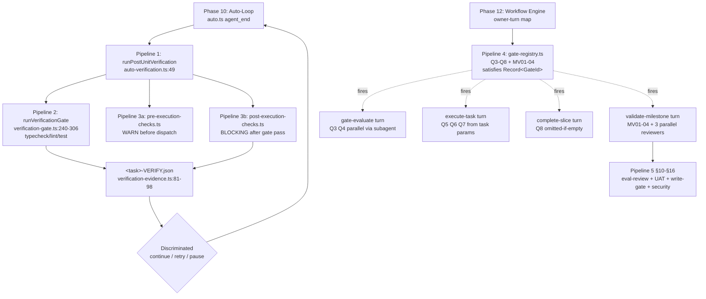
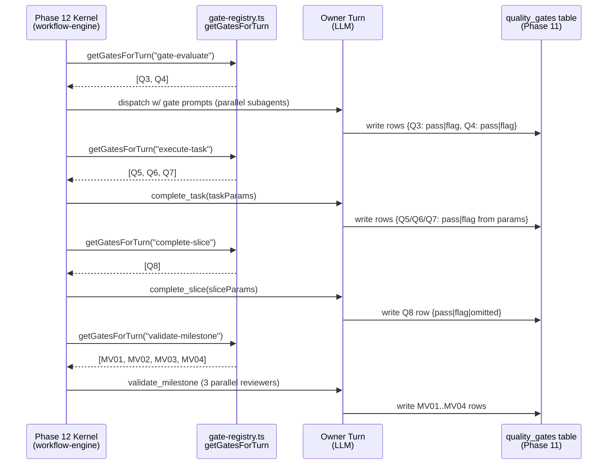
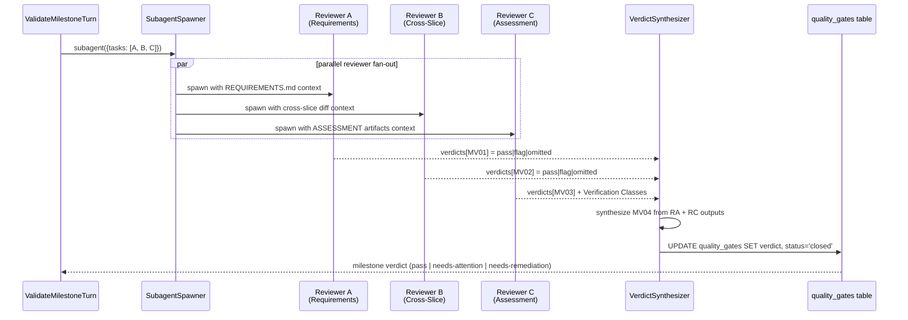
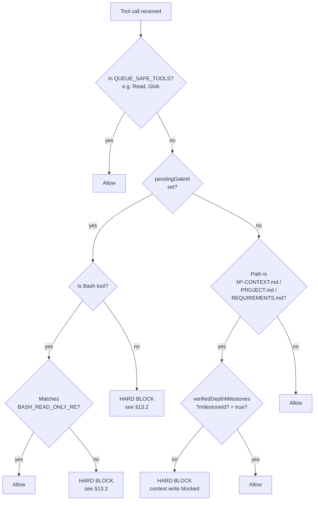

# Quality Enforcement — GSD-2 Verification, Validation, Code-Review, UAT & Security Pipelines

> Phase 14 — WORK-05 — Milestone M3 (Workflow Engine).
> Sibling spine docs: [auto-mode.md](./auto-mode.md) (Phase 10 orchestrator that fires the post-unit verification hook), [state-persistence.md](./state-persistence.md) (Phase 11 — `quality_gates` table + verification evidence persistence), [workflow-engine.md](./workflow-engine.md) (Phase 12 decision kernel — owner-turn enforcement), [file-tracking.md](./file-tracking.md) (Phase 13 — atomic-write substrate used by `write-gate-state.json`).
> Forward-refs: Phase 15 (autonomous loop control — consumes the discriminated `continue|retry|pause` outcome from §4), Phase 16 (prompt-template system — consumes the gate prompts assembled in §9).

**Layer:** Workflow Engine (M3) — quality enforcement subsystem.
**Audience:** Python reimplementer at `~/projects/state/` mapping GSD-2's quality enforcement infrastructure — verification pipeline, gate registry, eval-review, milestone validation, UAT, write-gate, and security pipeline — to a Python equivalent. Read in conjunction with `kb/workflow/state-persistence.md` (the DB this layer's gate rows live in) and `kb/workflow/workflow-engine.md` (the kernel that decides which owner-turn fires which gate).

**Source files (quality enforcement infrastructure, ~7,800 LOC across the in-scope files documented here + Plan 02):**

The verification spine (in `gsd-2/src/resources/extensions/gsd/`):
`auto-verification.ts` (680 — `runPostUnitVerification` orchestrator entry, evidence merge with post-execution-checks, discriminated outcome `"continue" | "retry" | "pause"`) ·
`verification-gate.ts` (635 — `discoverCommands` three-tier fallback, `runVerificationGate` execution model, `captureRuntimeErrors` bg-shell + browser-console scan, `runDependencyAudit` lockfile-gated `npm audit`, `formatFailureContext` 2KB/check 10KB/total bounded truncation) ·
`verification-evidence.ts` (270 — `EvidenceJSON` schema v1, `formatEvidenceTable` markdown rendering for in-context display) ·
`pre-execution-checks.ts` (~60+726 — four CHECK-AND-WARN policies: package existence, file path consistency, task ordering, interface contracts) ·
`post-execution-checks.ts` (~60+553 — three policies: import resolution BLOCKING, cross-task signatures BLOCKING, pattern consistency WARN).

The gate registry layer:
`gate-registry.ts` (251 — `GATE_REGISTRY` with Q3-Q8/MV01-04 definitions, `satisfies Record<GateId, GateDefinition>` compile-time exhaustiveness, `assertGateCoverage` runtime check, `OwnerTurn` type) ·
`milestone-validation-gates.ts` (53 — `insertMilestoneValidationGates(milestoneId)` inserts MV01-04 rows from registry at milestone start) ·
`db-gate-rows.ts` (19 — gate row DB persistence into `quality_gates` table) ·
`tools/complete-task.ts:73-77,339-355` (execute-task closes Q5/Q6/Q7) ·
`tools/complete-slice.ts:65,387-424` (complete-slice closes Q8 with omitted-if-empty pattern) ·
`auto-prompts.ts:2290-3207` (gate prompt assembly per turn).

The eval-review + milestone-validation + UAT + write-gate + security pipelines (Plan 02 territory; named here for inventory):
`commands-eval-review.ts` (716 — `/gsd eval-review <sliceId>` slice-level audit) · `eval-review-schema.ts` (243 — TypeBox schema, server-side `computeOverallScore` + `deriveCounts` recomputation) · `tools/validate-milestone.ts` (208 — `gsd_validate_milestone` handler) · `prompts/validate-milestone.md` (87 — three parallel reviewers dispatch) · `prompts/run-uat.md` (89 — five-mode UAT execution) · `bootstrap/write-gate.ts` (1018 — HARD BLOCK protocol + `.gsd/runtime/write-gate-state.json` atomic snapshot) · `security-overrides.ts` (42 — global-only `applySecurityOverrides` env > settings > defaults precedence) · `agents/security.md` · `skills/security-review/SKILL.md` (STRIDE pass + OWASP cross-check + Critical/High/Medium/Low/Informational severity) · `workflow-templates/security-audit.md` (four-phase scan → triage → remediate → re-scan) · `custom-verification.ts` (183 — four verify policies: content-heuristic, shell-command, prompt-verify, human-review).

**Walkthroughs:** None at the time of writing. The 680-line `auto-verification.ts` and the 635-line `verification-gate.ts` are the canonical read-targets; this document and Plan 02's §10-§20 substitute for slice walkthroughs. The 1018-line `bootstrap/write-gate.ts` may warrant a Plan-02 walkthrough.

**Sibling docs / back-refs:**
- [`./auto-mode.md`](./auto-mode.md) (Phase 10) — the orchestrator that fires `runPostUnitVerification` at `agent_end` after every execute-task unit.
- [`./state-persistence.md`](./state-persistence.md) (Phase 11) — the SQLite layer where `quality_gates` rows live; `verification-evidence.ts` writes `<task>-VERIFY.json` next to the DB.
- [`./workflow-engine.md`](./workflow-engine.md) (Phase 12) — the decision kernel whose owner-turn map determines which Q3-Q8/MV01-04 gates fire on which turn.
- [`./file-tracking.md`](./file-tracking.md) (Phase 13) — the atomic-write substrate (`atomic-write.ts:atomicWriteSync`) the write-gate uses for `.gsd/runtime/write-gate-state.json` snapshot persistence.

**ADR sources:** Issue references cited inline (#5046 ad-hoc `GATE_QUESTIONS` → exhaustive `gate-registry.ts` migration documented at `gate-registry.ts:1-9`; #4950 in-memory write-gate → atomic snapshot at `bootstrap/write-gate.ts:160-178`).

---

## §0 Honest Corrections (read first)

> The framing in CONTEXT.md / ROADMAP.md uses three vocabulary tokens that do **not** appear in `gsd-2/`: "ASVS level 1", "MUST FIX / SHOULD FIX / WORTH KNOWING" tier labels, and "gsd-code-review" agent. This section pre-empts confusion by mapping each framing token to its actual source counterpart (or absence thereof). It also surfaces three structural distinctions the source enforces but the framing language flattens: `pre-execution-checks` vs `verification-gate` vs `post-execution-checks`, write-gate as workflow-not-security, and the four distinct subsystems sharing the verb "verify".

> The Phase 10/11/12/13 spine docs set the precedent — corrections-first, source-of-truth-first. The reader should treat §0 as a glossary disambiguation: any sentence later in this document that contradicts §0 should be read as a regression. The validator script (`scripts/validate-phase-14.sh` Block C) detects the framing tokens explicitly to keep §0 in lockstep with the truth on disk.

> **Correction (1) — ASVS level 1 is the meta-project's self-imposed compliance posture, NOT a gsd-2 source artifact.**
> **Where the framing language comes from:** `.planning/config.json:40` (`security_asvs_level: 1`) and `.planning/phases/01-agent-lifecycle/01-SECURITY.md` reference ASVS — but these are the **meta-project's** (gsd2deconstruction) self-imposed compliance level, NOT gsd-2's. The user's project tooling defines the ASVS posture; the gsd-2 source code does not. A `grep -nE "ASVS|asvs" gsd-2 -r` returns zero hits.
> **Where the closest gsd-2 constructs live:**
> 1. **Gate Q3 abuse-surface check** — `gsd-2/src/resources/extensions/gsd/gate-registry.ts:46-58` — "How can this be exploited?" gate question, owner `gate-evaluate`. Documented in §8 below.
> 2. **STRIDE pass** in `gsd-2/src/resources/skills/security-review/SKILL.md` Step 4 — Spoofing / Tampering / Repudiation / Information disclosure / Denial-of-service / Elevation-of-privilege walk. Documented in Plan 02 §15.
> 3. **OWASP cross-check** — same `security-review` skill cross-checks STRIDE against OWASP Top 10 categories.
> 4. **Four-phase security-audit workflow template** at `gsd-2/src/resources/extensions/gsd/workflow-templates/security-audit.md` — scan → triage → remediate → re-scan. Documented in Plan 02 §15.
> **What this means for the spine doc:** Any sentence beginning "GSD-2 enforces ASVS L1 by…" is wrong by construction. Use the actual source constructs (gate Q3, security-review skill STRIDE step, security-audit workflow template). The meta-project's own ASVS posture is real — but it lives in this repository's `.planning/`, not in `gsd-2/src/`.
> **Source:** `.planning/config.json:40`, `.planning/phases/01-agent-lifecycle/01-SECURITY.md` (meta-project framing); zero ASVS references in `gsd-2/`.

> **Correction (2) — "MUST FIX / SHOULD FIX / WORTH KNOWING" tier labels do not exist in source.**
> **Where the framing language comes from:** ROADMAP.md Phase 14 success criterion #3 ("how findings are tiered (MUST FIX / SHOULD FIX / WORTH KNOWING)"). These label tokens exist in some external code-review tooling but NOT in gsd-2. A `grep -rn "MUST FIX\|SHOULD FIX\|WORTH KNOWING" gsd-2/` returns zero hits.
> **Three actual source vocabularies (use these instead):**
> 1. **`blocker | major | minor`** — eval-review severity tiers. **Source:** `gsd-2/src/resources/extensions/gsd/eval-review-schema.ts:39`. Used by the slice-level eval-review pipeline (Plan 02 §11). The `EvalReviewSeverityT` discriminated union drives the `counts` recomputation at `eval-review-schema.ts:224`.
> 2. **`pass | flag | omitted`** — gate verdict states. **Source:** `gsd-2/src/resources/extensions/gsd/types.ts:699` (`GateVerdict` discriminated union). Used by every Q3-Q8/MV01-04 gate (this plan §8 documents the registry, §9 documents the per-turn closure pattern). The third state `omitted` is what makes this vocabulary distinct: a gate can resolve to "we checked and it didn't apply" rather than collapsing to `pass | flag`.
> 3. **`Critical | High | Medium | Low | Informational`** — security-review severity matrix. **Source:** `gsd-2/src/resources/skills/security-review/SKILL.md`. Used by the security-review skill's STRIDE-OWASP-severity triage pass (Plan 02 §15) and by `agents/security.md` for OWASP-categorized severities.
> **What this means for the spine doc:** Plan 02 §10 / §11 / §15 must use the actual vocabularies when documenting eval-review and validate-milestone outputs. A grep for `MUST FIX` / `SHOULD FIX` / `WORTH KNOWING` outside §0 indicates a regression — the validator's Block C is the negation guard.

> **Correction (3) — `gsd-code-review` agent does not exist in source.**
> **Where the framing language comes from:** ROADMAP.md Phase 14 success criterion #3 ("how `gsd-code-review` spawns"). A `grep -rn "gsd-code-review" gsd-2/` returns zero hits — there is no agent file, no SKILL.md, no command, no prompt template by that name.
> **Closest source concepts (the framing label maps to BOTH):**
> 1. **`commands-eval-review.ts`** (`gsd-2/src/resources/extensions/gsd/commands-eval-review.ts:1-716`) — `/gsd eval-review <sliceId>` command runs a slice-level evaluation audit. Verdict bands: NOT_IMPLEMENTED → SIGNIFICANT_GAPS → NEEDS_WORK → PRODUCTION_READY. Plan 02 §11 documents the pipeline end-to-end including the TypeBox schema (`eval-review-schema.ts`), server-side recomputation, and write-path. **This is the equivalent of "code review" at slice scope.**
> 2. **`prompts/validate-milestone.md`** (`gsd-2/src/resources/extensions/gsd/prompts/validate-milestone.md:1-87`) — milestone-level validation, dispatches **three parallel reviewers** via subagent (Reviewer A: Requirements Coverage, Reviewer B: Cross-Slice Integration, Reviewer C: Assessment & Acceptance Criteria). Plan 02 §10 documents this dispatch and the verdict synthesis. **This is the equivalent of "code review" at milestone scope.**
> **What this means for the spine doc:** Plan 02 explicitly maps the framing label "gsd-code-review" to BOTH source constructs (eval-review for slice-level, validate-milestone for milestone-level). Both are "code review" in spirit; neither is a single agent named `gsd-code-review`. A reader looking up "where does gsd-code-review live in the source?" will find nothing — they should be looking at §10 / §11 instead.

> **Correction (4) — pre-execution-checks vs verification-gate vs post-execution-checks are three distinct pipelines.**
> Both `pre-execution-checks.ts` and `post-execution-checks.ts` merge their evidence into the same `<task>-VERIFY.json` file (`auto-verification.ts:501-521`), so they LOOK like one system. They are not. The verification-gate (`verification-gate.ts:240-306`) runs typecheck/lint/test commands. The pre-execution-checks (`pre-execution-checks.ts`) run **before** dispatch (package existence + file paths + ordering + contracts — CHECK-AND-WARN, non-blocking). The post-execution-checks (`post-execution-checks.ts:8-16`) run **after** verification-gate passes (import resolution + signature drift BLOCKING; pattern consistency WARN). §3, §5, §6 document them as separate sections.

> **Correction (5) — write-gate is a workflow approval gate, not a security boundary.**
> Despite the function name `shouldBlockContextWrite` looking like access control, `bootstrap/write-gate.ts:1-1018` blocks writes based on `verifiedDepthMilestones` — a workflow-discussion concept. There is no threat model behind the block, only "did the user confirm the discussion depth?" The actual security boundaries are `security-overrides.ts` (allowed-command prefixes + fetch-URL allowlist) and the bash interceptor (Phase 4 territory). Plan 02 §13 explicitly frames write-gate as **workflow-approval, mechanical-not-semantic, fail-closed-on-missing-state**.

> **Correction (6) — Four distinct subsystems share the verb "verify" — keep them separate.**
> 1. **`auto-verification.ts:runPostUnitVerification`** — runs at `agent_end` after every execute-task unit (this plan §4). Returns `"continue" | "retry" | "pause"`.
> 2. **`runVerificationGate`** in `verification-gate.ts` — the actual command runner invoked by `runPostUnitVerification` (this plan §3).
> 3. **`runCustomVerification`** in `custom-verification.ts` — for custom-workflow steps with a different DSL entirely (Plan 02 §16). Four policies: `content-heuristic | shell-command | prompt-verify | human-review`.
> 4. **`gsd_validate_milestone`** in `tools/validate-milestone.ts` — milestone-level validation gate, unrelated to the others (Plan 02 §10).
> §1 overview Mermaid component diagram shows these as **sibling pipelines, NOT nested**. A paragraph that cites `auto-verification.ts` AND `custom-verification.ts` in the same sentence is a regression.

---

## §1 Overview — five-pipeline taxonomy

GSD-2's quality enforcement is not a single pipeline — it is **five distinct subsystems** coordinated by the auto-loop's post-unit hook (Phase 10 territory) and the gate-registry's owner-turn map (Phase 12 territory). This section catalogues the five pipelines, their entry points, and how the discriminated `continue | retry | pause` outcome flows back to the orchestrator.

**Pipeline 1 — Post-unit verification (`auto-verification.ts`).**
Entry: `runPostUnitVerification(ctx, unit)` fired at `agent_end` after every execute-task unit (`gsd-2/src/resources/extensions/gsd/auto-verification.ts:49`). Orchestrates verification-gate → post-execution-checks → evidence merge → discriminated outcome. Documented end-to-end in §4. The discriminated outcome `"continue" | "retry" | "pause"` is what the auto-loop's next-step decision (Phase 10 §5) consumes.

**Pipeline 2 — Verification gate (`verification-gate.ts`).**
The actual typecheck/lint/test command runner. Three-tier discovery (preferences → task-plan → package.json scripts) at `gsd-2/src/resources/extensions/gsd/verification-gate.ts:49-96`. Returns failure-context bundle (bounded 2KB/check, 10KB total) for re-injection on retry. Two satellite subsystems: `captureRuntimeErrors` reads bg-shell + browser-console state (verification-gate.ts:341-472), `runDependencyAudit` runs `npm audit` only when dependency files changed (verification-gate.ts:555-635). Documented end-to-end in §3.

**Pipeline 3 — Pre/post-execution checks (`pre-execution-checks.ts` + `post-execution-checks.ts`).**
Pre-checks raise warnings **before** dispatch (package existence, file paths, ordering, contracts — CHECK-AND-WARN, non-blocking). Post-checks block on import resolution and cross-task signature drift (BLOCKING) and warn on pattern consistency (WARN). Both merge into `<task>-VERIFY.json` (`auto-verification.ts:501-521`) but the pipelines are distinct (see §0 Correction 4). Documented in §5 (pre) and §6 (post).

**Pipeline 4 — Quality gate registry (`gate-registry.ts`).**
Q3-Q8 + MV01-04 gates indexed by `OwnerTurn` (`gate-evaluate` / `execute-task` / `complete-slice` / `validate-milestone`). Compile-time exhaustiveness via `satisfies Record<GateId, GateDefinition>` constraint (`gate-registry.ts:168`); runtime exhaustiveness via `assertGateCoverage` (`gate-registry.ts:211-251`). Gate rows persist in the `quality_gates` SQLite table (Phase 11 schema). Documented in §8 (registry) and §9 (per-turn flow).

**Pipeline 5 — Eval-review + milestone-validation + UAT + write-gate + security (Plan 02 territory).**
§10-§16 cover these — slice-level eval-review (`commands-eval-review.ts`), milestone-level three-parallel-reviewers (`prompts/validate-milestone.md`), five-mode UAT (`prompts/run-uat.md`), write-gate HARD BLOCK protocol (`bootstrap/write-gate.ts`), security pipeline (`security-overrides.ts` + `agents/security.md` + `skills/security-review/SKILL.md` + `workflow-templates/security-audit.md`), and custom-verification policy dispatcher (`custom-verification.ts`).



Cross-reference to the rest of M3: Phase 10 covered the auto-loop that fires `runPostUnitVerification` at `agent_end`. Phase 11 covered the `quality_gates` SQLite table this layer's gate rows live in. Phase 12 covered the owner-turn decision kernel that decides which gates fire on which turn. Phase 13 covered the atomic-write substrate (`atomic-write.ts:atomicWriteSync`) the write-gate uses for `.gsd/runtime/write-gate-state.json` snapshot persistence. Phase 14 (this doc) covers the verification + gate-registry + eval-review + UAT + write-gate + security infrastructure that turns the question "is the work done correctly and safely?" into structured outcomes.

---

## §2 Source File Inventory

All paths relative to `gsd-2/src/resources/extensions/gsd/` unless noted otherwise. Scope: post-unit verification + pre/post-execution checks + verification evidence + gate registry + eval-review + milestone validation + UAT + write-gate + security pipeline + custom-verification + safety harness companion.

### Tier 1 — Verification spine (Plan 01 territory)
| File | LOC | Role |
|------|-----|------|
| `gsd-2/src/resources/extensions/gsd/auto-verification.ts` | 680 | Orchestrator entry `runPostUnitVerification` (line 49); evidence merge at lines 501-521; post-exec blocking failure update at lines 528-531 |
| `gsd-2/src/resources/extensions/gsd/verification-gate.ts` | 635 | Command discovery (`discoverCommands` 49-96), execution (`runVerificationGate` 240-306), runtime error capture (`captureRuntimeErrors` 341-472), dependency audit (`runDependencyAudit` 555-635), failure context formatting (`formatFailureContext` 115-142) |

### Tier 2 — Evidence persistence (Plan 01 territory)
| File | LOC | Role |
|------|-----|------|
| `gsd-2/src/resources/extensions/gsd/verification-evidence.ts` | 270 | `EvidenceJSON` schema v1 (lines 81-98), `formatEvidenceTable` markdown rendering (lines 214-269) |

### Tier 3 — Pre/post-execution checks (Plan 01 territory)
| File | LOC | Role |
|------|-----|------|
| `gsd-2/src/resources/extensions/gsd/pre-execution-checks.ts` | ~60+726 | Four CHECK-AND-WARN policies: package existence, file path consistency, task ordering, interface contracts |
| `gsd-2/src/resources/extensions/gsd/post-execution-checks.ts` | ~60+553 | Three policies (lines 8-16): import resolution BLOCKING, cross-task signatures BLOCKING, pattern consistency WARN |

### Tier 4 — Gate registry + tooling (Plan 01 territory)
| File | LOC | Role |
|------|-----|------|
| `gsd-2/src/resources/extensions/gsd/gate-registry.ts` | 251 | `GATE_REGISTRY` (lines 45-168) with Q3-Q8/MV01-04, `OwnerTurn` type (26-30), `satisfies Record<GateId, GateDefinition>` (line 168), `assertGateCoverage` (211-251) |
| `gsd-2/src/resources/extensions/gsd/types.ts` | 696-721 | `GateId`, `GateScope`, `GateStatus`, `GateVerdict` (line 699 — `pass \| flag \| omitted`), `GateRow` |
| `gsd-2/src/resources/extensions/gsd/milestone-validation-gates.ts` | 53 | `insertMilestoneValidationGates(milestoneId)` (lines 28-53) — inserts MV01-04 rows from registry at milestone start |
| `gsd-2/src/resources/extensions/gsd/db-gate-rows.ts` | 19 | Gate row DB persistence into `quality_gates` table |
| `gsd-2/src/resources/extensions/gsd/tools/complete-task.ts` | 73-77, 339-355 | execute-task closes Q5/Q6/Q7 from task params |
| `gsd-2/src/resources/extensions/gsd/tools/complete-slice.ts` | 65, 387-424 | complete-slice closes Q8 (omitted-if-empty pattern) |
| `gsd-2/src/resources/extensions/gsd/auto-prompts.ts` | 2290-3207 | Gate prompt assembly per turn (gate-evaluate parallel-dispatch, execute-task task gates, complete-slice slice gates) |

### Tier 5 — Eval-review (Plan 02 territory)
| File | LOC | Role |
|------|-----|------|
| `gsd-2/src/resources/extensions/gsd/commands-eval-review.ts` | 716 | `/gsd eval-review <sliceId>` slice-level evaluation audit, prompt assembly, write-path, --force/--show flags, MAX_CONTEXT_BYTES=200KB cap |
| `gsd-2/src/resources/extensions/gsd/eval-review-schema.ts` | 243 | TypeBox schema (`EvalReviewFrontmatter`), `parseEvalReviewFrontmatter`, server-side `computeOverallScore` + `deriveCounts` recomputation (`blocker | major | minor` vocabulary at line 39) |

### Tier 6 — Validate-milestone (Plan 02 territory)
| File | LOC | Role |
|------|-----|------|
| `gsd-2/src/resources/extensions/gsd/tools/validate-milestone.ts` | 208 | `gsd_validate_milestone` handler |
| `gsd-2/src/resources/extensions/gsd/prompts/validate-milestone.md` | 87 | Three parallel reviewers (Requirements Coverage / Cross-Slice Integration / Assessment & Acceptance Criteria), verdict synthesis |
| `gsd-2/src/resources/extensions/gsd/prompts/gate-evaluate.md` | 32 | Q3/Q4 parallel dispatch via subagent |

### Tier 7 — UAT (Plan 02 territory)
| File | LOC | Role |
|------|-----|------|
| `gsd-2/src/resources/extensions/gsd/prompts/run-uat.md` | 89 | Five-mode UAT execution: `artifact-driven`, `browser-executable`, `runtime-executable`, `live-runtime`, `mixed`, `human-experience`; ASSESSMENT artifact format |

### Tier 8 — Write-gate + security boundaries (Plan 02 territory)
| File | LOC | Role |
|------|-----|------|
| `gsd-2/src/resources/extensions/gsd/bootstrap/write-gate.ts` | 1018 | Depth-verification gate (`shouldBlockContextWrite` 446-480), root artifact gate (541+), pending-gate gate (352-382), bash gate (388-415), atomic snapshot persistence (160-178), `loadWriteGateSnapshot` (213-227), QUEUE_SAFE_TOOLS (30-39), BASH_READ_ONLY_RE (66), GATE_QUESTION_PATTERNS (109-111) |
| `gsd-2/src/resources/extensions/gsd/bootstrap/register-hooks.ts` | 437-545 | Write-gate hook integration into `onTool`/`onBash` |
| `gsd-2/src/security-overrides.ts` | 42 | `applySecurityOverrides` (14-42) with global-only command-prefix and fetch-URL allowlists, env > settings.json > built-in defaults precedence |

### Tier 9 — Security skills/agents/templates (Plan 02 territory)
| File | LOC | Role |
|------|-----|------|
| `gsd-2/src/resources/agents/security.md` | ~50 | Security agent (OWASP-categorized severities `Critical / High / Medium / Low`, output format) |
| `gsd-2/src/resources/agents/reviewer.md` | ~41 | Reviewer agent (`Critical / High / Medium / Low` + `APPROVE / REQUEST_CHANGES / NEEDS_DISCUSSION` verdict) |
| `gsd-2/src/resources/agents/tester.md` | — | Tester agent (test priority order: regression > edge case > integration > unit > smoke) |
| `gsd-2/src/resources/skills/security-review/SKILL.md` | — | STRIDE pass + OWASP cross-check + severity × exploitability triage (`Critical / High / Medium / Low / Informational`) |
| `gsd-2/src/resources/skills/review/SKILL.md` | — | A/B/C/D categories (Security/Performance/Bug/Quality) with severity per category |
| `gsd-2/src/resources/skills/verify-before-complete/SKILL.md` | — | "Evidence before claims" gating ritual |
| `gsd-2/src/resources/extensions/gsd/workflow-templates/security-audit.md` | ~80 | Four-phase template: scan → triage → remediate → re-scan |

### Tier 10 — Custom-verification + safety harness companion (Plan 02 territory)
| File | LOC | Role |
|------|-----|------|
| `gsd-2/src/resources/extensions/gsd/custom-verification.ts` | 183 | Four verify policies (`content-heuristic`, `shell-command`, `prompt-verify`, `human-review`) — see policy dispatcher at `custom-verification.ts:60-84` |
| `gsd-2/src/resources/extensions/gsd/safety/safety-harness.ts` | 115 | Config + re-exports for the safety companion modules |
| `gsd-2/src/resources/extensions/gsd/safety/evidence-collector.ts` | — | Companion module |
| `gsd-2/src/resources/extensions/gsd/safety/destructive-guard.ts` | — | Companion module |
| `gsd-2/src/resources/extensions/gsd/safety/file-change-validator.ts` | — | Companion module |
| `gsd-2/src/resources/extensions/gsd/safety/evidence-cross-ref.ts` | — | Companion module |
| `gsd-2/src/resources/extensions/gsd/safety/git-checkpoint.ts` | — | Cross-ref to Phase 13 §4.4 (pre-unit checkpoint refs) |
| `gsd-2/src/resources/extensions/gsd/safety/content-validator.ts` | — | Companion module |

**Total in-scope:** ~7,800 LOC (Plan 01 territory: ~2,200 LOC; Plan 02 territory: ~5,600 LOC).

---

## §3 The verification-gate pipeline

The verification-gate is the **actual command runner** — it discovers what to run, executes it, captures failures, and produces a structured failure-context bundle for re-injection on retry. Entry point: `runVerificationGate(opts)` at `gsd-2/src/resources/extensions/gsd/verification-gate.ts:240-306`. Three sub-systems orbit it: command discovery (`gsd-2/src/resources/extensions/gsd/verification-gate.ts:49-96`), runtime error capture (`gsd-2/src/resources/extensions/gsd/verification-gate.ts:341-472`), and dependency audit (`gsd-2/src/resources/extensions/gsd/verification-gate.ts:555-635`).

### §3.1 Three-tier command discovery

Cite `gsd-2/src/resources/extensions/gsd/verification-gate.ts:49-96`. The `discoverCommands(options)` function applies fallback in this order, **first non-empty wins**:

1. **Preferences** — `prefs.verification_commands` array (set via `/gsd verification-commands` slash command). Returns `discoverySource: "preferences"`.
2. **Task plan `verify` field** — split on `&&`, sanitize each command (strip control chars, trim). Returns `discoverySource: "task_plan"`.
3. **package.json scripts** — pick `typecheck`, `lint`, `test` (if present). Returns `discoverySource: "package_json"`.
4. **None found** — returns `discoverySource: "none"` and the gate becomes a no-op.

The discovery is mechanical — the LLM's input (in either `prefs.verification_commands` or the task-plan `verify` field) is treated as data, not control flow. **We never trust LLM arithmetic** is the operating principle: the LLM proposes commands, the gate executes them in a sandboxed `execFileSync` (no shell), the LLM doesn't get to interpret its own success.

### §3.2 runVerificationGate execution model

Cite `gsd-2/src/resources/extensions/gsd/verification-gate.ts:240-306`. For each discovered command:

- Spawn via `execFileSync` (no shell — argv[0] is the binary, the rest are literal args), with `cwd = repoRoot`, env stripped via `GIT_NO_PROMPT_ENV` (cross-ref to `kb/workflow/file-tracking.md` §4.2 for the seven leak-prone parent vars stripped).
- Capture stdout + stderr (combined into one stream for prompt re-injection — separated in evidence JSON for triage).
- On non-zero exit: mark check as failed, accumulate failure-context bundle.
- Failure-context bundling via `formatFailureContext(failures)` at `gsd-2/src/resources/extensions/gsd/verification-gate.ts:115-142` — caps each check at **2KB** and total at **10KB**. Truncation marker: `[... truncated <N> bytes ...]`. **Why bounded:** unbounded re-injection blows the model's input budget for the retry turn; long stack traces and noisy test output would force premature compaction.

Discriminated outcome from this layer: a `VerificationGateResult` with `{passed: boolean, evidence: ..., failureContext: string | undefined}`. The orchestrator at `gsd-2/src/resources/extensions/gsd/auto-verification.ts:49` translates this plus post-execution-check results into the higher-level `"continue" | "retry" | "pause"` outcome (see §4.3).

### §3.3 Runtime error correlation (`captureRuntimeErrors`)

Cite `gsd-2/src/resources/extensions/gsd/verification-gate.ts:341-472`. Reads runtime evidence from sibling subsystems — **NOT process-tree traversal**:

- **bg-shell process manager** at `gsd-2/src/resources/extensions/gsd/bg-shell/process-manager.js` — recent stdout/stderr lines from background long-running commands (dev servers, watchers).
- **Browser tools state** at `gsd-2/src/resources/extensions/gsd/browser-tools/state.js` — most recent browser console errors + network failures.
- Correlates by **timestamp window** relative to the verification-gate run.

**Don't hand-roll process-tree traversal.** The bg-shell + browser-tools subsystems have already published their state to disk; verification-gate just reads the latest snapshot. This is the same separation-of-concerns pattern as the projection layer in `kb/workflow/file-tracking.md` (DB → markdown is a read, not a traversal of in-memory state).

### §3.4 Dependency audit (`runDependencyAudit`)

Cite `gsd-2/src/resources/extensions/gsd/verification-gate.ts:555-635`. Runs `npm audit --json` **only when** `package.json` or any lockfile (`package-lock.json` / `yarn.lock` / `pnpm-lock.yaml`) changed in the unit's diff. Otherwise skipped — audit results don't change without dependency changes, so running it every unit would be wasteful. The change detection consults the diff layer (`gitDiffNameStatus` from Phase 13's diff primitives).

Output classified into `Critical | High | Medium | Low` severity (cross-ref `gsd-2/src/resources/skills/security-review/SKILL.md` for the same vocabulary in the security-review skill — §0 Correction 2 Vocabulary 3). Audit findings flow into the evidence JSON (§7.1) under `verificationGate.dependencyAudit`. They do **not** by themselves block the unit — the security-review skill or human review is the closing decision.

---

## §4 Post-unit verification orchestration

`auto-verification.ts` is the **orchestrator** that wires verification-gate + post-execution-checks + verification-evidence into the auto-loop's `agent_end` hook. The discriminated outcome `"continue" | "retry" | "pause"` drives the auto-loop's next-step decision (Phase 10 §5).

### §4.1 `runPostUnitVerification` — the entry point

Cite `gsd-2/src/resources/extensions/gsd/auto-verification.ts:49`. Signature: `runPostUnitVerification(ctx, unit) → Promise<VerificationResult>`.

Steps in execution order:

1. **`LIFECYCLE_ONLY_UNITS` check** — if `unit.type ∈ LIFECYCLE_ONLY_UNITS` (e.g. `gate-evaluate`, info-only units), return `{passed: true, outcome: "continue"}` immediately. No verification fires. **Why:** these units don't produce code artifacts; running typecheck/lint/test against them is a no-op that wastes wall-clock.
2. **Run verification-gate** — `await runVerificationGate({...})`. Result has `{passed, evidence, failureContext}` (§3.2).
3. **If verification-gate failed** — write evidence, classify failure, decide outcome:
   - **Recoverable** (typecheck error, lint error, test fail) → `outcome: "retry"`. Re-inject `failureContext` into next turn's prompt.
   - **Infra error** (`ENOSPC`, `EROFS`, `ENOMEM`, `EAGAIN` per `gsd-2/src/resources/extensions/gsd/auto/infra-errors.ts`) → re-throw. The auto-loop's recovery layer handles infra errors separately.
   - **Persistent** (third-or-more consecutive retry on same failure-class) → `outcome: "pause"`. Human intervention needed; the loop will not silently spin.
4. **If verification-gate passed** — run `runPostExecutionChecks(ctx, unit)`. (§6 details.)
5. **Merge evidence** — `gsd-2/src/resources/extensions/gsd/auto-verification.ts:501-521` co-merges verification-gate output and post-execution-check output into the same `<task>-VERIFY.json` file under separate top-level keys (`verificationGate: {...}` and `postExecution: {...}`).
6. **Update `result.passed` based on post-exec blocking failures** — `gsd-2/src/resources/extensions/gsd/auto-verification.ts:528-531`. Even if verification-gate passed, a BLOCKING post-execution-check failure (import resolution, signature drift) flips the outcome to `"retry"`.
7. Return `VerificationResult`.

```typescript
// Source: gsd-2/src/resources/extensions/gsd/auto-verification.ts:528
// Update result.passed based on post-execution checks
if (postExecBlockingFailure) {
  result.passed = false;
}
```

### §4.2 The four-subsystem "verify" verb (Pitfall 6 prevention)

Restating §0 Correction 6: four distinct subsystems share the verb "verify". The spine doc must keep their citations in **distinct sections**:

- **`runPostUnitVerification`** (this section, §4) — the orchestrator at `gsd-2/src/resources/extensions/gsd/auto-verification.ts:49`. Returns `"continue" | "retry" | "pause"`.
- **`runVerificationGate`** (§3) — the actual command runner at `gsd-2/src/resources/extensions/gsd/verification-gate.ts:240-306`.
- **`runCustomVerification`** (Plan 02 §16) — for custom-workflow steps with a different DSL entirely. Four policies: `content-heuristic | shell-command | prompt-verify | human-review`.
- **`gsd_validate_milestone`** (Plan 02 §10) — milestone-level validation gate, dispatches three parallel reviewers via subagent.

A paragraph that cites `auto-verification.ts` and `custom-verification.ts` in the same sentence is a regression. The validator's Block H + I + J split keeps the citations apart; reviewers should treat any merge of these citations as a flag.

### §4.3 Discriminated outcome flow

The discriminated outcome is the **load-bearing contract** between the verification layer and the auto-loop. Its three values map to three downstream behaviors:

| Outcome | Auto-loop behavior | Triggered by |
|---------|-------------------|--------------|
| `"continue"` | Proceed to next unit | `passed: true` AND no post-exec blocking failure |
| `"retry"` | Re-dispatch same unit with `failureContext` re-injected | Verification-gate failure OR post-exec BLOCKING failure (import resolution / signature drift) |
| `"pause"` | Halt loop, surface to human | Persistent retry (3+ consecutive same-failure-class) OR `runCustomVerification` returns `pause` (Plan 02 §16) |

The retry-counter is per-unit, per-failure-class. Switching from "typecheck failed" to "test failed" resets the counter; staying on "typecheck failed" three turns in a row escalates to `pause`. This prevents silent infinite loops while tolerating productive iteration.

The full mapping from `(verification-gate.passed, post-exec-blocking, retry-count)` → outcome lives in `gsd-2/src/resources/extensions/gsd/auto-verification.ts:528-531` plus the surrounding outcome-classification helpers. Phase 15 (autonomous loop control) consumes this contract.

---

## §5 Pre-execution checks

Pre-execution checks fire **BEFORE** the unit's first dispatch turn. Their policy is **CHECK-AND-WARN** — they never block dispatch; they raise the LLM's attention to inconsistencies before the work starts. Cite `gsd-2/src/resources/extensions/gsd/pre-execution-checks.ts` for the four checks.

### §5.1 Four checks

1. **Package existence** — for every npm package the task plan mentions (extracted via regex on `package.json` deltas + import statements in claimed-modified files), verify the package exists on the npm registry. **Why:** LLMs hallucinate package names (`@react/router` instead of `react-router`). The check warns BEFORE dispatch so the LLM can correct in the same turn rather than commit a broken `package.json`.
2. **File path consistency** — for every file the task plan claims to create/modify, verify either (a) the file exists (modification case) or (b) the parent directory exists (creation case). **Why:** typos in file paths surface as "create unrelated file at unrelated path" — caught at plan-time, not commit-time.
3. **Task ordering** — verify dependencies in the dispatch order produce the artifacts later tasks consume. If task B imports `src/foo.ts` and task A is its only producer, A must appear before B in the dispatch order. **Why:** auto-mode's parallel-wave dispatcher (Phase 12 territory) requires correct ordering or it deadlocks.
4. **Interface contracts** — verify the types/exports the task says it'll create match what downstream tasks expect. Run `tsc --noEmit` against a synthetic file that imports the claimed exports. **Why:** signature drift between tasks is THE most common multi-task failure mode.

### §5.2 CHECK-AND-WARN policy

Pre-execution-checks **NEVER block**. They emit warnings into the unit's prompt context as a "Pre-Dispatch Concerns" section. The LLM may either (a) acknowledge and address in the dispatch, or (b) ignore — which then re-surfaces as a post-execution-check failure if the concern materializes.

The CHECK-AND-WARN policy is the deliberate inverse of post-execution-checks (which BLOCK on import resolution + signature drift). The reasoning: pre-dispatch the LLM hasn't written code yet, so blocking on a guess is too aggressive; post-dispatch the code is on disk, so blocking on a verifiable broken import is correct. **Pre-execution warns about possibilities; post-execution blocks on facts.**

---

## §6 Post-execution checks

Post-execution checks fire **AFTER** verification-gate passes. Three policies — two BLOCKING, one WARN. Cite `gsd-2/src/resources/extensions/gsd/post-execution-checks.ts:8-16` for the policy declarations.

### §6.1 Three checks (BLOCKING vs WARN)

| # | Check | Policy | What it does |
|---|-------|--------|--------------|
| 1 | **Import resolution** | BLOCKING | Every newly-introduced import must resolve to a real file/package. A unit that introduces `import {x} from './does-not-exist'` fails the unit even if typecheck was a no-op (because `discoverySource: "none"`). |
| 2 | **Cross-task signatures** | BLOCKING | When task A's claimed `exports function f(x: T): U` is consumed by task B's downstream code calling `f(...)`, the signature drift is detected via project-tsserver query. Drift fails the unit and triggers retry with the specific signature mismatch in the failure-context. |
| 3 | **Pattern consistency** | WARN | Heuristic checks (e.g., all files in a directory follow the same naming convention; new files match adjacent files' formatting style). Surfaces as a warning in the next turn's prompt; does not force retry. |

### §6.2 Why import resolution and signatures BLOCK

`gsd-2/src/resources/extensions/gsd/post-execution-checks.ts:8-16` documents the policies inline. The reasoning, restated: **broken imports fail the unit.** A unit that produces broken imports is materially incomplete — verification-gate's typecheck would have caught it IF the typecheck command was discovered, but if `discoverySource: "none"` (no preference, no task-plan `verify`, no `package.json` typecheck script) the gate is a no-op. Post-execution import resolution is the **safety net** for that case.

Cross-task signatures BLOCK for the same reason: even if `tsc --noEmit` passes for task A's file in isolation, the cross-task drift is only visible at the project-tsserver level. The tsserver query at post-execution time catches drift that per-file typecheck cannot.

### §6.3 Why pattern consistency WARNs

Heuristics are noisy. A WARN policy lets the LLM see the concern in the next turn's prompt without forcing a retry. If the LLM disagrees with the pattern (the new file is intentionally different), it can override with intent. A BLOCKING heuristic would generate retry loops on legitimate variance.

### §6.4 Evidence merge

Cite `gsd-2/src/resources/extensions/gsd/auto-verification.ts:501-521` again. Post-execution-check output is co-merged into `<task>-VERIFY.json` under the top-level key `postExecution: {importResolution: ..., crossTaskSignatures: ..., patternConsistency: ...}`. The merge is what makes §7's evidence file the **single source of truth** for "what verification said about this unit." Tools downstream (Plan 02 §11 eval-review, the auto-loop's failure-context re-injection) read from the merged file, never from the per-pipeline runtime state.

---

## §7 Verification evidence persistence

Every unit verification produces a single JSON evidence file at `<runDir>/<task>-VERIFY.json`. The schema is versioned (`schemaVersion: 1`) and round-trippable via TypeBox validation. Cite `gsd-2/src/resources/extensions/gsd/verification-evidence.ts:81-98` for the `EvidenceJSON` shape.

### §7.1 `EvidenceJSON` shape

Cite `gsd-2/src/resources/extensions/gsd/verification-evidence.ts:81-98`:

```typescript
interface EvidenceJSON {
  schemaVersion: 1;
  unitId: string;
  taskId: string;
  timestamp: string;     // ISO 8601
  verificationGate: {
    discoverySource: "preferences" | "task_plan" | "package_json" | "none";
    commands: Array<{name: string; passed: boolean; output: string}>;
    runtimeErrors?: {bgShell?: string[]; browserConsole?: string[]};
    dependencyAudit?: {critical: number; high: number; medium: number; low: number};
  };
  postExecution: {
    importResolution:    {passed: boolean; failures: string[]};
    crossTaskSignatures: {passed: boolean; failures: string[]};
    patternConsistency:  {passed: boolean; warnings: string[]};
  };
  passed: boolean;       // overall outcome
  outcome: "continue" | "retry" | "pause";
}
```

**Server-side recomputation:** `passed` is recomputed from sub-fields (NEVER trust LLM-emitted aggregate). This is the same defensive pattern documented in `gsd-2/src/resources/extensions/gsd/eval-review-schema.ts:210-227` (Plan 02 §11) and the `db-driven-projections` portable pattern (Phase 13 patterns catalogue at `kb/patterns/db-driven-projections.md`).

The `schemaVersion: 1` literal is enforced by TypeBox at parse time — any legacy evidence file with a missing or different `schemaVersion` fails validation with a structured pointer (e.g., `pointer: "/schemaVersion"`). This is how migration is handled: bump the literal to `2`, update the parser, the old files surface as parse errors rather than silent misreads.

### §7.2 `formatEvidenceTable` markdown rendering

Cite `gsd-2/src/resources/extensions/gsd/verification-evidence.ts:214-269`. `formatEvidenceTable(evidence) → string` produces a compact markdown table for in-context display when the evidence is re-injected into the next turn's prompt. The format mirrors the prompt-table style used in `gsd-2/src/resources/extensions/gsd/auto-prompts.ts` (cross-ref Phase 16 prompt-template system).

The renderer flattens the nested `EvidenceJSON` into a tabular view: one row per command with `(name, passed, output excerpt)`, plus the post-execution-check rollup, plus any runtime-error / dependency-audit highlights. Output is truncated at the same 10KB boundary as `formatFailureContext` (§3.2) so the rendered table fits the retry turn's input budget without separate truncation logic.

---

## §8 Quality gate registry

The gate registry is the **single source of truth** for what quality questions GSD-2 asks at each turn. Cite the opening comment of `gsd-2/src/resources/extensions/gsd/gate-registry.ts:1-9`: the registry is the result of an explicit migration **from** an ad-hoc `GATE_QUESTIONS` table previously embedded in `gsd-2/src/resources/extensions/gsd/auto-prompts.ts` **to** the exhaustive registry. The migration replaced silent skip semantics with **compile-time + runtime exhaustiveness**.

The registry is enforced two ways: at compile time via `satisfies Record<GateId, GateDefinition>` (`gsd-2/src/resources/extensions/gsd/gate-registry.ts:168`), and at runtime via `assertGateCoverage` (`gsd-2/src/resources/extensions/gsd/gate-registry.ts:211-251`).

### §8.1 `GATE_REGISTRY` shape

Cite `gsd-2/src/resources/extensions/gsd/gate-registry.ts:45-168`. The registry is a `const` object literal. Each entry has:

```typescript
{
  id: GateId;             // e.g. "Q3", "MV01"
  scope: GateScope;       // "task" | "slice" | "milestone"
  ownerTurn: OwnerTurn;   // "gate-evaluate" | "execute-task" | "complete-slice" | "validate-milestone"
  prompt: string;         // the question asked of the LLM
  // ... additional metadata: description, exhaustivenessNote, etc.
}
```

The `GateId` literal union, `GateScope`, `GateStatus`, and `GateVerdict` discriminated unions are declared in `gsd-2/src/resources/extensions/gsd/types.ts:696-721`. `GateVerdict` at `gsd-2/src/resources/extensions/gsd/types.ts:699` is the `"pass" | "flag" | "omitted"` vocabulary surfaced in §0 Correction 2 Vocabulary 2.

### §8.2 The 10 gate definitions

Reproduced from `gsd-2/src/resources/extensions/gsd/gate-registry.ts:45-168` with line citations:

| Gate | Scope | Owner Turn | Prompt summary | Source line |
|------|-------|------------|----------------|-------------|
| **Q3** | task | gate-evaluate | "How can this be exploited?" (abuse-surface) | `gsd-2/src/resources/extensions/gsd/gate-registry.ts:46-58` |
| **Q4** | task | gate-evaluate | "What are the failure modes?" | `gsd-2/src/resources/extensions/gsd/gate-registry.ts:60-72` |
| **Q5** | task | execute-task | "What completion criteria define done?" | `gsd-2/src/resources/extensions/gsd/gate-registry.ts:74-86` |
| **Q6** | task | execute-task | "What is the behavior contract?" | `gsd-2/src/resources/extensions/gsd/gate-registry.ts:88-100` |
| **Q7** | task | execute-task | "What is the test plan?" | `gsd-2/src/resources/extensions/gsd/gate-registry.ts:102-114` |
| **Q8** | slice | complete-slice | "What is slice acceptance?" (omitted-if-empty) | `gsd-2/src/resources/extensions/gsd/gate-registry.ts:116-128` |
| **MV01** | milestone | validate-milestone | Requirements coverage | `gsd-2/src/resources/extensions/gsd/gate-registry.ts:130-138` |
| **MV02** | milestone | validate-milestone | Cross-slice integration | `gsd-2/src/resources/extensions/gsd/gate-registry.ts:140-148` |
| **MV03** | milestone | validate-milestone | Assessment | `gsd-2/src/resources/extensions/gsd/gate-registry.ts:150-158` |
| **MV04** | milestone | validate-milestone | Acceptance criteria | `gsd-2/src/resources/extensions/gsd/gate-registry.ts:160-168` |

The Q-prefix gates (Q3-Q8) are scoped to a single task or slice. The MV-prefix gates (MV01-04) are scoped to a milestone — they are inserted at milestone start by `insertMilestoneValidationGates` (`gsd-2/src/resources/extensions/gsd/milestone-validation-gates.ts:28-53`) and closed at the validate-milestone turn. (Q1 and Q2 gates exist in the historical ad-hoc table but are no longer in the exhaustive registry — they were collapsed into earlier discussion-phase questions.)

### §8.3 Compile-time exhaustiveness — `satisfies Record<GateId, GateDefinition>`

Cite `gsd-2/src/resources/extensions/gsd/gate-registry.ts:168`. The `satisfies` keyword (TypeScript 4.9+) ensures the literal is **at least** as specific as `Record<GateId, GateDefinition>`. Adding a new `GateId` literal in `gsd-2/src/resources/extensions/gsd/types.ts` without adding a registry entry is a TypeScript compile error. Adding a registry entry with a typo'd id is also a compile error.

```typescript
// Source: gsd-2/src/resources/extensions/gsd/gate-registry.ts:45
export const GATE_REGISTRY = {
  Q3: { id: "Q3", scope: "task", ownerTurn: "gate-evaluate", prompt: "...", ... },
  // ... Q4-Q8, MV01-04 ...
  MV04: { id: "MV04", scope: "milestone", ownerTurn: "validate-milestone", prompt: "...", ... },
} as const satisfies Record<GateId, GateDefinition>;
```

**Worked example of the compile error:**

```typescript
// types.ts:696-721 (HYPOTHETICAL CHANGE)
export type GateId = "Q3" | "Q4" | "Q5" | "Q6" | "Q7" | "Q8" | "MV01" | "MV02" | "MV03" | "MV04" | "Q9";
//                                                                                                  ^^^^ added Q9

// gate-registry.ts:45-168 (UNCHANGED — Q9 NOT added)
export const GATE_REGISTRY = {
  Q3:   { ... },
  // ...
  MV04: { ... },
  // Q9 missing
} as const satisfies Record<GateId, GateDefinition>;
// → TS error: Property 'Q9' is missing in type ... but required in type 'Record<GateId, GateDefinition>'.
```

The `as const` clause locks each entry's literal types (preserving `id: "Q3"` instead of widening to `string`); `satisfies` then checks the resulting type against `Record<GateId, GateDefinition>` without changing the value's inferred type. Adding a registry entry with a typo'd id (`"Q33"` instead of `"Q3"`) also fails — `Q33` is not assignable to `GateId`.

The opening comment at `gsd-2/src/resources/extensions/gsd/gate-registry.ts:1-9` explicitly documents the migration FROM the ad-hoc `GATE_QUESTIONS` table in `gsd-2/src/resources/extensions/gsd/auto-prompts.ts` TO the exhaustive registry: the prior implementation silently skipped gates that lacked a question entry; the new implementation makes that omission a compile error.

### §8.4 Runtime exhaustiveness — `assertGateCoverage`

Cite `gsd-2/src/resources/extensions/gsd/gate-registry.ts:211-251`. The runtime check iterates `Object.keys(GATE_REGISTRY)` and verifies coverage for every `OwnerTurn` (every owner turn must have ≥1 gate). It is called at module init time. Throws if a registry entry orphans an owner.

**Why both compile-time AND runtime:** `satisfies` catches `missing-entry-for-known-GateId`. `assertGateCoverage` catches `valid-entries-but-missing-owner-coverage`. For example: removing Q5 but keeping Q6 + Q7 leaves `execute-task` with coverage (Q6, Q7); removing **all** execute-task gates would still compile (the `Record<GateId, GateDefinition>` constraint is per-id, not per-owner) but would orphan the `execute-task` owner — runtime catches that. The two checks are complementary, not redundant.

This paired enforcement is a portable pattern. Plan 02 (or a future patterns-catalogue task) may extract `exhaustive-registry-with-satisfies-constraint.md` as a sibling to the Phase 13 patterns (`atomic-write`, `smart-staging`, `db-driven-projections`).

### §8.5 Owner-turn map (`OwnerTurn`)

Cite `gsd-2/src/resources/extensions/gsd/gate-registry.ts:26-30`. The type:

```typescript
export type OwnerTurn = "gate-evaluate" | "execute-task" | "complete-slice" | "validate-milestone";
```

`getGatesForTurn(turn)` returns the registry entries whose `ownerTurn` matches. New gates added in one place; all turns auto-pick-them-up. **Don't hand-roll** per-tool gate wiring — the owner-turn map is what replaced the prior per-tool scatter in `auto-prompts.ts`. Adding a new gate is a one-line registry change plus a one-line `OwnerTurn` discriminated-case if a new turn is needed.

### §8.6 `getGatesForTurn` and the registry-as-index pattern

`getGatesForTurn(turn: OwnerTurn): GateDefinition[]` filters the registry by owner. It is invoked at every owner turn's prompt-assembly phase (`gsd-2/src/resources/extensions/gsd/auto-prompts.ts:2290-3207`) — the prompt assembler asks "what gates does this turn close?" and the registry answers. The function is a thin `Object.values(GATE_REGISTRY).filter(g => g.ownerTurn === turn)`; the load-bearing work is the registry itself.

The same registry-as-index pattern shows up in the Phase 11 `quality_gates` schema (the table is keyed by `gate_id`; the index drives the per-turn dashboard), in the Phase 12 owner-turn dispatcher (the kernel asks `getGatesForTurn` to decide which prompt fragment to assemble), and downstream in Plan 02 §10 validate-milestone (asks `getGatesForTurn("validate-milestone")` to know it must close MV01-04). One registry, many index queries — additions ripple automatically.

### §8.7 DB persistence

Cite `gsd-2/src/resources/extensions/gsd/db-gate-rows.ts:1-19` and `gsd-2/src/resources/extensions/gsd/milestone-validation-gates.ts:28-53`. Gate rows live in the `quality_gates` table (Phase 11 schema; cross-ref `kb/workflow/state-persistence.md` for the DDL). MV01-04 rows are inserted at milestone creation via `insertMilestoneValidationGates(milestoneId)`. Q3-Q8 rows are inserted at task/slice dispatch time.

Each row has `(gate_id, scope_id, status, verdict)` where:
- `status ∈ {pending, in_progress, closed}` — lifecycle state
- `verdict ∈ {pass, flag, omitted}` — closure outcome (the §0 Correction 2 Vocabulary 2; `gsd-2/src/resources/extensions/gsd/types.ts:699`)

The DB row is the **only authoritative state** for gate closure. The owner turn's prompt assembles from the registry; the closure handler writes the row; downstream tools (validate-milestone, eval-review, the auto-loop's gate-status display) read from the DB. This mirrors the Phase 11 / Phase 12 / Phase 13 pattern: DB is canonical, every other surface (markdown, JSON, prompt) is a projection.

**Row lifecycle:**

1. **Insert** at owner-turn entry (`pending`) — for Q-gates, at task/slice dispatch; for MV-gates, at milestone start (`gsd-2/src/resources/extensions/gsd/milestone-validation-gates.ts:28-53`).
2. **Transition to `in_progress`** when the owner turn begins assembling its prompt.
3. **Close to `closed`** with a verdict (`pass | flag | omitted`) when the owner turn's tool call (`complete_task`, `complete_slice`, `validate_milestone`) writes the closure params.

A gate that stays `pending` past its owner turn is a bug — the owner-turn map (§8.5) plus `assertGateCoverage` (§8.4) plus the per-tool closure handlers (`gsd-2/src/resources/extensions/gsd/tools/complete-task.ts:73-77`, `gsd-2/src/resources/extensions/gsd/tools/complete-slice.ts:65`) together prevent that drift, but the DB row is still the source of truth for verifying it post-hoc.

---

## §9 Per-turn gate flow

Each owner turn closes a different subset of gates. Cite `gsd-2/src/resources/extensions/gsd/auto-prompts.ts:2290-3207` for the per-turn prompt assembly. The flow is: `gate-evaluate` (Q3/Q4 parallel via subagent) → `execute-task` (Q5/Q6/Q7 from task params) → `complete-slice` (Q8 omitted-if-empty) → `validate-milestone` (MV01-04 + three parallel reviewers — Plan 02 §10 details).

### §9.1 `gate-evaluate` turn (Q3 + Q4)

Cite `gsd-2/src/resources/extensions/gsd/prompts/gate-evaluate.md:1-32`. Q3 (abuse surface — "How can this be exploited?") and Q4 (failure modes — "What are the failure modes?") are dispatched **in parallel** via the subagent system (Phase 7 territory — `kb/agents/agent-roles.md`). Each subagent gets the same task context but a **different gate prompt**. Outputs are aggregated into the parent turn's gate-row updates.

**Why parallel:** Q3 and Q4 are independent concerns — abuse-surface and failure-mode reasoning operate over disjoint axes. Serializing them wastes wall-clock and serializes two LLM rounds where one round-with-fan-out suffices. The subagent-isolation also prevents prompt-context cross-contamination between the two questions.

The verdict for each gate (`pass | flag | omitted`) is set from the subagent's structured output. A gate verdict of `flag` does NOT block the unit — it surfaces in the gate row for the human reviewer or the milestone-validation pass to triage. A `flag` is a "we noticed something noteworthy"; closure proceeds.

### §9.2 `execute-task` turn (Q5 + Q6 + Q7)

Cite `gsd-2/src/resources/extensions/gsd/tools/complete-task.ts:73-77, 339-355`. When the LLM calls `complete_task(...)` with `taskParams` containing `completion_criteria` (closes Q5), `behavior_contract` (Q6), and `test_plan` (Q7), the handler updates each gate row's `status` to `closed` and `verdict` to `pass | flag` based on whether the field is non-empty AND meets a minimum-quality bar (length, structure, presence of testable assertions).

The closure happens **inside the same tool call** that completes the task — there is no separate gate-closure tool. The gate rows and the task-completion flag are written in the same DB transaction (Phase 11 — atomic SQLite write semantics). This prevents the orphaned-gate state where a task is marked complete but its gates are still `pending`.

### §9.3 `complete-slice` turn (Q8 — omitted-if-empty)

Cite `gsd-2/src/resources/extensions/gsd/tools/complete-slice.ts:65, 387-424`. Q8 closes from slice params. The **omitted-if-empty** pattern: if the slice's `acceptance_criteria` field is empty (the slice is small enough that explicit acceptance criteria are redundant), the gate verdict is `omitted` — NOT `pass | flag`.

This three-state outcome is what makes the `pass | flag | omitted` vocabulary necessary (cross-ref §0 Correction 2 Vocabulary 2):
- `pass` — checked and the criteria are met.
- `flag` — checked, the criteria are present, but something noteworthy needs review.
- `omitted` — checked and the criteria don't apply (the slice is trivial enough that they would be ceremony).

**Worked example:**
- Slice "Add user-facing 'Forgot Password' flow with email reset" → `acceptance_criteria` field has multiple lines describing the flow → gate verdict `pass` (or `flag` if a reviewer concern surfaces).
- Slice "Fix typo in error message string" → `acceptance_criteria` field is empty → gate verdict `omitted`. **Distinct from `pass`:** `omitted` says "we checked and it didn't apply"; `pass` would say "we checked and we confirm criteria are met" which is misleading when no criteria exist.

The omitted-if-empty pattern is the operating evidence that two-state vocabulary (`pass | fail`) is **insufficient** for a discussion-driven workflow. The third state preserves the audit trail without inflating it with vacuous `pass` rows.

### §9.4 `validate-milestone` turn (MV01-04 + three parallel reviewers)

One-paragraph summary; full detail in Plan 02 §10:

- **MV01** (requirements coverage), **MV02** (cross-slice integration), **MV03** (assessment), **MV04** (acceptance criteria) are the four gates inserted at milestone start by `insertMilestoneValidationGates` (`gsd-2/src/resources/extensions/gsd/milestone-validation-gates.ts:28-53`).
- The **three parallel reviewers** dispatched via subagent (per `gsd-2/src/resources/extensions/gsd/prompts/validate-milestone.md:25-37`) split the work across complementary axes: **Reviewer A — Requirements Coverage** (closes MV01), **Reviewer B — Cross-Slice Integration** (closes MV02), **Reviewer C — Assessment & Acceptance Criteria** (closes MV03 directly; contributes to MV04 synthesis). The fourth gate (MV04) is **synthesized** from the three reviewer outputs by the parent validate-milestone turn — it is not closed by a single reviewer.
- Plan 02 §10 documents the dispatch sequence, the subagent input/output contract, the verdict synthesis, and how the three-parallel-reviewer pattern relates to (but does not duplicate) the Q3/Q4 parallel-subagent pattern in §9.1.

### §9.5 Per-turn flow diagram



The diagram makes one structural point explicit: the kernel **never hard-codes which gates fire on which turn**. It always asks the registry. New gate added? Registry updated, kernel automatically picks it up at the next dispatch.

### §9.6 Don't-hand-roll (cross-cutting)

Two related don't-hand-roll lessons from this layer:

- **Quality gate persistence** — single `quality_gates` DB table fed by `gate-registry.ts`. Don't build ad-hoc per-feature gate tables. The single table + the `GateId` discriminated union + `assertGateCoverage` runtime check together prevent silent drift. (`gsd-2/src/resources/extensions/gsd/gate-registry.ts:1-20`, `gsd-2/src/resources/extensions/gsd/gate-registry.ts:211-251`.)
- **Sliced-into-tasks gate enforcement** — owner-turn map (`gate-evaluate`, `execute-task`, `complete-slice`, `validate-milestone`). Don't wire gates per-tool. The map decouples gate addition from tool-handler editing. (`gsd-2/src/resources/extensions/gsd/gate-registry.ts:26-30`.)

The registry is what lets new gates be added in one place — the alternative (per-tool wiring) was the pre-#5046 design that the migration explicitly replaced.

The Phase 14 pipeline (this doc) stops at the registry-and-per-turn-flow boundary. Plan 02 picks up: §10 documents the validate-milestone three-parallel-reviewer dispatch (closing MV01-04), §11 documents the slice-level eval-review pipeline (consumes the closed Q3-Q8 rows as eval-input), §12 documents UAT mode dispatch, §13-§16 document write-gate + security pipeline + custom-verification, §17 catalogues the safety-harness companion modules, §18-§20 wrap with validation tests, concerns + Python notes, and the sources footer. The handoff: §0-§9 are the **verification + gate-registry** pipeline; §10-§20 are the **review + UAT + write-gate + security** pipeline.

---

## §10 Milestone validation — three parallel reviewers

Milestone validation is the gate-of-gates: every milestone closes with `gsd_validate_milestone` (`gsd-2/src/resources/extensions/gsd/tools/validate-milestone.ts:1-208`), which dispatches **three parallel reviewers** via the subagent system (Phase 7) and synthesizes their verdicts into the four MV gates (MV01-04). The framing token `gsd-code-review` from CONTEXT.md (cross-ref §0 Correction 3) maps onto this milestone-level review **and** the slice-level eval-review (§11) — the source has no single agent named `gsd-code-review`; it has the milestone-level dispatch documented here and the slice-level audit documented next.

### §10.1 The validate-milestone owner-turn

The `validate-milestone` owner-turn is one of four entries in the `OwnerTurn` union at `gsd-2/src/resources/extensions/gsd/gate-registry.ts:26-30` (cross-link to §8.5). It is fired **only** at milestone-end. The DISPATCH_RULES in `kb/workflow/workflow-engine.md` §6 (Phase 12) determine when the kernel transitions into this turn — the validate-milestone turn is the only one that closes MV01-04, and the registry's `getGatesForTurn("validate-milestone")` returns exactly those four gate IDs.

The MV gate rows are inserted at milestone start by `insertMilestoneValidationGates(milestoneId)` (`gsd-2/src/resources/extensions/gsd/milestone-validation-gates.ts:28-53`). They sit in the `quality_gates` table with `status: "pending"` until the validate-milestone turn closes them with `pass | flag | omitted` verdicts (cross-link to §8.7 row lifecycle).

### §10.2 Three parallel reviewers

Cite `gsd-2/src/resources/extensions/gsd/prompts/validate-milestone.md:25-37` and `:53,58,61,64`. Each reviewer is a separate subagent invocation — runs in its own context window, with its own scoped slice of the milestone's data, and its own scoped prompt:

| Reviewer | Concern axis | Gate closed |
|----------|--------------|-------------|
| **A — Requirements Coverage** | Every requirement ID in `REQUIREMENTS.md` is mapped to ≥1 implementation across the milestone's slices | MV01 |
| **B — Cross-Slice Integration** | Slices interact correctly at their seams; no orphaned interfaces; no contradictory exports | MV02 |
| **C — Assessment & Acceptance Criteria** | Each acceptance criterion has corroborating evidence (test output, manual ASSESSMENT artifact, evidence reference) | MV03 + contributes to MV04 synthesis |

**Why parallel.** Sequential milestone validation was the prior design (cross-ref 14-RESEARCH.md "State of the Art" — "Sequential milestone validation → three parallel reviewers via subagent"). Wall-clock reduction is the obvious benefit; the deeper benefit is **reviewer independence**: each reviewer cannot be primed by another reviewer's findings, so concerns surface **independently** rather than groupthinking on a shared narrative.

The dispatch shape, taken from `prompts/validate-milestone.md:11`: "Dispatch 3 independent parallel reviewers, then synthesize the final VALIDATION verdict." The next section (`:25-27`) instructs: "Call `subagent` with `tasks: [...]` containing ALL THREE reviewers simultaneously." This is **structural** parallelism — the LLM is forbidden from sequencing the reviewers via repeated `subagent` calls.

### §10.3 Verdict synthesis

Each reviewer emits `pass | flag | omitted` per gate (vocabulary 2 from §0 Correction 2 — `gsd-2/src/resources/extensions/gsd/types.ts:699` `GateVerdict`). The synthesizer at `prompts/validate-milestone.md:40` aggregates:

- **All `pass`** from every reviewer → gate verdict `pass`.
- **Any `flag`** from any reviewer → gate verdict `flag` (any single concern is enough to flag the gate; the synthesizer cannot vote-down a `flag`).
- **All `omitted`** → gate verdict `omitted` (the gate didn't apply at this milestone — e.g. a milestone with no acceptance criteria would have Reviewer C return `omitted` for MV03).

MV04 (acceptance synthesis) is computed **downstream** from MV01-03: the synthesizer aggregates evidence references from Reviewer C and cross-checks against MV01's requirement mapping. The final milestone verdict at `tools/validate-milestone.ts:32` is one of `"pass" | "needs-attention" | "needs-remediation"` — server-side recomputed from the MV01-04 row state, never trusted from the LLM directly. Cross-ref the `VALIDATION_VERDICTS` constant imported at `tools/validate-milestone.ts:23`.

### §10.4 The verification class taxonomy

Reviewer C produces a `Verification Classes` subsection that the handler extracts verbatim (`prompts/validate-milestone.md:75`). The canonical class names are `Contract`, `Integration`, `Operational`, and `UAT`. These class names persist into the validation output and are consumed by downstream tooling — they are NOT free-form. Any Reviewer C output that uses different class names breaks the persistence contract; the handler at `tools/validate-milestone.ts:91-204` validates the verdict via `isValidMilestoneVerdict` (`tools/validate-milestone.ts:99`) and rejects malformed input.

### §10.5 Mermaid sequenceDiagram — parallel-reviewer dispatch



The diagram is the structural illustration of `prompts/validate-milestone.md:25-37` — the `par` block is the only correct way to represent the dispatch; sequencing the three reviewers would lose the independence property.

### §10.6 Cross-link forward-refs

- The owner-turn map is documented in §8.5 (this doc, Plan 01).
- DISPATCH_RULES that gate when `validate-milestone` fires: `kb/workflow/workflow-engine.md` §6 (Phase 12).
- The `quality_gates` table that holds MV01-04 rows: `kb/workflow/state-persistence.md` (Phase 11).
- The framing label "gsd-code-review" from CONTEXT.md maps to: this section (milestone-level) **plus** §11 (slice-level eval-review). Cross-ref §0 Correction 3.

### §10.7 Don't-hand-roll

| Problem | Don't | Use | Source |
|---------|-------|-----|--------|
| Sequential reviewer dispatch | Loop over reviewers | Single `subagent({tasks: [A, B, C]})` call | `prompts/validate-milestone.md:25-27` |
| Verdict aggregation in LLM prose | Free-form synthesis | Server-side aggregation by gate ID with strict `pass | flag | omitted` vocabulary | `tools/validate-milestone.ts:99` |
| Free-form verification class names | LLM emits class names ad-lib | Verbatim extraction of `Verification Classes` block + canonical names `Contract / Integration / Operational / UAT` | `prompts/validate-milestone.md:75` |

---

## §11 Eval-review pipeline (slice-level evaluation audit)

Eval-review is the **slice-level** evaluation audit. The slash command `/gsd eval-review <sliceId>` (`gsd-2/src/resources/extensions/gsd/commands-eval-review.ts:1-716`) runs an audit of how a slice was evaluated — did the test plan cover the behavior contract, are the acceptance criteria measurable, did verification produce trustworthy evidence? Eval-review complements milestone-level validation (§10) at finer granularity. The two share severity vocabularies (slice `blocker | major | minor` for findings; gate `pass | flag | omitted` for verdicts) but operate at different scopes.

### §11.1 The slash command surface

The command is implemented at `gsd-2/src/resources/extensions/gsd/commands-eval-review.ts:1-716`. Two flags (parser at `:150-172`):

- **`--force`** — overwrite existing review for this slice (`commands-eval-review.ts:168`).
- **`--show`** — display latest review without re-running (`commands-eval-review.ts:172,581`).
- **Default** — run a new review only if no recent review exists for this slice; otherwise refuse with the message at `commands-eval-review.ts:678`: "EVAL-REVIEW.md already exists at \<path\>. Re-run with --force to overwrite."

Write path: `.gsd/eval-reviews/<slice-id>/<timestamp>-eval-review.md` (gitignored — cross-ref Phase 13 RUNTIME_EXCLUSION_PATHS in `kb/workflow/file-tracking.md`). The auto-mode loop and the `/gsd eval-review` command share a common dispatch path (`commands-eval-review.ts:566`).

### §11.2 Context cap — `MAX_CONTEXT_BYTES = 200KB`

Cite `gsd-2/src/resources/extensions/gsd/commands-eval-review.ts:66`:

```ts
export const MAX_CONTEXT_BYTES = 200 * 1024;
```

If the slice's combined PLAN/SUMMARY/code-diff/test-output bundle exceeds 200KB, the bundler truncates (`commands-eval-review.ts:273-277,700`). The truncation is surfaced via `ctx.ui.notify` (`commands-eval-review.ts:22`) so the auditor LLM is told its input was incomplete — a deliberate choice to prevent silent under-coverage. The truncation rule is **newest-evidence-first**: the most recent SUMMARY.md and the most recent test output survive; older slice context is dropped first.

### §11.3 Severity vocabulary — `blocker | major | minor`

Cite `gsd-2/src/resources/extensions/gsd/eval-review-schema.ts:39`:

```ts
export const SEVERITY_VALUES = ["blocker", "major", "minor"] as const;
```

This is **Vocabulary 1** from §0 Correction 2. Each gap finding gets a severity:

- **blocker** — slice cannot be considered done; verdict cannot be `PRODUCTION_READY`.
- **major** — slice has significant gaps; verdict can be `NEEDS_WORK` or worse.
- **minor** — slice has small gaps; verdict can be `SIGNIFICANT_GAPS` or better.

The `EvalReviewCountsT` shape at `eval-review-schema.ts:82-84` is a histogram `{ blocker: int, major: int, minor: int }`. The handler always **recomputes** this histogram server-side (§11.5).

### §11.4 TypeBox schema — regex-over-prose replacement

Cite `gsd-2/src/resources/extensions/gsd/eval-review-schema.ts:7-17`. The schema `EvalReviewFrontmatter` is a TypeBox literal. The reviewer LLM emits YAML frontmatter conforming to the schema; `parseEvalReviewFrontmatter(input)` validates strictly. Malformed input surfaces as `{pointer: "/path/to/field", message: "..."}` errors, **NOT** as silent fallback.

This pivot is documented as a "State of the Art" transition: regex-over-LLM-prose verdict extraction → TypeBox-validated YAML frontmatter. The prior regex approach matched malformed prose as if it were valid output, producing wrong verdicts that propagated into milestone validation. The TypeBox schema turns malformed output into a parse-time hard error — silent failures are eliminated by construction.

This is one of the two defining "don't trust the LLM" defenses in the quality-enforcement layer (the other is server-side recomputation, §11.5). Cross-link to portable-pattern candidate `kb/patterns/server-recomputation-of-llm-emitted-fields.md`.

### §11.5 Server-side recomputation — defense against LLM arithmetic

Cite `gsd-2/src/resources/extensions/gsd/eval-review-schema.ts:210,224,238`. **Three** recomputed fields:

- **`computeOverallScore(coverage: number, infrastructure: number) → number`** at `eval-review-schema.ts:210`. Formula: `round(coverage * 0.6 + infrastructure * 0.4)`. The handler ALWAYS recomputes; the LLM-emitted `overall_score` is logged for disagreement-tracking but **never** trusted.
- **`deriveCounts(gaps: readonly EvalReviewGapT[]) → EvalReviewCountsT`** at `eval-review-schema.ts:224-225`. Server tabulates the severity histogram. Initialized at `{ blocker: 0, major: 0, minor: 0 }` and incremented by walking the gaps array. Never trust LLM arithmetic.
- **`verdictForScore(overall: number) → Verdict`** at `eval-review-schema.ts:238`. Band mapping:
  - `score < 25` → `NOT_IMPLEMENTED`
  - `score < 50` → `SIGNIFICANT_GAPS`
  - `score < 75` → `NEEDS_WORK`
  - `score ≥ 75` → `PRODUCTION_READY`

Quote 14-RESEARCH.md "Don't Hand-Roll" row 1: "we never trust LLM arithmetic." This is THE defense pattern of the entire quality-enforcement subsystem. The pattern shows up again in:

- The gate verdict synthesis (§10.3) — server aggregates `pass | flag | omitted` per gate, never trusts an LLM-produced summary.
- The dependency-audit severity histogram (§3.4) — server tabulates `Critical | High | Medium | Low` from `npm audit --json` output; never trusts an LLM "summary."
- The post-execution-checks `passed` field merge (§7) — server recomputes `result.passed` at `auto-verification.ts:528-531` from sub-fields rather than trusting the LLM-emitted aggregate.

### §11.6 Verdict band lifecycle

The four verdict bands form a quality lifecycle for a slice:

`NOT_IMPLEMENTED` → `SIGNIFICANT_GAPS` → `NEEDS_WORK` → `PRODUCTION_READY`

A slice can move forward (toward `PRODUCTION_READY`) by closing gaps and increasing coverage/infrastructure scores. The verdict is **always** recomputed from the score (§11.5) — there is no LLM-issued "I declare this PRODUCTION_READY" override. A slice with a `blocker`-severity finding cannot reach `PRODUCTION_READY` even at score ≥75; the schema's downstream consumer enforces the conjunction (cross-ref `eval-review-schema.ts:39,82-84` for the histogram + severity contract).

### §11.7 Cross-link to milestone validation (§10)

Eval-review at slice-end is the slice-level peer of milestone-level `validate-milestone`. They share severity vocabularies (slice `blocker | major | minor` on findings; gate `pass | flag | omitted` on verdicts — cross-ref §0 Correction 2 vocabularies 1 and 2). They do NOT share LLM arithmetic — both recompute server-side. The framing label `gsd-code-review` from CONTEXT.md maps to BOTH (§0 Correction 3); a reader looking up "where does code review live in gsd-2?" should be looking at §10 (milestone) **and** §11 (slice).

### §11.8 Don't-hand-roll

| Problem | Don't | Use | Source |
|---------|-------|-----|--------|
| LLM-emitted score arithmetic | Trust the `overall_score` field | `computeOverallScore` recomputes from `(coverage, infrastructure)` | `eval-review-schema.ts:210` |
| LLM-emitted counts | Trust the `counts` field | `deriveCounts(gaps)` re-walks the gaps array | `eval-review-schema.ts:224` |
| LLM-emitted verdict band | Trust the LLM's `verdict` claim | `verdictForScore(score)` — server maps score band → verdict | `eval-review-schema.ts:238` |
| Regex-over-prose extraction | Pattern-match the review markdown | TypeBox-validated YAML frontmatter via `parseEvalReviewFrontmatter` | `eval-review-schema.ts:7-17` |

---

## §12 UAT execution (User Acceptance Testing)

UAT (User Acceptance Testing) closes the loop on whether the work is **correct from the user's perspective**, not just whether it passes verification (§3-§7) or evaluation review (§11). Cite `gsd-2/src/resources/extensions/gsd/prompts/run-uat.md:1-89`. Six UAT modes (the prompt enumerates six rows in `:27-32`) accommodate different verification surfaces — pure-artifact through human-experience-with-taste-judgment.

### §12.1 Six UAT modes

Cite `gsd-2/src/resources/extensions/gsd/prompts/run-uat.md:27-32`:

| # | Mode | What gets tested | Automation level |
|---|------|------------------|------------------|
| 1 | **artifact-driven** | File reads, structure checks, shell commands, scripts | Fully automated |
| 2 | **browser-executable** | Browser tools, screenshots, assertions on rendered output | Fully automated |
| 3 | **runtime-executable** | Execute command/script, capture stdout/stderr, evaluate exit code + output | Fully automated |
| 4 | **live-runtime** | Exercise real runtime path (browser + network + console checks) | Fully automated |
| 5 | **mixed** | All-automatable artifact-driven + live-runtime + explicit `NEEDS-HUMAN` marks for residual checks | Mostly automated |
| 6 | **human-experience** | Automate setup/screenshots/objective checks; mark taste judgment as `NEEDS-HUMAN` | Hybrid |

**Mode selection.** The slice's UAT plan (in PLAN.md) declares the mode. The `run-uat` prompt directs the agent to ONLY automate what the mode allows; emitting `NEEDS-HUMAN` for taste-only judgments is **correct behavior, not a failure** (cross-ref `prompts/run-uat.md:32,44`).

### §12.2 ASSESSMENT artifact format

Each UAT run produces a structured ASSESSMENT artifact (markdown). The format includes per-check rows of the form (cite `prompts/run-uat.md:74`):

| check description | artifact / runtime / human-follow-up | PASS / FAIL / NEEDS-HUMAN | observed output, evidence, or reason |

The artifact is consumed by validate-milestone Reviewer C (§10.2) as evidence for MV03 / MV04. The structured format is required so Reviewer C can map check rows to acceptance criteria mechanically — free-form prose would re-introduce the regex-over-prose anti-pattern documented in §11.4.

### §12.3 Verdict vocabulary — `PASS | PARTIAL | FAIL | NEEDS-HUMAN`

Cite `prompts/run-uat.md:51-56`:

- **`PASS`** — all automatable checks passed. Any remaining checks that honestly require human judgment are marked `NEEDS-HUMAN` with clear instructions for the human reviewer. **`PASS` is correct for mixed/human-experience/live-runtime modes when all automatable checks succeed.**
- **`PARTIAL`** — one or more automatable checks were skipped or returned inconclusive results. **`PARTIAL` is NOT the same as `NEEDS-HUMAN`** — use `PARTIAL` only when the agent itself could not determine pass/fail for a check it was supposed to automate.
- **`FAIL`** — automatable checks failed.
- **`NEEDS-HUMAN`** — see §12.4.

The four-state vocabulary is the UAT analog of the gate `pass | flag | omitted` vocabulary (§0 Correction 2 vocabulary 2). The extra state `NEEDS-HUMAN` is what makes UAT distinct: it explicitly opts out of fabricating a verdict.

### §12.4 `NEEDS-HUMAN` marker semantics

`NEEDS-HUMAN` is **not a failure**. It is a deferred-to-user marker indicating the agent recognized a check as taste-bound and refused to fabricate a verdict. Cite `prompts/run-uat.md:32`: "automate setup, preconditions, screenshots, logs, and objective checks, but do **not** invent subjective PASS results. Mark taste-based, experiential, or purely human-judgment checks as `NEEDS-HUMAN`."

Reviewer C (Assessment, §10.2) treats `NEEDS-HUMAN` rows as `omitted` (the gate didn't apply to automated review) — cross-ref vocabulary 2 in §0 Correction 2.

This is the same defense pattern as eval-review's TypeBox schema (refusing to silently match malformed prose, §11.4) and the `pause` outcome in custom-verification (Plan 02 §16) (refusing to auto-execute prompt-verify / human-review steps). Three independent subsystems converge on the same protocol: **when the agent cannot honestly answer, opt out instead of fabricating an answer**.

### §12.5 Cross-link forward-refs

- UAT runs as a slice-level gate; verdicts feed into validate-milestone Reviewer C (§10.2).
- The ASSESSMENT artifact is consumed by Reviewer C as evidence for MV03 / MV04 verdict synthesis.
- The mixed/human-experience modes' `PASS`-with-residual-`NEEDS-HUMAN` pattern is structurally identical to the eval-review's `omitted` verdict (§11) and the gate registry's `omitted` verdict (§8).

### §12.6 Don't-hand-roll

| Problem | Don't | Use | Source |
|---------|-------|-----|--------|
| Fabricating subjective PASS verdicts | LLM declares "looks good" | Mark as `NEEDS-HUMAN`; let the human decide taste | `prompts/run-uat.md:32` |
| Free-form ASSESSMENT prose | Unstructured markdown narrative | Per-check table row: `check | mode | result | evidence` | `prompts/run-uat.md:74` |
| Conflating `PARTIAL` with `NEEDS-HUMAN` | Treat both as "couldn't decide" | `PARTIAL` = automated check inconclusive; `NEEDS-HUMAN` = check is taste-bound by design | `prompts/run-uat.md:54-56` |

---

## §13 Write-gate (workflow approval gate, NOT security boundary)

Despite the function name `shouldBlockContextWrite` looking like access control, the write-gate is **NOT a security boundary**. Cross-ref §0 Correction 5: it is a **workflow approval gate** that blocks artifact writes (PROJECT.md, REQUIREMENTS.md, M*-CONTEXT.md) until the user confirms a `depth_verification_*` `ask_user_questions` answer. The gate is **mechanical-not-semantic, fail-closed-on-missing-state**. The actual security boundaries are `security-overrides.ts` (§14) and the bash interceptor (Phase 4 territory).

### §13.1 What write-gate blocks — four block points

Cite `gsd-2/src/resources/extensions/gsd/bootstrap/write-gate.ts:1-1018`. The four block points:

1. **Context writes** — Edit/Write on `M*-CONTEXT.md`, `PROJECT.md`, `REQUIREMENTS.md` until `verifiedDepthMilestones[milestoneId]` is `true`. Implemented by `shouldBlockContextWrite` at `bootstrap/write-gate.ts:446-480`. Returns the `HARD BLOCK` reason at `:461,473` if depth verification has not been recorded.
2. **Root artifact saves** — slash-command `save-snapshot` paths blocked by `shouldBlockRootArtifactSaveInSnapshot` (function defined upstream of `bootstrap/write-gate.ts:508,518,552,565`). Various HARD BLOCK reasons attached to the milestone-id, depth-verification, and pending-gate failure modes.
3. **Pending-gate state** — when an `ask_user_questions` is in flight, ALL tool calls except `QUEUE_SAFE_TOOLS` (Read, etc., line 30-39 — the read-only tool allowlist) are blocked. Implemented by `shouldBlockPendingGate` at `bootstrap/write-gate.ts:352-382`.
4. **Bash variant** — `shouldBlockPendingGateBash` at `bootstrap/write-gate.ts:388-415` checks if a bash command matches `BASH_READ_ONLY_RE` (line 66) — if read-only (e.g. `cat`, `git log`, `ls`, `grep`), allow; otherwise block with the same HARD BLOCK reason at `:408`.

### §13.2 The HARD BLOCK message

Cite `gsd-2/src/resources/extensions/gsd/bootstrap/write-gate.ts:373-381` (and the parallel form at `:408`):

```
HARD BLOCK: Discussion gate "<gateId>" has not been confirmed by the user.
The assistant already asked for user confirmation, so do not call more tools.
Wait for the user's answer, or re-call ask_user_questions with the gate question if the question was not delivered.
```

The message is intentionally **instructive** — it tells the LLM exactly what to do (wait, or re-ask). The string `HARD BLOCK` is a recognizable prefix; downstream prompts/handlers can grep for it. The comment at `bootstrap/write-gate.ts:647` ("HARD BLOCK reason that the model cannot rationalize past") makes the intent explicit: the message is engineered so a clever-LLM cannot talk itself past the block.

The same prefix pattern is reused for milestone-CONTEXT.md and root-artifact saves (cite `bootstrap/write-gate.ts:461,473,508,518,552,565`). Every write-gate block returns a string that begins with `HARD BLOCK:` — a reader scanning for "where did the gate fire?" can grep on the prefix.

### §13.3 GATE_QUESTION_PATTERNS — recognizing user confirmations

Cite `gsd-2/src/resources/extensions/gsd/bootstrap/write-gate.ts:109-111,298`. Regex matchers for `ask_user_questions` outputs that constitute confirmation. The patterns are deliberately **conservative** — partial matches that look like confirmations DO NOT clear the gate; only specific exact-phrase patterns do. The matcher is invoked at `bootstrap/write-gate.ts:298` (`GATE_QUESTION_PATTERNS.some(pattern => questionId.includes(pattern))`).

This conservatism is the workflow analog of the eval-review TypeBox schema (§11.4) and the UAT NEEDS-HUMAN marker (§12.4): when uncertain, fail closed rather than fabricate a "yes."

### §13.4 Atomic snapshot persistence — `.gsd/runtime/write-gate-state.json`

Cite `gsd-2/src/resources/extensions/gsd/bootstrap/write-gate.ts:147,160-178`. Snapshot persistence path:

```ts
return join(basePath, ".gsd", "runtime", "write-gate-state.json");
```

The persistence layer uses **temp-file rename with EXDEV fallback** — the same atomic-write pattern documented in `kb/workflow/file-tracking.md` §3 (Phase 13 — atomic-write substrate). Cross-link to portable pattern `kb/patterns/atomic-write-temp-rename-with-retry.md`.

`loadWriteGateSnapshot()` at `bootstrap/write-gate.ts:213-227` is **fail-closed**: if the snapshot file is missing or corrupted, the function returns a state with all gates defaulting to "pending" — block everything until user re-confirms. The comment at `:217` makes the design explicit: "full state reset so deleting the file clears the HARD BLOCK gate." This is opposite of fail-open and is the design choice that makes write-gate trustworthy in adversarial scenarios — but only for **workflow-approval**, not for security (Pitfall 4 again — see §0 Correction 5).

### §13.5 Mermaid decision tree — HARD BLOCK flow



The flowchart visualizes the three-decision dispatch at `bootstrap/write-gate.ts:606,621` — `QUEUE_SAFE_TOOLS.has(toolName)` → bypass; otherwise pending-gate check → context-write check. The decision is **mechanical** (set membership, regex match, boolean flag) — there is no semantic interpretation of the user's intent. This is the "mechanical-not-semantic" property: a developer reading the code can predict exactly which tool calls block, with no LLM reasoning involved.

### §13.6 Hook integration

Cite `gsd-2/src/resources/extensions/gsd/bootstrap/register-hooks.ts:437-545`. The write-gate functions are wired into the extension lifecycle via `onTool` and `onBash` hooks. The hooks fire **before** the tool executes, so the BLOCK return aborts the tool call cleanly (no side-effects). The atomic snapshot (§13.4) is loaded once per hook invocation — the read-modify-write fast-path keeps overhead minimal even on tool-heavy turns.

### §13.7 Why this is workflow, not security

Re-quote §0 Correction 5: "Despite the function name `shouldBlockContextWrite` looking like access control, write-gate is a **workflow approval gate**, not a security boundary. The actual security boundaries are `security-overrides.ts` (§14) and the bash interceptor (Phase 4)."

The threat model behind write-gate is **the LLM bypassing user-confirmation gates**, not "an attacker writing to PROJECT.md." If a malicious external party had write access to the worktree they would not need to defeat write-gate — they would edit `PROJECT.md` directly. Write-gate's job is to enforce the **discussion-then-write** workflow, not to prevent unauthorized writes. The "mechanical-not-semantic" property is what lets the gate be a workflow primitive without overpromising security.

### §13.8 Don't-hand-roll

| Problem | Don't | Use | Source |
|---------|-------|-----|--------|
| Per-process Map for pending-gate state | Hold gate state in memory only | `.gsd/runtime/write-gate-state.json` atomic snapshot | `bootstrap/write-gate.ts:147,160-178` |
| In-line write-gate regex per tool | Add regex checks at each tool handler | `QUEUE_SAFE_TOOLS` set + `BASH_READ_ONLY_RE` regex centralized | `bootstrap/write-gate.ts:30-39,66` |
| Permissive partial-match for confirmations | Match any "yes-looking" string | `GATE_QUESTION_PATTERNS` exact-phrase list | `bootstrap/write-gate.ts:109-111` |

---

## §14 Security overrides (the actual security boundary)

Cross-ref §0 Correction 5: this is one of the actual security boundaries (the other is the bash interceptor, Phase 4 territory). `gsd-2/src/security-overrides.ts:1-42` is small but load-bearing — it controls how the user extends the global allowlist for bash command prefixes and fetch URLs.

### §14.1 Threat model rationale (verbatim)

Cite `gsd-2/src/security-overrides.ts:1-9` verbatim:

> "Apply user-configured security overrides from global settings.json and env vars. Both overrides are **global-only** (not project-level) because the threat model is **malicious project-level config in cloned repos**. Global settings and env vars represent the user's own authority on their machine. Precedence: env var > settings.json > built-in defaults."

The decision is **explicit and intentional**: project-level overrides could let a cloned hostile repo elevate its own permissions (clone repo → repo's `.gsd/config.json` claims to allow-list `curl evil.com` → repo's malicious script runs). **Global-only** means the user's authority lives at the machine scope, not the project scope. A `grep -rn "GSD_ALLOWED" gsd-2/` confirms the env-var pathway is the only documented escape hatch.

### §14.2 Two surfaces

Cite `gsd-2/src/security-overrides.ts:14-42`. Two distinct allowlist surfaces:

1. **Allowed-command prefixes** (extends the bash interceptor's allowlist). Wired via `setAllowedCommandPrefixes` (imported from `@gsd/pi-coding-agent`). Format: array of command prefix strings (e.g. `npm run`, `git status`, `gh pr view`). Source surface at `security-overrides.ts:16-27`.
2. **Fetch-URL allowlist** (extends the `WebFetch` allowlist; SSRF-mitigation surface). Wired via `setFetchAllowedUrls` (imported from the search-the-web extension). Format: array of URL prefix strings (e.g. `https://api.github.com/`). Source surface at `security-overrides.ts:30-42`.

Each surface is independently overridable — the user can extend command prefixes without touching fetch URLs, and vice versa.

### §14.3 Precedence — env > settings.json > defaults

Cite `gsd-2/src/security-overrides.ts:14-42`. The `applySecurityOverrides(settingsManager)` function resolves in this order, per-surface:

1. **Env var** — `GSD_ALLOWED_COMMAND_PREFIXES` and `GSD_FETCH_ALLOWED_URLS` (highest precedence; immediate, no file edit needed). Format: comma-separated. Cite `security-overrides.ts:16,30`.
2. **Global settings.json** — at the user's `settings.json` exposed by `SettingsManager`. The settings layer is at the user-account scope, not the project scope. Cite `security-overrides.ts:23-26,37-40`.
3. **Built-in defaults** — minimal allowlist baked into the underlying interceptor. Used when neither env nor settings provides values.

Each level **replaces** rather than extends — if `GSD_ALLOWED_COMMAND_PREFIXES` is set, it wins and the settings.json values are ignored entirely (cite `security-overrides.ts:16-27` — the `if (envPrefixes) { ... } else { ... }` branch). This is the explicit precedence model (env > settings.json > defaults).

### §14.4 Cli wiring

The `applySecurityOverrides` call is wired in `gsd-2/src/cli.ts` at the early boot phase (Phase 19 forward-ref). Wired EARLY because the bash interceptor needs the resolved allowlist before any user command can be executed. The early-wiring constraint is parallel to the GIT_NO_PROMPT_ENV strip in the verification-gate (§3) — both establish hardened defaults before any LLM-controlled code path can opt out.

### §14.5 Don't-hand-roll

| Problem | Don't | Use | Source |
|---------|-------|-----|--------|
| Per-project allowlist | Read project-level config for security | Global-only env-var / settings.json precedence | `security-overrides.ts:1-9` (threat-model rationale) |
| Multi-source merge | Concat env + settings + defaults | Strict precedence: env replaces settings replaces defaults | `security-overrides.ts:16-27,30-42` |
| Late wiring | Apply overrides after first command | Wire at early boot in `cli.ts` (before bash interceptor accepts input) | `gsd-2/src/cli.ts` (forward-ref Phase 19) |

---

## §15 Security agent + security-review skill + security-audit workflow template

GSD-2's security tooling is a three-layer stack: an agent role (`agents/security.md`), a skill (`skills/security-review/SKILL.md`), and a workflow template (`workflow-templates/security-audit.md`). Each is documented elsewhere (Phase 6 skill system, Phase 7 agent roles); this section catalogs how they coordinate within the quality-enforcement subsystem and surfaces vocabulary 3 from §0 Correction 2 (`Critical | High | Medium | Low | Informational`).

### §15.1 Security agent (`agents/security.md`)

Cite `gsd-2/src/resources/agents/security.md:1-50`. The security agent runs OWASP-categorized severities: `Critical | High | Medium | Low` (cite `agents/security.md:29-32`):

- **Critical** — Remotely exploitable, no authentication required, data breach potential.
- **High** — Exploitable with some preconditions, privilege escalation, auth bypass.
- **Medium** — Requires specific conditions, information disclosure, DoS potential.
- **Low** — Defense-in-depth improvements, hardening recommendations.

Output format: structured findings with severity + OWASP category (e.g. `A03:2021 Injection`, cite `agents/security.md:45`) + remediation steps. Cross-link to Phase 7 agent role system.

### §15.2 Reviewer agent (`agents/reviewer.md`)

Cite `gsd-2/src/resources/agents/reviewer.md:1-41`. The reviewer agent uses `Critical | High | Medium | Low` severity (cite `agents/reviewer.md:19-21`) plus a verdict (cite `:48`): `APPROVE | REQUEST_CHANGES | NEEDS_DISCUSSION` with one-sentence justification. The reviewer agent is dispatched in milestone-validation (§10) as one of the three parallel reviewers — Reviewer B (Cross-Slice Integration) maps onto this agent role.

### §15.3 Tester agent (`agents/tester.md`)

Cite `gsd-2/src/resources/agents/tester.md`. Test priority order: regression > edge case > integration > unit > smoke. Used in eval-review (§11) when assessing test coverage adequacy — the auditor refers to this priority order when classifying gaps as `blocker | major | minor` (Vocabulary 1 from §0 Correction 2).

### §15.4 Security-review skill (`skills/security-review/SKILL.md`)

Cite `gsd-2/src/resources/skills/security-review/SKILL.md`. Seven-step pass:

1. **Step 1: Scope** — define the surface to review (cite `:36`).
2. **Step 2: Map the attack surface** — identify every untrusted entry point (cite `:45-47`).
3. **Step 3: STRIDE pass** — Spoofing / Tampering / Repudiation / Information disclosure / Denial of service / Elevation of privilege (cite `:59-93`). Each category mapped against the slice's surface area.
4. **Step 4: OWASP cross-check (web scope)** — checklist of common web/CLI vulnerabilities the STRIDE pass doesn't cleanly cover (cite `:95-97`).
5. **Step 5: Triage** — severity × exploitability matrix (cite `:110-114`):
   - **Severity:** `Critical | High | Medium | Low | Informational` — Vocabulary 3 from §0 Correction 2.
6. **Step 6: Write the report** — structured markdown report with summary, findings (cite `:120-145`), non-findings considered, out-of-scope notes.
7. **Step 7: Follow-ups** — disclosure routing for Critical findings (cite `:152,179`).

The skill is **the closest construct to "ASVS L1"** in the source (cross-ref §0 Correction 1). STRIDE + OWASP + severity-triage + follow-up routing covers the same threat-model surface ASVS L1 enumerates, even though the source never references ASVS by name.

### §15.5 Review skill (`skills/review/SKILL.md`)

Cite `gsd-2/src/resources/skills/review/SKILL.md`. A/B/C/D categories — A: Security, B: Performance, C: Bug, D: Quality. Severity per category. Used by the reviewer agent (§15.2). The category structure is the deliberate "code review covers more than security" expansion of the security-review skill — security is one of four lanes.

### §15.6 Verify-before-complete skill (`skills/verify-before-complete/SKILL.md`)

Cite `gsd-2/src/resources/skills/verify-before-complete/SKILL.md`. The "evidence before claims" gating ritual — every "I did X" claim must produce evidence (file diff, test output, screenshot). Used **cross-cuttingly** by all three above (security agent's findings need evidence; reviewer's REQUEST_CHANGES needs cited line numbers; tester's PASS needs test output). This is the same defense pattern as eval-review's TypeBox schema (§11.4) and the UAT NEEDS-HUMAN marker (§12.4) — refusing to fabricate when evidence is missing.

### §15.7 Security-audit workflow template

Cite `gsd-2/src/resources/extensions/gsd/workflow-templates/security-audit.md:1-80`. Four-phase template:

1. **Phase 1: Scan** (cite `workflow-templates/security-audit.md:18,26`) — identify potential vulnerabilities. STRIDE pass + OWASP cross-check produce raw findings into `SCAN-RESULTS.md`.
2. **Phase 2: Triage** (cite `:19,41,51,53`) — prioritize findings by severity and exploitability. Update `SCAN-RESULTS.md` with severity ratings. **Gate:** review triage with user; agree on what to remediate now.
3. **Phase 3: Remediate** (cite `:20,55-63`) — fix critical and high-severity issues. Document low/medium issues for follow-up.
4. **Phase 4: Re-scan** (cite `:21,63-67`) — verify fixes and document remaining items by re-running the Phase 1 scans.

Each phase has explicit entry/exit criteria. This template is **the second-closest construct to "ASVS L1"** (cross-ref §0 Correction 1) — a complete audit workflow that maps onto an external compliance framework even though the source never claims compliance.

### §15.8 Don't-hand-roll

| Problem | Don't | Use | Source |
|---------|-------|-----|--------|
| Free-form security severity | LLM-emitted "looks bad" | `Critical | High | Medium | Low | Informational` (security-review skill) or `Critical | High | Medium | Low` (security agent) | `skills/security-review/SKILL.md:114`; `agents/security.md:29-32` |
| One-pass security review | Single LLM call "is this secure?" | STRIDE + OWASP + triage matrix (security-review skill 7-step) | `skills/security-review/SKILL.md:36-152` |
| Ad-hoc audit ordering | Free-form "what should I fix?" | Four-phase scan → triage → remediate → re-scan template | `workflow-templates/security-audit.md:18-21` |

---

## §16 Custom-verification policies

Custom-verification handles user-defined verification steps in custom workflow templates (`workflow-templates/*.md`). Cite `gsd-2/src/resources/extensions/gsd/custom-verification.ts:1-183`. It uses a **different DSL** from verification-gate (§3) — cross-ref §0 Correction 6 (four-subsystem `verify` verb). A paragraph that cites `auto-verification.ts` AND `custom-verification.ts` in the same sentence is a regression.

### §16.1 Four-policy dispatcher

Cite `gsd-2/src/resources/extensions/gsd/custom-verification.ts:60-84`:

```ts
function dispatchPolicy(runDir, step, verify): VerificationOutcome {
  switch (verify.policy) {
    case "content-heuristic": return handleContentHeuristic(runDir, step, verify);
    case "shell-command":     return handleShellCommand(runDir, verify);
    case "prompt-verify":     return "pause";   // defers to agent
    case "human-review":      return "pause";   // waits for manual
    default:                  return "pause";   // fail-closed
  }
}
```

The four policies (cite `custom-verification.ts:5-11`):

1. **content-heuristic** — file existence + optional minSize + optional pattern match (cite `custom-verification.ts:7,87`). Returns `"continue" | "retry"` based on the heuristic match. Logs the specific failure (missing file, below minSize, pattern mismatch — cite `:16`).
2. **shell-command** — `spawnSync` with 30s timeout (cite `custom-verification.ts:8`); exit 0 → `continue`, else `retry`. Captures stderr from spawnSync — callers can inspect on retry (cite `:15`).
3. **prompt-verify** — always returns `"pause"` (defers to agent — cite `custom-verification.ts:9,76-77`). The auto-loop must dispatch a verification subagent on the pause.
4. **human-review** — always returns `"pause"` (waits for manual inspection — cite `custom-verification.ts:10,78-79`). The user must manually unblock.

**Default = `"pause"` (fail-closed)** — cite `custom-verification.ts:81`. Unknown policy values fall through to the safe default rather than silently passing. This matches the write-gate fail-closed pattern (§13.4) and the eval-review TypeBox parse-failure pattern (§11.4). Three subsystems converge on the same protocol: **when uncertain, pause and ask** rather than guess.

### §16.2 Why distinct from verification-gate

Verification-gate (§3) runs typecheck/lint/test commands discovered from preferences/task-plan/package.json — three sources, **mechanical** discovery. Custom-verification runs user-defined steps from custom workflow templates — **declarative** DSL with policy dispatch.

Different surfaces, different consumers:

- **Verification-gate** consumer: every execute-task unit (auto-loop's post-unit hook, §4).
- **Custom-verification** consumer: only custom-workflow-templated units (`workflow-templates/*.md` step's `verify` field).

Quote §0 Correction 6: "A paragraph that cites `auto-verification.ts` AND `custom-verification.ts` in the same sentence is a regression."

### §16.3 Discriminated outcome — `continue | retry | pause`

Custom-verification's outcomes match the verification-gate's discriminated outcome (§4.1) — the same `"continue" | "retry" | "pause"` vocabulary, but driven by different mechanics. The auto-loop dispatcher consumes both pipelines' outcomes uniformly: a `pause` from either pipeline halts the loop pending external input (LLM subagent for prompt-verify; human for human-review; user re-confirmation for write-gate).

The shared outcome vocabulary is what makes it possible to compose pipelines without each consumer needing per-pipeline branching logic. Cross-ref the discriminated-outcome portable pattern candidate (`kb/patterns/discriminated-verification-outcome.md`).

### §16.4 Don't-hand-roll

| Problem | Don't | Use | Source |
|---------|-------|-----|--------|
| Inline shell-execution of user-defined verify | Eval the step's verify field | Four-policy dispatcher with explicit fail-closed default | `custom-verification.ts:60-84` |
| Auto-execute prompt-verify / human-review | Pretend the LLM/human "passed" | Return `"pause"` and let the auto-loop handle the dispatch | `custom-verification.ts:76-79` |
| Unknown policy treated as pass | Default to `continue` | Default to `pause` (fail-closed) | `custom-verification.ts:81` |

---

## §17 Safety harness companion layer

The safety harness is a companion layer — a set of helpers used by quality-enforcement subsystems but documented in their own right. This section catalogues each module with one paragraph; cross-links to deeper documentation where it exists. The harness is **opt-in** (each helper gated by a `SafetyHarnessConfig` flag) — the verification + gate-registry + write-gate pipelines work without it. The harness adds **defensive depth**.

### §17.1 Safety-harness config + re-exports

Cite `gsd-2/src/resources/extensions/gsd/safety/safety-harness.ts:1-115`. The harness is a thin facade re-exporting:

- **`SafetyHarnessConfig`** — opt-in flags (e.g. `auto_rollback`, `evidence_collection`, `destructive_guard`).
- The companion modules below.

The facade pattern is the same shape as Phase 13's `kb/workflow/file-tracking.md` §4 atomic-write substrate — a small re-export hub that the rest of the codebase consumes without needing to know each module's internal layout.

### §17.2 Companion modules

- **`safety/evidence-collector.ts`** — gathers verification evidence (test output, file diffs, screenshots) into a structured bundle. Used by eval-review (§11) and the validate-milestone reviewers (§10) for "evidence before claims" gating (cross-ref §15.6 verify-before-complete skill). Cite `gsd-2/src/resources/extensions/gsd/safety/evidence-collector.ts`.

- **`safety/destructive-guard.ts`** — pre-flight check on destructive operations (`rm -rf`, `git reset --hard`, schema migrations). Returns a `pause` outcome if a destructive op is detected without explicit prior confirmation. Cross-ref Phase 4 bash interceptor (`kb/workflow/auto-mode.md`) for the lower-level allowlist that runs before destructive-guard sees the command. Cite `gsd-2/src/resources/extensions/gsd/safety/destructive-guard.ts`.

- **`safety/file-change-validator.ts`** — post-execution check that the files claimed-modified actually changed (and the files claimed-unchanged didn't). Provides the substrate for post-execution-checks pattern-consistency (§6 — pattern consistency WARN policy). Cite `gsd-2/src/resources/extensions/gsd/safety/file-change-validator.ts`.

- **`safety/evidence-cross-ref.ts`** — cross-references claims in commit messages / SUMMARY.md against actual diffs. Catches "I added test_foo" claims when no test_foo file appears in the diff. The same defense pattern as eval-review's TypeBox schema (§11.4) applied to commit-message claims. Cite `gsd-2/src/resources/extensions/gsd/safety/evidence-cross-ref.ts`.

- **`safety/git-checkpoint.ts`** — pre-unit checkpoint refs at `refs/gsd/checkpoints/<safe-unitId>`. **Already documented** in `kb/workflow/file-tracking.md` §4.4 (Phase 13). Link, don't re-document. The atomic-write substrate the checkpoint module uses for state persistence is the same substrate the write-gate (§13.4) uses.

- **`safety/content-validator.ts`** — schema validation for produced artifacts (PLAN.md, SUMMARY.md frontmatter conformance). Catches malformed frontmatter before downstream parsers crash. The schema-validation pattern is the same as eval-review's TypeBox (`eval-review-schema.ts:7-17`) applied to plan/summary frontmatter. Cite `gsd-2/src/resources/extensions/gsd/safety/content-validator.ts`.

### §17.3 Why "companion" not "core"

The safety harness modules are opt-in (each gated by a `SafetyHarnessConfig` flag, cite `gsd-2/src/resources/extensions/gsd/safety/safety-harness.ts:1-115`). The verification + gate-registry + write-gate pipelines work without them; they add **defensive depth**. §13 noted that write-gate is fail-closed; the safety harness adds another layer of "evidence before claims" enforcement on top.

The harness is also where the meta-project (gsd2deconstruction) and the source (gsd-2) cross — many of the safety harness modules are direct cross-links into Phase 13's file-tracking layer (atomic-write, git-checkpoint) and Phase 12's workflow-engine layer (the `pause` outcome the destructive-guard returns). A reader chasing "what stops a runaway agent from destroying the worktree?" will find the answer is **layered**: write-gate (workflow), security-overrides (security boundary), bash interceptor (Phase 4), destructive-guard (safety-harness opt-in). No single module is the whole answer.

---

## §18 Validation tests reference

Each pipeline in this doc has corresponding test files in `gsd-2/`. This section catalogs them as a reference for the Python reimplementer to anchor parity. The test files are co-located with the implementation files (matching the `*.test.ts` next to `*.ts` convention) — cite paths use the same prefix as the implementation files for ease of cross-reference.

### §18.1 Test file inventory

| Pipeline | Test files | What's covered |
|----------|------------|----------------|
| verification-gate | `gsd-2/src/resources/extensions/gsd/verification-gate.test.ts` (or related) | `discoverCommands` fallback chain (preference → task-plan → package.json); `runVerificationGate` exit-code handling; `formatFailureContext` truncation at 2KB/check, 10KB/total |
| auto-verification | `gsd-2/src/resources/extensions/gsd/auto-verification.test.ts` (or related) | Discriminated outcome `continue`/`retry`/`pause`; `LIFECYCLE_ONLY_UNITS` skip; evidence merge with post-execution-checks at `auto-verification.ts:501-521,528-531` |
| pre/post-execution-checks | `gsd-2/src/resources/extensions/gsd/pre-execution-checks.test.ts`, `post-execution-checks.test.ts` | Pre: package existence (CHECK-AND-WARN), file path consistency, task ordering, contracts. Post: import resolution (BLOCKING), cross-task signatures (BLOCKING), pattern consistency (WARN) |
| gate-registry | `gsd-2/src/resources/extensions/gsd/gate-registry.test.ts` | `assertGateCoverage` runtime check (`gate-registry.ts:211-251`); `satisfies` constraint compile-time exhaustiveness (caught by `tsc`, not runtime) |
| eval-review | `gsd-2/src/resources/extensions/gsd/commands-eval-review.test.ts`, `gsd-2/src/resources/extensions/gsd/eval-review-schema.test.ts` | TypeBox schema parsing failures (`eval-review-schema.ts:7-17`); `computeOverallScore` arithmetic (`:210`); `verdictForScore` band boundaries at 25/50/75 (`:238`) |
| validate-milestone | `gsd-2/src/resources/extensions/gsd/tools/validate-milestone.test.ts` | `gsd_validate_milestone` handler verdict validation (`tools/validate-milestone.ts:99` `isValidMilestoneVerdict`); MV01-04 row insertion via `milestone-validation-gates.ts:28-53` |
| write-gate | `gsd-2/src/resources/extensions/gsd/bootstrap/write-gate.test.ts` | `shouldBlockContextWrite` with/without `verifiedDepthMilestones` (`bootstrap/write-gate.ts:446-480`); `QUEUE_SAFE_TOOLS` bypass (`:30-39`); `BASH_READ_ONLY_RE` matching (`:66`); atomic snapshot save/load (`:160-178,213-227`) |
| security-overrides | `gsd-2/src/security-overrides.test.ts` | Env > settings.json > defaults precedence (`security-overrides.ts:14-42`); additive vs replacement semantics; `GSD_ALLOWED_COMMAND_PREFIXES` env-var path |
| custom-verification | `gsd-2/src/resources/extensions/gsd/custom-verification.test.ts` | `dispatchPolicy` 4-policy switch (`custom-verification.ts:60-84`); default fail-closed `pause`; shell-command 30s timeout |
| safety harness | `gsd-2/src/resources/extensions/gsd/safety/*.test.ts` | Per-module: evidence-collector bundle shape; destructive-guard regex matchers; file-change-validator diff matching; evidence-cross-ref claim/diff comparison; content-validator frontmatter schema |

(If exact filenames differ from the convention — use the actual paths discovered via `find gsd-2/ -name "*.test.ts" | xargs grep -l "verification-gate\|gate-registry\|eval-review" 2>/dev/null`. The structural map above is stable across renames.)

### §18.2 Validation test gaps

Note known gaps from `.planning/codebase/CONCERNS.md` (cross-cutting concerns):

- **Prompt/policy/schema parity gap.** The verification-gate's command-discovery surface (`verification-gate.ts:49-96`), the gate-registry's prompt assembly (`auto-prompts.ts:2290-3207`), and the eval-review TypeBox schema (`eval-review-schema.ts:7-17`) are three independent surfaces that all describe "what we expect from the LLM here." If they drift, the LLM may emit output that the schema rejects — silent failures. There is no integration test asserting **prompt → policy → schema parity**.
- **Reviewer independence assumption.** The three parallel reviewers in milestone validation (`prompts/validate-milestone.md:25-37`) are dispatched as separate subagent invocations sharing the same model but different scoped contexts. Independence is by **scope discipline**, not by structural isolation. There is no test asserting "Reviewer A's context never includes data Reviewer B's context contains."

These gaps are documented in §19 as known concerns with Python-port mitigations.

---

## §19 Known concerns + Python reimplementation notes

This section consolidates known concerns from `.planning/codebase/CONCERNS.md` plus Python reimplementation notes for each pipeline. Cross-ref Pitfalls 1-6 from §0 — the corrections are concerns made explicit. This section adds **forward-looking** concerns for the Python harness at `~/projects/state/`.

### §19.1 Concerns

1. **Prompt/policy/schema parity gap** (CONCERNS.md cross-ref). The verification-gate's command-discovery surface (`gsd-2/src/resources/extensions/gsd/verification-gate.ts:49-96`), the gate-registry's prompt assembly (`gsd-2/src/resources/extensions/gsd/auto-prompts.ts:2290-3207`), and the eval-review TypeBox schema (`gsd-2/src/resources/extensions/gsd/eval-review-schema.ts:7-17`) are three independent surfaces that all describe "what we expect from the LLM here." If they drift, the LLM may emit output that the schema rejects — silent failures. The mitigation is **integration tests** that walk a real LLM round-trip and assert the schema accepts the prompt's documented output shape; no such test exists today.

2. **Reviewer independence assumption (§10).** The three parallel reviewers in milestone validation are dispatched as separate subagent invocations (`gsd-2/src/resources/extensions/gsd/prompts/validate-milestone.md:25-37`). They share the same model + system prompt but different scoped contexts. Independence is by **scope discipline**, not by structural isolation — a sufficiently leaky scope (e.g. accidentally including all-slice diffs in Reviewer A's context) erodes independence. No automated test asserts non-overlap.

3. **Eval-review server-side recomputation defends against arithmetic but NOT against narrative drift.** The blocker/major/minor severity assignments come from the LLM (`gsd-2/src/resources/extensions/gsd/eval-review-schema.ts:39`). Server cannot recompute "is this gap blocker or major?"; only the histogram counts (`:224`) and the overall score (`:210`) and the verdict band (`:238`) are recomputed. A drifty LLM that consistently mis-labels major as minor will pass schema validation and produce a wrong-but-syntactically-valid verdict.

4. **Write-gate fail-closed only when snapshot file exists.** If the snapshot file is **deleted but `pendingGateId` was set in memory**, behavior is correct (next reload defaults to pending = block). But if the in-memory state is reset (process restart) AND the snapshot is corrupt at load time, `loadWriteGateSnapshot` (`gsd-2/src/resources/extensions/gsd/bootstrap/write-gate.ts:213-227`) defaults to "no gate pending" — which is fail-OPEN for the in-flight question. The mitigation is the comment at `:217` ("full state reset so deleting the file clears the HARD BLOCK gate") which makes the design choice explicit, but a corrupted-snapshot adversary case is not covered.

5. **Custom-verification's `pause` outcome blocks indefinitely without a deadline.** `prompt-verify` and `human-review` policies return `pause` (`gsd-2/src/resources/extensions/gsd/custom-verification.ts:76-79`) — the auto-loop must dispatch a verification subagent or wait for human. If neither happens, the auto-loop sits forever. There is no max-wait-time enforced at the dispatch level; the safety-harness's `auto_rollback` flag (§17.1) is the rough escape hatch.

6. **Security overrides' threat model is documented but not enforced at runtime.** The "global-only because of malicious cloned repos" rationale is in the source comment (`gsd-2/src/security-overrides.ts:1-9`), but a future contributor adding a project-level override would only break the threat model in code review — there's no test asserting "no project-level override path exists." Cross-ref §14.1.

7. **State drift between DB / disk / in-memory state** (`.planning/codebase/CONCERNS.md` "Known Bugs" section). Stale DB flags re-dispatch already-completed units; disk artifacts exist but DB status never reconciles. The quality_gates table (§8.7) is one of the surfaces affected — gate rows can drift from milestone state. Workaround: `gsd doctor` or session restart.

### §19.2 Python reimplementation notes

1. **Server-side recomputation is THE defining pattern.** Every Python reimplementation of a verification pipeline must recompute aggregates server-side, never trust LLM-emitted aggregates. This applies beyond eval-review — it's the same pattern as `deriveCounts` (§11.5), the gate verdict synthesis (§10.3), and the dependency-audit severity histogram (§3 `runDependencyAudit`). Use `pydantic` model validators or hand-rolled dataclass post-init checks; the Python equivalent of TypeBox is Pydantic.

2. **`pass | flag | omitted` (vocabulary 2) needs three states, not two.** A binary pass/fail vocabulary cannot distinguish "we checked and it's fine" from "this didn't apply." Python ports that flatten to two states lose the ability to express scope-omission verdicts (e.g. trivial slice has no acceptance criteria → `omitted`, not `pass`). Use `Literal["pass", "flag", "omitted"]` or a `StrEnum`.

3. **TypeBox/JSON-Schema-validated YAML frontmatter (§11.4) replaces regex-over-prose.** The Python equivalent is Pydantic models or Draft7 JSON Schema — strict validation that surfaces malformed input at parse time, not as silent fallback. Use `pydantic.BaseModel.model_validate(yaml_dict)` or `jsonschema.validate(instance, schema)`. Both surface `pointer: "/path/to/field"` errors that match TypeBox's error shape.

4. **Exhaustive registry + `satisfies` (§8.3) maps to Python `@dataclass` + protocol checks.** TypeScript's `as const satisfies Record<GateId, GateDefinition>` doesn't have a one-line Python equivalent; the closest pattern is a runtime `assert set(GATE_REGISTRY.keys()) == set(GATE_IDS_LITERAL)` at module init (which is what `assertGateCoverage` already does — port it directly to Python). Use `Literal` for `GateId` and a runtime exhaustiveness check at import time.

5. **Three parallel reviewers (§10.2) requires async or threading.** Python's `asyncio.gather` or `concurrent.futures.ThreadPoolExecutor` can dispatch reviewer prompts in parallel. Each reviewer should run in its own asyncio task with isolated state — no shared mutable state across tasks. The independence property (§19.1 concern 2) requires explicit context isolation, not just async dispatch.

6. **Atomic-write substrate (§13.4) cross-references the Phase 13 pattern.** Python ports the same temp-file rename pattern via `os.replace(tmp, dst)` (POSIX + Windows atomic). Cross-link to `kb/patterns/atomic-write-temp-rename-with-retry.md`. The EXDEV fallback (cross-device link error) needs explicit handling in Python: catch `OSError` with `errno.EXDEV` and fall back to `shutil.move` + `os.fsync`.

7. **Discriminated outcome `continue | retry | pause` (§4.1) maps to Python `Literal["continue", "retry", "pause"]` or a `StrEnum`.** Python 3.11+ supports `StrEnum`; earlier ports can use `Enum` with str values. The dispatcher pattern (write-gate / verification-gate / custom-verification all consume the same outcome vocabulary) translates cleanly to a single `match` statement (Python 3.10+ structural pattern matching).

8. **The "fail-closed when uncertain" pattern (§13.4 + §16.1 + §11.4) is the convergent defense.** Three independent subsystems (write-gate, custom-verification, eval-review schema) all opt for `pause`/`block`/`raise` rather than guess when input is ambiguous. Port this principle: every Python verification helper should default to `pause` on unknown input, not silently pass. This is the dual of the "evidence before claims" principle (§15.6).

---

## §20 Sources & cross-links footer

This section reproduces the comprehensive bibliography for Phase 14, organized into primary sources, sibling spine docs, and patterns catalogue forward-refs. All file paths are absolute under `gsd-2/src/resources/extensions/gsd/` unless otherwise specified.

### §20.1 Primary source files (HIGH confidence — direct source reads)

**Verification pipeline:**
- `gsd-2/src/resources/extensions/gsd/auto-verification.ts:1-680` — orchestrates post-unit verification (`runPostUnitVerification`), validate-milestone post-check, verification evidence merge with post-execution checks (`:501-521,528-531`)
- `gsd-2/src/resources/extensions/gsd/verification-gate.ts:1-635` — command discovery (`discoverCommands` 49-96), execution (`runVerificationGate` 240-306), runtime error capture (`captureRuntimeErrors` 341-472), dependency audit (`runDependencyAudit` 555-635), failure context formatting (115-142)
- `gsd-2/src/resources/extensions/gsd/verification-evidence.ts:1-270` — `<task>-VERIFY.json` schema (EvidenceJSON, schemaVersion=1, lines 81-98), `formatEvidenceTable` markdown rendering (214-269)
- `gsd-2/src/resources/extensions/gsd/pre-execution-checks.ts:1-60` — package existence, file path consistency, task ordering, interface contracts
- `gsd-2/src/resources/extensions/gsd/post-execution-checks.ts:1-60` — import resolution (BLOCKING), cross-task signatures (BLOCKING), pattern consistency (WARN)
- `gsd-2/src/resources/extensions/gsd/auto.ts:223,1692` — verification integration into auto-loop

**Quality gates:**
- `gsd-2/src/resources/extensions/gsd/gate-registry.ts:1-251` — `GATE_REGISTRY` (45-168) with Q3-Q8/MV01-04 definitions, `assertGateCoverage` (211-251), exhaustive `satisfies Record<GateId, GateDefinition>` constraint (168), `OwnerTurn` (26-30)
- `gsd-2/src/resources/extensions/gsd/types.ts:696-721` — `GateId`, `GateScope`, `GateStatus`, `GateVerdict` (`:699` — vocabulary 2 source), `GateRow` type definitions
- `gsd-2/src/resources/extensions/gsd/milestone-validation-gates.ts:1-53` — `insertMilestoneValidationGates` (28-53) inserts MV01-04 rows from registry
- `gsd-2/src/resources/extensions/gsd/db-gate-rows.ts:1-19` — gate row DB persistence
- `gsd-2/src/resources/extensions/gsd/tools/complete-task.ts:73-77,339-355` — execute-task closes Q5/Q6/Q7 from task params
- `gsd-2/src/resources/extensions/gsd/tools/complete-slice.ts:65,387-424` — complete-slice closes Q8 from slice params (omitted-if-empty pattern)
- `gsd-2/src/resources/extensions/gsd/auto-prompts.ts:2290-3207` — gate prompt assembly per turn

**Eval-review pipeline:**
- `gsd-2/src/resources/extensions/gsd/commands-eval-review.ts:1-716` — `/gsd eval-review <sliceId>` command, prompt assembly, write path, `--force`/`--show` flags (`:168,172`), `MAX_CONTEXT_BYTES=200KB` (`:66`)
- `gsd-2/src/resources/extensions/gsd/eval-review-schema.ts:1-243` — TypeBox schema (`:7-17`), `SEVERITY_VALUES` (`:39` — vocabulary 1 source), `parseEvalReviewFrontmatter`, server-side recomputation (`computeOverallScore` `:210`, `deriveCounts` `:224`, `verdictForScore` `:238`)

**Milestone validation:**
- `gsd-2/src/resources/extensions/gsd/tools/validate-milestone.ts:1-208` — `gsd_validate_milestone` handler, `isValidMilestoneVerdict` (`:99`), `VALIDATION_VERDICTS` import (`:23`)
- `gsd-2/src/resources/extensions/gsd/prompts/validate-milestone.md:1-87` — three parallel reviewers (Requirements Coverage `:29`, Cross-Slice Integration `:32`, Assessment & Acceptance Criteria `:35`), verdict synthesis (`:40`), Verification Classes (`:75`)
- `gsd-2/src/resources/extensions/gsd/prompts/gate-evaluate.md:1-32` — parallel gate dispatch via subagent

**UAT:**
- `gsd-2/src/resources/extensions/gsd/prompts/run-uat.md:1-89` — six-mode UAT execution (`:27-32`: artifact-driven, browser-executable, runtime-executable, live-runtime, mixed, human-experience), evidence tools, ASSESSMENT artifact format (`:74`), PASS/PARTIAL/FAIL/NEEDS-HUMAN verdicts (`:51-56`)

**Write-gate:**
- `gsd-2/src/resources/extensions/gsd/bootstrap/write-gate.ts:1-1018` — depth-verification gate (`shouldBlockContextWrite` `:446-480`), root artifact gate (`shouldBlockRootArtifactSaveInSnapshot` `:541+`), pending-gate gate (`shouldBlockPendingGate` `:352-382`), bash gate (`shouldBlockPendingGateBash` `:388-415`), atomic snapshot persistence (`:147,160-178`), `loadWriteGateSnapshot` (`:213-227`), `QUEUE_SAFE_TOOLS` (`:30-39`), `BASH_READ_ONLY_RE` (`:66`), `GATE_QUESTION_PATTERNS` (`:109-111`), HARD BLOCK message (`:373-381`)
- `gsd-2/src/resources/extensions/gsd/bootstrap/register-hooks.ts:437-545` — write-gate hook integration into onTool/onBash

**Security:**
- `gsd-2/src/security-overrides.ts:1-42` — `applySecurityOverrides` (`:14-42`) with global-only command-prefix and fetch-URL allowlists, env-var-over-settings precedence, threat-model rationale (`:1-9`)
- `gsd-2/src/cli.ts` — `applySecurityOverrides` wiring (Phase 19 forward-ref)
- `gsd-2/src/resources/agents/security.md:1-50` — security agent (OWASP-categorized severities Critical/High/Medium/Low at `:29-32`)
- `gsd-2/src/resources/agents/reviewer.md:1-41` — reviewer agent (Critical/High/Medium/Low at `:19-21` + APPROVE/REQUEST_CHANGES/NEEDS_DISCUSSION verdict at `:48`)
- `gsd-2/src/resources/agents/tester.md` — tester agent (test priority order: regression > edge case > integration > unit > smoke)
- `gsd-2/src/resources/skills/security-review/SKILL.md` — STRIDE pass (`:59-93`) + OWASP cross-check (`:95-97`) + severity × exploitability triage (`:110-114`) + Critical/High/Medium/Low/Informational severity (vocabulary 3 source)
- `gsd-2/src/resources/skills/review/SKILL.md` — A/B/C/D categories (Security/Performance/Bug/Quality)
- `gsd-2/src/resources/skills/verify-before-complete/SKILL.md` — "evidence before claims" gating ritual
- `gsd-2/src/resources/extensions/gsd/workflow-templates/security-audit.md:1-80` — four-phase template (scan `:18,26` → triage `:19,41,51,53` → remediate `:20,55-63` → re-scan `:21,63-67`)
- `gsd-2/src/resources/extensions/gsd/custom-verification.ts:1-183` — four verify policies (`:60-84`: content-heuristic, shell-command, prompt-verify, human-review), default fail-closed pause (`:81`)

**Safety harness companion:**
- `gsd-2/src/resources/extensions/gsd/safety/safety-harness.ts:1-115` — config + re-exports
- `gsd-2/src/resources/extensions/gsd/safety/evidence-collector.ts` — verification evidence bundling
- `gsd-2/src/resources/extensions/gsd/safety/destructive-guard.ts` — pre-flight destructive-op check
- `gsd-2/src/resources/extensions/gsd/safety/file-change-validator.ts` — claimed-vs-actual diff validation
- `gsd-2/src/resources/extensions/gsd/safety/evidence-cross-ref.ts` — claim/diff cross-reference
- `gsd-2/src/resources/extensions/gsd/safety/git-checkpoint.ts` — pre-unit checkpoint refs (already documented in Phase 13 `kb/workflow/file-tracking.md` §4.4)
- `gsd-2/src/resources/extensions/gsd/safety/content-validator.ts` — frontmatter schema validation

**Project framing:**
- `.planning/REQUIREMENTS.md:24` — WORK-05 definition
- `.planning/ROADMAP.md:259-268` — Phase 14 success criteria
- `.planning/STATE.md:5-7` — Phase 14 entry-point context
- `.planning/config.json:40,46` — `security_asvs_level: 1` (meta-project posture, NOT gsd-2 source — see §0 Correction 1), `security_block_on: high`
- `.planning/codebase/CONCERNS.md` — security considerations + prompt/policy/schema parity verification gap (cross-cut concern, see §19.1 #1)
- `.planning/phases/01-agent-lifecycle/01-SECURITY.md` — meta-project ASVS framing precedent (informs §0 Correction 1)

### §20.2 Sibling spine docs (Phase 10/11/12/13/15/16/17)

Cross-link footer to all six sibling spine docs in the M3 layer plus the M3 inter-subsystem map:

- **[`auto-mode.md`](./auto-mode.md)** (Phase 10) — auto-loop orchestrator that fires the post-unit verification hook (§4 entry point). Forward-link from §1 (overview) and §4 (orchestration). The discriminated `continue | retry | pause` outcome is consumed by the auto-loop; cross-link to auto-mode.md §6 (sequenceDiagram).
- **[`state-persistence.md`](./state-persistence.md)** (Phase 11) — `quality_gates` table (§8.7 row lifecycle) + verification-evidence persistence (§7) + atomic-write substrate (§13.4). Forward-link from §7, §8.7, §13.4.
- **[`workflow-engine.md`](./workflow-engine.md)** (Phase 12) — owner-turn map (§8.5) + DISPATCH_RULES that gate the validate-milestone turn (§10.1). Forward-link from §8.5, §10.1.
- **[`file-tracking.md`](./file-tracking.md)** (Phase 13) — atomic-write substrate (§3) used by `.gsd/runtime/write-gate-state.json` (§13.4) + `safety/git-checkpoint.ts` already documented (§17.2). Forward-link from §13.4, §17.2. The atomic-write portable pattern (`kb/patterns/atomic-write-temp-rename-with-retry.md`) is the substrate the write-gate uses.
- **[`loop-control.md`](./loop-control.md)** (Phase 15) — error-classifier 9-kind taxonomy at §9; the verification-gate's `continue | retry | pause` outcome (§3-§4 here) feeds directly into loop-control's recovery decisions. The retry-budget exhaustion path documented in §16.3 here surfaces as a stuck-detection signal in loop-control.md §10-§13.
- **[`prompt-templates.md`](./prompt-templates.md)** (Phase 16) — gate prompt assembly via `auto-prompts.ts:2290-3207` cited in §20.1. The Q3-Q8 / MV01-MV04 question payloads are composed by prompt-templates.md's declarative-manifest registry; failure-context bundles (§3.2) are re-injected by prompt-templates.md's proportional-budget-allocation pattern on the retry turn.
- **[`communication-map.md`](./communication-map.md)** (Phase 17) — M3 inter-subsystem map. §6 (Quality-enforcement → file-tracking → STATE.md projection chain) is the canonical end-to-end view of the verification-gate pipeline (§3 here) plus the per-turn commit pipeline (file-tracking.md §5). The composite chain at communication-map.md §8 traces a full `/gsd-execute-phase` invocation through this entire stack.

> **Cross-ref to Phase 17 communication-map.** The verification-gate pipeline documented in §3 is the §6 chain entry point in [`./communication-map.md`](./communication-map.md). The gate registry exhaustiveness pattern (§8.3-8.4) is also surfaced at [`./communication-map.md`](./communication-map.md) §11 (Appendix — pattern-to-implementation index) as one of the 18 M3-attributed patterns.

### §20.3 Patterns catalogue forward-refs

Patterns this doc surfaces as candidates for `kb/patterns/` extraction (Plan 03 territory or future patterns task):

- **`server-recomputation-of-llm-emitted-fields.md`** — defense pattern from §11.5 (eval-review's three recomputed fields) and §10.3 (gate verdict synthesis). The convergent "never trust LLM arithmetic" principle.
- **`exhaustive-registry-with-satisfies-constraint.md`** — compile-time + runtime exhaustiveness from §8.3-8.4 (gate-registry's `as const satisfies Record<GateId, GateDefinition>` + `assertGateCoverage`). Paired enforcement: `satisfies` catches missing entries; `assertGateCoverage` catches owner-orphan that satisfies misses.
- **`parallel-reviewer-fan-out.md`** — the §10.5 sequenceDiagram pattern. Single `subagent({tasks: [A, B, C]})` call with `par` block to enforce structural parallelism and reviewer independence.
- **`discriminated-verification-outcome.md`** — the `continue | retry | pause` pattern from §4.1, §13.5, §16.3. Three subsystems (verification-gate, write-gate, custom-verification) consume the same outcome vocabulary uniformly.
- **`fail-closed-on-missing-state.md`** — the convergent §11.4 + §13.4 + §16.1 pattern. When uncertain, pause/block/raise rather than guess.

Cross-link to existing Phase 13 patterns: [`atomic-write-temp-rename-with-retry.md`](../patterns/atomic-write-temp-rename-with-retry.md) — used by §13.4 write-gate snapshot.

---

*End of Phase 14 spine doc.*
