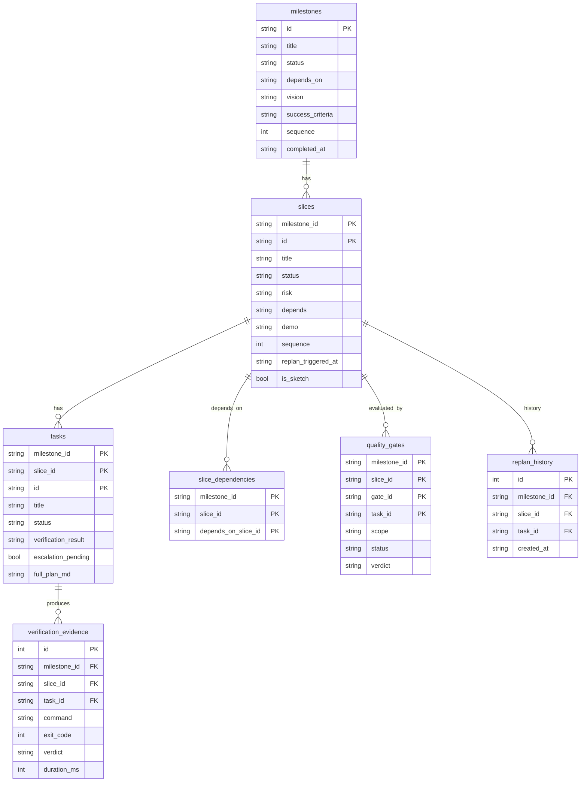
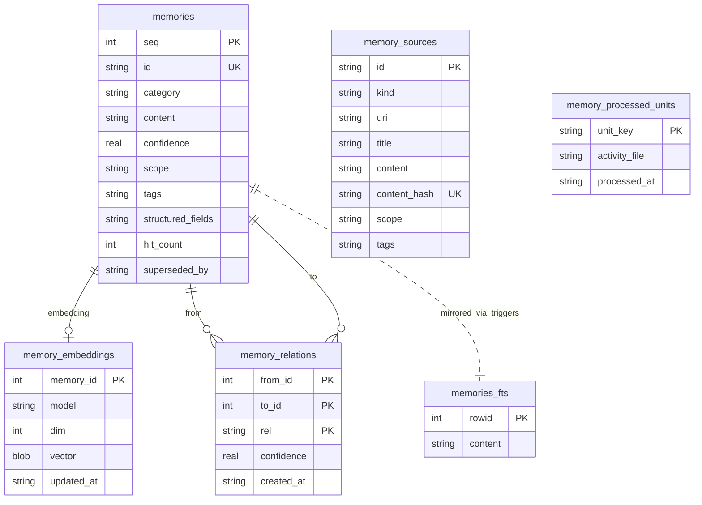
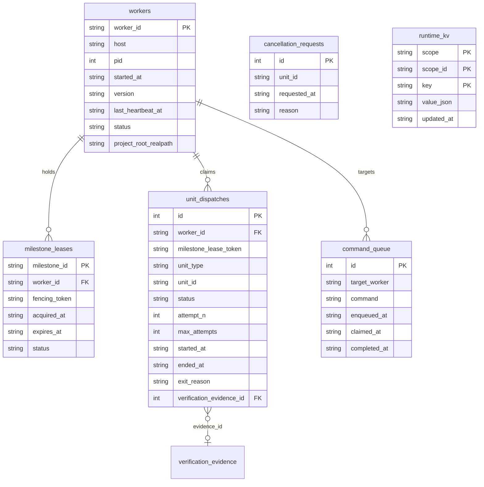

# State Persistence — GSD-2 SQLite Layer

**Phase:** 11 (M3 · WORK-02)
**Layer:** Workflow Engine (M3) — state persistence subsystem
**Audience:** Python reimplementer at `~/projects/state/` mapping the GSD-2 SQLite layer to a Python `sqlite3` stdlib equivalent. Read this in conjunction with `kb/workflow/auto-mode.md` (Phase 10 — auto-mode that consumes this state) and `.planning/codebase/CONCERNS.md` (known fragility cataloged here as design constraints, not blockers).

**Source files (state persistence subsystem, ~6,400 LOC across 18 verified Phase-11 in-scope files):**

The single-writer facade and its DDL helpers (in `gsd-2/src/resources/extensions/gsd/`):
`gsd-db.ts` (3,108 — facade · single-writer · workspace cache · `process.on("exit")`) ·
`db-base-schema.ts` (384 — baseline DDL: 19 tables + indexes + 3 views) ·
`db-coordination-schema.ts` (110 — v24 coordination tables) ·
`db-runtime-kv-schema.ts` (31 — v25 KV table) ·
`db-memory-fts-schema.ts` (67 — FTS5 virtual table + triggers) ·
`db-migration-steps.ts` (451 — 24 of the 26 migration step functions) ·
`db-schema-metadata.ts` (33 — schema_version semantics + idempotent column add) ·
`db-migration-backup.ts` (35 — pre-migration `.gsd/gsd.db.backup-vN` copy).

Connection lifecycle helpers (split out of the facade):
`db-provider.ts` (149 — `node:sqlite` primary + `better-sqlite3` fallback) ·
`db-adapter.ts` (76 — adapter interface + statement caching + row normalization) ·
`db-connection-cache.ts` (46 — workspace `identityKey` cache) ·
`db-open-state.ts` (48 — open-attempt + last-error tracking) ·
`db-transaction.ts` (77 — `DbTransactionRunner` depth-counted re-entrant runner).

Crash recovery + atomic-write (Phase C pt 2 — DB-driven, not file-driven):
`crash-recovery.ts` (371 — DB-driven stale worker detection + PID liveness) ·
`atomic-write.ts` (186 — temp-file + rename + retry-on-EBUSY pattern) ·
`compaction-snapshot.ts` (166 — `.gsd/last-snapshot.md` Markdown digest, NOT a binary DB snapshot — see §13 in the next plan) ·
`unit-ownership.ts` (245 — separate `.gsd/unit-claims.db` for opt-in atomic per-unit claims, OUTSIDE the single-writer invariant).

**Phase 12 forward-refs** (the workflow KERNEL — not Phase 11's territory): `auto/workflow-kernel.ts` consumes this layer through the `RuntimePersistenceAdapter` contract; see `kb/workflow/auto-mode.md` §1.

**Walkthroughs (Phase 11 sibling — to be authored if required):**
None at the time of writing. The facade `gsd-db.ts` (3,108 LOC) is the canonical read-target; this document substitutes for a slice walkthrough.

**Sibling docs / back-refs:**
[`./auto-mode.md`](./auto-mode.md) (Phase 10 — auto-mode persists `workers`, `unit_dispatches`, `runtime_kv`, and `cancellation_requests` rows here; crash recovery runs through this layer's `crash-recovery.ts`).

**ADR sources:** none specific to this layer. The architectural decisions are encoded in the source — `SCHEMA_VERSION = 26` constant at `gsd-db.ts:109` and the single-writer invariant test at `tests/single-writer-invariant.test.ts`.

---

> **Honest Corrections (read first — two corrections embedded throughout)**
>
> The `.planning/codebase/CONCERNS.md` and `.planning/codebase/ARCHITECTURE.md` framings of this layer use language that disagrees with the source after the Phase C pt 2 refactor landed. Reverse-engineering the code reveals two naming/architectural gaps the rest of this document addresses head-on (the Phase 10 spine doc set the precedent: "auto.ts is wiring, not the engine").
>
> **Correction (1) — sql.js misattribution corrected.** `.planning/codebase/CONCERNS.md` "Dependencies at Risk" subsection and `.planning/codebase/ARCHITECTURE.md` both reference "sql.js for Database Snapshot Persistence." This is **incorrect.** The source uses `node:sqlite` (Node ≥ 22 built-in, primary) and `better-sqlite3` (npm fallback). Verified by full-source grep: zero load statements pulling that package exist anywhere in `gsd-2/src/resources/extensions/gsd/`. The string `sql.js` appears only in test fixtures (`tests/memory-embeddings.test.ts:122`, `tests/memory-tools.test.ts:21`, `tests/worktree-db.test.ts:282,296`) as memory-content data, and in one comment (`write-intercept.ts:47`). No code path loads sql.js. The actual "snapshot" feature (`compaction-snapshot.ts`) writes a ≤ 2 KB **Markdown digest** to `.gsd/last-snapshot.md` — NOT a binary DB snapshot. This is covered in plan 03 (§13). See §2.3 for the verification record.
>
> **Correction (2) — crash recovery is DB-driven, not lock-file driven.** The Phase C pt 2 refactor moved authoritative crash detection to DB tables (`workers` + `unit_dispatches` + `runtime_kv`). The legacy `.gsd/auto.lock` file is still written by `writeLock()` via `atomicWriteSync` for backward compatibility only — but the recovery decision flows from DB queries, not from reading the lock file. Stale workers are identified by `workers.status = 'active' AND last_heartbeat_at < (now − TTL)`; PID liveness is verified with `process.kill(pid, 0)`. The lock file is a back-compat surface for legacy callers. See §9.

---

## Table of Contents

1. Overview — single-writer facade backing `.gsd/gsd.db`
2. Provider chain (`node:sqlite` → `better-sqlite3` → null)
3. File layout (`.gsd/`)
4. Pragmas & connection settings
5. Schema (full ER + table-by-table reference) *(plan 01 task 2)*
6. Migration system (V2 → V26 ladder + fresh-install vs upgrade paths) *(plan 01 task 2)*
7. Connection lifecycle *(plan 01 task 2)*
8. Transactions *(plan 01 task 2)*
9. Crash recovery (Phase C pt 2 — DB-driven) *(plan 01 task 2)*
10. — *(plan 03)*

---

## §1 Overview

The GSD-2 state persistence layer is a **single-writer SQLite facade** backing the per-workspace file `<projectRoot>/.gsd/gsd.db`. It is orchestrated by the 3,108-line god file `gsd-db.ts` (`gsd-2/src/resources/extensions/gsd/gsd-db.ts`), which loads a SQLite provider (`node:sqlite` primary, `better-sqlite3` fallback), wraps it in a `DbAdapter` (statement-caching + row-shape normalization), runs schema initialization (pragmas → baseline DDL → fresh-install or migration ladder), and exposes a typed read/write API. Schema DDL is split across helper modules (`db-base-schema.ts`, `db-coordination-schema.ts`, `db-runtime-kv-schema.ts`, `db-memory-fts-schema.ts`, `db-migration-steps.ts`) but `gsd-db.ts` is the **single point of orchestration** — and the only module allowed to issue write SQL against `.gsd/gsd.db`. This invariant is enforced structurally by `tests/single-writer-invariant.test.ts`, which fails the build if any other module under `gsd-2/src/resources/extensions/gsd/` is detected emitting `INSERT`, `UPDATE`, `DELETE`, or `REPLACE` statements against the main DB.

A **separate, opt-in** auxiliary file `<projectRoot>/.gsd/unit-claims.db` is managed by `unit-ownership.ts` (245 LOC). It mirrors the provider-chain pattern from `gsd-db.ts` but is intentionally **outside** the single-writer invariant — it is the documented escape hatch for atomic per-unit-claim coordination across multiple worker processes (e.g. parallel auto-mode workers contending for a slice in the same workspace). Multi-worker dispatch coordination (the `workers` / `unit_dispatches` / `cancellation_requests` / `command_queue` tables, schema v24) lives in the **main** `gsd.db`, not in `unit-claims.db` — `unit-claims.db` is for the lower-level "exactly one process holds this unit at this instant" claim, while the main DB tables are the higher-level dispatch state machine. See §10 in plan 03 for the multi-worker coordination model.

`SCHEMA_VERSION = 26` is the single source of truth (`gsd-db.ts:109`, exported as a constant). The facade's banner header `gsd-2/src/resources/extensions/gsd/gsd-db.ts:1-50` documents the single-writer rule, the provider chain, and the migration ladder shape.

The current schema (v26) carries **28 tables** (1 metadata audit table + 27 feature tables) plus 1 FTS5 virtual table, 3 views, and ~25 canonical indexes — split across the 4 DDL helper modules listed in the source-files header above. The full table catalogue is enumerated in §5 (plan 01 task 2). The migration ladder (V2 → V26) is enumerated in §6.

**Single connection per process, multiple workspaces cached.** The facade keeps **one active connection** at a time (`currentDb` global at module scope in `gsd-db.ts`), but caches **multiple workspace connections** in a `Map<identityKey, {dbPath, db}>` (`db-connection-cache.ts:1-46`). Switching workspaces (e.g. `openDatabaseByWorkspace(otherWorkspace)`) stashes the current adapter into the cache, opens the new one, and makes that the active connection. Sibling worktrees of the same project share `identityKey` (the realpath-normalized project root) and therefore share **the same** connection — a deliberate design choice so that a worktree-scoped operation does not race against the main worktree's writer in the same process. Cross-process workspace coordination is handled by the v24 `workers` + `unit_dispatches` tables (multi-worker dispatch), and by the separate `unit-claims.db` for atomic per-unit ownership when needed.

This document is written for someone porting this layer to Python's `sqlite3` stdlib (Python 3.11+). Equivalents are sketched throughout where they help; the full Python notes section is plan 03's §17.

---

## §2 Provider chain

The `SqliteProviderLoader` class (`db-provider.ts:49-144`) exposes a tiered provider chain. The chain is consulted at module-load time (lazy — first `load()` call), with a second fallback layer at file-open time inside `gsd-db.ts:openDatabase`.

### 2.1 Three-tier provider chain

**Tier 1 — `node:sqlite` (Node 22 built-in, primary).**
Loaded via `requireModule("node:sqlite")` at `db-provider.ts:65`. Looks up `mod.DatabaseSync`. If present, the loader sets `providerName = "node:sqlite"` and returns. The experimental warning Node emits for the built-in module is suppressed by `suppressSqliteWarning()` (`db-provider.ts:29-47`), which monkey-patches `process.emit` to drop only the SQLite-specific `ExperimentalWarning`.

**Tier 2 — `better-sqlite3` (npm dep, fallback).**
If Tier 1 fails (e.g. running on Node < 22 where `node:sqlite` does not exist), `loadBetterSqliteModule()` (`db-provider.ts:134-143`) is consulted. It imports the package via the obfuscated `BETTER_SQLITE3_PACKAGE` constant (`["better", "sqlite3"].join("-")` at `db-provider.ts:6` — done this way so static analyzers don't warn about an optional peer dep). On success, `providerName = "better-sqlite3"`.

**Tier 3 — null (no provider available).**
If both Tier 1 and Tier 2 fail, `providerModule` and `providerName` stay null, and `writeStderr` emits a diagnostic that includes a Node version hint when the host is running Node < 22 (`db-provider.ts:82-88`). Subsequent calls observe this null state via `gsd-db.ts:isDbAvailable()`, which returns false; readers in `gsd-db.ts` return empty arrays / null records, and writers throw `GSDError(GSD_STALE_STATE, "gsd-db: No database open")` (cite `gsd-db.ts:725-727` for the throw site in `transaction()`).

### 2.2 Open-time fallback

The chain has a **second** fallback layer at file-open time. After Tier 1 succeeds at load time, opening a specific `.gsd/gsd.db` file with `node:sqlite` may still fail (e.g. if the on-disk file uses a Btree feature `node:sqlite`'s linked SQLite version doesn't support, or if the OS denies the open). `gsd-db.ts:578-589` handles this case:

```typescript
let rawDb: unknown;
let fallbackOpen: SqliteFallbackOpen | null = null;
try {
  rawDb = providerLoader.openRaw(path);
} catch (primaryErr) {
  _dbOpenState.recordError("open", primaryErr);
  // node:sqlite loaded but failed to open this file — try better-sqlite3 as fallback.
  fallbackOpen = providerLoader.tryOpenBetterSqliteFallback(path);
  if (fallbackOpen) {
    rawDb = fallbackOpen.rawDb;
    _dbOpenState.clearError();
  }
  if (!rawDb) throw primaryErr;
}
```

`tryOpenBetterSqliteFallback` (`db-provider.ts:110-121`) only fires when the current provider is `node:sqlite`. It loads `better-sqlite3` (lazily, via `loadBetterSqliteModule`) and returns an `SqliteFallbackOpen` record carrying the raw DB. The provider switch is **only committed** (via `providerLoader.commitFallback`, `db-provider.ts:123-126`) AFTER `initSchema` succeeds against the fallback adapter — see `gsd-db.ts:617`. If the fallback open succeeds but `initSchema` then fails, the original Tier 1 error is what propagates.

### 2.3 Why no sql.js

`.planning/codebase/CONCERNS.md` "Dependencies at Risk → sql.js for Database Snapshot Persistence" claims this layer depends on `sql.js`. The claim is wrong, and the rest of the doc treats `node:sqlite` + `better-sqlite3` as the only providers. The verification record:

```bash
$ grep -rn "from ['\"]sql\.js" gsd-2/src/resources/extensions/gsd/
# zero results

$ grep -rn "require\(['\"]sql\.js" gsd-2/src/resources/extensions/gsd/
# zero results

$ grep -rn "sql\.js" gsd-2/src/resources/extensions/gsd/ | head
gsd-2/src/resources/extensions/gsd/write-intercept.ts:47:  // Direct DB access via sqlite3/sql.js/better-sqlite3 targeting gsd.db (#3625)
gsd-2/src/resources/extensions/gsd/tests/memory-embeddings.test.ts:122:  createMemory({ category: 'gotcha', content: 'sql.js FTS5 virtual tables need triggers' });
gsd-2/src/resources/extensions/gsd/tests/memory-tools.test.ts:21:    content: 'sql.js FTS5 virtual tables need explicit triggers.',
gsd-2/src/resources/extensions/gsd/tests/worktree-db.test.ts:282:    `UPDATE decisions SET choice = 'sql.js' WHERE id = 'D001'`,
gsd-2/src/resources/extensions/gsd/tests/worktree-db.test.ts:296:  assert.equal(d1?.choice, "sql.js", "worktree wins on conflict (INSERT OR REPLACE)");
```

The four hits are: (a) one comment in `write-intercept.ts:47` listing `sql.js` among the names a write-intercept rule must guard against in case some external caller bundles it (purely defensive), and (b) test fixture data — memory rows whose `content` happens to be a `"sql.js …"` string, used as throwaway sample content for memory-store tests. None of these load or use sql.js.

**The actual "snapshot" feature** in this layer is the Markdown digest written by `compaction-snapshot.ts` (166 LOC, covered in plan 03 §13). That file produces `<projectRoot>/.gsd/last-snapshot.md` — a 2,048-byte UTF-8-capped Markdown summary of top memories + recent exec history + active context, intended to be readable on resume after Claude's context is compacted. It is not a binary DB snapshot, and it does not use sql.js.

---

## §3 File layout (`.gsd/`)

The state persistence layer maintains the following files under `<projectRoot>/.gsd/`:

- **`.gsd/gsd.db`** — single-writer authoritative SQLite database. One per workspace; sibling worktrees of the same project share the same file via `identityKey` (the realpath-normalized project root). Cite `db-connection-cache.ts:1-46` for the cache + `identityKey` semantics. This is the **only** file that the single-writer invariant covers; everything else under `.gsd/` is either a derived markdown artifact or a separate database.

- **`.gsd/unit-claims.db`** — separate, opt-in atomic per-unit claims database. Mirrors the `gsd-db.ts` provider pattern (loads `node:sqlite` then falls back to `better-sqlite3`) but is intentionally **OUTSIDE** the single-writer invariant — it has its own connection, its own schema (a single `unit_claims (unit_id PK, owner, claimed_at, fence)` table), and its own write surface in `unit-ownership.ts` (245 LOC). Used only when atomic per-unit ownership across processes is needed (the file-level mutex case); not used for the higher-level dispatch state machine. Cite `unit-ownership.ts:1-150`.

- **`.gsd/last-snapshot.md`** — Markdown compaction digest. **NOT a DB snapshot.** Cap 2,048 bytes UTF-8 (truncated with `…[truncated]` marker). Built from top memories + recent exec history + active context. Read on resume after context compaction so an agent can re-orient. See plan 03 §13 for the full content shape and refresh cadence. Cite `compaction-snapshot.ts:1-166`.

- **`.gsd/auto.lock`** — legacy compatibility lock file. Authoritative state (whether an auto-mode worker is alive) lives in DB tables; the lock file is still written by `writeLock()` via `atomicWriteSync` (the temp-file + retry-on-EBUSY rename pattern) for backward compatibility with code paths that read the lock file directly. The crash-recovery path will fall back to reading this file if the DB query returns nothing. See §9. Cite the `writeLock` function in `crash-recovery.ts`.

- **`.gsd/gsd.db.backup-vN`** — pre-migration backup file. Created by `backupDatabaseBeforeMigration` (`db-migration-backup.ts:1-35`) before any migration runs. The version label `N` in the filename is the schema version the DB is migrating **FROM** (i.e. the `currentVersion` value at the start of the upgrade). Best-effort: failure to copy logs a warning but does not block the migration. Skipped when the DB is `:memory:` and skipped when the source file does not yet exist (fresh install).

- **`.gsd/milestones/<MID>/*.md`** — Markdown artifacts that round-trip with DB rows. Generated by `db-writer.ts` (33.6 KB / 883 LOC). Reconciled with DB on open via `migration-auto-check.ts` (130 LOC). Drift between DB rows and markdown files on disk is a known fragility area (catalogued in plan 03 §12).

- **`.gsd/DECISIONS.md`** — DB-derived markdown projection of the `decisions` table. Re-rendered atomically via the same `atomic-write.ts` temp-file + rename pattern used for the lock file (cite §9.3). Read-only from the user's perspective (the DB row is the source of truth); the markdown is for grep-ability and human review.

- **`.gsd/REQUIREMENTS.md`** — DB-derived markdown projection of the `requirements` table. Same atomic-write semantics as `DECISIONS.md`. Same source-of-truth rule.

**File ownership summary.** The single-writer invariant covers `.gsd/gsd.db` (and its WAL / SHM sidecars `gsd.db-wal`, `gsd.db-shm`). It does NOT cover `.gsd/unit-claims.db` (separate connection in `unit-ownership.ts`). It does NOT cover the markdown projection files (`DECISIONS.md`, `REQUIREMENTS.md`, milestone PLAN/SUMMARY artifacts) — those are written by `db-writer.ts` through `atomic-write.ts`, but `db-writer.ts` reads from the DB and writes to disk and so it does not violate the invariant (the DB writes are not from `db-writer.ts`; the DB write helpers it calls live in `gsd-db.ts`). It does NOT cover the lock file (`auto.lock` is written by `crash-recovery.ts:writeLock` for back-compat — see §9). It does NOT cover the backup files (`gsd.db.backup-vN`) — those are byte-for-byte file copies, not DB writes.

---

## §4 Pragmas & connection settings

The pragmas below are issued by `initSchema` at `gsd-db.ts:111-119` immediately after the DB is opened. The first six are gated on `fileBacked` (i.e. they are **skipped for `:memory:` databases**, which are used in tests). The last two (`temp_store=MEMORY` and `foreign_keys=ON`) are issued unconditionally for both file-backed and in-memory connections.

| PRAGMA | Value | Rationale | Citation |
|---|---|---|---|
| `journal_mode` | `WAL` | Concurrent reads alongside the single writer; reduces contention vs the default rollback journal. | `gsd-db.ts:112` (initSchema) |
| `busy_timeout` | `5000` (ms) | Tolerate transient locks (5 s) before throwing `SQLITE_BUSY`. | `gsd-db.ts:113` (initSchema) |
| `synchronous` | `NORMAL` | WAL-safe durability without per-commit fsync; fsync only on WAL checkpoint. | `gsd-db.ts:114` (initSchema) |
| `auto_vacuum` | `INCREMENTAL` | Reclaim space without full-VACUUM downtime; pairs with `PRAGMA incremental_vacuum(64)` on close. | `gsd-db.ts:115` (initSchema) |
| `cache_size` | `-8000` | 8 MB page cache (negative value = KiB; positive value = pages). | `gsd-db.ts:116` (initSchema) |
| `mmap_size` | `67108864` | 64 MB memory-mapped I/O — **skipped on macOS** (`process.platform === "darwin"`) due to repeated reports of mmap unreliability on APFS / FileVault. | `gsd-db.ts:117` (initSchema) |
| `temp_store` | `MEMORY` | RAM-resident temp tables and indexes (always on, even for `:memory:`). | `gsd-db.ts:118` (initSchema) |
| `foreign_keys` | `ON` | Enforce FK constraints (always on; SQLite default is OFF for back-compat — must be explicitly enabled per-connection). | `gsd-db.ts:119` (initSchema) |

**Single-writer invariant restated.** Only `gsd-db.ts` is allowed to issue write SQL (`INSERT`, `UPDATE`, `DELETE`, `REPLACE`, `CREATE`, `ALTER`, `DROP`) against `.gsd/gsd.db`. Other modules read via the typed query helpers exported from `gsd-db.ts` (e.g. `getActiveDecisions`, `listMilestones`, `getRuntimeKv`) and write **only through the typed mutator helpers** also exported from `gsd-db.ts` (e.g. `insertDecision`, `recordAutoTurnEvent`). The `tests/single-writer-invariant.test.ts` structural test enforces this by AST-grepping every other module for write-SQL strings — the build fails if any non-`gsd-db.ts` module is detected emitting them. The separate `.gsd/unit-claims.db` file (managed by `unit-ownership.ts`) is the documented escape hatch — it has its own connection and is intentionally outside the invariant for the atomic per-unit-claim use case.

**Python equivalent (preview).** Python's `sqlite3.Connection` accepts the same PRAGMA strings via `conn.execute("PRAGMA …")`. The `:memory:` case maps directly. The `process.platform === "darwin"` mmap exception maps to `sys.platform == "darwin"`. The single-writer invariant has no language-level enforcement in Python; it must be enforced via review or AST tests (the equivalent of `tests/single-writer-invariant.test.ts`). The full Python notes section is plan 03 §17.

**Pragma issuance order matters.** `journal_mode=WAL` MUST be issued before any DDL — the journal_mode setting is sticky on file-backed DBs (it persists across opens), but the **first** open of a fresh file is when it takes effect; switching journal modes after pages have been written requires an exclusive lock. `foreign_keys=ON` MUST be issued per-connection, every open, because SQLite's default is OFF for back-compat — this is one of the most common porting gotchas. `auto_vacuum=INCREMENTAL` MUST be issued before the first DDL — it cannot be changed retroactively without a full VACUUM. The `initSchema` order in `gsd-db.ts:111-119` reflects these constraints: pragmas first, then `BEGIN` + DDL, then `COMMIT`, then `migrateSchema`.

**No `PRAGMA secure_delete`.** Notable absences: GSD-2 does NOT enable `secure_delete` (which would zero out deleted pages — not needed since the DB does not store secrets). It does NOT enable `defensive` mode (locks down arbitrary `PRAGMA` setting and FTS5 via SQL — not needed since GSD-2 controls all callers). It does NOT issue `PRAGMA journal_size_limit` (the WAL is allowed to grow unbounded between checkpoints; the close-time `wal_checkpoint(TRUNCATE)` is the bound). These omissions are intentional design choices, not oversights.

**WAL sidecars on disk.** Once `journal_mode=WAL` is set, SQLite creates two sidecar files alongside the main DB:

- `.gsd/gsd.db-wal` — the write-ahead log file. Holds committed-but-not-yet-checkpointed pages. Grows during normal operation; truncated by `PRAGMA wal_checkpoint(TRUNCATE)` (issued on close, see §7.3).
- `.gsd/gsd.db-shm` — the shared-memory index file. Used by the WAL reader/writer protocol; recreated on next open if missing.

Both files are tracked by `.gitignore` (alongside `.gsd/gsd.db` itself) — neither should ever be committed. The exception is `checkpointDatabase()` (`gsd-db.ts:697-702`), which issues a `wal_checkpoint(TRUNCATE)` while the DB is still open so that `git add .gsd/gsd.db` stages a self-contained snapshot. See §7.6.

---

## §5 Schema (full ER + table-by-table reference)

GSD-2 schema v26 contains **28 tables** (1 metadata audit table + 27 feature tables) plus 1 FTS5 virtual table, 3 views, and ~25 canonical indexes. The tables are split across 4 DDL helper modules — `db-base-schema.ts` (baseline + v1-v23 features), `db-coordination-schema.ts` (v24 multi-worker), `db-runtime-kv-schema.ts` (v25 KV), and `db-memory-fts-schema.ts` (v19+ FTS5).

### §5.1 ER Diagram strategy

Mermaid `erDiagram` has a practical node-count limit (renders become illegible past ~15 entities). This doc splits the ER diagram into **3 sub-diagrams** by feature group: (a) Hierarchy + verification, (b) Memory subsystem, (c) Coordination + runtime KV. Decisions / requirements / artifacts / audit (event log) are described in the table reference but not graphed — there are no FK relations among them worth diagramming (they are independent feature islands).

### §5.2 ER Diagram A — Hierarchy + verification



### §5.3 ER Diagram B — Memory subsystem



Note: `memories_fts` is a **FTS5 virtual table** (not a regular table). Three triggers (`memories_ai`, `memories_ad`, `memories_au`) keep it synchronized with the base `memories` table. FTS5 is optional — if the SQLite build lacks FTS5 support, creation fails non-fatally and queries fall back to LIKE-based scans (`memory-store.queryMemoriesRanked`). See `db-memory-fts-schema.ts:1-67`.

### §5.4 ER Diagram C — Coordination + runtime KV



Notes:
- `command_queue.target_worker` may be NULL → broadcast to all workers (annotated in narrative, not in the diagram).
- `cancellation_requests` has no FK column referencing `unit_dispatches` — the relationship is denormalized (matched on `unit_id` string) and only described in narrative. This is intentional: cancellation is request-shaped (a signal), and `unit_id` may be cancelled before any `unit_dispatches` row exists for it.
- `verification_evidence` is shown here as a foreign destination (via `unit_dispatches.verification_evidence_id`) but its full attributes are in §5.2.

### §5.5 Table reference (grouped by feature)

The 28 tables grouped by feature with PK / key columns / first-introduced version / DDL source file:

**Group 1 — Metadata (1 table)**

| Table | PK | Key columns | Introduced | DDL source |
|---|---|---|---|---|
| `schema_version` | `(version, applied_at)` | append-only audit; `MAX(version)` is current schema | v1 baseline | `db-base-schema.ts` |

**Group 2 — Decisions / Requirements / Artifacts (3 tables)**

| Table | PK | Key columns | Introduced | DDL source |
|---|---|---|---|---|
| `decisions` | `seq` (autoinc) | `id` UNIQUE, `when_context`, `scope`, `decision`, `choice`, `rationale`, `revisable`, `made_by` (v4+), `source` (v16+), `superseded_by` | v1 baseline; `made_by` v4; `source` v16 | `db-base-schema.ts`, `db-migration-steps.ts:applyMigrationV4`, `applyMigrationV16` |
| `requirements` | `id` | `class`, `status`, `description`, `why`, `source`, `primary_owner`, `supporting_slices`, `validation`, `notes`, `full_content`, `superseded_by` | v1 baseline | `db-base-schema.ts` |
| `artifacts` | `path` | `artifact_type`, `milestone_id`, `slice_id`, `task_id`, `full_content`, `imported_at` | v2 | `db-migration-steps.ts:applyMigrationV2Artifacts` |

**Group 3 — Memory subsystem (6 tables, 1 virtual)**

| Table | PK | Key columns | Introduced | DDL source |
|---|---|---|---|---|
| `memories` | `seq` (autoinc) | `id` UNIQUE, `category`, `content`, `confidence`, `source_unit_*`, `superseded_by`, `hit_count`, `scope` (v18), `tags` (v18), `structured_fields` (v21) | v3; v18, v21 column adds | `db-migration-steps.ts:applyMigrationV3Memories`, `applyMigrationV18`, `applyMigrationV21` |
| `memory_processed_units` | `unit_key` | `activity_file`, `processed_at` | v3 | `db-migration-steps.ts:applyMigrationV3Memories` |
| `memory_sources` | `id` | `kind`, `uri`, `title`, `content`, `content_hash` UNIQUE, `imported_at`, `scope`, `tags` | v18 | `db-migration-steps.ts:applyMigrationV18MemorySources` |
| `memory_embeddings` | `memory_id` | `model`, `dim`, `vector` BLOB, `updated_at` | v19 | `db-migration-steps.ts:applyMigrationV19MemoryFts` |
| `memory_relations` | `(from_id, to_id, rel)` | `confidence`, `created_at` | v20 | `db-migration-steps.ts:applyMigrationV20MemoryRelations` |
| `memories_fts` (FTS5 virtual) | rowid → `memories.seq` | tokenizer: `porter unicode61`; triggers `memories_ai/ad/au` | v19 | `db-memory-fts-schema.ts` |

**Group 4 — Hierarchy (4 tables)**

| Table | PK | FK → | Key columns | Introduced | DDL source |
|---|---|---|---|---|---|
| `milestones` | `id` | — | `title`, `status`, `depends_on` (v7), v8 planning columns (`vision`, `success_criteria`, `key_risks`, `proof_strategy`, `verification_*`, `definition_of_done`, `requirement_coverage`, `boundary_map_markdown`), `sequence` (v23), `created_at`, `completed_at` | v5 baseline; v7, v8, v23 adds | `db-migration-steps.ts:applyMigrationV5,V7,V8,V23` |
| `slices` | `(milestone_id, id)` | `milestones(id)` | `title`, `status`, `risk`, `depends` (v7), `demo` (v7), `full_summary_md` (v6), `full_uat_md` (v6), v8 planning columns (`goal`, `success_criteria`, `proof_level`, `integration_closure`, `observability_impact`), `sequence` (v9), `replan_triggered_at` (v10), `is_sketch`/`sketch_scope` (v16) | v5 baseline; v6-v10, v16 adds | `db-migration-steps.ts:applyMigrationV5,V6,V7,V8,V9,V10,V16` |
| `tasks` | `(milestone_id, slice_id, id)` | `slices(milestone_id, id)` | `title`, `status`, `one_liner`, `narrative`, `verification_result`, `duration`, `blocker_*` (v17), `escalation_*` (v17), v8 planning columns (`description`, `estimate`, `files`, `verify`, `inputs`, `expected_output`, `observability_impact`), `full_plan_md` (v11), `sequence` (v9) | v5 baseline; v8-v11, v17 adds | `db-migration-steps.ts:applyMigrationV5,V8,V9,V11,V17` |
| `slice_dependencies` | `(milestone_id, slice_id, depends_on_slice_id)` | `slices` (×2) | DAG edges between slices | v14 | `db-migration-steps.ts:applyMigrationV14SliceDependencies` |

**Group 5 — Verification / Audit (9 tables)**

| Table | PK | Key columns | Introduced | DDL source |
|---|---|---|---|---|
| `verification_evidence` | `id` (autoinc) | `command`, `exit_code`, `verdict`, `duration_ms`; dedup index | v5 | `db-migration-steps.ts:applyMigrationV5HierarchyTables`, `db-verification-evidence-schema.ts` |
| `replan_history` | `id` (autoinc) | tracks plan replacements; partial unique on `(milestone_id, slice_id, task_id)` (v11) | v8 | `db-migration-steps.ts:applyMigrationV8PlanningFields,V11` |
| `assessments` | `path` | verifier output; `scope` added v22 | v8 | `db-migration-steps.ts:applyMigrationV8,V22` |
| `quality_gates` | `(milestone_id, slice_id, gate_id, task_id)` | v22 fixed an invalid V12 PK expression; `scope` added v22 | v12; repaired v22 | `db-migration-steps.ts:applyMigrationV12QualityGates,V22QualityGateRepair` |
| `gate_runs` | `id` (autoinc) | per-turn gate evaluation log: `trace_id`, `turn_id`, `outcome`, `failure_class`, `attempt`, `max_attempts`, `retryable` | v15 | `db-migration-steps.ts:applyMigrationV15AuditTables` |
| `turn_git_transactions` | `(trace_id, turn_id, stage)` | git status / commit / snapshot tracking per turn | v15 | `db-migration-steps.ts:applyMigrationV15AuditTables` |
| `audit_events` | `event_id` | `trace_id`, `turn_id`, `caused_by`, `category`, `type`, `ts`, `payload_json` | v15 | `db-migration-steps.ts:applyMigrationV15AuditTables` |
| `audit_turn_index` | `(trace_id, turn_id)` | first/last ts + event count per turn | v15 | `db-migration-steps.ts:applyMigrationV15AuditTables` |
| `milestone_commit_attributions` | `(commit_sha, milestone_id)` | attributes git commits to milestones / slices / tasks | v26 | `db-migration-steps.ts:applyMigrationV26MilestoneCommitAttributions` |

**Group 6 — Coordination (5 tables, v24)**

| Table | PK | Key columns | Introduced | DDL source |
|---|---|---|---|---|
| `workers` | `worker_id` | `host`, `pid`, `started_at`, `version`, `last_heartbeat_at`, `status`, `project_root_realpath` | v24 | `db-coordination-schema.ts:20-28` |
| `milestone_leases` | `milestone_id` | `worker_id` FK, `fencing_token`, `acquired_at`, `expires_at`, `status` | v24 | `db-coordination-schema.ts:30-38` |
| `unit_dispatches` | `id` (autoinc) | full claim/run record: `worker_id`, `milestone_lease_token`, `unit_type`, `unit_id`, `status`, `attempt_n`/`max_attempts`, `started_at`, `ended_at`, `exit_reason`, `error_summary`, `verification_evidence_id` FK, retry/backoff fields | v24 | `db-coordination-schema.ts:40-64` |
| `cancellation_requests` | `id` (autoinc) | cooperative cancel signal | v24 | `db-coordination-schema.ts:66-78` |
| `command_queue` | `id` (autoinc) | worker-targeted or broadcast (`target_worker NULL`) | v24 | `db-coordination-schema.ts:80-94` |

**Group 7 — Runtime KV (1 table, v25)**

| Table | PK | Key columns | Introduced | DDL source |
|---|---|---|---|---|
| `runtime_kv` | `(scope, scope_id, key)` | `value_json`, `updated_at`. **Strict invariant: NON-correctness-critical.** Used for resume cursors, UI cursors, session-file pointers. | v25 | `db-runtime-kv-schema.ts:21-29` |

### §5.6 Indexes (canonical / hot-path)

The following indexes are created either at fresh-install time (in `initSchema`) or in their owning migration block:

```text
# v3 baseline
idx_memories_active           ON memories(superseded_by)

# v11
idx_replan_history_milestone  ON replan_history(milestone_id, created_at)
idx_replan_history_unique     ON replan_history(milestone_id, slice_id, task_id) WHERE …  (partial)

# v13 hot-path indexes
idx_tasks_active              ON tasks(milestone_id, slice_id, status)
idx_slices_active             ON slices(milestone_id, status)
idx_milestones_status         ON milestones(status)
idx_quality_gates_pending     ON quality_gates(milestone_id, slice_id, status)
idx_verification_evidence_task ON verification_evidence(milestone_id, slice_id, task_id)

# v14
idx_slice_deps_target         ON slice_dependencies(milestone_id, depends_on_slice_id)

# v15 audit
idx_gate_runs_turn            ON gate_runs(trace_id, turn_id)
idx_gate_runs_lookup          ON gate_runs(milestone_id, slice_id, task_id, gate_id)
idx_turn_git_tx_turn          ON turn_git_transactions(trace_id, turn_id)
idx_audit_events_trace        ON audit_events(trace_id, ts)
idx_audit_events_turn         ON audit_events(trace_id, turn_id, ts)

# v17 escalation (also created at fresh-install, see gsd-db.ts:137)
idx_tasks_escalation_pending  ON tasks(milestone_id, slice_id, escalation_pending)

# v18 memory scope (also fresh-install, gsd-db.ts:138-140)
idx_memories_scope            ON memories(scope)
idx_memory_sources_kind       ON memory_sources(kind)
idx_memory_sources_scope      ON memory_sources(scope)

# v20 memory relations (also fresh-install, gsd-db.ts:141-142)
idx_memory_relations_from     ON memory_relations(from_id)
idx_memory_relations_to       ON memory_relations(to_id)

# v24 coordination (db-coordination-schema.ts:96-108)
idx_unit_dispatches_active            ON unit_dispatches(milestone_id, status)
idx_unit_dispatches_trace             ON unit_dispatches(trace_id, turn_id)
idx_unit_dispatches_active_per_unit   ON unit_dispatches(unit_id) WHERE status IN ('claimed','running')   -- partial UNIQUE; double-claim guard
idx_command_queue_pending             ON command_queue(target_worker, claimed_at)

# v26 milestone attributions
idx_milestone_commit_attr_milestone   ON milestone_commit_attributions(milestone_id)
```

The `idx_unit_dispatches_active_per_unit` partial unique index is the multi-worker double-claim guard — two `INSERT` calls with the same `unit_id` and a status of `claimed` or `running` will collide on this index and the second `INSERT` will throw `SQLITE_CONSTRAINT`. This is the DB-level enforcement of the "exactly one active dispatch per unit" invariant. Cite `db-coordination-schema.ts:101-104`.

### §5.7 Views

The 3 views are convenience filters for the "not superseded" rows:

```sql
CREATE VIEW active_decisions    AS SELECT * FROM decisions    WHERE superseded_by IS NULL;
CREATE VIEW active_requirements AS SELECT * FROM requirements WHERE superseded_by IS NULL;
CREATE VIEW active_memories     AS SELECT * FROM memories     WHERE superseded_by IS NULL;
```

The `superseded_by` column carries the `id` (or `seq`) of the row that supersedes the current one — it is set by a write helper that creates a new row and stamps the old. The views are used heavily in the read API to filter to live state without every query needing to repeat the WHERE clause. The views are recreated on every fresh install and on the V4 migration (`active_decisions` is recreated to pick up the new `made_by` column).

---

## §6 Migration system

### §6.1 SCHEMA_VERSION constant + schema_version table semantics

`SCHEMA_VERSION = 26` is exported from `gsd-db.ts:109` as the single source of truth. The migration ladder targets this constant; raising it requires (a) appending the next `applyMigrationVN` function and (b) bumping the constant.

The `schema_version` table itself has shape `(version INTEGER, applied_at TEXT)` and is **append-only audit** — every successful migration step inserts a new row. Reading the current version is `getCurrentSchemaVersion(db)` (`db-schema-metadata.ts`), implemented as `SELECT MAX(version) FROM schema_version`. It returns `0` if the table is empty, which itself signals a fresh install (the `schema_version` table is created in the baseline DDL, so its emptiness is well-defined).

### §6.2 Path A — Fresh install

For a brand-new `.gsd/gsd.db` that does not yet exist, `initSchema` (`gsd-db.ts:111-154`) runs the fresh-install path:

1. Issue all 8 pragmas (`gsd-db.ts:112-119`).
2. `db.exec("BEGIN")`.
3. `createBaseSchemaObjects(db, hooks)` (`gsd-db.ts:123-126`) — creates all current-shape baseline tables, indexes, and 3 views via `db-base-schema.ts`. The hooks bundle includes `tryCreateMemoriesFts` (FTS5 virtual table, non-fatal on FTS5-unavailable builds) and `ensureVerificationEvidenceDedupIndex`.
4. Probe: `SELECT count(*) FROM schema_version` (`gsd-db.ts:128`).
5. If `count == 0` (truly fresh) (`gsd-db.ts:129`):
   a. `createCoordinationTablesV24(db)` — creates the v24 tables (`gsd-db.ts:130`). **Called inline, NOT through `applyMigrationV24`** — there is no `applyMigrationV24` function.
   b. `createRuntimeKvTableV25(db)` — creates the v25 `runtime_kv` table (`gsd-db.ts:131`). **Called inline, NOT through `applyMigrationV25`** — there is no `applyMigrationV25` function.
   c. Eagerly create migration-specific indexes that wouldn't exist on a v0 install: `idx_tasks_escalation_pending`, `idx_memories_scope`, `idx_memory_sources_kind`, `idx_memory_sources_scope`, `idx_memory_relations_from`, `idx_memory_relations_to` (`gsd-db.ts:137-142`).
   d. `recordSchemaVersion(db, SCHEMA_VERSION)` (`gsd-db.ts:144`) — single row stamps fresh install at v26.
6. `db.exec("COMMIT")`.
7. Call `migrateSchema(db)` (`gsd-db.ts:153`) → no-op (`currentVersion == SCHEMA_VERSION` returns early at `gsd-db.ts:187`).

The fresh-install path is the **most reliable** path because it runs only one transaction and never touches the migration ladder. It is also the path that exercises every CREATE TABLE / CREATE INDEX statement against a clean DB.

### §6.3 Path B — Existing DB upgrade

For an existing `.gsd/gsd.db` that has a `schema_version` row with `version < 26`, `migrateSchema` (`gsd-db.ts:185-343`) runs the upgrade path:

1. `currentVersion = getCurrentSchemaVersion(db)` (`gsd-db.ts:186`).
2. If `currentVersion >= SCHEMA_VERSION`, return (no-op) (`gsd-db.ts:187`).
3. **Pre-migration backup** via `backupDatabaseBeforeMigration` (`gsd-db.ts:189-193`, helper at `db-migration-backup.ts:1-35`) — copies `.gsd/gsd.db` to `.gsd/gsd.db.backup-vN` where N is the **current** version (the version we are migrating FROM). Best-effort: failure logs a warning via `logWarning` but does not block. Skipped for `:memory:` and skipped if the source file does not exist.
4. `db.exec("BEGIN")` (`gsd-db.ts:195`).
5. Guarded `if (currentVersion < N) { applyMigrationVN(db); recordSchemaVersion(db, N); }` for **every N from 2 to 26 inclusive**, in order, at `gsd-db.ts:197-300+`. Notable variations: V19 takes a `MigrationV19Hooks` bundle for FTS5 integration; V22 takes a `MigrationV22Hooks` bundle for the quality-gates repair index hook. V24 and V25 use the same inline helpers as fresh-install (`createCoordinationTablesV24`, `createRuntimeKvTableV25`).
6. `db.exec("COMMIT")` (or `ROLLBACK` on any throw) — single-transaction all-or-nothing semantics.

### §6.4 V2-V26 ladder

The migration ladder, with one row per V from 2 to 26 inclusive, with effect summaries and source-line ranges:

| V | Function name | Effect | Source line range |
|---|---|---|---|
| 2 | `applyMigrationV2Artifacts` | Creates `artifacts` table | `db-migration-steps.ts:7-19` |
| 3 | `applyMigrationV3Memories` | Creates `memories` + `memory_processed_units`; adds `idx_memories_active`; creates `active_memories` view | `db-migration-steps.ts:21-47` |
| 4 | `applyMigrationV4DecisionMadeBy` | Adds `decisions.made_by`; recreates `active_decisions` view | `db-migration-steps.ts:49-53` |
| 5 | `applyMigrationV5HierarchyTables` | Creates `milestones` (basic shape), `slices`, `tasks`, `verification_evidence` (initial shape) | `db-migration-steps.ts:55-114` |
| 6 | `applyMigrationV6SliceSummaries` | Adds `slices.full_summary_md`, `slices.full_uat_md` | `db-migration-steps.ts:116-119` |
| 7 | `applyMigrationV7Dependencies` | Adds `slices.depends`, `slices.demo`, `milestones.depends_on` | `db-migration-steps.ts:121-125` |
| 8 | `applyMigrationV8PlanningFields` | Bulk add: 11 milestone planning columns, 5 slice columns, 7 task columns; creates `replan_history`, `assessments` | `db-migration-steps.ts:127-181` |
| 9 | `applyMigrationV9Ordering` | Adds `slices.sequence`, `tasks.sequence` | `db-migration-steps.ts:183-186` |
| 10 | `applyMigrationV10ReplanTrigger` | Adds `slices.replan_triggered_at` | `db-migration-steps.ts:188-190` |
| 11 | `applyMigrationV11TaskPlanning` | Adds `tasks.full_plan_md`; partial unique index on `replan_history` | `db-migration-steps.ts:192-199` |
| 12 | `applyMigrationV12QualityGates` | Creates `quality_gates`. **Note:** original DDL used invalid `COALESCE(task_id, '')` in PK expression — V22 repairs it. | `db-migration-steps.ts:201-218` |
| 13 | `applyMigrationV13HotPathIndexes` | Adds 5 hot-path indexes (tasks/slices/milestones status, quality_gates pending, verification_evidence per-task) + verification dedup index hook | `db-migration-steps.ts:220-230` |
| 14 | `applyMigrationV14SliceDependencies` | Creates `slice_dependencies` + `idx_slice_deps_target` | `db-migration-steps.ts:232-244` |
| 15 | `applyMigrationV15AuditTables` | Creates `gate_runs`, `turn_git_transactions`, `audit_events`, `audit_turn_index` + 5 indexes | `db-migration-steps.ts:246-312` |
| 16 | `applyMigrationV16EscalationSource` | Adds `slices.is_sketch`, `slices.sketch_scope`, `decisions.source` | `db-migration-steps.ts:314-318` |
| 17 | `applyMigrationV17TaskEscalation` | Adds 5 task escalation columns + `idx_tasks_escalation_pending` | `db-migration-steps.ts:320-327` |
| 18 | `applyMigrationV18MemorySources` | Adds `memories.scope`, `memories.tags`; creates `memory_sources`; 3 indexes | `db-migration-steps.ts:329-357` |
| 19 | `applyMigrationV19MemoryFts` | Creates `memory_embeddings`; tries FTS5 (`memories_fts`) — non-fatal on failure; backfills FTS rows | `db-migration-steps.ts:359-377` |
| 20 | `applyMigrationV20MemoryRelations` | Creates `memory_relations` + 2 indexes | `db-migration-steps.ts:379-392` |
| 21 | `applyMigrationV21StructuredMemories` | Adds `memories.structured_fields` | `db-migration-steps.ts:394-396` |
| 22 | `applyMigrationV22QualityGateRepair` | Detects broken V12 PK via `PRAGMA table_info`; if `task_id NOT NULL` constraint missing, builds `quality_gates_new`, copies via `INSERT OR IGNORE`, drops old, renames. Adds `quality_gates.scope`, `assessments.scope`. | `db-migration-steps.ts:423-451` |
| 23 | `applyMigrationV23MilestoneQueue` | Adds `milestones.sequence` | `db-migration-steps.ts:398-400` |
| **24** | `createCoordinationTablesV24` (inline call) | Creates 5 coordination tables. **Same helper as fresh-install path.** Imported from `db-coordination-schema.ts`. | `db-coordination-schema.ts` (full file) |
| **25** | `createRuntimeKvTableV25` (inline call) | Creates `runtime_kv`. **Same helper as fresh-install path.** Imported from `db-runtime-kv-schema.ts`. | `db-runtime-kv-schema.ts` (full file) |
| 26 | `applyMigrationV26MilestoneCommitAttributions` | Creates `milestone_commit_attributions` + index | `db-migration-steps.ts:402-421` |

**V24 and V25 are why the import list at `gsd-db.ts:57-81` skips `applyMigrationV24` / `applyMigrationV25`** — those functions do not exist. The migrations are performed by calling `createCoordinationTablesV24(db)` and `createRuntimeKvTableV25(db)` inline in `migrateSchema` (around `gsd-db.ts:300-340`), with `recordSchemaVersion(db, 24)` and `recordSchemaVersion(db, 25)` immediately after. This is intentional: the helpers are reused between fresh-install (where they create the v24 / v25 tables as part of the fresh schema) and upgrade (where they are the migration step itself).

**Hot-path migrations to highlight.** V5 introduced the hierarchy tables (`milestones`, `slices`, `tasks`, `verification_evidence`) — every project carries V5's schema as the foundation of its work tracking. V13 added 5 hot-path indexes (`idx_tasks_active`, `idx_slices_active`, `idx_milestones_status`, `idx_quality_gates_pending`, `idx_verification_evidence_task`) — these turn the dispatch-state queries from full-table scans into index lookups; their absence on a stuck-at-V12 DB is observable as auto-mode dispatch slowdown. V14 added `slice_dependencies` (the DAG edges between slices) and the `idx_slice_deps_target` lookup index. V20 added `memory_relations` (the typed graph between memories) and 2 indexes. V21 added `memories.structured_fields` (the JSON-shaped extension column for memory metadata).

### §6.5 Migration safety mechanisms

- **Single transaction per ladder run.** `BEGIN` at start, `COMMIT` at end, `ROLLBACK` on any throw. All-or-nothing — partial migrations cannot persist.
- **Backup-before-migration.** `.gsd/gsd.db.backup-vN` byte-copy with WAL checkpoint first. See §6.3 step 3. The backup is best-effort (warning on copy failure, but the migration still runs) — it is a recovery aid, not a precondition.
- **`ensureColumn` guard.** `db-schema-metadata.ts:17` checks `PRAGMA table_info` before issuing `ALTER TABLE … ADD COLUMN` — skips the ADD if the column exists. This makes every migration step that adds columns idempotent: re-running an already-applied migration is a no-op rather than an error.
- **`IF NOT EXISTS` everywhere** on `CREATE TABLE` and `CREATE INDEX` — same idempotency property.
- **V22 self-repair example.** The V12 quality_gates DDL had an invalid `COALESCE(task_id, '')` PK expression that some SQLite builds silently accepted but produced a malformed PK constraint. V22 detects this via `PRAGMA table_info` (looking for the missing `task_id NOT NULL` constraint), and if detected, builds `quality_gates_new` with the corrected DDL, copies all rows via `INSERT OR IGNORE` (deduplicating on the corrected PK), drops the old table, renames the new one. Cite `db-migration-steps.ts:423-451` (`applyMigrationV22QualityGateRepair`).

### §6.6 Known fragility

From `.planning/codebase/CONCERNS.md` and confirmed by source inspection:

- **25 upgrade paths not exhaustively tested.** V2→V26, V3→V26, …, V25→V26 — the migration ladder branches combinatorially. `db-migration-steps.test.ts` (~6.3 KB) and `db-migration-steps.integration.test.ts` (~14 KB) provide partial coverage but cannot exercise all 25 starting points × all interaction effects between successive migrations. This is acknowledged as a coverage gap.
- **Single-transaction failure aborts DB open.** Because the entire ladder runs inside a `BEGIN` / `COMMIT`, a failure on V18 (for example) rolls back V2-V17 as well — the DB is left at its starting version. The user-facing failure mode is "database failed to open." There is no per-step recoverability.
- **Fresh-install path is the most reliable shortcut.** New projects do not exercise the ladder; they only exercise the current-shape DDL. Existing-DB upgrades from older schema versions carry combinatorial risk.

---

## §7 Connection lifecycle

### §7.1 openDatabase walkthrough

`openDatabase(path)` (`gsd-db.ts:568-629`) opens a SQLite file (or `:memory:`) and prepares it for the typed read/write API. Step-by-step:

1. `_dbOpenState.markAttempted()` (`gsd-db.ts:569`) — flags that an open attempt has been made (used by `getDatabaseStatus` callers to distinguish "never tried" from "tried and failed").
2. If a different connection is already open on a different path, close it; if the same path is already open, return `true` (`gsd-db.ts:570-571`).
3. `providerLoader.openRaw(path)` (`gsd-db.ts:579`) — Tier 1 attempt via `node:sqlite` or Tier 2 directly (depending on which loaded). Throws on file open failure.
4. **Open-time fallback** (`gsd-db.ts:580-589`) — if Tier 1 (`node:sqlite`) failed at open time, try `tryOpenBetterSqliteFallback(path)` to retry with `better-sqlite3`. See §2.2.
5. Wrap raw DB in `DbAdapter` via `createDbAdapter(rawDb)` (`gsd-db.ts:592`) — the adapter caches prepared statements by SQL string and normalizes prototype-less rows from `node:sqlite` (which returns `Object.create(null)` rows) to plain objects. Cite `db-adapter.ts:1-76`.
6. `initSchema(adapter, fileBacked)` (`gsd-db.ts:595`) — runs pragmas → baseline DDL → fresh-install or migration ladder. `fileBacked` is false only for `:memory:`. See §4 (pragmas) and §6 (migrations).
7. **VACUUM-recovery guard** (`gsd-db.ts:596-614`): if `initSchema` throws AND the error message includes `"malformed"`, run `VACUUM` and retry `initSchema` once. This handles a corrupt-freelist scenario (issue #2519) where DDL fails with "malformed" but `VACUUM` can rebuild the page chain. If the retry also fails, `recordError("vacuum-recovery", retryErr)` and rethrow.
8. Commit fallback provider switch (`gsd-db.ts:617`) — only after `initSchema` succeeds. If `initSchema` fails on the fallback adapter, the original primary error propagates and the provider state is unchanged.
9. Set globals: `currentDb = adapter`, `currentPath = path`, `currentPid = process.pid` (`gsd-db.ts:619-621`).
10. **Register `process.on("exit")` handler exactly once** (`gsd-db.ts:623-626`) — guarded by `_exitHandlerRegistered` flag. Calls `closeDatabase()` on clean exit. See §7.7 for the caveat.

### §7.2 Workspace-scoped open

`openDatabaseByWorkspace(workspace)` (`gsd-db.ts:425-499`) opens by workspace identity (rather than by file path), with caching:

- Cache key is `workspace.identityKey` — the realpath-normalized project root. **Sibling worktrees of the same project share `identityKey` and therefore share the same cached connection.**
- Cache hit → reactivate the cached adapter as the current singleton (no re-open, no re-migration). Globals (`currentDb`, `currentPath`, `currentPid`) point to the cached entry's adapter.
- Cache miss → stash current connection in cache (so it is preserved while inactive), null out globals (so `openDatabase` does not close it), call `openDatabase(workspaceDbPath)`, then cache the new entry. On `openDatabase` failure, restore the previously stashed connection.
- Cite `db-connection-cache.ts:1-46` for the `Map<identityKey, {dbPath, db}>` shape.

### §7.3 closeDatabase walkthrough

`closeDatabase()` (`gsd-db.ts:631-657`) is the inverse of step 9 in §7.1, plus best-effort cleanup pragmas:

1. `PRAGMA wal_checkpoint(TRUNCATE)` (`gsd-db.ts:634`) — best-effort. Flushes the WAL into the main DB file and truncates the WAL to zero. Logs warning on failure. The `TRUNCATE` mode is the most aggressive — it blocks until all readers have drained. Required so that the next open does not have to replay the WAL.
2. `PRAGMA incremental_vacuum(64)` (`gsd-db.ts:638`) — reclaims up to 64 free pages. Non-blocking. Pairs with the `auto_vacuum=INCREMENTAL` pragma from §4. Best-effort; logs warning on failure.
3. `adapter.close()` (`gsd-db.ts:641`) — releases the SQLite connection.
4. Evict from workspace cache if tracked (`gsd-db.ts:646-649`) — so subsequent `openDatabaseByWorkspace` calls re-open rather than reactivate a closed adapter.
5. Reset all session-scoped globals (`gsd-db.ts:650-652`) and `_dbOpenState` (`gsd-db.ts:656`).

### §7.4 closeAllDatabases

`closeAllDatabases()` (`gsd-db.ts:403-407`) closes all non-active cached entries first, then calls `closeDatabase()` for the currently-active connection. Used in test teardown and process shutdown for full cleanup.

### §7.5 refreshOpenDatabaseFromDisk

`refreshOpenDatabaseFromDisk()` (`gsd-db.ts:667-686`) closes and re-opens the same path. Used when auto-mode detects that the workflow server (running in a separate process) has written artifacts that the long-lived singleton in this process has not observed yet. The re-open re-reads from disk and re-establishes the workspace cache entry on success.

### §7.6 Other helpers

- `vacuumDatabase()` (`gsd-db.ts:689-694`) — full `VACUUM`. Sparingly. Used post-milestone or by explicit user command. Cannot run inside a transaction (SQLite refuses).
- `checkpointDatabase()` (`gsd-db.ts:697-702`) — `PRAGMA wal_checkpoint(TRUNCATE)` while the DB is still open. Used so `git add .gsd/gsd.db` stages a self-contained current state without needing to close the DB.

### §7.7 process.on("exit") caveat

The exit handler registration block, verbatim from `gsd-db.ts:623-626`:

```typescript
if (!_exitHandlerRegistered) {
  _exitHandlerRegistered = true;
  process.on("exit", () => { try { closeDatabase(); } catch (e) { logWarning("db", `exit handler close failed: ${(e as Error).message}`); } });
}
```

**Caveat:** the handler only fires for **clean exits** and `process.exit()` calls — NOT for SIGKILL, OOM, segfault, or unhandled rejections that bypass the event loop. For abnormal terminations, the WAL file remains on disk (`.gsd/gsd.db-wal`), and SQLite recovers it on next open by replaying the committed transactions. Data is not lost (assuming `synchronous=NORMAL` durability, which is WAL-safe), but the close-time `wal_checkpoint(TRUNCATE)` and `incremental_vacuum(64)` do not run. The next open will perform a recovery checkpoint automatically; the missed `incremental_vacuum` simply means free pages aren't reclaimed until the next clean close. This is acceptable, but it is the reason the `auto_vacuum=INCREMENTAL` mode (rather than `FULL`) was chosen — `FULL` would tax every write.

---

## §8 Transactions

The transaction layer is in `db-transaction.ts` (77 LOC) plus `gsd-db.ts:704-748` (the runner integration).

`transaction(fn)` (`gsd-db.ts:725-728`) issues `BEGIN … COMMIT` around the callback. `readTransaction(fn)` (`gsd-db.ts:737-748`) issues `BEGIN DEFERRED … COMMIT` — a consistent read snapshot across multiple SELECTs. Both are **re-entrant via depth counter**: nested calls run `fn` directly without starting a nested BEGIN (SQLite does not support nested transactions; SAVEPOINTs would, but the runner deliberately keeps the simpler depth-counted approach).

The `DbTransactionRunner` class (`db-transaction.ts:1-77`) owns the depth counter. Its `transaction` and `readTransaction` methods take a `transactionControls` bundle (`{begin, beginRead, commit, rollback}`) so the same runner can be reused if the transactional shape ever needs to change (e.g. a `SAVEPOINT`-based approach for a future feature).

A failed `ROLLBACK` after a failed read is a **split-brain signal** — the DB is in an indeterminate state — and is logged via `logError("db", "snapshotState ROLLBACK failed", {error: rollbackErr.message})` (`gsd-db.ts:740-746`) rather than swallowed.

`isInTransaction()` (`gsd-db.ts:721-723`) returns whether the current call is inside an active transaction. Callers gate on this for statement-time recovery paths — e.g. a memory-store `VACUUM` retry must NOT run inside a transaction (SQLite refuses), so the recovery code checks `isInTransaction()` and bails out early with a different recovery strategy if so.

**Python equivalent.** Python's stdlib `sqlite3.Connection` has implicit transactions that auto-begin before DML and auto-commit on the next DDL — this is the opposite of GSD-2's explicit semantics. To match GSD-2, set `connection.isolation_level = None` and issue manual `BEGIN` / `COMMIT`. The re-entrant depth counter maps to a `contextvars.ContextVar[int]` (for asyncio) or a thread-local depth counter (for threaded). The `BEGIN DEFERRED` distinction maps directly: `connection.execute("BEGIN DEFERRED")`. The split-brain rollback signal maps to a `logger.error` call.

---

## §9 Crash recovery (Phase C pt 2)

**Authoritative crash detection state lives in DB tables, not in lock files.** The legacy `.gsd/auto.lock` is still written by `writeLock()` for backward compatibility, but the recovery decision is DB-driven through three tables: `workers` (active worker registry), `unit_dispatches` (most recent claim), and `runtime_kv` (the worker's session-file pointer for emitting the crash banner).

### §9.1 Lifecycle Mermaid sequenceDiagram

```mermaid
sequenceDiagram
    participant A as Auto-mode start
    participant DB as SQLite (gsd.db)
    participant FS as Filesystem (.gsd/auto.lock)
    participant B as Crashed process
    participant C as Next start
    A->>DB: registerAutoWorker() → INSERT workers (status='active')
    A->>DB: recordDispatchClaim() → INSERT unit_dispatches (status='claimed')
    A->>DB: setRuntimeKv("worker", workerId, "session_file", path)
    A->>FS: writeLock(basePath, ...) → atomic-write .gsd/auto.lock (compat)
    loop heartbeat
        A->>DB: heartbeatAutoWorker() → UPDATE workers.last_heartbeat_at
    end
    Note over A,B: process crash / kill -9 / power loss
    C->>DB: readCrashLock(basePath) → findStaleWorkerForProject(realpath)
    DB-->>C: worker row WHERE status='active' AND last_heartbeat_at < now-TTL
    C->>DB: workerToLockData() → getLatestDispatchForWorker + getRuntimeKv("session_file")
    DB-->>C: synthesized LockData {pid, startedAt, unitType, unitId, ...}
    C->>C: isLockProcessAlive(lock) → process.kill(lock.pid, 0)
    Note over C: EPERM = alive (different user); ESRCH = dead
    C->>DB: emitCrashRecoveredUnitEnd() (if dead)
    C->>C: format crash banner from session_file
```

### §9.2 DB-driven detection

A **stale worker** is a row in `workers` with `status = 'active'` AND `last_heartbeat_at < (now − TTL)`. The query is `findStaleWorkerForProject(projectRoot)` (`crash-recovery.ts:31`, called at `crash-recovery.ts:237`). The TTL is configured by the heartbeat cadence elsewhere; the crash-recovery path treats the resulting row as authoritative — if found, it indicates a worker that was alive at some point but has not heartbeated recently.

**PID liveness check** (`crash-recovery.ts:248-258`):

```typescript
// Uses `process.kill(pid, 0)` which sends no signal but checks liveness.
process.kill(pid, 0);
```

Signal `0` is the documented liveness check — it does not send any signal; it only exercises the kernel's permission check and PID lookup. The two error paths:
- `EPERM` → process exists but is owned by a different user (alive — current user lacks signal permission).
- `ESRCH` → no such process (dead).

Any other error (or success) is treated as "alive" (the worker is still around). `isLockProcessAlive(lock)` (`crash-recovery.ts:253`) returns the boolean.

`workerToLockData(basePath, worker)` (`crash-recovery.ts:133`, called at `crash-recovery.ts:238`) synthesizes the legacy `LockData` shape from DB rows for back-compat with callers that expect that shape:
- `getLatestDispatchForWorker(workerId)` — most recent `unit_dispatches` row for this worker.
- `getRuntimeKv("worker", workerId, "session_file")` — the JSONL session file path for emitting the crash banner.
- Synthesizes `{pid, startedAt, unitType, unitId, ...}` — drop-in compatible with what the old `auto.lock` format provided.

If a stale worker is detected and `isLockProcessAlive` returns false, `emitCrashRecoveredUnitEnd` writes a synthetic "crash recovered" event into the worker's session file and formats the human-facing crash banner. The dispatch state machine then knows it is safe to re-claim the unit.

### §9.3 Atomic-write pattern

`atomic-write.ts:1-186` implements the temp-file + rename pattern used for the lock file, `DECISIONS.md`, `REQUIREMENTS.md`, and journal events:

1. `mkdir(dirname, recursive: true)` — ensure target directory exists.
2. Write to temp path: `<path>.tmp.<8hex>` — random suffix avoids conflicts between concurrent writers.
3. `rename(tmp, final)` — **atomic on POSIX** (a successful rename leaves either the old file or the new file at `final`, never partial content).
4. On `EBUSY` / `EPERM` / `EACCES` (Windows / antivirus / file-locker contention): retry up to 5× with `8 * attempt + jitter` ms backoff.
5. On final failure: cleanup temp, throw wrapped error including attempt count + last error code.
6. The sync variant (`atomicWriteSync`) uses `Atomics.wait` for the inter-attempt sleep so the retry loop does not hot-spin the event loop.

**Important: this pattern is NOT used for the SQLite DB itself.** SQLite handles atomicity via its own WAL + journal_mode mechanism. The atomic-write pattern is for plain Markdown / JSON / lock-file artifacts.

### §9.4 Legacy auto.lock back-compat

`writeLock()` (in `crash-recovery.ts`) writes `.gsd/auto.lock` via `atomicWriteSync` for legacy callers. The lock-file content is the JSON serialization of `LockData`. `readLegacyLock()` (the fallback path) is only consulted when the DB lookup `findStaleWorkerForProject` returns nothing — it preserves the pre-Phase-C-pt-2 detection path for old projects whose DB has not yet seen a workers-table-aware auto-mode run. In a well-formed Phase-C-pt-2 project, `readLegacyLock` should never be the source of truth.

### §9.5 process.on("exit") handler — cross-link

See §7.7. Reiterated here: the exit handler only fires for clean exits and `process.exit()` calls — NOT for SIGKILL, OOM, segfault, or unhandled rejections that bypass the event loop. The crash-recovery path is precisely for those abnormal-exit cases — it is the way the next process boot reconciles "the previous process did not run its exit handler." The DB-driven detection (workers table + last_heartbeat_at) is the source of truth; the `process.on("exit")` handler is the happy-path cleanup.

---

## §10 Multi-worker coordination (v24 tables)

Schema v24 introduced 5 coordination tables to support multi-worker auto-mode. The single-writer invariant on `.gsd/gsd.db` still holds — these tables are written by the same single-writer facade, just across multiple worker processes coordinating via DB rows. Multi-host execution (NFS / network filesystems) breaks the coordination semantics; multi-host needs a real coordinator (etcd, Postgres) and is explicitly out of scope (`gsd-2/src/resources/extensions/gsd/db-coordination-schema.ts:11-16`).

The DDL is a single helper `createCoordinationTablesV24(db)` (`gsd-2/src/resources/extensions/gsd/db-coordination-schema.ts:18-109`) shared between the fresh-install path and the V24 migration block — see §6 for why V24/V25 are inline rather than standalone `applyMigrationVN` functions.

### §10.1 `workers` (PK `worker_id`)

```sql
CREATE TABLE IF NOT EXISTS workers (
  worker_id TEXT PRIMARY KEY,
  host TEXT NOT NULL,
  pid INTEGER NOT NULL,
  started_at TEXT NOT NULL,
  version TEXT NOT NULL,
  last_heartbeat_at TEXT NOT NULL,
  status TEXT NOT NULL,
  project_root_realpath TEXT NOT NULL
)
```

DDL at `gsd-2/src/resources/extensions/gsd/db-coordination-schema.ts:20-29`. Each running auto-mode worker is one row. `pid` + `host` lets crash recovery cross-check OS-level PID liveness against `process.kill(pid, 0)` (§9.2). `last_heartbeat_at` advances every heartbeat tick so stale workers are detected by `WHERE status='active' AND last_heartbeat_at < (now − TTL)`. `project_root_realpath` is normalized via `normalizeRealPath` so sibling worktrees of the same logical project share the worker scope. CRUD lives in `gsd-2/src/resources/extensions/gsd/db/auto-workers.ts:1-50` — `registerAutoWorker`, `heartbeatAutoWorker`, `markWorkerStopping`, `findStaleWorkerForProject`.

### §10.2 `milestone_leases` (PK `milestone_id`) — fencing tokens

```sql
CREATE TABLE IF NOT EXISTS milestone_leases (
  milestone_id TEXT PRIMARY KEY,
  worker_id TEXT NOT NULL,
  fencing_token INTEGER NOT NULL,
  acquired_at TEXT NOT NULL,
  expires_at TEXT NOT NULL,
  status TEXT NOT NULL,
  FOREIGN KEY (worker_id) REFERENCES workers(worker_id),
  FOREIGN KEY (milestone_id) REFERENCES milestones(id)
)
```

DDL at `gsd-2/src/resources/extensions/gsd/db-coordination-schema.ts:30-39`. CRUD: `gsd-2/src/resources/extensions/gsd/db/milestone-leases.ts`.

**Fencing-token pattern.** A monotonically-increasing `fencing_token` is issued per lease acquisition. When a worker performs an action that depends on holding the lease (e.g. completing a `unit_dispatches` row), it includes its `milestone_lease_token` in the operation; the operation is rejected if the token is stale (the lease has been released and re-acquired by someone else in the interim). This is the canonical Martin-Kleppmann-style guard against a paused/swapped-out worker resuming and clobbering work that another worker has since started — the fencing token gives a strict ordering even across process pauses.

### §10.3 `unit_dispatches` (PK `id` autoinc) + double-claim partial unique index

```sql
CREATE TABLE IF NOT EXISTS unit_dispatches (
  id INTEGER PRIMARY KEY AUTOINCREMENT,
  trace_id TEXT NOT NULL,
  turn_id TEXT,
  worker_id TEXT NOT NULL,
  milestone_lease_token INTEGER NOT NULL,
  milestone_id TEXT NOT NULL,
  slice_id TEXT,
  task_id TEXT,
  unit_type TEXT NOT NULL,
  unit_id TEXT NOT NULL,
  status TEXT NOT NULL,
  attempt_n INTEGER NOT NULL DEFAULT 1,
  started_at TEXT NOT NULL,
  ended_at TEXT,
  exit_reason TEXT,
  error_summary TEXT,
  verification_evidence_id INTEGER,
  next_run_at TEXT,
  retry_after_ms INTEGER,
  max_attempts INTEGER NOT NULL DEFAULT 3,
  last_error_code TEXT,
  last_error_at TEXT,
  FOREIGN KEY (worker_id) REFERENCES workers(worker_id),
  FOREIGN KEY (verification_evidence_id) REFERENCES verification_evidence(id)
)
```

DDL at `gsd-2/src/resources/extensions/gsd/db-coordination-schema.ts:40-65`. Each dispatch attempt is one row; retries get new rows with incrementing `attempt_n`. Successful completions point at the `verification_evidence` row that produced the verdict.

**Partial unique index — DB-level double-claim guard:**

```sql
CREATE UNIQUE INDEX IF NOT EXISTS idx_unit_dispatches_active_per_unit
  ON unit_dispatches(unit_id) WHERE status IN ('claimed','running')
```

Defined at `gsd-2/src/resources/extensions/gsd/db-coordination-schema.ts:101-104`. The `WHERE` clause makes this a **partial unique index** — uniqueness is enforced **only** for rows in the active states. When a worker tries to `INSERT` a second `claimed` row for the same `unit_id`, SQLite rejects the insert with a UNIQUE constraint violation; the dispatch state machine catches this and treats it as a benign "another worker got there first" signal. This is the load-bearing DB-level enforcement that makes multi-worker dispatch safe even if two workers race on the same unit (Codex review MEDIUM B2 documented at the DDL site). CRUD lives in `gsd-2/src/resources/extensions/gsd/db/unit-dispatches.ts` — `claimDispatch`, `completeDispatch`, `failDispatch`, `getLatestForUnit`.

### §10.4 `cancellation_requests` — cooperative cancel signal

```sql
CREATE TABLE IF NOT EXISTS cancellation_requests (
  id INTEGER PRIMARY KEY AUTOINCREMENT,
  requested_at TEXT NOT NULL,
  requested_by TEXT NOT NULL,
  scope TEXT NOT NULL,
  scope_id TEXT NOT NULL,
  dispatch_id INTEGER,
  reason TEXT NOT NULL,
  status TEXT NOT NULL,
  acked_at TEXT,
  acked_worker_id TEXT,
  FOREIGN KEY (dispatch_id) REFERENCES unit_dispatches(id),
  FOREIGN KEY (acked_worker_id) REFERENCES workers(worker_id)
)
```

DDL at `gsd-2/src/resources/extensions/gsd/db-coordination-schema.ts:66-79`. A cooperative cancel signal — the worker holding the dispatch polls this table and exits cleanly (writing `acked_at` / `acked_worker_id`) when it sees a request targeting its scope. Not a kill signal; a polite "stop when convenient."

### §10.5 `command_queue` — worker-targeted vs broadcast

```sql
CREATE TABLE IF NOT EXISTS command_queue (
  id INTEGER PRIMARY KEY AUTOINCREMENT,
  target_worker TEXT,
  command TEXT NOT NULL,
  args_json TEXT NOT NULL DEFAULT '{}',
  enqueued_at TEXT NOT NULL,
  claimed_at TEXT,
  claimed_by TEXT,
  completed_at TEXT,
  result_json TEXT
)
```

DDL at `gsd-2/src/resources/extensions/gsd/db-coordination-schema.ts:80-90`. `target_worker` is nullable: when **set**, the command is for one specific worker (worker-targeted); when **NULL**, the command is broadcast to all workers (any worker may claim and execute). The single index `idx_command_queue_pending ON command_queue(target_worker, claimed_at)` (`gsd-coordination-schema.ts:108`) serves both query shapes — SQLite indexes NULLs in B-trees, so `WHERE target_worker IS NULL AND claimed_at IS NULL` and `WHERE target_worker = ? AND claimed_at IS NULL` both use it. CRUD: `gsd-2/src/resources/extensions/gsd/db/command-queue.ts`.

### §10.6 Closing notes

The single-writer invariant on `.gsd/gsd.db` is preserved across all 5 coordination tables: every write goes through the typed write API in `gsd-db.ts` (or its delegated helpers in `db/auto-workers.ts`, `db/milestone-leases.ts`, `db/unit-dispatches.ts`, `db/command-queue.ts`). What changes with multi-worker is **who** holds the connection at a given instant — multiple worker processes each have their own connection to the same file, coordinating via the DB rows themselves. SQLite's WAL mode (§4) handles concurrent reads and a single writer at a time; the partial unique index in §10.3 plus the fencing tokens in §10.2 plus the `workers.last_heartbeat_at` heartbeat (§9) plus PID liveness (§9.2) together compose the safety story.

> **Cross-ref to Phase 17 communication-map.** The `unit_dispatches` table documented in §10.3 is the boundary commit for the auto-mode → DB Dispatch Chain. For the full chain composition (auto.ts:run → orchestrator.ts → workflow-kernel.decideDispatchClaim → openDispatchClaim → INSERT INTO unit_dispatches) see [`./communication-map.md`](./communication-map.md) §3. The `workers` heartbeat surface (§9) plus the `command_queue` table (§10.5) are the substrate for the SDK Turn → Bus B → loop-control recovery chain in [`./communication-map.md`](./communication-map.md) §5.

> **Cross-ref to Phase 13 (file-tracking).** The single-writer invariant on `.gsd/gsd.db` (this section) is the read-side anchor for the markdown-projection layer documented at [`./file-tracking.md`](./file-tracking.md) §8 (DB → markdown projection) + §9 (db-writer.ts emit pipeline) + §10 (STATE.md auto-update). DB rows here become the canonical source projected to STATE.md / DECISIONS.md / REQUIREMENTS.md on every unit completion.

---

## §11 Runtime KV (v25)

The `runtime_kv` table provides a NON-correctness-critical key-value store for ephemeral cursors and pointers. **Strict invariant: NEVER store anything that, if lost or corrupted, would block recovery.** Anything that drives auto-mode control flow gets typed columns in `unit_dispatches` / `workers` / `milestone_leases` — never a bag of JSON in `runtime_kv`.

### §11.1 Schema

```sql
CREATE TABLE IF NOT EXISTS runtime_kv (
  scope TEXT NOT NULL,
  scope_id TEXT NOT NULL DEFAULT '',
  key TEXT NOT NULL,
  value_json TEXT NOT NULL,
  updated_at TEXT NOT NULL,
  PRIMARY KEY (scope, scope_id, key)
)
```

DDL at `gsd-2/src/resources/extensions/gsd/db-runtime-kv-schema.ts:19-30`. The `(scope, scope_id, key)` composite PK lets the same key live in multiple scope partitions without conflict. `scope_id` defaults to `''` so `('global', '', key)` is a clean two-part addressing scheme for project-wide values.

CRUD: `gsd-2/src/resources/extensions/gsd/db/runtime-kv.ts` exports `getRuntimeKv(scope, scope_id, key)`, `setRuntimeKv(scope, scope_id, key, value)`, and `deleteRuntimeKv(scope, scope_id, key)` — typed wrappers that JSON-serialize on write and parse on read.

### §11.2 Examples

- `("worker", workerId, "session_file")` → JSONL session-file path. Used by crash recovery (§9.2 `workerToLockData`) to find the JSONL after a stale worker is detected and synthesize the human-facing crash banner.
- `("ui", "auto-history", "cursor")` → UI scroll position in the auto-history viewer.
- `("auto", "resume", "phase")` → resume cursor for the auto-mode loop after a context compaction or restart.
- `("global", "", "last_seen_version")` → soft state for "what version did we last see this user run."

### §11.3 Why the strict invariant matters

If `runtime_kv` is wiped on a corrupted-DB recovery (the VACUUM-recovery guard at §7 turns a malformed-DB error into a single VACUUM + retry; a worst-case fresh-install path would lose `runtime_kv` rows), no correctness is lost. UI cursors and resume cursors gracefully fall back to "start from beginning." Because `runtime_kv` is non-correctness-critical, the invariant lets the team write to it freely without each new write becoming a recovery liability. The contrast is explicit in the source comment header (`gsd-2/src/resources/extensions/gsd/db-runtime-kv-schema.ts:8-14`): "UI cursors, dashboard caches, last-seen-version markers, resume cursors, and other 'soft' state are OK. Anything that drives auto-mode control flow gets typed columns … never a bag of JSON in runtime_kv."

---

## §12 State drift risk areas

> **Forward link → Phase 12 (Workflow Engine)**
>
> The workflow kernel documented at `kb/workflow/workflow-engine.md` reads from this database on every loop iteration. `gsd-2/src/resources/extensions/gsd/state.ts:deriveStateFromDb` queries `milestones` / `slices` / `tasks` / `quality_gates` / `replan_history` to produce one of 17 `Phase` literals; the result is NEVER stored back. The single-writer invariant on `.gsd/gsd.db` (§1) makes this safe: kernel reads happen against a consistent snapshot, even when other workers are writing. The drift surfaces enumerated below (DB ↔ disk markdown, DB ↔ in-memory singleton, stale flags re-dispatching units, worktree split-brain) all manifest as wrong Phase literals returned by the kernel — so the mitigations documented here are also Phase-12 correctness properties.
>
> See specifically: `kb/workflow/workflow-engine.md` §0 (Correction 1: phase is derived not stored), §4 (deriveStateFromDb decision tree — the 13-step walkthrough), and §14 (known concerns — including the recovery classification gaps cross-cutting with §12 below).
>
> See also: `kb/workflow/workflow-engine.md` for the kernel side of the drift mitigation story.

> **Forward link → Phase 13 (File Tracking & Commits)**
>
> The atomic-write substrate documented in §3 is reused throughout Phase 13's artifact belt — the STATE.md projection (`renderStateProjection` at `gsd-2/src/resources/extensions/gsd/workflow-projections.ts:352`), the state-manifest.json snapshot (`writeManifest` at `gsd-2/src/resources/extensions/gsd/workflow-manifest.ts:206`), and per-task SUMMARY/PLAN projections all call `atomicWriteSync` from this layer. Phase 13 also documents three distinct manifest layers — `state-manifest.json` (transient DB snapshot, atomicWriteSync), `<MID>-META.json` (per-milestone integration metadata, plain `writeFileSync`), and `completed-units.json` (legacy read-only fallback) — that overlay this DB substrate. The two-renderer parity gap between `doctor.ts:buildStateMarkdown` and `workflow-projections.ts:renderStateContent` (§12.1 here, plus Phase 13 §10.4) is the cross-phase drift surface that future work should consolidate.
>
> See: [`kb/workflow/file-tracking.md`](./file-tracking.md) §3 (atomic-write usage table) + §8 (markdown projection layer) + §10 (STATE.md auto-update mechanism) + §11 (manifest layers).

State drift is the central fragility of any system that maintains the same information in three places (DB, on-disk Markdown, in-memory singleton). The Phase 11 reverse-engineering surfaced 7 distinct drift surfaces; each is documented here with **Where**, **Symptom**, **Detection**, **Repair**, and **file:line** so the Python reimplementer knows exactly which mitigation to port. Cross-link to `.planning/codebase/CONCERNS.md` for the original concern triage.

### §12.1 — DB ↔ Disk markdown drift

**Where:** `gsd-2/src/resources/extensions/gsd/migration-auto-check.ts:86-129` reconcile path; `gsd-2/src/resources/extensions/gsd/workflow-migration.ts` legacy-import helper; per-task SUMMARY reconcile log `state.ts:1444`.

**Symptom:** Markdown artifacts on disk (PROJECT.md, ROADMAP.md, milestone PLAN.md / SUMMARY.md files) accumulate while DB rows lag behind, or vice versa — a worker that wrote markdown but crashed before committing the DB transaction leaves divergent state.

**Detection:** `countMarkdownHierarchy()` (counts milestone / slice / task `.md` files on disk) is compared against `countDbHierarchy()` (counts rows in `milestones` / `slices` / `tasks`). A mismatch in any of the three counts triggers reconciliation.

**Repair:** `autoImportMarkdownHierarchyIfDbMismatch()` (`gsd-2/src/resources/extensions/gsd/migration-auto-check.ts:86`) clears the DB hierarchy in a single transaction and re-imports from markdown — markdown wins, because markdown is the human-edited surface and the DB is the derived index. This is run once on `openDatabaseByWorkspace` for projects that may have edited markdown out-of-band.

**file:line:** `gsd-2/src/resources/extensions/gsd/migration-auto-check.ts:86-129`, `gsd-2/src/resources/extensions/gsd/workflow-migration.ts:1-60`, `gsd-2/src/resources/extensions/gsd/state.ts:1444`.

### §12.2 — DB ↔ In-memory singleton drift

**Where:** `gsd-2/src/resources/extensions/gsd/gsd-db.ts` `currentDb` module-scope singleton + `gsd-2/src/resources/extensions/gsd/state.ts` `_stateCache` derived view.

**Symptom:** A workflow server in a different process commits artifacts (e.g. background `gsd-server` writes a new `verification_evidence` row); the long-lived singleton in the foreground process keeps reading stale rows because its prepared-statement cache and result cache haven't been invalidated.

**Detection:** Auto-mode dispatch observes "completed" units re-dispatching, or readers return rows that should have been superseded.

**Repair:** `refreshOpenDatabaseFromDisk()` (`gsd-2/src/resources/extensions/gsd/gsd-db.ts:667-686`) closes and re-opens the same path. `invalidateStateCache()` in `gsd-2/src/resources/extensions/gsd/state.ts:215` clears the derived view. Together they restore the singleton to the on-disk truth.

**file:line:** `gsd-2/src/resources/extensions/gsd/gsd-db.ts:667-686`, `gsd-2/src/resources/extensions/gsd/state.ts:215`.

### §12.3 — Stale DB flags re-dispatching units

**Where:** Sketch flags `slices.is_sketch` / `slices.sketch_scope` (added v16); escalation flags `tasks.escalation_pending` / `tasks.escalation_awaiting_review` / `tasks.escalation_artifact_path` / `tasks.escalation_override_applied_at` (added v17).

**Symptom:** Already-completed units reappear as pending because the flag rows weren't reset when the unit completed — the dispatch state derivation keys off the flags rather than the canonical `tasks.status` column, so a flagged-but-completed unit is dispatched again.

**Detection:** Observable as duplicate work in the dispatch trace; usually surfaced by the duplicated `unit_dispatches` rows for the same `unit_id` (the partial unique index in §10.3 catches this at the new-claim moment, but only after the bad re-dispatch decision was already made).

**Repair:** Sketch-flag repair helpers exist (in `gsd-2/src/resources/extensions/gsd/auto/orchestrator.ts` and adjacent dispatch logic), but **are not yet wired into the dispatch state derivation path**. `.planning/codebase/CONCERNS.md` flags this as priority HIGH for the State Reconciliation refactor — open issue at the time of writing.

**file:line:** `.planning/codebase/CONCERNS.md` "Known Bugs → State Reconciliation"; sketch flag introduction `gsd-2/src/resources/extensions/gsd/db-migration-steps.ts` V16; escalation flag introduction `gsd-2/src/resources/extensions/gsd/db-migration-steps.ts` V17.

### §12.4 — Worktree split-brain

**Where:** `gsd-2/src/resources/extensions/gsd/db-connection-cache.ts:1-46` workspace identity-key cache; `gsd-2/src/resources/extensions/gsd/paths.ts:normalizeRealPath` mitigation; regression test `gsd-2/src/resources/extensions/gsd/tests/db-path-worktree-symlink.test.ts`.

**Symptom:** Sibling worktrees of the same logical project share `identityKey` and therefore share the same DB connection — this is **intentional** (avoids two workers in the same project racing on the writer). But if `realpath` resolution is wrong (a misnamed symlink, an `os.path.realpath` quirk on a network mount), two unrelated projects could collapse to the same `identityKey` and share a connection, corrupting both projects' state.

**Detection:** Catastrophic — surfaces as "this DB has rows that don't belong to this project." No automated runtime detection; the regression test guards the realpath logic.

**Repair (preventive):** `normalizeRealPath` from `gsd-2/src/resources/extensions/gsd/paths.ts` is the canonical resolver. The test `db-path-worktree-symlink.test.ts` verifies that sibling worktrees of one project share, but a worktree of a different project does NOT. This is the load-bearing test for the split-brain risk.

**file:line:** `gsd-2/src/resources/extensions/gsd/db-connection-cache.ts:1-46`, `gsd-2/src/resources/extensions/gsd/paths.ts:normalizeRealPath`, `gsd-2/src/resources/extensions/gsd/tests/db-path-worktree-symlink.test.ts`.

### §12.5 — Lock-file vs DB state divergence

**Where:** `gsd-2/src/resources/extensions/gsd/crash-recovery.ts:59-67` `readLegacyLock` fallback path; `.gsd/auto.lock` written by `writeLock()` for backward compatibility.

**Symptom:** A stale `auto.lock` file from before the Phase C pt 2 refactor might still be on disk for an old project whose DB has not yet seen a workers-table-aware auto-mode run. If `findStaleWorkerForProject` returns nothing (the workers table is empty for this project), the recovery path consults `readLegacyLock` as a fallback — and that fallback reads the lock file, which may be stale.

**Detection:** Observable as a bogus crash banner emitted on first auto-mode start in a freshly-migrated project: the lock file says "the previous process was running unit X," but X may have completed normally before the lock-file → DB transition.

**Repair:** In a well-formed Phase-C-pt-2 project, `readLegacyLock` should never be the source of truth. The first successful auto-mode run after migration writes a `workers` row, so the legacy lock is only consulted on the **very first** post-migration auto-mode start. The `writeLock` calls remain for cross-version compat — old code paths reading the lock file still see correct data.

**file:line:** `gsd-2/src/resources/extensions/gsd/crash-recovery.ts:59-67`, `gsd-2/src/resources/extensions/gsd/crash-recovery.ts:1-22` (file header documenting the Phase C pt 2 transition).

### §12.6 — Multi-worker double-claim (mitigated)

**Where:** `gsd-2/src/resources/extensions/gsd/db-coordination-schema.ts:101-104` partial unique index.

**Symptom (would-be):** Two workers race on the same `unit_id`, both insert a `claimed` row in `unit_dispatches`, and both proceed to execute the unit — duplicating work and potentially producing conflicting writes.

**Detection / Repair:** The partial unique index `idx_unit_dispatches_active_per_unit ON unit_dispatches(unit_id) WHERE status IN ('claimed','running')` (see §10.3) makes this **structurally impossible** at the DB level. The losing worker's `INSERT` fails with a `UNIQUE` constraint violation; the dispatch state machine catches the violation and treats it as a benign "another worker got there first" signal.

**file:line:** `gsd-2/src/resources/extensions/gsd/db-coordination-schema.ts:101-104`. The `Codex review MEDIUM B2` annotation in the source comment documents the review finding that drove this index.

### §12.7 — SQL injection via path interpolation

**Where:** `gsd-2/src/resources/extensions/gsd/gsd-db.ts:1779` — `adapter.exec(\`ATTACH DATABASE '${worktreeDbPath}' AS wt\`)`.

**Symptom:** Strictly speaking, this is an integrity issue, not a state-drift issue — but it is in scope here because it's a known persistence-layer fragility. A path containing a single quote (`'`) breaks out of the quoted string-literal in the DDL. SQLite does not have a parameterized form for `ATTACH DATABASE` (the path must be a string literal in the DDL itself), so the interpolation is structurally hard to fix.

**Detection / Mitigation:** None at the DB layer; mitigation lives upstream, in the path-construction code that feeds `worktreeDbPath`. `.planning/codebase/CONCERNS.md` "Security Considerations → SQL Injection via String Interpolation in Database Attach" is the open issue. In practice, GSD-2 worktree paths are derived from `git worktree` output (which doesn't allow single quotes in paths on common filesystems), so the risk is low — but the structural fragility is documented.

**file:line:** `gsd-2/src/resources/extensions/gsd/gsd-db.ts:1779`, `.planning/codebase/CONCERNS.md` "Security Considerations".

---

## §13 Compaction snapshot (clarification)

**This is NOT a binary DB snapshot. It is a Markdown digest written before context compaction so an agent restarting after compaction can re-orient.** See the §0 honest-corrections box for the original misattribution; the rest of this section gives the full mechanism.

### §13.1 What it is

`gsd-2/src/resources/extensions/gsd/compaction-snapshot.ts:1-166` writes a ≤ 2,048-byte Markdown digest to `<projectRoot>/.gsd/last-snapshot.md` (filename constant at `gsd-2/src/resources/extensions/gsd/compaction-snapshot.ts:15`). The digest is a priority-tiered Markdown document with three sections:

1. **Active context** (if any) — a free-form string passed by the caller (e.g. the active unit id).
2. **Top project memories** — up to 6 ranked memories from `getActiveMemoriesRanked(12)` (`gsd-2/src/resources/extensions/gsd/compaction-snapshot.ts:60-64`, `gsd-2/src/resources/extensions/gsd/compaction-snapshot.ts:151-156`).
3. **Recent gsd_exec runs** — up to 5 entries from `listExecHistory(baseDir)` (`gsd-2/src/resources/extensions/gsd/compaction-snapshot.ts:67-78`).

### §13.2 The byte cap

The 2,048-byte cap (`DEFAULT_SNAPSHOT_BYTES` constant at `gsd-2/src/resources/extensions/gsd/compaction-snapshot.ts:14`) is enforced by `enforceByteCap` (`gsd-2/src/resources/extensions/gsd/compaction-snapshot.ts:88-99`). The function:

1. Encodes the input as UTF-8 and compares the byte length against `maxBytes`.
2. If under the cap, returns the input unchanged.
3. If over: reserves the byte length of the marker `\n…[truncated]`, slices the encoded buffer to `(maxBytes − markerBytes)`, decodes back to a string, and appends the marker.

The decoder is implicit (`Buffer.toString("utf-8")`) — multi-byte characters that are split at the byte boundary are replaced with the U+FFFD replacement character via TextDecoder's fallback. Acceptable for a digest that's already truncated.

### §13.3 When it is read

The digest is **read on agent resume after a context compaction event**. The agent's resume protocol does `Read .gsd/last-snapshot.md` (or `gsd_resume`) to re-orient — it sees the top memories, the recent exec runs, and the active context, and proceeds with that summary instead of having to re-derive the same memories from scratch. No automatic-read; the caller chooses when to consume it.

### §13.4 Why it is not a binary DB snapshot

A binary DB snapshot (e.g. `sqlite3_backup` or a file copy) would freeze the entire schema-and-data state at a point in time. The compaction snapshot does not need that — it only needs a small, human-readable hint for the next agent session. The 2 KB Markdown digest is **load-bearing** in that it fits in a single context-window slice that an LLM can ingest without compaction; a binary DB snapshot would not. The misattribution in the upstream docs probably came from confusing this feature with an actual DB backup mechanism — the real DB backup mechanism is the pre-migration `.gsd/gsd.db.backup-vN` copy (§6).

> **Cross-ref to Phase 16 (prompt-templates).** The compaction snapshot's 2,048-byte budget interacts with the larger context-budget machinery documented in [`./prompt-templates.md`](./prompt-templates.md). The digest is consumed at agent-resume time as one input among many to the next-turn prompt assembly; prompt-templates.md owns the proportional-budget-allocation pattern that decides how much room the snapshot gets versus other context sources.

---

## §14 Memory FTS5 subsystem

### §14.1 The virtual table + 3 triggers

`gsd-2/src/resources/extensions/gsd/db-memory-fts-schema.ts:21-55` creates an FTS5 virtual table `memories_fts` that mirrors the `content` column of the base `memories` table:

```sql
CREATE VIRTUAL TABLE IF NOT EXISTS memories_fts
  USING fts5(content, content='memories', content_rowid='seq', tokenize='porter unicode61')
```

The `content='memories'` and `content_rowid='seq'` clauses configure FTS5 in **external-content** mode — the FTS table does not store its own copy of the content; it indexes the `memories` table directly. The `tokenize='porter unicode61'` clause selects Porter stemming over Unicode word-segmentation: "running" matches "run", "stops" matches "stop", and case-folding plus diacritic-folding is automatic.

Three triggers (`gsd-2/src/resources/extensions/gsd/db-memory-fts-schema.ts:31-49`) maintain the FTS index on writes to the base table:

- `memories_ai` AFTER INSERT — inserts the new `(seq, content)` into the FTS index.
- `memories_ad` AFTER DELETE — issues an `INSERT INTO memories_fts(memories_fts, rowid, content) VALUES ('delete', old.seq, old.content)` (the FTS5 delete-by-rowid pattern).
- `memories_au` AFTER UPDATE OF content — delete-then-insert, using the same delete pattern as `memories_ad`.

### §14.2 Optional — LIKE fallback

When FTS5 is unavailable in the SQLite build (rare on modern distros, but possible on stripped-down embedded builds), `tryCreateMemoriesFtsSchema` (`gsd-2/src/resources/extensions/gsd/db-memory-fts-schema.ts:21-55`) catches the error, calls the `onUnavailable` callback with a normalized message ("FTS5 unavailable — memory queries will use LIKE fallback: …"), and returns `false`. The memory store then falls back to `LIKE`-based scans in `memory-store.queryMemoriesRanked`. The fallback is slower (no index) but functional — no feature is lost.

`isMemoriesFtsAvailableSchema(db)` (`gsd-2/src/resources/extensions/gsd/db-memory-fts-schema.ts:57-66`) probes `sqlite_master` to detect whether the virtual table actually exists, so the memory store can branch correctly at query time.

### §14.3 Embeddings table — separate from FTS

The `memory_embeddings` table (added v19+) is **distinct** from the FTS subsystem but lives in the same memory neighborhood. It carries `(memory_id, model, dim, vector BLOB, updated_at)` — 1:1 with `memories.seq`. Use FTS5 for keyword / Porter-stemming queries; use embeddings for semantic similarity. Cross-link to §5 group "Memory subsystem" for the full table catalogue.

### §14.4 Python equivalent — note

Python's stdlib `sqlite3` supports FTS5 via the `sqlite3.connect()` connection if the underlying SQLite build was compiled with FTS5 support (true on most distro `python3.x` packages — verify with `python3 -c "import sqlite3; print(sqlite3.sqlite_version)"` and `SELECT * FROM pragma_compile_options() WHERE compile_options LIKE 'ENABLE_FTS5'`). On Debian/Ubuntu, `libsqlite3-mod-fts5` is sometimes a separate package on minimal builds. For embeddings, Python's `sqlite3` has no native vector type; use `sqlite-vec` (extension), `faiss` (separate index file), or store the vector as `bytes` via `sqlite3.Binary(np.asarray(vec, dtype=np.float32).tobytes())` — see §17 for the equivalence table.

---

## §15 Validation tests reference

These are read-only references for the Python reimplementer — pointers to the gsd-2 test files that exercise the persistence layer. The Python port should produce equivalent tests against the new `sqlite3`-stdlib implementation, not run these TypeScript tests directly.

- `gsd-2/src/resources/extensions/gsd/tests/gsd-db.test.ts` — facade-level tests: open/close, schema initialization, fresh-install path, basic read/write API.
- `gsd-2/src/resources/extensions/gsd/tests/db-migration-steps.test.ts` (6.3 KB) — unit tests for individual `applyMigrationVN` functions; one test per migration covering the happy path.
- `gsd-2/src/resources/extensions/gsd/tests/db-migration-steps.integration.test.ts` (14 KB) — integration tests that step a fresh DB through the full V2-V26 ladder; partial coverage of the combinatorial upgrade matrix (V*-V26 starting points).
- `gsd-2/src/resources/extensions/gsd/tests/crash-recovery.test.ts` — DB-driven stale worker detection, PID liveness check, lock-file legacy fallback, `emitCrashRecoveredUnitEnd` event emission.
- `gsd-2/src/resources/extensions/gsd/tests/db-path-worktree-symlink.test.ts` — the load-bearing regression test for §12.4 (sibling worktree identity-key correctness; unrelated projects must not collapse).
- `gsd-2/src/resources/extensions/gsd/tests/single-writer-invariant.test.ts` — **structural test enforcing the single-writer invariant.** Greps the source tree for forbidden write SQL outside `gsd-db.ts` and fails the build if any other module emits `INSERT` / `UPDATE` / `DELETE` / `REPLACE` against the main DB. This is the canonical example of structural enforcement — see Pattern A in `kb/patterns/single-writer-sqlite-facade.md`.

**Acknowledged coverage gaps.** The combinatorial migration upgrade paths (V2→V26, V3→V26, …, V25→V26 — 25 starting points) are not exhaustively tested. `db-migration-steps.integration.test.ts` covers a representative subset (fresh, V8, V15, V22, V25 → V26). Full combinatorial coverage is acknowledged in `.planning/codebase/CONCERNS.md` "Tech Debt → 26 Database Schema Migrations" as an open gap.

---

## §16 Known concerns (link to CONCERNS.md)

The persistence layer's known fragility surfaces, summarized for quick reference. Each bullet links back to `.planning/codebase/CONCERNS.md` for the original concern triage.

- **26-version migration brittleness.** The V2-V26 ladder is long and only partially covered by combinatorial integration tests (§15). `.planning/codebase/CONCERNS.md` "Tech Debt → 26 Database Schema Migrations" — rationale for "fresh-install path is the most reliable shortcut" when bootstrapping new projects (§6, fresh-install path).
- **SQL injection via path interpolation at `gsd-2/src/resources/extensions/gsd/gsd-db.ts:1779`.** `ATTACH DATABASE '${worktreeDbPath}' AS wt` — quote-injection risk. `.planning/codebase/CONCERNS.md` "Security Considerations → SQL Injection via String Interpolation in Database Attach". Mitigated in practice by upstream path constraints (git worktree paths don't contain single quotes on common filesystems), but structurally fragile (SQLite has no parameterized `ATTACH DATABASE`).
- **sql.js misattribution in older docs (corrected here in §0 + §2).** `.planning/codebase/CONCERNS.md` "Dependencies at Risk" and `.planning/codebase/ARCHITECTURE.md` reference "sql.js for DB snapshot persistence" — incorrect; the source uses `node:sqlite` + `better-sqlite3` only. The "snapshot" feature is the Markdown digest at `.gsd/last-snapshot.md`, NOT a binary DB snapshot (§13).
- **`process.on("exit")` handler caveat.** Cross-link to §7.7 + §9.5. The handler only runs on clean exits; SIGKILL / OOM / segfault leave the WAL file for SQLite to recover on next open. The DB-driven crash recovery path (§9) is precisely for those abnormal-exit cases.
- **Single SQLite scaling ceiling.** `.planning/codebase/CONCERNS.md` "Scaling Limits → Single SQLite Database". The single-writer invariant (§1) is the design constraint; SQLite WAL handles concurrent reads cleanly but a single writer is the bottleneck for high-throughput workloads. Mitigation lives at the workload-design layer, not the persistence layer — the auto-mode dispatcher (Phase 10) batches writes to amortize the overhead.
- **Database connection lifecycle fragility.** `.planning/codebase/CONCERNS.md` "Fragile Areas → Database Connection Lifecycle" — the workspace-cache + `currentDb` singleton + `process.on("exit")` registration interlock has many moving parts; a refactor that touches any of them risks breaking the sibling-worktree-share invariant (§12.4). Combinatorial migration upgrade-path coverage gap reinforces this.

> **Cross-ref to Phase 14 (quality-enforcement).** The `quality_gates` table (§5 group "Workflow & Gates") and the `verification_evidence` table (§5 group "Verification") are the persistent surface for the verification-gate pipeline documented in [`./quality-enforcement.md`](./quality-enforcement.md) §3 + §7 + §8.7 (gate row lifecycle). The dedup index on `verification_evidence` (Phase 11 schema v5) is what makes that pipeline's evidence persistence idempotent across retries.

> **Cross-ref to Phase 15 (loop-control).** The `unit_dispatches` ledger (§10.3) plus the `audit_turn_index` aggregate (Phase 11 schema v17) feed the stale-write detection (`isStaleWrite`) and turn-epoch tracking documented in [`./loop-control.md`](./loop-control.md) §17 (turn-epoch async-local-storage). The `workers.last_heartbeat_at` heartbeat (§9) is the substrate for the stuck-detection + recovery cascade in loop-control.md §10-§13.

---

## §17 Python reimplementation notes

GSD-2 is TypeScript / Node. The Python harness at `~/projects/state/` will reimplement this layer using `sqlite3` (stdlib, Python 3.11+) — **not** `aiosqlite` or SQLAlchemy ORM. The design is single-writer + raw SQL by intent (§1, the single-writer invariant test); an async wrapper or an ORM would obscure the constraint without buying anything. Use `sqlite3` directly; if asyncio is needed at the application layer, run the DB calls in a thread pool via `loop.run_in_executor` (or `asyncio.to_thread` in 3.9+).

### §17.1 Equivalence table

| TypeScript / Node concept | Python equivalent | Notes |
|---|---|---|
| `node:sqlite` `DatabaseSync` | `sqlite3.Connection` (sync) | Direct map. `pragma()` calls identical. |
| `prepare(sql).get(args)` / `.all()` / `.run()` | `cursor.execute(sql, args).fetchone()` / `.fetchall()` / no-fetch | Python uses positional `cursor`; manage with `with conn:` for auto-commit on success / rollback on exception. |
| `DbAdapter` row normalization (Object.create(null)) | `conn.row_factory = sqlite3.Row` | `sqlite3.Row` gives both index and key access; equivalent to the GSD-2 normalized-prototype-less rows. |
| Re-entrant transaction depth (`db-transaction.ts`) | `contextvars.ContextVar[int]` | Thread-local works for sync; `contextvars` for asyncio (depth tracked per task). |
| `process.on("exit")` handler | `atexit.register(closeDatabase)` + `signal.signal(SIGTERM, handler)` | `atexit` doesn't fire on SIGKILL — same caveat as Node. SIGTERM handler gives best-effort graceful shutdown. |
| WAL mode + 8 PRAGMAs (§4) | Identical PRAGMA strings | `conn.execute("PRAGMA journal_mode=WAL")` works directly. |
| Identity-key cache (sibling worktrees) | `dict[str, sqlite3.Connection]` keyed on `os.path.realpath(project_root)` | Or `pathlib.Path(project_root).resolve()`. |
| `process.kill(pid, 0)` PID liveness | `os.kill(pid, 0)` | Identical semantics. Raises `OSError(errno.ESRCH)` if dead, `OSError(errno.EPERM)` if alive but owned by different user. Anything else / no exception → alive. |
| Atomic write (temp + rename + retry on EBUSY) | `os.replace(tmp, final)` after `tempfile.NamedTemporaryFile(delete=False, dir=...)` | `os.replace` is atomic on POSIX and Windows ≥ Vista. Retry loop for `PermissionError` / `OSError(EBUSY)` matches the Node version. |
| `PRAGMA wal_checkpoint(TRUNCATE)` | `conn.execute("PRAGMA wal_checkpoint(TRUNCATE)")` | Direct map. Run on graceful close before `conn.close()`. |
| `PRAGMA incremental_vacuum(64)` | `conn.execute("PRAGMA incremental_vacuum(64)")` | Requires `auto_vacuum=INCREMENTAL` set at DB-creation time (§4) — not retroactively settable. |
| Statement caching in `DbAdapter` | `functools.lru_cache` on a `prepare`-wrapper + manual cache | Python's `cursor.execute` has implicit per-cursor caching; for cross-call caching, build a dict `{sql: cursor}` keyed on the SQL string. |
| Provider chain (`node:sqlite` → `better-sqlite3`) | N/A — stdlib `sqlite3` is always available | No fallback needed. |
| FTS5 + `porter unicode61` tokenizer | `conn.execute("CREATE VIRTUAL TABLE … USING fts5(…)")` | Works if SQLite build has FTS5 (most distros yes; minimal builds may need `libsqlite3-mod-fts5`). |
| Memory embeddings BLOB | `sqlite3.Binary(bytes)` or third-party vector store (sqlite-vec, faiss) | Python's `sqlite3` has no native vector type. |
| Append-only `schema_version` table | Identical DDL; `MAX(version)` query identical | See Pattern B `kb/patterns/append-only-schema-version-audit.md`. |

### §17.2 Python pitfalls

- **`sqlite3.Connection` default `isolation_level = "DEFERRED"` auto-BEGINs on DML.** This is the **opposite** of GSD-2's explicit semantics. Set `connection.isolation_level = None` for explicit `BEGIN` / `COMMIT` / `ROLLBACK` control matching the GSD-2 `DbTransactionRunner` (§8). With `isolation_level = None`, `conn.execute("BEGIN")` and `conn.execute("BEGIN DEFERRED")` work as expected.
- **`sqlite3.Connection` is per-thread by default.** `check_same_thread=False` allows cross-thread sharing, but you still need a connection lock — SQLite enforces single-writer at the file level, but the Python connection object is not thread-safe for concurrent `execute()` calls.
- **`sqlite3.Row` factory** gives dict-like rows where column access must be by **string key** — equivalent to the GSD-2 `DbAdapter` row normalization. Set `conn.row_factory = sqlite3.Row` immediately after connect.
- **FTS5 + `porter unicode61` tokenizer** requires the FTS5 module to be compiled in. Most distros include it (`apt install python3` is sufficient on Debian/Ubuntu); some minimal Docker images don't (e.g. `python:3.11-alpine` may need explicit `apk add sqlite`).
- **No native `BLOB` type for vectors.** Use `sqlite3.Binary(bytes)` for the column type, store with `np.asarray(vec, dtype=np.float32).tobytes()`, and read back with `np.frombuffer(row["vector"], dtype=np.float32)`. Alternative: use `sqlite-vec` extension for native vector ops.
- **`atexit` doesn't fire on SIGKILL or `os._exit()`.** Same caveat as Node's `process.on("exit")`. The DB-driven crash recovery path (§9) is the way the next process boot reconciles the abnormal-exit case.
- **Path interpolation in `ATTACH DATABASE`** has the same fragility as in TypeScript (§12.7) — Python's `sqlite3` also doesn't support parameterized `ATTACH DATABASE`. Either use `os.path.realpath` to canonicalize the path before interpolation, or quote-escape the path manually with `path.replace("'", "''")` (SQL string-literal escape, not shell escape).

### §17.3 What the Python harness should NOT try to port literally

Do not try to port the jiti-loaded TypeScript helper modules — Python's import system is direct and synchronous; jiti exists to give Node a way to import TypeScript at runtime. Do not try to port the `better-sqlite3` fallback — Python's `sqlite3` is stdlib and always available. Do not try to port the Object.create(null) row prototype-less normalization — Python's `sqlite3.Row` factory is the equivalent and is built-in. Do not try to port `process.emit` monkey-patching for warning suppression — Python's `warnings` module has `warnings.filterwarnings("ignore", category=…)` and is the canonical mechanism.

The single-writer invariant, the append-only `schema_version` audit, the V2-V26 migration ladder mechanics, the WAL + pragma issuance order, the workspace identity-key cache, the `process.on("exit")` ↔ `atexit` mapping, the partial unique index for double-claim guard, and the DB-driven crash detection are the **load-bearing** elements — port these faithfully. The provider chain, the jiti tooling, the row-prototype normalization, and the warning suppression are TypeScript-specific accidents — drop them.

---
