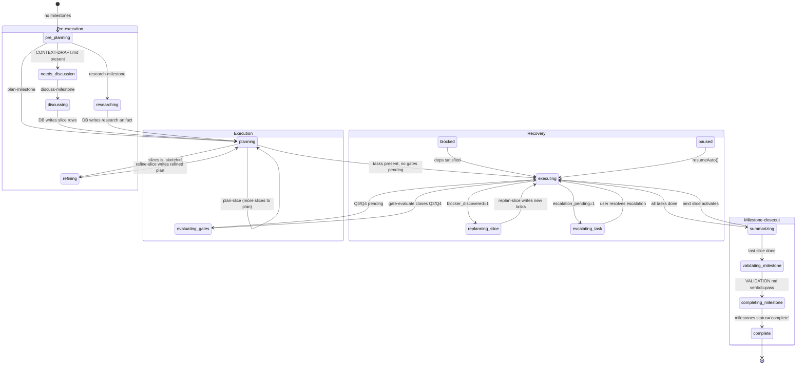
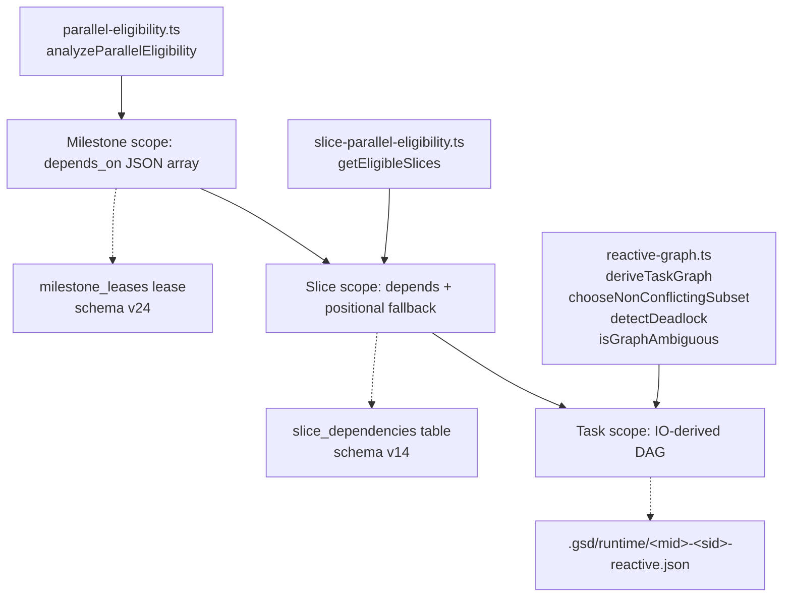
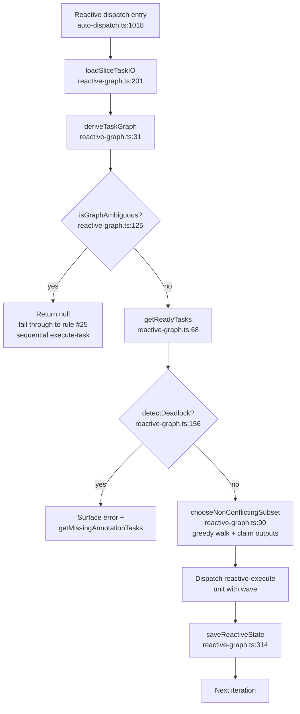

# Workflow Engine — GSD-2 Phase Lifecycle, Dispatch, Waves, Gates

**Phase:** 12 — WORK-03 — M3 (Workflow Engine, kernel)
**Layer:** Workflow Engine (M3) — the decision engine that reads from Phase 11's SQLite tables and produces dispatch actions for Phase 10's facade.

> Sibling spine docs: [`./auto-mode.md`](./auto-mode.md) (Phase 10 — auto-mode facade and adapter contracts), [`./state-persistence.md`](./state-persistence.md) (Phase 11 — single-writer SQLite layer that the kernel reads).
> Forward-refs: Phase 13 (file tracking & atomic commits — `complete-milestone` worktree merge), Phase 14 (quality enforcement — full verification gate machinery walkthrough), Phase 15 (autonomous loop control — `decide*` functions in workflow-kernel.ts and the 5-phase pipeline at the per-iteration scope).

**Source files (workflow kernel, ~10,400 LOC across the auto/ subdirectory minus the Phase-10 facade, plus the state/dispatch substrate). Paths relative to `gsd-2/src/resources/extensions/gsd/`:**

The pure-decision substrate (lives inside `auto/`):
`auto/workflow-kernel.ts` (520 — 14 `decideXxx()` functions, zero side effects) ·
`auto/types.ts` (123 — `MAX_LOOP_ITERATIONS=500`, `MAX_RECOVERY_CHARS=50_000`, `MAX_FINALIZE_TIMEOUTS=3`, `BUDGET_THRESHOLDS`).

The 5-phase pipeline (lives inside `auto/`):
`auto/loop.ts` (985 — single `while (s.active)` loop · custom-engine bypass) ·
`auto/phases.ts` (2298 — `runPreDispatch` → `runDispatch` → `runGuards` → `runUnitPhase` → `runFinalize`) ·
`auto/run-unit.ts` (261 — single-unit execution + `chdir` anchoring) ·
`auto/session.ts` (384 — `AutoSession` mutable state container + `STUB_RECOVERY_THRESHOLD=2`, `NEW_SESSION_TIMEOUT_MS=120_000`) ·
`auto/loop-deps.ts` (296 — typed dependency-injection bundle, ~47 functions).

Pipeline support modules (lives inside `auto/`):
`auto/resolve.ts` (157) · `auto/turn-epoch.ts` (108) · `auto/detect-stuck.ts` (137) · `auto/finalize-timeout.ts` (49) · `auto/infra-errors.ts` (86) · `auto/custom-verify-retry-store.ts` (72).

The `workflow-*` helper modules (lives inside `auto/`, one purpose per file):
`auto/workflow-iteration-completion.ts` (26) ·
`auto/workflow-dispatch-claim.ts` (97) ·
`auto/workflow-dispatch-ledger.ts` (45) ·
`auto/workflow-session-lock.ts` (68) ·
`auto/workflow-memory-pressure.ts` (58) ·
`auto/workflow-unit-dispatch.ts` (89) ·
`auto/workflow-worker-heartbeat.ts` (38) ·
`auto/workflow-sidecar-queue.ts` (46) ·
`auto/workflow-sidecar-iteration.ts` (46) ·
`auto/workflow-journal-reporter.ts` (33) ·
`auto/workflow-phase-reporter.ts` (22) ·
`auto/workflow-turn-reporter.ts` (68) ·
`auto/workflow-custom-engine-iteration.ts` (52) ·
`auto/workflow-custom-engine-dispatch-outcome.ts` (28) ·
`auto/workflow-custom-engine-verify-outcome.ts` (50) ·
`auto/workflow-custom-engine-reconcile.ts` (71) ·
`auto/workflow-custom-engine-reconcile-outcome.ts` (58) ·
`auto/workflow-custom-engine-retry.ts` (90).

State / dispatch substrate (lives outside `auto/`):
`state.ts` (1631 — `deriveStateFromDb` decision tree at lines 654-865) ·
`auto-dispatch.ts` (1475 — `DISPATCH_RULES` ordered table at line 330; `resolveDispatch` walker at line 1428).

Plan dependency / wave parallelism (lives outside `auto/`):
`parallel-eligibility.ts` (242 — milestone-scope) ·
`slice-parallel-eligibility.ts` (73 — slice-scope) ·
`reactive-graph.ts` (337 — task-scope IO-derived DAG).

Verification gate machinery (lives outside `auto/`, deep coverage in plan 03):
`auto-verification.ts` (680) · `verification-gate.ts` (635) · `verification-evidence.ts` (270) · `post-execution-checks.ts` (590) · `gate-registry.ts` (251) · `milestone-validation-gates.ts` (53).

Pluggable workflow engine plugin (forward-ref territory; surface only):
`workflow-engine.ts` (38 — `WorkflowEngine` interface) · `engine-types.ts` (71 — leaf-node types).

**Walkthroughs (Phase 12 siblings — to be authored in plan 03 and beyond):**
None at the time of writing. The god files `phases.ts` (2298), `loop.ts` (985), and `auto-dispatch.ts` (1475) are slated as walkthrough targets in later phases; this document substitutes for them at the spine level.

**ADR sources:** `gsd-2/docs/dev/ADR-004-reactive-task-graph.md` (task DAG inferred from IO, not declared); `gsd-2/docs/dev/ADR-011-sketch-refinement-and-escalation.md` (sketch slices force `refining` phase; escalation pause becomes dispatch rule #1). Cross-link to ADR-014 (deep-module separation, owned by Phase 10) and ADR-015 (runtime invariant modules, owned by Phase 10).

---

> **Honest Corrections (read first — four corrections embedded throughout)**
>
> The CONTEXT.md framing of this phase ("phase lifecycle states pending → discussing → planning → executing → verifying → done") and the casual "the workflow engine is a state machine" reading of the codebase both disagree with the source. Reverse-engineering the kernel reveals four naming/architectural gaps the rest of this document addresses head-on. Phase 10 set the precedent ("`auto.ts` is wiring, not the engine"); Phase 11 set the precedent ("crash recovery is DB-driven, not lock-file driven"). Phase 12 carries on:
>
> **Correction (1) — Phase lifecycle is DERIVED, not stored.** There is no `phases` table in the SQLite database. The 18 `Phase` literals defined at `gsd-2/src/resources/extensions/gsd/types.ts:8-26` are decision-tree outputs from `state.ts:deriveStateFromDb` — a single function that runs on every iteration of the auto-loop, reads from Phase-11 tables (milestones / slices / tasks / quality_gates / replan_history), and returns a `GSDState` whose `phase` field is one of the 18 literals. The CONTEXT.md framing "pending → discussing → planning → executing → verifying → done" is a 6-state simplification of an 18-state decision tree. **There is no explicit transition graph.** "Transitions" are simply changes to the underlying DB rows that re-derivation observes on the next iteration — a `complete-task` tool call writes `tasks.status='done'` to the DB → the next iteration's `deriveStateFromDb` returns a different `Phase` value. **Source:** `state.ts:654-865` (deriveStateFromDb body).
>
> **Correction (2) — Plan dependency tracking has THREE distinct mechanisms at three scopes.** Conflating them is a category error.
>
> | Scope | Mechanism | Evaluator |
> |-------|-----------|-----------|
> | Milestone | `milestones.depends_on` JSON array (schema v7) | `parallel-eligibility.ts:analyzeParallelEligibility(basePath)` (line 96) |
> | Slice | `slices.depends` JSON array (schema v7) **+** `slice_dependencies` table (schema v14) **+** positional fallback | `slice-parallel-eligibility.ts:getEligibleSlices(slices, completedSliceIds)` (line 40) |
> | Task | IO-derived DAG (intersect `inputFiles` with `outputFiles` of other tasks) — **NO `tasks.depends` column** | `reactive-graph.ts:deriveTaskGraph(tasks)` |
>
> The slice scope has THREE composing rules: skip-done, explicit-deps, and positional-fallback (every positionally-earlier slice must be done — preserves backward-compat with roadmaps that pre-date the `depends` field). The task scope is **fully reactive**: edges are inferred from IO **overlap** rather than declared (ADR-004). Readers who assume a single shared dependency model will misread the kernel. **Source:** `parallel-eligibility.ts:96` + `slice-parallel-eligibility.ts:40` + `reactive-graph.ts` (full file).
>
> **Correction (3) — There is NO general cycle detection.** Slice-scope and milestone-scope eligibility evaluators rely on the user not declaring cyclic deps; cycles manifest as a permanent `blocked` phase (no slice or milestone eligible, deps never complete). The task-scope reactive DAG has `detectDeadlock(graph, completed, inFlight)` at `reactive-graph.ts:156` — **the only cycle-related surface in the kernel** — but it cannot distinguish "circular dep" from "missing IO annotation that produces an unsatisfiable input." Both manifest as deadlock. The kb doc must be honest about this rather than describe a topological-sort-with-cycle-check that doesn't exist. **Source:** `reactive-graph.ts:156` (detectDeadlock); `parallel-eligibility.ts` (no cycle detection); `slice-parallel-eligibility.ts` (no cycle detection).
>
> **Correction (4) — The custom-engine path coexists with the dev path.** The kernel has a `shouldUseCustomEnginePath()` branch in `gsd-2/src/resources/extensions/gsd/auto/workflow-kernel.ts` and 6 dedicated `workflow-custom-engine-*.ts` helpers. When a pluggable `WorkflowEngine` plugin (`gsd-2/src/resources/extensions/gsd/workflow-engine.ts:17`) is registered, the loop bypasses `runPreDispatch + runDispatch` and drives state transitions through the engine's own `deriveState`/`resolveDispatch`/`reconcile`/`getDisplayMetadata` methods; both paths still share `runGuards` and `runUnitPhase` for the actual unit execution. Single-engine readers will misread the loop as having only the dev path. Deep coverage of the custom-engine path is deferred — see §13 in plan 03 — but readers must know it exists. **Source:** `auto/workflow-kernel.ts` (search for `shouldUseCustomEnginePath`); `workflow-engine.ts:17`; `auto/loop.ts` (search for `engine` and the custom-engine branch).

---

## Table of Contents

1. Overview — three layers of the kernel
2. Source File Inventory (Tier 1-8)
3. The Phase type and the 18 phase literals
4. `deriveStateFromDb` decision tree — `state.ts:654-865`
5. The DISPATCH_RULES table — `auto-dispatch.ts:330`
6. Plan dependency model — three scopes (milestone, slice, task)
7. — *(plan 03)*

---

## §1 Overview — three layers of the kernel

The workflow engine has **three layers**, all coexisting in `gsd-2/src/resources/extensions/gsd/`. Phase 10 covered the orchestrator facade (`auto/orchestrator.ts` — the 5-method `AutoOrchestrationModule` deep module — and `auto/contracts.ts` — the 6 adapter contracts). Phase 11 covered the SQLite tables that this kernel reads. Phase 12 covers everything else inside `auto/` plus the state/dispatch/verification substrate.

### Layer A — Pure decisions (`auto/workflow-kernel.ts`)

`auto/workflow-kernel.ts` (520 LOC) is a **side-effect-free** module. Every exported function is a deterministic `(input) → output` mapping over plain TypeScript values. It contains 14 `decideXxx()` functions:

- `decideWorkflowLoop({active, iteration, maxIterations, hasCommandContext, sessionLockValid})` — continue / stop with a reason literal
- `decideMemoryPressure({pressured, heapMB, limitMB, pct, iteration})` — emit warning thresholds
- `decideMinRequestInterval(...)` — apply backoff between dispatches
- `decideCooldownRecovery(...)` — translate transient cooldown errors into wait-then-retry
- `decideIterationErrorRecovery(...)` — classify per-iteration errors (infra / model-policy / transient / fatal)
- `decideEngineDispatch(...)` — translate `EngineDispatchInput` to dispatch-or-skip-or-stop
- `decideFinalizeResult(...)` — translate `FinalizeInput` to stop / retry / complete
- `decideEngineReconcile(...)` — translate `EngineReconcileInput` to complete / pause / continue
- `decideCustomEngineVerifyRetry(...)` — manage attempts via `custom-verify-retry-store`
- `decideCustomEngineRecovery(...)` — escalate to stop with `custom-engine-verify-retry-exhausted`
- `decideInfrastructureError(...)` — wrap infra errors with structured turn-error metadata
- `decideModelPolicyBlocked(...)` — handle `ModelPolicyDispatchBlockedError`
- `decideDispatchClaim(...)` — atomic claim outcome → run / skip(reason)
- `decideDispatchNodeKind(...)` — pick UOK execution-graph node kind

Plus the boundary helper `shouldUseCustomEnginePath()` and the formatter `formatDispatchExceptionSummary()`.

**Header banner** (cite `gsd-2/src/resources/extensions/gsd/auto/workflow-kernel.ts:1-2`):

```typescript
// Project/App: GSD-2
// File Purpose: Pure workflow-loop decisions for auto-mode before side-effect adapters run.
```

This is the single biggest architectural win to highlight for the Python reimplementer: **the decision logic is already extracted to a side-effect-free module**. Any Python port can pickle the inputs, replay decisions, and unit-test outcomes without booting SQLite, without touching the file system, and without spawning subagents.

### Layer B — 5-phase pipeline (`auto/loop.ts` → `auto/phases.ts`)

`auto/loop.ts` (985 LOC) drives a single `while (s.active)` loop. Each iteration runs the 5-phase pipeline declared in `auto/phases.ts` (2298 LOC):

```
runPreDispatch → runDispatch → runGuards → runUnitPhase → runFinalize
```

Each phase is an exported async function returning `PhaseResult<T>` (a discriminated union of `{action: "continue"} | {action: "break"; reason} | {action: "next"; data: T}` from `auto/types.ts:74`). The phases are:

- **`runPreDispatch`** (`phases.ts:325`) — derive state, detect sketch slices, capture retry tier, run worktree health check, build prompt, settle delay timing.
- **`runDispatch`** (`phases.ts:980`) — call `resolveDispatch` (the DISPATCH_RULES walker), classify the dispatch action.
- **`runGuards`** (`phases.ts:1252`) — verify dispatch claim atomicity (against the `unit_dispatches` table, schema v24), check for stuck-state (sliding window detector in `auto/detect-stuck.ts`), verify worktree integrity, apply min-request-interval backoff.
- **`runUnitPhase`** (`phases.ts:1478`) — call `runUnit` (`auto/run-unit.ts:1`) which performs `chdir → newSession → resolveAgentEnd promise → return UnitResult`. Owns the session-creation timeout (`NEW_SESSION_TIMEOUT_MS=120_000` from `auto/session.ts:83`).
- **`runFinalize`** (`phases.ts:2103`) — close out the unit-dispatches row (`workflow-dispatch-ledger.ts:settleDispatchCompleted`/`settleDispatchFailed`), invoke post-unit verification (Phase 14 territory), bump consecutive-error/cooldown counters, persist stuck state to `runtime_kv`, emit `iteration-end` journal event.

**Header banner** of `gsd-2/src/resources/extensions/gsd/auto/loop.ts:1-8`:

```typescript
/**
 * auto/loop.ts — Main auto-mode execution loop.
 *
 * Iterates: derive → dispatch → guards → runUnit → finalize → repeat.
 * Exits when s.active becomes false or a terminal condition is reached.
 *
 * Imports from: auto/types, auto/resolve, auto/phases
 */
```

### Layer C — State→dispatch substrate (`state.ts` → `auto-dispatch.ts`)

The substrate produces and consumes the `Phase` literal at the heart of every iteration:

- **`state.ts:deriveStateFromDb(basePath)`** (lines 654-865) reads Phase-11 tables (milestones / slices / tasks / quality_gates / replan_history) and returns a `GSDState` with one of the 18 `Phase` literals. The full decision tree is documented in §4. There is also a legacy markdown-backed `_deriveStateImpl` for unmigrated projects (cite `state.ts:868+`).
- **`auto-dispatch.ts:DISPATCH_RULES`** (line 330) is the ordered ≈25-rule table of `{name: string; match(ctx: DispatchContext): Promise<DispatchAction | null>}`. `resolveDispatch(ctx)` (line 1428) walks the table; first non-null `match()` result wins. The full table is documented in §5.

### Loop constants (`auto/types.ts:21`)

| Constant | Value | Purpose |
|---|---|---|
| `MAX_LOOP_ITERATIONS` | `500` | Hard cap on iterations per `startAuto()` invocation. A milestone with 20 slices × 5 tasks × 3 phases ≈ 300 units; 500 leaves headroom for retries and sidecar work. (`auto/types.ts:21`) |
| `MAX_RECOVERY_CHARS` | `50_000` | Cap on failure/crash context included in recovery prompts (avoids blowing the model's context window with stack-trace spam). (`auto/types.ts:23`) |
| `MAX_FINALIZE_TIMEOUTS` | `3` | Hard-stop after 3 consecutive finalize-phase timeouts. (`auto/types.ts:100`) |
| `BUDGET_THRESHOLDS` | `[100, 90, 80, 75]` (descending) | Notification ladder for token/cost budget. The 100% entry triggers special enforcement (halt/pause/warn); sub-100 entries fire simple notifications. (`auto/types.ts:28-38`) |

### Three layers vs Phase 10 / Phase 11 boundary

| Concern | Owner | Phase |
|---|---|---|
| `AutoOrchestrationModule` 5-method facade | `auto/orchestrator.ts` | Phase 10 |
| 6 adapter contracts (Dispatch / Recovery / Worktree / Health / RuntimePersistence / Notification) | `auto/contracts.ts` | Phase 10 |
| SQLite tables read by `deriveStateFromDb` | `gsd-db.ts` + DDL helpers | Phase 11 |
| Pure decisions | `auto/workflow-kernel.ts` | **Phase 12 (this doc)** |
| 5-phase pipeline body | `auto/loop.ts` + `auto/phases.ts` | **Phase 12 (this doc)** |
| Decision tree producing `Phase` literal | `state.ts:deriveStateFromDb` | **Phase 12 (this doc)** |
| Dispatch rule walker | `auto-dispatch.ts:DISPATCH_RULES` | **Phase 12 (this doc)** |
| Three-scope plan dependency model | `parallel-eligibility.ts` + `slice-parallel-eligibility.ts` + `reactive-graph.ts` | **Phase 12 (this doc)** |
| Verification gate machinery | `auto-verification.ts` + `verification-gate.ts` + `gate-registry.ts` | Phase 12 §7 (plan 03) + Phase 14 deep |
| Atomic commit machinery, worktree merge | `complete-milestone` + worktree teardown | Phase 13 (forward-ref) |
| Per-decision unit tests, autonomous loop control | `decideXxx` reuse, deviation rules | Phase 15 (forward-ref) |

---

## §2 Source File Inventory (Tier 1-8)

All paths relative to `gsd-2/src/resources/extensions/gsd/`. Scope: workflow KERNEL — the `auto/` subdirectory minus the Phase-10 facade, plus the state/dispatch/verification substrate.

### Tier 1 — Pure decision substrate (must walk through in the doc)

| File | Lines | Purpose |
|------|-------|---------|
| `auto/workflow-kernel.ts` | **520** | **The pure decision module.** Zero side effects. 14 `decideXxx()` functions returning discriminated-union actions. Plus `shouldUseCustomEnginePath` and `formatDispatchExceptionSummary`. The boundary between "what to do next" (this file) and "actually do it" (the workflow-* helpers). |
| `auto/types.ts` | 123 | Shared kernel types: `PhaseResult<T>` discriminated union (line 74), `IterationContext` (line 79), `LoopState` (line 92), `IterationData` (line 108), `PreDispatchData` (line 102), `WindowEntry` (line 123), `MAX_LOOP_ITERATIONS=500` (line 21), `MAX_RECOVERY_CHARS=50_000` (line 23), `MAX_FINALIZE_TIMEOUTS=3` (line 100), `BUDGET_THRESHOLDS` (line 28). |
| `auto/contracts.ts` | 87 | Phase-10 territory (already documented in `kb/workflow/auto-mode.md`). Cited here as a back-reference: the kernel runs INSIDE the deep module's `advance()` body. |

### Tier 2 — The auto-loop pipeline (the heart of WORK-03)

| File | Lines | Purpose |
|------|-------|---------|
| `auto/loop.ts` | **985** | The `autoLoop` function. Single `while (s.active)` loop. Dispatches the 5-phase pipeline (PreDispatch → Dispatch → Guards → UnitPhase → Finalize) from `phases.ts`, with custom-engine bypass (uses `shouldUseCustomEnginePath`). Owns: stuck-state persistence (`#3704` runtime_kv key), iteration journaling (one `flowId` per iteration, sequence-numbered events), per-turn UOK observers (`workflow-{phase,turn}-reporter.ts`), worker heartbeat maintenance (`maintainWorkerHeartbeat`), memory-pressure check at every `MEMORY_CHECK_INTERVAL` iterations, `consecutiveErrors` / `consecutiveCooldowns` tracking. Exports `autoLoop`, `runUokKernelLoop`, `runLegacyAutoLoop`. |
| `auto/phases.ts` | **2298** | The 5-phase pipeline. Each phase is an exported async function returning `PhaseResult<T>`: `runPreDispatch` (line 325), `runDispatch` (line 980), `runGuards` (line 1252), `runUnitPhase` (line 1478), `runFinalize` (line 2103). Plus helpers: `closeoutAndStop`, `emitCancelledUnitEnd`, `failClosedOnFinalizeTimeout`, `generateMilestoneReport`, `_resolveReportBasePath`, `_resolveDispatchGuardBasePath`. Manages stuck-detection sliding window, sketch-detection, retry-tier capture, worktree health checks, prompt assembly, settle-delay timing. |
| `auto/run-unit.ts` | 261 | Single-unit execution: `chdir → newSession → resolveAgentEnd promise → return UnitResult`. Owns the session-creation timeout (`NEW_SESSION_TIMEOUT_MS=120_000` from `auto/session.ts:83`) and cwd-anchoring guard (`#1389`, `#4762`). |
| `auto/session.ts` | 384 | `AutoSession` class — encapsulates ~40 mutable auto-mode state fields (replaced module-level `let`s in `auto.ts`). Constants: `STUB_RECOVERY_THRESHOLD=2`, `NEW_SESSION_TIMEOUT_MS=120_000`. Owns: `currentUnit`, `currentMilestoneId`, `unitDispatchCount`, `recentUnits`, `lastRequestTimestamp`, `sidecarQueue`, `currentTraceId`/`currentTurnId`, `pendingVerificationRetry`, `preExecFailures`, `lastUnitAgentEndMessages`. Cleared by `reset()` on every `stopAuto`. |
| `auto/loop-deps.ts` | 297 | The `LoopDeps` typed dependency-injection bundle (47+ injected functions). All side-effects flow through this contract, so the loop body remains testable. Type-only file. |

### Tier 3 — Pipeline support modules (mostly leaf, all pure or nearly-pure)

| File | Lines | Purpose |
|------|-------|---------|
| `auto/resolve.ts` | 157 | One-shot `resolveAgentEnd` promise plumbing. Pending-resolve guard with session-switch generation counter — late settlements from a switched-out session do not resolve the new one. Exports: `resolveAgentEnd`, `resolveAgentEndCancelled`, `bumpAndResolveSynthetic`, `isSessionSwitchInFlight`, plus test helpers. |
| `auto/turn-epoch.ts` | 108 | AsyncLocalStorage-backed turn-generation counter. `bumpTurnGeneration` invalidates a turn; deep call sites check `isStaleWrite()` and drop their journal/audit/closeout writes. Containment for the "synthetic timeout recovery races the original turn's late writes" bug. Exports: `getCurrentTurnGeneration`, `bumpTurnGeneration`, `runWithTurnGeneration`, `isStaleWrite`, `describeTurnEpoch`. |
| `auto/detect-stuck.ts` | 137 | Sliding-window stuck detector. Four rules: (R1) same error repeated, (R2/2b) same unit key 3+ times, (R3) A↔B oscillation, (R4) same `ENOENT` path twice. Coupling with retry budget — if `unit_dispatches.attempt_n < max_attempts` AND `next_run_at > now`, the loop is legitimately waiting on backoff and stuck is suppressed. |
| `auto/finalize-timeout.ts` | 49 | `FINALIZE_PRE_TIMEOUT_MS=60_000` + `FINALIZE_POST_TIMEOUT_MS=60_000` + `withTimeout(promise, ms, label)` — discriminated-union timeout race that always cleans up its timer. |
| `auto/infra-errors.ts` | 86 | `INFRA_ERROR_CODES` set (ENOSPC/ENOMEM/EROFS/EDQUOT/EMFILE/ENFILE/EAGAIN/ECONNREFUSED/ENOTFOUND/ENETUNREACH + SQLITE_CORRUPT). `isInfrastructureError(err)`, `isTransientCooldownError(err)`, `getCooldownRetryAfterMs(err)`. `MAX_COOLDOWN_RETRIES=5`, `COOLDOWN_FALLBACK_WAIT_MS=35_000`. |
| `auto/custom-verify-retry-store.ts` | 72 | Persistent retry counter for custom-engine verification. Backed by `runtime_kv` table (Phase 11 sibling). |

### Tier 4 — The `workflow-*` helper modules (one-purpose-per-file, all pure or nearly-pure)

These are the side-effecting partners of the pure `decideXxx` functions in `workflow-kernel.ts`. Each file has a single named export that performs one DB write or one cross-cutting pipeline step.

| File | Lines | Purpose |
|------|-------|---------|
| `auto/workflow-iteration-completion.ts` | 26 | `completeWorkflowIteration` — bumps `consecutiveErrors`/`consecutiveCooldowns` counters, emits `iteration-end` journal event, persists stuck state. |
| `auto/workflow-dispatch-claim.ts` | 97 | `openDispatchClaim` — atomic claim against `unit_dispatches` table (uses partial unique index `idx_unit_dispatches_active_per_unit` from Phase 11 schema v24). Returns `DispatchClaimOutcome` for `decideDispatchClaim` to translate. |
| `auto/workflow-dispatch-ledger.ts` | 45 | `settleDispatchFailed` / `settleDispatchCompleted` — close out the dispatch row when the unit ends. |
| `auto/workflow-session-lock.ts` | 68 | `validateWorkflowSessionLock` — verify the session lock file matches our worker; surface session-lock-lost to the kernel decision. |
| `auto/workflow-memory-pressure.ts` | 58 | `measureMemoryPressure` — reads `process.memoryUsage()` + heap limit. Per-iteration check throttled by `MEMORY_CHECK_INTERVAL`. |
| `auto/workflow-unit-dispatch.ts` | 89 | Execution-graph unit-dispatch deps factory (UOK feature flag path). |
| `auto/workflow-worker-heartbeat.ts` | 38 | `maintainWorkerHeartbeat` — periodically updates `workers.last_heartbeat_at` + refreshes milestone lease. Pairs with Phase 11's stale-worker detection. |
| `auto/workflow-sidecar-queue.ts` | 46 | `dequeueSidecarItem` — pull the next sidecar (hook/triage/quick-task) work item before the main dispatch resolves. |
| `auto/workflow-sidecar-iteration.ts` | 46 | `buildSidecarIterationData` — construct `IterationData` for a sidecar item. |
| `auto/workflow-journal-reporter.ts` | 33 | Per-iteration journal `flowId`+`seq` emitter. |
| `auto/workflow-phase-reporter.ts` | 22 | UOK observer wrapper that announces phase-pipeline transitions. |
| `auto/workflow-turn-reporter.ts` | 68 | UOK observer wrapper for turn lifecycle (start/finish, with status + failureClass). |
| `auto/workflow-custom-engine-iteration.ts` | 52 | `buildCustomEngineIterationData` — construct `IterationData` for a custom-engine `step`. |
| `auto/workflow-custom-engine-dispatch-outcome.ts` | 28 | Translate `EngineDispatchDecision` → loop control flow (break/continue/dispatch). |
| `auto/workflow-custom-engine-verify-outcome.ts` | 50 | `handleCustomEngineVerifyPause` + `handleCustomEngineVerifyRetryOutcome`. |
| `auto/workflow-custom-engine-reconcile.ts` | 71 | `handleCustomEngineReconcile` — call `engine.reconcile`, get `ReconcileResult`. |
| `auto/workflow-custom-engine-reconcile-outcome.ts` | 58 | Translate `EngineReconcileDecision` → loop control flow. |
| `auto/workflow-custom-engine-retry.ts` | 90 | `handleCustomEngineVerifyRetry` — manage attempts via `custom-verify-retry-store`. |

### Tier 5 — State/dispatch substrate (lives outside `auto/`)

| File | Lines | Purpose |
|------|-------|---------|
| `state.ts` | **1631** | `deriveStateFromDb(basePath)` (line 654) — **the phase decision tree.** Reads milestones/slices/tasks from Phase-11 DB tables and produces a `GSDState` with one of 18 `Phase` literals. Pre-planning → needs-discussion → discussing/researching/planning → refining → evaluating-gates → executing → summarizing → validating-milestone → completing-milestone → complete (or replanning-slice / escalating-task / blocked / paused branches). Owns the active-milestone selection (sequence-aware), slice dependency-resolution within a milestone (`resolveSliceDependencies`, line 711), task-active selection, and gate-pending count integration. Also legacy markdown-backed `_deriveStateImpl` (line 868+) for unmigrated projects. State cache invalidated by `invalidateStateCache()`. |
| `auto-dispatch.ts` | **1475** | `DISPATCH_RULES: DispatchRule[]` (line 330) — **the dispatch rules table.** ≈25 ordered rules; each has a `name` and an async `match(DispatchContext): DispatchAction | null`. First non-null wins. `resolveDispatch(ctx)` (line 1428) walks the table (or delegates to a registered `RuleRegistry`). |

### Tier 6 — Plan dependency / wave parallelism (DAG and eligibility)

| File | Lines | Purpose |
|------|-------|---------|
| `parallel-eligibility.ts` | 242 | **Milestone-scope eligibility.** `analyzeParallelEligibility(basePath)` (line 96) — read each milestone, check `dependsOn` satisfaction (rule 2: all deps in registry must be `complete`), then check **file overlap** (rule 3: `collectTouchedFiles` reads slice→task `files` arrays via `getMilestoneSlices` + `getSliceTasks`; `detectFileOverlaps` reports pairs with shared files as warnings — does NOT disqualify). Returns `ParallelCandidates { eligible, ineligible, fileOverlaps }`. |
| `slice-parallel-eligibility.ts` | 73 | **Slice-scope eligibility.** `getEligibleSlices(slices, completedSliceIds)` (line 40) — three rules: (1) skip done slices, (2) explicit `depends`: all must be in `completedSliceIds`, (3) **positional fallback**: slice with no explicit deps is eligible only if every positionally-earlier slice is done. Backward-compat shim for roadmaps without declared inter-slice deps. |
| `reactive-graph.ts` | 337 | **Task-scope reactive DAG.** `deriveTaskGraph(tasks: TaskIO[])` — IO intersection produces edges. `getReadyTasks(graph, completed, inFlight)`. `chooseNonConflictingSubset(readyIds, graph, maxParallel, inFlightOutputs)` (line 90) — greedy wave selection. `isGraphAmbiguous(graph)` (line 125) — fallback signal. `detectDeadlock(graph, completed, inFlight)` (line 156) — only cycle-related surface. `graphMetrics`, `getMissingAnnotationTasks` for diagnostics. Persistent reactive state at `.gsd/runtime/<mid>-<sid>-reactive.json`. |

### Tier 7 — Verification gate machinery (deep coverage in plan 03 §7-§9 / Phase 14)

| File | Lines | Purpose |
|------|-------|---------|
| `auto-verification.ts` | 680 | `runPostUnitVerification(VerificationContext, pauseAuto)` (line 202) — top-level post-unit gate. Sentinel-return pattern (`continue`/`retry`/`pause`). |
| `verification-gate.ts` | 635 | `runVerificationGate(options)` (line 240) — execute discovered commands sync via `spawnSync` with output truncation. `discoverCommands(options)` (line 49) — first-non-empty-wins: preference → task plan `verify` field → `package.json` scripts → none. |
| `verification-evidence.ts` | 270 | Evidence JSON writer to `.gsd/.../verification.json` + `verification_evidence` table insert (Phase 11 schema v5). |
| `post-execution-checks.ts` | 590 | Higher-level "what to run for this unit type" — wraps `verification-gate.ts` to integrate skill-specific checks and per-unit-type policy. |
| `gate-registry.ts` | 251 | **Quality gate ownership map.** `GATE_REGISTRY` declares Q3-Q8 + MV01-MV04. Each gate has `id`, `scope`, `ownerTurn`, `question`, `guidance`, `promptSection`. Q3/Q4 owned by `gate-evaluate` (slice), Q5-Q7 by `execute-task` (task), Q8 by `complete-slice` (slice — explicitly NOT blocking the `evaluating-gates` phase to avoid auto-loop stall, see `state.ts:780-790`). MV01-MV04 by `validate-milestone` (milestone). |
| `milestone-validation-gates.ts` | 53 | `insertMilestoneValidationGates(...)` — persists MV01-MV04 rows in `quality_gates` after `validate-milestone` writes VALIDATION.md. Bug-fix #2945. |

### Tier 8 — Pluggable workflow engine plugin (forward-ref territory; surface only in plan 03 §13)

| File | Lines | Purpose |
|------|-------|---------|
| `workflow-engine.ts` | 38 | `WorkflowEngine` interface — pluggable engine contract: `engineId`, `deriveState`, `resolveDispatch`, `reconcile`, `getDisplayMetadata`. Lets external engines (custom YAML/GRAPH-driven flows) replace the dev path. |
| `engine-types.ts` | 71 | Leaf-node types (zero GSD imports): `EngineState`, `EngineDispatchAction`, `ReconcileResult`, `CompletedStep`, `DisplayMetadata`. |
| `uok/*` (16 files) | varies | Out-of-Kernel observability + execution-graph + plan-v2 — feature-flagged sidecar to the kernel. The kernel reads `resolveUokFlags(prefs)` and calls into `UokGateRunner`, `UokTurnObserver`, etc. when flagged. Surface only; defer to a future plugin-system phase. |

---

## §3 The Phase type and the 18 phase literals

The complete phase state set is **18 named literals** defined in `gsd-2/src/resources/extensions/gsd/types.ts:8-26`. **There is no DB column storing phase** — the value is derived per iteration by `state.ts:deriveStateFromDb` (see §4).

### §3.1 The verbatim enum

`gsd-2/src/resources/extensions/gsd/types.ts:8-26`:

```typescript
export type Phase =
  | "pre-planning"
  | "needs-discussion"
  | "discussing"
  | "researching"
  | "planning"
  | "refining"
  | "evaluating-gates"
  | "executing"
  | "verifying"
  | "summarizing"
  | "advancing"
  | "validating-milestone"
  | "completing-milestone"
  | "replanning-slice"
  | "escalating-task"
  | "complete"
  | "paused"
  | "blocked";
```

### §3.2 Super-state grouping

The 18 literals fall into five **super-states**. The grouping is editorial (not enforced in source) but it makes the state diagram in §4.3 readable.

| Super-state | Members (count) | Meaning |
|---|---|---|
| **Pre-execution** | `pre-planning`, `needs-discussion`, `discussing`, `researching`, `planning`, `refining` (6) | Project / milestone / slice has not yet started executing tasks. The auto-loop is dispatching planning units (`plan-milestone`, `plan-slice`, `discuss-*`, `research-*`, `refine-slice`). |
| **Execution** | `executing`, `evaluating-gates`, `summarizing` (3) | Tasks are being dispatched, gates are being evaluated, slice summaries are being written. |
| **Milestone-closeout** | `advancing`, `validating-milestone`, `completing-milestone`, `complete` (4) | All slices done; milestone-level validation runs, milestone SUMMARY is written, status flips to `complete`. |
| **Recovery** | `replanning-slice`, `escalating-task`, `blocked`, `paused` (4) | Something is wrong: a task discovered a blocker, an escalation is pending, no slice is eligible, or the user paused the loop. |
| **Transient gate** | `verifying` (1) | Distinct from `evaluating-gates` — `verifying` is the post-execute-task verification window (Phase 14 territory) where commands are being run and evidence is being collected. `evaluating-gates` is the Q3/Q4 wait state. |

### §3.3 Per-phase trigger signals

Each phase value is produced by a specific DB row signal observed by `deriveStateFromDb`. The full decision tree is documented in §4; this table is a pre-flight summary.

| Phase | DB row signal that produces it | Typical next dispatched unit |
|---|---|---|
| `pre-planning` | No milestones in DB; OR active milestone has no slices and no `CONTEXT-DRAFT.md`. | `discuss-milestone` / `research-milestone` / `plan-milestone` |
| `needs-discussion` | Active milestone has no slices but a `CONTEXT-DRAFT.md` artifact exists on disk. | `discuss-milestone` |
| `discussing` | (legacy markdown-backed phase — guided-flow / interview turns; not commonly produced by the DB-backed `deriveStateFromDb`.) | `discuss-*` units |
| `researching` | (legacy markdown-backed phase — research turns in flight.) | `research-*` units |
| `planning` | Active slice has no DB tasks. | `plan-slice` (or `parallel-research-slices` / `research-slice`) |
| `refining` | Active slice has `slices.is_sketch=1` (ADR-011). | `refine-slice` |
| `evaluating-gates` | Pending Q3/Q4 quality_gates rows for the `gate-evaluate` turn. | `gate-evaluate` |
| `executing` | Default — slice has tasks, none of the above conditions hold. | `execute-task` (sequential) or `reactive-execute` (parallel wave) |
| `verifying` | Transient — set during `runPostUnitVerification` while commands are running. | (no dispatch — internal to the unit's verification pipeline) |
| `summarizing` | All tasks in active slice are `done`. | `complete-slice` |
| `advancing` | (Transient — used by some legacy code paths between slices; not a long-lived phase value.) | (next slice's `executing`) |
| `validating-milestone` | All slices done; `handleAllSlicesDone` decides milestone needs validation. | `validate-milestone` |
| `completing-milestone` | Validation passed; milestone-completion artifacts ready. | `complete-milestone` |
| `replanning-slice` | A task has `blocker_discovered=1` AND no replan history; OR a triage replan trigger fired. | `replan-slice` |
| `escalating-task` | A task has `escalation_pending=1`. | (stop, info-level — pause for escalation review; rule #1 in DISPATCH_RULES) |
| `complete` | Milestone status is `complete` in the DB. | (stop) |
| `paused` | User invoked `pauseAuto()`; or a verification gate paused the loop. | (no dispatch — wait for resume) |
| `blocked` | No eligible slice (deps unsatisfied, lock missing, etc.). | (no dispatch — wait for unblock) |

### §3.4 What the source means by "verifying" vs "evaluating-gates"

These are two distinct phases that readers commonly conflate. They are different surfaces:

- **`verifying`** — the post-execute-task verification window. Happens INSIDE the `runFinalize` pipeline phase, NOT as a top-level dispatchable unit. `runPostUnitVerification` (`auto-verification.ts:202`) discovers and runs commands (`verification-gate.ts:runVerificationGate`), captures runtime errors, runs `npm audit`, writes evidence. The `verifying` phase is the indicator that this is happening; it is transient.
- **`evaluating-gates`** — the Q3/Q4 quality-gate wait state. Triggered when `getPendingGateCountForTurn(milestoneId, sliceId, "gate-evaluate")` > 0. The DISPATCH_RULES table (rule #22 in §5) routes this to a `gate-evaluate` unit, which runs the agent through the Q3/Q4 questions and writes the gate close-out rows.

The Q8 gate is also slice-scope, but it is owned by `complete-slice` — NOT `gate-evaluate` — so it does NOT trigger `evaluating-gates`. This is the `state.ts:780-790` edge case documented in §4.2: only gates with `ownerTurn='gate-evaluate'` block the executing→evaluating-gates transition. Otherwise the loop would stall waiting for a gate that the current turn never evaluates.

---

## §4 `deriveStateFromDb` decision tree — `state.ts:654-865`

`state.ts:deriveStateFromDb(basePath)` is a single function that produces the current `GSDState`. It runs on every iteration of the auto-loop, reads from Phase-11 tables, and returns a `GSDState` whose `phase` field is one of the 18 `Phase` literals. **There is no explicit transition graph.** "Transitions" are simply changes to the underlying DB rows that re-derivation observes on the next iteration: a `complete-task` tool call writes `tasks.status='done'` → the next iteration's `deriveStateFromDb` returns a different `Phase` value.

The function's signature (`gsd-2/src/resources/extensions/gsd/state.ts:654`):

```typescript
export async function deriveStateFromDb(basePath: string): Promise<GSDState> {
```

### §4.1 — The 13-step decision tree

The body of `deriveStateFromDb` walks a deterministic decision tree. Each step is a guard that, if matched, returns immediately with a particular `Phase` literal. Lines below are exact source citations from the file at the analysis snapshot.

1. **No milestones in DB** → `pre-planning` with `nextAction: "No milestones found. Run /gsd to create one."` — `state.ts:664-672`. Pre-flight: pulls `getAllMilestones()` (`state.ts:657`) and the `GSD_PARALLEL_WORKER` `MILESTONE_LOCK` filter (`state.ts:659-662`).

2. **No active milestone selected** (none `in_progress` and no rule picks one) → delegated to `handleNoActiveMilestone(registry, requirements, milestoneProgress)` — `state.ts:684-686`. Returns a registry-only state (no phase change; surfaces guidance in `nextAction`).

3. **Active milestone has no slices** → `pre-planning` (or `needs-discussion` if a `CONTEXT-DRAFT.md` exists on disk for the milestone) — `state.ts:688-699`. The `activeMilestoneHasDraft` flag is computed by `buildRegistryAndFindActive` upstream.

4. **All slices done** → handed off to `handleAllSlicesDone(basePath, activeMilestone, registry, requirements, milestoneProgress, sliceProgress)` — `state.ts:707-709` (call site) + `state.ts:561` (definition). This sub-routine decides between `summarizing` / `validating-milestone` / `completing-milestone` / `complete` based on artifact presence (slice SUMMARY files, milestone VALIDATION.md / SUMMARY) + `quality_gates` rows + `assessments` row.

5. **No eligible slice** (deps unsatisfied, lock missing, etc.) → `blocked` — `state.ts:711-731`. This branch handles two sub-cases: (a) `GSD_SLICE_LOCK` env was set but the locked slice id is not in the active milestone's slice set (lines 714-723); (b) no slice is eligible per `resolveSliceDependencies` (lines 724-730). Both surface a `blocked` phase with explanatory `blockers` and `nextAction`.

6. **Active slice is sketch** (`slices.is_sketch=1`, ADR-011) → `refining` — `state.ts:737-745`. Comment at lines 734-736 makes the authoritativeness explicit: "DB slice metadata is authoritative for sketch refinement. PLAN.md and preference flags are projections/configuration and are deliberately not used to infer whether the slice itself is a sketch."

7. **All tasks in active slice done** → `summarizing` — `state.ts:756-764`. Branch fires when `activeTaskRow` (line 754, found via `tasks.find(t => !isStatusDone(t.status))`) is null AND `tasks.length > 0`. The `nextAction` reads `All tasks done in <SID>. Write slice summary and complete slice.`

8. **Slice has no DB tasks** → `planning` — `state.ts:766-774`. Branch fires when `activeTaskRow` is null AND `tasks.length === 0`. The `nextAction` reads `Slice <SID> has no DB tasks. Plan slice tasks before execution.`

9. **Pending Q3/Q4 gates for `gate-evaluate` turn** > 0 → `evaluating-gates` — `state.ts:778-798`. The query is `getPendingGateCountForTurn(activeMilestone.id, activeSlice.id, "gate-evaluate")` (line 785-789). The comment block at lines 778-784 documents the critical edge case (see §4.2 below). The `nextAction` reads `Evaluate <N> quality gate(s) for <SID> before execution.`

10. **A task has `blocker_discovered=1`** AND no replan history → `replanning-slice` — `state.ts:800-814`. The `detectBlockers(basePath, mid, sid, tasks)` call (line 800) returns the blocker task id; if `getReplanHistory(mid, sid)` is empty, derive `replanning-slice`. The `blockers` array carries `Task <TID> discovered a blocker requiring slice replan`.

11. **A task has `escalation_pending=1`** → `escalating-task` — `state.ts:826-837`. The `detectPendingEscalation(tasks, basePath)` call (line 826) returns the escalating task id. The comment at lines 816-825 documents the design decision: "ADR-011 Phase 2: pause-on-escalation takes precedence over dispatching the next task. `awaiting_review` tasks (continueWithDefault=true) are NOT surfaced here — they let the loop continue. ... any escalation_pending row already persisted in the DB must be honored even if the user later toggles the flag off."

12. **Triage replan trigger detected** → `replanning-slice` — `state.ts:839-855`. The `checkReplanTrigger(basePath, mid, sid)` call (line 840) returns true when a triage agent has flagged the slice for replan; if `replanHistory.length === 0`, derive `replanning-slice`. The `blockers` array carries `Triage replan trigger detected — slice replan required`.

13. **Default** → `executing` — `state.ts:857-863`. Returned when none of steps 1-12 match. `nextAction: "Execute <TID>: <task title> in slice <SID>."`

### §4.2 — Edge cases & gotchas

The function carries five edge-case surfaces that are easy to miss on first read:

- **`GSD_PARALLEL_WORKER` env constraints** (`state.ts:659-662` for milestone-lock + `state.ts:714-715` for slice-lock). When parallel-worker mode is on, `MILESTONE_LOCK` and `SLICE_LOCK` env vars constrain which milestone/slice the deriveState picks. If the locked slice is not found in the active milestone's slice set, the function returns `blocked` with explanatory blocker text rather than crashing or silently advancing past it. This is the only place the kernel reads multi-worker coordination env vars.

- **Ghost milestones** — surfaced by `parallel-eligibility.ts` rule 0 (no registry entry); does NOT throw, just produces an explicit `ineligible` reason. Within `deriveStateFromDb`, these manifest as `activeMilestone === null` after `buildRegistryAndFindActive` — falling through to step 2 (`handleNoActiveMilestone`).

- **Sketch slices** (`slices.is_sketch=1`, ADR-011) — force the `refining` phase BEFORE `executing`, regardless of task status. Critical for the ADR-011 sketch-refinement workflow: a slice plan that opens with placeholder tasks must be refined into concrete tasks before execution begins. The DB row is authoritative — preference flags or PLAN.md tags are explicitly ignored (`state.ts:734-736` comment).

- **State cache invalidation** (`invalidateStateCache()` symbol). The `deriveStateFromDb` result is cached per-iteration; the cache is invalidated by callers via `invalidateStateCache()` after they perform DB writes that would change derived state. (Search `state.ts` for `_stateCache` for the exact line range — typical invalidation sites are `tools/*.ts` after `INSERT`/`UPDATE` calls into Phase-11 helpers.)

- **#4179 orphan SUMMARY guard** — covered upstream of `deriveStateFromDb` proper. A markdown SUMMARY file from a crashed `complete-milestone` turn (or a partial worktree merge) must NOT flip derived state to `complete`; the DB row is authoritative. The legacy `isMilestoneComplete(roadmap)` markdown helper (`state.ts:393-411`) carries an explicit comment warning callers off this trap.

- **Q8 vs `evaluating-gates` (`state.ts:780-790` comment block)** — only Q3/Q4 gates (those with `ownerTurn='gate-evaluate'`) trigger the `evaluating-gates` phase. Q8 is also `scope:"slice"` but its `ownerTurn` is `complete-slice`, so it does NOT block the `executing → evaluating-gates` transition. If the kernel naively counted all slice-scope pending gates, the loop would stall forever waiting for a gate that the current turn never evaluates. `getPendingGateCountForTurn(milestoneId, sliceId, "gate-evaluate")` is the correct query.

### §4.3 — Phase-transition diagram

The diagram below uses Phase literals as nodes and the dispatch unit (or DB-row write) that triggers each transition as edge labels. Super-state grouping mirrors §3.2.



The diagram is editorial — many transitions are possible from any phase under recovery rules — but it captures the high-level path through the state space. The full edge-by-edge mapping of "DB row write → phase change" is implicit in §4.1's decision tree.

---

## §5 The DISPATCH_RULES table — `auto-dispatch.ts:330`

`gsd-2/src/resources/extensions/gsd/auto-dispatch.ts:330` declares `DISPATCH_RULES: DispatchRule[]` — an ordered array of ≈25 rules. Each rule has the shape:

```typescript
interface DispatchRule {
  name: string;
  match(ctx: DispatchContext): Promise<DispatchAction | null>;
}
```

`resolveDispatch(ctx)` (`gsd-2/src/resources/extensions/gsd/auto-dispatch.ts:1428`) walks the table in order; the **first non-null `match()` result wins**. A registered `RuleRegistry` may override the inline-loop fallback (`gsd-2/src/resources/extensions/gsd/auto-dispatch.ts:1451` — the legacy `for` loop is preserved for backward-compat tests that import the module directly).

### §5.1 The 29 rules in evaluation order

The full ordered table (verbatim from RESEARCH.md "Phase → DispatchAction"). Rules are evaluated top-to-bottom; first match wins. Several rules ARE phase-agnostic (override gates) — those fire regardless of which `Phase` literal is current.

| # | Rule name | Triggering phase | Dispatched unit |
|---|-----------|------------------|-----------------|
| 1 | escalating-task → pause-for-escalation | escalating-task | (stop, info-level) |
| 2 | rewrite-docs (override gate) | any (override-driven) | rewrite-docs |
| 3 | execution-entry phase (no context) → discuss-milestone | executing/summarizing/validating-milestone/completing-milestone | discuss-milestone |
| 4 | summarizing → complete-slice | summarizing | complete-slice |
| 5 | run-uat (post-completion) | (uat trigger) | run-uat |
| 6 | uat-verdict-gate (non-PASS blocks progression) | (any after run-uat) | (stop or dispatch back) |
| 7 | reassess-roadmap (post-completion) | (post-milestone) | reassess-roadmap |
| 8 | needs-discussion → discuss-milestone | needs-discussion | discuss-milestone |
| 9-13 | deep: pre-planning chain | pre-planning (deep mode) | workflow-preferences / discuss-project / discuss-requirements / research-decision / research-project |
| 14 | pre-planning (no context) → discuss-milestone | pre-planning | discuss-milestone |
| 15 | pre-planning (no research) → research-milestone | pre-planning | research-milestone |
| 16 | pre-planning (has research) → plan-milestone | pre-planning | plan-milestone |
| 17 | planning (require_slice_discussion) → pause | planning | (stop, info-level) |
| 18 | planning (multiple slices need research) → parallel-research-slices | planning | parallel-research-slices |
| 19 | planning (no research, not S01) → research-slice | planning | research-slice |
| 20 | refining → refine-slice | refining | refine-slice |
| 21 | planning → plan-slice | planning | plan-slice |
| 22 | evaluating-gates → gate-evaluate | evaluating-gates | gate-evaluate |
| 23 | replanning-slice → replan-slice | replanning-slice | replan-slice |
| 24 | executing → reactive-execute (parallel dispatch) | executing | reactive-execute |
| 25 | executing → execute-task (recover missing task plan → plan-slice) | executing | plan-slice |
| 26 | executing → execute-task | executing | execute-task |
| 27 | validating-milestone → validate-milestone | validating-milestone | validate-milestone |
| 28 | completing-milestone → complete-milestone | completing-milestone | complete-milestone |
| 29 | complete → stop | complete | (stop, info-level) |

### §5.2 First-non-null wins semantics

Rule order matters. `resolveDispatch` short-circuits on the first match: if rule #1 (`escalating-task → pause-for-escalation`) returns a non-null `DispatchAction`, rules #2-29 never run. This is why escalation pause sits at the top of the table — see §5.3.

The `ctx: DispatchContext` argument carries the current `Phase` literal, the active milestone / slice / task, prefs, the session context window, and the model registry. Each rule's `match()` predicate inspects what it cares about (typically just `ctx.state.phase`) and returns either a `DispatchAction` (`{kind: "dispatch", unitType, unitId, ...}` or `{kind: "stop", reason, level}` or `{kind: "skip", reason}`) or `null` to delegate to the next rule.

The `DispatchAction` discriminated union is consumed by the `runDispatch` pipeline phase (`phases.ts:980`), which translates it into the actual dispatch — calling `runUnit` for `dispatch`, breaking the loop for `stop`, or continuing the loop for `skip`.

### §5.3 Why `escalating-task` is rule #1 (ADR-011 Phase 2)

ADR-011 Phase 2 introduced pause-on-escalation as a precedence rule. Once a task has `escalation_pending=1` in the DB, the loop MUST surface a stop-for-review BEFORE any other dispatch — otherwise the user's prior escalation context is lost when the loop advances past it. Rule #1 enforces this by checking `state.phase === "escalating-task"` first, returning `{kind: "stop", level: "info"}` to break the loop with `pause-for-escalation` as the turn-error code. The user runs `/gsd escalate show <TID>` and `/gsd escalate resolve <TID> <choice>` to clear the row, and the next loop iteration sees a different phase.

### §5.4 The `rewrite-docs` override gate (rule #2)

Rule #2 (`rewrite-docs`) is a **phase-agnostic override gate**. It fires on ANY phase when an override condition is set — typically a user-requested doc rewrite injected via the command queue (`command_queue` table, schema v24). When a rewrite-docs override is present, the rule returns `{kind: "dispatch", unitType: "rewrite-docs", ...}` regardless of the current phase. After the rewrite-docs unit completes, the next iteration sees the override cleared and falls through to the regular phase-driven rules.

This is the only rule that breaks the "phase determines dispatch" invariant. Readers who assume dispatch is purely a function of phase will misread it. (Cite `auto-dispatch.ts` near the rule's line range — search the file for the literal `"rewrite-docs"` string to find the exact rule body.)

### §5.5 The "execution-entry phase (no context) → discuss-milestone" recovery rule (#3)

Rule #3 fires when the current phase is `executing` / `summarizing` / `validating-milestone` / `completing-milestone` — i.e. an execution-tier phase — but the milestone has no `CONTEXT.md` artifact persisted. This is the "execution-entry recovery" path (#4671): a defensive recovery to ensure milestone discussion exists before dispatch. Without this rule, the loop would advance into execution against a milestone that was never discussed, producing low-quality task dispatches.

The rule returns `{kind: "dispatch", unitType: "discuss-milestone", ...}` to back-fill the missing context. After `discuss-milestone` runs, the milestone has a CONTEXT.md, and on the next iteration, rules #14-16 (pre-planning chain) take over normally.

### §5.6 The reactive-execute dispatch rule (#24) — `auto-dispatch.ts:1018`

Rule #24 is the entry point for **wave parallelism** at the task scope (covered in depth in §6.3 and §8 of plan 03). The rule fires when `state.phase === "executing"` AND the slice's task DAG is non-ambiguous AND the user has not explicitly disabled reactive execution.

From `gsd-2/src/resources/extensions/gsd/auto-dispatch.ts:1018-1045`:

```typescript
{
  name: "executing → reactive-execute (parallel dispatch)",
  match: async ({ state, mid, midTitle, basePath, prefs, ... }) => {
    if (state.phase !== "executing" || !state.activeTask) return null;
    if (!state.activeSlice) return null; // fall through

    // Reactive dispatch is on by default when there are enough ready tasks to
    // benefit from parallelism. Users opt out explicitly via
    // `reactive_execution.enabled: false`. The downstream safety checks
    // (graph ambiguity, ready-task count, conflict-free selection) still gate
    // every actual dispatch, so the worst-case "default-on" outcome is the
    // same fall-through to sequential execution as before.
    const reactiveConfig = prefs?.reactive_execution;
    if (reactiveConfig?.enabled === false) return null;

    const sid = state.activeSlice.id;
    const maxParallel = reactiveConfig?.max_parallel ?? 2;
    // Default-on safety threshold: only activate reactive dispatch when at
    // least N tasks are ready. Users who explicitly enabled reactive_execution
    // keep the legacy threshold of 2. Default-on installs require >=3.
    const minReadyTasksForReactive = reactiveConfig?.enabled === true ? 2 : 3;

    // Dry-run mode: max_parallel=1 means graph is derived and logged but
    // execution remains sequential
    if (maxParallel <= 1) return null;
    ...
```

If the rule returns null (any guard fails), control falls through to rules #25 and #26, which do the sequential `execute-task` dispatch. This is the documented "always-safe fallback" — reactive-execute can be disabled or de-activated by graph ambiguity, and the user gets sequential execution with no surprises.

### §5.7 Lifecycle event sequence per iteration (`auto/loop.ts:autoLoop`)

One iteration of `autoLoop` performs the following 9-step sequence (cite `auto/loop.ts` body — search the file for the named functions to find their line ranges, since line numbers shift with refactors):

1. `decideWorkflowLoop({active, iteration, maxIterations, hasCommandContext, sessionLockValid})` → `{action: "continue"} | {action: "stop", reason}`. If stop: break the loop with the structured reason.
2. `maintainWorkerHeartbeat(deps)` — Phase 11 `workers.last_heartbeat_at` write + milestone-lease refresh.
3. Emit `iteration-start` journal event with a new `flowId` (per-iteration UUID) + per-iteration sequence counter (`auto/types.ts:88` — `nextSeq()`).
4. `decideMemoryPressure({pressured, heapMB, limitMB, pct, iteration})` — only every `MEMORY_CHECK_INTERVAL` iterations. Emits warning thresholds via the cmux logger.
5. `dequeueSidecarItem(deps)` — sidecar queue check (hook / triage / quick-task) BEFORE the main `deriveState` call. Sidecars short-circuit the regular dispatch.
6. `validateWorkflowSessionLock(deps)` → continue / stop. If the session lock file no longer matches our worker, stop with `session-lock-lost`.
7. **Custom-engine path branch** if `shouldUseCustomEnginePath()` else dev path. (Custom-engine deep coverage deferred to plan 03 §13.)
8. **Dev path**: `runPreDispatch` → `runDispatch` → `runGuards` → `runUnitPhase` (which calls `runUnit` from `auto/run-unit.ts` to perform `chdir → newSession → resolveAgentEnd`) → `runFinalize`. Each phase is an exported async function from `auto/phases.ts`; each returns a `PhaseResult<T>` discriminated union.
9. `completeWorkflowIteration(deps, result)` — bumps `consecutiveErrors`/`consecutiveCooldowns`, persists stuck state to `runtime_kv`, emits `iteration-end` journal event. Loop back to step 1.

The 5-phase pipeline (`runPreDispatch` → ... → `runFinalize`) is detailed at the per-phase scope in plan 03 §7 (Phase 14 territory for verification gates, Phase 15 territory for autonomous loop control).

---

## §6 Plan dependency model — three scopes (milestone, slice, task)

Three independent dependency mechanisms operate at three scopes (see §0 Correction 2). Conflating them is a category error. Each scope has its own data source, its own evaluator function, and its own composition rules. This section documents all three plus how they interact within the auto-loop's "ONE active milestone × ONE active slice × ONE active task" default.

### §6.1 — Milestone scope: explicit `depends_on` (JSON array)

**Source of truth:** `milestones.depends_on` column added in schema v7 (Phase 11; see `kb/workflow/state-persistence.md` §5/§6 for the migration history). Stored as a JSON array of milestone IDs.

**Evaluator:** `analyzeParallelEligibility(basePath)` at `gsd-2/src/resources/extensions/gsd/parallel-eligibility.ts:96`.

**Algorithm — 4 rules (in evaluation order within the per-milestone loop):**

1. **Rule 0:** Ghost milestones (no registry entry) ineligible — does NOT throw, just produces an explicit `ineligible` reason. Cite `parallel-eligibility.ts` (search the file for "Ghost" or "registry entry" to find the rule body).

2. **Rule 1 — Skip parked / complete:** If `milestone.status === "parked"` OR `milestone.status === "complete"`, skip — neither eligible nor ineligible (they don't appear in dispatch-eligible candidates at all).

3. **Rule 2 (deps):** All entries in `dependsOn` must have `status === "complete"` in the registry-map built upstream. If any dep is incomplete, the milestone is ineligible with reason `Blocked by incomplete dependencies: <list>`.

4. **Rule 3 (file overlap, advisory):** `collectTouchedFiles(basePath, mid)` reads the milestone's slice→task `files` arrays via `getMilestoneSlices(mid)` + `getSliceTasks(mid, sid)`. `detectFileOverlaps(eligible, touchedFilesByMid)` compares each pair of currently-eligible milestones; pairs with intersecting `files` sets are reported in the returned `fileOverlaps` array. **Overlap is a WARNING, not a disqualifier** — the eligible milestone's `reason` field is annotated with `... WARNING: has file overlap with another eligible milestone.` The user is shown both milestones and decides whether to dispatch them concurrently.

**Returns:** `ParallelCandidates { eligible: MilestoneCandidate[]; ineligible: MilestoneCandidate[]; fileOverlaps: OverlapPair[] }`.

**No cycle detection at this scope.** The function does not topologically sort, does not detect cycles, and does not warn on cyclic deps. A cycle manifests as all milestones with cyclic `depends_on` being permanently ineligible (their deps never reach `complete`). Within `deriveStateFromDb`, this surfaces as `phase=blocked` with `blockers: ["No slice eligible — check dependency ordering"]` once all non-cyclic milestones have completed and only the cyclic cluster remains.

### §6.2 — Slice scope: `slices.depends` + `slice_dependencies` table

**Source of truth (planning):** `slices.depends` column added in schema v7. Stored as a JSON array of slice IDs.

**Source of truth (DAG materialization):** `slice_dependencies` table added in schema v14 — primary key `(milestone_id, slice_id, depends_on_slice_id)` with index `idx_slice_deps_target` for reverse-lookup ("who depends on slice X?"). Cross-link to `kb/workflow/state-persistence.md` §10 for the table definition and the v14 migration step.

**Evaluator:** `getEligibleSlices(slices, completedSliceIds)` at `gsd-2/src/resources/extensions/gsd/slice-parallel-eligibility.ts:40`. **Pure function** — no DB reads. The caller provides both `slices` (an array of slice rows) and `completedSliceIds` (a `Set<string>`); the function returns the subset that is eligible to dispatch.

**Algorithm — 3 rules (in evaluation order):**

1. **Rule 1 — Skip done:** If `completedSliceIds.has(slice.id)` is true, skip — the slice has no work to dispatch.

2. **Rule 2 (explicit deps):** If `slice.depends.length > 0`, ALL entries in `slice.depends` must be in `completedSliceIds`. If any are missing, the slice is ineligible.

3. **Rule 3 (positional fallback):** If `slice.depends.length === 0`, the slice is eligible only when **every positionally-earlier** slice (lower `sequence` number) is in `completedSliceIds`. This preserves backward-compat with roadmaps that pre-date the `depends` field — a slice with no declared deps is implicitly assumed to depend on all earlier slices.

Within `state.ts:resolveSliceDependencies(activeMilestoneSlices)` (called from `deriveStateFromDb` at line 711), the **first eligible slice in sequence order** becomes the active slice for the milestone. If no slice is eligible (all remaining slices are still blocked by incomplete deps), the function returns `null` and `deriveStateFromDb` falls through to the `phase=blocked` branch (step 5 in §4.1).

**No cycle detection at this scope either.** A cycle in `slices.depends` produces the same outcome as the milestone scope — all cyclic slices remain ineligible forever, surfacing as `phase=blocked` once all non-cyclic slices complete.

### §6.3 — Task scope: reactive IO-derived DAG

**Source of truth:** `tasks.files` column (file list, written by `plan-task` units) **plus** parsed `Inputs:` / `Outputs:` IO sections from each task plan markdown file. The IO sections are parsed at runtime by `loadSliceTaskIO(basePath, mid, sid)` (Phase 16 territory — task-plan markdown shape).

**Evaluator:** `gsd-2/src/resources/extensions/gsd/reactive-graph.ts` (337 LOC). Pure functions, except `loadSliceTaskIO` which reads files from disk.

**Critical design choice (ADR-004):** Task DAG edges are **inferred from IO overlap**, NOT declared. There is **NO `tasks.depends` column** in the schema. Task plans declare their inputs and outputs; the kernel derives the DAG. This is the deliberate trade-off: task authors don't have to think about ordering, but they MUST be honest about IO. Sparse IO annotations produce graph ambiguity (see `isGraphAmbiguous` below), which fall-back to sequential dispatch.

**Algorithm — 6 functions:**

1. **`deriveTaskGraph(tasks: TaskIO[])`** at `gsd-2/src/resources/extensions/gsd/reactive-graph.ts:31` — for each output file in any task, record the producer task ID into an `outputToProducer: Map<string, taskId>`. Then for each task, intersect its `inputFiles` with `outputToProducer` to derive the `dependsOn: Set<taskId>` set. Self-references (a task whose `inputFiles` overlap with its own `outputFiles`) are excluded.

2. **`getReadyTasks(graph, completed, inFlight)`** — task is ready when all members of its `dependsOn` set are in `completed` AND the task itself is not in `completed` or `inFlight`.

3. **`chooseNonConflictingSubset(readyIds, graph, maxParallel, inFlightOutputs)`** at `gsd-2/src/resources/extensions/gsd/reactive-graph.ts:90` — **greedy wave selection**. Walk `readyIds` in order; for each candidate, check whether its `outputFiles` overlap with any output already claimed (by `inFlightOutputs` or by tasks already added to the wave). If no overlap, add it. Stop when `wave.length === maxParallel` or no more candidates fit. Two tasks with overlapping outputs cannot be in the same wave (correctness: they would race each other on file writes).

4. **`isGraphAmbiguous(graph)`** at `gsd-2/src/resources/extensions/gsd/reactive-graph.ts:125` — true if any incomplete task has 0 `inputFiles` AND 0 `outputFiles`. An unannotated task could depend on anything; reactive dispatch falls back to sequential when this is true. The dispatch rule #24 `executing → reactive-execute` checks this and returns `null` (falls through to sequential rules #25-26) when the graph is ambiguous.

5. **`getMissingAnnotationTasks(graph)`** at `reactive-graph.ts:139` — diagnostic helper that returns the list of tasks without IO annotations. Used by user-facing tooling to surface "annotate these tasks to enable parallelism."

6. **`detectDeadlock(graph, completed, inFlight)`** at `gsd-2/src/resources/extensions/gsd/reactive-graph.ts:156` — true when nothing is in flight, the ready set is empty, but incomplete tasks still remain. **This is the only cycle-related surface in the kernel.** It cannot distinguish "circular IO dep" from "missing annotation that produces an unsatisfiable input" — both manifest as the same deadlock condition. The honest framing in §0 Correction 3 applies here.

**State persistence:** `loadReactiveState` / `saveReactiveState` / `clearReactiveState` write the active reactive-execution state to `.gsd/runtime/<mid>-<sid>-reactive.json`. The file carries `{sliceId, completed, dispatched}` and survives process restarts; if a worker crashes mid-wave, the next worker reads this file and resumes from the same point. (Cross-link to Phase 11's `runtime_kv` table for the broader runtime-key/value pattern; reactive state uses a JSON file rather than a `runtime_kv` row because the data shape is wave-bounded and not heavily queried.)

**`graphMetrics(graph)` at `reactive-graph.ts:189`** — a diagnostic helper that returns aggregate graph statistics: `{totalNodes, withIncomingEdges, withOutgoingEdges, ambiguous: isGraphAmbiguous(graph), ...}`. Used by debug tooling and the dry-run preview rendered when `prefs.reactive_execution.max_parallel === 1` (the dispatch rule #24 still derives the graph and logs metrics, but executes sequentially).

### §6.4 — How the three scopes compose

The auto-loop sees **ONE active milestone** (chosen by `state.ts` from the registry — sequence-aware ordering filtered by `GSD_MILESTONE_LOCK` env if set), which has **ONE active slice** (chosen by `resolveSliceDependencies` — first eligible slice in sequence order), which dispatches **ONE active task** (chosen by `tasks.find(t => !isStatusDone(t.status))` — first non-done task in row order).

That is the default single-worker single-active-unit dispatch path: `deriveStateFromDb` returns one `activeMilestone` + one `activeSlice` + one `activeTask`, and DISPATCH_RULES #25-26 dispatch a single `execute-task` unit.

**EXCEPT** when DISPATCH_RULES rule #24 (`executing → reactive-execute (parallel dispatch)`, `auto-dispatch.ts:1018`) fires, at which point the reactive graph builds a **wave of multiple tasks** dispatched simultaneously to multiple subagents. This is the only intra-loop parallelism in the default single-worker mode.

The other two scopes' parallelism (multiple slices in one milestone running in parallel; multiple milestones running in parallel) is **only used by the parallel-worker mode** — `GSD_PARALLEL_WORKER=1` env + `GSD_MILESTONE_LOCK=<mid>` / `GSD_SLICE_LOCK=<sid>` env constraints in `state.ts:659-662` and `state.ts:714-715`. Each parallel worker is a SEPARATE process with its own auto-loop; the workers coordinate through Phase 11's `workers` + `unit_dispatches` + `milestone_leases` + `cancellation_requests` + `command_queue` tables (schema v24), but each worker's auto-loop still sees a single-active-unit dispatch shape.

Within a single auto-mode session (no `GSD_PARALLEL_WORKER`), the dispatch shape is always one milestone × one slice × one task, with optional task-scope wave parallelism inside the active slice.



The diagram captures the three-scope nesting and the data sources / evaluators for each scope. Solid arrows are "scope contains scope" relationships; dotted arrows are "scope persists data to" relationships.

### §6.5 — Composition with parallel-worker mode (Phase 11 sibling)

When `GSD_PARALLEL_WORKER=1` is set, multiple workers can claim slices/tasks across separate processes. Each worker is started by an external orchestrator (e.g. a CI job or a manual invocation) with its own `MILESTONE_LOCK` and/or `SLICE_LOCK` env vars; the kernel then constrains `deriveStateFromDb` to only consider the locked milestone (`state.ts:659-662`) and only the locked slice (`state.ts:714-715`). Coordination across workers is the responsibility of Phase 11's coordination tables:

- `workers.status='active'` + `last_heartbeat_at` — stale-worker detection (Phase 11 `crash-recovery.ts`)
- `milestone_leases` (fencing-token lease per milestone) — only one worker holds the lease at a time; refreshed by `maintainWorkerHeartbeat`
- `unit_dispatches` (`idx_unit_dispatches_active_per_unit` partial-unique index) — guarantees one active claim per unit; the `openDispatchClaim` helper uses this for atomic claim
- `cancellation_requests` and `command_queue` — cross-worker signaling (the user's `gsd cancel` command writes a row that any worker can pick up)

This is **coordination, not wave-building**. Each worker still runs its own auto-loop independently, sees its own derived state, and uses the wave-builder above (`reactive-graph.ts`) to choose its next task within the slice it has claimed. The three-scope dependency model applies to each worker individually; the cross-worker coordination is layered on top via the SQL tables.

For the full coordination mechanics, cross-link to `kb/workflow/state-persistence.md` §10 (coordination tables) and Phase 11's plan 03 §10/§11.

## §7 Wave parallelism algorithm

Wave parallelism is **task-scope only** in the default single-worker auto-loop. Multi-worker parallelism uses Phase 11's `workers` + `unit_dispatches` + `milestone_leases` tables to coordinate, but the wave-grouping algorithm itself lives in `gsd-2/src/resources/extensions/gsd/reactive-graph.ts:1-337`.

There is one and only one wave-builder: it runs inside the `executing → reactive-execute (parallel dispatch)` rule (#24 in the §5 DISPATCH_RULES table at `gsd-2/src/resources/extensions/gsd/auto-dispatch.ts:1018`). When `phase=executing` AND `isGraphAmbiguous=false`, that rule fires and dispatches a wave. When `isGraphAmbiguous=true` it falls through (returns `null`) and the next sequential rule (#25 single `execute-task`) takes over. There is no "milestone wave" or "slice wave" — those scopes use eligibility predicates instead, surfaced as `phase=blocked` rather than as parallel batches.

### §7.1 — Single-worker reactive wave (the only wave-builder in scope)

The pipeline that the rule #24 fires:

1. **Load IO graph.** `loadSliceTaskIO(basePath, mid, sid)` at `gsd-2/src/resources/extensions/gsd/reactive-graph.ts:201` reads the slice plan and per-task plan markdown, parses each task's `Inputs:` and `Outputs:` sections via `parseTaskPlanIO`. The result is a `TaskIO[]` array carrying `{id, title, inputFiles, outputFiles, done}` for every task in the slice.

2. **Derive graph.** `deriveTaskGraph(tasks)` at `gsd-2/src/resources/extensions/gsd/reactive-graph.ts:31` performs the IO intersection. For every output file written by a task, it builds an inverted index `outputFile → producerTaskId`. Then for every task it walks its `inputFiles` and, for each input file, looks up the producers — those producers become the task's `dependsOn` set. Self-references are excluded. The output is `DerivedTaskNode[]` carrying the original IO plus a sorted `dependsOn: string[]` array.

3. **Compute readiness.** `getReadyTasks(graph, completed, inFlight)` at `gsd-2/src/resources/extensions/gsd/reactive-graph.ts:68` returns task IDs whose `dependsOn` set is entirely contained in `completed` AND that are themselves NOT in `completed` or `inFlight`. The `done` flag on the node is also checked — a task that the graph already marks done is not ready. The order of returned IDs is the same as the order of `graph` (which is the input task order from `loadSliceTaskIO`).

4. **Select wave.** `chooseNonConflictingSubset(readyIds, graph, maxParallel, inFlightOutputs)` at `gsd-2/src/resources/extensions/gsd/reactive-graph.ts:90` is the **greedy wave selection**. Walk `readyIds` in order; for each candidate, intersect its `outputFiles` with the running `claimed` set (initialized from `inFlightOutputs` and grown as tasks are added). If no overlap, add the task and union its outputs into `claimed`. Stop when `selected.length === maxParallel` or `readyIds` is exhausted. Two tasks with overlapping `outputFiles` cannot be in the same wave — they would race each other on file writes. The greedy walk's correctness comes from the fact that `claimed` only ever grows, so once a file is claimed it cannot be re-claimed. (Quote: `for (const id of readyIds) { if (selected.length >= maxParallel) break; … if (conflicts) continue; for (const f of node.outputFiles) claimed.add(f); selected.push(id); }`.)

5. **Dispatch wave.** The `reactive-execute` unit type is dispatched by `auto-dispatch.ts` rule #24, carrying the selected task IDs as the wave to a sub-agent (Phase 7/9 territory; this doc surfaces but does not deep-cover). The sub-agent dispatches each task as its own `execute-task` invocation (potentially against multiple subagents in parallel inside the sub-agent's context).

6. **Persist progress.** `saveReactiveState(basePath, mid, sid, {sliceId, completed, dispatched})` at `gsd-2/src/resources/extensions/gsd/reactive-graph.ts:314` writes `.gsd/runtime/<mid>-<sid>-reactive.json`. The file shape is `{sliceId: string, completed: string[], dispatched: string[]}`. If a worker crashes mid-wave, the next worker reads this file with `loadReactiveState` (`reactive-graph.ts:303`) and resumes from the same point. On slice completion, `clearReactiveState` (`reactive-graph.ts:326`) removes the file.

7. **Detect deadlock.** `detectDeadlock(graph, completed, inFlight)` at `gsd-2/src/resources/extensions/gsd/reactive-graph.ts:156` returns true when `inFlight.size === 0` AND the ready set is empty AND incomplete tasks remain. The slice has either circular IO deps (cycle) or unsatisfiable inputs (a task reads a file no other task writes). The kernel cannot distinguish the two cases — both manifest as the same deadlock condition. The dispatcher logs the missing-annotation tasks via `getMissingAnnotationTasks` (`reactive-graph.ts:139`) and falls back to sequential dispatch or surfaces an error to the operator.

The `maxParallel` and `inFlightOutputs` parameters are runtime values carried by the dispatching subsystem. `maxParallel` is sourced from `prefs.reactive_execution.max_parallel` (operator preference) and may be capped by the available subagent slot count (Phase 9 mapping). `inFlightOutputs` is the union of `outputFiles` for every task currently dispatched but not yet complete — preventing a wave from including a task whose output is being written by an in-flight task from a previous wave.



The diagram captures the wave selection chain. Solid arrows are control flow; the two branches at `isGraphAmbiguous` and `detectDeadlock` are the two ways the wave-builder can decline to produce a wave (fallback to sequential, or surface a hard error).

### §7.2 — Multi-worker dispatch coordination (Phase 11 sibling)

When `GSD_PARALLEL_WORKER` env is set, multiple workers can claim slices/tasks across separate processes. The kernel relies on Phase 11's coordination tables (schema v24):

- `workers.status='active'` + `last_heartbeat_at` for stale-worker detection
- `milestone_leases` (fencing-token lease per milestone, refreshed by `maintainWorkerHeartbeat`)
- `unit_dispatches` with `idx_unit_dispatches_active_per_unit` partial-unique index — guarantees one active claim per unit; cross-link to `kb/workflow/state-persistence.md` §10
- `cancellation_requests` and `command_queue` for cross-worker signaling

This is **coordination, not wave-building.** Each worker still runs its own auto-loop independently against its own derived state. The wave-builder above (§7.1) is what each worker uses to choose its next task within a slice it has claimed. The three-scope dependency model (§6) applies to each worker individually.

### §7.3 — File-overlap-as-warning (milestone scope)

`gsd-2/src/resources/extensions/gsd/parallel-eligibility.ts:detectFileOverlaps` returns pairs of milestones whose slice-task `files` arrays intersect. This is **advisory** — it does not disqualify, only annotates. The user makes the call about whether to run two file-overlapping milestones in parallel. (Cross-link to §6.1.)

### §7.4 — Why there is no general topological sort

The kernel performs no explicit topological sort or cycle break. Slice and milestone scopes use eligibility predicates that surface "no eligible work" as `phase=blocked`. Task scope uses `detectDeadlock` which conflates circular deps with missing IO annotations. Both are documented in §0 Correction 3.

The decision to skip topological sort is intentional. Topological sort assumes the dependency graph is the entire problem; in this kernel, the dependency graph is one input among many (gates, leases, blocked workers, the operator's schedule choices). A graph algorithm that picked an "optimal" topological order would override operator intent (e.g. "always finish milestone A first"), so the kernel uses ordered eligibility predicates and the operator's roadmap sequence as the primary ordering signal.

## §8 Verification gate flow

GSD-2 has TWO verification surfaces. Surface 1 (per-task post-unit verification) runs after every `execute-task` unit and decides whether to continue, retry, or pause. Surface 2 (quality gates Q3-Q8 + MV01-MV04) is owned by the gate registry and persisted in the `quality_gates` table. They serve different purposes — Surface 1 is "did this task's code work?", Surface 2 is "did this task answer the quality questions the framework requires?"

### §8.1 — Surface 1: post-unit verification (per-task)

`runPostUnitVerification(VerificationContext, pauseAuto)` at `gsd-2/src/resources/extensions/gsd/auto-verification.ts:202` is called from `phases.ts:runFinalize → postUnitPostVerification` after every `execute-task` unit. It returns `"continue" | "retry" | "pause"` and is the final gate before the loop advances.

Pipeline:

1. **Discover commands.** `discoverCommands(prefs, taskPlan, packageJson)` at `gsd-2/src/resources/extensions/gsd/verification-gate.ts:49` runs first-non-empty-wins resolution: operator prefs → task plan `verify` field → `package.json` scripts (`typecheck` / `lint` / `test`) → `none`. The first source with a non-empty value wins; subsequent sources are ignored. This means a task plan that declares a custom `verify:` field overrides the project-wide package.json scripts for that task.

2. **Execute commands.** `runVerificationGate(commands, ctx)` at `gsd-2/src/resources/extensions/gsd/verification-gate.ts:240` runs each command via `spawnSync` with a `DEFAULT_COMMAND_TIMEOUT_MS` ceiling and a 10 KB cap on stdout/stderr per command. Results are aggregated as `passed = checks.every(c => c.exitCode === 0)`. Exit code mapping is direct: 0 = pass, anything else = fail.

3. **Capture runtime errors.** `captureRuntimeErrors(ctx)` at `gsd-2/src/resources/extensions/gsd/verification-gate.ts` reads bg-shell stderr buffers and browser console-error captures. Each error is classified by severity (`crash` / `error` / `warning`) and tagged with a `blocking` flag. A blocking error is one that would cause the task's claimed deliverable to fail at runtime.

4. **Dependency audit.** `runDependencyAudit(ctx)` runs `npm audit` (when relevant) and returns `AuditWarning[]` with severity classes (`info` / `low` / `moderate` / `high` / `critical`). High and critical warnings escalate to the verification verdict; lower severities annotate but do not block.

5. **Infra-failure detection.** `isInfraVerificationFailure(stderr)` at `gsd-2/src/resources/extensions/gsd/auto-verification.ts` regexes the stderr for known infrastructure error tokens (`ENOENT` / `ENOTFOUND` / `ETIMEDOUT` / etc., overlapping with `INFRA_ERROR_CODES` from §11). The distinction matters: "verification crashed because the environment broke" is different from "verification ran and found problems." The first is recoverable by retry-after-cooldown; the second is not.

6. **Write evidence.** `verification-evidence.ts:writeVerificationJSON` writes `.gsd/<milestone>/<slice>/<task>/verification.json` and inserts a `verification_evidence` row (Phase 11 schema v5; see `kb/workflow/state-persistence.md` §5 for the dedup index). The evidence is consumed downstream by complete-slice and validate-milestone for retrospective auditing.

7. **Decision.**
   - All checks passed AND no blocking runtime errors AND no high/critical audit → `continue`
   - Auto-fix retries available (`s.pendingVerificationRetry < retryBudget`) AND failure is fixable → `retry` (sets `s.pendingVerificationRetry` and re-dispatches the task with the failure context attached)
   - Otherwise → `pause` (caller invokes `pauseAuto` with the failure context for operator review)

8. **UOK gate-runner integration.** When `uokFlags.gates` is true, every gate execution is also persisted via `UokGateRunner` for forensics. UOK is feature-flagged and out of scope for the dev-engine deep walkthrough; mentioned here so the reimplementer knows the integration point exists.

```mermaid
flowchart TD
  call[runFinalize → postUnitPostVerification<br/>auto-verification.ts:202]
  discover[discoverCommands<br/>verification-gate.ts:49<br/>prefs → task verify → package.json]
  exec[runVerificationGate<br/>verification-gate.ts:240<br/>spawnSync per command]
  runtime[captureRuntimeErrors<br/>bg-shell + browser console]
  audit[runDependencyAudit<br/>npm audit severity classes]
  infra{isInfraVerificationFailure?<br/>auto-verification.ts}
  evidence[writeVerificationJSON +<br/>verification_evidence row<br/>schema v5]
  decision{All passed +<br/>no blocking +<br/>no high/critical?}
  cont[return 'continue']
  retry[return 'retry'<br/>s.pendingVerificationRetry++]
  pause[return 'pause'<br/>invoke pauseAuto]

  call --> discover --> exec --> runtime --> audit --> infra
  infra -- crashed on infra --> retry
  infra -- ran clean --> evidence --> decision
  decision -- yes --> cont
  decision -- no, retries left --> retry
  decision -- no, exhausted --> pause
```

### §8.2 — Surface 2: quality gates (Q3-Q8 + MV01-MV04)

`gsd-2/src/resources/extensions/gsd/gate-registry.ts:45-168` declares the canonical question set in `GATE_REGISTRY`. Gates are persisted in `quality_gates` (Phase 11 schema v12, repaired in v22; cross-link to `kb/workflow/state-persistence.md` §6 V22 self-repair). Each gate has an `ownerTurn` responsible for evaluating and closing it.

Gate-ownership table (verbatim from `gate-registry.ts:45-168`):

| Gate | Scope | Owner Turn | Question |
|------|-------|------------|----------|
| Q3 | slice | gate-evaluate | How can this be exploited? (Abuse Surface) |
| Q4 | slice | gate-evaluate | Which existing requirements does this slice touch? (Broken Promises) |
| Q5 | task | execute-task | What breaks when dependencies fail? (Failure Modes) |
| Q6 | task | execute-task | What is the 10x load breakpoint? (Load Profile) |
| Q7 | task | execute-task | What negative tests protect this task? (Negative Tests) |
| Q8 | slice | complete-slice | How will ops know this slice is healthy or broken? (Operational Readiness) |
| MV01 | milestone | validate-milestone | Is every success criterion in the milestone roadmap satisfied? |
| MV02 | milestone | validate-milestone | Does every slice have a SUMMARY.md and a passing assessment? |
| MV03 | milestone | validate-milestone | Do the slices integrate end-to-end? |
| MV04 | milestone | validate-milestone | Are all touched requirements covered and still coherent? |

The registry is exhaustiveness-checked via `as const satisfies Record<GateId, GateDefinition>` at `gate-registry.ts:168` — adding a new GateId without a registry entry is a compile error. Helper functions `getGatesForTurn`, `getGateIdsForTurn`, `getGateDefinition`, `getOwnerTurn`, `assertGateCoverage` (`gate-registry.ts:176-251`) are the API surface for prompt builders, dispatch rules, state derivation, and tool handlers.

**Critical edge case (state.ts:780-790):** the `evaluating-gates` phase is triggered ONLY by gates owned by `gate-evaluate` (Q3, Q4). Q8 is also slice-scope but is owned by `complete-slice`, so it does NOT block the executing→evaluating-gates transition — otherwise the loop would stall waiting for a gate that the current turn never evaluates. The correct query is `getPendingGateCountForTurn(milestoneId, sliceId, "gate-evaluate")`. This is documented in §0 Correction (the Q8 ownership confusion) and §4.

**MV gates (#2945 fix):** `insertMilestoneValidationGates(milestoneId, sliceId, verdict, evaluatedAt)` at `gsd-2/src/resources/extensions/gsd/milestone-validation-gates.ts:28` persists MV01-MV04 rows after `validate-milestone` writes `VALIDATION.md`. Before this fix, the `validate-milestone` turn wrote `VALIDATION.md` and an `assessments` row but never inserted the structured `quality_gates` rows — so a downstream tool that only inspected `quality_gates` would see no milestone validation history. The function reads its gate IDs from `getGatesForTurn("validate-milestone")` so adding/removing MV gates in the registry automatically flows through.

### §8.3 — How failures block progression

| Failure surface | Where detected | Effect |
|-----------------|----------------|--------|
| Verification command exit ≠ 0 | `verification-gate.ts:240` (Surface 1 step 2) | `passed=false` → retry or pause |
| Blocking runtime error captured | `verification-gate.ts:captureRuntimeErrors` (Surface 1 step 3) | Verdict downgraded → retry or pause |
| Dependency audit high/critical | `verification-gate.ts:runDependencyAudit` (Surface 1 step 4) | Verdict downgraded → pause |
| `validate-milestone` returns `needs-remediation` (#4094) | `auto-verification.ts:runValidateMilestonePostCheck` | Fail-closed: turn fails, loop pauses |
| Pending Q3/Q4 gates for slice | `state.ts:780-790` deriveStateFromDb | Phase forced to `evaluating-gates` until gates close |
| Auto-retry budget exhausted | `s.pendingVerificationRetry >= retryBudget` (Surface 1 step 7) | Fall through to `pause` |
| Custom-engine retry budget exhausted | `decideCustomEngineVerifyRetry` + `decideCustomEngineRecovery` (workflow-kernel.ts:412-461) | Stop with `custom-engine-verify-retry-exhausted` |
| Infrastructure failure | `isInfraVerificationFailure` (Surface 1 step 5) | Coalesced with infra-error path; may cooldown-and-retry |

The 8 rows above are the complete set of "things that block progression after a task runs." Anything not in this table either (a) does not block (it's a warning), or (b) blocks pre-dispatch (a session-lock failure, a model policy block) rather than post-execution.

## §9 Milestone boundaries

### §9.1 — Milestone completion criteria

A milestone is "complete" when its DB row says so: `milestones.status='complete'` AND `completed_at IS NOT NULL`. The legacy markdown helper `state.ts:isMilestoneComplete(roadmap)` is no longer authoritative — see `gsd-2/src/resources/extensions/gsd/state.ts:393-411` which warns that orphan SUMMARY files (from crashed `complete-milestone` turns or partial merges) **must NOT** flip derived state to complete (#4179). The DB row is the source of truth.

The path from `executing` to `complete`:

```
executing                       — task-by-task task execution
  └─> summarizing               — complete-slice (writes slice SUMMARY)
        └─> evaluating-gates    — gate-evaluate (only if Q3/Q4 pending)
              └─> executing     — (next slice's tasks, after gates pass)
... after all slices done ...
  └─> validating-milestone      — validate-milestone (writes VALIDATION.md, inserts MV gates)
        └─> completing-milestone — complete-milestone (writes SUMMARY, sets status=complete)
              └─> complete      — (stop)
```

The `executing → complete` transition is therefore not direct. It traverses summarizing → (optional evaluating-gates) → validating-milestone → completing-milestone, with each phase doing one piece of finalization work. The §4 deriveStateFromDb decision tree decides which of these phases the loop is in based on the underlying tables; §5 DISPATCH_RULES decides which unit type runs in each phase (`complete-slice`, `gate-evaluate`, `validate-milestone`, `complete-milestone`).

### §9.2 — Milestone grouping (the "milestone boundary" concept in CONTEXT.md)

GSD-2 does not have a "milestone group" or "epic" concept above a single milestone. The milestone IS the boundary unit. `milestones.depends_on` (a JSON array column) and `parallel-eligibility.ts:96` (the analyzer that reads it) provide the only milestone-grouping signal. The roadmap declares milestones as a flat ordered list (`milestones.sequence`, schema v23). Cross-link to §0 Correction (no aggregation tier above milestones).

There is therefore no "phase 5 of milestone group 3" concept in the kernel. A "phase" is one of 18 literal values (§3) that describes the loop's current activity within a single milestone. There is no enclosing structure that groups multiple milestones into a larger boundary.

### §9.3 — What `complete-milestone` actually does (forward-ref)

The `complete-milestone` unit is dispatched by rule #28 from §5 (`completing-milestone → complete-milestone`). When the unit runs, it:

1. Aggregates slice SUMMARY files into a milestone SUMMARY at `.gsd/milestones/<id>/SUMMARY.md`.
2. Sets `milestones.status='complete'` AND `milestones.completed_at = <now>`.
3. Writes `milestone_commit_attributions` rows (Phase 11 schema v26; cross-link to `kb/workflow/state-persistence.md` §5).
4. Triggers `mergeMilestoneToMain` (worktree → main branch merge if the milestone owned an isolation worktree).
5. Triggers `teardownAutoWorktree` if the milestone owned a worktree.

Forward-ref to Phase 13 (file tracking & commits) for deep coverage of the merge/teardown step. The kernel surfaces it via DISPATCH_RULES rule #28 and stops once `milestones.status='complete'` is observed by the next deriveStateFromDb iteration.

> **Forward link → Phase 13 (File Tracking & Commits)**
>
> The post-unit commit pipeline (`runTurnGitAction` + `autoCommit`), the STATE.md projection rebuild (`rebuildState` at `gsd-2/src/resources/extensions/gsd/doctor.ts:148`), the per-milestone integration-branch metadata (`writeIntegrationBranch` at `gsd-2/src/resources/extensions/gsd/git-service.ts:344`), and the per-turn forensics writes (`turn_git_transactions` schema v15, two-stage publish/record protocol) that fire when phase transitions complete are all owned by Phase 13. **Phase 12 decides WHEN** (the kernel's `Phase` literal transitions from `executing → summarizing → validating-milestone → completing-milestone → complete`); **Phase 13 decides WHAT-ON-DISK** (which files get written, what gets committed, how STATE.md updates, which manifests survive across context resets).
>
> See: [`kb/workflow/file-tracking.md`](./file-tracking.md) §5 (per-turn commit pipeline — 13-step sequenceDiagram) + §10 (STATE.md auto-update mechanism — 8 trigger sites + 30s throttle gap) + §13 (per-turn forensics — `turn_git_transactions` two-stage protocol) + §14 (per-milestone integration branch metadata + branch-pattern refusals).

## §10 Stuck detection + recovery

The auto-loop runs up to `MAX_LOOP_ITERATIONS = 500` iterations (`gsd-2/src/resources/extensions/gsd/auto/types.ts:21`). Within that envelope, four mechanisms detect "we're not making progress" and either signal stuck or attempt recovery.

### §10.1 — Sliding-window stuck detector

`detectStuck(window)` at `gsd-2/src/resources/extensions/gsd/auto/detect-stuck.ts:58` analyzes a sliding window of `WindowEntry` objects (`{key: string; error?: string}`, defined in `auto/types.ts:123`). Four rules:

- **Rule 1: Same error repeated.** If `last.error && prev.error && last.error === prev.error`, immediately stuck. Same error twice in a row means the retry/recovery did nothing.
- **Rule 2: Same unit key 3+ consecutive times.** If the last 3 entries share the same `key` AND `retryBudgetSuppresses(key)` is false (no scheduled backoff in `unit_dispatches`), stuck.
- **Rule 2b: Same unit key 3+ times anywhere in the window.** Same as Rule 2 but allows non-consecutive occurrences. Same retry-budget suppression.
- **Rule 3: Oscillation A↔B.** If the last 4 entries are `A, B, A, B` with `A !== B`, stuck (the loop is bouncing between two phases without converging).
- **Rule 4: Same ENOENT path twice.** If two entries within the window share the same missing file path (extracted via `ENOENT_PATH_RE`), stuck (#3575 — missing files do not self-heal between retries; retrying wastes budget).

The retry-budget coupling (`retryBudgetSuppresses`, `detect-stuck.ts:31`) is the only nuance. If the latest unit's `unit_dispatches.attempt_n < max_attempts` AND `next_run_at > now`, the loop is legitimately waiting on its own backoff timer, so the stuck verdict for Rule 2/2b is suppressed. (Rules 1, 3, 4 are not coupled to retry budget — they signal stuck regardless.)

### §10.2 — Stuck-state persistence

When stuck is detected, the loop stops and writes a stuck record to `runtime_kv` keyed under `#3704` (cross-link to `kb/workflow/state-persistence.md` §11). The record carries the stuck reason, the window at the point of detection, and any logger summary from `summarizeLogs()`. The next auto-mode invocation reads this record on startup so the operator sees the prior stuck reason rather than a fresh start.

### §10.3 — Synthetic recovery via turn-epoch

`gsd-2/src/resources/extensions/gsd/auto/turn-epoch.ts:1-108` implements an `AsyncLocalStorage`-backed turn-generation counter. The problem it solves: when `auto-timeout-recovery` synthetically resolves a timed-out unit so the loop can advance, the original LLM turn keeps running in the background. Its subsequent writes (journal events, audit events, closeout side-effects) then race the replacement unit's writes. DB-level guards block double state transitions, but journal/audit/closeout writes still fire with fresh identifiers and pollute forensics.

Containment:
- `bumpTurnGeneration(reason)` at `auto/turn-epoch.ts:45` increments the module-level counter every time a turn is decided done (timeout recovery, explicit cancellation).
- `runWithTurnGeneration(capturedGen, fn)` at `auto/turn-epoch.ts:56` captures the current generation into AsyncLocalStorage when a turn starts.
- `isStaleWrite(component)` at `auto/turn-epoch.ts:69` checks the captured-vs-current generation; if captured < current, the turn has been superseded and the write site drops its journal/audit/closeout write.

The escape hatch: if AsyncLocalStorage context is lost across an exotic async boundary (native worker callback, e.g.), `isStaleWrite` returns `false` and the write proceeds normally. That is a safe default — the regression is "noisier forensics under rare boundary loss," not duplicated state (which DB guards still block).

### §10.4 — Iteration error recovery

`decideIterationErrorRecovery(input)` at `gsd-2/src/resources/extensions/gsd/auto/workflow-kernel.ts:379` decides what to do when an iteration throws. Three branches:

- `consecutiveErrors >= 3` → `stop` with `failed` turn status. Loop gives up.
- `consecutiveErrors === 2` → `invalidate-and-retry`. Caches are flushed before re-dispatch.
- Otherwise → `retry`. Same prompt, retry budget continues.

The 3-strike rule is the hard ceiling. Combined with the stuck detector (which fires on Rule 1 after 2 consecutive same errors), the loop gives up on persistent failure within 2-3 iterations.

## §11 Memory pressure + cooldown + infra errors

### §11.1 — Memory pressure thresholds

`BUDGET_THRESHOLDS` at `gsd-2/src/resources/extensions/gsd/auto/types.ts:28-38` is a descending array of `{pct, label, notifyLevel, cmuxLevel}` entries: 100 / 90 / 80 / 75. Sub-100 entries fire informational notifications. The 100% entry triggers special enforcement logic (halt/pause/warn). `decideMemoryPressure(input)` at `auto/workflow-kernel.ts:321` is the pure decision: if `pressured=true`, stop with a `memory-pressure` turn error and a structured stop message including the operator-recovery hint ("Resume with /gsd auto to continue from where you left off.").

### §11.2 — INFRA_ERROR_CODES

`INFRA_ERROR_CODES` at `gsd-2/src/resources/extensions/gsd/auto/infra-errors.ts:14-25` is a frozen `ReadonlySet<string>` of errno codes:

- `ENOSPC` — disk full
- `ENOMEM` — out of memory
- `EROFS` — read-only file system
- `EDQUOT` — disk quota exceeded
- `EMFILE` / `ENFILE` — too many open files (process / system)
- `EAGAIN` — resource temporarily unavailable
- `ECONNREFUSED` — connection refused (offline / local server down)
- `ENOTFOUND` — DNS lookup failed (offline / no network)
- `ENETUNREACH` — network unreachable

`isInfrastructureError(err)` at `auto/infra-errors.ts:35` checks `err.code` (Node system error) and falls back to scanning `err.message`. Returns the matched code or `null`. **Special case:** the message `"database disk image is malformed"` returns `"SQLITE_CORRUPT"` (#2823), which routes through the Phase 11 VACUUM-recovery guard (cross-link to `kb/workflow/state-persistence.md` §7).

### §11.3 — Cooldown retry policy

`COOLDOWN_FALLBACK_WAIT_MS = 35_000` and `MAX_COOLDOWN_RETRIES = 5` at `auto/infra-errors.ts:55-58`. `decideCooldownRecovery(input)` at `auto/workflow-kernel.ts:355`:

- If `consecutiveCooldowns > maxCooldownRetries` → `stop` with notify message
- Otherwise → `wait` with `waitMs = retryAfterMs ?? fallbackWaitMs` (clamped to 60 s ceiling, +500 ms padding)

The `Retry-After` header extraction is performed by `isTransientCooldownError` and `getCooldownRetryAfterMs` (`auto/infra-errors.ts:68-86`), which prefer the structured `CredentialCooldownError` (`code: AUTH_COOLDOWN`) thrown by `sdk.ts` and fall back to message regex for cross-process error propagation.

### §11.4 — Finalize timeout race

`gsd-2/src/resources/extensions/gsd/auto/finalize-timeout.ts:1-49` defines `FINALIZE_PRE_TIMEOUT_MS = 60_000`, `FINALIZE_POST_TIMEOUT_MS = 60_000`, and `withTimeout(promise, ms, label)`. The latter is a discriminated-union timeout race: it returns `{value: T; timedOut: false} | {value: undefined; timedOut: true}` rather than rejecting on timeout. Callers handle the timeout as a recoverable condition rather than an exception. The timer is always cleaned up in the `finally` block — both the success and timeout paths return through the cleanup.

`MAX_FINALIZE_TIMEOUTS = 3` (`auto/types.ts:100`) is the consecutive-timeout ceiling. After 3 consecutive finalize timeouts, the auto-loop hard-stops to prevent an infinite finalize-retry loop.

## §12 The pluggable WorkflowEngine contract (forward-ref)

The kernel's "dev path" is the default engine. A pluggable contract allows external engines (custom YAML/GRAPH-driven flows) to replace the dev path entirely.

`gsd-2/src/resources/extensions/gsd/workflow-engine.ts:17-38` defines the `WorkflowEngine` interface. Four methods plus an identity:

- `engineId: string` — unique identifier (e.g. `"dev"`, `"custom"`)
- `deriveState(basePath): Promise<EngineState>` — derive the current engine state from disk
- `resolveDispatch(state, context): Promise<EngineDispatchAction>` — decide what the loop does next
- `reconcile(state, completedStep): Promise<ReconcileResult>` — reconcile state after a step
- `getDisplayMetadata(state): DisplayMetadata` — UI-facing metadata for progress display

`gsd-2/src/resources/extensions/gsd/engine-types.ts:1-71` defines the leaf types with **zero GSD imports**: `EngineState`, `StepContract`, `DisplayMetadata`, `EngineDispatchAction` (discriminated union: `dispatch` / `stop` / `skip`), `ReconcileResult`, `RecoveryAction`, `CompletedStep`. The leaf-node policy means a custom engine package can depend on `engine-types.ts` without pulling the entire GSD module graph.

**Dev engine vs custom engine.** `shouldUseCustomEnginePath(input)` at `gsd-2/src/resources/extensions/gsd/auto/workflow-kernel.ts:420` selects the path. Returns `true` when:
- `activeEngineId != null`
- `activeEngineId !== "dev"`
- `!hasSidecarItem` (no UOK sidecar work in flight)
- `!engineBypass` (no operator override forcing dev)

Custom engine bypasses `runPreDispatch + runDispatch` entirely; both paths share `runGuards + runUnitPhase + runFinalize`. The shared `runFinalize` is what gives custom engines access to the post-unit verification pipeline (§8.1) without reimplementing it.

**Custom engine retry exhaustion** is its own decision: `decideCustomEngineVerifyRetry(input)` at `auto/workflow-kernel.ts:412` returns `recover` when `attempts > maxRetries`, else `retry`. `decideCustomEngineRecovery(input)` at `auto/workflow-kernel.ts:432` then maps recovery outcomes to `pause` / `stop` with the `custom-engine-verify-retry-exhausted` turn error.

Surface only here. Defer deep coverage to a future plugin-system phase. The `uok/*` (16 files) sidecar is feature-flagged and out of scope for the Phase 12 deep walkthrough — surfaced via the `hasSidecarItem` flag in `CustomEnginePathInput`.

## §13 Validation tests reference

The auto-loop and workflow kernel are exercised by an integration-test suite in `gsd-2/src/resources/extensions/gsd/tests/`. These are read-only references for the Python reimplementer:

- `gsd-2/src/resources/extensions/gsd/tests/state-machine-full-walkthrough.test.ts` — end-to-end traversal of all 18 phase literals via `deriveStateFromDb`
- `gsd-2/src/resources/extensions/gsd/tests/state-machine-edge-cases.test.ts` — Q3/Q4 vs Q8 ownership; orphan SUMMARY files; #4179 derived-state guard
- `gsd-2/src/resources/extensions/gsd/tests/deep-project-auto-loop.test.ts` — full auto-loop integration against a generated milestone
- `gsd-2/src/resources/extensions/gsd/tests/auto-dispatch.test.ts` — DISPATCH_RULES table coverage including reactive-execute rule #24
- `gsd-2/src/resources/extensions/gsd/tests/reactive-graph.test.ts` — `deriveTaskGraph` + `chooseNonConflictingSubset` + `detectDeadlock` + `isGraphAmbiguous`
- `gsd-2/src/resources/extensions/gsd/tests/parallel-eligibility.test.ts` — milestone-scope eligibility predicates
- `gsd-2/src/resources/extensions/gsd/tests/gate-registry.test.ts` — `GATE_REGISTRY` exhaustiveness + `assertGateCoverage`
- `gsd-2/src/resources/extensions/gsd/tests/verification-gate.test.ts` — `discoverCommands` + `runVerificationGate` + runtime error capture

**Acknowledged coverage gaps** (from `.planning/codebase/CONCERNS.md`):
- Recovery paths (timeout recovery, stuck recovery synthetic resolution) are tested at unit level but not at full-loop level
- Worktree safety boundary (parallel-worker mode) is tested only with `GSD_PARALLEL_WORKER` mocked
- Migration combinatorics (V1 → V26) lacks fuzz coverage; only the linear ladder is exercised

The Python reimplementation should add fuzz coverage for the migration ladder and full-loop coverage for the recovery paths from the start.

## §14 Known concerns (link to CONCERNS.md)

Concerns specifically about the workflow kernel (full surface in `.planning/codebase/CONCERNS.md`):

- **God-file size.** `gsd-2/src/resources/extensions/gsd/auto/phases.ts` is 2,298 LOC; `gsd-2/src/resources/extensions/gsd/auto/loop.ts` is 985 LOC; `gsd-2/src/resources/extensions/gsd/auto-dispatch.ts` is 1,475 LOC. CONCERNS.md "Tech Debt → god-file refactor" tracks an in-progress decomposition. Cross-link to §1 overview which already names the LOC counts.
- **State drift between DB / disk / in-memory cache (#4179, sketch flag stale).** The kernel mostly avoids this by deriving state on every iteration, but the in-memory `_stateCache` invalidation discipline is fragile. Cross-link to `kb/workflow/state-persistence.md` §12 (state drift risk areas) for the full surface.
- **Recovery classification gaps.** CONTEXT.md's triage taxonomy (from CONCERNS.md "Recovery Classification") doesn't cover all observed failure modes. Some genuinely-unrecoverable errors are still reported as "transient" because the regex matchers in `isInfrastructureError` are conservative.
- **Tool contract mismatches.** Cross-cutting concern documented in CONCERNS.md "Tool Contract Drift" — the kernel sometimes receives unit results in shapes the loop did not declare (extra fields, missing optional fields). Surfaces as silent skips rather than validation errors.
- **No general cycle detection** in slice/milestone scopes. Cross-link to §0 Correction 3 + §6 + §7.4. The kernel cannot tell the operator "your roadmap has a circular `depends_on` chain" — it surfaces as `phase=blocked` with no eligible work.
- **reactive-graph deadlock cannot distinguish cycle from missing IO.** Both manifest as the same `detectDeadlock=true` condition. Cross-link to §6.3 + §7.1 step 7.
- **The custom-engine path is feature-flagged and undertested compared to the dev path.** Cross-link to §12 — most integration tests run against the dev engine; the custom-engine code paths are exercised at unit level only.

## §15 Python reimplementation notes

GSD-2 is TypeScript/Node. The Python harness at `~/projects/state/` will reimplement this layer using stdlib `dataclasses`, `enum.StrEnum`, `typing.Literal`, `typing.Protocol`, `contextvars`, `asyncio` — staying within the standard library.

Equivalence table:

| TypeScript / Node concept | Python equivalent | Notes |
|---------------------------|-------------------|-------|
| `Phase` literal type | `enum.StrEnum` (Python 3.11+) or `Literal[...]` | direct mapping; mind that `Literal` is purely static-check, `StrEnum` is runtime-enforced |
| `decideXxx(ctx) -> Action` discriminated union | `dataclass` per action variant + `Union[ActionA, ActionB, ...]` | use `match`/`case` (Python 3.10+) for dispatch; `typing.assert_never` for exhaustiveness |
| `runPreDispatch / runDispatch / runGuards / runUnitPhase / runFinalize` returning `PhaseResult<T>` | 5 async functions returning a `dataclass` PhaseResult (`Continue` / `Break` / `Next`) | use `Literal` for the discriminator |
| `state.ts:deriveStateFromDb` | `state/derive.py` against the SQLite schema | run on every loop iteration; cache invalidation via a `dirty` flag |
| `auto-dispatch.ts:DISPATCH_RULES` | `list[DispatchRule]` where `DispatchRule = Protocol` with `name: str` + `match(ctx) -> Optional[DispatchAction]` | first-non-None wins |
| `reactive-graph.ts:deriveTaskGraph + chooseNonConflictingSubset` | pure functions in `state/dag.py` | `networkx` is overkill — small dicts and `set.intersection` work |
| `auto/turn-epoch.ts` AsyncLocalStorage | `contextvars.ContextVar[int]` | for sync code: `threading.local`; for asyncio: `contextvars` propagate across `await` |
| `auto/finalize-timeout.ts:withTimeout` | `asyncio.wait_for(coro, timeout=N)` | identical semantics; raises `asyncio.TimeoutError` |
| `auto/infra-errors.ts:INFRA_ERROR_CODES` | frozen `set[str]` of errno codes | catch `OSError` and inspect `e.errno` (or use `errno.errorcode[e.errno]` for the string form) |
| `gate-registry.ts:GATE_REGISTRY` | frozen `dict[str, GateDefinition]` | `GateDefinition = dataclass(frozen=True)` |
| Atomic claim against `unit_dispatches` | SQLite `INSERT ... WHERE NOT EXISTS` with partial unique index | direct SQL, no ORM needed; Python `sqlite3` supports partial indexes natively |
| `WorkflowEngine` interface (4 methods) | `Protocol` with the same method signatures | duck-typed at runtime; structural `isinstance` via `runtime_checkable` |

### §15.1 — Python pitfalls

- **`contextvars` don't propagate across thread pools** without `copy_context()`. `AsyncLocalStorage` is per-async-context — match by using `contextvars.copy_context` when handing work to a thread pool, or use `anyio.from_thread`.
- **`asyncio.wait_for` cancels the coroutine on timeout.** Coroutines must be cancellation-safe. Wrap shielded operations in `asyncio.shield()` if completion-side-effects must run regardless of timeout.
- **`match`/`case` on dataclass variants** requires Python 3.10+. For 3.9 fallback, use `isinstance` chains or a type discriminator field.
- **`Literal` types are not enforced at runtime.** Pair with a `Final` union type or runtime guard for safety.
- **No native discriminated union.** Hand-roll via a `Literal` discriminator field on each variant + `assert_never` for exhaustiveness checks.
- **`StrEnum` runtime equality.** `StrEnum` values compare equal to their string form (`Phase.EXECUTING == "executing"` is True); plain `Enum` does not. If you want string-comparison ergonomics, use `StrEnum`.
- **`@dataclass(frozen=True, slots=True)`** is the right shape for action variants — frozen for immutability, slots for memory and attribute discipline.

### §15.2 — What the Python harness should NOT try to port literally

- The `loop-deps.ts` 47-function dependency-injection bundle. Python should use a slimmer `Protocol` per concern (`StateReader`, `Dispatcher`, `Verifier`, `Persister`) — one large bundle is a TypeScript pattern driven by interface ergonomics that Python's structural typing does not need.
- The UOK feature-flag path. UOK is a sidecar gate-runner integration that introduces a parallel verification surface. Defer to a future Python plugin phase; do not port the feature flag plumbing in the first cut.
- The `bumpAndResolveSynthetic` race-fix machinery. Python's `asyncio.CancelledError` semantics avoid the original race — `asyncio.wait_for` cancels the timed-out coroutine, and the coroutine's cleanup runs in `finally`, before the replacement turn runs. The TypeScript machinery exists because Node.js does not have first-class structured cancellation.
- The 9-package monorepo split. Python harness can be a single package; the 9-package split in TypeScript is driven by build-tool considerations (separate `tsconfig.json`s, dependency hoisting, etc.) that don't apply to a Python `src/` layout.

## §16 Sources & cross-links footer

### Source files cited (grouped by tier from §2)

**Tier 1 — Pure decisions:**
- `gsd-2/src/resources/extensions/gsd/auto/workflow-kernel.ts` (520 LOC, 14 decideXxx functions; cited at lines 204, 240, 263, 278, 299, 321, 339, 355, 379, 412, 420, 432, 463, 472, 488)
- `gsd-2/src/resources/extensions/gsd/auto/types.ts` (`MAX_LOOP_ITERATIONS=500`, `BUDGET_THRESHOLDS`, `MAX_FINALIZE_TIMEOUTS=3`, `IterationContext`, `PhaseResult<T>`)
- `gsd-2/src/resources/extensions/gsd/engine-types.ts:1-71` (leaf types)
- `gsd-2/src/resources/extensions/gsd/workflow-engine.ts:17-38` (WorkflowEngine interface)

**Tier 2 — 5-phase pipeline:**
- `gsd-2/src/resources/extensions/gsd/auto/phases.ts:1-2298` (runPreDispatch / runDispatch / runGuards / runUnitPhase / runFinalize)
- `gsd-2/src/resources/extensions/gsd/auto/loop.ts:1-985` (loop driver)

**Tier 3 — State→dispatch substrate:**
- `gsd-2/src/resources/extensions/gsd/state.ts:654-865` (deriveStateFromDb decision tree)
- `gsd-2/src/resources/extensions/gsd/auto-dispatch.ts:330` (DISPATCH_RULES table head)
- `gsd-2/src/resources/extensions/gsd/auto-dispatch.ts:1018` (reactive-execute rule #24)

**Tier 4 — Three-scope dependency model:**
- `gsd-2/src/resources/extensions/gsd/parallel-eligibility.ts:96` (milestone scope, 4 rules)
- `gsd-2/src/resources/extensions/gsd/slice-parallel-eligibility.ts:40` (slice scope, 3 rules + positional fallback)
- `gsd-2/src/resources/extensions/gsd/reactive-graph.ts:31, 68, 90, 125, 139, 156, 189` (task scope, 6 functions)

**Tier 5 — Verification gates:**
- `gsd-2/src/resources/extensions/gsd/auto-verification.ts:202` (runPostUnitVerification)
- `gsd-2/src/resources/extensions/gsd/verification-gate.ts:49, 240` (discoverCommands, runVerificationGate)
- `gsd-2/src/resources/extensions/gsd/gate-registry.ts:45-251` (GATE_REGISTRY + helper functions)
- `gsd-2/src/resources/extensions/gsd/milestone-validation-gates.ts:28` (insertMilestoneValidationGates, #2945 fix)

**Tier 6 — Recovery + stuck:**
- `gsd-2/src/resources/extensions/gsd/auto/detect-stuck.ts:31, 58` (retryBudgetSuppresses, detectStuck)
- `gsd-2/src/resources/extensions/gsd/auto/turn-epoch.ts:36, 45, 56, 69` (getCurrentTurnGeneration, bumpTurnGeneration, runWithTurnGeneration, isStaleWrite)
- `gsd-2/src/resources/extensions/gsd/auto/infra-errors.ts:14, 35, 55, 58, 68, 81` (INFRA_ERROR_CODES, isInfrastructureError, COOLDOWN_FALLBACK_WAIT_MS, MAX_COOLDOWN_RETRIES, isTransientCooldownError, getCooldownRetryAfterMs)
- `gsd-2/src/resources/extensions/gsd/auto/finalize-timeout.ts:11, 14, 27` (FINALIZE_PRE_TIMEOUT_MS, FINALIZE_POST_TIMEOUT_MS, withTimeout)

**Tier 7 — Engine contract (forward-ref):**
- `gsd-2/src/resources/extensions/gsd/workflow-engine.ts:17-38`
- `gsd-2/src/resources/extensions/gsd/engine-types.ts:1-71`

**Tier 8 — Tests (read-only):**
- `gsd-2/src/resources/extensions/gsd/tests/state-machine-full-walkthrough.test.ts`
- `gsd-2/src/resources/extensions/gsd/tests/state-machine-edge-cases.test.ts`
- `gsd-2/src/resources/extensions/gsd/tests/deep-project-auto-loop.test.ts`
- `gsd-2/src/resources/extensions/gsd/tests/auto-dispatch.test.ts`
- `gsd-2/src/resources/extensions/gsd/tests/reactive-graph.test.ts`
- `gsd-2/src/resources/extensions/gsd/tests/parallel-eligibility.test.ts`
- `gsd-2/src/resources/extensions/gsd/tests/gate-registry.test.ts`
- `gsd-2/src/resources/extensions/gsd/tests/verification-gate.test.ts`

### Cross-links to sibling spine docs

- [`./auto-mode.md`](./auto-mode.md) (Phase 10 — orchestrator facade; the kernel runs INSIDE the deep module's `advance()`)
- [`./state-persistence.md`](./state-persistence.md) (Phase 11 — SQLite layer; the kernel reads from milestones/slices/tasks/quality_gates/replan_history tables)
- [`./file-tracking.md`](./file-tracking.md) (Phase 13 — atomic-write substrate + STATE.md projection consumed by `auto-post-unit.ts:rebuildState` after every unit)
- [`./quality-enforcement.md`](./quality-enforcement.md) (Phase 14 — verification-gate pipeline at §3, post-unit verification orchestration at §4 — the discriminated `continue | retry | pause` outcome consumed by §8.1 here)
- [`./loop-control.md`](./loop-control.md) (Phase 15 — error-classifier 9-kind taxonomy at §9; the kernel-level recovery taxonomy at `auto/workflow-kernel.ts:99-141` feeds into loop-control's higher-level recovery decisions)
- [`./prompt-templates.md`](./prompt-templates.md) (Phase 16 — `verify` field in task plans is composed by the prompt-template builder; consumed at §8.1 step 1 `discoverCommands`)
- [`./communication-map.md`](./communication-map.md) (Phase 17 — M3 inter-subsystem map; §4 documents the Workflow-engine → Phase Transition Chain that re-derives state from DB, and §8 composes the full end-to-end trace)

### Forward-refs

- **Phase 13 (file tracking & commits)** — for the `complete-milestone` merge/teardown step (§9.3) deep coverage
- **Phase 14 (quality enforcement)** — for the post-execution verification pipeline integration (§8.1 Surface 1 details beyond the kernel surface)
- **Phase 15 (autonomous loop control)** — for the agent-chaining mechanisms above the kernel (the `loop.ts` driver's high-level flow)
- **Phase 16 (prompt template system)** — for how the `verify` field in task plans is parsed (consumed by §8.1 step 1 `discoverCommands`)

> **Cross-ref to Phase 17 communication-map.** The kernel's pure-decision surface documented in §1 is invoked from the Workflow-engine → Phase Transition Chain in [`./communication-map.md`](./communication-map.md) §4. The verification-gate flow documented in §8 is the entry point for the Quality-enforcement → file-tracking → STATE.md projection chain in [`./communication-map.md`](./communication-map.md) §6. Both chains compose into the end-to-end `/gsd-execute-phase` trace at [`./communication-map.md`](./communication-map.md) §8.

### ADR sources cited

- ADR-004 (reactive task graph) — the IO-derived DAG approach in §6.3 + §7.1
- ADR-011 (sketch refinement, escalation) — touches §4 deriveStateFromDb's escalating-task branch + §6 sketch-slice handling
- `gate-registry.ts` header comments (lines 1-21) — the design rationale for `GATE_REGISTRY` exhaustiveness checking

### CONCERNS.md back-references

The 5 cross-links from §14:
- `.planning/codebase/CONCERNS.md` "Tech Debt → god-file refactor"
- `.planning/codebase/CONCERNS.md` "Recovery Classification Gaps"
- `.planning/codebase/CONCERNS.md` "Tool Contract Drift"
- `.planning/codebase/CONCERNS.md` "Known Bugs" (#4179, #4094, #3704, #2945, #2823)
- `.planning/codebase/CONCERNS.md` "State Drift" (cross-cutting with `kb/workflow/state-persistence.md` §12)
