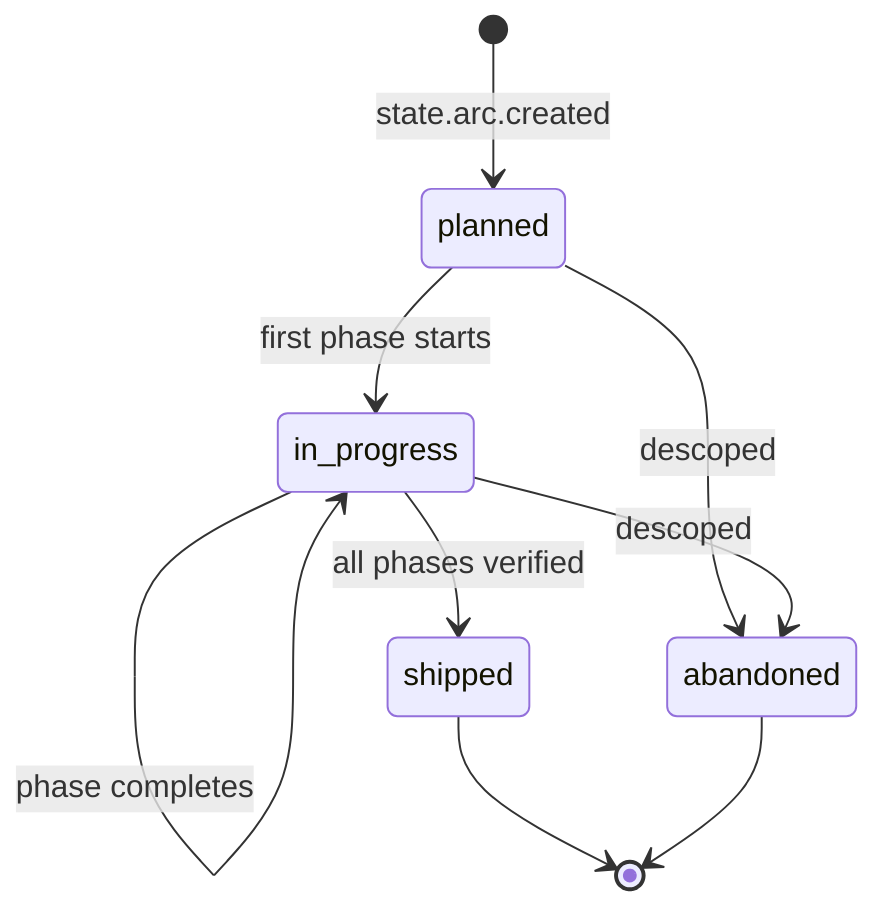
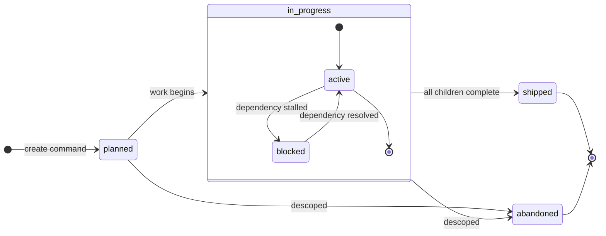
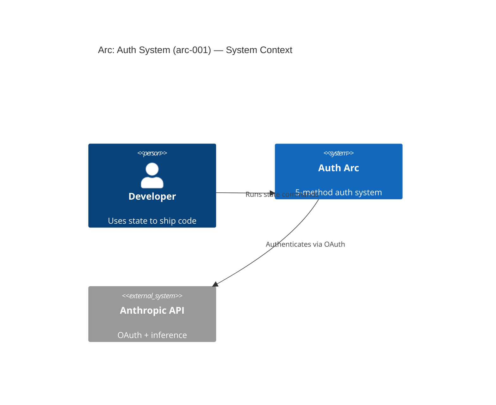
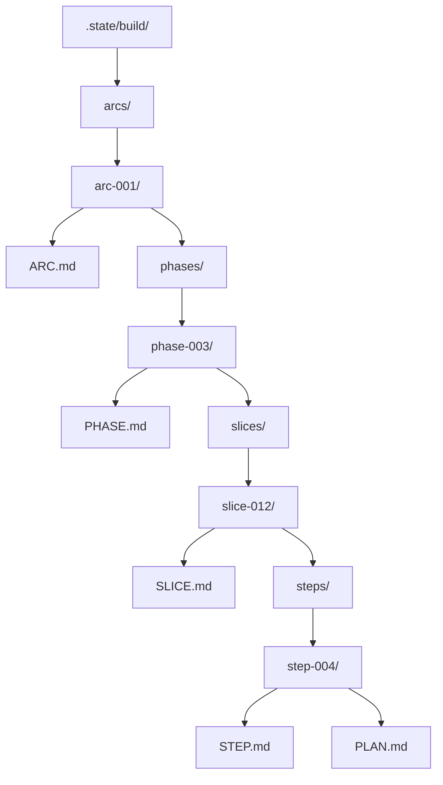

# Stack Research: Build Hierarchy & Artifact System Architecture (Design Stack)

**Domain:** Design-phase milestone — architecting the 4-tier product hierarchy (Arc → Phase → Slice → Step)
**Researched:** 2026-05-06
**Overall Confidence:** HIGH on modeling formats and schema tooling; MEDIUM on Mermaid C4 (marked experimental upstream)

This document defines the **documentation and specification stack** for the v40-v50 design spike. Zero implementation — this is what we use to produce architecture documents, state machine specs, artifact schemas, and cross-reference rules.

---

## Scope

This stack covers the **design-phase tools** for:

1. **State machine specification** — how we define the Arc/Phase/Slice/Step FSMs
2. **Architecture diagrams** — how we visualize tiers, flows, and dependencies
3. **Artifact schemas** — how we formally specify ARC.md, PHASE.md, SLICE.md, STEP.md, etc.
4. **Cross-referencing rules** — how artifacts link to each other
5. **Naming conventions** — how IDs, directories, and files are structured
6. **Documentation formats** — what file formats we use for design artifacts

This does NOT cover the runtime stack (that's in the original `STACK.md`). This is about how we author the design documents for tiers v41-v47 will implement.

---

## Recommended Design Stack

### State Machine Specification

| Format | Purpose | Why | Confidence |
|--------|---------|-----|------------|
| **Mermaid state diagrams** (`.md` embedded) | Visual state machine definitions for all four tiers | Zero-dependency text format; renders in VS Code, opencode, GitHub, any Markdown viewer. Supports composite states, concurrency forks, transitions with labels, guards, start/end states. The official state project docs can render these inline in architecture documents | HIGH — verified via mermaid.js.org docs v11.14.0 |
| **Pydantic v2 `BaseModel`** (Python, `state_core/schema.py`) | Executable state machine validation contract | Same models that validate frontmatter at creation time ALSO serve as the design contract. `extra="forbid"` enforces strict schemas. `Literal` types define valid state names. Already in state's runtime stack (pydantic≥2.13.2) | HIGH — pydantic.dev docs; already proven in state v1-v11 event schemas |
| **Python `Enum` + `Literal`** | State name enumerations, event type enumerations, guard condition lists | Type-safe, discoverable, auto-completing in IDEs. A single `class ArcState(str, Enum)` is both documentation AND importable runtime constant | HIGH — stdlib, zero deps |

**Pattern:** Each tier's state machine is specified in two artifacts:
1. **Architecture doc** (`.planning/research/ARCHITECTURE.md` or dedicated per-tier doc) — Mermaid diagram + prose explanation of each transition
2. **Schema module** (`state_core/schema.py` updates) — Pydantic models with `Literal` state names and transition event types

**Example — Arc state machine (Mermaid + Pydantic):**



```python
class ArcState(str, Enum):
    PLANNED = "planned"
    IN_PROGRESS = "in_progress"
    SHIPPED = "shipped"
    ABANDONED = "abandoned"

class ArcEvent(str, Enum):
    CREATED = "state.arc.created"
    RETIRED = "state.arc.retired"
    UPDATED = "state.arc.updated"

class ArcFrontmatter(BaseModel):
    model_config = ConfigDict(extra="forbid")
    id: str                          # arc-001, auth-system, etc.
    title: str                       # Human-readable name
    status: ArcState
    goal: str
    success_criteria: list[str]
    depends_on: list[str] = []       # Other arc IDs
    phases: list[str] = []           # Phase IDs
    opencode_surface: list[str] = [] # Extension surface paths
```

### Architecture Diagrams

| Format | Purpose | Why | Confidence |
|--------|---------|-----|------------|
| **Mermaid C4 diagrams** (`C4Context`, `C4Container`, `C4Component`) | Visualizing the 4-tier hierarchy as a C4 model | C4's four levels (Context → Container → Component → Code) map naturally to Arc → Phase → Slice → Step. Mermaid's C4 syntax is compatible with C4-PlantUML; supports System Context, Container, Component, Dynamic, Deployment diagrams | MEDIUM — Mermaid docs mark C4 as "experimental 🦺⚠️"; syntax is stable enough for design docs but may evolve |
| **Mermaid flowcharts** | Directory tree layouts, data flow, dependency graphs | Standard flowchart syntax; good for showing `.state/build/` tree structure, event flow, dependency DAGs | HIGH — mature, stable |
| **Mermaid class diagrams** | Pydantic model relationships, artifact taxonomy | Shows inheritance, composition, associations between schema models | HIGH — stable |

**Decision: Mermaid over Structurizr DSL/PlantUML for architecture diagrams.**

Rationale:
- **Structurizr DSL** is powerful but Java-based; its toolchain requires a JVM or Docker. The DSL is a custom grammar — another thing for contributors to learn. Export to Mermaid is supported but adds a build step.
- **PlantUML** requires a JVM or server-side renderer. Not universally viewable in VS Code without extensions.
- **Mermaid** renders natively in: VS Code (built-in), opencode, GitHub, GitLab, Notion, Obsidian. Zero toolchain. The C4 diagram syntax (even if experimental) is sufficient for design-phase documentation.

**Fallback:** If Mermaid C4 proves insufficient, render C4 diagrams via Structurizr DSL and export to Mermaid/PNG. The DSL files live in `.planning/architecture/` and are regenerated as needed. But for v40, Mermaid alone is sufficient.

### Artifact Schema Specification

| Format | Purpose | Why | Confidence |
|--------|---------|-----|------------|
| **Pydantic v2 `BaseModel`** with `extra="forbid"` | Formal artifact schemas | The exact same models that validate frontmatter at creation time serve as the design contract. `model_json_schema()` emits JSON Schema for cross-language interoperability. `model_dump()` serializes. Fields are typed with Python annotations — self-documenting. | HIGH — already proven in state's event schemas |
| **JSON Schema** (emitted from Pydantic) | Cross-language schema sharing | Pydantic's `model_json_schema()` output is standard JSON Schema Draft 2020-12. Useful for generating OpenAPI docs, TS type stubs, or validation in opencode plugin. Not authored directly — always generated. | HIGH — Pydantic v2 JSON Schema support is mature |
| **YAML frontmatter** (Markdown `---` delimiters) | Human-readable artifact metadata | GSD convention carried forward. Every `.md` artifact (ARC.md, PHASE.md, SLICE.md, STEP.md, etc.) has a YAML frontmatter block validated by Pydantic. | HIGH — already used by GSD; proven in state's existing `.planning/` convention |

**Artifact schema pattern — every artifact has:**

```python
# Design contract (lives in state_core/schema.py, v40 milestone)
class ArcManifest(BaseModel):
    """Full schema for ARC.md frontmatter."""
    model_config = ConfigDict(extra="forbid")
    id: ArcId                       # arc-001 or slug
    title: str                      # max 120 chars
    status: ArcState
    goal: str
    success_criteria: list[str]
    depends_on: list[ArcId] = []
    phases: list[PhaseId] = []
    opencode_surface: list[str] = []
    created_at: datetime
    updated_at: datetime
```

```markdown
<!-- ARC.md example -->
---
id: arc-001
title: Auth System Overhaul
status: planned
goal: Full 5-method auth with OAuth stealth and token refresh
success_criteria:
  - All 5 auth methods ship day one
  - Anthropic OAuth matches claude-oauth.md byte-for-byte
depends_on: []
phases:
  - arc-001-phase-001
  - arc-001-phase-002
opencode_surface:
  - packages/opencode/src/auth/
created_at: 2026-05-06T00:00:00Z
updated_at: 2026-05-06T00:00:00Z
---
# Auth System Overhaul
...
```

### Cross-Referencing System

| Mechanism | Purpose | Why | Confidence |
|-----------|---------|-----|------------|
| **Frontmatter ID fields** (`id`, `depends_on`, `phases`, `parent_arc`) | Explicit cross-references in artifact metadata | Machine-parseable; validated by Pydantic at creation time; resolvable by the projector at verification time | HIGH |
| **File path conventions** | Implicit cross-references via directory hierarchy | `arcs/{arc-id}/phases/{phase-id}/slices/{slice-id}/` — the path IS the relationship. No need to store parent references in every file | HIGH |
| **Content-addressed hashes** (future, v42+) | Immutable references for snapshots | When an artifact is snapshotted, the SHA-256 hash becomes an immutable pointer. Used for verify-contract references (`STEP.md` → `PLAN.md` hash) | MEDIUM — deferred to quality pipeline milestone (v42) |
| **Event IDs** (`event_id` in SQLite) | Audit-trail cross-references | Every artifact mutation is an event; the `event_id` links the artifact's current state back to the causal event sequence | MEDIUM — already in event store, but cross-reference semantics need formalizing in v40 |

**Decision: ID-based + path-based cross-references for v40. Content-hash references deferred to v42.**

Cross-reference format:
- **Within same tier**: `depends_on: [arc-003, arc-007]` (by ID)
- **Parent→Child**: Implicit via directory hierarchy. `ARC.md` lives in `arcs/{arc-id}/`; its phases live in `arcs/{arc-id}/phases/`. The `phases` frontmatter field is a cache, not the source of truth.
- **Child→Parent**: Implicit via path. A `SLICE.md` at `arcs/arc-001/phases/phase-003/slices/slice-012/` knows its parent phase and grandparent arc from the path.
- **Cross-tier dependencies**: `depends_on: [{arc: arc-001, phase: phase-003, slice: slice-005}]` (fully qualified)
- **Artifact→Artifact**: `STEP.md` frontmatter references `plan: arcs/arc-001/phases/phase-003/slices/slice-005/steps/step-002/PLAN.md` (relative path)

### Naming Conventions

| Element | Format | Example | Rationale |
|---------|--------|---------|-----------|
| Arc ID | `arc-{NNN}` or `{slug}` | `arc-001`, `auth-system` | Machine-sortable numeric for ordering; optional slug for readability. Arc IDs are globally unique |
| Phase ID | `{arc-id}-phase-{NNN}` | `arc-001-phase-003` | Scoped to parent arc; no global uniqueness required |
| Slice ID | `{phase-id}-slice-{NNN}` | `arc-001-phase-003-slice-012` | Scoped to parent phase |
| Step ID | `{slice-id}-step-{NNN}` | `arc-001-phase-003-slice-012-step-004` | Scoped to parent slice |
| Decimal insertion | `{parent-id}-{NNN}.{D}` | `arc-001-phase-003.1` | For urgent gap-closure work; inserted between `003` and `004` |
| Directory | `arcs/{arc-id}/phases/{phase-id}/slices/{slice-id}/steps/{step-id}/` | Matches ID hierarchy exactly |
| File | `{TYPE}.md` (ARC.md, PHASE.md, SLICE.md, STEP.md, PLAN.md, etc.) | Fixed names; the directory path disambiguates |

**Decision: Numeric IDs for machine sortability, slug IDs as optional aliases.**

Example: Both `arc-001` and `auth-system` refer to the same Arc. The numeric ID is the canonical identifier; the slug is a human-readable alias stored in the `slug` frontmatter field. The directory uses the numeric ID.

This mirrors GSD's `NNN-slug` pattern but inverts: the ID is numeric-only for sort stability; the slug is metadata.

### Documentation Format

| Format | Purpose | Why |
|--------|---------|-----|
| **Markdown** (`.md`) | All design documents, architecture docs, tier definitions, artifact schemas | Human-readable, diffable, renders everywhere (VS Code, GitHub, opencode). GSD convention carried forward |
| **YAML frontmatter** | Structured metadata in every `.md` artifact | Machine-parseable, validated by Pydantic, familiar from GSD |
| **Mermaid** (embedded in `.md`) | Diagrams (state machines, C4, flowcharts, class diagrams) | Text-based, version-controlled, renders in all markdown viewers |
| **Pydantic models** (`.py`) | Formal schemas as Python code | The design contract that becomes the implementation contract. Lives in `state_core/schema.py` — updated during v40, executed during v41+ |
| **JSON Schema** (generated, not authored) | Cross-language schema documentation | Generated from Pydantic via `model_json_schema()`; used for TS type generation in the opencode plugin |

**What we do NOT use:**

| Avoid | Why | Use instead |
|-------|-----|-------------|
| XState v5 | JavaScript-only. Our runtime is Python 3.12+. XState is an execution engine, not a documentation format. For design docs, Mermaid state diagrams are sufficient. | Mermaid state diagrams + Pydantic models |
| SCXML | W3C standard but XML-based. Verbose. No Python execution ecosystem (the spec's reference implementation is JS/Java). Academic formalism not needed for our 4-state FSM per tier. | Mermaid + Pydantic |
| UML (enterprise tooling) | Requires specialized tools (Sparx EA, Visual Paradigm, MagicDraw). Not diffable. Not rendered in markdown. | Mermaid |
| Structurizr DSL (as primary) | Java-based toolchain. Requires `structurizr-cli` to render. Adds a build step between authoring and viewing. Good for production-grade architecture docs; overkill for design-phase docs. | Mermaid C4 (export from Structurizr if Mermaid proves insufficient) |
| Arc42 template | 12-section architecture template designed for enterprise systems with multiple stakeholders. Overly formal for a design-phase spike — we need 4 tier definitions and an artifact catalog, not a 150-page architecture document. | Targeted architecture docs in `.planning/research/` + milestone-specific docs |
| adr-tools / log4brains | CLI tools for managing ADR numbering and generation. Our decisions live in `.planning/research/DECISIONS.md` and the milestone-specific HANDOFF.md; we don't need a dedicated ADR CLI. | Markdown files in `.planning/` + frontmatter tracking |
| OpenAPI | Designed for REST API schemas. Using it for artifact schemas is square-peg-round-hole. Pydantic models + JSON Schema cover our needs. | Pydantic `BaseModel` |
| PlantUML | Requires JVM or server-side renderer. Not natively viewable in VS Code/GitHub without extensions. | Mermaid (renders everywhere) |

---

## Design Document Structure

The v40-v50 design spike produces documents in this layout:

```
.planning/
├── research/
│   ├── STACK.md                          # This file — design stack
│   ├── ARCHITECTURE.md                   # Updated with 4-tier architecture
│   ├── SUMMARY.md                        # Research summary
│   └── tiers/
│       ├── ARC.md                        # Arc tier specification (states, events, artifacts, frontmatter)
│       ├── PHASE.md                      # Phase tier specification
│       ├── SLICE.md                      # Slice tier specification
│       └── STEP.md                       # Step tier specification (full FSM, 7+ states)
├── architecture/
│   ├── hierarchy.mermaid                 # 4-tier C4 model (Context=Arc, Container=Phase, Component=Slice, Code=Step)
│   ├── state-machines.mermaid            # All 4 tier FSMs
│   ├── data-flow.mermaid                 # Event flow across tiers
│   └── directory-tree.mermaid            # .state/build/ tree as flowchart
├── schemas/
│   ├── arc.py                            # ArcManifest, ArcState, ArcFrontmatter
│   ├── phase.py                          # PhaseManifest, PhaseState, etc.
│   ├── slice.py                          # SliceManifest
│   ├── step.py                           # StepManifest (build) / StepManifest (teach)
│   ├── artifacts.py                      # ArtifactType enum, ArtifactCatalog
│   └── crossref.py                       # CrossReference, DependencyEdge
├── conventions/
│   ├── NAMING.md                         # ID formats, directory naming, decimal insertions
│   ├── CROSSREF.md                       # Cross-reference rules, resolution algorithm
│   └── FRONTMATTER.md                    # Frontmatter field reference for every artifact
└── PROJECT.md                            # Updated with v40 decisions
```

---

## Pydantic Schema Pattern for All Tiers

Every tier's artifact schema follows this pattern:

```python
from enum import Enum
from datetime import datetime
from pydantic import BaseModel, ConfigDict, Field
from typing import Literal

# ── State enumeration (the FSM states) ──
class TierState(str, Enum):
    """Valid states for this tier."""
    ...

# ── Event enumeration (what transitions the FSM) ──
class TierEvent(str, Enum):
    """Events that advance this tier's state machine."""
    ...

# ── Frontmatter schema (the artifact's YAML header) ──
class TierFrontmatter(BaseModel):
    """Schema for {TIER}.md frontmatter."""
    model_config = ConfigDict(extra="forbid")
    id: str
    title: str = Field(max_length=120)
    status: TierState
    # ... tier-specific fields ...
    created_at: datetime
    updated_at: datetime

# ── Manifest (full artifact including body) ──
class TierManifest(BaseModel):
    """Full artifact: frontmatter + markdown body."""
    frontmatter: TierFrontmatter
    body: str  # Markdown content after the --- delimiter
```

**Design principle:** The Pydantic model IS the schema. No separate JSON Schema or YAML schema file. When a developer reads `state_core/schema.py`, they see the canonical definition. The JSON Schema is generated from it, not maintained separately.

---

## Mermaid Diagram Patterns

### Pattern 1: Tier State Machine



### Pattern 2: C4 Hierarchy (experimental syntax)



### Pattern 3: Directory Tree



---

## Tools for Authoring Design Documents

| Tool | Purpose | Why |
|------|---------|-----|
| **VS Code + Mermaid extension** | Live preview of Mermaid diagrams while authoring | Already installed; preview updates on save |
| **mermaid-cli** (`mmdc`) | Export diagrams to PNG/SVG for non-Markdown contexts | `npx -p @mermaid-js/mermaid-cli mmdc -i diagram.mermaid -o diagram.png` |
| **Python REPL** | Test Pydantic schema models during design | `python3 -c "from state_core.schema import ArcFrontmatter; ArcFrontmatter.model_json_schema()"` |
| **ruff / mypy** | Lint and type-check schema files | Already in dev toolchain |

**Not needed:**
- Stately Studio (XState visual editor) — XState is not our runtime
- Structurizr CLI — unless Mermaid C4 proves insufficient
- PlantUML server — Mermaid replaces it entirely
- Any GUI modeling tool — text-based formats are diffable, reviewable, and survive context resets

---

## Version Compatibility

| Pair | Constraint | Notes |
|------|------------|-------|
| Mermaid syntax | v11.14.0 | Latest stable at time of research. C4 diagrams marked experimental — pinning to current syntax in case of breaking changes |
| Pydantic | ≥2.13.2 | Already in state's runtime stack. Using features stable since v2.0 (ConfigDict, extra="forbid", model_json_schema) |
| Python | 3.12+ | Required for PEP 695 type parameter syntax (new generics), which we use in generic artifact base classes |
| Markdown | CommonMark + GFM tables | Standard; renders everywhere |

---

## What We Rejected (with Reasons)

| Rejected | Why | What We Use Instead |
|----------|-----|---------------------|
| **XState v5** | JavaScript runtime; no Python equivalent. XState is an execution engine, not a documentation format. Our state machines are simpler (4-7 states per tier), executed by a custom Python FSM, not by a JS interpreter. XState's visual editor (Stately Studio) is excellent but produces JS code, not Python. | Mermaid state diagrams (documentation) + Pydantic models (schema contract) |
| **SCXML** | W3C standard (2015) but XML-based and verbose. Defines parallel states, history states, compound states — features we don't need (our tiers are simple linear FSMs with 4-7 states). No Python execution ecosystem. The Step FSM is the only complex one, and it's still simpler than a full Harel statechart. | Mermaid + Pydantic `Literal` state enums |
| **Structurizr DSL** | Java-based tooling. Requires JVM or Docker for `structurizr-cli`. Powerful for production architecture docs but adds friction for a design-phase spike. The DSL grammar is another thing to learn. Mermaid C4 covers our needs for now. | Mermaid C4 diagrams (built-in to Mermaid v11) |
| **Arc42** | 12-section template designed for enterprise architecture documentation. Overly formal for a design spike. We need 4 tier definitions and an artifact catalog, not chapters on "Runtime Environment" and "Cross-Cutting Concepts." | Targeted architecture docs per tier |
| **adr-tools / log4brains** | CLI tools for ADR numbering/templating. Our decision tracking is already handled by GSD's `.planning/research/DECISIONS.md` + project-level Key Decisions table in PROJECT.md. Adding a dedicated ADR CLI is ceremony without value. | Markdown decisions log |
| **OpenAPI / Swagger** | Designed for REST API specification. Using it for artifact schemas is a category error. Our artifacts are markdown files, not HTTP endpoints. | Pydantic `BaseModel` (emits JSON Schema if needed) |
| **PlantUML** | Requires JVM. The PlantUML C4-PlantUML stdlib is mature but Mermaid's C4 support (while experimental) is sufficient for design docs and renders without a server. | Mermaid |
| **JSON Schema (authored manually)** | Maintaining JSON Schema by hand diverges from the Pydantic models that actually validate at runtime. DRY violation. | Pydantic `model_json_schema()` (generated, not authored) |
| **UML class/state diagrams (enterprise tools)** | Requires specialized tools (Sparx EA, Visual Paradigm). Not diffable. Can't embed in markdown. Breaks the "text-based, version-controlled" design constraint. | Mermaid class diagrams + state diagrams |

---

## Sources

### Mermaid.js
- [Mermaid State Diagrams — official docs v11.14.0](https://mermaid.js.org/syntax/stateDiagram.html) — composite states, concurrency, forks, transitions with guards
- [Mermaid C4 Diagrams — official docs v11.14.0](https://mermaid.js.org/syntax/c4.html) — experimental, C4Context/C4Container/C4Component/C4Dynamic/C4Deployment
- [Mermaid Live Editor](https://mermaid.live/edit) — interactive authoring

### XState / SCXML
- [XState v5 — official docs](https://xstate.js.org/docs/) — JS state machine library; actor-based, SCXML-inspired
- [SCXML W3C Recommendation 1 September 2015](https://www.w3.org/TR/scxml/) — reference state machine spec

### Structurizr / C4 Model
- [Structurizr DSL documentation](https://docs.structurizr.com/dsl) — text-based C4 model DSL; Java-based
- [C4 Model official site](https://c4model.com) — the conceptual model behind all C4 tooling

### Pydantic
- [Pydantic v2 Models — official docs](https://docs.pydantic.dev/latest/concepts/models/) — BaseModel, ConfigDict(extra="forbid"), model_json_schema()
- [Pydantic v2 JSON Schema](https://docs.pydantic.dev/latest/concepts/json_schema/) — JSON Schema emission

### Existing state codebase
- `src/state_core/schema.py` — 34+ event types, existing Arc/Phase/Slice/Step event definitions
- `src/state_build/kernel.py` — current StepMachine skeleton (defines existing states)
- `.planning/research/ARCHITECTURE.md` — §5 (event taxonomy), §8 (build kernel internals)
- `.planning/milestones/v40/HANDOFF.md` — v40 milestone scope, artifact catalog table, directory tree

### GSD heritage
- `state-inputs/get-shit-done/bin/lib/artifacts.cjs` — canonical artifact registry (10 exact-match + 2 pattern-match)
- `state-inputs/get-shit-done/bin/lib/frontmatter.cjs` — YAML frontmatter handling
- `state-inputs/get-shit-done/bin/lib/state.cjs` — STATE.md operations

---

*Stack research for: state v40 Build Hierarchy & Artifact System Architecture — design-phase documentation and specification tools.*
*Researched: 2026-05-06*
*Updated: This file replaces the original STACK.md's design-tooling section; runtime stack unchanged.*
