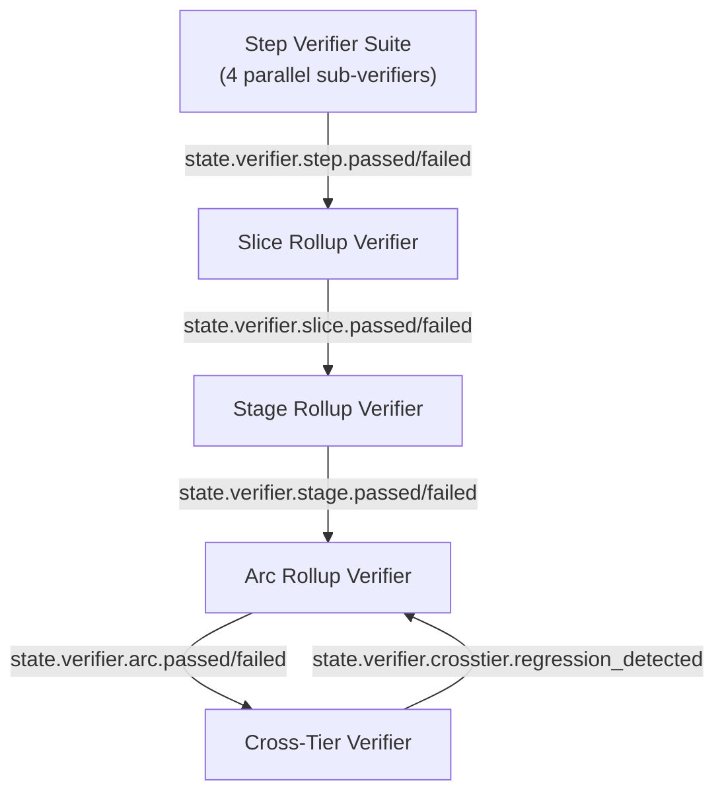

# Verifier Chain — Milestone v42

> **Design contract for v14 Build Kernel and v15 Build Core Commands.**
> Owned by: Phase 407 (Verifier Chain Architecture).
> Forward-reference invariant: rows below cite forward-phase REQ-IDs; deep algorithm spec lives in Phases 408–411.
> Pure-machine across the entire chain — no LLM-as-judge anywhere (pre-empts Phase 409 ADV debate in the negative, carries forward v41 PRF-04).

## Overview

The verifier chain is composed of **five verifier scopes** that cover every tier of the canonical Arc → Stage → Slice → Step hierarchy plus a state-novel cross-tier regression detector:

- **Step (VCH-01)** — a fan-out suite of four parallel sub-verifiers: **goal-backward** (must-have satisfaction over derived acceptance criteria), **security** (STRIDE-register disposition + secret detection), **stub-detector** (AST + call-chain trace-through of empty/placeholder code), **anti-pattern** (Python 3.12 + architecture + test anti-pattern catalogs with deterministic auto-fix on the fixable subset).
- **Slice rollup (VCH-02)** — pure aggregator over child Steps + the verify-slice integration check.
- **Stage rollup (VCH-03)** — pure aggregator over child Slices + the Stage acceptance check against CRIT.md must_haves.
- **Arc rollup (VCH-04)** — pure aggregator over child Stages + the Arc acceptance check.
- **Cross-Tier (VCH-05)** — state-specific regression detector over the depends_on closure of already-shipped Arcs, fired as the final gate of `/state-ship-arc`.

Every algorithm in this document is deterministic — AST walkers (Python `ast.NodeVisitor`), grep regex over `files_modified`, `pathlib` existence checks, `events.sqlite` queries via `aiosqlite`, `pygit2` for git evidence, `ruff` for anti-pattern fixable patterns, subprocess invocation of test runners. No LLM-as-judge anywhere in the verifier chain.

## Verifier-Chain Topology



The daemon listens on the v6 SSE bus for any `state.verifier.<child>.{passed,failed}` event. On any child verdict-flip event, daemon re-runs the parent rollup verifier (pure-machine, no LLM); the composite verdict updates idempotently and `state.verifier.verdict_changed` fires at each tier whose verdict flipped. Re-aggregation cost is bounded to parents of changed children in `open` state — already-shipped scopes have immutable verdicts in the event log.

Edge semantics:

- **Step → Slice**: every child Step's composite verdict aggregates into the Slice rollup; Slice rollup is also gated on the verify-slice integration check (Phase 402 SLC-XX output).
- **Slice → Stage**: every child Slice's verdict aggregates into the Stage rollup; Stage rollup is also gated on the Stage acceptance check against CRIT.md must_haves.
- **Stage → Arc**: every child Stage's verdict aggregates into the Arc rollup; Arc rollup is also gated on the Arc acceptance check against Arc-tier CRIT.md must_haves.
- **Arc → Cross-Tier**: VCH-05 fires *after* VCH-04 passes and CAN fail the Arc by setting the Cross-Tier verdict to `regression_detected`. This is the only edge in the topology where a parent can fail its child's apparent verdict.

## Verdict Vocabulary

```python
from typing import Literal
Verdict = Literal["passed", "failed", "warning"]
```

| Verdict | Semantics | Propagation |
|---|---|---|
| `passed` | all checks green; no BLOCKER findings | carries forward upward without escalation |
| `failed` | ≥1 BLOCKER finding | halts upward propagation; parent rollup also `failed`; failure_mode ladder fires |
| `warning` | WARNING-only findings (no BLOCKER) | carries forward upward; advisory event for human/audit; does NOT block ship |

Mapping to downstream / related specs:

| Source | Source value | Maps to |
|---|---|---|
| Phase 408 STB-02 | BLOCKER | `failed` |
| Phase 408 STB-02 | WARNING | `warning` |
| Phase 408 STB-02 | KNOWN | excluded from verdict (registered out via STB-04) |
| Phase 411 PCK-10 | `blocked` | `failed` (at plan-checker scope) |
| Phase 411 PCK-10 | `warnings` | `warning` |
| Phase 411 PCK-10 | `passed` | `passed` |

Rejected for state because `omitted` collides semantically with v40 D-14 `deferred` and v41 SRP-06 `deferred-items.md`. State's `warning` covers the noteworthy-but-not-blocking case; explicit deferment is its own artifact. The prior project's `pass | flag | omitted` triad (kb §8.7) is therefore not adopted.

## Per-Tier VERIFY Artifact

| Tier | Artifact filename | Required sections | Author |
|---|---|---|---|
| Step | `stepNVERIFY.md` (alongside `stepNPLAN.md` + `stepNSUMMARY.md`) | `## Goal-Backward` / `## Security` / `## Stub-Detector` / `## Anti-Pattern` + composite verdict in frontmatter | server-written (verifier orchestrator) |
| Slice | `N-VERIFICATION.md` (existing v41 SLC artifact, amended) | `## Step Verdict Table` (one row per child Step) + `## Slice Integration Check` | server-written |
| Stage | `STAGE-VERIFY.md` (new artifact) | `## Slice Verdict Table` + `## Stage Acceptance Check` (against CRIT.md must_haves) | server-written |
| Arc | `ARC-VERIFY.md` (new artifact) | `## Stage Verdict Table` + `## Arc Acceptance Check` + `## Cross-Tier Verdict` block | server-written |

All VERIFY artifacts are server-written by the verifier orchestrator. Agents have zero authorship privilege on any VERIFY.md. A `tool.execute.before` write-block rejects any agent Write/Edit targeting `*VERIFY.md` paths (extends v41 SRP-04 allowlist enforcement). Matches v40 D-401-09 agent-vs-projector authorship boundary.

Phase 411 EVD-03 walker traverses this chain upward (`stepNVERIFY → stepNPLAN → STEP-file → SLICE → STAGE → ARC`); the per-tier-VERIFY-artifact rule is what makes the walk possible.

## VCH-01 — Step Verifier Suite

The Step verifier suite is composed of **four parallel sub-verifiers** — goal-backward, security, stub-detector, anti-pattern — running independently via opencode `task` subagent fan-out (Phase 405 SUB-01 `dispatch_subagent` typed-spawn surface). The composite Step verdict is server-recomputed (never LLM-summarized; matches kb quality-enforcement §11.5). Composite evidence list = union of all 4 sub-verifier evidence lists. All citations follow the canonical citation grammar (Phase 409 ADV-03): `file_path:line_number`, `commit:<hash>`, `event:<id>`, `test:<runner-output-id>`.

**Short-circuit policy.** Always run all 4 sub-verifiers; collect full evidence. No early termination on first BLOCKER. The agent receives all sub-verifier findings in one failureContext re-injection (kb §4.1 server-side merge), so a single retry can address all four classes of failure rather than fix-retry-fix-retry serial cycles.

### Sub-verifier: goal-backward

| Field | Spec |
|---|---|
| `inputs` | STEP.md goal text + ARC/STAGE/SLICE success-criteria blocks + REQ-IDs cited in STEP.md + locked decisions from DISCUSS.md; must_haves frontmatter from PLAN.md |
| `algorithm` | Deterministic must-have derivation (Phase 409 GBP-01); for each derived must-have, find codebase evidence via the 4 evidence types (code-exists via `pathlib` + AST match; tests-pass via test-runner subprocess invocation; LSP-clean via `ruff check` / `pyright`; behavioral-check via cited runnable assertion). Falsification-first stance per Phase 409 ADV-01. |
| `outputs` | `## Goal-Backward` section of `stepNVERIFY.md` + `state.verifier.step.goal_backward.passed` or `state.verifier.step.goal_backward.failed` event |
| `failure_mode` | retry-loop → human-gate. Re-dispatch agent with missing-must-have evidence (kb §4.3 recoverable failure). 3-strike → human gate via opencode `question` tool (v41 HRN-06). |
| `evidence` | List of `Citation` (Phase 409 ADV-03 grammar) per must-have: ≥1 of {file:line, commit:hash, event:id, test:runner-output-id}. SUMMARY.md claims do NOT count as evidence (Phase 409 GBP-04 trust rule). |

**Event emissions:** `state.verifier.step.goal_backward.passed` on full must-have satisfaction; `state.verifier.step.goal_backward.failed` on any unsatisfied derived must-have.

**Forward-reference:** Deep design in Phase 409, REQ-IDs GBP-01..05 + ADV-01..04.

### Sub-verifier: security

| Field | Spec |
|---|---|
| `inputs` | PLAN.md STRIDE register (THM-01) + accepted-risks registry (THM-04) + cited mitigation files + `files_modified` allowlist |
| `algorithm` | Per Phase 410 THM-03 disposition logic: for `mitigate` threats — grep/AST-check mitigation pattern in cited files; for `accept` threats — verify entry in accepted-risks registry with valid `accepted_by`; for `transfer` threats — verify transfer doc exists and target system verified. Secret-detection via `src/state_core/observability/redactor.py` reused over `files_modified` diffs. |
| `outputs` | `## Security` section of `stepNVERIFY.md` + `state.verifier.step.security.passed` or `state.verifier.step.security.failed` event |
| `failure_mode` | retry-loop → human-gate. Re-dispatch agent with mitigation-missing evidence cited `file:line`. 3-strike → human gate. |
| `evidence` | Per-STRIDE-category verdict (CLOSED / OPEN:BLOCKER / WARNING) with citations to cited mitigation files + registry entries. |

**Forward-reference:** Deep design in Phase 410, REQ-IDs THM-01..05.

### Sub-verifier: stub-detector

| Field | Spec |
|---|---|
| `inputs` | `files_modified` set + SUMMARY.md `## Known Stubs` section (STB-04) + AST of changed Python files + import graph |
| `algorithm` | Stub pattern catalog (STB-01) detected via AST walker (`ast.NodeVisitor`) + grep over files_modified; matched stubs classified per severity (STB-02: BLOCKER/WARNING/KNOWN); trace-through algorithm (STB-03) walks all callers via import-graph traversal; promote to BLOCKER if emptiness reaches rendering/API surface, demote to WARNING if handled gracefully; legitimate-stub disambiguation (LVL-06) cross-references `## Known Stubs` before promoting. |
| `outputs` | `## Stub-Detector` section of `stepNVERIFY.md` + `state.verifier.step.stub_detector.passed` or `state.verifier.step.stub_detector.failed` event |
| `failure_mode` | retry-loop → human-gate. Re-dispatch agent with stub-trace evidence (call-chain to user surface). 3-strike → human gate. Known-Stubs registration (STB-04) bypasses by promoting to KNOWN tier before counter triggers. |
| `evidence` | Per-stub Citation list: `file:line` of stub + call-chain Citations to user-surface (rendering/API) where reachability promotes to BLOCKER. |

**Forward-reference:** Deep design in Phase 408, REQ-IDs STB-01..04 + LVL-04..06.

### Sub-verifier: anti-pattern

| Field | Spec |
|---|---|
| `inputs` | `files_modified` set + Python 3.12 anti-pattern catalog (APS-01) + architecture anti-pattern catalog (APS-02, extending `src/state_core/import_lint.py`) + test anti-pattern catalog (APS-03) + project-specific extensions (APS-05) |
| `algorithm` | Per-pattern detection via {regex, AST node match, ruff rule ID, import-graph query}; severity classification per APS-01/APS-02/APS-03 BLOCKER/WARNING tables; fixable-pattern subset (unused imports, formatting, ordering) routed through deterministic auto-fix tier (VCH-06 below). |
| `outputs` | `## Anti-Pattern` section of `stepNVERIFY.md` + `state.verifier.step.anti_pattern.passed` or `state.verifier.step.anti_pattern.failed` event |
| `failure_mode` | auto-fix-attempt → retry-loop → human-gate. Harness first runs deterministic formatter pass (`ruff --fix`, `black`, `isort`) for fixable patterns. Remaining violations re-dispatch agent. After 3 retries on same `(pattern, file)` pair, human gate. |
| `evidence` | Per-violation Citation: `file:line` + pattern ID (ruff rule ID or AST match name) + severity. |

**Forward-reference:** Deep design in Phase 410, REQ-IDs APS-01..05.

### Composite Step Verdict

Step verdict = `passed` iff all 4 sub-verifiers return `passed` or `warning` (no BLOCKER). Any BLOCKER from any sub-verifier → Step verdict = `failed`. Server-recomputed via the daemon's projector (kb §11.5); never LLM-summarized. Composite event: `state.verifier.step.passed` or `state.verifier.step.failed`. Composite evidence list = union of all 4 sub-verifier evidence lists. Retry counter scope: per-`(task_id, check_id)` per v41 PRF-06 (no scope conflation across sub-verifiers; each sub-verifier maintains its own 3-strike counter).

## VCH-02 — Slice Rollup Verifier

Pure aggregator over child Steps + Slice-level integration check. Reads each child `stepNVERIFY.md` composite verdict + Slice integration evidence (Phase 402 SLC-XX verify-slice stage outputs). Algorithm: `slice_verdict = passed iff every child_step.verdict ∈ {passed, warning} AND slice_integration_check.verdict == passed`. Any child `failed` → Slice `failed`. The rollup is a *boolean aggregation*, not an actor — it never retries, never escalates, never auto-fixes; the child's failure mode owns those.

| Field | Spec |
|---|---|
| `inputs` | All child `stepNVERIFY.md` composite verdicts + Slice integration check evidence (output of verify-slice stage per v41 SLC-XX) + `N-VERIFICATION.md` integration sections |
| `algorithm` | Strict-AND aggregation: `slice_verdict = passed iff every child_step.verdict ∈ {passed, warning} AND slice_integration_check == passed`. Any child `failed` → Slice `failed`. Server-recomputed by daemon projector handler. |
| `outputs` | `N-VERIFICATION.md` `## Step Verdict Table` + `## Slice Integration Check` sections (server-written) + `state.verifier.slice.passed` or `state.verifier.slice.failed` event |
| `failure_mode` | **No action; verdict propagates upward.** Child Step's failure mode owns retry/escalation. Slice rollup re-runs only when daemon receives a child verdict-flip event (`state.verifier.verdict_changed`). |
| `evidence` | Composite Citation list = union of child Step evidence lists + Slice integration check citations. |

## VCH-03 — Stage Rollup Verifier

Same pure-aggregator pattern as VCH-02, scoped to child Slices. Reads each child `N-VERIFICATION.md` Slice verdict + Stage acceptance criteria (CRIT.md must_haves at Stage tier). Output `STAGE-VERIFY.md` (new artifact, server-written) + `state.verifier.stage.passed` or `state.verifier.stage.failed` event. **Invocation surface includes `/state-ship-stage <id>`** (user request mirroring `/state-ship-arc` — v40 D-18; command itself owned by v43 Build Command Layer).

| Field | Spec |
|---|---|
| `inputs` | All child `N-VERIFICATION.md` Slice verdicts + Stage CRIT.md must_haves + Stage state machine current state (must be in `verifying` per v40 D-17) |
| `algorithm` | Strict-AND aggregation: `stage_verdict = passed iff every child_slice.verdict ∈ {passed, warning} AND every stage_must_have satisfied`. Stage must_have satisfaction verified via the 4 evidence types (code-exists, tests-pass, LSP-clean, behavioral-check). |
| `outputs` | `STAGE-VERIFY.md` (server-written) with `## Slice Verdict Table` + `## Stage Acceptance Check` sections + `state.verifier.stage.passed` or `state.verifier.stage.failed` event |
| `failure_mode` | No action; verdict propagates upward. Pure aggregator. |
| `evidence` | Composite Citation list = union of child Slice evidence + Stage must_have evidence citations. |

## VCH-04 — Arc Rollup Verifier

Same pure-aggregator pattern, scoped to child Stages. Reads each child `STAGE-VERIFY.md` Stage verdict + Arc acceptance criteria. Fires as part of the `/state-ship-arc` flow's `auditing` state transition (v40 D-18: `auditing` entry guard = all child Stages shipped; Arc rollup verifies before transition to `shipped`).

| Field | Spec |
|---|---|
| `inputs` | All child `STAGE-VERIFY.md` Stage verdicts + Arc CRIT.md must_haves + Arc state machine current state (must be `auditing` per v40 D-18) |
| `algorithm` | Strict-AND aggregation: `arc_verdict = passed iff every child_stage.verdict ∈ {passed, warning} AND every arc_must_have satisfied`. Arc must_have satisfaction verified via the 4 evidence types. |
| `outputs` | `ARC-VERIFY.md` (server-written) with `## Stage Verdict Table` + `## Arc Acceptance Check` + `## Cross-Tier Verdict` block (Cross-Tier result, see VCH-05) + `state.verifier.arc.passed` or `state.verifier.arc.failed` event |
| `failure_mode` | No action; verdict propagates upward. Pure aggregator. (However: VCH-05 Cross-Tier verifier fires *after* VCH-04 passes and CAN fail the Arc — see VCH-05 below.) |
| `evidence` | Composite Citation list = union of child Stage evidence + Arc must_have evidence citations + Cross-Tier verdict citations. |

## VCH-05 — Cross-Tier Verifier

**State-specific; novel.** The prior project (gsd-two lineage) has no aggregation tier above milestone (kb workflow-engine §9.2). Cross-Tier verifier detects regressions across already-shipped Arcs caused by the just-shipped Arc.

### Scope Rule

**Depends-on closure over already-shipped Arcs.** Walk the transitive closure of v40 Arc-level `depends_on` edges (D-12 edge types: `blocks` / `soft` / `data`) of the just-shipped Arc. Filter to Arcs in state `shipped` (in-progress Arcs have no stable verifier evidence to regress against — state's all-concurrent model means many Arcs may be `in_progress` simultaneously per PROJECT.md).

**Rationale**: matches the only prior-project precedent (`milestones.depends_on` JSON column, kb workflow-engine §9.2); bounded by declared intent; deterministic; cheap (DAG walk + per-Arc evidence re-check). State's v40 D-10 same-parent-only rule at lower tiers means undeclared cross-Arc coupling is already discouraged; `depends_on` is the strongest declared signal.

Plan 04 deepens this justification with the alternative-rules-rejected analysis.

### Trigger

Auto-fires as the final gate of `/state-ship-arc` after VCH-04 Arc rollup passes (matches v40 D-18 Arc audit workflow). Also exposed as a CLI surface `state verify crosstier <arc-id>` (full design owned by Phase 411 EVD-04 `state verify trace` family) for diagnostic / drift-recovery re-runs.

### Regression Criteria

Both criteria are evaluated; either triggering = `state.verifier.crosstier.regression_detected`:

1. **Prior Arc's verifier verdict flips PASS→FAIL on re-run.** Re-execute each closure-Arc's stored Step/Slice/Stage verifier evidence against current HEAD. Any verdict that was `passed` at original ship but is now `failed` = regression. Matches kb server-side recomputation discipline (kb §11.5).
2. **Prior Arc's must_haves no longer satisfied.** Walk each closure-Arc's CRIT.md + frontmatter `must_haves.{truths,artifacts,key_links}` (v41 STP-02 schema) and re-verify via the 4 evidence types (code-exists, tests-pass, LSP-clean, behavioral-check — Phase 409 GBP-03 taxonomy). Any unsatisfied must_have = regression. Falsification-first stance pre-empts Phase 409 ADV-01.

| Field | Spec |
|---|---|
| `inputs` | Just-shipped Arc ID + transitive closure of `depends_on` edges over Arcs in state `shipped` + stored verifier evidence for each closure-Arc + each closure-Arc's CRIT.md must_haves |
| `algorithm` | For each Arc in closure: (1) re-execute stored Step/Slice/Stage verifier evidence against current HEAD via pure-machine checks; (2) re-verify must_haves via the 4 evidence types. Cross-Tier verdict = `passed` iff NO closure-Arc shows verdict-flip OR must-have unsatisfaction. Any failure → `regression_detected`. |
| `outputs` | `## Cross-Tier Verdict` block in `ARC-VERIFY.md` of the just-shipped Arc + `state.verifier.crosstier.passed` OR `state.verifier.crosstier.regression_detected` event |
| `failure_mode` | **Human-gate immediately.** Regression means a previously-shipped Arc is now broken. Cannot auto-fix (new Arc's commits caused it; harness pass can't choose remedy) or retry-loop (no agent action against the *current* Arc fixes it). Routes through opencode `question` tool (v41 HRN-06): rollback / patch-via-new-Slice / accept-with-registry-entry (Phase 410 THM-04 accepted-risks registry analog). **Fail-closed**: the just-shipped Arc cannot transition to `shipped` until human gate clears. |
| `evidence` | Per-closure-Arc verdict-flip Citation (verifier_name + scope_id + old verdict + new verdict + diff Citations to current HEAD) + per-unsatisfied-must-have Citation list (must_have ID + 4-evidence-type failure mode). |

### Event-Driven Re-Aggregation

The daemon listens on the v6 SSE bus for any `state.verifier.<child>.{passed,failed}` event. On a verdict-flip event for a child of an open rollup, daemon re-runs the parent rollup verifier (pure-machine, no LLM). Composite verdict updates idempotently. The `state.verifier.verdict_changed` event fires at each tier whose verdict flipped, enabling the TUI to update progressively.

**Bounded cost**: only the parent of the changed child is re-aggregated, and only if it's in an `open` state (not already shipped). Already-shipped Arcs/Stages/Slices/Steps are immutable verdicts in the event log (Phase 411 EVD-05 retention rule territory).

This is how the chain heals after gap-closure: a failed Step retried that now passes triggers cascading parent re-aggregation upward.

### Cross-Reference Map

The following table maps the schema rows declared above to the downstream phases that own deep design. Phase 407 declares contracts; downstream phases satisfy them.

| Schema row source | Forward phase | REQ-ID range | Artifact owner |
|---|---|---|---|
| VCH-01 goal-backward `algorithm` + `evidence` | Phase 409 | GBP-01..05 + ADV-01..04 | Phase 409 deep design (Goal-Backward Planning Protocol + Adversarial Verification Stance) |
| VCH-01 security `algorithm` + `evidence` | Phase 410 | THM-01..05 | Phase 410 deep design (Threat Modeling Framework) |
| VCH-01 stub-detector `algorithm` + `evidence` | Phase 408 | STB-01..04 + LVL-04..06 | Phase 408 deep design (Stub Detection Framework + 4-level verification model) |
| VCH-01 anti-pattern `algorithm` + `evidence` | Phase 410 | APS-01..05 | Phase 410 deep design (Anti-Pattern Scanning System) |
| VCH-02 / VCH-03 / VCH-04 `outputs` event payloads | Phase 411 | EVD-01 | Phase 411 deep design (Pydantic payload schemas) |
| VCH-05 closure walk `algorithm` | Phase 407 Plan 04 | VCH-05 (this milestone) | Plan 04 deepens scope-rule justification |
| Per-tier VERIFY artifact authorship | v41 SRP-04 + v40 D-401-09 | (already shipped) | `tool.execute.before` write-block extension |
| Verdict carry-forward + event-driven re-aggregation | v40 projector + v6 SSE bus | (already shipped) | new projector handler family in `src/state_core/projector.py` |

### Failure-Mode Mapping Forward-Reference

Per-verifier failure-mode ladder details (VCH-06) live in Plan 02 of this phase. The summary table:

- **anti-pattern** (Step sub): deterministic auto-fix → retry-loop → human-gate (only sub-verifier with the auto-fix-attempt tier).
- **stub-detector / security / goal-backward** (Step subs): retry-loop → human-gate (no deterministic auto-fix; require code-writing or human judgment).
- **Step composite**: inherits sub-verifier strikes; single failureContext bundle to the agent for retry; per-`(task_id, check_id)` counter scope (v41 PRF-06).
- **Slice / Stage / Arc rollup**: no action; verdict propagates upward. Pure aggregators delegate retry to child failure modes.
- **Cross-Tier**: human-gate immediately. No retry, no auto-fix (see VCH-05 above).

The auto-fix-attempt tier is a state innovation over the prior project's verification-gate: a *deterministic harness pass* (ruff --fix, black, isort) — NOT an agent retry (that's `retry-loop`) and NOT an LLM-mediated fix (that violates the pure-machine stance).

### Event-Family Forward-Reference

Plan 03 of this phase appends a `## v42 Amendment` block to v40 EVENT-TAXONOMY.md registering the ~25 verifier event types declared in this document. Summary of the registry shape:

- Step sub-verifier events: 4 verifiers × 2 verdicts = 8 (`state.verifier.step.<sub>.{passed,failed}`).
- Step composite events: 2 (`state.verifier.step.{passed,failed}`).
- Rollup events: 3 scopes × 2 verdicts = 6 (`state.verifier.{slice,stage,arc}.{passed,failed}`).
- Cross-Tier events: 2 (`state.verifier.crosstier.{passed,regression_detected}`).
- Auxiliary events: `state.verifier.step.<sub>.warning`, `state.verifier.verdict_changed`, `state.verifier.autofix_applied`, `state.verifier.autofix_failed`.

Every event has a Pydantic payload model (`extra="forbid"`) with required fields `verifier_name`, `scope_id`, `verdict: Literal["passed", "failed", "warning"]`, `evidence: list[Citation]`, `triggered_at: datetime`, `session_id`, `snapshot_event_id: str | None`. Full schemas owned by Phase 411 EVD-01; this document declares only the event-name registry and required-field shape.

### Invariants

The verifier chain MUST preserve these invariants across all five scopes. Each is a property that downstream phases (408–411, v14, v15) must not violate:

| ID | Invariant | Enforced where |
|---|---|---|
| INV-1 | Every verifier algorithm is deterministic (no LLM-as-judge anywhere in the chain). | Phase 407 spec; downstream phases reaffirm in their algorithm rows. |
| INV-2 | Composite verdicts are server-recomputed by the daemon's projector, never LLM-summarized. | Phase 407 VCH-01 composite + VCH-02/03/04 algorithm rows; v40 projector handler family. |
| INV-3 | All VERIFY artifacts (`stepNVERIFY.md`, `N-VERIFICATION.md`, `STAGE-VERIFY.md`, `ARC-VERIFY.md`) are server-written; agents have zero authorship privilege. | `tool.execute.before` write-block extending v41 SRP-04 allowlist. |
| INV-4 | Verdict vocabulary is the closed set `Literal["passed", "failed", "warning"]` at every tier. | Phase 407 Verdict Vocabulary section; downstream phases align (Phase 408 STB-02, Phase 411 PCK-10). |
| INV-5 | Citations follow the canonical grammar `file_path:line_number` / `commit:<hash>` / `event:<id>` / `test:<runner-output-id>` (Phase 409 ADV-03). SUMMARY.md claims are not evidence. | Phase 407 VCH-01 evidence rows; Phase 409 GBP-04 trust rule. |
| INV-6 | 3-strike retry counters are scoped per-`(task_id, check_id)` per v41 PRF-06; no scope conflation across sub-verifiers. | Phase 407 VCH-01 composite subsection. |
| INV-7 | Rollup verifiers (VCH-02/03/04) never retry, never escalate, never auto-fix; they only aggregate. | Phase 407 VCH-02/03/04 failure_mode rows. |
| INV-8 | Cross-Tier (VCH-05) routes through human-gate immediately on `regression_detected`; the just-shipped Arc cannot transition to `shipped` until the gate clears. | Phase 407 VCH-05 failure_mode row; v40 D-18 Arc audit workflow. |
| INV-9 | Cross-Tier scope is the depends_on transitive closure over Arcs in state `shipped`. In-progress Arcs are excluded (no stable evidence baseline). | Phase 407 VCH-05 Scope Rule subsection. |
| INV-10 | Event-driven re-aggregation only fires on parents of changed children in `open` state; already-shipped scopes have immutable verdicts. | Phase 407 Event-Driven Re-Aggregation subsection; Phase 411 EVD-05 retention rule. |

### Worked Example: Failed Step → Retry → Cascading Re-Aggregation

To illustrate the event-driven re-aggregation mechanism end-to-end:

1. Step S7 of Slice 02 in Stage 3 of Arc A2 fires; goal-backward sub-verifier returns `failed` with two unsatisfied must_haves. Events: `state.verifier.step.goal_backward.failed`, then composite `state.verifier.step.failed` (server-recomputed).
2. Slice 02 rollup re-aggregates on the child verdict-flip; verdict becomes `failed`. Event: `state.verifier.slice.failed`. Stage 3 rollup re-aggregates similarly: `state.verifier.stage.failed`. Arc A2 rollup is gated and emits `state.verifier.arc.failed`.
3. Agent retries Step S7 with the merged failureContext bundle (4 sub-verifier evidence union per VCH-01 short-circuit policy). Step S7 now passes: `state.verifier.step.goal_backward.passed`, `state.verifier.step.passed`. `state.verifier.verdict_changed` fires for the Step.
4. Daemon receives the child verdict-flip; re-runs Slice 02 rollup. All children now `passed`, integration check `passed`, so Slice 02 verdict = `passed`. Event chain: `state.verifier.slice.passed` + `state.verifier.verdict_changed` (Slice tier).
5. Cascading propagation continues upward: Stage 3 rollup re-runs → `passed`; Arc A2 rollup re-runs → `passed`; finally `/state-ship-arc` invocation triggers VCH-05 Cross-Tier verifier as the final gate before transition to `shipped`.

This worked example assumes no Cross-Tier regression. If VCH-05 detected a regression in a closure Arc (e.g., A1 in state `shipped` with `depends_on: [A2]`-reverse edge), Arc A2 would remain stuck at `auditing` until the human-gate question (rollback / patch / accept-with-registry) clears.
