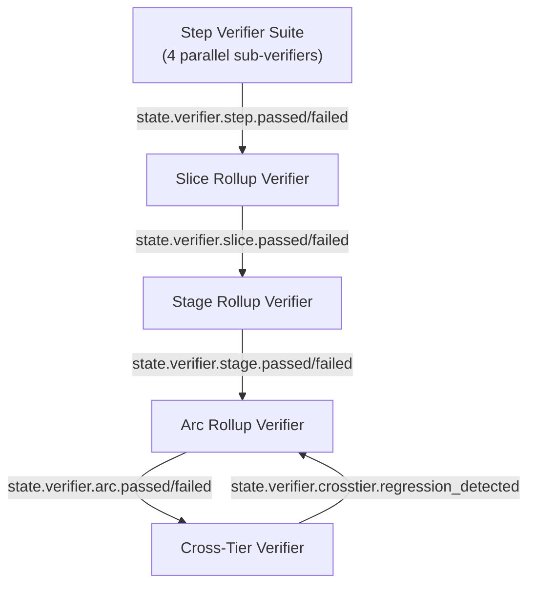

# Verifier Chain — Milestone v42

> **Design contract for v14 Build Kernel and v15 Build Core Commands.**
> Owned by: Phase 407 (Verifier Chain Architecture).
> Forward-reference invariant: rows below cite forward-phase REQ-IDs; deep algorithm spec lives in Phases 408–411.
> Pure-machine across the entire chain — no LLM-as-judge anywhere (pre-empts Phase 409 ADV debate in the negative, carries forward v41 PRF-04).

## Overview

The verifier chain is composed of **five verifier scopes** that cover every tier of the canonical Arc → Stage → Slice → Step hierarchy plus a state-novel cross-tier regression detector:

- **Step (VCH-01)** — a fan-out suite of four parallel sub-verifiers: **goal-backward** (must-have satisfaction over derived acceptance criteria), **security** (STRIDE-register disposition + secret detection), **stub-detector** (AST + call-chain trace-through of empty/placeholder code), **anti-pattern** (Python 3.12 + architecture + test anti-pattern catalogs with deterministic auto-fix on the fixable subset).
- **Slice rollup (VCH-02)** — pure aggregator over child Steps + the verify-slice integration check.
- **Stage rollup (VCH-03)** — pure aggregator over child Slices + the Stage acceptance check against CRIT.md must_haves.
- **Arc rollup (VCH-04)** — pure aggregator over child Stages + the Arc acceptance check.
- **Cross-Tier (VCH-05)** — state-specific regression detector over the depends_on closure of already-shipped Arcs, fired as the final gate of `/state-ship-arc`.

Every algorithm in this document is deterministic — AST walkers (Python `ast.NodeVisitor`), grep regex over `files_modified`, `pathlib` existence checks, `events.sqlite` queries via `aiosqlite`, `pygit2` for git evidence, `ruff` for anti-pattern fixable patterns, subprocess invocation of test runners. No LLM-as-judge anywhere in the verifier chain.

## Verifier-Chain Topology



The daemon listens on the v6 SSE bus for any `state.verifier.<child>.{passed,failed}` event. On any child verdict-flip event, daemon re-runs the parent rollup verifier (pure-machine, no LLM); the composite verdict updates idempotently and `state.verifier.verdict_changed` fires at each tier whose verdict flipped. Re-aggregation cost is bounded to parents of changed children in `open` state — already-shipped scopes have immutable verdicts in the event log.

Edge semantics:

- **Step → Slice**: every child Step's composite verdict aggregates into the Slice rollup; Slice rollup is also gated on the verify-slice integration check (Phase 402 SLC-XX output).
- **Slice → Stage**: every child Slice's verdict aggregates into the Stage rollup; Stage rollup is also gated on the Stage acceptance check against CRIT.md must_haves.
- **Stage → Arc**: every child Stage's verdict aggregates into the Arc rollup; Arc rollup is also gated on the Arc acceptance check against Arc-tier CRIT.md must_haves.
- **Arc → Cross-Tier**: VCH-05 fires *after* VCH-04 passes and CAN fail the Arc by setting the Cross-Tier verdict to `regression_detected`. This is the only edge in the topology where a parent can fail its child's apparent verdict.

## Verdict Vocabulary

```python
from typing import Literal
Verdict = Literal["passed", "failed", "warning"]
```

| Verdict | Semantics | Propagation |
|---|---|---|
| `passed` | all checks green; no BLOCKER findings | carries forward upward without escalation |
| `failed` | ≥1 BLOCKER finding | halts upward propagation; parent rollup also `failed`; failure_mode ladder fires |
| `warning` | WARNING-only findings (no BLOCKER) | carries forward upward; advisory event for human/audit; does NOT block ship |

Mapping to downstream / related specs:

| Source | Source value | Maps to |
|---|---|---|
| Phase 408 STB-02 | BLOCKER | `failed` |
| Phase 408 STB-02 | WARNING | `warning` |
| Phase 408 STB-02 | KNOWN | excluded from verdict (registered out via STB-04) |
| Phase 411 PCK-10 | `blocked` | `failed` (at plan-checker scope) |
| Phase 411 PCK-10 | `warnings` | `warning` |
| Phase 411 PCK-10 | `passed` | `passed` |

Rejected for state because `omitted` collides semantically with v40 D-14 `deferred` and v41 SRP-06 `deferred-items.md`. State's `warning` covers the noteworthy-but-not-blocking case; explicit deferment is its own artifact. The prior project's `pass | flag | omitted` triad (kb §8.7) is therefore not adopted.

## Per-Tier VERIFY Artifact

| Tier | Artifact filename | Required sections | Author |
|---|---|---|---|
| Step | `stepNVERIFY.md` (alongside `stepNPLAN.md` + `stepNSUMMARY.md`) | `## Goal-Backward` / `## Security` / `## Stub-Detector` / `## Anti-Pattern` + composite verdict in frontmatter | server-written (verifier orchestrator) |
| Slice | `N-VERIFICATION.md` (existing v41 SLC artifact, amended) | `## Step Verdict Table` (one row per child Step) + `## Slice Integration Check` | server-written |
| Stage | `STAGE-VERIFY.md` (new artifact) | `## Slice Verdict Table` + `## Stage Acceptance Check` (against CRIT.md must_haves) | server-written |
| Arc | `ARC-VERIFY.md` (new artifact) | `## Stage Verdict Table` + `## Arc Acceptance Check` + `## Cross-Tier Verdict` block | server-written |

All VERIFY artifacts are server-written by the verifier orchestrator. Agents have zero authorship privilege on any VERIFY.md. A `tool.execute.before` write-block rejects any agent Write/Edit targeting `*VERIFY.md` paths (extends v41 SRP-04 allowlist enforcement). Matches v40 D-401-09 agent-vs-projector authorship boundary.

Phase 411 EVD-03 walker traverses this chain upward (`stepNVERIFY → stepNPLAN → STEP-file → SLICE → STAGE → ARC`); the per-tier-VERIFY-artifact rule is what makes the walk possible.

## VCH-01 — Step Verifier Suite

The Step verifier suite is composed of **four parallel sub-verifiers** — goal-backward, security, stub-detector, anti-pattern — running independently via opencode `task` subagent fan-out (Phase 405 SUB-01 `dispatch_subagent` typed-spawn surface). The composite Step verdict is server-recomputed (never LLM-summarized; matches kb quality-enforcement §11.5). Composite evidence list = union of all 4 sub-verifier evidence lists. All citations follow the canonical citation grammar (Phase 409 ADV-03): `file_path:line_number`, `commit:<hash>`, `event:<id>`, `test:<runner-output-id>`.

**Short-circuit policy.** Always run all 4 sub-verifiers; collect full evidence. No early termination on first BLOCKER. The agent receives all sub-verifier findings in one failureContext re-injection (kb §4.1 server-side merge), so a single retry can address all four classes of failure rather than fix-retry-fix-retry serial cycles.

### Sub-verifier: goal-backward

| Field | Spec |
|---|---|
| `inputs` | STEP.md goal text + ARC/STAGE/SLICE success-criteria blocks + REQ-IDs cited in STEP.md + locked decisions from DISCUSS.md; must_haves frontmatter from PLAN.md |
| `algorithm` | Deterministic must-have derivation (Phase 409 GBP-01); for each derived must-have, find codebase evidence via the 4 evidence types (code-exists via `pathlib` + AST match; tests-pass via test-runner subprocess invocation; LSP-clean via `ruff check` / `pyright`; behavioral-check via cited runnable assertion). Falsification-first stance per Phase 409 ADV-01. |
| `outputs` | `## Goal-Backward` section of `stepNVERIFY.md` + `state.verifier.step.goal_backward.passed` or `state.verifier.step.goal_backward.failed` event |
| `failure_mode` | retry-loop → human-gate. Re-dispatch agent with missing-must-have evidence (kb §4.3 recoverable failure). 3-strike → human gate via opencode `question` tool (v41 HRN-06). |
| `evidence` | List of `Citation` (Phase 409 ADV-03 grammar) per must-have: ≥1 of {file:line, commit:hash, event:id, test:runner-output-id}. SUMMARY.md claims do NOT count as evidence (Phase 409 GBP-04 trust rule). |

**Event emissions:** `state.verifier.step.goal_backward.passed` on full must-have satisfaction; `state.verifier.step.goal_backward.failed` on any unsatisfied derived must-have.

**Forward-reference:** Deep design in Phase 409, REQ-IDs GBP-01..05 + ADV-01..04.

### Sub-verifier: security

| Field | Spec |
|---|---|
| `inputs` | PLAN.md STRIDE register (THM-01) + accepted-risks registry (THM-04) + cited mitigation files + `files_modified` allowlist |
| `algorithm` | Per Phase 410 THM-03 disposition logic: for `mitigate` threats — grep/AST-check mitigation pattern in cited files; for `accept` threats — verify entry in accepted-risks registry with valid `accepted_by`; for `transfer` threats — verify transfer doc exists and target system verified. Secret-detection via `src/state_core/observability/redactor.py` reused over `files_modified` diffs. |
| `outputs` | `## Security` section of `stepNVERIFY.md` + `state.verifier.step.security.passed` or `state.verifier.step.security.failed` event |
| `failure_mode` | retry-loop → human-gate. Re-dispatch agent with mitigation-missing evidence cited `file:line`. 3-strike → human gate. |
| `evidence` | Per-STRIDE-category verdict (CLOSED / OPEN:BLOCKER / WARNING) with citations to cited mitigation files + registry entries. |

**Forward-reference:** Deep design in Phase 410, REQ-IDs THM-01..05.

### Sub-verifier: stub-detector

| Field | Spec |
|---|---|
| `inputs` | `files_modified` set + SUMMARY.md `## Known Stubs` section (STB-04) + AST of changed Python files + import graph |
| `algorithm` | Stub pattern catalog (STB-01) detected via AST walker (`ast.NodeVisitor`) + grep over files_modified; matched stubs classified per severity (STB-02: BLOCKER/WARNING/KNOWN); trace-through algorithm (STB-03) walks all callers via import-graph traversal; promote to BLOCKER if emptiness reaches rendering/API surface, demote to WARNING if handled gracefully; legitimate-stub disambiguation (LVL-06) cross-references `## Known Stubs` before promoting. |
| `outputs` | `## Stub-Detector` section of `stepNVERIFY.md` + `state.verifier.step.stub_detector.passed` or `state.verifier.step.stub_detector.failed` event |
| `failure_mode` | retry-loop → human-gate. Re-dispatch agent with stub-trace evidence (call-chain to user surface). 3-strike → human gate. Known-Stubs registration (STB-04) bypasses by promoting to KNOWN tier before counter triggers. |
| `evidence` | Per-stub Citation list: `file:line` of stub + call-chain Citations to user-surface (rendering/API) where reachability promotes to BLOCKER. |

**Forward-reference:** Deep design in Phase 408, REQ-IDs STB-01..04 + LVL-04..06.

### Sub-verifier: anti-pattern

| Field | Spec |
|---|---|
| `inputs` | `files_modified` set + Python 3.12 anti-pattern catalog (APS-01) + architecture anti-pattern catalog (APS-02, extending `src/state_core/import_lint.py`) + test anti-pattern catalog (APS-03) + project-specific extensions (APS-05) |
| `algorithm` | Per-pattern detection via {regex, AST node match, ruff rule ID, import-graph query}; severity classification per APS-01/APS-02/APS-03 BLOCKER/WARNING tables; fixable-pattern subset (unused imports, formatting, ordering) routed through deterministic auto-fix tier (VCH-06 below). |
| `outputs` | `## Anti-Pattern` section of `stepNVERIFY.md` + `state.verifier.step.anti_pattern.passed` or `state.verifier.step.anti_pattern.failed` event |
| `failure_mode` | auto-fix-attempt → retry-loop → human-gate. Harness first runs deterministic formatter pass (`ruff --fix`, `black`, `isort`) for fixable patterns. Remaining violations re-dispatch agent. After 3 retries on same `(pattern, file)` pair, human gate. |
| `evidence` | Per-violation Citation: `file:line` + pattern ID (ruff rule ID or AST match name) + severity. |

**Forward-reference:** Deep design in Phase 410, REQ-IDs APS-01..05.

### Composite Step Verdict

Step verdict = `passed` iff all 4 sub-verifiers return `passed` or `warning` (no BLOCKER). Any BLOCKER from any sub-verifier → Step verdict = `failed`. Server-recomputed via the daemon's projector (kb §11.5); never LLM-summarized. Composite event: `state.verifier.step.passed` or `state.verifier.step.failed`. Composite evidence list = union of all 4 sub-verifier evidence lists. Retry counter scope: per-`(task_id, check_id)` per v41 PRF-06 (no scope conflation across sub-verifiers; each sub-verifier maintains its own 3-strike counter).
