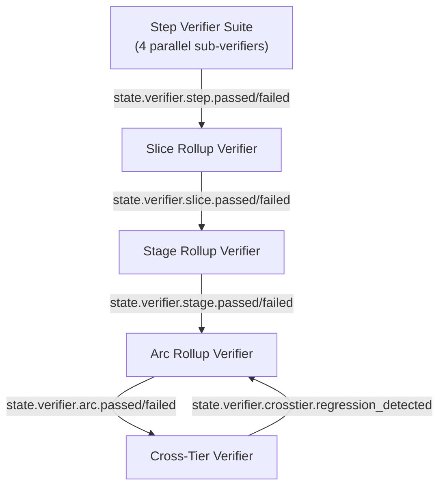

# Verifier Chain — Milestone v42

> **Design contract for v14 Build Kernel and v15 Build Core Commands.**
> Owned by: Phase 407 (Verifier Chain Architecture).
> Forward-reference invariant: rows below cite forward-phase REQ-IDs; deep algorithm spec lives in Phases 408–411.
> Pure-machine across the entire chain — no LLM-as-judge anywhere (pre-empts Phase 409 ADV debate in the negative, carries forward v41 PRF-04).

## Overview

The verifier chain is composed of **five verifier scopes** that cover every tier of the canonical Arc → Stage → Slice → Step hierarchy plus a state-novel cross-tier regression detector:

- **Step (VCH-01)** — a fan-out suite of four parallel sub-verifiers: **goal-backward** (must-have satisfaction over derived acceptance criteria), **security** (STRIDE-register disposition + secret detection), **stub-detector** (AST + call-chain trace-through of empty/placeholder code), **anti-pattern** (Python 3.12 + architecture + test anti-pattern catalogs with deterministic auto-fix on the fixable subset).
- **Slice rollup (VCH-02)** — pure aggregator over child Steps + the verify-slice integration check.
- **Stage rollup (VCH-03)** — pure aggregator over child Slices + the Stage acceptance check against CRIT.md must_haves.
- **Arc rollup (VCH-04)** — pure aggregator over child Stages + the Arc acceptance check.
- **Cross-Tier (VCH-05)** — state-specific regression detector over the depends_on closure of already-shipped Arcs, fired as the final gate of `/state-ship-arc`.

Every algorithm in this document is deterministic — AST walkers (Python `ast.NodeVisitor`), grep regex over `files_modified`, `pathlib` existence checks, `events.sqlite` queries via `aiosqlite`, `pygit2` for git evidence, `ruff` for anti-pattern fixable patterns, subprocess invocation of test runners. No LLM-as-judge anywhere in the verifier chain.

## Verifier-Chain Topology



The daemon listens on the v6 SSE bus for any `state.verifier.<child>.{passed,failed}` event. On any child verdict-flip event, daemon re-runs the parent rollup verifier (pure-machine, no LLM); the composite verdict updates idempotently and `state.verifier.verdict_changed` fires at each tier whose verdict flipped. Re-aggregation cost is bounded to parents of changed children in `open` state — already-shipped scopes have immutable verdicts in the event log.

Edge semantics:

- **Step → Slice**: every child Step's composite verdict aggregates into the Slice rollup; Slice rollup is also gated on the verify-slice integration check (Phase 402 SLC-XX output).
- **Slice → Stage**: every child Slice's verdict aggregates into the Stage rollup; Stage rollup is also gated on the Stage acceptance check against CRIT.md must_haves.
- **Stage → Arc**: every child Stage's verdict aggregates into the Arc rollup; Arc rollup is also gated on the Arc acceptance check against Arc-tier CRIT.md must_haves.
- **Arc → Cross-Tier**: VCH-05 fires *after* VCH-04 passes and CAN fail the Arc by setting the Cross-Tier verdict to `regression_detected`. This is the only edge in the topology where a parent can fail its child's apparent verdict.

## Verdict Vocabulary

```python
from typing import Literal
Verdict = Literal["passed", "failed", "warning"]
```

| Verdict | Semantics | Propagation |
|---|---|---|
| `passed` | all checks green; no BLOCKER findings | carries forward upward without escalation |
| `failed` | ≥1 BLOCKER finding | halts upward propagation; parent rollup also `failed`; failure_mode ladder fires |
| `warning` | WARNING-only findings (no BLOCKER) | carries forward upward; advisory event for human/audit; does NOT block ship |

Mapping to downstream / related specs:

| Source | Source value | Maps to |
|---|---|---|
| Phase 408 STB-02 | BLOCKER | `failed` |
| Phase 408 STB-02 | WARNING | `warning` |
| Phase 408 STB-02 | KNOWN | excluded from verdict (registered out via STB-04) |
| Phase 411 PCK-10 | `blocked` | `failed` (at plan-checker scope) |
| Phase 411 PCK-10 | `warnings` | `warning` |
| Phase 411 PCK-10 | `passed` | `passed` |

Rejected for state because `omitted` collides semantically with v40 D-14 `deferred` and v41 SRP-06 `deferred-items.md`. State's `warning` covers the noteworthy-but-not-blocking case; explicit deferment is its own artifact. The prior project's `pass | flag | omitted` triad (kb §8.7) is therefore not adopted.

## Per-Tier VERIFY Artifact

| Tier | Artifact filename | Required sections | Author |
|---|---|---|---|
| Step | `stepNVERIFY.md` (alongside `stepNPLAN.md` + `stepNSUMMARY.md`) | `## Goal-Backward` / `## Security` / `## Stub-Detector` / `## Anti-Pattern` + composite verdict in frontmatter | server-written (verifier orchestrator) |
| Slice | `N-VERIFICATION.md` (existing v41 SLC artifact, amended) | `## Step Verdict Table` (one row per child Step) + `## Slice Integration Check` | server-written |
| Stage | `STAGE-VERIFY.md` (new artifact) | `## Slice Verdict Table` + `## Stage Acceptance Check` (against CRIT.md must_haves) | server-written |
| Arc | `ARC-VERIFY.md` (new artifact) | `## Stage Verdict Table` + `## Arc Acceptance Check` + `## Cross-Tier Verdict` block | server-written |

All VERIFY artifacts are server-written by the verifier orchestrator. Agents have zero authorship privilege on any VERIFY.md. A `tool.execute.before` write-block rejects any agent Write/Edit targeting `*VERIFY.md` paths (extends v41 SRP-04 allowlist enforcement). Matches v40 D-401-09 agent-vs-projector authorship boundary.

Phase 411 EVD-03 walker traverses this chain upward (`stepNVERIFY → stepNPLAN → STEP-file → SLICE → STAGE → ARC`); the per-tier-VERIFY-artifact rule is what makes the walk possible.
